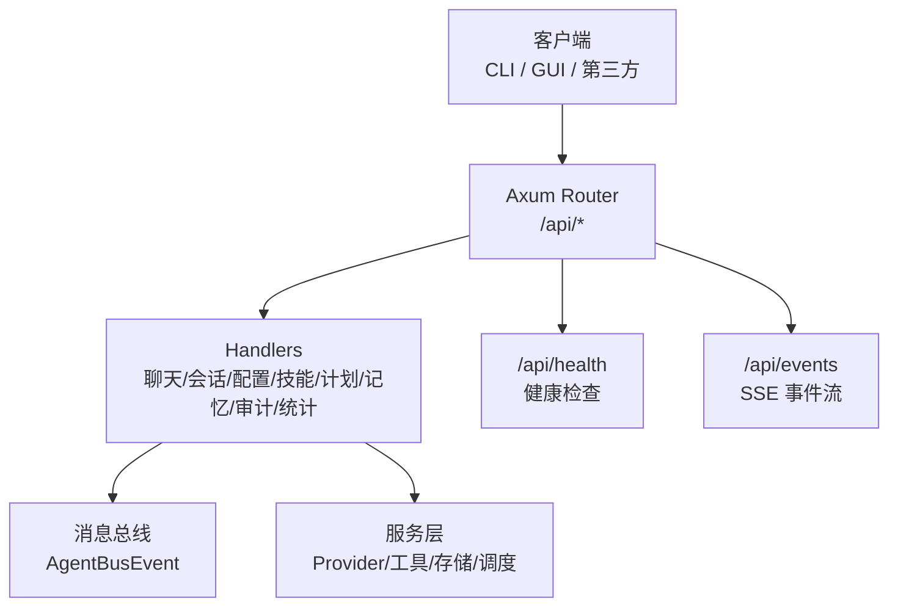
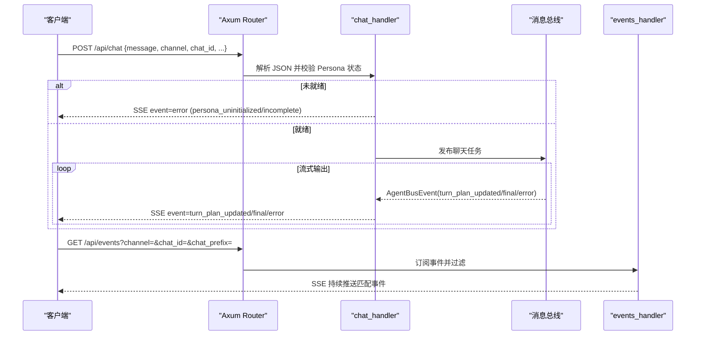
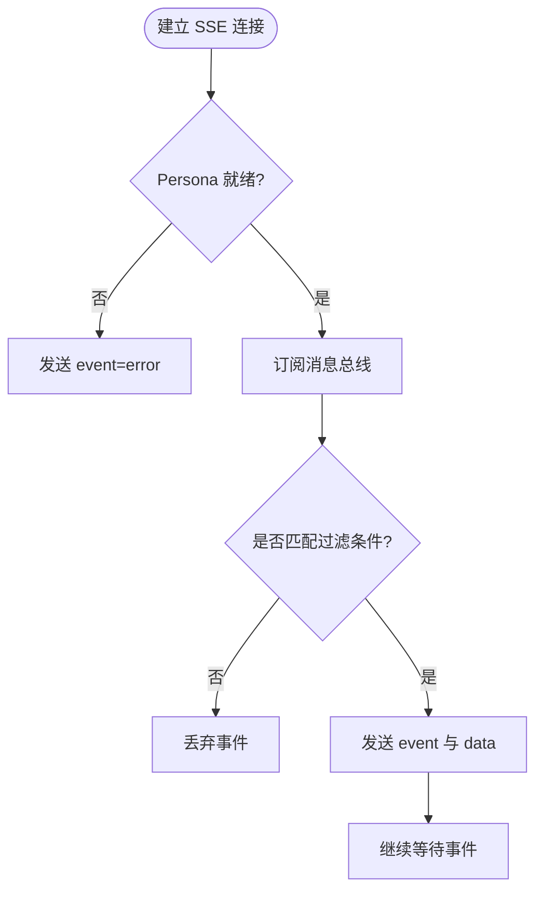
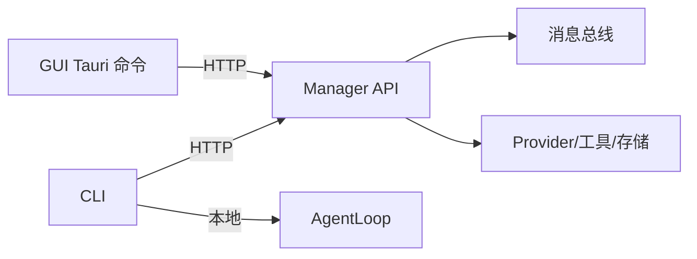

# API 参考

<cite>
**本文引用的文件**
- [server.rs](file://agent-diva-manager/src/server.rs)
- [handlers.rs](file://agent-diva-manager/src/handlers.rs)
- [health.rs](file://agent-diva-manager/src/handlers/health.rs)
- [main.rs](file://agent-diva-cli/src/main.rs)
- [chat_commands.rs](file://agent-diva-cli/src/chat_commands.rs)
- [commands.rs](file://agent-diva-gui/src-tauri/src/commands.rs)
- [rate_limiter.rs](file://agent-diva-core/src/rate_limiter.rs)
- [retry.rs](file://agent-diva-providers/src/retry.rs)
</cite>

## 目录
1. [简介](#简介)
2. [项目结构](#项目结构)
3. [核心组件](#核心组件)
4. [架构总览](#架构总览)
5. [详细组件分析](#详细组件分析)
6. [依赖关系分析](#依赖关系分析)
7. [性能与速率限制](#性能与速率限制)
8. [故障排查指南](#故障排查指南)
9. [结论](#结论)
10. [附录：API 端点清单与示例](#附录api-端点清单与示例)

## 简介
本参考文档面向集成开发者，系统化说明 Agent Diva 的 RESTful API、实时事件流（SSE）、CLI 命令以及安全与兼容性要点。内容基于管理器 HTTP 路由、处理器、健康检查、CLI 入口、GUI Tauri 桥接、速率限制与重试策略等源码实现整理而成。

## 项目结构
Agent Diva 通过管理器进程暴露 HTTP 接口，CLI 和 GUI 作为客户端调用；内部通过消息总线与子模块协作。关键路径：
- 管理器 HTTP 路由与中间件：[server.rs](file://agent-diva-manager/src/server.rs)
- 各业务处理器与 SSE 事件流：[handlers.rs](file://agent-diva-manager/src/handlers.rs)
- 健康与心跳：[health.rs](file://agent-diva-manager/src/handlers/health.rs)
- CLI 命令定义与远程调用：[main.rs](file://agent-diva-cli/src/main.rs)、[chat_commands.rs](file://agent-diva-cli/src/chat_commands.rs)
- GUI Tauri 命令（代理到 Manager API）：[commands.rs](file://agent-diva-gui/src-tauri/src/commands.rs)
- 速率限制与重试：[rate_limiter.rs](file://agent-diva-core/src/rate_limiter.rs)、[retry.rs](file://agent-diva-providers/src/retry.rs)

**图表来源**
- [server.rs:94-113](file://agent-diva-manager/src/server.rs#L94-L113)
- [handlers.rs:137-200](file://agent-diva-manager/src/handlers.rs#L137-L200)
- [handlers.rs:617-656](file://agent-diva-manager/src/handlers.rs#L617-L656)
- [health.rs:32-72](file://agent-diva-manager/src/handlers/health.rs#L32-L72)

**章节来源**
- [server.rs:94-113](file://agent-diva-manager/src/server.rs#L94-L113)

## 核心组件
- 管理器 HTTP 服务器：监听本地端口，挂载路由组，启用 CORS 与请求追踪。
- 聊天与会话：POST /api/chat 返回 SSE 流；支持停止生成；会话列表、历史、标题更新与重置。
- 事件订阅：GET /api/events 提供过滤后的 SSE 事件流。
- 配置与工具：获取/更新配置、工具开关、频道设置。
- 技能市场与管理：上传、查询、安装、禁用、历史版本。
- 提供者模型管理：列出、添加、删除模型，解析提供者。
- 计划执行：创建报告、追加修订、批准、查看活跃执行与待办。
- 记忆与规则：记录 CRUD、ActMem 读写、Capsules 管理、MemRules 更新。
- 审计与日志：审计日志与事件查询。
- 令牌统计：用量摘要、时间线、会话维度统计。
- 健康与心跳：服务就绪状态与组件健康。

**章节来源**
- [server.rs:115-382](file://agent-diva-manager/src/server.rs#L115-L382)
- [handlers.rs:83-135](file://agent-diva-manager/src/handlers.rs#L83-L135)

## 架构总览
下图展示了典型聊天流程：客户端向 /api/chat 发送 JSON，服务端校验 Persona 状态后进入处理，并通过 SSE 推送最终响应或错误事件；同时 /api/events 可订阅全局事件。

**图表来源**
- [handlers.rs:137-200](file://agent-diva-manager/src/handlers.rs#L137-L200)
- [handlers.rs:583-656](file://agent-diva-manager/src/handlers.rs#L583-L656)

## 详细组件分析

### RESTful API 端点
- 基础路径：/api
- 认证方式：当前路由未内置鉴权中间件；生产部署建议前置反向代理进行访问控制。
- 通用请求头：Content-Type: application/json（JSON 接口）。
- 通用响应：成功通常返回 2xx 与 JSON body；错误返回对应状态码与包含 code/message 的 JSON。

主要分组与端点（节选）：
- 运行时
  - POST /api/chat：发起聊天，返回 SSE 流。
  - POST /api/chat/stop：停止当前生成。
  - GET /api/sessions：列出会话。
  - GET /api/sessions/:id：获取会话历史。
  - DELETE/POST /api/sessions/:id：删除会话。
  - PATCH /api/sessions/:id/title：更新标题。
  - POST /api/sessions/:id/generate-title：自动生成标题。
  - POST /api/sessions/reset：重置会话。
  - GET /api/config：读取配置。
  - POST /api/config：更新配置。
  - GET /api/workspace：工作区状态。
  - GET/POST /api/channels：获取/更新频道。
  - GET/POST /api/tools：获取/更新工具开关。
- 技能与市场
  - GET/POST /api/skills：列出/上传技能。
  - GET /api/skills/marketplace/search：搜索市场技能。
  - POST /api/skills/marketplace/install：安装技能。
  - GET /api/skills/marketplace/featured：热门技能。
  - GET/PUT/DELETE /api/skills/:slug：查询/更新/删除技能。
  - POST /api/skills/:slug/disable：禁用技能。
  - GET /api/skills/:slug/history：历史版本。
  - GET /api/skills/:slug/history/:revision：指定版本。
  - GET/POST /api/evolution/requests：变更请求列表/创建。
  - GET /api/evolution/requests/:id：详情。
  - POST /api/evolution/requests/:id/accept|reject：审批。
- 提供者与模型
  - GET/POST /api/providers：列出/创建自定义提供者。
  - POST /api/providers/resolve：解析提供者 ID。
  - GET/PUT/DELETE /api/providers/:name：CRUD 提供者。
  - GET/POST /api/providers/:name/models：列出/添加模型。
  - DELETE /api/providers/:name/models/:model_id：删除模型。
- 计划执行
  - GET/POST /api/plan-reports：列表/创建报告。
  - POST /api/plan-reports/:report_id/revisions：追加修订。
  - POST /api/plan-reports/:report_id/approve：批准报告。
  - GET /api/plan-executions/active：活跃执行。
  - GET /api/plan-executions/:execution_id/todos：待办列表。
  - PATCH /api/plan-executions/:execution_id/todos/:todo_id：更新待办。
- 记忆与规则
  - GET/POST /api/memory/records：列表/创建记录。
  - GET/PATCH/DELETE /api/memory/records/:id：CRUD 记录。
  - GET/PUT /api/memory/actmem：读取/写入 ActMem。
  - GET /api/memory/actmem/capsules：列出 Capsules。
  - GET/DELETE /api/memory/actmem/capsules/:name：读取/删除 Capsule。
  - GET/PUT /api/memory/memrules：读取/更新 MemRules。
- MCP 与定时任务
  - GET/POST /api/mcps：列出/创建 MCP。
  - PUT/DELETE /api/mcps/:name：更新/删除 MCP。
  - POST /api/mcps/:name/enable：启用。
  - POST /api/mcps/:name/refresh：刷新状态。
  - GET/POST /api/cron/jobs：列表/创建定时任务。
  - GET/PUT/DELETE /api/cron/jobs/:id：CRUD 任务。
  - POST /api/cron/jobs/:id/enable：启用/禁用。
  - POST /api/cron/jobs/:id/run|stop：手动运行/停止。
- 审计与统计
  - GET /api/audit/log|/api/audit/events：审计日志/事件。
  - GET /api/stats/tokens/...：令牌用量统计（摘要/时间线/会话）。
- 健康与心跳
  - GET /api/health：健康检查。
  - GET /api/heartbeat：心跳。

注意：
- 文件上传：POST /api/files/upload，最大 50MB。
- 事件流：GET /api/events，支持 channel、chat_id、chat_prefix 过滤。

**章节来源**
- [server.rs:115-382](file://agent-diva-manager/src/server.rs#L115-L382)
- [handlers.rs:83-135](file://agent-diva-manager/src/handlers.rs#L83-L135)

### WebSocket 实时通信接口
- 本项目对外暴露的是 Server-Sent Events（SSE），而非 WebSocket。
- 事件流：
  - /api/chat：聊天结果以 SSE 流返回，事件类型包括 final、error、turn_plan_updated。
  - /api/events：订阅全局事件，按 channel/chat_id/chat_prefix 过滤。
- 连接处理：
  - 使用 Axum Sse 保持长连接，带 keep-alive。
  - 若 Persona 未就绪，会立即返回 error 事件。
- 消息格式：
  - 事件名：final、error、turn_plan_updated。
  - 数据体：包含 channel、chat_id、content/message/args 等字段。

**图表来源**
- [handlers.rs:137-200](file://agent-diva-manager/src/handlers.rs#L137-L200)
- [handlers.rs:583-656](file://agent-diva-manager/src/handlers.rs#L583-L656)

**章节来源**
- [handlers.rs:137-200](file://agent-diva-manager/src/handlers.rs#L137-L200)
- [handlers.rs:583-656](file://agent-diva-manager/src/handlers.rs#L583-L656)

### CLI 命令完整语法与参数
- 入口命令：agent-diva
- 常用子命令：
  - agent：发送消息给 Agent，支持 --message、--model、--session、--markdown/--no-markdown、--logs/--no-logs、--approval-mode、--json。
  - chat：轻量交互式聊天，支持 --model、--session、--markdown/--no-markdown、--logs/--no-logs。
  - approvals：审批管理，list、decide、cancel、review。
  - tui：TUI 聊天界面。
  - status：显示状态。
  - channels：登录/状态。
  - provider：list、status、set、models、login。
  - config：path、init、refresh、validate、doctor、show。
  - service：Windows 服务管理。
  - cron：add、list、remove、enable、run。
  - workspace、todo、mask：工作区、待办、面具管理。
- 全局选项：
  - --config、--config-dir、--workspace、--remote、--api-url。

CLI 在本地模式直接构建 AgentLoop，在远程模式通过 ApiClient 调用 Manager API（默认 http://localhost:3000/api）。

**章节来源**
- [main.rs:59-205](file://agent-diva-cli/src/main.rs#L59-L205)
- [main.rs:258-381](file://agent-diva-cli/src/main.rs#L258-L381)
- [main.rs:441-773](file://agent-diva-cli/src/main.rs#L441-L773)
- [chat_commands.rs:79-144](file://agent-diva-cli/src/chat_commands.rs#L79-L144)

### API 调用示例（成功与错误）
- 聊天（SSE）
  - 请求：POST /api/chat，Body 包含 message、可选 channel/chat_id/mode 等。
  - 成功：HTTP 200，SSE 流中依次推送 turn_plan_updated、final 等事件。
  - 错误：若 Persona 未就绪，SSE 事件 event=error，data 包含 code=message 与 persona_status。
- 事件订阅
  - 请求：GET /api/events?channel=&chat_id=&chat_prefix=
  - 成功：HTTP 200，SSE 流推送匹配事件。
- 健康检查
  - 请求：GET /api/health
  - 成功：HTTP 200，status=ok；失败：HTTP 503，status=degraded，components 指示具体组件。

提示：
- 文件上传：POST /api/files/upload，multipart/form-data，上限 50MB。
- 技能上传：POST /api/skills，multipart/form-data，zip 包。

**章节来源**
- [handlers.rs:137-200](file://agent-diva-manager/src/handlers.rs#L137-L200)
- [handlers.rs:617-656](file://agent-diva-manager/src/handlers.rs#L617-L656)
- [health.rs:32-72](file://agent-diva-manager/src/handlers/health.rs#L32-L72)
- [server.rs:287-289](file://agent-diva-manager/src/server.rs#L287-L289)

### 认证机制与安全考虑
- 当前 HTTP 路由未内置鉴权中间件；所有 /api/* 由 CORS 放行且无身份校验。
- 建议：
  - 在生产环境前置于反向代理（如 Nginx/Traefik）进行 IP 白名单、TLS 终止与访问控制。
  - 如需细粒度权限，可在网关层增加 JWT/OAuth 校验并透传用户上下文。
- 敏感信息：
  - 配置中的密钥应通过环境变量或外部安全存储注入；CLI 支持 --api-key 等参数。
- 传输安全：
  - 建议使用 HTTPS；本地开发可通过自签证书或仅绑定 127.0.0.1。

**章节来源**
- [server.rs:94-113](file://agent-diva-manager/src/server.rs#L94-L113)
- [main.rs:79-85](file://agent-diva-cli/src/main.rs#L79-L85)

### 速率限制、版本兼容性与错误码
- 速率限制
  - 提供者侧：对 429 识别为 RateLimited，支持指数退避与抖动；若无 Retry-After 则 retry_after=None。
  - 内部限流：RateLimiter 基于令牌桶，按 key 独立限流，Exceeded 时提供 retry_after 秒数。
- 版本兼容性
  - 健康响应包含 version 字段；测试用例维护了路由契约，避免破坏性变更。
  - 旧路由被显式移除并断言 404，确保向后兼容边界清晰。
- 错误码约定
  - 404：路由不存在。
  - 409：冲突（如 skill_hash_conflict、skill_request_exists）。
  - 422：无效请求体或参数。
  - 503：队列/运行时不可用。
  - 500：持久化失败等内部错误。
  - 429：外部提供者限流（经 Provider 层分类）。

**章节来源**
- [retry.rs:49-75](file://agent-diva-providers/src/retry.rs#L49-L75)
- [rate_limiter.rs:23-29](file://agent-diva-core/src/rate_limiter.rs#L23-L29)
- [rate_limiter.rs:148-163](file://agent-diva-core/src/rate_limiter.rs#L148-L163)
- [server.rs:467-513](file://agent-diva-manager/src/server.rs#L467-L513)
- [server.rs:734-764](file://agent-diva-manager/src/server.rs#L734-L764)

## 依赖关系分析
- 管理器路由依赖 handlers 模块，handlers 依赖 AppState、消息总线与服务层。
- GUI Tauri 命令通过 HTTP 调用 Manager API，封装为 Tauri 命令供前端调用。
- CLI 在本地模式下直接构造 AgentLoop，在远程模式下通过 ApiClient 调用 Manager。

**图表来源**
- [commands.rs:488-800](file://agent-diva-gui/src-tauri/src/commands.rs#L488-L800)
- [main.rs:441-773](file://agent-diva-cli/src/main.rs#L441-L773)
- [handlers.rs:137-200](file://agent-diva-manager/src/handlers.rs#L137-L200)

**章节来源**
- [commands.rs:488-800](file://agent-diva-gui/src-tauri/src/commands.rs#L488-L800)
- [main.rs:441-773](file://agent-diva-cli/src/main.rs#L441-L773)

## 性能与速率限制
- SSE 流：keep-alive 保活，适合长时间运行的聊天与事件订阅。
- 文件上传：限制 50MB，避免过大请求影响吞吐。
- 提供者重试：指数退避 + 抖动，降低雪崩风险；429 识别为限流，5xx 自动重试。
- 内部限流：令牌桶按 key 隔离，Exceeded 时提供 retry_after 指导客户端重试。

**章节来源**
- [handlers.rs:137-200](file://agent-diva-manager/src/handlers.rs#L137-L200)
- [server.rs:287-289](file://agent-diva-manager/src/server.rs#L287-L289)
- [retry.rs:39-75](file://agent-diva-providers/src/retry.rs#L39-L75)
- [rate_limiter.rs:125-163](file://agent-diva-core/src/rate_limiter.rs#L125-L163)

## 故障排查指南
- 无法收到 SSE 事件
  - 检查 /api/events 是否返回 200 并持续推送。
  - 确认 channel/chat_id/chat_prefix 过滤是否正确。
- 聊天返回 persona 未就绪
  - 先调用 /api/persona/initialize 完成初始化。
- 健康检查 503
  - 查看 components 中 critical 组件状态，定位问题（如 audit_sink、cron、memory）。
- 技能上传冲突
  - 检查 base_hash/content_hash，避免重复提交。
- 外部提供者限流
  - 观察 429 响应，按 retry_after 重试；或使用指数退避。

**章节来源**
- [handlers.rs:137-200](file://agent-diva-manager/src/handlers.rs#L137-L200)
- [health.rs:32-72](file://agent-diva-manager/src/handlers/health.rs#L32-L72)
- [server.rs:467-513](file://agent-diva-manager/src/server.rs#L467-L513)
- [retry.rs:49-75](file://agent-diva-providers/src/retry.rs#L49-L75)

## 结论
Agent Diva 提供了一套以 REST + SSE 为核心的 API，覆盖聊天、会话、配置、技能、计划、记忆、审计与统计等能力。当前路由未内置鉴权，建议在网关层加强安全。结合内部限流与提供者重试机制，系统具备良好的稳定性与可扩展性。集成时应遵循事件流协议、错误码约定与速率限制策略，以获得最佳体验。

## 附录：API 端点清单与示例

### 聊天与会话
- POST /api/chat
  - 请求体：{ message, channel?, chat_id?, mode?, execution_start?, plan_id?, plan_revision?, execution_id?, approval_policy? }
  - 响应：SSE 流，事件 final/error/turn_plan_updated
- POST /api/chat/stop
  - 请求体：空或携带 channel/chat_id
  - 响应：SSE 事件 error，内容为停止结果
- GET /api/sessions
  - 响应：会话列表
- GET /api/sessions/:id
  - 响应：会话历史
- DELETE/POST /api/sessions/:id
  - 响应：删除结果
- PATCH /api/sessions/:id/title
  - 响应：标题更新结果
- POST /api/sessions/:id/generate-title
  - 响应：生成的标题
- POST /api/sessions/reset
  - 响应：重置结果

**章节来源**
- [server.rs:204-224](file://agent-diva-manager/src/server.rs#L204-L224)
- [handlers.rs:137-200](file://agent-diva-manager/src/handlers.rs#L137-L200)

### 事件订阅
- GET /api/events?channel=&chat_id=&chat_prefix=
  - 响应：SSE 流，推送匹配事件

**章节来源**
- [server.rs:208-208](file://agent-diva-manager/src/server.rs#L208-L208)
- [handlers.rs:617-656](file://agent-diva-manager/src/handlers.rs#L617-L656)

### 配置与工具
- GET /api/config
  - 响应：配置快照
- POST /api/config
  - 请求体：配置更新
  - 响应：更新结果
- GET/POST /api/tools
  - 响应：工具开关列表/更新结果
- GET/POST /api/channels
  - 响应：频道列表/更新结果

**章节来源**
- [server.rs:225-241](file://agent-diva-manager/src/server.rs#L225-L241)

### 技能与市场
- GET/POST /api/skills
  - 响应：技能列表/上传结果
- GET /api/skills/marketplace/search
  - 响应：搜索结果
- POST /api/skills/marketplace/install
  - 响应：安装结果
- GET /api/skills/marketplace/featured
  - 响应：热门技能
- GET/PUT/DELETE /api/skills/:slug
  - 响应：技能详情/更新/删除结果
- POST /api/skills/:slug/disable
  - 响应：禁用结果
- GET /api/skills/:slug/history
  - 响应：历史版本列表
- GET /api/skills/:slug/history/:revision
  - 响应：指定版本详情

**章节来源**
- [server.rs:242-269](file://agent-diva-manager/src/server.rs#L242-L269)

### 计划执行
- GET/POST /api/plan-reports
  - 响应：报告列表/创建结果
- POST /api/plan-reports/:report_id/revisions
  - 响应：追加修订结果
- POST /api/plan-reports/:report_id/approve
  - 响应：批准结果
- GET /api/plan-executions/active
  - 响应：活跃执行
- GET /api/plan-executions/:execution_id/todos
  - 响应：待办列表
- PATCH /api/plan-executions/:execution_id/todos/:todo_id
  - 响应：更新结果

**章节来源**
- [server.rs:338-369](file://agent-diva-manager/src/server.rs#L338-L369)

### 记忆与规则
- GET/POST /api/memory/records
  - 响应：记录列表/创建结果
- GET/PATCH/DELETE /api/memory/records/:id
  - 响应：记录详情/更新/删除结果
- GET/PUT /api/memory/actmem
  - 响应：ActMem 读取/写入结果
- GET /api/memory/actmem/capsules
  - 响应：Capsules 列表
- GET/DELETE /api/memory/actmem/capsules/:name
  - 响应：Capsule 详情/删除结果
- GET/PUT /api/memory/memrules
  - 响应：MemRules 读取/更新结果

**章节来源**
- [server.rs:136-164](file://agent-diva-manager/src/server.rs#L136-L164)

### MCP 与定时任务
- GET/POST /api/mcps
  - 响应：MCP 列表/创建结果
- PUT/DELETE /api/mcps/:name
  - 响应：更新/删除结果
- POST /api/mcps/:name/enable
  - 响应：启用结果
- POST /api/mcps/:name/refresh
  - 响应：刷新状态结果
- GET/POST /api/cron/jobs
  - 响应：任务列表/创建结果
- GET/PUT/DELETE /api/cron/jobs/:id
  - 响应：任务详情/更新/删除结果
- POST /api/cron/jobs/:id/enable
  - 响应：启用/禁用结果
- POST /api/cron/jobs/:id/run|stop
  - 响应：运行/停止结果

**章节来源**
- [server.rs:290-313](file://agent-diva-manager/src/server.rs#L290-L313)

### 审计与统计
- GET /api/audit/log
  - 响应：审计日志
- GET /api/audit/events
  - 响应：审计事件
- GET /api/stats/tokens/summary?period=&group_by=&tz_offset?
  - 响应：令牌用量摘要
- GET /api/stats/tokens/timeline?period=&interval?&tz_offset?
  - 响应：令牌用量时间线
- GET /api/stats/tokens/sessions?period=&limit=&tz_offset?
  - 响应：令牌用量会话

**章节来源**
- [server.rs:371-376](file://agent-diva-manager/src/server.rs#L371-L376)
- [commands.rs:7089-7135](file://agent-diva-gui/src-tauri/src/commands.rs#L7089-L7135)

### 健康与心跳
- GET /api/health
  - 响应：{ status, version, uptime_secs, components, memory }
- GET /api/heartbeat
  - 响应：心跳

**章节来源**
- [server.rs:378-382](file://agent-diva-manager/src/server.rs#L378-L382)
- [health.rs:32-72](file://agent-diva-manager/src/handlers/health.rs#L32-L72)