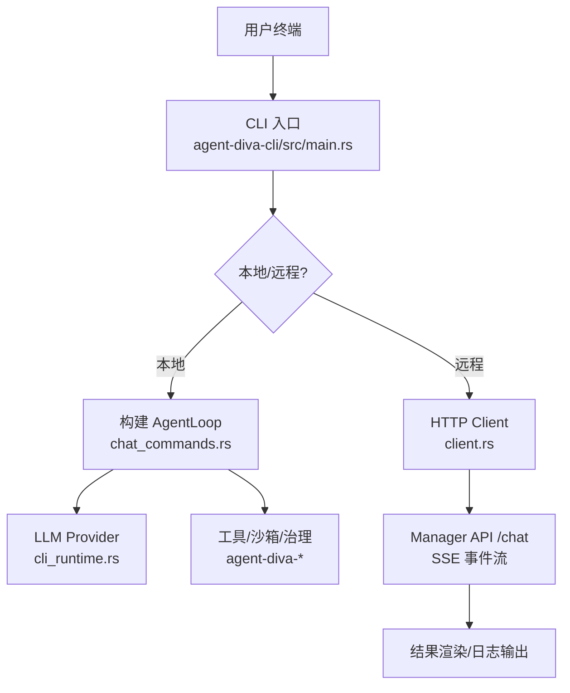
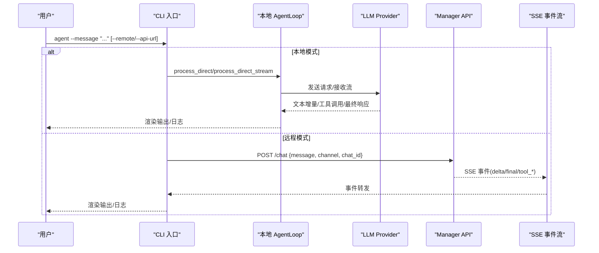
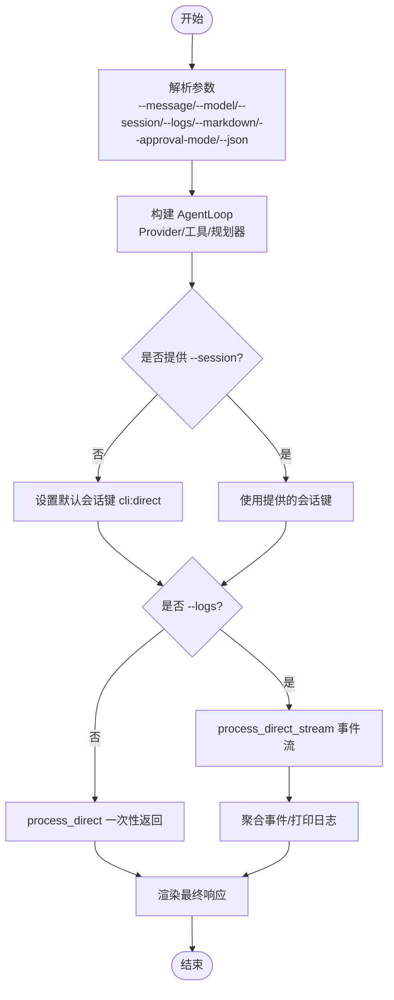
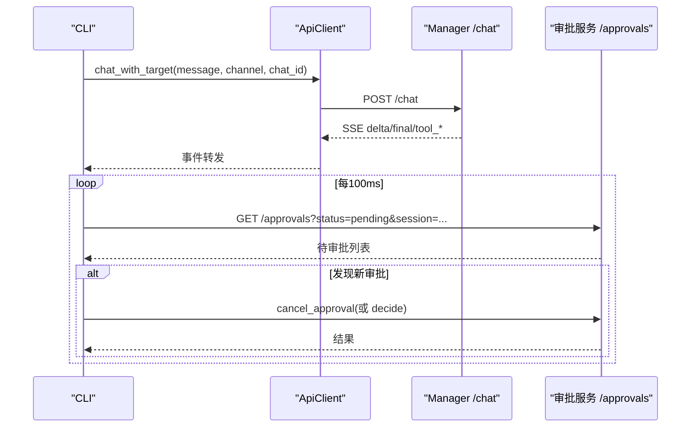
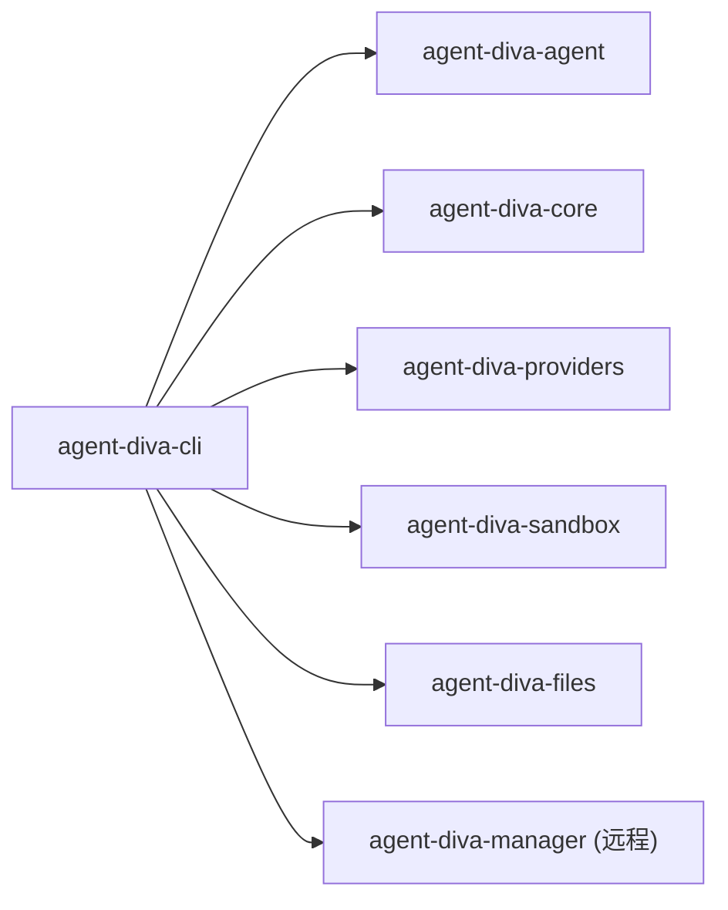

# Agent 命令

<cite>
**本文引用的文件**
- [main.rs](file://agent-diva-cli/src/main.rs)
- [chat_commands.rs](file://agent-diva-cli/src/chat_commands.rs)
- [client.rs](file://agent-diva-cli/src/client.rs)
- [cli_runtime.rs](file://agent-diva-cli/src/cli_runtime.rs)
- [approval_commands.rs](file://agent-diva-cli/src/approval_commands.rs)
- [Cargo.toml](file://agent-diva-cli/Cargo.toml)
</cite>

## 目录
1. [简介](#简介)
2. [项目结构](#项目结构)
3. [核心组件](#核心组件)
4. [架构总览](#架构总览)
5. [详细组件分析](#详细组件分析)
6. [依赖关系分析](#依赖关系分析)
7. [性能考虑](#性能考虑)
8. [故障排除指南](#故障排除指南)
9. [结论](#结论)
10. [附录：命令速查与示例](#附录命令速查与示例)

## 简介
本文件面向“Agent 命令”的完整使用文档，覆盖命令语法、参数选项（--message、--model、--session、--markdown、--logs、--approval-mode、--json）、交互与非交互模式、会话管理、流式日志输出、远程连接与认证配置、常见场景组合以及错误处理与故障排除。读者可据此快速上手并高效集成到自动化流程中。

## 项目结构
Agent 命令由 CLI 入口统一解析参数，并根据是否本地或远程执行不同路径：
- 本地模式：构建 AgentLoop，直接调用模型与工具，支持流式事件与交互式问答。
- 远程模式：通过 HTTP + SSE 与 agent-diva-manager 通信，转发消息与事件，支持审批队列。

图表来源
- [main.rs:489-553](file://agent-diva-cli/src/main.rs#L489-L553)
- [chat_commands.rs:375-448](file://agent-diva-cli/src/chat_commands.rs#L375-L448)
- [client.rs:152-262](file://agent-diva-cli/src/client.rs#L152-L262)
- [cli_runtime.rs:349-378](file://agent-diva-cli/src/cli_runtime.rs#L349-L378)

章节来源
- [main.rs:59-205](file://agent-diva-cli/src/main.rs#L59-L205)
- [Cargo.toml:11-24](file://agent-diva-cli/Cargo.toml#L11-L24)

## 核心组件
- CLI 命令定义与分发：在 main.rs 中定义 Commands::Agent 及其参数，并在 async_main 中根据 --remote 选择本地或远程执行路径。
- 本地 Agent 运行：chat_commands.rs 中的 run_agent/run_chat 负责构建 AgentLoop、会话键、流式事件处理、ask_user 交互等。
- 远程客户端：client.rs 提供 ApiClient，封装 /chat SSE 事件流、审批列表/决策/取消等接口。
- 运行时与提供者：cli_runtime.rs 提供 provider 构建、默认模型推断、工作区解析、状态报告等。
- 审批子系统：approval_commands.rs 提供统一的审批视图、决策应用与人类可读输出。

章节来源
- [main.rs:489-553](file://agent-diva-cli/src/main.rs#L489-L553)
- [chat_commands.rs:375-448](file://agent-diva-cli/src/chat_commands.rs#L375-L448)
- [client.rs:12-54](file://agent-diva-cli/src/client.rs#L12-L54)
- [cli_runtime.rs:349-378](file://agent-diva-cli/src/cli_runtime.rs#L349-L378)
- [approval_commands.rs:9-77](file://agent-diva-cli/src/approval_commands.rs#L9-L77)

## 架构总览
Agent 命令的核心数据流如下：
- 非交互单次消息：agent --message "..." [--model ...] [--session ...] [--logs] [--markdown] [--approval-mode queue|fail] [--json]
- 交互对话：agent-diva chat 或 agent-diva tui，支持多轮会话、/new 切换会话、/stop 停止、/thinking 控制思考模式、/compact 压缩上下文。
- 远程模式：--remote 或 --api-url 指定 Manager 地址，通过 /chat SSE 接收 delta/final/tool_* 事件；审批通过 /approvals 查询与决策。

图表来源
- [main.rs:489-553](file://agent-diva-cli/src/main.rs#L489-L553)
- [chat_commands.rs:285-364](file://agent-diva-cli/src/chat_commands.rs#L285-L364)
- [client.rs:152-262](file://agent-diva-cli/src/client.rs#L152-L262)

## 详细组件分析

### Agent 命令语法与参数
- 命令：agent-diva agent
- 参数：
  - --message：要发送给 Agent 的消息（必填用于非交互）
  - --model：指定使用的模型名称（可选）
  - --session：会话键，用于保持对话连续性（可选）
  - --markdown：将助手输出渲染为 Markdown 友好格式（布尔开关）
  - --no-markdown：禁用 Markdown 友好渲染（与 --markdown 互斥）
  - --logs：启用流式推理/工具日志输出（布尔开关）
  - --no-logs：禁用流式日志（与 --logs 互斥）
  - --approval-mode：非交互模式下的审批行为，取值 fail|queue（默认 fail）
  - --json：以结构化 JSON 输出审批结果（布尔开关）

说明：
- 当未提供 --message 时，CLI 会提示使用方法。
- --markdown 与 --no-markdown 同时存在时，后者优先。
- --logs 与 --no-logs 同时存在时，后者优先。
- 远程模式下，--approval-mode=queue 表示遇到需要审批的请求时进入队列等待，否则立即失败。

章节来源
- [main.rs:98-127](file://agent-diva-cli/src/main.rs#L98-L127)
- [main.rs:489-537](file://agent-diva-cli/src/main.rs#L489-L537)

### 本地执行流程（非交互）
- 构建 AgentLoop：加载配置、解析工作区、构建 Provider、初始化工具与规划器。
- 会话键：若未提供 session，则默认为 cli:direct。
- 流式处理：开启 --logs 时使用 process_direct_stream，聚合 AssistantDelta/ReasoningDelta/ToolCall*/FinalResponse 事件，最后渲染最终响应。
- 审批策略：若 approval_mode=queue，则在本地模式下直接报错（因为本地无队列），远程模式下才会真正入队。

图表来源
- [chat_commands.rs:285-364](file://agent-diva-cli/src/chat_commands.rs#L285-L364)
- [chat_commands.rs:375-448](file://agent-diva-cli/src/chat_commands.rs#L375-L448)

章节来源
- [chat_commands.rs:285-364](file://agent-diva-cli/src/chat_commands.rs#L285-L364)
- [chat_commands.rs:375-448](file://agent-diva-cli/src/chat_commands.rs#L375-L448)

### 远程执行流程（SSE 事件流）
- 连接：ApiClient::new 默认 http://localhost:3000/api，可通过 --api-url 覆盖。
- 发送：POST /chat，携带 message、channel、chat_id（从 session 解析）。
- 事件：SSE 事件类型包括 delta、final、tool_start、tool_finish、tool_delta、error、turn_plan_updated、context_compaction。
- 审批：在非交互远程模式下，周期性查询 /approvals，若出现新待审批项：
  - approval-mode=queue：将 command 类请求自动 cancel，并返回队列不可用错误；其他能力请求则提示需人工审批。
  - approval-mode=fail：直接取消并返回需要审批的错误。

图表来源
- [client.rs:152-262](file://agent-diva-cli/src/client.rs#L152-L262)
- [chat_commands.rs:552-663](file://agent-diva-cli/src/chat_commands.rs#L552-L663)

章节来源
- [client.rs:12-54](file://agent-diva-cli/src/client.rs#L12-L54)
- [client.rs:152-262](file://agent-diva-cli/src/client.rs#L152-L262)
- [chat_commands.rs:552-663](file://agent-diva-cli/src/chat_commands.rs#L552-L663)

### 会话管理
- 会话键解析：session_channel_and_chat_id 将 session 拆分为 channel 与 chat_id，默认 channel 为 cli。
- 交互模式：agent-diva chat 支持 /new 创建新会话，/stop 停止当前会话，/thinking auto|on|off 控制思考模式，/compact 压缩上下文。
- 持久化：会话上下文由 AgentLoop 与后端存储管理，CLI 仅传递 session_key。

章节来源
- [cli_runtime.rs:345-347](file://agent-diva-cli/src/cli_runtime.rs#L345-L347)
- [chat_commands.rs:665-778](file://agent-diva-cli/src/chat_commands.rs#L665-L778)

### 流式日志输出
- 本地：process_direct_stream 聚合 AssistantDelta/ReasoningDelta/ToolCallStarted/ToolCallFinished/FinalResponse，按顺序打印并累积最终响应。
- 远程：SSE 事件映射为 AgentEvent，CLI 侧按需打印日志与最终响应。

章节来源
- [chat_commands.rs:285-364](file://agent-diva-cli/src/chat_commands.rs#L285-L364)
- [client.rs:152-262](file://agent-diva-cli/src/client.rs#L152-L262)

### 审批模式与 JSON 输出
- 非交互审批：
  - approval-mode=fail：遇到需要审批即失败。
  - approval-mode=queue：远程模式下将命令类审批自动取消并返回队列不可用；其他能力审批提示需人工处理。
- JSON 输出：--json 使审批相关错误/结果以 ApprovalCliResult 形式输出，便于脚本解析。

章节来源
- [approval_commands.rs:9-77](file://agent-diva-cli/src/approval_commands.rs#L9-L77)
- [chat_commands.rs:450-464](file://agent-diva-cli/src/chat_commands.rs#L450-L464)
- [chat_commands.rs:552-663](file://agent-diva-cli/src/chat_commands.rs#L552-L663)

## 依赖关系分析
- CLI 入口依赖 agent-diva-agent（AgentLoop）、agent-diva-core（配置/治理/计划）、agent-diva-providers（LLM 提供者）、agent-diva-sandbox（命令审批规则）、agent-diva-files（附件存储）等。
- 远程模式依赖 reqwest 与 eventsource-stream 实现 HTTP + SSE。
- 审批子系统依赖 sqlx（SQLite）进行治理账本持久化。

图表来源
- [Cargo.toml:15-24](file://agent-diva-cli/Cargo.toml#L15-L24)

章节来源
- [Cargo.toml:15-24](file://agent-diva-cli/Cargo.toml#L15-L24)

## 性能考虑
- 流式输出减少首字节延迟，适合长回复与工具调用过程可视化。
- 远程模式通过 SSE 事件流降低阻塞等待，提升交互体验。
- 本地模式建议合理设置 exec_timeout 与 global_timeout_secs，避免长时间任务阻塞。
- 会话压缩（/compact）有助于控制上下文窗口，提高后续轮次效率。

[本节为通用指导，不直接分析具体文件]

## 故障排除指南
常见问题与定位要点：
- 未提供 --message：CLI 会提示使用方法。请确保在非交互模式下传入 --message。
- 需要审批但未配置审批队列：
  - 本地模式：直接失败并输出 approval_required_noninteractive。
  - 远程模式：approval-mode=queue 会取消命令类审批并返回 approval_queue_unavailable；其他能力审批需人工通过 approvals 列表处理。
- 远程连接失败：检查 --api-url 是否正确，默认 http://localhost:3000/api；确认 Manager 已启动并可访问。
- 模型/提供者配置错误：使用 provider status 或 doctor 检查当前 provider 与 model 是否就绪；必要时通过 provider set/login 配置 api_key 与 api_base。
- 会话问题：确认 session 键一致；交互模式可使用 /new 切换会话，/stop 停止当前会话。

章节来源
- [main.rs:532-537](file://agent-diva-cli/src/main.rs#L532-L537)
- [chat_commands.rs:450-464](file://agent-diva-cli/src/chat_commands.rs#L450-L464)
- [chat_commands.rs:552-663](file://agent-diva-cli/src/chat_commands.rs#L552-L663)
- [client.rs:294-308](file://agent-diva-cli/src/client.rs#L294-L308)

## 结论
Agent 命令提供了灵活的本地与远程两种执行方式，支持会话管理、流式日志、Markdown 输出与审批策略。通过合理的参数组合，可满足单次对话、持续会话与批处理等多种场景。结合远程 Manager 与审批队列，可实现安全可控的自动化任务执行。

[本节为总结性内容，不直接分析具体文件]

## 附录：命令速查与示例

### 基本语法
- 本地非交互：agent-diva agent --message "你的消息" [--model 模型名] [--session 会话键] [--logs] [--markdown] [--approval-mode fail|queue] [--json]
- 远程非交互：agent-diva agent --message "你的消息" --remote [--api-url URL] [--model ...] [--session ...] [--logs] [--markdown] [--approval-mode queue|fail] [--json]
- 交互对话：agent-diva chat [--model ...] [--session ...] [--logs] [--markdown]
- TUI 对话：agent-diva tui [--model ...] [--session ...]

### 常见场景
- 单次对话：agent-diva agent --message "解释 Rust 生命周期" --markdown
- 持续会话：agent-diva chat --session my-chat
- 批处理任务（远程+队列）：agent-diva agent --message "批量处理任务A" --remote --api-url http://your-manager:3000/api --approval-mode queue
- 查看审批：agent-diva approvals list --session my-session
- 决定审批：agent-diva approvals decide <request_id> --version <v> --decision allow-once

### 与远程服务的连接与认证
- 连接：--remote 启用远程模式；--api-url 指定 Manager API 地址（默认 http://localhost:3000/api）。
- 认证：通过 provider 配置 api_key 与 api_base；可使用 provider set/login 完成配置与登录。
- 会话：session 键在服务端用于区分对话通道与聊天 ID；CLI 侧无需额外认证即可通过 Manager 转发事件。

章节来源
- [main.rs:79-86](file://agent-diva-cli/src/main.rs#L79-L86)
- [main.rs:489-553](file://agent-diva-cli/src/main.rs#L489-L553)
- [cli_runtime.rs:349-378](file://agent-diva-cli/src/cli_runtime.rs#L349-L378)
- [client.rs:43-54](file://agent-diva-cli/src/client.rs#L43-L54)