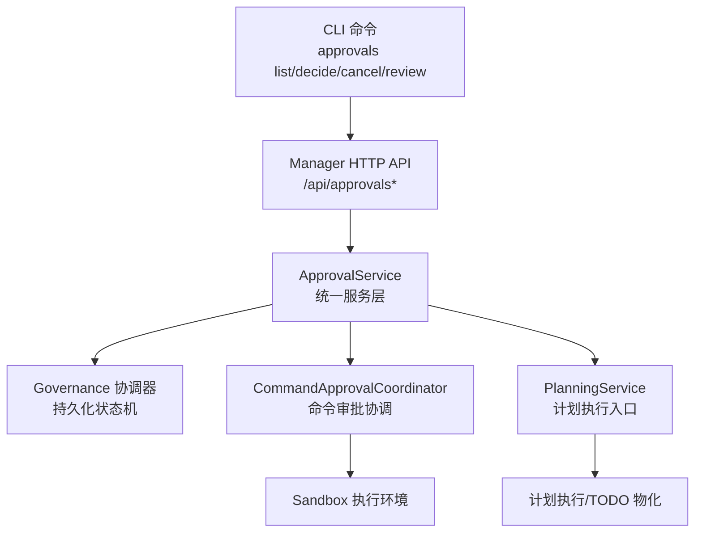
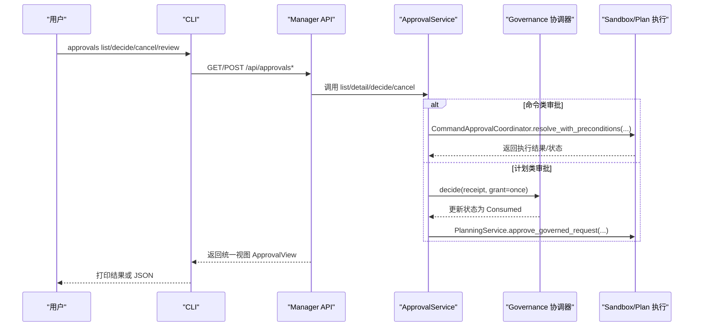
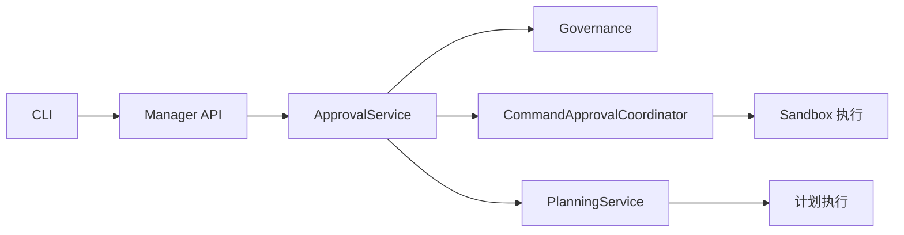

# Approvals 审批命令

<cite>
**本文引用的文件**
- [agent-diva-cli/src/main.rs](file://agent-diva-cli/src/main.rs)
- [agent-diva-cli/src/approval_commands.rs](file://agent-diva-cli/src/approval_commands.rs)
- [agent-diva-cli/src/client.rs](file://agent-diva-cli/src/client.rs)
- [agent-diva-manager/src/handlers/approvals.rs](file://agent-diva-manager/src/handlers/approvals.rs)
- [agent-diva-manager/src/approval_service.rs](file://agent-diva-manager/src/approval_service.rs)
- [agent-diva-sandbox/src/approval_coordinator.rs](file://agent-diva-sandbox/src/approval_coordinator.rs)
- [agent-diva-sandbox/src/approval.rs](file://agent-diva-sandbox/src/approval.rs)
- [agent-diva-core/src/planning/approval.rs](file://agent-diva-core/src/planning/approval.rs)
</cite>

## 目录
1. [简介](#简介)
2. [项目结构](#项目结构)
3. [核心组件](#核心组件)
4. [架构总览](#架构总览)
5. [详细组件分析](#详细组件分析)
6. [依赖关系分析](#依赖关系分析)
7. [性能与可用性](#性能与可用性)
8. [故障排查指南](#故障排查指南)
9. [结论](#结论)
10. [附录：命令速查](#附录：命令速查)

## 简介
本文件面向“Approvals 审批命令”，系统化说明 CLI 子命令 approvals list、decide、cancel、review 的语法、参数与行为，覆盖人工审批流程、审批请求管理、决策记录与审计追踪。同时阐述审批策略配置、自动审批规则、审批队列管理，以及与沙箱执行、工具调用的集成方式，并给出审批历史查询、批量处理、报表生成等管理能力的实践建议。

## 项目结构
Approvals 能力横跨 CLI、Manager（HTTP/SSE）、Sandbox（命令审批协调）与 Core（治理/计划审批契约）四个层次：
- CLI 层：提供 approvals list/decide/cancel/review 子命令，负责用户交互与远程调用。
- Manager 层：暴露统一 HTTP API（列表、详情、决策、取消、事件流），聚合命令与计划两类审批。
- Sandbox 层：命令级审批协调器，负责本地会话缓存、超时、撤销与恢复。
- Core 层：统一的治理协议与计划审批契约，确保跨域一致性与可审计性。

图表来源
- [agent-diva-cli/src/main.rs:149-242](file://agent-diva-cli/src/main.rs#L149-L242)
- [agent-diva-manager/src/handlers/approvals.rs:45-58](file://agent-diva-manager/src/handlers/approvals.rs#L45-L58)
- [agent-diva-manager/src/approval_service.rs:142-158](file://agent-diva-manager/src/approval_service.rs#L142-L158)
- [agent-diva-sandbox/src/approval_coordinator.rs:118-157](file://agent-diva-sandbox/src/approval_coordinator.rs#L118-L157)

章节来源
- [agent-diva-cli/src/main.rs:149-242](file://agent-diva-cli/src/main.rs#L149-L242)
- [agent-diva-manager/src/handlers/approvals.rs:45-58](file://agent-diva-manager/src/handlers/approvals.rs#L45-L58)

## 核心组件
- CLI 审批命令与交互
  - approvals list：分页列出审批项，支持按状态、会话过滤，支持 JSON 输出。
  - approvals decide：对指定 request_id 提交决策（允许一次/会话/规则，或拒绝）。
  - approvals cancel：撤销待处理的审批请求。
  - approvals review：交互式审查所有待处理审批，动态展示可用动作。
- Manager 统一审批服务
  - 路由：/api/approvals（列表）、/api/approvals/:id（详情）、/api/approvals/:id/decisions（决策）、/api/approvals/:id/cancel（取消）、/api/approvals/events（SSE 事件流）。
  - 统一视图 ApprovalView：包含领域、能力、资源范围、风险等级、状态、证据、回执、动作集与呈现信息。
  - 错误码与原因码：版本冲突、幂等冲突、过期、已消费、无效转移、负载不可用、队列不可用等。
- 命令审批协调器（Sandbox）
  - 维护待处理审批、会话级批准缓存、超时与恢复逻辑。
  - 将人类决策映射为 ApproveOnce/ApproveSession/ApproveGlobal/Reject。
- 计划审批契约（Core）
  - 计划修订冻结后提交审批，支持 TODO 物化策略与审计回执。

章节来源
- [agent-diva-cli/src/approval_commands.rs:12-77](file://agent-diva-cli/src/approval_commands.rs#L12-L77)
- [agent-diva-manager/src/handlers/approvals.rs:28-58](file://agent-diva-manager/src/handlers/approvals.rs#L28-L58)
- [agent-diva-manager/src/approval_service.rs:14-121](file://agent-diva-manager/src/approval_service.rs#L14-L121)
- [agent-diva-sandbox/src/approval_coordinator.rs:33-85](file://agent-diva-sandbox/src/approval_coordinator.rs#L33-L85)
- [agent-diva-core/src/planning/approval.rs:8-56](file://agent-diva-core/src/planning/approval.rs#L8-L56)

## 架构总览
以下序列图展示从 CLI 到 Manager、再到 Sandbox 与 Core 的完整审批决策链路。

图表来源
- [agent-diva-cli/src/main.rs:554-635](file://agent-diva-cli/src/main.rs#L554-L635)
- [agent-diva-manager/src/handlers/approvals.rs:60-134](file://agent-diva-manager/src/handlers/approvals.rs#L60-L134)
- [agent-diva-manager/src/approval_service.rs:239-304](file://agent-diva-manager/src/approval_service.rs#L239-L304)
- [agent-diva-sandbox/src/approval_coordinator.rs:148-200](file://agent-diva-sandbox/src/approval_coordinator.rs#L148-L200)

## 详细组件分析

### CLI 命令：approvals list
- 功能：列出审批项，默认 pending，可按 session 过滤；支持分页拉取；支持 JSON 输出。
- 关键参数
  - --status：过滤状态，如 pending。
  - --session：按会话键过滤。
  - --json：结构化输出。
- 行为要点
  - 客户端自动翻页，最多循环多次以获取全部结果。
  - 非 JSON 模式会打印人类可读摘要。

章节来源
- [agent-diva-cli/src/main.rs:564-580](file://agent-diva-cli/src/main.rs#L564-L580)
- [agent-diva-cli/src/client.rs:56-93](file://agent-diva-cli/src/client.rs#L56-L93)
- [agent-diva-cli/src/approval_commands.rs:133-150](file://agent-diva-cli/src/approval_commands.rs#L133-L150)

### CLI 命令：approvals decide
- 功能：对指定 request_id 提交决策。
- 关键参数
  - request_id：审批请求 ID。
  - --version：期望版本，用于乐观并发控制。
  - --decision：allow-once | allow-session | allow-rule | deny。
  - --json：结构化输出。
- 行为要点
  - 先读取当前审批详情校验版本，再提交决策。
  - 使用幂等键避免重复提交。

章节来源
- [agent-diva-cli/src/main.rs:582-599](file://agent-diva-cli/src/main.rs#L582-L599)
- [agent-diva-cli/src/approval_commands.rs:79-131](file://agent-diva-cli/src/approval_commands.rs#L79-L131)
- [agent-diva-cli/src/client.rs:106-129](file://agent-diva-cli/src/client.rs#L106-L129)

### CLI 命令：approvals cancel
- 功能：撤销待处理的审批请求。
- 关键参数
  - request_id：审批请求 ID。
  - --version：期望版本。
  - --json：结构化输出。
- 行为要点
  - 同样进行版本校验，通过 Manager 调用取消接口。

章节来源
- [agent-diva-cli/src/main.rs:600-616](file://agent-diva-cli/src/main.rs#L600-L616)
- [agent-diva-cli/src/client.rs:131-150](file://agent-diva-cli/src/client.rs#L131-L150)

### CLI 命令：approvals review
- 功能：交互式审查所有待处理审批，根据 actions 动态展示可选操作。
- 关键参数
  - --session：按会话过滤。
- 行为要点
  - 对每个待处理项打印人类可读信息。
  - 若存在 allow 动作，则根据 domain 与 presentation 提示是否支持会话/规则级授权。
  - 用户选择后调用 apply_choice 提交决策或取消。

章节来源
- [agent-diva-cli/src/approval_commands.rs:152-201](file://agent-diva-cli/src/approval_commands.rs#L152-L201)
- [agent-diva-cli/src/main.rs:617-620](file://agent-diva-cli/src/main.rs#L617-L620)

### Manager 统一审批 API
- 路由
  - GET /api/approvals：列表，支持 domain/status/session/cursor/limit。
  - GET /api/approvals/:request_id：详情。
  - POST /api/approvals/:request_id/decisions：提交决策。
  - POST /api/approvals/:request_id/cancel：取消。
  - GET /api/approvals/events：SSE 事件流，支持 cursor/limit。
- 错误处理
  - 解析错误、版本冲突、幂等冲突、过期、已消费、无效转移、负载不可用、队列不可用等，均返回对应 reason_code。

章节来源
- [agent-diva-manager/src/handlers/approvals.rs:45-58](file://agent-diva-manager/src/handlers/approvals.rs#L45-L58)
- [agent-diva-manager/src/handlers/approvals.rs:60-134](file://agent-diva-manager/src/handlers/approvals.rs#L60-L134)
- [agent-diva-manager/src/handlers/approvals.rs:206-293](file://agent-diva-manager/src/handlers/approvals.rs#L206-L293)

### ApprovalService 统一服务层
- 职责
  - 列表：分页查询治理状态，按 domain/status/session 过滤，组装 ApprovalView。
  - 详情：获取状态，必要时触发过期物化。
  - 决策：区分命令与计划领域，命令走 CommandApprovalCoordinator，计划走 Governance decide 并触发 PlanningService 执行。
  - 取消：命令领域直接取消，计划领域走 revoke。
  - 事件：基于治理事件流构建 ApprovalEventView。
- 关键约束
  - 幂等键与期望版本保证一致性。
  - 仅允许 Once 授予用于计划审批。

章节来源
- [agent-diva-manager/src/approval_service.rs:148-334](file://agent-diva-manager/src/approval_service.rs#L148-L334)
- [agent-diva-manager/src/approval_service.rs:336-448](file://agent-diva-manager/src/approval_service.rs#L336-L448)
- [agent-diva-manager/src/approval_service.rs:460-552](file://agent-diva-manager/src/approval_service.rs#L460-L552)

### 命令审批协调器（Sandbox）
- 作用
  - 维护待处理审批、会话级批准缓存、超时与恢复。
  - 将人类决策映射为 ApproveOnce/ApproveSession/ApproveGlobal/Reject。
  - 支持 recover_incomplete：重启时撤销无法安全恢复的待处理/已允许命令审批。
- 关键类型
  - CommandApprovalRequest/Scope、ApprovalDecision、CommandApprovalStatus、ResolveApprovalResponse。

章节来源
- [agent-diva-sandbox/src/approval_coordinator.rs:33-85](file://agent-diva-sandbox/src/approval_coordinator.rs#L33-L85)
- [agent-diva-sandbox/src/approval_coordinator.rs:118-200](file://agent-diva-sandbox/src/approval_coordinator.rs#L118-L200)

### 计划审批契约（Core）
- 作用
  - 定义计划修订提交与审批所需元数据、TODO 策略与审计回执。
  - 支持 approved_by、todo_policy、materialize_todos 等字段，形成不可变审计记录。

章节来源
- [agent-diva-core/src/planning/approval.rs:8-56](file://agent-diva-core/src/planning/approval.rs#L8-L56)

## 依赖关系分析
- CLI 依赖 Manager HTTP 接口，通过 ApiClient 封装列表、详情、决策、取消与 SSE 事件流。
- Manager 依赖 ApprovalService，后者组合 Governance 协调器、命令审批协调器与计划服务。
- Sandbox 命令审批协调器与 Manager 协同，实现命令执行的等待/唤醒/撤销。
- Core 提供统一的治理协议与计划审批契约，确保跨域一致性与可审计性。

图表来源
- [agent-diva-cli/src/client.rs:56-150](file://agent-diva-cli/src/client.rs#L56-L150)
- [agent-diva-manager/src/handlers/approvals.rs:45-58](file://agent-diva-manager/src/handlers/approvals.rs#L45-L58)
- [agent-diva-manager/src/approval_service.rs:142-158](file://agent-diva-manager/src/approval_service.rs#L142-L158)
- [agent-diva-sandbox/src/approval_coordinator.rs:118-157](file://agent-diva-sandbox/src/approval_coordinator.rs#L118-L157)

章节来源
- [agent-diva-cli/src/client.rs:56-150](file://agent-diva-cli/src/client.rs#L56-L150)
- [agent-diva-manager/src/approval_service.rs:142-158](file://agent-diva-manager/src/approval_service.rs#L142-L158)

## 性能与可用性
- 列表分页与游标：列表与事件流均支持 cursor/limit，避免一次性加载大量数据。
- 幂等与并发：决策与取消使用 expected_version + idempotency_key，防止重复提交与并发冲突。
- 事件驱动：SSE 事件流支持实时订阅审批状态变化，适合自动化与监控。
- 超时与恢复：命令审批具备默认超时与重启恢复机制，避免僵尸审批。
- 错误分类：统一 reason_code 便于上层快速定位问题并进行重试或告警。

[本节为通用指导，不直接分析具体文件]

## 故障排查指南
- 常见错误与含义
  - approval_version_conflict：提交的版本与当前不一致，需重新获取最新状态。
  - approval_idempotency_conflict：相同幂等键重复提交且决策/授予不同。
  - approval_expired：审批已过期，需重新发起或刷新。
  - approval_already_consumed：审批已被消费，无需再次决策。
  - approval_invalid_transition：状态不允许该转移。
  - approval_payload_unavailable：载荷不可用（如计划详情缺失）。
  - approval_queue_unavailable：审批队列不可用（网络或服务不可达）。
- 排查步骤
  - 使用 approvals list 查看当前状态与 next_cursor。
  - 使用 approvals decide/cancel 前务必确认 version。
  - 使用 events 流订阅变更，结合 cursor 回放历史。
  - 检查 Manager 日志中的 reason_code 与错误消息。

章节来源
- [agent-diva-manager/src/handlers/approvals.rs:206-293](file://agent-diva-manager/src/handlers/approvals.rs#L206-L293)
- [agent-diva-cli/src/client.rs:56-150](file://agent-diva-cli/src/client.rs#L56-L150)

## 结论
Approvals 审批命令提供了跨命令与计划的统一审批体验：CLI 侧简洁易用，Manager 侧统一抽象与强一致性保障，Sandbox 侧实现命令执行的细粒度控制，Core 侧提供治理与审计契约。借助分页、事件流、幂等与版本控制，系统既满足人机协作的可控性，也支持自动化与规模化运维。

[本节为总结，不直接分析具体文件]

## 附录：命令速查
- approvals list
  - 用途：列出审批项（默认 pending），支持 --status、--session、--json。
  - 典型用法：agent-diva approvals list --status pending --session my-session
- approvals decide
  - 用途：对指定 request_id 提交决策。
  - 参数：request_id、--version、--decision（allow-once|allow-session|allow-rule|deny）、--json。
  - 典型用法：agent-diva approvals decide <id> --version 1 --decision allow-once
- approvals cancel
  - 用途：撤销待处理审批。
  - 参数：request_id、--version、--json。
  - 典型用法：agent-diva approvals cancel <id> --version 1
- approvals review
  - 用途：交互式审查所有待处理审批。
  - 参数：--session。
  - 典型用法：agent-diva approvals review --session my-session

章节来源
- [agent-diva-cli/src/main.rs:149-242](file://agent-diva-cli/src/main.rs#L149-L242)
- [agent-diva-cli/src/main.rs:554-635](file://agent-diva-cli/src/main.rs#L554-L635)