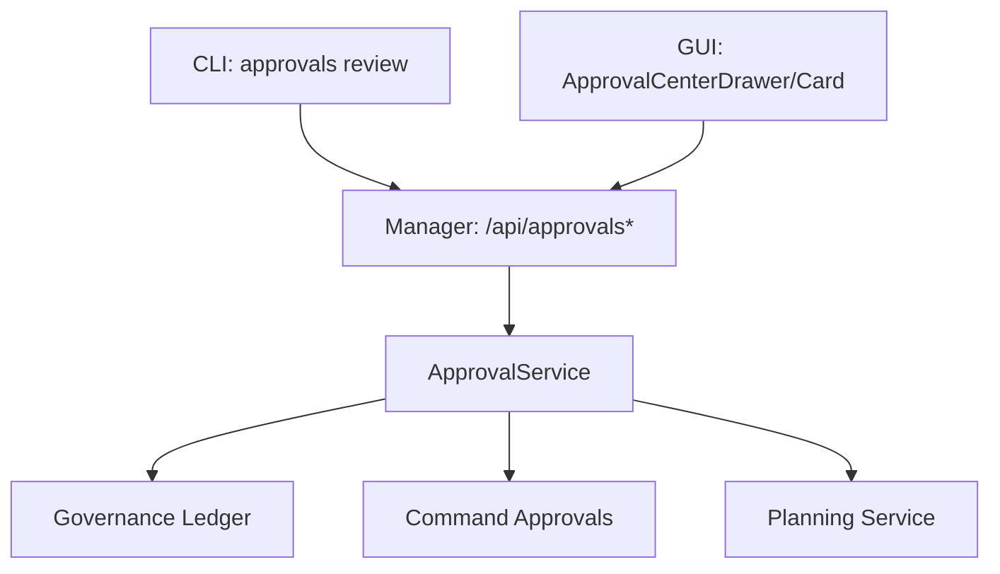
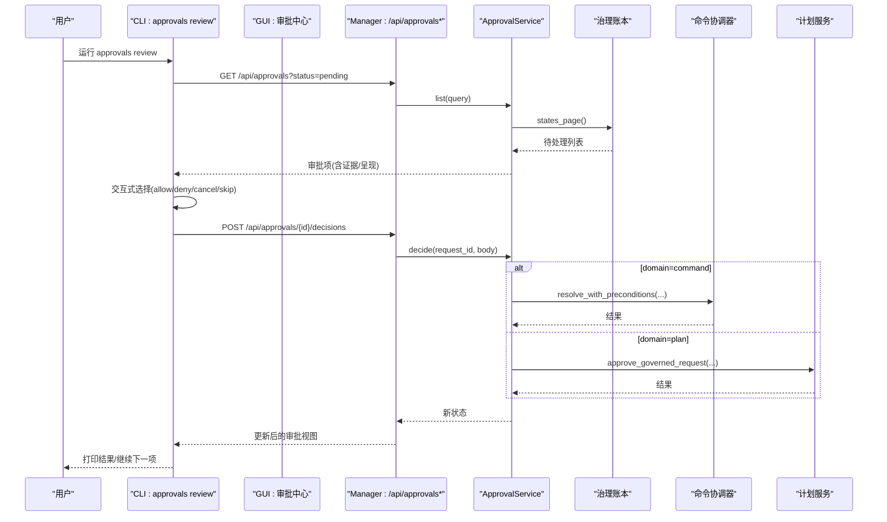
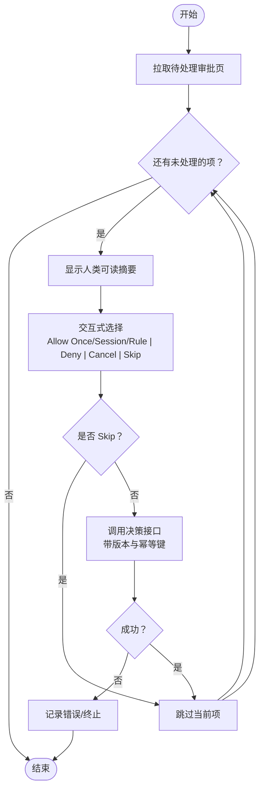
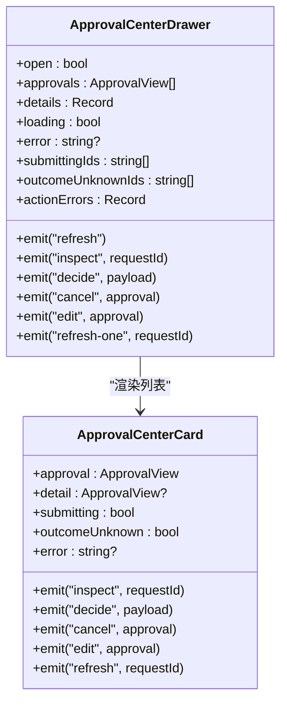
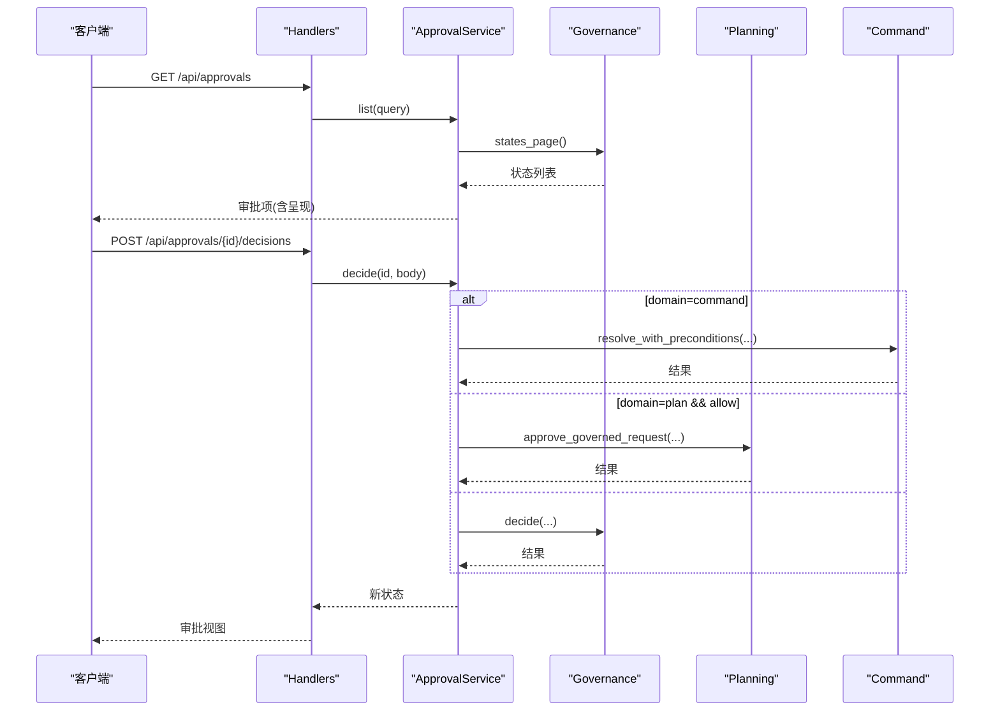
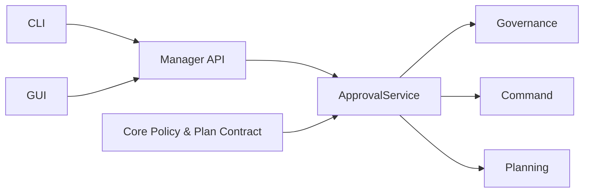

# 交互式审核命令

<cite>
**本文引用的文件**
- [approval_commands.rs](file://agent-diva-cli/src/approval_commands.rs)
- [main.rs](file://agent-diva-cli/src/main.rs)
- [approvals.rs](file://agent-diva-manager/src/handlers/approvals.rs)
- [approval_service.rs](file://agent-diva-manager/src/approval_service.rs)
- [ApprovalCenterCard.vue](file://agent-diva-gui/src/components/ApprovalCenterCard.vue)
- [ApprovalCenterDrawer.vue](file://agent-diva-gui/src/components/ApprovalCenterDrawer.vue)
- [policy.rs](file://agent-diva-core/src/governance/policy.rs)
- [approval.rs](file://agent-diva-core/src/planning/approval.rs)
</cite>

## 目录
1. [简介](#简介)
2. [项目结构](#项目结构)
3. [核心组件](#核心组件)
4. [架构总览](#架构总览)
5. [详细组件分析](#详细组件分析)
6. [依赖关系分析](#依赖关系分析)
7. [性能与可用性](#性能与可用性)
8. [故障排查指南](#故障排查指南)
9. [结论](#结论)
10. [附录：API 与交互流程速查](#附录api-与交互流程速查)

## 简介
本文件面向“交互式审核命令”，聚焦 approvals review 子命令的交互界面与操作流程，覆盖待处理审批的可视化展示、交互式选择决策、批量审核处理；说明 command、plan、memory 等域的差异与限制；并给出证据查看、风险评估、建议操作等辅助决策信息。同时提供非交互式模式与脚本化自动化方案，便于集成到流水线或运维脚本中。

## 项目结构
围绕“交互式审核”的关键代码分布在 CLI、Manager（HTTP/SSE）、GUI（Vue 组件）以及 Core（治理策略与计划模型）四个层次：
- CLI 层：提供 approvals review 子命令、交互式菜单、批处理循环、JSON 输出与非交互错误码。
- Manager 层：统一审批 HTTP API、SSE 事件流、服务编排与领域路由（command/plan）。
- GUI 层：审批中心抽屉、卡片组件、过滤排序、风险优先展示、TTL 倒计时与刷新。
- Core 层：治理策略评估、计划提交与审批契约、审计记录。

**图表来源**
- [approvals.rs:45-58](file://agent-diva-manager/src/handlers/approvals.rs#L45-L58)
- [approval_service.rs:148-189](file://agent-diva-manager/src/approval_service.rs#L148-L189)

**章节来源**
- [approval_commands.rs:1-312](file://agent-diva-cli/src/approval_commands.rs#L1-L312)
- [approvals.rs:1-725](file://agent-diva-manager/src/handlers/approvals.rs#L1-L725)
- [approval_service.rs:1-552](file://agent-diva-manager/src/approval_service.rs#L1-L552)
- [ApprovalCenterCard.vue:1-460](file://agent-diva-gui/src/components/ApprovalCenterCard.vue#L1-L460)
- [ApprovalCenterDrawer.vue:1-346](file://agent-diva-gui/src/components/ApprovalCenterDrawer.vue#L1-L346)

## 核心组件
- CLI 审批视图与选择器
  - 统一数据结构：请求 ID、版本、域、能力、资源范围、风险等级、状态、过期时间、证据列表、可用动作、呈现信息、原因码。
  - 交互式选择：默认拒绝/取消/跳过，若允许则按域动态插入“一次性允许”“会话级允许”“规则级允许”。
  - 批处理：遍历待处理页，逐项交互并应用决策，返回已解决列表。
  - 非交互错误码：当需要人工干预但处于非交互环境时返回特定原因码。

- Manager 统一审批服务
  - 列出/详情/决策/取消/事件流：分页查询、SSE 推送、幂等键与 CAS 版本控制。
  - 领域路由：command 走沙箱协调器；plan 走计划服务批准路径；其他域通过通用账本。
  - 呈现组装：为不同域附加标题、摘要、差异、建议前缀等 UI 友好信息。

- GUI 审批中心
  - 风险优先排序、过期倒计时、会话/域/状态过滤。
  - 卡片支持查看证据数量、diff、原因码、刷新重试。
  - 决策按钮根据 actions 动态启用，command 域支持 grant 下拉（once/session/rule），plan 仅 once。

- Core 策略与计划契约
  - 策略评估：无效请求、禁止风险、显式拒绝、未知自主级别等情形直接拒绝。
  - 计划审批：提交元数据、用户审批请求、审计回执、TODO 策略控制。

**章节来源**
- [approval_commands.rs:12-77](file://agent-diva-cli/src/approval_commands.rs#L12-L77)
- [approval_commands.rs:152-201](file://agent-diva-cli/src/approval_commands.rs#L152-L201)
- [approval_service.rs:45-121](file://agent-diva-manager/src/approval_service.rs#L45-L121)
- [approval_service.rs:368-447](file://agent-diva-manager/src/approval_service.rs#L368-L447)
- [ApprovalCenterCard.vue:43-73](file://agent-diva-gui/src/components/ApprovalCenterCard.vue#L43-L73)
- [policy.rs:89-130](file://agent-diva-core/src/governance/policy.rs#L89-L130)
- [approval.rs:23-56](file://agent-diva-core/src/planning/approval.rs#L23-L56)

## 架构总览
下图展示了从 CLI/GUI 发起审核到后端服务落库与领域执行的全链路交互。

**图表来源**
- [approval_commands.rs:152-201](file://agent-diva-cli/src/approval_commands.rs#L152-L201)
- [approvals.rs:60-134](file://agent-diva-manager/src/handlers/approvals.rs#L60-L134)
- [approval_service.rs:239-304](file://agent-diva-manager/src/approval_service.rs#L239-L304)

## 详细组件分析

### CLI 交互式审核流程
- 列表获取：调用统一接口拉取 pending 状态的审批项，逐条打印人类可读摘要（ID、版本、域、风险、状态、能力、范围、过期时间、呈现标题/摘要、证据数量）。
- 交互选择：使用终端选择器，默认选项为拒绝/取消/跳过；若存在 allow 动作且域为 command，则动态插入“一次性允许”“会话级允许（5分钟）”“规则级允许（若有建议前缀）”。
- 决策应用：对每个选择生成幂等键（cli-{request_id}-v{version}），调用决策接口；若选择 skip 则抛出跳过错误。
- 批处理：循环处理整页，收集已解决的审批项并返回计数。

**图表来源**
- [approval_commands.rs:152-201](file://agent-diva-cli/src/approval_commands.rs#L152-L201)

**章节来源**
- [approval_commands.rs:133-201](file://agent-diva-cli/src/approval_commands.rs#L133-L201)
- [main.rs:586-620](file://agent-diva-cli/src/main.rs#L586-L620)

### GUI 审批中心与卡片
- 展示与过滤：支持按域（command/plan）、状态（pending/allowed/denied/revoked/consumed/expired）、会话过滤；按风险等级与过期时间排序。
- TTL 与刷新：卡片内倒计时，接近过期自动触发刷新；可手动刷新单个项。
- 证据与详情：显示证据数量、diff、原因码；点击“检查”进入详情。
- 决策按钮：根据 actions 动态启用；command 域支持 grant 下拉（once/session/rule），plan 仅 once；deny/allow/cancel/edit 按钮按权限显示。
- 错误与未知结果：显示错误提示与“结果未知”警告，并提供“仅刷新”按钮。

**图表来源**
- [ApprovalCenterCard.vue:1-460](file://agent-diva-gui/src/components/ApprovalCenterCard.vue#L1-L460)
- [ApprovalCenterDrawer.vue:1-346](file://agent-diva-gui/src/components/ApprovalCenterDrawer.vue#L1-L346)

**章节来源**
- [ApprovalCenterCard.vue:43-199](file://agent-diva-gui/src/components/ApprovalCenterCard.vue#L43-L199)
- [ApprovalCenterDrawer.vue:35-173](file://agent-diva-gui/src/components/ApprovalCenterDrawer.vue#L35-L173)

### Manager 统一审批服务
- 列表与详情：分页查询治理账本状态，组装呈现信息（command 包含命令/工作目录/会话键/建议前缀；plan 包含报告标题/修订/摘要）。
- 决策与取消：command 域通过沙箱协调器解析；plan 域在允许时调用计划服务批准；其他域通过通用账本决策。
- 事件流：SSE 推送 requested/resolved/updated 事件，支持游标续传与限流。
- 错误映射：将底层错误映射为统一 reason_code 与 HTTP 状态码（如 version conflict→409，queue unavailable→503）。

**图表来源**
- [approvals.rs:60-134](file://agent-diva-manager/src/handlers/approvals.rs#L60-L134)
- [approval_service.rs:239-304](file://agent-diva-manager/src/approval_service.rs#L239-L304)

**章节来源**
- [approvals.rs:45-193](file://agent-diva-manager/src/handlers/approvals.rs#L45-L193)
- [approval_service.rs:160-304](file://agent-diva-manager/src/approval_service.rs#L160-L304)

### 领域差异与特定流程
- Command 域
  - 允许粒度：once/session/rule（rule 需有 suggested_prefix 呈现字段）。
  - 会话级允许有效期约 5 分钟（由 CLI 提示体现）。
  - 决策通过沙箱协调器解析，影响命令执行。
- Plan 域
  - 仅支持 once 授权；允许后进入执行阶段（消费态）。
  - 呈现包含报告标题、修订号、摘要；支持 diff 查看。
- Memory 域
  - 当前统一审批中心在 GUI 的域筛选项中仅暴露 Command/Plan；Memory 编辑/应用走专属演进提案面，不在此处直接审批。

**章节来源**
- [approval_commands.rs:166-182](file://agent-diva-cli/src/approval_commands.rs#L166-L182)
- [approval_service.rs:403-447](file://agent-diva-manager/src/approval_service.rs#L403-L447)
- [ApprovalCenterDrawer.vue:121-149](file://agent-diva-gui/src/components/ApprovalCenterDrawer.vue#L121-L149)

### 证据查看、风险评估与建议操作
- 证据：每项审批携带证据引用列表，GUI 显示证据数量；CLI 打印证据条目数。
- 风险：按 risk 等级（prohibited/critical/high/moderate/low/unknown）排序与着色；低 TTL 时发出警告。
- 建议：command 域若存在 suggested_prefix，CLI 与 GUI 均会提示可创建规则级允许；plan 域呈现摘要帮助快速审阅。

**章节来源**
- [approval_commands.rs:133-150](file://agent-diva-cli/src/approval_commands.rs#L133-L150)
- [ApprovalCenterCard.vue:43-73](file://agent-diva-gui/src/components/ApprovalCenterCard.vue#L43-L73)
- [approval_service.rs:398-447](file://agent-diva-manager/src/approval_service.rs#L398-L447)

## 依赖关系分析
- CLI 依赖 Manager 的统一 API；Manager 依赖治理账本与领域服务（命令协调器、计划服务）。
- GUI 通过 Tauri 命令桥接 Manager API；卡片与抽屉组件解耦，事件驱动。
- Core 策略评估决定硬拒绝与约束；计划审批契约确保审计与 TODO 策略。

**图表来源**
- [approval_commands.rs:1-312](file://agent-diva-cli/src/approval_commands.rs#L1-L312)
- [approvals.rs:1-725](file://agent-diva-manager/src/handlers/approvals.rs#L1-L725)
- [approval_service.rs:1-552](file://agent-diva-manager/src/approval_service.rs#L1-L552)
- [policy.rs:89-130](file://agent-diva-core/src/governance/policy.rs#L89-L130)
- [approval.rs:23-56](file://agent-diva-core/src/planning/approval.rs#L23-L56)

**章节来源**
- [approval_commands.rs:1-312](file://agent-diva-cli/src/approval_commands.rs#L1-L312)
- [approvals.rs:1-725](file://agent-diva-manager/src/handlers/approvals.rs#L1-L725)
- [approval_service.rs:1-552](file://agent-diva-manager/src/approval_service.rs#L1-L552)

## 性能与可用性
- 分页与游标：列表与事件流均支持游标分页，避免全量加载。
- SSE 事件：服务端以 250ms 轮询缓冲事件，减少频繁请求；客户端可通过 cursor 重放。
- 风险优先排序：GUI 按风险等级与过期时间排序，提升高优审批可见性。
- 幂等与 CAS：决策与取消均要求 expected_version 与 idempotency_key，防止重复提交与冲突。
- TTL 管理：接近过期自动刷新，降低超时风险。

[本节为通用指导，无需具体文件来源]

## 故障排查指南
- 常见错误与原因码
  - 版本冲突：expected_version 不匹配，返回 409 与对应 reason_code。
  - 幂等冲突：重复提交相同 idempotency_key 但决策不一致，返回 409。
  - 已过期：审批已过期，返回 409。
  - 队列不可用：运行时不可用，返回 503。
  - 载荷不可用：无法获取审批载荷，返回 409。
  - 非法授权：grant 不适用于该域（如 plan 不允许 session/rule），返回 422。
  - 非法转换：状态机不允许的转移，返回 422。
  - 持久化失败：底层存储异常，返回 500。
- 定位步骤
  - 使用详情接口获取最新状态与 reason_code。
  - 通过事件流回放确认状态变化点。
  - 核对 expected_version 与 idempotency_key 是否正确。
  - 检查 GUI 中的错误提示与“结果未知”状态，必要时仅刷新。

**章节来源**
- [approvals.rs:206-293](file://agent-diva-manager/src/handlers/approvals.rs#L206-L293)
- [approval_service.rs:113-134](file://agent-diva-manager/src/approval_service.rs#L113-L134)

## 结论
交互式审核命令提供了跨 CLI 与 GUI 的一致体验：可视化展示、交互式选择、批量处理、证据与风险提示、领域差异化流程与授权粒度。Manager 统一服务屏蔽了底层复杂性，并通过幂等与 CAS 保障一致性。对于自动化场景，CLI 支持 JSON 输出与非交互错误码，便于脚本化集成。

[本节为总结，无需具体文件来源]

## 附录：API 与交互流程速查
- 主要端点
  - GET /api/approvals：列出审批（支持 domain/status/session/cursor/limit）。
  - GET /api/approvals/:request_id：详情（含呈现信息）。
  - POST /api/approvals/:request_id/decisions：决策（expected_version、idempotency_key、decision、grant）。
  - POST /api/approvals/:request_id/cancel：取消（expected_version、idempotency_key）。
  - GET /api/approvals/events：SSE 事件流（cursor、limit）。
- CLI 子命令
  - approvals review：交互式批处理 pending 审批。
  - approvals get/decide/cancel：单条操作的 JSON 输出模式，适合脚本化。
- GUI 交互
  - 打开审批中心抽屉，过滤与排序，点击卡片查看详情，选择 grant（command 域），执行 allow/deny/cancel/edit。
- 领域差异
  - command：once/session/rule（rule 需 suggested_prefix）。
  - plan：仅 once；允许后进入执行。
  - memory：不在统一审批中心直接审批，走演进提案面。

**章节来源**
- [approvals.rs:45-193](file://agent-diva-manager/src/handlers/approvals.rs#L45-L193)
- [approval_commands.rs:152-201](file://agent-diva-cli/src/approval_commands.rs#L152-L201)
- [ApprovalCenterDrawer.vue:121-149](file://agent-diva-gui/src/components/ApprovalCenterDrawer.vue#L121-L149)
- [approval_service.rs:403-447](file://agent-diva-manager/src/approval_service.rs#L403-L447)