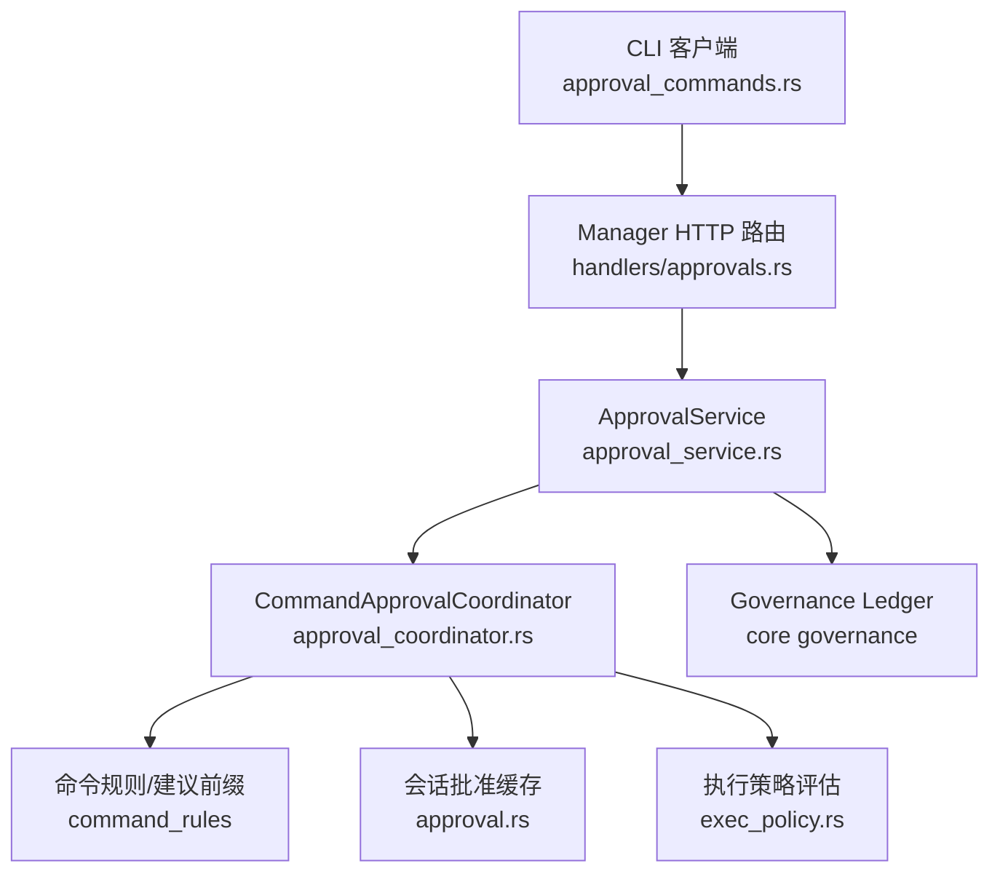
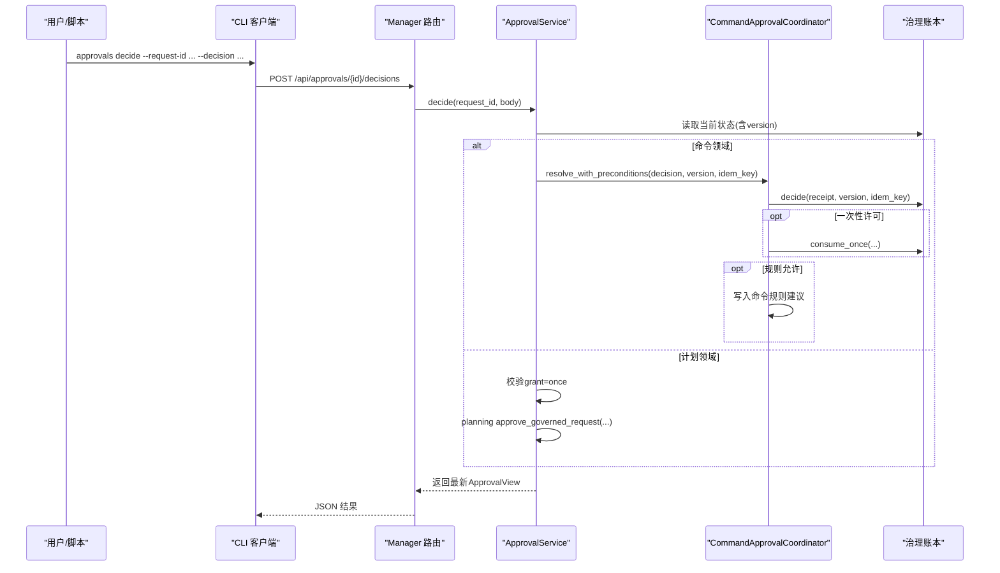
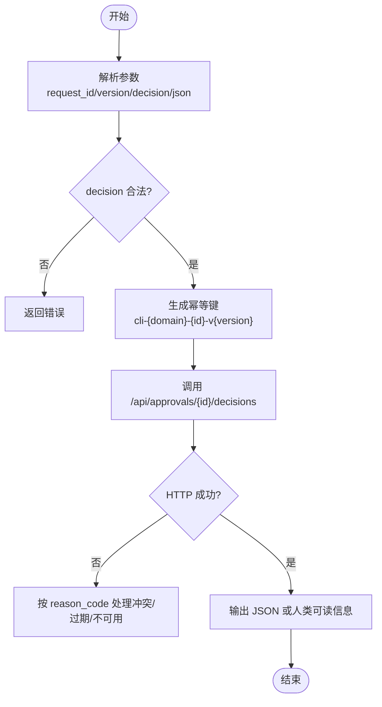
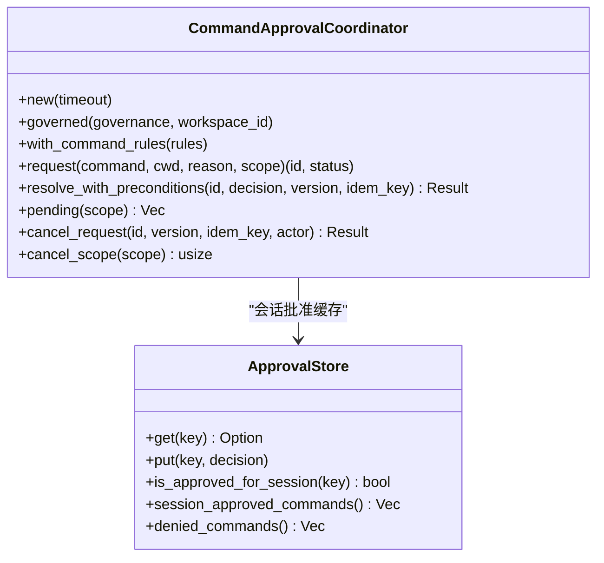
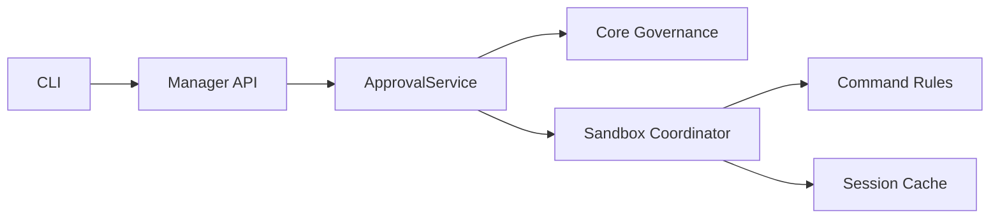

# 决策制定命令

<cite>
**本文引用的文件**
- [approval_commands.rs](file://agent-diva-cli/src/approval_commands.rs)
- [main.rs](file://agent-diva-cli/src/main.rs)
- [approvals.rs](file://agent-diva-manager/src/handlers/approvals.rs)
- [approval_service.rs](file://agent-diva-manager/src/approval_service.rs)
- [approval_coordinator.rs](file://agent-diva-sandbox/src/approval_coordinator.rs)
- [approval.rs](file://agent-diva-sandbox/src/approval.rs)
- [exec_policy.rs](file://agent-diva-sandbox/src/exec_policy.rs)
- [ledger.rs](file://agent-diva-core/src/governance/ledger.rs)
</cite>

## 目录
1. [简介](#简介)
2. [项目结构](#项目结构)
3. [核心组件](#核心组件)
4. [架构总览](#架构总览)
5. [详细组件分析](#详细组件分析)
6. [依赖关系分析](#依赖关系分析)
7. [性能与可用性](#性能与可用性)
8. [故障排查指南](#故障排查指南)
9. [结论](#结论)
10. [附录：API 与用法](#附录api-与用法)

## 简介
本文件面向“审批决策制定”能力，聚焦 CLI 的 approvals decide 子命令及其背后的统一审批服务。文档说明支持的决策类型（一次性允许、会话级允许、规则允许、拒绝、取消）、有效期与作用域、幂等性与版本冲突处理、以及自动化与批量决策的使用方式。内容基于代码实现进行梳理，便于开发者与运维人员正确使用并集成。

## 项目结构
审批决策涉及三层：
- CLI 层：解析用户输入、构造决策请求、调用后端 API。
- Manager 层：提供统一的 HTTP 接口与服务编排，将决策路由到具体领域（命令执行、计划执行）。
- Sandbox/Core 层：命令执行前的策略评估、缓存与会话级授权、持久化治理账本。

图表来源
- [approval_commands.rs:79-131](file://agent-diva-cli/src/approval_commands.rs#L79-L131)
- [approvals.rs:45-134](file://agent-diva-manager/src/handlers/approvals.rs#L45-L134)
- [approval_service.rs:148-304](file://agent-diva-manager/src/approval_service.rs#L148-L304)
- [approval_coordinator.rs:221-381](file://agent-diva-sandbox/src/approval_coordinator.rs#L221-L381)
- [approval.rs:155-248](file://agent-diva-sandbox/src/approval.rs#L155-L248)
- [exec_policy.rs:277-306](file://agent-diva-sandbox/src/exec_policy.rs#L277-L306)

章节来源
- [approval_commands.rs:1-312](file://agent-diva-cli/src/approval_commands.rs#L1-L312)
- [main.rs:556-615](file://agent-diva-cli/src/main.rs#L556-L615)
- [approvals.rs:1-725](file://agent-diva-manager/src/handlers/approvals.rs#L1-L725)
- [approval_service.rs:1-552](file://agent-diva-manager/src/approval_service.rs#L1-L552)
- [approval_coordinator.rs:1-800](file://agent-diva-sandbox/src/approval_coordinator.rs#L1-L800)
- [approval.rs:1-347](file://agent-diva-sandbox/src/approval.rs#L1-L347)
- [exec_policy.rs:277-306](file://agent-diva-sandbox/src/exec_policy.rs#L277-L306)

## 核心组件
- CLI 决策入口与选择器
  - 支持决策类型：allow-once、allow-session、allow-rule、deny、cancel。
  - 通过 version + idempotency_key 保证幂等与并发安全。
- Manager 统一审批服务
  - 暴露 /api/approvals 系列 REST 接口。
  - 根据 capability 区分 CommandExecute 与 PlanExecute 领域。
  - 对命令执行使用沙箱协调器；对计划执行走计划服务。
- 沙箱命令审批协调器
  - 维护待决请求、会话级批准缓存、全局规则建议。
  - 支持超时过期、撤销、消费一次性许可。
- 治理账本
  - 提供 CAS 版本控制、幂等键去重、事件流与状态机。

章节来源
- [approval_commands.rs:49-131](file://agent-diva-cli/src/approval_commands.rs#L49-L131)
- [approvals.rs:45-134](file://agent-diva-manager/src/handlers/approvals.rs#L45-L134)
- [approval_service.rs:148-304](file://agent-diva-manager/src/approval_service.rs#L148-L304)
- [approval_coordinator.rs:118-127](file://agent-diva-sandbox/src/approval_coordinator.rs#L118-L127)
- [approval.rs:155-248](file://agent-diva-sandbox/src/approval.rs#L155-L248)

## 架构总览
下图展示一次“命令类审批”的端到端流程：从 CLI 发起 decide，到 Manager 路由至 ApprovalService，再到沙箱协调器与治理账本的交互。

图表来源
- [approval_commands.rs:79-131](file://agent-diva-cli/src/approval_commands.rs#L79-L131)
- [approvals.rs:94-134](file://agent-diva-manager/src/handlers/approvals.rs#L94-L134)
- [approval_service.rs:239-304](file://agent-diva-manager/src/approval_service.rs#L239-L304)
- [approval_coordinator.rs:392-594](file://agent-diva-sandbox/src/approval_coordinator.rs#L392-L594)

## 详细组件分析

### CLI 决策命令与选项
- 支持的决策类型
  - allow-once：仅允许本次执行。
  - allow-session：在当前会话内允许（默认会话时长约5分钟）。
  - allow-rule：生成一条可复用的命令规则（需存在 suggested_prefix）。
  - deny：拒绝该次执行。
  - cancel：取消待决请求。
- 参数与约束
  - request_id：审批请求标识。
  - version：期望的版本号，用于 CAS 防冲突。
  - decision：上述五种之一。
  - json：可选，输出 JSON 以便脚本化。
- 幂等性
  - CLI 为每次决策生成 idempotency_key（形如 cli-{domain}-{id}-v{version}），确保重复提交不产生副作用。
- 作用域与有效期
  - 命令类：由沙箱协调器管理；allow-session 在会话内有效，默认约5分钟；allow-once 仅当次；allow-rule 持久化规则。
  - 计划类：仅允许 grant=once，且会触发计划执行消费。

章节来源
- [approval_commands.rs:49-131](file://agent-diva-cli/src/approval_commands.rs#L49-L131)
- [main.rs:582-615](file://agent-diva-cli/src/main.rs#L582-L615)
- [approval_coordinator.rs:458-464](file://agent-diva-sandbox/src/approval_coordinator.rs#L458-L464)
- [approval_service.rs:283-301](file://agent-diva-manager/src/approval_service.rs#L283-L301)

#### 决策流程图（CLI）

图表来源
- [approval_commands.rs:79-131](file://agent-diva-cli/src/approval_commands.rs#L79-L131)
- [main.rs:582-615](file://agent-diva-cli/src/main.rs#L582-L615)

### Manager 统一审批服务
- 路由
  - GET /api/approvals：分页列出审批项，支持 domain/status/session/cursor/limit。
  - GET /api/approvals/{request_id}：获取详情（包含 presentation 与 actions）。
  - POST /api/approvals/{request_id}/decisions：提交决策。
  - POST /api/approvals/{request_id}/cancel：取消待决。
  - GET /api/approvals/events：SSE 事件流，订阅审批生命周期事件。
- 领域分发
  - Capability::CommandExecute：交由沙箱协调器 resolve_with_preconditions。
  - Capability::PlanExecute：仅允许 grant=once，并调用计划服务批准。
- 错误码映射
  - 版本冲突、幂等冲突、已过期、已消费、无效转换、负载不可用、队列不可用等均有明确 reason_code。

章节来源
- [approvals.rs:45-134](file://agent-diva-manager/src/handlers/approvals.rs#L45-L134)
- [approvals.rs:206-293](file://agent-diva-manager/src/handlers/approvals.rs#L206-L293)
- [approval_service.rs:160-304](file://agent-diva-manager/src/approval_service.rs#L160-L304)

### 沙箱命令审批协调器
- 关键职责
  - 创建待决请求（含 scope、cwd、reason、timeout、suggested_prefix）。
  - 会话级批准缓存：避免同一会话重复询问。
  - 规则允许：将安全前缀建议写入命令规则存储。
  - 一次性许可：批准后立即消费，防止复用。
  - 超时与撤销：超时自动过期；支持按 scope 批量取消。
- 有效期与作用域
  - 默认超时 300 秒；allow-session 的 receipt 有效期约 5 分钟。
  - 作用域由 channel/chat_id/session_key 限定。
- 幂等与版本
  - resolve_with_preconditions 支持传入 expected_version 与 idempotency_key。
  - 内部通过治理账本 ensure 幂等与 CAS。

章节来源
- [approval_coordinator.rs:30-60](file://agent-diva-sandbox/src/approval_coordinator.rs#L30-L60)
- [approval_coordinator.rs:221-381](file://agent-diva-sandbox/src/approval_coordinator.rs#L221-L381)
- [approval_coordinator.rs:392-594](file://agent-diva-sandbox/src/approval_coordinator.rs#L392-L594)
- [approval_coordinator.rs:611-701](file://agent-diva-sandbox/src/approval_coordinator.rs#L611-L701)

#### 协调器类图（节选）

图表来源
- [approval_coordinator.rs:118-127](file://agent-diva-sandbox/src/approval_coordinator.rs#L118-L127)
- [approval.rs:155-248](file://agent-diva-sandbox/src/approval.rs#L155-L248)

### 执行策略与审批需求
- 策略评估结果
  - Forbidden：直接禁止。
  - Prompt：需要审批（除非配置为 Never）。
  - Allow：若命中显式规则则跳过审批，否则依据默认策略。
- 与审批系统的衔接
  - 需要审批时，进入沙箱协调器的 request 流程，等待外部决策。

章节来源
- [exec_policy.rs:277-306](file://agent-diva-sandbox/src/exec_policy.rs#L277-L306)

### 治理账本与幂等/版本控制
- 幂等键
  - 相同 idempotency_key 重复提交会被识别为幂等冲突或幂等回放，不会重复生效。
- 版本控制
  - 所有变更携带 expected_version，失败返回 VersionConflict。
- 状态机
  - Pending -> Allowed/Denied/Revoked/Expired/Consumed，事件流可追踪。
- 并发
  - 并发决策采用 CAS，仅首个成功，其余返回版本冲突。

章节来源
- [ledger.rs:1202-1235](file://agent-diva-core/src/governance/ledger.rs#L1202-L1235)
- [approval_service.rs:239-304](file://agent-diva-manager/src/approval_service.rs#L239-L304)
- [approvals.rs:206-293](file://agent-diva-manager/src/handlers/approvals.rs#L206-L293)

## 依赖关系分析
- CLI 依赖 Manager 的 REST API。
- Manager 依赖 Core 的治理协调器与沙箱的命令协调器。
- 沙箱协调器依赖命令规则存储与会话批准缓存。
- 所有写操作均通过治理账本持久化，保证一致性与可审计。

图表来源
- [approval_commands.rs:79-131](file://agent-diva-cli/src/approval_commands.rs#L79-L131)
- [approvals.rs:45-134](file://agent-diva-manager/src/handlers/approvals.rs#L45-L134)
- [approval_service.rs:148-304](file://agent-diva-manager/src/approval_service.rs#L148-L304)
- [approval_coordinator.rs:221-381](file://agent-diva-sandbox/src/approval_coordinator.rs#L221-L381)

## 性能与可用性
- 列表与事件流
  - 列表支持 cursor 分页；事件流使用 SSE 推送，适合长时间监听。
- 幂等与重试
  - 幂等键允许客户端安全重试；版本冲突提示客户端刷新后重试。
- 会话缓存
  - 会话级批准减少重复交互，提升用户体验。
- 超时与回收
  - 默认 300 秒超时；重启后可回收未完成审批，避免悬挂。

[本节为通用指导，无需特定文件引用]

## 故障排查指南
- 常见错误与处理
  - approval_version_conflict：版本过旧，先拉取最新状态再提交。
  - approval_idempotency_conflict：幂等键冲突，检查是否重复提交相同 key。
  - approval_expired：请求已过期，重新发起或调整超时。
  - approval_already_consumed：一次性许可已被消费，无法再次使用。
  - approval_queue_unavailable：审批服务不可用，稍后重试。
- 定位步骤
  - 使用 list 查看 pending 列表与 actions。
  - 使用 events 流观察状态变化。
  - 检查 CLI 输出的 human 信息与 JSON 字段。

章节来源
- [approvals.rs:206-293](file://agent-diva-manager/src/handlers/approvals.rs#L206-L293)
- [approval_commands.rs:133-200](file://agent-diva-cli/src/approval_commands.rs#L133-L200)

## 结论
approvals decide 提供了统一的审批决策入口，覆盖命令与计划两类领域，支持一次性、会话级、规则级等多种授权粒度，并通过幂等键与版本号保障并发安全与一致性。结合事件流与列表查询，可实现自动化与批量化审批工作流。建议在自动化场景中始终携带幂等键与期望版本，并在冲突时回退重试。

[本节为总结，无需特定文件引用]

## 附录：API 与用法

### CLI 用法要点
- 基本语法
  - approvals decide --request-id <id> --version <n> --decision <allow-once|allow-session|allow-rule|deny|cancel> [--json]
- 交互式审查
  - 可通过 review_pending 列出待决项并选择决策。
- 输出
  - 非 JSON：打印人类可读摘要（ID、版本、领域、风险、状态、过期时间、证据数等）。
  - JSON：便于脚本化处理。

章节来源
- [main.rs:556-615](file://agent-diva-cli/src/main.rs#L556-L615)
- [approval_commands.rs:133-200](file://agent-diva-cli/src/approval_commands.rs#L133-L200)

### Manager REST API
- 列表
  - GET /api/approvals?domain=&status=&session=&cursor=&limit=
- 详情
  - GET /api/approvals/{request_id}
- 决策
  - POST /api/approvals/{request_id}/decisions
    - 请求体：expected_version, idempotency_key, decision, grant
- 取消
  - POST /api/approvals/{request_id}/cancel
    - 请求体：expected_version, idempotency_key
- 事件流
  - GET /api/approvals/events?cursor=&limit=

章节来源
- [approvals.rs:45-134](file://agent-diva-manager/src/handlers/approvals.rs#L45-L134)
- [approvals.rs:143-193](file://agent-diva-manager/src/handlers/approvals.rs#L143-L193)

### 决策类型与语义
- allow-once
  - 仅允许本次执行；批准后消费一次性许可。
- allow-session
  - 在当前会话内允许（约5分钟）；期间同类命令不再询问。
- allow-rule
  - 生成命令规则建议（需存在 suggested_prefix）；成功后写入规则存储。
- deny
  - 拒绝执行。
- cancel
  - 取消待决请求；对命令类会撤销治理记录并唤醒等待者。

章节来源
- [approval_commands.rs:49-131](file://agent-diva-cli/src/approval_commands.rs#L49-L131)
- [approval_service.rs:490-498](file://agent-diva-manager/src/approval_service.rs#L490-L498)
- [approval_coordinator.rs:458-594](file://agent-diva-sandbox/src/approval_coordinator.rs#L458-L594)

### 有效期与作用域
- 有效期
  - 待决请求默认超时 300 秒；allow-session 的 receipt 有效期约 5 分钟。
- 作用域
  - 命令类：channel/chat_id/session_key 限定；cwd 影响缓存键。
  - 计划类：以资源 ID 与内容摘要绑定。

章节来源
- [approval_coordinator.rs:30-60](file://agent-diva-sandbox/src/approval_coordinator.rs#L30-L60)
- [approval_coordinator.rs:221-381](file://agent-diva-sandbox/src/approval_coordinator.rs#L221-L381)
- [approval_service.rs:398-447](file://agent-diva-manager/src/approval_service.rs#L398-L447)

### 幂等性与冲突处理
- 幂等键
  - 相同 idempotency_key 多次提交不会产生重复效果。
- 版本冲突
  - expected_version 不匹配返回版本冲突，客户端应刷新后重试。
- 并发控制
  - 并发决策采用 CAS，仅首个成功。

章节来源
- [approval_commands.rs:79-131](file://agent-diva-cli/src/approval_commands.rs#L79-L131)
- [approval_service.rs:239-304](file://agent-diva-manager/src/approval_service.rs#L239-L304)
- [ledger.rs:1202-1235](file://agent-diva-core/src/governance/ledger.rs#L1202-L1235)

### 自动化与批量决策
- 自动化
  - 使用 list 与 events 流构建自动化审批流水线。
  - 对已知低风险命令可结合 allow-rule 建立白名单。
- 批量
  - 遍历 pending 列表，依次调用 decide 或 cancel；注意每个请求独立 version 与 idempotency_key。
- 最佳实践
  - 始终携带幂等键与期望版本。
  - 遇到冲突或过期，先刷新状态再重试。
  - 对 allow-rule 使用前确认 suggested_prefix 存在且安全。

章节来源
- [approvals.rs:143-193](file://agent-diva-manager/src/handlers/approvals.rs#L143-L193)
- [approval_commands.rs:152-200](file://agent-diva-cli/src/approval_commands.rs#L152-L200)
- [approval_coordinator.rs:519-562](file://agent-diva-sandbox/src/approval_coordinator.rs#L519-L562)