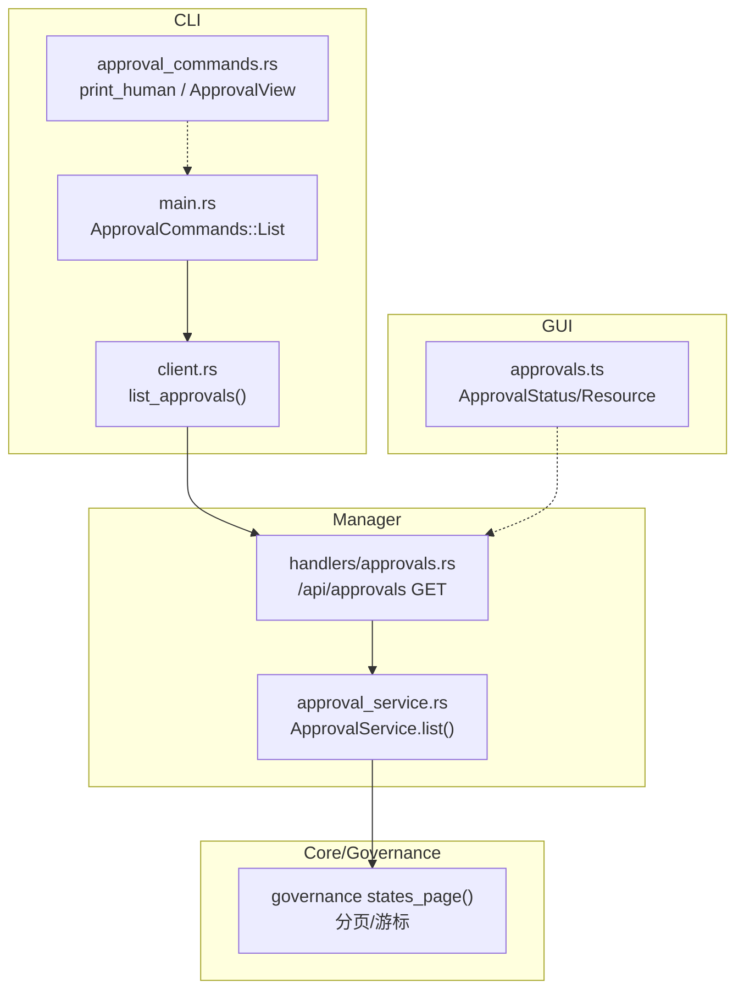
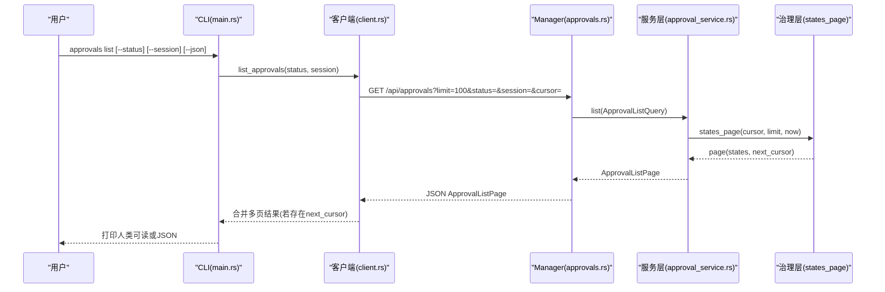
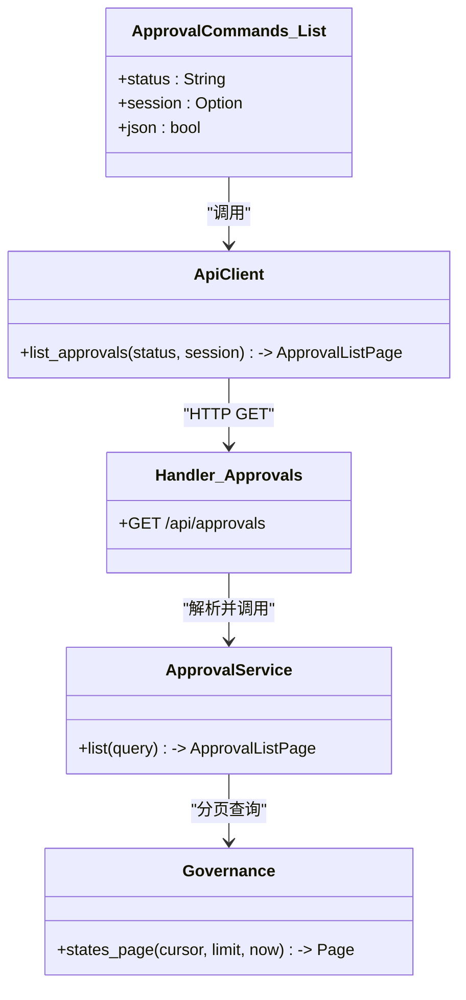

# 列表查看命令

<cite>
**本文引用的文件**
- [agent-diva-cli/src/main.rs](file://agent-diva-cli/src/main.rs)
- [agent-diva-cli/src/approval_commands.rs](file://agent-diva-cli/src/approval_commands.rs)
- [agent-diva-cli/src/client.rs](file://agent-diva-cli/src/client.rs)
- [agent-diva-manager/src/handlers/approvals.rs](file://agent-diva-manager/src/handlers/approvals.rs)
- [agent-diva-manager/src/approval_service.rs](file://agent-diva-manager/src/approval_service.rs)
- [agent-diva-gui/src/api/approvals.ts](file://agent-diva-gui/src/api/approvals.ts)
</cite>

## 目录
1. [简介](#简介)
2. [项目结构](#项目结构)
3. [核心组件](#核心组件)
4. [架构总览](#架构总览)
5. [详细组件分析](#详细组件分析)
6. [依赖关系分析](#依赖关系分析)
7. [性能与分页特性](#性能与分页特性)
8. [故障排查指南](#故障排查指南)
9. [结论](#结论)
10. [附录：命令参考](#附录命令参考)

## 简介
本章节面向“审批列表查看”能力，聚焦 CLI 子命令 approvals list。该命令用于查询待处理或历史审批请求，支持按状态、会话等条件筛选，并支持 JSON 结构化输出。后端提供统一的审批 API，支持分页游标与事件流，GUI 侧也提供了基于状态的过滤与排序展示。

## 项目结构
与“审批列表查看”相关的代码分布在以下模块：
- CLI 层：定义 approvals list 子命令参数、调用客户端、格式化输出
- Manager 服务层：HTTP 路由、查询解析、服务编排
- 治理/存储层：统一审批视图、分页、状态机、事件流
- GUI 前端：类型定义与过滤逻辑（辅助理解状态与字段）

**图表来源**
- [agent-diva-cli/src/main.rs:207-242](file://agent-diva-cli/src/main.rs#L207-L242)
- [agent-diva-cli/src/client.rs:56-86](file://agent-diva-cli/src/client.rs#L56-L86)
- [agent-diva-manager/src/handlers/approvals.rs:45-78](file://agent-diva-manager/src/handlers/approvals.rs#L45-L78)
- [agent-diva-manager/src/approval_service.rs:65-83](file://agent-diva-manager/src/approval_service.rs#L65-L83)
- [agent-diva-gui/src/api/approvals.ts:1-36](file://agent-diva-gui/src/api/approvals.ts#L1-L36)

**章节来源**
- [agent-diva-cli/src/main.rs:207-242](file://agent-diva-cli/src/main.rs#L207-L242)
- [agent-diva-manager/src/handlers/approvals.rs:45-78](file://agent-diva-manager/src/handlers/approvals.rs#L45-L78)

## 核心组件
- CLI 命令定义与执行：ApprovalCommands::List，包含 status、session、json 三个参数
- 客户端封装：ApiClient.list_approvals，负责拼接查询参数、分页游标循环拉取
- HTTP 处理器：/api/approvals GET，解析查询参数并调用服务层
- 服务层：ApprovalService.list，基于治理层的 states_page 进行分页与过滤
- 数据模型：ApprovalView、ApprovalListQuery、ApprovalListPage、ApprovalStatus 等

**章节来源**
- [agent-diva-cli/src/main.rs:207-242](file://agent-diva-cli/src/main.rs#L207-L242)
- [agent-diva-cli/src/client.rs:56-86](file://agent-diva-cli/src/client.rs#L56-L86)
- [agent-diva-manager/src/handlers/approvals.rs:60-78](file://agent-diva-manager/src/handlers/approvals.rs#L60-L78)
- [agent-diva-manager/src/approval_service.rs:65-83](file://agent-diva-manager/src/approval_service.rs#L65-L83)

## 架构总览
审批列表查看的端到端流程如下：
- CLI 发起 approvals list，携带可选的 status、session 与 json 标志
- 客户端将参数转为查询字符串，默认 limit=100，自动处理 next_cursor 分页
- Manager 路由接收 GET /api/approvals，解析 ApprovalListQuery
- 服务层调用治理层 states_page，按 domain/status/session 过滤，组装 ApprovalView
- 返回 ApprovalListPage，包含 approvals 列表与 next_cursor

**图表来源**
- [agent-diva-cli/src/main.rs:554-621](file://agent-diva-cli/src/main.rs#L554-L621)
- [agent-diva-cli/src/client.rs:56-86](file://agent-diva-cli/src/client.rs#L56-L86)
- [agent-diva-manager/src/handlers/approvals.rs:60-78](file://agent-diva-manager/src/handlers/approvals.rs#L60-L78)
- [agent-diva-manager/src/approval_service.rs:160-189](file://agent-diva-manager/src/approval_service.rs#L160-L189)

## 详细组件分析

### CLI 子命令 approvals list
- 参数
  - --status：审批状态过滤，默认 pending
  - --session：按会话 ID 过滤
  - --json：以 JSON 格式输出
- 行为
  - 调用 ApiClient.list_approvals，传入 status 与 session
  - 若结果为空且非 JSON，输出“No matching approvals.”
  - 否则逐条打印人类可读摘要；JSON 模式直接输出页面结构

**章节来源**
- [agent-diva-cli/src/main.rs:207-242](file://agent-diva-cli/src/main.rs#L207-L242)
- [agent-diva-cli/src/main.rs:554-621](file://agent-diva-cli/src/main.rs#L554-L621)

### 客户端分页与批量拉取
- 每次请求 limit=100，支持 cursor 游标
- 自动循环最多 10 次，合并 next_cursor 直到无下一页
- 错误映射为队列不可用等错误码

**章节来源**
- [agent-diva-cli/src/client.rs:56-86](file://agent-diva-cli/src/client.rs#L56-L86)

### 后端路由与服务层
- 路由：GET /api/approvals
- 查询解析：ApprovalListQuery{domain?, status?, session?, cursor?, limit?}
- 服务层过滤：
  - domain：command | plan
  - status：pending | allowed | denied | revoked | consumed | expired
  - session：精确匹配 resource.session_id
- 返回：ApprovalListPage{approvals[], next_cursor?}

**章节来源**
- [agent-diva-manager/src/handlers/approvals.rs:45-78](file://agent-diva-manager/src/handlers/approvals.rs#L45-L78)
- [agent-diva-manager/src/approval_service.rs:65-83](file://agent-diva-manager/src/approval_service.rs#L65-L83)
- [agent-diva-manager/src/approval_service.rs:160-189](file://agent-diva-manager/src/approval_service.rs#L160-L189)

### 数据模型与输出格式
- ApprovalView 关键字段
  - request_id、version、domain、capability、resource、risk、status、created_at、expires_at、subject、evidence、receipt、reason_code、actions、presentation
- ApprovalListPage
  - approvals[]、next_cursor?
- GUI 类型定义佐证了状态集合与资源结构

**章节来源**
- [agent-diva-manager/src/approval_service.rs:45-83](file://agent-diva-manager/src/approval_service.rs#L45-L83)
- [agent-diva-gui/src/api/approvals.ts:1-36](file://agent-diva-gui/src/api/approvals.ts#L1-L36)

### 状态管理与查询方式
- 支持的审批状态（来自 GUI 类型与服务层枚举）：
  - pending、allowed、denied、revoked、consumed、expired
- 查询方式
  - 通过 --status 指定单一状态
  - 通过 --session 精确匹配会话
  - 未指定时默认查询 pending
- 注意：当前 CLI 仅暴露 status 与 session 两个过滤项；domain 过滤在服务层可用但 CLI 未暴露

**章节来源**
- [agent-diva-cli/src/main.rs:207-242](file://agent-diva-cli/src/main.rs#L207-L242)
- [agent-diva-manager/src/approval_service.rs:160-189](file://agent-diva-manager/src/approval_service.rs#L160-L189)
- [agent-diva-gui/src/api/approvals.ts:1-36](file://agent-diva-gui/src/api/approvals.ts#L1-L36)

### 风险等级与筛选
- 风险等级 risk 存在于 ApprovalView 中，可用于前端排序与展示
- CLI 未暴露 risk 过滤参数；如需按风险筛选，可在获取后本地过滤或使用 GUI 的排序能力

**章节来源**
- [agent-diva-manager/src/approval_service.rs:45-63](file://agent-diva-manager/src/approval_service.rs#L45-L63)
- [agent-diva-gui/src/components/ApprovalCenterDrawer.vue:38-49](file://agent-diva-gui/src/components/ApprovalCenterDrawer.vue#L38-L49)

### 工作区与会话
- 资源 scope 包含 workspace_id 与 session_id
- CLI 支持按 session 过滤；workspace 过滤未在 CLI 暴露
- 如需按工作区筛选，可结合 GUI 或自行在客户端对返回结果过滤

**章节来源**
- [agent-diva-cli/src/approval_commands.rs:32-41](file://agent-diva-cli/src/approval_commands.rs#L32-L41)
- [agent-diva-manager/src/approval_service.rs:45-63](file://agent-diva-manager/src/approval_service.rs#L45-L63)

### 批量查看与导出
- 批量查看：客户端自动分页合并，最多 10 页，每页 100 条
- 导出历史：使用 --json 输出完整页面结构，便于脚本化导出；如需全量历史，可结合 next_cursor 循环拉取直至结束

**章节来源**
- [agent-diva-cli/src/client.rs:56-86](file://agent-diva-cli/src/client.rs#L56-L86)
- [agent-diva-cli/src/main.rs:554-621](file://agent-diva-cli/src/main.rs#L554-L621)

## 依赖关系分析
- CLI 依赖 ApiClient，后者构造 HTTP 请求并处理分页
- Manager 路由依赖 ApprovalService，后者依赖治理层 states_page
- GUI 类型定义与后端 ApprovalView 保持一致，确保前后端契约稳定

**图表来源**
- [agent-diva-cli/src/main.rs:207-242](file://agent-diva-cli/src/main.rs#L207-L242)
- [agent-diva-cli/src/client.rs:56-86](file://agent-diva-cli/src/client.rs#L56-L86)
- [agent-diva-manager/src/handlers/approvals.rs:45-78](file://agent-diva-manager/src/handlers/approvals.rs#L45-L78)
- [agent-diva-manager/src/approval_service.rs:160-189](file://agent-diva-manager/src/approval_service.rs#L160-L189)

**章节来源**
- [agent-diva-cli/src/main.rs:207-242](file://agent-diva-cli/src/main.rs#L207-L242)
- [agent-diva-manager/src/handlers/approvals.rs:45-78](file://agent-diva-manager/src/handlers/approvals.rs#L45-L78)

## 性能与分页特性
- 默认每页限制 100 条，避免单次响应过大
- 客户端自动处理 next_cursor，最多循环 10 次，适合大多数场景
- 服务端在 list 前会尝试物化过期状态，减少无效数据
- 建议：
  - 使用 --status 缩小范围，提高命中率
  - 使用 --session 精确定位会话
  - 使用 --json 配合脚本实现高效导出

[本节为通用指导，不直接分析具体文件]

## 故障排查指南
- 常见错误码与含义（来自服务层与 GUI 类型）
  - approval_not_found：请求不存在
  - approval_version_conflict：版本冲突
  - approval_expired：已过期
  - approval_already_resolved / approval_already_consumed：已解决/已消费
  - approval_invalid_query / approval_invalid_body：查询或请求体非法
  - approval_queue_unavailable：队列不可用
- 排查步骤
  - 检查 --status 与 --session 是否正确
  - 确认后端服务是否可用（队列不可用）
  - 使用 --json 查看完整错误信息 reason_code
  - 如出现版本冲突，请重新获取最新 version 再决策

**章节来源**
- [agent-diva-manager/src/handlers/approvals.rs:206-293](file://agent-diva-manager/src/handlers/approvals.rs#L206-L293)
- [agent-diva-gui/src/api/approvals.ts:1-36](file://agent-diva-gui/src/api/approvals.ts#L1-L36)

## 结论
- approvals list 提供了简洁的 CLI 接口，支持按状态与会话筛选，并以人类可读或 JSON 形式输出
- 后端采用统一审批视图与分页游标，保证可扩展性与一致性
- 当前 CLI 未暴露 domain 与 risk 过滤，但可通过 GUI 或客户端本地过滤实现
- 借助 --json 与 next_cursor，可实现批量查看与历史导出

[本节为总结性内容，不直接分析具体文件]

## 附录：命令参考
- 基本用法
  - agent-diva approvals list
  - agent-diva approvals list --status pending
  - agent-diva approvals list --session <session_id>
  - agent-diva approvals list --json
- 输出说明
  - 人类可读：每条审批显示 request_id、version、domain、risk、status、capability、scope、expires_at、summary/detail、evidence 数量
  - JSON：返回 ApprovalListPage，包含 approvals[] 与 next_cursor?

**章节来源**
- [agent-diva-cli/src/main.rs:207-242](file://agent-diva-cli/src/main.rs#L207-L242)
- [agent-diva-cli/src/approval_commands.rs:132-150](file://agent-diva-cli/src/approval_commands.rs#L132-L150)
- [agent-diva-cli/src/client.rs:56-86](file://agent-diva-cli/src/client.rs#L56-L86)