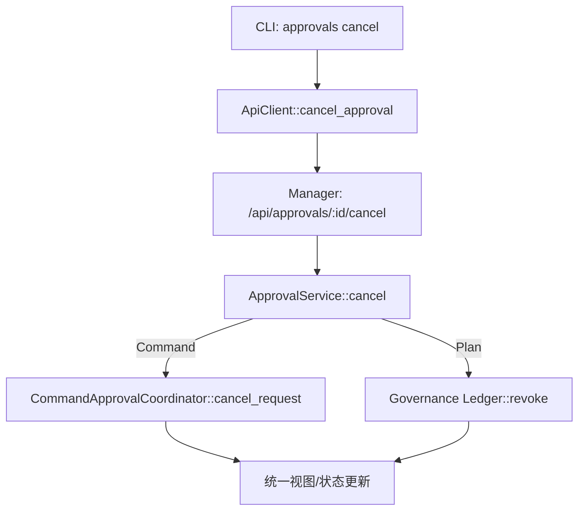
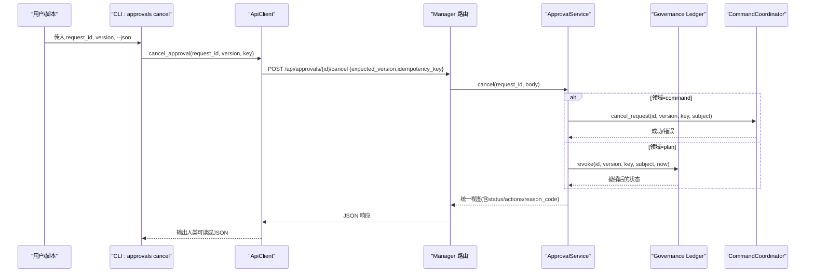
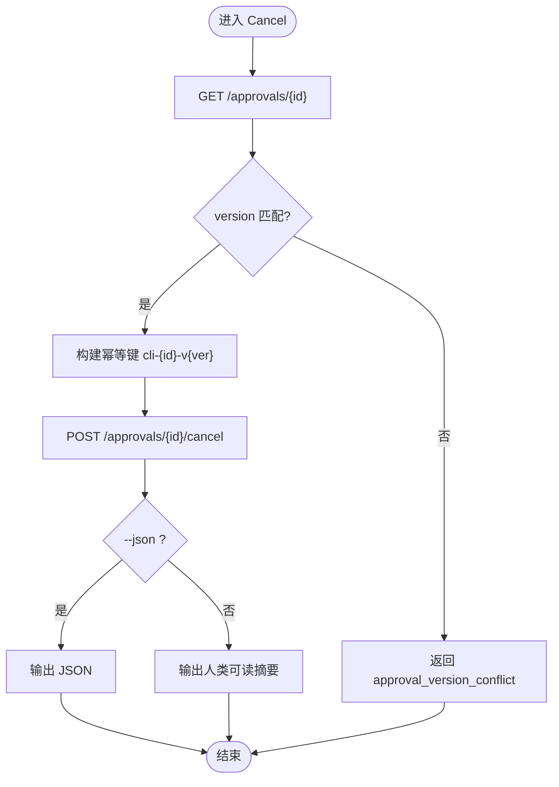
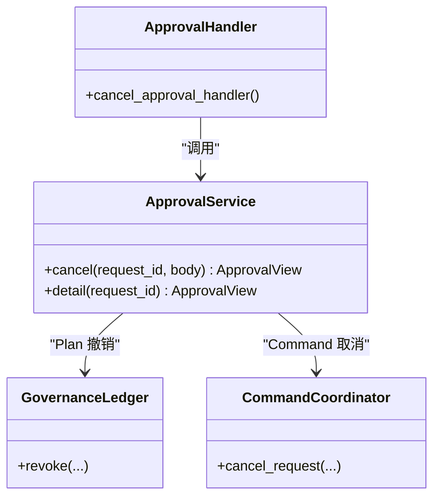
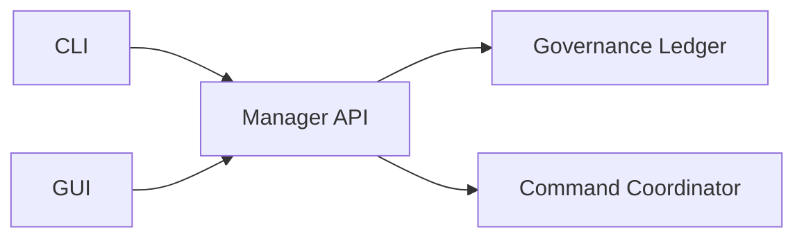

# 取消请求命令

<cite>
**本文引用的文件**
- [agent-diva-cli/src/main.rs](file://agent-diva-cli/src/main.rs)
- [agent-diva-cli/src/approval_commands.rs](file://agent-diva-cli/src/approval_commands.rs)
- [agent-diva-cli/src/client.rs](file://agent-diva-cli/src/client.rs)
- [agent-diva-manager/src/handlers/approvals.rs](file://agent-diva-manager/src/handlers/approvals.rs)
- [agent-diva-manager/src/approval_service.rs](file://agent-diva-manager/src/approval_service.rs)
- [agent-diva-gui/src/App.vue](file://agent-diva-gui/src/App.vue)
</cite>

## 目录
1. [简介](#简介)
2. [项目结构](#项目结构)
3. [核心组件](#核心组件)
4. [架构总览](#架构总览)
5. [详细组件分析](#详细组件分析)
6. [依赖关系分析](#依赖关系分析)
7. [性能与可靠性](#性能与可靠性)
8. [故障排查指南](#故障排查指南)
9. [结论](#结论)
10. [附录：API 与用法](#附录api-与用法)

## 简介
本文件面向“审批取消”能力，聚焦 CLI 子命令 approvals cancel 的语法、使用场景、影响范围与后续流程。内容涵盖：
- 取消待处理审批请求
- 撤销已做出的决策（针对计划类审批）
- 清理过期审批（系统自动/服务侧幂等处理）
- 取消原因记录与审计追踪（通过治理账本事件）
- 批量与条件取消的高级操作建议

## 项目结构
审批取消涉及 CLI 层、Manager 服务层、GUI 调用以及底层治理与沙箱协调器。关键路径如下：
- CLI 解析 approvals cancel 参数并调用 Manager API
- Manager 路由将请求分发到 ApprovalService.cancel
- 根据领域（command/plan）分别走命令取消或治理撤销
- 结果以统一视图返回，并通过事件流持久化审计

**图表来源**
- [agent-diva-cli/src/main.rs:207-242](file://agent-diva-cli/src/main.rs#L207-L242)
- [agent-diva-cli/src/client.rs:131-150](file://agent-diva-cli/src/client.rs#L131-L150)
- [agent-diva-manager/src/handlers/approvals.rs:45-58](file://agent-diva-manager/src/handlers/approvals.rs#L45-L58)
- [agent-diva-manager/src/handlers/approvals.rs:115-134](file://agent-diva-manager/src/handlers/approvals.rs#L115-L134)
- [agent-diva-manager/src/approval_service.rs:207-237](file://agent-diva-manager/src/approval_service.rs#L207-L237)

**章节来源**
- [agent-diva-cli/src/main.rs:207-242](file://agent-diva-cli/src/main.rs#L207-L242)
- [agent-diva-cli/src/client.rs:131-150](file://agent-diva-cli/src/client.rs#L131-L150)
- [agent-diva-manager/src/handlers/approvals.rs:45-58](file://agent-diva-manager/src/handlers/approvals.rs#L45-L58)
- [agent-diva-manager/src/handlers/approvals.rs:115-134](file://agent-diva-manager/src/handlers/approvals.rs#L115-L134)
- [agent-diva-manager/src/approval_service.rs:207-237](file://agent-diva-manager/src/approval_service.rs#L207-L237)

## 核心组件
- CLI 命令定义与执行：ApprovalCommands::Cancel，负责参数解析、版本校验、调用 apply_choice(Cancel)
- CLI 客户端：ApiClient::cancel_approval，封装 HTTP POST 到 /approvals/{id}/cancel
- Manager 路由：POST /api/approvals/:request_id/cancel -> cancel_approval_handler
- 服务层：ApprovalService::cancel，按领域分派到命令取消或治理撤销
- GUI 集成：App.vue 中 cancelUnifiedApproval 调用 Tauri 命令转发至 Manager

**章节来源**
- [agent-diva-cli/src/main.rs:207-242](file://agent-diva-cli/src/main.rs#L207-L242)
- [agent-diva-cli/src/main.rs:600-615](file://agent-diva-cli/src/main.rs#L600-L615)
- [agent-diva-cli/src/approval_commands.rs:79-90](file://agent-diva-cli/src/approval_commands.rs#L79-L90)
- [agent-diva-cli/src/client.rs:131-150](file://agent-diva-cli/src/client.rs#L131-L150)
- [agent-diva-manager/src/handlers/approvals.rs:115-134](file://agent-diva-manager/src/handlers/approvals.rs#L115-L134)
- [agent-diva-manager/src/approval_service.rs:207-237](file://agent-diva-manager/src/approval_service.rs#L207-L237)
- [agent-diva-gui/src/App.vue:602-620](file://agent-diva-gui/src/App.vue#L602-L620)

## 架构总览
取消请求的生命周期包括：
- 客户端发起取消（携带 expected_version 与 idempotency_key）
- 服务端校验版本与幂等键
- 根据领域选择取消路径：
  - Command：调用命令协调器的 cancel_request，直接中断等待
  - Plan：调用治理账本的 revoke，撤销已批准的决策
- 返回统一视图，状态变为 Revoked/Cancelled，并产生审计事件

**图表来源**
- [agent-diva-cli/src/main.rs:600-615](file://agent-diva-cli/src/main.rs#L600-L615)
- [agent-diva-cli/src/client.rs:131-150](file://agent-diva-cli/src/client.rs#L131-L150)
- [agent-diva-manager/src/handlers/approvals.rs:115-134](file://agent-diva-manager/src/handlers/approvals.rs#L115-L134)
- [agent-diva-manager/src/approval_service.rs:207-237](file://agent-diva-manager/src/approval_service.rs#L207-L237)

## 详细组件分析

### CLI 命令 approvals cancel
- 参数
  - request_id：必填，目标审批请求 ID
  - --version：必填，期望的版本号，用于乐观锁
  - --json：可选，输出结构化 JSON
- 行为
  - 先获取当前审批详情，校验 version
  - 构造幂等键 cli-{request_id}-v{version}
  - 调用 apply_choice(Cancel)，最终调用 ApiClient::cancel_approval
- 输出
  - 默认打印人类可读摘要；--json 时输出完整 ApprovalView

**图表来源**
- [agent-diva-cli/src/main.rs:600-615](file://agent-diva-cli/src/main.rs#L600-L615)
- [agent-diva-cli/src/approval_commands.rs:79-90](file://agent-diva-cli/src/approval_commands.rs#L79-L90)
- [agent-diva-cli/src/client.rs:131-150](file://agent-diva-cli/src/client.rs#L131-L150)

**章节来源**
- [agent-diva-cli/src/main.rs:207-242](file://agent-diva-cli/src/main.rs#L207-L242)
- [agent-diva-cli/src/main.rs:600-615](file://agent-diva-cli/src/main.rs#L600-L615)
- [agent-diva-cli/src/approval_commands.rs:79-90](file://agent-diva-cli/src/approval_commands.rs#L79-L90)
- [agent-diva-cli/src/client.rs:131-150](file://agent-diva-cli/src/client.rs#L131-L150)

### Manager 路由与服务层
- 路由：POST /api/approvals/:request_id/cancel
- 处理器：解析 UnifiedCancelBody，调用 ApprovalService::cancel
- 服务层：
  - 读取当前状态，判断领域
  - Command：调用 command_approvals.cancel_request
  - Plan：调用 governance.revoke
  - 返回统一视图，包含 actions、reason_code、presentation（按需）

**图表来源**
- [agent-diva-manager/src/handlers/approvals.rs:45-58](file://agent-diva-manager/src/handlers/approvals.rs#L45-L58)
- [agent-diva-manager/src/handlers/approvals.rs:115-134](file://agent-diva-manager/src/handlers/approvals.rs#L115-L134)
- [agent-diva-manager/src/approval_service.rs:207-237](file://agent-diva-manager/src/approval_service.rs#L207-L237)

**章节来源**
- [agent-diva-manager/src/handlers/approvals.rs:115-134](file://agent-diva-manager/src/handlers/approvals.rs#L115-L134)
- [agent-diva-manager/src/approval_service.rs:207-237](file://agent-diva-manager/src/approval_service.rs#L207-L237)

### GUI 集成
- App.vue 提供 cancelUnifiedApproval，调用 Tauri 命令 cancel_approval，向 Manager 发送取消请求
- 成功后刷新本地缓存并更新抽屉详情

**章节来源**
- [agent-diva-gui/src/App.vue:602-620](file://agent-diva-gui/src/App.vue#L602-L620)

## 依赖关系分析
- CLI 依赖 Manager 提供的 RESTful API
- Manager 依赖治理账本（governance）与命令协调器（command_approvals）
- GUI 通过 Tauri 命令桥接 Manager API
- 所有变更均通过治理事件流进行审计与回放

**图表来源**
- [agent-diva-cli/src/client.rs:131-150](file://agent-diva-cli/src/client.rs#L131-L150)
- [agent-diva-manager/src/handlers/approvals.rs:45-58](file://agent-diva-manager/src/handlers/approvals.rs#L45-L58)
- [agent-diva-manager/src/approval_service.rs:207-237](file://agent-diva-manager/src/approval_service.rs#L207-L237)
- [agent-diva-gui/src/App.vue:602-620](file://agent-diva-gui/src/App.vue#L602-L620)

**章节来源**
- [agent-diva-cli/src/client.rs:131-150](file://agent-diva-cli/src/client.rs#L131-L150)
- [agent-diva-manager/src/handlers/approvals.rs:45-58](file://agent-diva-manager/src/handlers/approvals.rs#L45-L58)
- [agent-diva-manager/src/approval_service.rs:207-237](file://agent-diva-manager/src/approval_service.rs#L207-L237)
- [agent-diva-gui/src/App.vue:602-620](file://agent-diva-gui/src/App.vue#L602-L620)

## 性能与可靠性
- 幂等性：每次取消必须携带 idempotency_key，重复提交不会重复撤销
- 并发安全：通过 expected_version 实现乐观锁，避免竞态
- 超时与过期：服务层会主动 materialize_expired，确保过期审批被正确标记
- 可观测性：通过事件流（approval.requested / approval.resolved）与 reason_code 暴露状态变化

[本节为通用指导，不直接分析具体文件]

## 故障排查指南
常见错误码与含义：
- approval_version_conflict：版本号不一致，需重新获取最新审批详情
- approval_already_resolved：请求已被解决，无需再次取消
- approval_outcome_unknown：结果未知，建议重试或刷新
- approval_invalid_body/query：请求体或查询参数格式错误
- approval_queue_unavailable：服务不可用，检查网络连接或 Manager 状态

定位步骤：
- 使用 approvals list 查看当前状态与 actions
- 使用 --json 输出完整 ApprovalView，关注 status、reason_code、actions
- 通过 events 接口或 SSE 订阅观察状态流转
- 对失败请求记录 correlation/request_id 以便审计回溯

**章节来源**
- [agent-diva-manager/src/handlers/approvals.rs:206-279](file://agent-diva-manager/src/handlers/approvals.rs#L206-L279)
- [agent-diva-cli/src/client.rs:294-308](file://agent-diva-cli/src/client.rs#L294-L308)

## 结论
approvals cancel 提供了统一的取消能力，覆盖命令与计划两类审批。通过版本控制与幂等键保证一致性，结合治理账本事件实现可审计与可回放。对于批量与条件取消，可在上层编排多次调用或使用筛选列表后循环处理。

[本节为总结，不直接分析具体文件]

## 附录：API 与用法

### CLI 语法
- 列出待处理审批：agent-diva approvals list [--status pending] [--session <id>] [--json]
- 取消单个审批：agent-diva approvals cancel <request_id> --version <n> [--json]
- 交互式审查：agent-diva approvals review [--session <id>]

说明：
- request_id：从 approvals list 或事件流中获得
- version：当前审批的版本号，必须与服务器一致
- json：便于脚本化处理

**章节来源**
- [agent-diva-cli/src/main.rs:207-242](file://agent-diva-cli/src/main.rs#L207-L242)
- [agent-diva-cli/src/main.rs:600-615](file://agent-diva-cli/src/main.rs#L600-L615)

### Manager HTTP API
- POST /api/approvals/{request_id}/cancel
- 请求体：
  - expected_version：u64
  - idempotency_key：string
- 响应：统一 ApprovalView，包含 status、actions、reason_code、presentation（按需）

**章节来源**
- [agent-diva-manager/src/handlers/approvals.rs:45-58](file://agent-diva-manager/src/handlers/approvals.rs#L45-L58)
- [agent-diva-manager/src/handlers/approvals.rs:115-134](file://agent-diva-manager/src/handlers/approvals.rs#L115-L134)
- [agent-diva-manager/src/approval_service.rs:207-237](file://agent-diva-manager/src/approval_service.rs#L207-L237)

### 使用场景与最佳实践
- 取消待处理命令审批：适用于误触发或策略变更的场景，命令等待将被中断
- 撤销计划审批：适用于已批准但需要撤回的计划执行，通过治理撤销实现
- 清理过期审批：服务侧会自动标记过期；如需显式清理，可调用 detail 触发过期处理
- 批量取消：先 list 过滤出目标集合，再循环调用 cancel，注意幂等键唯一
- 条件取消：基于 session、domain、risk 等字段筛选后再取消

**章节来源**
- [agent-diva-manager/src/approval_service.rs:160-189](file://agent-diva-manager/src/approval_service.rs#L160-L189)
- [agent-diva-manager/src/approval_service.rs:336-366](file://agent-diva-manager/src/approval_service.rs#L336-L366)
- [agent-diva-cli/src/client.rs:56-93](file://agent-diva-cli/src/client.rs#L56-L93)