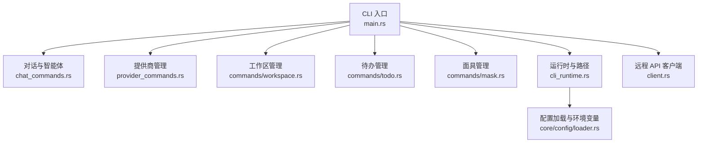
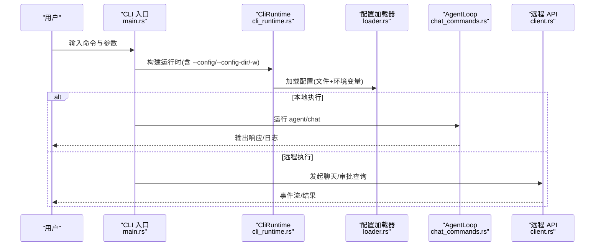
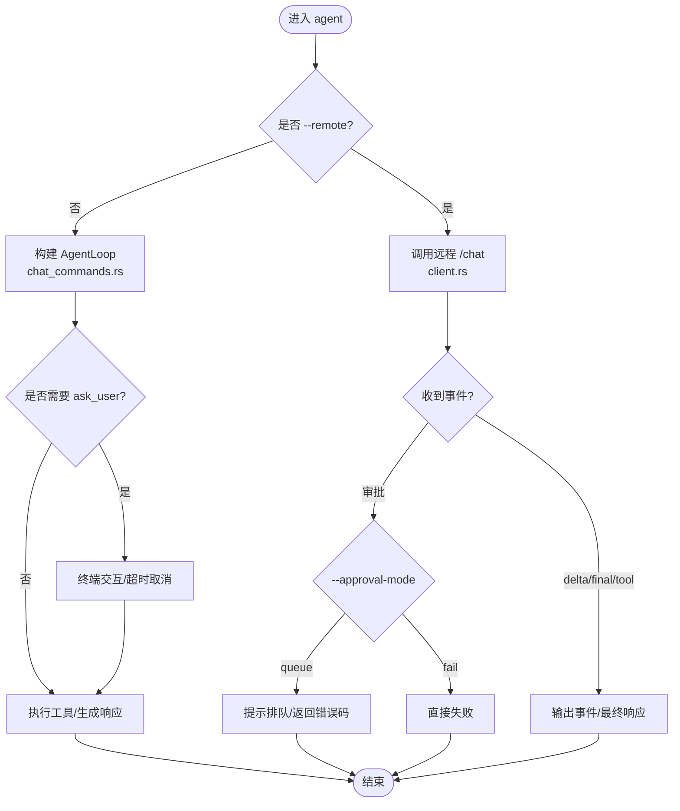
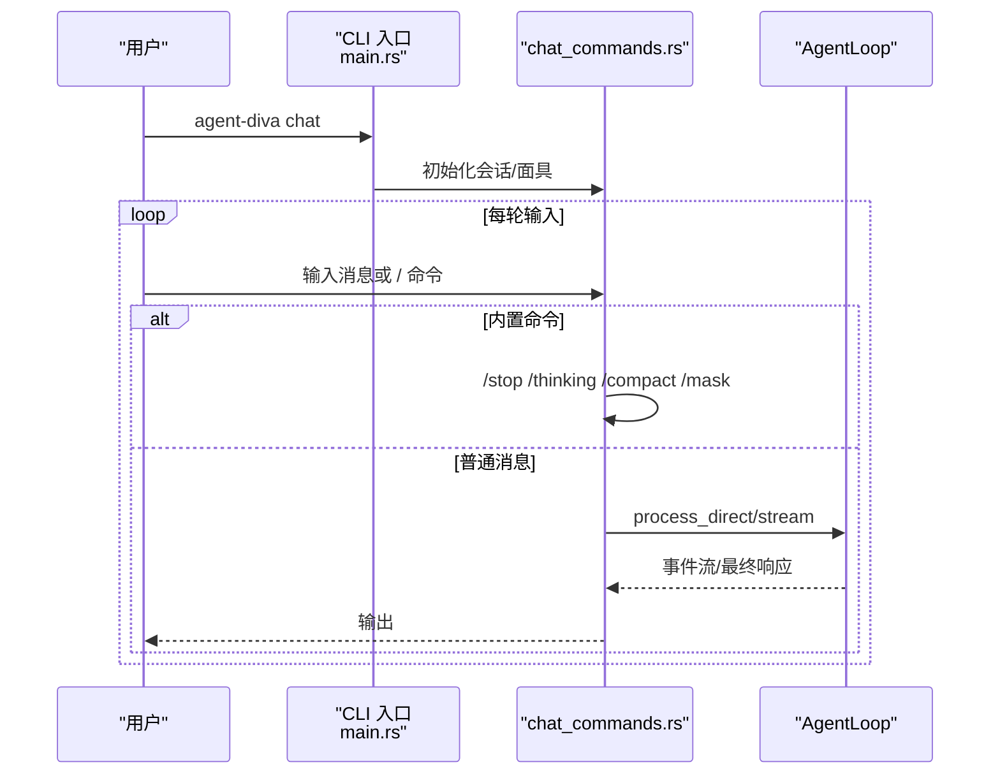
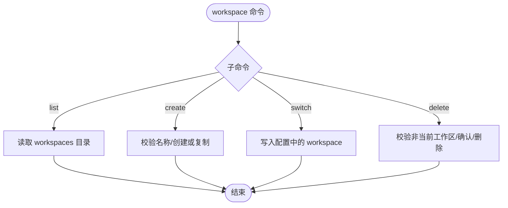
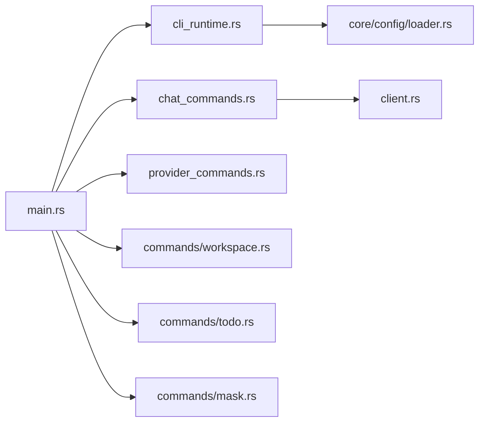

# CLI 命令参考

<cite>
**本文引用的文件**
- [main.rs](file://agent-diva-cli/src/main.rs)
- [chat_commands.rs](file://agent-diva-cli/src/chat_commands.rs)
- [provider_commands.rs](file://agent-diva-cli/src/provider_commands.rs)
- [workspace.rs](file://agent-diva-cli/src/commands/workspace.rs)
- [todo.rs](file://agent-diva-cli/src/commands/todo.rs)
- [mask.rs](file://agent-diva-cli/src/commands/mask.rs)
- [cli_runtime.rs](file://agent-diva-cli/src/cli_runtime.rs)
- [client.rs](file://agent-diva-cli/src/client.rs)
- [loader.rs](file://agent-diva-core/src/config/loader.rs)
</cite>

## 目录
1. [简介](#简介)
2. [项目结构](#项目结构)
3. [核心组件](#核心组件)
4. [架构总览](#架构总览)
5. [详细组件分析](#详细组件分析)
6. [依赖关系分析](#依赖关系分析)
7. [性能与输出格式](#性能与输出格式)
8. [故障排除与调试](#故障排除与调试)
9. [结论](#结论)
10. [附录：常用命令组合与脚本化示例](#附录：常用命令组合与脚本化示例)

## 简介
本参考文档面向 agent-diva 的命令行工具，覆盖以下功能模块：智能体交互（agent）、对话管理（chat）、服务控制（gateway）、配置管理（config）、工作区操作（workspace），以及待办（todo）和面具（mask）等辅助能力。文档提供命令语法、参数说明、使用示例、环境变量与配置文件说明、输出格式选项，以及常见问题的排查方法。

## 项目结构
CLI 入口位于 agent-diva-cli 包，通过 clap 定义全局选项与子命令；各子命令由独立模块实现：
- 主入口与命令路由：main.rs
- 对话与智能体执行：chat_commands.rs
- 提供商（Provider）管理：provider_commands.rs
- 工作区管理：commands/workspace.rs
- 待办管理：commands/todo.rs
- 面具管理：commands/mask.rs
- 运行时与路径解析：cli_runtime.rs
- 远程 API 客户端：client.rs
- 配置加载与环境变量合并：core/config/loader.rs

**图示来源**
- [main.rs:59-205](file://agent-diva-cli/src/main.rs#L59-L205)
- [cli_runtime.rs:14-155](file://agent-diva-cli/src/cli_runtime.rs#L14-L155)
- [loader.rs:57-82](file://agent-diva-core/src/config/loader.rs#L57-L82)

**章节来源**
- [main.rs:59-205](file://agent-diva-cli/src/main.rs#L59-L205)
- [cli_runtime.rs:14-155](file://agent-diva-cli/src/cli_runtime.rs#L14-L155)

## 核心组件
- 全局选项
  - --config：指定配置文件路径
  - --config-dir：指定配置目录
  - -w/--workspace：临时覆盖工作区路径
  - --remote：连接远程 agent-diva-manager
  - --api-url：远程 API 地址（默认 http://localhost:3000/api）
- 命令分组
  - agent：发送消息给智能体（支持本地或远程、流式日志、审批模式、JSON 输出）
  - chat：轻量交互式对话（支持模型、会话、渲染模式、日志）
  - gateway：启动网关（当前为前台运行）
  - config：配置路径、初始化、刷新、校验、医生检查、显示有效配置
  - workspace：列出、创建、切换、删除受管工作区
  - todo：列出、新增、更新、归档、清理待办
  - mask：列出、切换、查看、创建、编辑、删除面具
  - provider：列出、状态、设置、登录、模型列表
  - approvals：列出、决策、取消、审查审批项
  - channels：渠道登录与状态
  - cron：定时任务增删改查与手动执行
  - service：Windows 服务管理
  - status：系统状态信息

**章节来源**
- [main.rs:59-205](file://agent-diva-cli/src/main.rs#L59-L205)
- [main.rs:207-439](file://agent-diva-cli/src/main.rs#L207-L439)

## 架构总览
CLI 在启动时解析参数并初始化 CliRuntime，随后根据子命令分发到对应处理函数。agent 与 chat 支持本地 AgentLoop 执行或远程 Manager 调用；provider 与 config 通过配置加载器读取与保存；workspace/todos/masks 直接操作工作区与数据目录。

**图示来源**
- [main.rs:441-773](file://agent-diva-cli/src/main.rs#L441-L773)
- [cli_runtime.rs:117-155](file://agent-diva-cli/src/cli_runtime.rs#L117-L155)
- [loader.rs:57-82](file://agent-diva-core/src/config/loader.rs#L57-L82)
- [client.rs:43-54](file://agent-diva-cli/src/client.rs#L43-L54)

## 详细组件分析

### agent 命令（智能体交互）
- 用途：向智能体发送单条消息，支持本地或远程执行、流式日志、Markdown 渲染、无头审批模式与 JSON 输出。
- 关键参数
  - --message：消息内容（必填）
  - -m/--model：指定模型
  - -s/--session：会话键
  - --markdown / --no-markdown：是否以 Markdown 友好方式渲染
  - --logs / --no-logs：是否打印推理与工具调用日志
  - --approval-mode：headless 审批模式（fail/queue）
  - --json：结构化输出
  - 全局：--remote, --api-url, -w/--workspace, --config, --config-dir
- 行为要点
  - 本地模式：构建 AgentLoop，支持 ask_user 交互与命令审批规则；若需要审批且处于非交互环境，会返回错误码或进入队列模式。
  - 远程模式：通过 ApiClient 调用 /chat，订阅事件流；若出现审批请求，会根据 approval-mode 决定拒绝或排队提示。
- 典型用法
  - 本地单轮：agent-diva agent --message "你好"
  - 远程流式：agent-diva agent --message "请总结" --remote --logs
  - 无头失败：agent-diva agent --message "执行命令" --approval-mode fail
  - 无头排队：agent-diva agent --message "执行命令" --approval-mode queue

**图示来源**
- [main.rs:489-537](file://agent-diva-cli/src/main.rs#L489-L537)
- [chat_commands.rs:375-448](file://agent-diva-cli/src/chat_commands.rs#L375-L448)
- [chat_commands.rs:537-663](file://agent-diva-cli/src/chat_commands.rs#L537-L663)
- [client.rs:152-200](file://agent-diva-cli/src/client.rs#L152-L200)

**章节来源**
- [main.rs:98-127](file://agent-diva-cli/src/main.rs#L98-L127)
- [main.rs:489-537](file://agent-diva-cli/src/main.rs#L489-L537)
- [chat_commands.rs:375-448](file://agent-diva-cli/src/chat_commands.rs#L375-L448)
- [chat_commands.rs:537-663](file://agent-diva-cli/src/chat_commands.rs#L537-L663)

### chat 命令（对话管理）
- 用途：轻量交互式对话循环，支持 /quit、/clear、/new、/stop、/thinking、/compact、/mask 等内置命令。
- 关键参数
  - -m/--model：指定模型
  - -s/--session：会话键
  - --markdown / --no-markdown：渲染模式
  - --logs / --no-logs：是否打印推理与工具日志
  - 全局：--remote, --api-url, -w/--workspace, --config, --config-dir
- 行为要点
  - 本地模式：维护会话、面具注册表，支持运行时控制（停止会话、压缩会话、切换思考模式）。
  - 远程模式：通过 /chat 接口进行流式交互。
- 典型用法
  - 本地对话：agent-diva chat
  - 指定会话：agent-diva chat -s my-session
  - 远程对话：agent-diva chat --remote

**图示来源**
- [main.rs:128-148](file://agent-diva-cli/src/main.rs#L128-L148)
- [main.rs:538-553](file://agent-diva-cli/src/main.rs#L538-L553)
- [chat_commands.rs:665-778](file://agent-diva-cli/src/chat_commands.rs#L665-L778)

**章节来源**
- [main.rs:128-148](file://agent-diva-cli/src/main.rs#L128-L148)
- [chat_commands.rs:665-778](file://agent-diva-cli/src/chat_commands.rs#L665-L778)

### gateway 命令（服务控制）
- 用途：启动网关进程（当前版本仅支持前台运行）。
- 典型用法
  - agent-diva gateway run

**章节来源**
- [main.rs:93-97](file://agent-diva-cli/src/main.rs#L93-L97)
- [main.rs:258-263](file://agent-diva-cli/src/main.rs#L258-L263)
- [main.rs:481-488](file://agent-diva-cli/src/main.rs#L481-L488)

### config 命令（配置管理）
- 子命令
  - path：打印解析后的配置与运行时路径
  - init：非交互式初始化（onboard 语义）
  - refresh：刷新配置与工作区模板，不覆盖用户值
  - validate：校验配置结构与语义规则
  - doctor：校验 + 运行时就绪检查
  - show：显示当前有效配置（支持 pretty/json）
- 关键参数
  - --json：结构化输出（path/validate/doctor/show 等）
  - format：show 的输出格式（pretty/json）
- 典型用法
  - agent-diva config path --json
  - agent-diva config validate
  - agent-diva config doctor
  - agent-diva config show --format json

**章节来源**
- [main.rs:175-179](file://agent-diva-cli/src/main.rs#L175-L179)
- [main.rs:396-439](file://agent-diva-cli/src/main.rs#L396-L439)
- [main.rs:689-696](file://agent-diva-cli/src/main.rs#L689-L696)

### workspace 命令（工作区操作）
- 子命令
  - list：列出受管工作区（config-dir/workspaces）
  - create：创建工作区（可选从源路径复制）
  - switch：切换到指定工作区（写入配置）
  - delete：删除工作区（需确认或 --force）
- 安全约束
  - 名称必须为单一目录名，禁止路径穿越
  - 不能删除当前活跃工作区
- 典型用法
  - agent-diva workspace list
  - agent-diva workspace create --name projectA
  - agent-diva workspace switch --name projectA
  - agent-diva workspace delete --name projectA --force

**图示来源**
- [workspace.rs:8-34](file://agent-diva-cli/src/commands/workspace.rs#L8-L34)
- [workspace.rs:36-152](file://agent-diva-cli/src/commands/workspace.rs#L36-L152)
- [workspace.rs:154-202](file://agent-diva-cli/src/commands/workspace.rs#L154-L202)

**章节来源**
- [workspace.rs:8-34](file://agent-diva-cli/src/commands/workspace.rs#L8-L34)
- [workspace.rs:36-152](file://agent-diva-cli/src/commands/workspace.rs#L36-L152)

### todo 命令（待办管理）
- 子命令
  - list：列出所有待办
  - add：新增待办
  - update：更新状态（open/pending/active/done/completed/cancelled）
  - archive：归档完成超过 N 天的待办
  - purge：清理超过 N 个月的归档文件
- 存储位置
  - 基于工作区下的 todos 目录（JsonlTodoStore）
- 典型用法
  - agent-diva todo add --title "修复登录问题"
  - agent-diva todo update --id <id> --status done
  - agent-diva todo archive --days 30
  - agent-diva todo purge --months 6

**章节来源**
- [todo.rs:6-36](file://agent-diva-cli/src/commands/todo.rs#L6-L36)
- [todo.rs:38-110](file://agent-diva-cli/src/commands/todo.rs#L38-L110)

### mask 命令（面具管理）
- 子命令
  - list：列出所有面具（含默认身份）
  - switch：按 name/id 切换激活面具
  - show：显示面具 frontmatter 与正文
  - create：从 markdown 文件创建面具
  - edit：用新文件替换现有面具（保留稳定 id）
  - delete：按 name/id 删除面具
- 存储位置
  - 工作区下的 masks 目录
- 典型用法
  - agent-diva mask list
  - agent-diva mask switch --name coder
  - agent-diva mask create --file ./persona.md
  - agent-diva mask edit --name coder --file ./persona_v2.md
  - agent-diva mask delete --name reviewer

**章节来源**
- [mask.rs:8-58](file://agent-diva-cli/src/commands/mask.rs#L8-L58)
- [mask.rs:60-193](file://agent-diva-cli/src/commands/mask.rs#L60-L193)
- [mask.rs:195-263](file://agent-diva-cli/src/commands/mask.rs#L195-L263)

### provider 命令（提供商管理）
- 子命令
  - list：列出可管理的提供商及其状态
  - status：查看当前模型/提供商及缺失字段
  - set：设置默认提供商/模型/凭据（支持 api_base）
  - login：占位实现（未实现 OAuth/device flow）
  - models：获取提供商可用模型（支持静态回退）
- 输出
  - 多数命令支持 --json 结构化输出
- 典型用法
  - agent-diva provider list
  - agent-diva provider status
  - agent-diva provider set --provider openai --model gpt-4o
  - agent-diva provider models --provider openai --json

**章节来源**
- [main.rs:170-174](file://agent-diva-cli/src/main.rs#L170-L174)
- [main.rs:274-319](file://agent-diva-cli/src/main.rs#L274-L319)
- [provider_commands.rs:25-234](file://agent-diva-cli/src/provider_commands.rs#L25-L234)

### approvals 命令（审批管理）
- 子命令
  - list：列出审批（默认 pending，支持 session 过滤）
  - decide：对请求做出决策（allow-once/session/rule/deny）
  - cancel：撤销待处理请求
  - review：交互式审查所有待处理请求
- 输出
  - 支持 --json 结构化输出
- 典型用法
  - agent-diva approvals list --json
  - agent-diva approvals decide --request-id <id> --version <v> --decision allow-once
  - agent-diva approvals cancel --request-id <id> --version <v>

**章节来源**
- [main.rs:149-153](file://agent-diva-cli/src/main.rs#L149-L153)
- [main.rs:207-242](file://agent-diva-cli/src/main.rs#L207-L242)
- [main.rs:554-635](file://agent-diva-cli/src/main.rs#L554-L635)

### channels 命令（渠道管理）
- 子命令
  - login：登录渠道
  - status：渠道状态
- 典型用法
  - agent-diva channels login telegram
  - agent-diva channels status

**章节来源**
- [main.rs:165-169](file://agent-diva-cli/src/main.rs#L165-L169)
- [main.rs:265-272](file://agent-diva-cli/src/main.rs#L265-L272)
- [main.rs:652-665](file://agent-diva-cli/src/main.rs#L652-L665)

### cron 命令（定时任务）
- 子命令
  - add：添加任务（支持 every/cron_expr/at/timezone/deliver/to/channel）
  - list：列出任务（--all 包含禁用）
  - remove：删除任务
  - enable：启用/禁用任务
  - run：手动执行（--force 忽略禁用）
- 典型用法
  - agent-diva cron add --name daily-summary --cron_expr "0 9 * * *" --deliver true
  - agent-diva cron list --all
  - agent-diva cron run --job-id <id> --force

**章节来源**
- [main.rs:185-189](file://agent-diva-cli/src/main.rs#L185-L189)
- [main.rs:321-381](file://agent-diva-cli/src/main.rs#L321-L381)
- [main.rs:704-748](file://agent-diva-cli/src/main.rs#L704-L748)

### service 命令（服务管理）
- 用途：管理 Windows 服务伴侣
- 典型用法
  - agent-diva service install/start/stop/uninstall（具体子命令由 ServiceCommands 定义）

**章节来源**
- [main.rs:180-184](file://agent-diva-cli/src/main.rs#L180-L184)
- [main.rs:697-703](file://agent-diva-cli/src/main.rs#L697-L703)

### status 命令（状态信息）
- 用途：展示系统状态（提供商、渠道、日志、MCP、医生摘要等）
- 参数
  - --json：结构化输出
- 典型用法
  - agent-diva status --json

**章节来源**
- [main.rs:163-164](file://agent-diva-cli/src/main.rs#L163-L164)
- [main.rs:646-651](file://agent-diva-cli/src/main.rs#L646-L651)

## 依赖关系分析
- CLI 入口依赖 cli_runtime 进行配置与路径解析，依赖 chat_commands 执行智能体与对话，依赖 provider_commands 管理提供商，依赖 commands/* 管理工作区、待办、面具。
- 远程模式通过 client.rs 与 manager 通信，支持事件流与审批查询。
- 配置加载器 loader.rs 负责合并配置文件与环境变量，并提供路径展开与别名覆盖。

**图示来源**
- [main.rs:59-205](file://agent-diva-cli/src/main.rs#L59-L205)
- [cli_runtime.rs:14-155](file://agent-diva-cli/src/cli_runtime.rs#L14-L155)
- [client.rs:43-54](file://agent-diva-cli/src/client.rs#L43-L54)
- [loader.rs:57-82](file://agent-diva-core/src/config/loader.rs#L57-L82)

**章节来源**
- [main.rs:59-205](file://agent-diva-cli/src/main.rs#L59-L205)
- [cli_runtime.rs:14-155](file://agent-diva-cli/src/cli_runtime.rs#L14-L155)
- [client.rs:43-54](file://agent-diva-cli/src/client.rs#L43-L54)
- [loader.rs:57-82](file://agent-diva-core/src/config/loader.rs#L57-L82)

## 性能与输出格式
- 流式输出：agent/chat 支持流式事件（assistant_delta、reasoning_delta、tool_call_*、final_response），适合长响应场景。
- 日志开关：--logs 开启后打印推理与工具调用过程；--no-logs 关闭以减少噪音。
- 结构化输出：多个命令支持 --json，便于脚本化处理与集成。
- 渲染模式：--markdown 将助手输出渲染为 Markdown 友好文本；--no-markdown 关闭。
- 远程优化：当 base_url 为回环地址时，自动禁用代理以提升本地通信效率。

**章节来源**
- [chat_commands.rs:285-364](file://agent-diva-cli/src/chat_commands.rs#L285-L364)
- [chat_commands.rs:466-535](file://agent-diva-cli/src/chat_commands.rs#L466-L535)
- [client.rs:39-54](file://agent-diva-cli/src/client.rs#L39-L54)

## 故障排除与调试
- 常见问题
  - 审批阻塞：在非交互模式下遇到审批请求会返回错误码或进入队列；可通过 approvals 命令处理或调整 --approval-mode。
  - 提供商未配置：provider status 会列出缺失字段；使用 provider set 补齐。
  - 工作区无效：workspace 命令会校验名称与当前活动状态；确保名称合法且非当前工作区。
  - 远程不可达：--remote 时需确保 --api-url 可达；否则报错。
- 调试建议
  - 使用 --logs 查看推理与工具调用细节。
  - 使用 config doctor 检查配置与运行时就绪情况。
  - 使用 config validate 验证配置结构与语义规则。
  - 使用 provider models --json 获取模型清单与警告。
  - 使用 approvals list --json 查看待处理审批。

**章节来源**
- [chat_commands.rs:375-448](file://agent-diva-cli/src/chat_commands.rs#L375-L448)
- [chat_commands.rs:537-663](file://agent-diva-cli/src/chat_commands.rs#L537-L663)
- [provider_commands.rs:54-88](file://agent-diva-cli/src/provider_commands.rs#L54-L88)
- [workspace.rs:97-152](file://agent-diva-cli/src/commands/workspace.rs#L97-L152)
- [main.rs:689-696](file://agent-diva-cli/src/main.rs#L689-L696)

## 结论
agent-diva CLI 提供了完整的智能体交互、对话管理、服务控制、配置与工作区管理能力，并通过丰富的参数与结构化输出满足自动化与脚本化需求。结合 provider、approvals、cron、channels 等子命令，可构建端到端的 AI 助手工作流。建议在复杂场景中优先使用 --json 与 --logs 进行调试与集成。

## 附录：常用命令组合与脚本化示例
- 初始化与配置
  - agent-diva config init --provider openai --model gpt-4o --api-key sk-xxx
  - agent-diva config validate
  - agent-diva config doctor
- 智能体交互
  - agent-diva agent --message "总结本周变更" --logs --markdown
  - agent-diva agent --message "执行备份" --approval-mode queue
  - agent-diva agent --message "远程执行" --remote --api-url http://localhost:3000/api
- 对话管理
  - agent-diva chat -s weekly-review --logs
  - agent-diva chat --remote
- 提供商管理
  - agent-diva provider set --provider openai --model gpt-4o
  - agent-diva provider models --provider openai --json
- 工作区管理
  - agent-diva workspace create --name projA
  - agent-diva workspace switch --name projA
- 待办与面具
  - agent-diva todo add --title "修复登录"
  - agent-diva mask switch --name coder
- 审批处理
  - agent-diva approvals list --json
  - agent-diva approvals decide --request-id <id> --version <v> --decision allow-once

**章节来源**
- [main.rs:98-127](file://agent-diva-cli/src/main.rs#L98-L127)
- [main.rs:128-148](file://agent-diva-cli/src/main.rs#L128-L148)
- [main.rs:170-179](file://agent-diva-cli/src/main.rs#L170-L179)
- [main.rs:185-189](file://agent-diva-cli/src/main.rs#L185-L189)
- [main.rs:274-319](file://agent-diva-cli/src/main.rs#L274-L319)
- [main.rs:321-381](file://agent-diva-cli/src/main.rs#L321-L381)
- [main.rs:396-439](file://agent-diva-cli/src/main.rs#L396-L439)