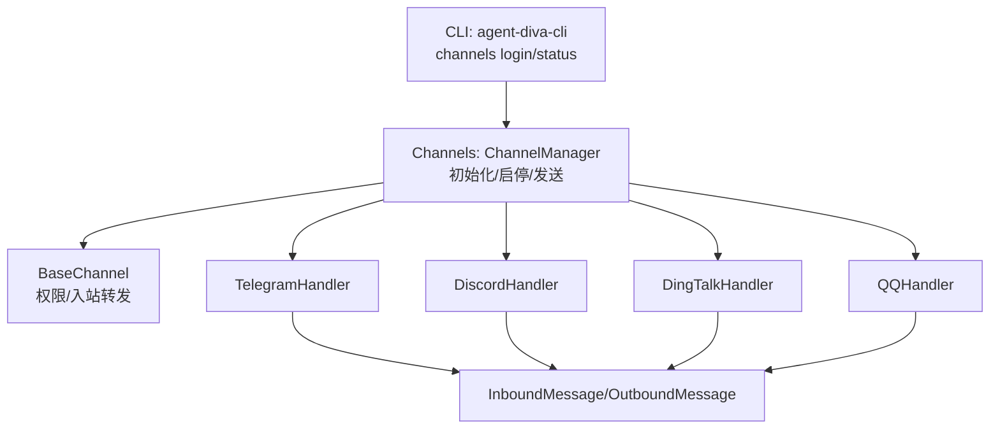
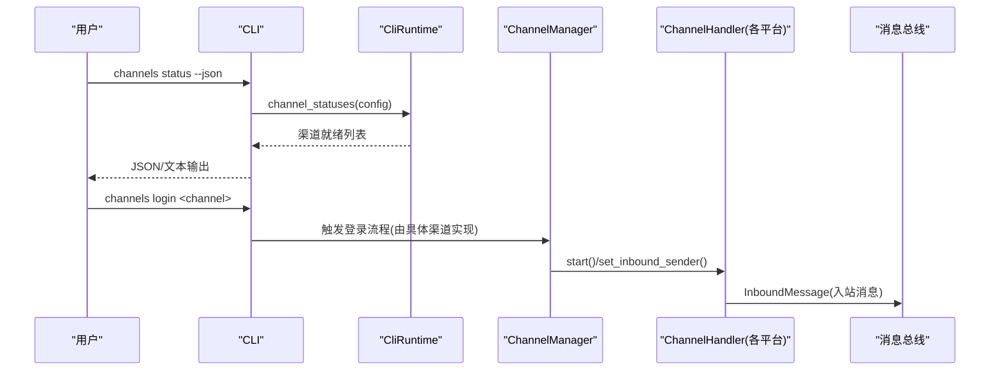
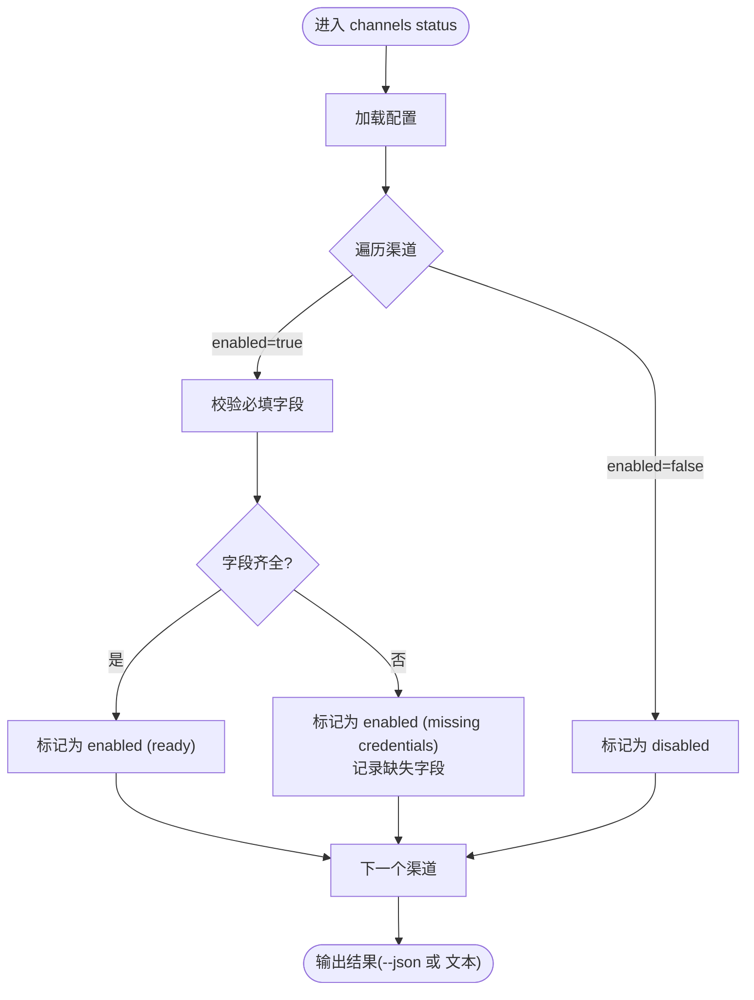
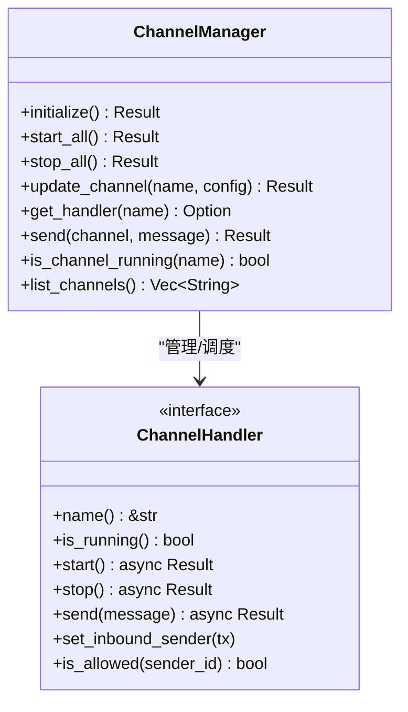
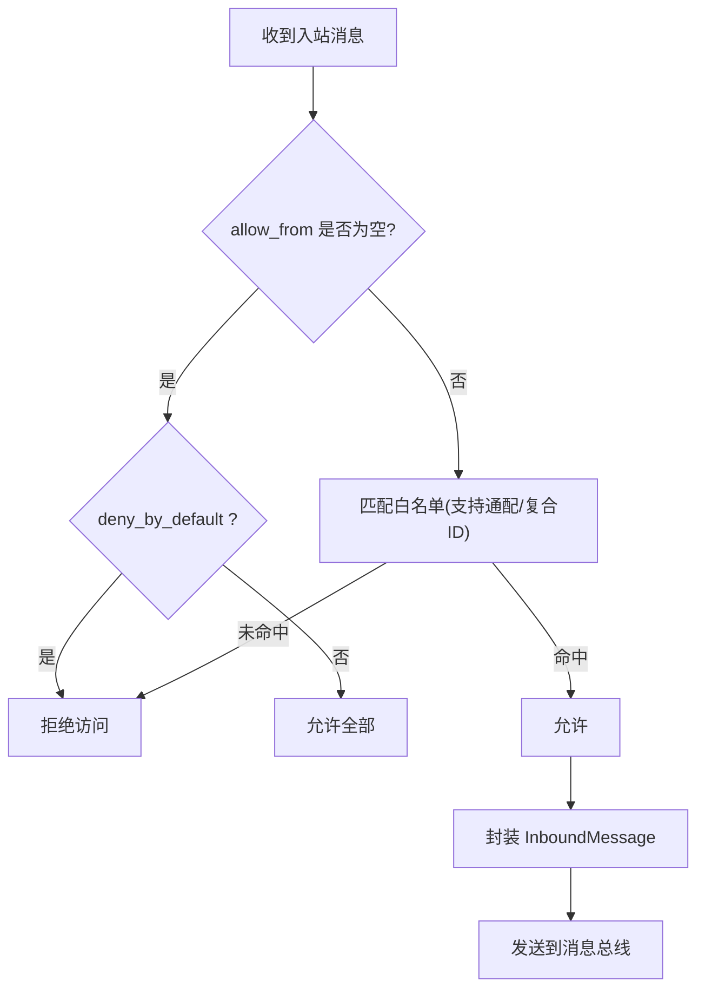
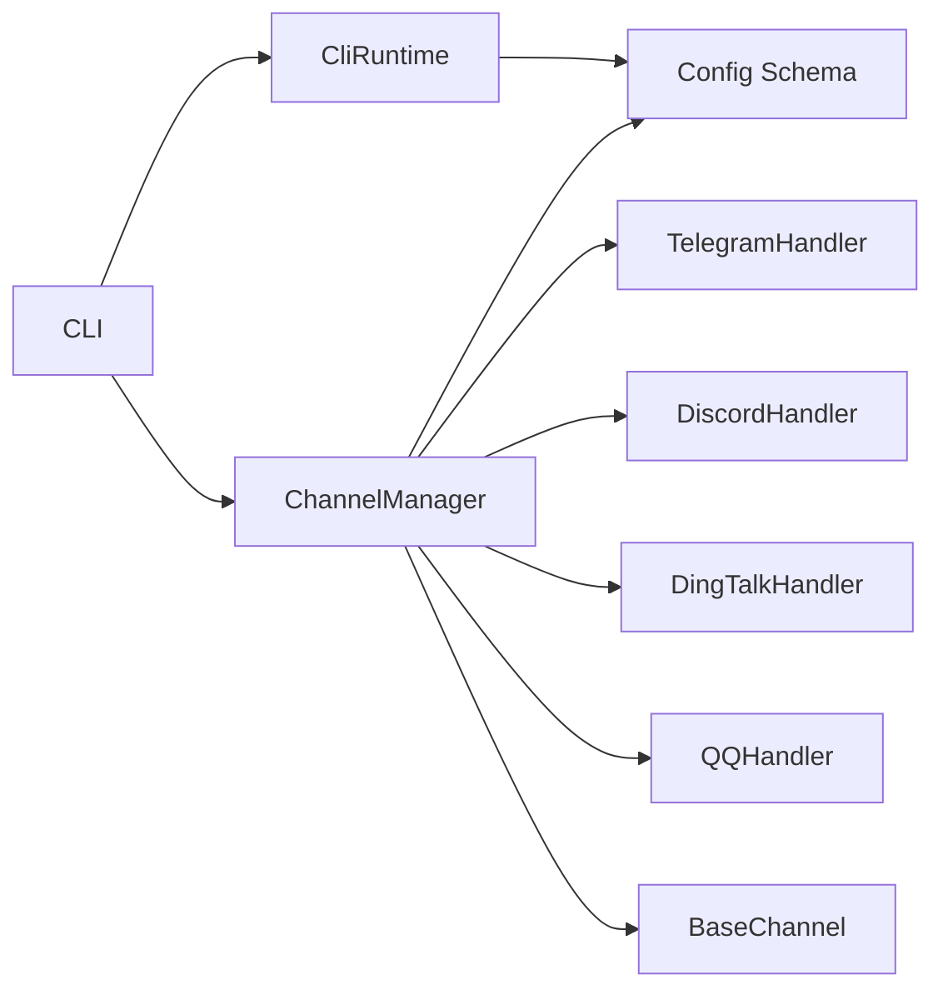

# Channel 渠道命令

<cite>
**本文引用的文件**
- [agent-diva-cli/src/main.rs](file://agent-diva-cli/src/main.rs)
- [agent-diva-cli/src/cli_runtime.rs](file://agent-diva-cli/src/cli_runtime.rs)
- [agent-diva-channels/src/lib.rs](file://agent-diva-channels/src/lib.rs)
- [agent-diva-channels/src/manager.rs](file://agent-diva-channels/src/manager.rs)
- [agent-diva-channels/src/base.rs](file://agent-diva-channels/src/base.rs)
- [agent-diva-channels/src/telegram.rs](file://agent-diva-channels/src/telegram.rs)
- [agent-diva-channels/src/discord.rs](file://agent-diva-channels/src/discord.rs)
- [agent-diva-channels/src/dingtalk.rs](file://agent-diva-channels/src/dingtalk.rs)
- [agent-diva-core/src/config/schema.rs](file://agent-diva-core/src/config/schema.rs)
</cite>

## 目录
1. [简介](#简介)
2. [项目结构](#项目结构)
3. [核心组件](#核心组件)
4. [架构总览](#架构总览)
5. [详细组件分析](#详细组件分析)
6. [依赖分析](#依赖分析)
7. [性能考虑](#性能考虑)
8. [故障诊断指南](#故障诊断指南)
9. [结论](#结论)
10. [附录：渠道配置与命令速查](#附录渠道配置与命令速查)

## 简介
本文件面向“Channel 渠道命令”的使用与运维，覆盖 CLI 子命令 channels login、channels status 的语法与参数；说明多渠道接入的认证配置、连接状态检查、渠道管理；提供 Telegram、Discord、QQ、钉钉等主流平台的配置要点与连接测试方法；并解释消息路由、格式转换、权限控制等高级能力，以及故障诊断、重连机制与性能监控等运维操作。

## 项目结构
- CLI 层负责解析命令与输出结果，包含 channels 子命令入口与状态展示逻辑。
- Channels 层实现各平台通道适配器（Telegram、Discord、DingTalk、QQ 等），并通过统一接口与消息总线对接。
- Core 配置层定义所有渠道的配置结构与默认值，供 CLI 校验与运行时初始化使用。

图表来源
- [agent-diva-cli/src/main.rs:265-272](file://agent-diva-cli/src/main.rs#L265-L272)
- [agent-diva-cli/src/main.rs:652-665](file://agent-diva-cli/src/main.rs#L652-L665)
- [agent-diva-channels/src/manager.rs:378-642](file://agent-diva-channels/src/manager.rs#L378-L642)
- [agent-diva-channels/src/base.rs:73-229](file://agent-diva-channels/src/base.rs#L73-L229)

章节来源
- [agent-diva-cli/src/main.rs:265-272](file://agent-diva-cli/src/main.rs#L265-L272)
- [agent-diva-cli/src/main.rs:652-665](file://agent-diva-cli/src/main.rs#L652-L665)
- [agent-diva-channels/src/lib.rs:1-53](file://agent-diva-channels/src/lib.rs#L1-L53)

## 核心组件
- CLI 命令
  - channels login <channel>：用于渠道登录或引导完成凭据配置（具体行为由目标渠道决定）。
  - channels status [--json]：列出所有渠道是否启用、是否就绪及缺失字段提示。
- 渠道管理器
  - ChannelManager：根据配置初始化、启动、停止各渠道处理器；提供按名称获取处理器、发送消息、更新配置、查询运行状态等能力。
- 基础能力
  - BaseChannel：统一的权限策略（allow_from、deny_by_default）、入站消息封装与转发、会话键与主机校验等工具。

章节来源
- [agent-diva-cli/src/main.rs:265-272](file://agent-diva-cli/src/main.rs#L265-L272)
- [agent-diva-cli/src/main.rs:1672-1703](file://agent-diva-cli/src/main.rs#L1672-L1703)
- [agent-diva-cli/src/cli_runtime.rs:561-596](file://agent-diva-cli/src/cli_runtime.rs#L561-L596)
- [agent-diva-channels/src/manager.rs:42-755](file://agent-diva-channels/src/manager.rs#L42-L755)
- [agent-diva-channels/src/base.rs:73-229](file://agent-diva-channels/src/base.rs#L73-L229)

## 架构总览
下图展示了从 CLI 到渠道适配器的完整调用链，包括状态查询与消息入站流程。

图表来源
- [agent-diva-cli/src/main.rs:652-665](file://agent-diva-cli/src/main.rs#L652-L665)
- [agent-diva-cli/src/cli_runtime.rs:561-596](file://agent-diva-cli/src/cli_runtime.rs#L561-L596)
- [agent-diva-channels/src/manager.rs:378-642](file://agent-diva-channels/src/manager.rs#L378-L642)
- [agent-diva-channels/src/base.rs:186-229](file://agent-diva-channels/src/base.rs#L186-L229)

## 详细组件分析

### CLI 渠道命令
- channels login <channel>
  - 作用：对指定渠道执行登录或凭据引导。
  - 参数：channel（必填）
  - 行为：由 CLI 分发至对应渠道处理逻辑；不同渠道可能要求不同的凭据或交互步骤。
- channels status [--json]
  - 作用：显示各渠道是否启用、是否就绪，以及缺失的必填字段。
  - 参数：--json（可选，结构化输出）
  - 行为：读取当前配置，计算每个渠道 enabled 与 ready 状态，并返回缺失字段列表。

图表来源
- [agent-diva-cli/src/main.rs:1672-1703](file://agent-diva-cli/src/main.rs#L1672-L1703)
- [agent-diva-cli/src/cli_runtime.rs:561-596](file://agent-diva-cli/src/cli_runtime.rs#L561-L596)

章节来源
- [agent-diva-cli/src/main.rs:265-272](file://agent-diva-cli/src/main.rs#L265-L272)
- [agent-diva-cli/src/main.rs:652-665](file://agent-diva-cli/src/main.rs#L652-L665)
- [agent-diva-cli/src/main.rs:1672-1703](file://agent-diva-cli/src/main.rs#L1672-L1703)
- [agent-diva-cli/src/cli_runtime.rs:561-596](file://agent-diva-cli/src/cli_runtime.rs#L561-L596)

### 渠道管理器与生命周期
- 初始化：根据配置逐项创建并注册 ChannelHandler，设置入站消息发送通道。
- 启动：并行启动各渠道处理器；若个别失败，其余继续运行并记录告警。
- 停止：逐个停止处理器并清理资源。
- 动态更新：支持按名称替换配置并重启对应渠道。
- 运行态查询：is_channel_running(name)、list_channels()。

图表来源
- [agent-diva-channels/src/manager.rs:42-755](file://agent-diva-channels/src/manager.rs#L42-L755)
- [agent-diva-channels/src/base.rs:9-32](file://agent-diva-channels/src/base.rs#L9-L32)

章节来源
- [agent-diva-channels/src/manager.rs:378-755](file://agent-diva-channels/src/manager.rs#L378-L755)

### 权限与入站消息
- 权限策略
  - allow_from：白名单，支持通配符匹配（如 *@domain）。
  - deny_by_default：当 allow_from 为空时，可设置为“默认拒绝”。
  - 复合 ID：支持以 | 分隔的多段标识进行匹配。
- 入站消息
  - BaseChannel.handle_message 将 sender_id、chat_id、content、media、metadata 封装为 InboundMessage 并发送至消息总线。
  - 未通过权限校验的消息将被拒绝并记录警告。

图表来源
- [agent-diva-channels/src/base.rs:121-184](file://agent-diva-channels/src/base.rs#L121-L184)
- [agent-diva-channels/src/base.rs:186-229](file://agent-diva-channels/src/base.rs#L186-L229)

章节来源
- [agent-diva-channels/src/base.rs:73-229](file://agent-diva-channels/src/base.rs#L73-L229)

### Telegram 渠道
- 配置要点
  - enabled、token、allow_from、proxy。
- 功能特性
  - 命令：/start、/reset、/help、/stop（通过本地 API 请求停止生成）。
  - Markdown→HTML 转换，支持代码块、链接、粗体、斜体等。
  - 打字指示器、聊天 ID 映射、群组识别。
- 连接测试
  - 设置 token 后运行 channels status，确认 ready；在 Telegram 中向机器人发送消息验证入站。

章节来源
- [agent-diva-core/src/config/schema.rs:644-655](file://agent-diva-core/src/config/schema.rs#L644-L655)
- [agent-diva-channels/src/telegram.rs:18-34](file://agent-diva-channels/src/telegram.rs#L18-L34)
- [agent-diva-channels/src/telegram.rs:108-122](file://agent-diva-channels/src/telegram.rs#L108-L122)
- [agent-diva-channels/src/telegram.rs:151-243](file://agent-diva-channels/src/telegram.rs#L151-L243)
- [agent-diva-channels/src/telegram.rs:415-682](file://agent-diva-channels/src/telegram.rs#L415-L682)

### Discord 渠道
- 配置要点
  - enabled、token、allow_from、gateway_url、intents、guild_id、mention_only、listen_to_bots、group_reply_allowed_sender_ids。
- 功能特性
  - Gateway WebSocket 长连接，心跳与重连。
  - 群聊 @提及过滤、附件下载与大小限制、消息分片（2000 字符限制）。
  - 速率限制重试（429 retry-after）。
- 连接测试
  - 配置 token 与 intents，channels status 显示 ready；在服务器频道或私聊发送消息验证。

章节来源
- [agent-diva-core/src/config/schema.rs:657-706](file://agent-diva-core/src/config/schema.rs#L657-L706)
- [agent-diva-channels/src/discord.rs:22-25](file://agent-diva-channels/src/discord.rs#L22-L25)
- [agent-diva-channels/src/discord.rs:296-318](file://agent-diva-channels/src/discord.rs#L296-L318)
- [agent-diva-channels/src/discord.rs:526-604](file://agent-diva-channels/src/discord.rs#L526-L604)
- [agent-diva-channels/src/discord.rs:698-748](file://agent-diva-channels/src/discord.rs#L698-L748)

### 钉钉渠道
- 配置要点
  - enabled、client_id、client_secret、robot_code、dm_policy、group_policy、allow_from。
- 功能特性
  - 基于策略的 DM/群聊接收控制，入站消息携带 sender_name、conversation_id、message_id 等元数据。
- 连接测试
  - 配置凭证后 channels status 显示 ready；在钉钉机器人对话中发送消息验证。

章节来源
- [agent-diva-core/src/config/schema.rs:753-788](file://agent-diva-core/src/config/schema.rs#L753-L788)
- [agent-diva-channels/src/dingtalk.rs:743-777](file://agent-diva-channels/src/dingtalk.rs#L743-L777)

### QQ 渠道
- 配置要点
  - enabled、app_id、secret、allow_from。
- 功能特性
  - 作为标准渠道接入，遵循统一权限与入站转发机制。
- 连接测试
  - 配置 app_id 与 secret 后 channels status 显示 ready；通过 QQ 机器人对话验证。

章节来源
- [agent-diva-core/src/config/schema.rs:961-972](file://agent-diva-core/src/config/schema.rs#L961-L972)
- [agent-diva-channels/src/manager.rs:113-119](file://agent-diva-channels/src/manager.rs#L113-L119)

## 依赖分析
- CLI 依赖 CliRuntime 提供的渠道状态聚合函数。
- ChannelManager 依赖各 Handler 的具体实现，并通过 BaseChannel 统一权限与入站转发。
- 配置 schema 集中定义各渠道字段与默认值，确保 CLI 与运行时一致性。

图表来源
- [agent-diva-cli/src/main.rs:652-665](file://agent-diva-cli/src/main.rs#L652-L665)
- [agent-diva-cli/src/cli_runtime.rs:561-596](file://agent-diva-cli/src/cli_runtime.rs#L561-L596)
- [agent-diva-channels/src/manager.rs:378-642](file://agent-diva-channels/src/manager.rs#L378-L642)
- [agent-diva-core/src/config/schema.rs:605-642](file://agent-diva-core/src/config/schema.rs#L605-L642)

章节来源
- [agent-diva-cli/src/main.rs:652-665](file://agent-diva-cli/src/main.rs#L652-L665)
- [agent-diva-cli/src/cli_runtime.rs:561-596](file://agent-diva-cli/src/cli_runtime.rs#L561-L596)
- [agent-diva-channels/src/manager.rs:378-642](file://agent-diva-channels/src/manager.rs#L378-L642)
- [agent-diva-core/src/config/schema.rs:605-642](file://agent-diva-core/src/config/schema.rs#L605-L642)

## 性能考虑
- 并发与任务隔离：各渠道通过独立任务运行（如 Discord Gateway、Telegram Dispatcher），避免相互阻塞。
- 速率限制与重试：Discord 对 429 响应进行退避重试；长连接具备指数退避重连。
- 消息分片：Discord 超长消息自动分片，保障可达性。
- 资源释放：停止时主动中止打字指示器、WebSocket 读写任务，防止资源泄漏。

[本节为通用指导，不直接分析具体文件]

## 故障诊断指南
- 常见错误类型
  - NotConfigured：渠道未配置或缺少必填字段（如 token、app_id 等）。
  - ConnectionFailed/ConnectionError：网络或协议握手失败。
  - ApiError：第三方 API 返回错误或限流。
  - AccessDenied：发送者不在白名单或策略拒绝。
- 诊断步骤
  - 使用 channels status 查看 enabled/ready 与 missing_fields。
  - 检查日志中的渠道启动与连接信息（如 “Starting ... channel”、“Connected to ...”）。
  - 针对 Discord 关注心跳、READY、Reconnect、InvalidSession 事件。
  - 针对 Telegram 关注 /stop 调用与 HTML 渲染回退。
- 修复建议
  - 补齐必填字段（参考配置 schema）。
  - 调整 allow_from 策略或关闭 deny_by_default。
  - 对于限流场景，等待 retry-after 或降低频率。

章节来源
- [agent-diva-channels/src/base.rs:34-71](file://agent-diva-channels/src/base.rs#L34-L71)
- [agent-diva-channels/src/discord.rs:526-604](file://agent-diva-channels/src/discord.rs#L526-L604)
- [agent-diva-channels/src/telegram.rs:415-682](file://agent-diva-channels/src/telegram.rs#L415-L682)

## 结论
Channel 渠道命令提供了统一的渠道管理与状态观测能力。通过标准化的配置与权限模型，系统可在多平台间可靠地收发消息。结合 CLI 的状态查询与渠道管理器的生命周期控制，可实现便捷的安装、配置、测试与运维闭环。

[本节为总结性内容，不直接分析具体文件]

## 附录：渠道配置与命令速查
- 命令
  - channels login <channel>：登录或引导凭据。
  - channels status [--json]：查看渠道启用与就绪状态。
- 渠道配置关键字段（节选）
  - Telegram：enabled、token、allow_from、proxy
  - Discord：enabled、token、allow_from、gateway_url、intents、guild_id、mention_only、listen_to_bots、group_reply_allowed_sender_ids
  - DingTalk：enabled、client_id、client_secret、robot_code、dm_policy、group_policy、allow_from
  - QQ：enabled、app_id、secret、allow_from
- 连接测试
  - 填写配置后运行 channels status，确认 ready。
  - 在各平台发送消息，观察入站消息是否进入消息总线。
  - 如需停止生成，Telegram 可使用 /stop；Discord 可通过 API 或客户端触发。

章节来源
- [agent-diva-core/src/config/schema.rs:644-655](file://agent-diva-core/src/config/schema.rs#L644-L655)
- [agent-diva-core/src/config/schema.rs:657-706](file://agent-diva-core/src/config/schema.rs#L657-L706)
- [agent-diva-core/src/config/schema.rs:753-788](file://agent-diva-core/src/config/schema.rs#L753-L788)
- [agent-diva-core/src/config/schema.rs:961-972](file://agent-diva-core/src/config/schema.rs#L961-L972)
- [agent-diva-cli/src/main.rs:265-272](file://agent-diva-cli/src/main.rs#L265-L272)
- [agent-diva-cli/src/main.rs:1672-1703](file://agent-diva-cli/src/main.rs#L1672-L1703)