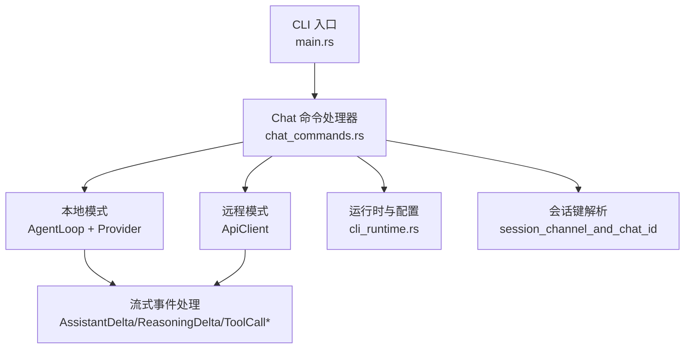
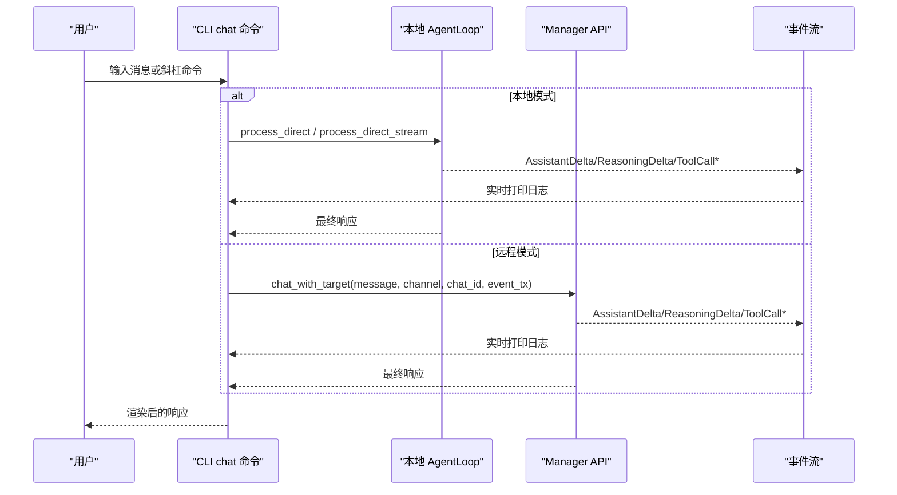
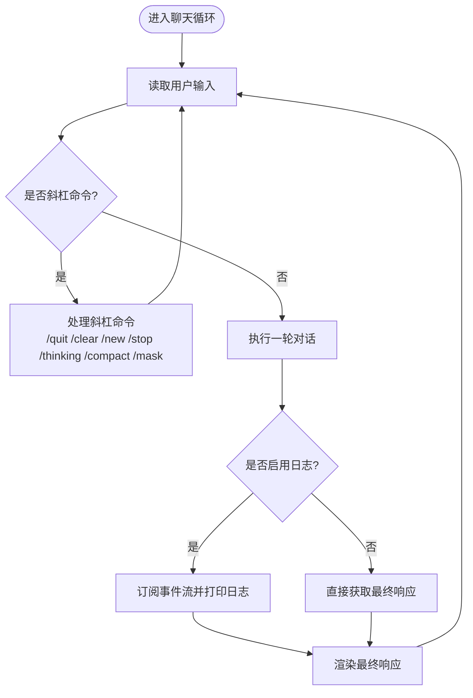
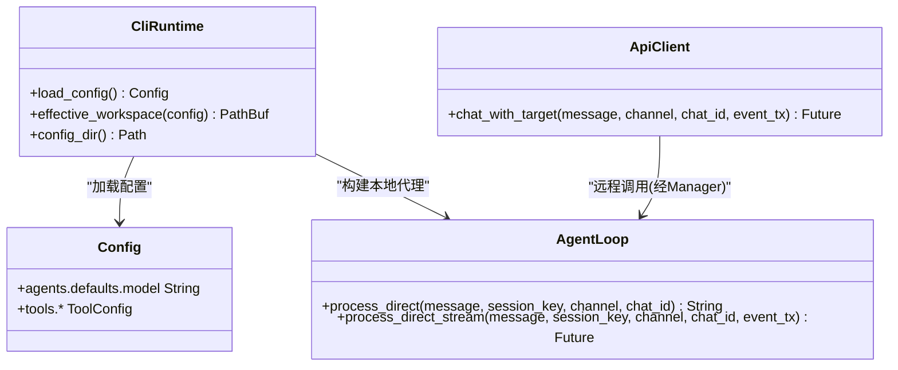
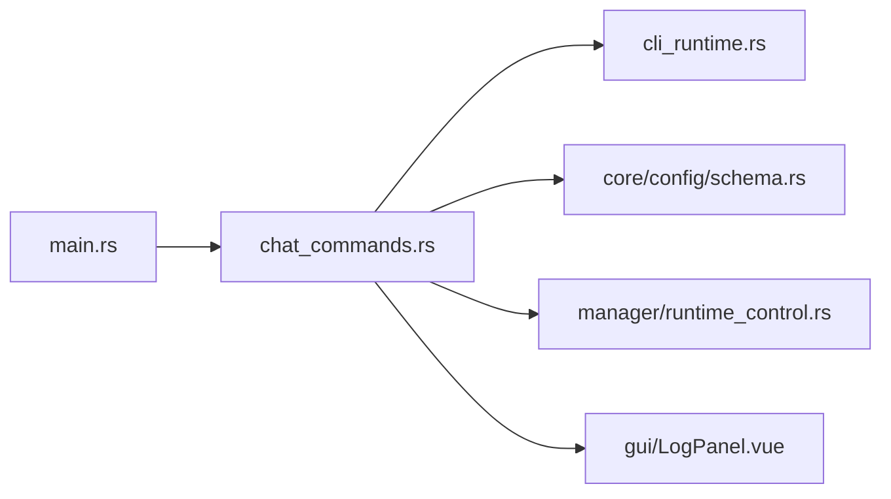

# Chat 命令

<cite>
**本文引用的文件**
- [agent-diva-cli/src/main.rs](file://agent-diva-cli/src/main.rs)
- [agent-diva-cli/src/chat_commands.rs](file://agent-diva-cli/src/chat_commands.rs)
- [agent-diva-cli/src/cli_runtime.rs](file://agent-diva-cli/src/cli_runtime.rs)
- [agent-diva-cli/tests/direct_chat_smoke.rs](file://agent-diva-cli/tests/direct_chat_smoke.rs)
- [agent-diva-core/src/config/schema.rs](file://agent-diva-core/src/config/schema.rs)
- [agent-diva-manager/src/manager/runtime_control.rs](file://agent-diva-manager/src/manager/runtime_control.rs)
- [agent-diva-gui/src/components/console/LogPanel.vue](file://agent-diva-gui/src/components/console/LogPanel.vue)
- [agent-diva-channels/src/manager.rs](file://agent-diva-channels/src/manager.rs)
</cite>

## 目录
1. [简介](#简介)
2. [项目结构](#项目结构)
3. [核心组件](#核心组件)
4. [架构总览](#架构总览)
5. [详细组件分析](#详细组件分析)
6. [依赖关系分析](#依赖关系分析)
7. [性能注意事项](#性能注意事项)
8. [故障排查指南](#故障排查指南)
9. [结论](#结论)
10. [附录](#附录)

## 简介
本文件面向使用 agent-diva CLI 的开发者与用户，系统化说明 chat 命令的语法、参数选项、交互模式特性、与 agent 命令的区别、本地/远程模式的配置方法，以及常见问题与调试技巧。chat 命令提供轻量级交互式聊天循环，支持会话连续性、Markdown 输出渲染、流式日志显示、面具切换、思考模式控制与会话压缩等能力。

## 项目结构
与 chat 命令直接相关的代码主要位于 CLI 层：
- 命令行定义与路由：CLI 入口将 chat 子命令解析为对应处理函数。
- 聊天实现：包含本地 AgentLoop 调用、远程 API 调用、事件流处理、交互循环与斜杠命令。
- 运行时与配置：负责加载配置、工作区、Provider、工具链等。
- 测试用例：覆盖 chat --help 与 agent 日志流等关键行为。

图表来源
- [agent-diva-cli/src/main.rs:128-148](file://agent-diva-cli/src/main.rs#L128-L148)
- [agent-diva-cli/src/chat_commands.rs:665-778](file://agent-diva-cli/src/chat_commands.rs#L665-L778)
- [agent-diva-cli/src/cli_runtime.rs:117-155](file://agent-diva-cli/src/cli_runtime.rs#L117-L155)

章节来源
- [agent-diva-cli/src/main.rs:128-148](file://agent-diva-cli/src/main.rs#L128-L148)
- [agent-diva-cli/src/chat_commands.rs:665-778](file://agent-diva-cli/src/chat_commands.rs#L665-L778)
- [agent-diva-cli/src/cli_runtime.rs:117-155](file://agent-diva-cli/src/cli_runtime.rs#L117-L155)

## 核心组件
- 命令定义与参数
  - chat 子命令暴露以下参数：--model、--session、--markdown/--no-markdown、--logs/--no-logs。
  - 这些参数在 CLI 主入口中声明，并在 chat 处理函数中使用。
- 本地聊天模式
  - 构建本地 AgentLoop，加载配置、Provider、工具链与工作区。
  - 支持交互式输入循环、斜杠命令（/quit、/clear、/new、/stop、/thinking、/compact、/mask）。
  - 支持流式事件打印与最终响应渲染。
- 远程聊天模式
  - 通过 ApiClient 向 Manager 发起 chat_with_target 请求，接收流式事件并渲染。
- 会话连续性
  - 通过 session 参数指定会话键；默认值由命令决定；/new 可创建新会话。
- Markdown 输出
  - 当启用 markdown 时，最终响应以“对 Markdown 友好的文本”形式渲染；否则按普通文本输出。
- 流式日志
  - 启用 logs 时，实时打印助手增量、推理增量、工具调用开始/结束等事件。

章节来源
- [agent-diva-cli/src/main.rs:128-148](file://agent-diva-cli/src/main.rs#L128-L148)
- [agent-diva-cli/src/chat_commands.rs:665-778](file://agent-diva-cli/src/chat_commands.rs#L665-L778)
- [agent-diva-cli/src/chat_commands.rs:285-364](file://agent-diva-cli/src/chat_commands.rs#L285-L364)
- [agent-diva-cli/src/chat_commands.rs:466-550](file://agent-diva-cli/src/chat_commands.rs#L466-L550)
- [agent-diva-cli/tests/direct_chat_smoke.rs:165-178](file://agent-diva-cli/tests/direct_chat_smoke.rs#L165-L178)

## 架构总览
chat 命令在本地模式下直接驱动 AgentLoop，在远程模式下通过 HTTP 与 Manager 通信。两者均基于统一的事件模型进行流式输出与最终结果聚合。

图表来源
- [agent-diva-cli/src/chat_commands.rs:285-364](file://agent-diva-cli/src/chat_commands.rs#L285-L364)
- [agent-diva-cli/src/chat_commands.rs:466-550](file://agent-diva-cli/src/chat_commands.rs#L466-L550)

## 详细组件分析

### 命令语法与参数
- 基本用法
  - 启动轻量交互式聊天：agent-diva chat
  - 指定模型：agent-diva chat --model <id>
  - 指定会话：agent-diva chat --session <key>
  - 开启 Markdown 输出：agent-diva chat --markdown
  - 关闭 Markdown 输出：agent-diva chat --no-markdown
  - 开启流式日志：agent-diva chat --logs
  - 关闭流式日志：agent-diva chat --no-logs
- 交互斜杠命令
  - /quit：退出聊天循环
  - /clear：清屏
  - /new：创建新会话（自动命名）
  - /stop：停止当前会话中的运行任务
  - /thinking auto|on|off：设置思考模式
  - /compact：尝试压缩当前会话上下文（仅本地模式可用）
  - /mask list|wear <name>|off|status|reload：管理面具
- 示例
  - 本地快速对话：agent-diva chat
  - 指定模型与会话：agent-diva chat --model gpt-4o --session cli:chat:20260101120000
  - 开启日志观察：agent-diva chat --logs
  - 远程会话：agent-diva chat --session cli:chat:remote（需配合远程配置）

章节来源
- [agent-diva-cli/src/main.rs:128-148](file://agent-diva-cli/src/main.rs#L128-L148)
- [agent-diva-cli/src/chat_commands.rs:665-778](file://agent-diva-cli/src/chat_commands.rs#L665-L778)
- [agent-diva-cli/tests/direct_chat_smoke.rs:165-178](file://agent-diva-cli/tests/direct_chat_smoke.rs#L165-L178)

### 轻量级交互式聊天模式特性
- 会话连续性
  - 通过 --session 指定会话键；未指定时使用默认会话键；/new 会生成新的会话键。
  - 本地与远程模式均基于 channel/chat_id 映射到具体会话。
- Markdown 格式输出
  - 启用 --markdown 时，最终响应以 Markdown 友好文本渲染；禁用则按纯文本输出。
- 流式日志显示
  - 启用 --logs 时，实时打印助手增量、推理增量、工具调用开始/结束等事件，便于调试与观察执行过程。
- 交互控制
  - 支持 /stop 停止当前会话任务；/thinking 调整思考模式；/compact 压缩上下文；/mask 切换面具。

图表来源
- [agent-diva-cli/src/chat_commands.rs:665-778](file://agent-diva-cli/src/chat_commands.rs#L665-L778)
- [agent-diva-cli/src/chat_commands.rs:285-364](file://agent-diva-cli/src/chat_commands.rs#L285-L364)

章节来源
- [agent-diva-cli/src/chat_commands.rs:665-778](file://agent-diva-cli/src/chat_commands.rs#L665-L778)
- [agent-diva-cli/src/chat_commands.rs:285-364](file://agent-diva-cli/src/chat_commands.rs#L285-L364)

### 与 Agent 命令的区别与适用场景
- 区别
  - chat：轻量交互式聊天循环，适合快速对话、调试与临时任务；支持斜杠命令与流式日志。
  - agent：一次性非交互执行，适合脚本化任务与批处理；支持队列与审批模式。
- 适用场景
  - 选择 chat：需要连续对话、观察流式输出、动态调整思考模式或压缩上下文。
  - 选择 agent：需要在无交互环境下执行单次任务，或将结果集成到自动化流程。

章节来源
- [agent-diva-cli/src/main.rs:128-148](file://agent-diva-cli/src/main.rs#L128-L148)
- [agent-diva-cli/src/chat_commands.rs:375-448](file://agent-diva-cli/src/chat_commands.rs#L375-L448)

### 本地模式与远程模式配置
- 本地模式
  - 通过 CliRuntime 加载配置与工作区，构建 Provider、工具链与 AgentLoop。
  - 支持面具注册表、网络工具、计划配置、定时任务、预算等。
- 远程模式
  - 通过 ApiClient 连接 Manager，发送 chat_with_target 请求并消费事件流。
  - 会话键通过 session_channel_and_chat_id 解析为 channel 与 chat_id。
- 通道与渠道
  - Manager 支持多种通道（如 Matrix、Neuro-link 等），可通过配置启用与管理。
  - 通道配置项包括启用开关、凭据与策略等。

图表来源
- [agent-diva-cli/src/cli_runtime.rs:117-155](file://agent-diva-cli/src/cli_runtime.rs#L117-L155)
- [agent-diva-cli/src/chat_commands.rs:79-144](file://agent-diva-cli/src/chat_commands.rs#L79-L144)
- [agent-diva-cli/src/chat_commands.rs:466-550](file://agent-diva-cli/src/chat_commands.rs#L466-L550)
- [agent-diva-core/src/config/schema.rs:932-982](file://agent-diva-core/src/config/schema.rs#L932-L982)
- [agent-diva-channels/src/manager.rs:122-140](file://agent-diva-channels/src/manager.rs#L122-L140)

章节来源
- [agent-diva-cli/src/cli_runtime.rs:117-155](file://agent-diva-cli/src/cli_runtime.rs#L117-L155)
- [agent-diva-cli/src/chat_commands.rs:79-144](file://agent-diva-cli/src/chat_commands.rs#L79-L144)
- [agent-diva-cli/src/chat_commands.rs:466-550](file://agent-diva-cli/src/chat_commands.rs#L466-L550)
- [agent-diva-core/src/config/schema.rs:932-982](file://agent-diva-core/src/config/schema.rs#L932-L982)
- [agent-diva-channels/src/manager.rs:122-140](file://agent-diva-channels/src/manager.rs#L122-L140)

## 依赖关系分析
- CLI 层依赖
  - main.rs 定义 Chat 子命令及其参数。
  - chat_commands.rs 实现本地/远程聊天逻辑、事件流处理与交互循环。
  - cli_runtime.rs 提供配置加载、工作区解析与 Provider 构建。
- 核心与管理器
  - core 提供配置结构与类型。
  - manager 提供通道管理与运行时控制。
- GUI 日志面板
  - LogPanel.vue 用于过滤与展示日志级别，辅助调试。

图表来源
- [agent-diva-cli/src/main.rs:128-148](file://agent-diva-cli/src/main.rs#L128-L148)
- [agent-diva-cli/src/chat_commands.rs:665-778](file://agent-diva-cli/src/chat_commands.rs#L665-L778)
- [agent-diva-cli/src/cli_runtime.rs:117-155](file://agent-diva-cli/src/cli_runtime.rs#L117-L155)
- [agent-diva-core/src/config/schema.rs:932-982](file://agent-diva-core/src/config/schema.rs#L932-L982)
- [agent-diva-manager/src/manager/runtime_control.rs:814-850](file://agent-diva-manager/src/manager/runtime_control.rs#L814-L850)
- [agent-diva-gui/src/components/console/LogPanel.vue:42-85](file://agent-diva-gui/src/components/console/LogPanel.vue#L42-L85)

章节来源
- [agent-diva-cli/src/main.rs:128-148](file://agent-diva-cli/src/main.rs#L128-L148)
- [agent-diva-cli/src/chat_commands.rs:665-778](file://agent-diva-cli/src/chat_commands.rs#L665-L778)
- [agent-diva-cli/src/cli_runtime.rs:117-155](file://agent-diva-cli/src/cli_runtime.rs#L117-L155)
- [agent-diva-core/src/config/schema.rs:932-982](file://agent-diva-core/src/config/schema.rs#L932-L982)
- [agent-diva-manager/src/manager/runtime_control.rs:814-850](file://agent-diva-manager/src/manager/runtime_control.rs#L814-L850)
- [agent-diva-gui/src/components/console/LogPanel.vue:42-85](file://agent-diva-gui/src/components/console/LogPanel.vue#L42-L85)

## 性能注意事项
- 流式输出
  - 启用 --logs 会增加 I/O 开销；仅在调试或需要观察执行细节时开启。
- 上下文压缩
  - 长会话建议使用 /compact 减少上下文大小，降低后续请求成本。
- 工具调用
  - 工具调用可能耗时较长；合理设置超时与预算，避免阻塞交互。
- 远程模式
  - 网络延迟会影响流式体验；确保 Manager 服务稳定与网络通畅。

[本节为通用指导，不直接分析具体文件]

## 故障排查指南
- 常见问题
  - 会话未生效：检查 --session 是否正确传递；确认本地/远程模式下的 channel/chat_id 解析一致。
  - Markdown 输出异常：确认 --markdown/--no-markdown 参数；查看最终响应渲染逻辑。
  - 流式日志缺失：确认 --logs 已启用；检查事件流是否被消费。
  - 远程连接失败：检查 Manager 地址与服务状态；查看错误消息。
- 调试技巧
  - 使用 --logs 观察 AssistantDelta、ReasoningDelta、ToolCallStarted/Finished 等事件。
  - 使用 /stop 停止长时间运行的任务；使用 /compact 压缩上下文。
  - 使用 GUI 日志面板过滤日志级别，聚焦错误与警告。
  - 检查配置与通道设置，确保 Provider 与渠道就绪。

章节来源
- [agent-diva-cli/src/chat_commands.rs:285-364](file://agent-diva-cli/src/chat_commands.rs#L285-L364)
- [agent-diva-cli/src/chat_commands.rs:466-550](file://agent-diva-cli/src/chat_commands.rs#L466-L550)
- [agent-diva-gui/src/components/console/LogPanel.vue:42-85](file://agent-diva-gui/src/components/console/LogPanel.vue#L42-L85)
- [agent-diva-core/src/config/schema.rs:932-982](file://agent-diva-core/src/config/schema.rs#L932-L982)
- [agent-diva-manager/src/manager/runtime_control.rs:814-850](file://agent-diva-manager/src/manager/runtime_control.rs#L814-L850)

## 结论
chat 命令提供了轻量、灵活且功能丰富的交互式聊天能力，适用于快速对话、调试与临时任务。通过会话连续性、Markdown 输出、流式日志与斜杠命令，用户可以高效地与 Agent 协作。结合本地与远程模式，chat 命令能够适配不同部署环境与使用场景。建议根据需求选择合适的参数与模式，并结合日志与压缩功能优化体验与性能。

[本节为总结性内容，不直接分析具体文件]

## 附录
- 参考命令帮助
  - 运行 agent-diva chat --help 可查看支持的参数与选项。
- 相关测试
  - direct_chat_smoke 测试验证了 chat --help 列出 --model、--session、--markdown、--no-markdown、--logs 等参数。

章节来源
- [agent-diva-cli/tests/direct_chat_smoke.rs:165-178](file://agent-diva-cli/tests/direct_chat_smoke.rs#L165-L178)