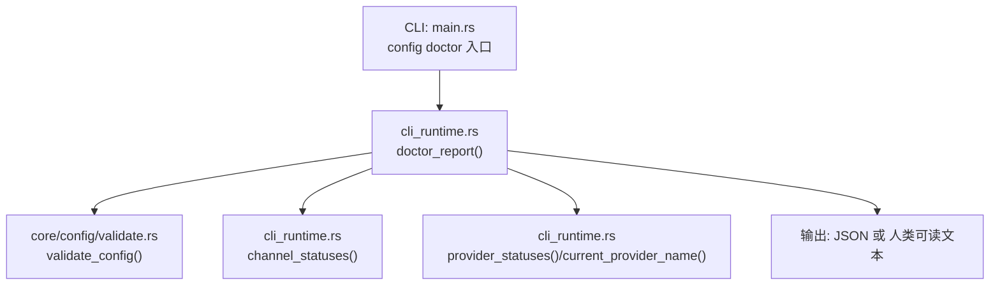
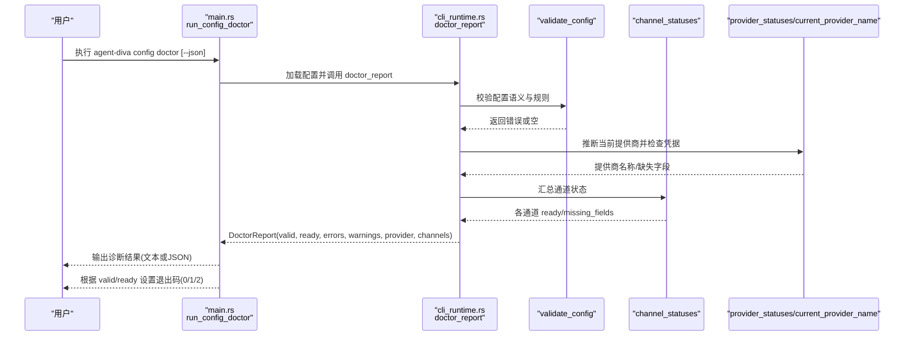
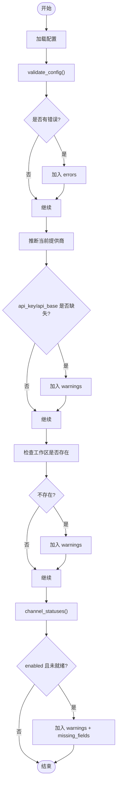
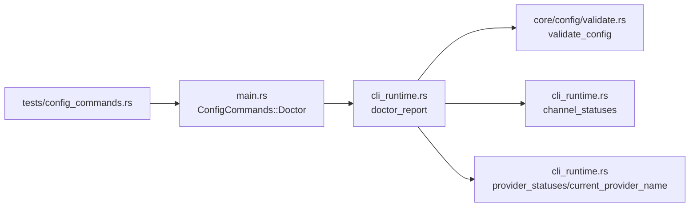

# Config Doctor 命令

<cite>
**本文引用的文件**
- [agent-diva-cli/src/main.rs](file://agent-diva-cli/src/main.rs)
- [agent-diva-cli/src/cli_runtime.rs](file://agent-diva-cli/src/cli_runtime.rs)
- [agent-diva-core/src/config/validate.rs](file://agent-diva-core/src/config/validate.rs)
- [agent-diva-cli/tests/config_commands.rs](file://agent-diva-cli/tests/config_commands.rs)
</cite>

## 目录
1. [简介](#简介)
2. [项目结构](#项目结构)
3. [核心组件](#核心组件)
4. [架构总览](#架构总览)
5. [详细组件分析](#详细组件分析)
6. [依赖关系分析](#依赖关系分析)
7. [性能与可用性考虑](#性能与可用性考虑)
8. [故障排查指南](#故障排查指南)
9. [结论](#结论)
10. [附录：自动化与健康检查集成](#附录自动化与健康检查集成)

## 简介
Config Doctor 是 agent-diva CLI 的 config 子命令之一，用于对当前配置进行“健康诊断”。它不仅仅校验配置的语法和语义规则，还会结合运行时环境（工作区、通道、提供商等）进行就绪性检查，并输出结构化报告或人类可读的诊断结果。该命令常用于：
- 部署前验证配置是否完整可用
- 定期巡检系统健康状态
- 在 CI/CD 流水线中作为门禁步骤
- 与监控告警系统集成，实现自动化的健康检查与告警

## 项目结构
Config Doctor 的实现横跨 CLI 层、运行时工具层与核心配置校验层：
- CLI 入口与命令路由：负责解析参数、调用诊断逻辑、格式化输出与退出码控制
- 运行时诊断聚合：加载配置、执行校验、汇总提供商与通道状态、生成诊断报告
- 核心配置校验：定义配置项的合法范围与约束规则

图表来源
- [agent-diva-cli/src/main.rs:1773-1807](file://agent-diva-cli/src/main.rs#L1773-L1807)
- [agent-diva-cli/src/cli_runtime.rs:727-791](file://agent-diva-cli/src/cli_runtime.rs#L727-L791)
- [agent-diva-core/src/config/validate.rs:6-100](file://agent-diva-core/src/config/validate.rs#L6-L100)

章节来源
- [agent-diva-cli/src/main.rs:420-439](file://agent-diva-cli/src/main.rs#L420-L439)
- [agent-diva-cli/src/cli_runtime.rs:14-106](file://agent-diva-cli/src/cli_runtime.rs#L14-L106)
- [agent-diva-core/src/config/validate.rs:1-100](file://agent-diva-core/src/config/validate.rs#L1-L100)

## 核心组件
- 命令定义与路由
  - ConfigCommands::Doctor 对应 config doctor 子命令，支持 --json 结构化输出
  - 路由到 run_config_doctor 函数，负责加载配置、生成诊断报告、打印结果与设置退出码
- 诊断报告结构
  - DoctorReport 包含 valid、ready、errors、warnings、provider、channels 等字段
  - ChannelStatus 描述各通道启用状态、就绪性与缺失字段
  - ProviderStatus 描述提供商配置、默认模型、是否当前使用等
- 配置校验
  - validate_config 对 agents.defaults、tools.mcp_servers、tools.web.search、mate.* 等关键配置进行合法性检查
- 通道与提供商状态
  - channel_statuses 枚举支持的通道（telegram、discord、whatsapp、feishu、dingtalk、email、slack、qq、matrix），判断 enabled 与 required fields
  - provider_statuses/current_provider_name 推断当前使用的提供商与模型，并识别缺失凭据

章节来源
- [agent-diva-cli/src/main.rs:420-439](file://agent-diva-cli/src/main.rs#L420-L439)
- [agent-diva-cli/src/main.rs:1773-1807](file://agent-diva-cli/src/main.rs#L1773-L1807)
- [agent-diva-cli/src/cli_runtime.rs:57-65](file://agent-diva-cli/src/cli_runtime.rs#L57-L65)
- [agent-diva-cli/src/cli_runtime.rs:517-554](file://agent-diva-cli/src/cli_runtime.rs#L517-L554)
- [agent-diva-cli/src/cli_runtime.rs:561-725](file://agent-diva-cli/src/cli_runtime.rs#L561-L725)
- [agent-diva-core/src/config/validate.rs:6-100](file://agent-diva-core/src/config/validate.rs#L6-L100)

## 架构总览
Config Doctor 的执行流程如下：
- 解析 CLI 参数，确定是否以 JSON 输出
- 加载当前有效配置
- 调用 doctor_report 聚合诊断信息：
  - 运行 validate_config 收集配置错误
  - 推断当前提供商并检查 api_key/api_base 是否缺失
  - 检查工作区是否存在
  - 汇总各通道状态并提示缺失字段
- 输出诊断结果并设置退出码：
  - 非有效：退出码 1
  - 有效但未就绪：退出码 2
  - 完全就绪：退出码 0

图表来源
- [agent-diva-cli/src/main.rs:1773-1807](file://agent-diva-cli/src/main.rs#L1773-L1807)
- [agent-diva-cli/src/cli_runtime.rs:727-791](file://agent-diva-cli/src/cli_runtime.rs#L727-L791)
- [agent-diva-core/src/config/validate.rs:6-100](file://agent-diva-core/src/config/validate.rs#L6-L100)

## 详细组件分析

### 命令入口与输出控制
- 命令定义：ConfigCommands::Doctor(StatusArgs)，支持 --json
- 处理函数：run_config_doctor
  - 加载配置
  - 调用 doctor_report 获取诊断报告
  - JSON 模式直接输出；文本模式打印标题、valid/ready/provider/errors/warnings
  - 退出码策略：
    - valid=false → 1
    - valid=true 但 ready=false → 2
    - 否则 → 0

章节来源
- [agent-diva-cli/src/main.rs:420-439](file://agent-diva-cli/src/main.rs#L420-L439)
- [agent-diva-cli/src/main.rs:1773-1807](file://agent-diva-cli/src/main.rs#L1773-L1807)

### 诊断报告生成（doctor_report）
- 配置校验：调用 validate_config，将错误加入 errors
- 提供商检查：
  - 通过 current_provider_name 推断当前提供商
  - 若未找到提供商，记录错误
  - 若提供商 api_key 为空（vllm 除外），记录警告
  - 若提供商为 custom 且 api_base 为空，记录警告
- 工作区检查：若工作区不存在，记录警告
- 通道检查：遍历 channel_statuses，对 enabled 但未就绪的通道记录警告，列出缺失字段
- 最终报告：
  - valid = errors 是否为空
  - ready = errors 为空且 warnings 为空
  - provider = 当前提供商名称
  - channels = 各通道状态列表

章节来源
- [agent-diva-cli/src/cli_runtime.rs:727-791](file://agent-diva-cli/src/cli_runtime.rs#L727-L791)

### 配置校验规则（validate_config）
- agents.defaults.workspace 不能为空
- agents.defaults.max_tokens > 0
- agents.defaults.temperature ∈ [0.0, 2.0]
- agents.defaults.max_tool_iterations > 0
- agents.defaults.reasoning_effort ∈ {low, medium, high}
- tools.mcp_servers 每个条目必须提供 command 或 url
- tools.web.search.provider ∈ {brave, bocha, zhipu}
- tools.web.search.max_results 根据 provider 限制上限（bocha/zhipu 允许更高）
- mate.asr_provider ∈ {web_speech, siliconflow}
- mate.tts_provider ∈ {browser, openai, siliconflow, minimax}
- mate.tts_speed > 0
- mate.tts_volume ∈ [0.0, 2.0]
- reports.llm_curation.validate() 失败时追加错误

章节来源
- [agent-diva-core/src/config/validate.rs:6-100](file://agent-diva-core/src/config/validate.rs#L6-L100)

### 通道状态（channel_statuses）
- 支持的通道：telegram、discord、whatsapp、feishu、dingtalk、email、slack、qq、matrix
- 每个通道的 ready 判定基于 enabled 与必需字段是否齐全
- 缺失字段会明确列出，便于快速修复
- whatsapp 需要 bridge 登录（notes 提示）

章节来源
- [agent-diva-cli/src/cli_runtime.rs:561-725](file://agent-diva-cli/src/cli_runtime.rs#L561-L725)

### 提供商状态与当前提供商推断
- current_provider_name：优先使用 agents.defaults.provider，其次从 model 推断，再尝试 catalog 匹配
- provider_statuses：列出所有受管提供商，标记 configured/ready/current/default_model/model/api_base/missing_fields
- 诊断时重点检查当前提供商的 api_key 与 custom 的 api_base

章节来源
- [agent-diva-cli/src/cli_runtime.rs:282-343](file://agent-diva-cli/src/cli_runtime.rs#L282-L343)
- [agent-diva-cli/src/cli_runtime.rs:517-554](file://agent-diva-cli/src/cli_runtime.rs#L517-L554)

### 数据流与流程图

图表来源
- [agent-diva-cli/src/cli_runtime.rs:727-791](file://agent-diva-cli/src/cli_runtime.rs#L727-L791)
- [agent-diva-core/src/config/validate.rs:6-100](file://agent-diva-core/src/config/validate.rs#L6-L100)

## 依赖关系分析
- CLI 层依赖
  - main.rs 中的 ConfigCommands 与 run_config_doctor
  - cli_runtime.rs 中的 doctor_report、channel_statuses、provider_statuses、current_provider_name
- 核心层依赖
  - core/config/validate.rs 的 validate_config
- 测试覆盖
  - config_commands.rs 验证了 config doctor 的 JSON 输出与退出码行为（例如缺少 provider key 时返回 exit code 2）

图表来源
- [agent-diva-cli/src/main.rs:420-439](file://agent-diva-cli/src/main.rs#L420-L439)
- [agent-diva-cli/src/main.rs:1773-1807](file://agent-diva-cli/src/main.rs#L1773-L1807)
- [agent-diva-cli/src/cli_runtime.rs:727-791](file://agent-diva-cli/src/cli_runtime.rs#L727-L791)
- [agent-diva-core/src/config/validate.rs:6-100](file://agent-diva-core/src/config/validate.rs#L6-L100)
- [agent-diva-cli/tests/config_commands.rs:89-109](file://agent-diva-cli/tests/config_commands.rs#L89-L109)

章节来源
- [agent-diva-cli/tests/config_commands.rs:89-109](file://agent-diva-cli/tests/config_commands.rs#L89-L109)

## 性能与可用性考虑
- 诊断过程主要为内存与文件系统访问操作，开销较低
- 通道状态与提供商状态均为本地配置读取与简单条件判断，无网络请求
- 建议在批量环境中并行执行多个实例的健康检查，避免串行阻塞
- 建议在生产环境启用结构化 JSON 输出，便于日志采集与指标化

[本节为通用指导，不直接分析具体文件]

## 故障排查指南
常见诊断问题与修复建议：
- 配置无效（valid=false）
  - 查看 errors 列表，逐项修正：
    - workspace 为空、max_tokens=0、temperature 越界、max_tool_iterations=0
    - reasoning_effort 不在允许集合
    - mcp_servers 未设置 command 或 url
    - web search provider 不支持或 max_results 超限
    - mate 相关字段非法
  - 参考 validate_config 的规则清单进行修正
- 提供商缺失凭据（warnings）
  - 当前提供商 api_key 为空（vllm 除外）
  - custom 提供商缺少 api_base
  - 使用 provider set 或编辑配置文件补充凭据
- 工作区不存在（warnings）
  - 创建工作区路径或使用 config init/refresh 初始化模板
- 通道未就绪（warnings）
  - 检查 enabled 的通道是否补齐必需字段（token、app_id、client_secret、imap/smtp 配置等）
  - 按 missing_fields 提示逐一补齐
- 退出码说明
  - 1：配置无效
  - 2：配置有效但未就绪（存在 warnings）
  - 0：完全就绪

章节来源
- [agent-diva-core/src/config/validate.rs:6-100](file://agent-diva-core/src/config/validate.rs#L6-L100)
- [agent-diva-cli/src/cli_runtime.rs:727-791](file://agent-diva-cli/src/cli_runtime.rs#L727-L791)
- [agent-diva-cli/src/main.rs:1773-1807](file://agent-diva-cli/src/main.rs#L1773-L1807)
- [agent-diva-cli/tests/config_commands.rs:89-109](file://agent-diva-cli/tests/config_commands.rs#L89-L109)

## 结论
Config Doctor 提供了端到端的配置健康诊断能力，既涵盖静态规则的校验，也包含运行时就绪性的检查。通过结构化输出与明确的退出码，它可以无缝集成到自动化流程与监控体系中，帮助团队在部署前与运行期及时发现并修复配置问题，保障系统的稳定运行。

[本节为总结性内容，不直接分析具体文件]

## 附录：自动化与健康检查集成
- 自动化诊断脚本
  - 在 CI/CD 中执行 agent-diva config doctor --json，解析 valid/ready 与 errors/warnings
  - 当 valid=false 或 ready=false 时触发构建失败或告警
- 定期健康检查
  - 使用系统任务调度器（如 cron/systemd timer）定时执行诊断命令
  - 将 JSON 输出写入日志或指标存储，建立趋势与阈值告警
- 监控告警集成
  - 将 exit code 映射为服务健康状态：0 健康、1 严重错误、2 警告
  - 结合 Prometheus/Grafana 或企业监控平台，对 valid/ready 与关键字段缺失进行可视化与告警
- 最佳实践
  - 始终在流水线中使用 --json 输出，便于机器解析
  - 将诊断结果纳入变更审计，保留历史快照以便回溯
  - 对频繁出现的 warnings 制定标准化修复流程（如凭据注入、模板初始化）

[本节为通用指导，不直接分析具体文件]