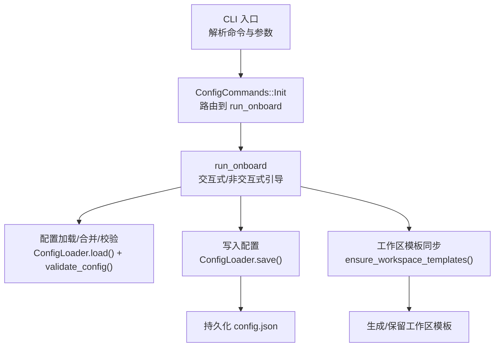
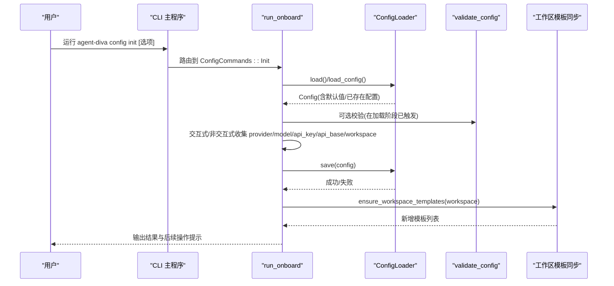
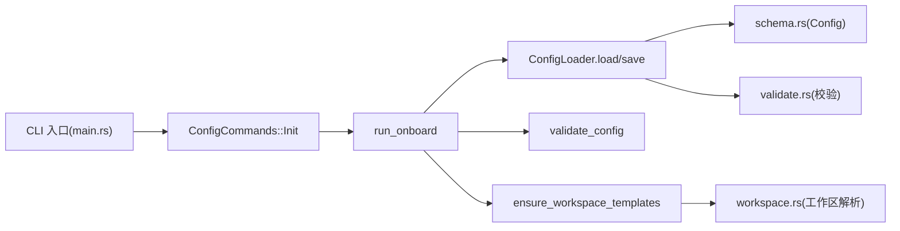

# Config Init 命令

<cite>
**本文引用的文件**
- [agent-diva-cli/src/main.rs](file://agent-diva-cli/src/main.rs)
- [agent-diva-core/src/config/loader.rs](file://agent-diva-core/src/config/loader.rs)
- [agent-diva-core/src/config/schema.rs](file://agent-diva-core/src/config/schema.rs)
- [agent-diva-core/src/config/validate.rs](file://agent-diva-core/src/config/validate.rs)
- [agent-diva-cli/src/cli_runtime.rs](file://agent-diva-cli/src/cli_runtime.rs)
- [agent-diva-core/src/workspace.rs](file://agent-diva-core/src/workspace.rs)
- [agent-diva-cli/tests/config_commands.rs](file://agent-diva-cli/tests/config_commands.rs)
</cite>

## 目录
1. [简介](#简介)
2. [项目结构](#项目结构)
3. [核心组件](#核心组件)
4. [架构总览](#架构总览)
5. [详细组件分析](#详细组件分析)
6. [依赖关系分析](#依赖关系分析)
7. [性能考虑](#性能考虑)
8. [故障排查指南](#故障排查指南)
9. [结论](#结论)
10. [附录](#附录)

## 简介
本文件面向 agent-diva 的 CLI 子命令 config init，系统性说明其功能、工作流程、生成的配置文件结构与默认值、交互式配置向导行为、工作区初始化与模板同步、配置验证与错误处理，以及高级用法（如非交互参数、刷新模式、环境变量与路径覆盖）。该命令用于“初始化或更新”用户配置，并保证工作区具备必要的模板文件。

## 项目结构
config init 属于 CLI 层的配置管理命令，核心流程由 CLI 入口解析命令与参数，调用 onboard 向导逻辑，最终通过配置加载器保存配置，并在工作区同步模板。

图示来源
- [agent-diva-cli/src/main.rs:420-439](file://agent-diva-cli/src/main.rs#L420-L439)
- [agent-diva-cli/src/main.rs:775-983](file://agent-diva-cli/src/main.rs#L775-L983)
- [agent-diva-core/src/config/loader.rs:57-82](file://agent-diva-core/src/config/loader.rs#L57-L82)
- [agent-diva-core/src/config/validate.rs:1-120](file://agent-diva-core/src/config/validate.rs#L1-L120)

章节来源
- [agent-diva-cli/src/main.rs:420-439](file://agent-diva-cli/src/main.rs#L420-L439)
- [agent-diva-cli/src/main.rs:775-983](file://agent-diva-cli/src/main.rs#L775-L983)
- [agent-diva-core/src/config/loader.rs:57-82](file://agent-diva-core/src/config/loader.rs#L57-L82)

## 核心组件
- CLI 命令定义与路由：config init 作为 ConfigCommands::Init，内部复用 OnboardArgs 参数集，统一走 onboard 向导逻辑。
- 向导逻辑 run_onboard：负责读取/创建配置、交互式选择提供商与模型、收集 API Key/Base URL、设置工作区路径、保存配置并同步工作区模板。
- 配置加载与保存：ConfigLoader 负责从默认位置或显式路径加载/保存 config.json，并在加载时执行别名替换、路径替换与 schema 校验。
- 工作区模板同步：确保工作区内存在 masks 等模板文件，且不会覆盖用户已有文件。
- 配置验证：validate_config 对配置进行结构与语义校验，例如 TTS 速度/音量范围等。

章节来源
- [agent-diva-cli/src/main.rs:390-439](file://agent-diva-cli/src/main.rs#L390-L439)
- [agent-diva-cli/src/main.rs:775-983](file://agent-diva-cli/src/main.rs#L775-L983)
- [agent-diva-core/src/config/loader.rs:57-82](file://agent-diva-core/src/config/loader.rs#L57-L82)
- [agent-diva-core/src/config/validate.rs:1-120](file://agent-diva-core/src/config/validate.rs#L1-L120)

## 架构总览
config init 的执行时序如下：

图示来源
- [agent-diva-cli/src/main.rs:420-439](file://agent-diva-cli/src/main.rs#L420-L439)
- [agent-diva-cli/src/main.rs:775-983](file://agent-diva-cli/src/main.rs#L775-L983)
- [agent-diva-core/src/config/loader.rs:57-82](file://agent-diva-core/src/config/loader.rs#L57-L82)
- [agent-diva-core/src/config/validate.rs:1-120](file://agent-diva-core/src/config/validate.rs#L1-L120)

## 详细组件分析

### 命令定义与参数
- 命令名：config init
- 参数来源：OnboardArgs，支持 provider、model、api_key、api_base、workspace、force、refresh 等选项。
- 行为：当未提供交互输入时，使用命令行参数；否则进入交互式向导。

章节来源
- [agent-diva-cli/src/main.rs:390-439](file://agent-diva-cli/src/main.rs#L390-L439)
- [agent-diva-cli/src/main.rs:775-983](file://agent-diva-cli/src/main.rs#L775-L983)

### 向导流程与交互
- 若已存在配置且未指定 force/refresh/provider/model，会提示三种操作：刷新现有配置、覆盖为新配置、取消。
- 提供商选择：优先使用 available_provider_names 提供的列表，支持 deepseek 默认高亮。
- API Key/Base URL：可留空以保留当前值；refresh 模式下不强制要求输入。
- 模型选择：尝试通过提供商发现可用模型；若无发现则允许手动输入，并提供默认推荐模型。
- 工作区路径：默认使用当前配置的 agents.defaults.workspace，也可通过 --workspace 指定。
- 保存与模板：保存配置后，自动同步工作区模板（如 masks），并输出后续建议命令。

章节来源
- [agent-diva-cli/src/main.rs:775-983](file://agent-diva-cli/src/main.rs#L775-L983)

### 配置加载、合并与校验
- 加载顺序：默认值 -> 配置文件 -> 别名/路径覆盖 -> 反序列化为 Config -> 校验。
- 校验规则：包含 schema 与语义校验（例如 TTS 速度/音量范围等）。
- 热重载：支持后台监听配置文件变更，但 config init 主要关注一次性写入。

章节来源
- [agent-diva-core/src/config/loader.rs:57-82](file://agent-diva-core/src/config/loader.rs#L57-L82)
- [agent-diva-core/src/config/validate.rs:1-120](file://agent-diva-core/src/config/validate.rs#L1-L120)

### 工作区初始化与模板同步
- 工作区来源：优先使用 --workspace；否则使用配置中的 agents.defaults.workspace；若为旧默认值，将给出迁移提示。
- 模板同步：确保 masks 等模板存在，且不覆盖用户已有文件；幂等执行，重复运行不会产生多余变更。
- 模板内容：包含 coder.md、researcher.md 等预设面具模板，便于快速启用不同角色模式。

章节来源
- [agent-diva-core/src/workspace.rs:87-124](file://agent-diva-core/src/workspace.rs#L87-L124)
- [agent-diva-core/src/utils/mod.rs:122-197](file://agent-diva-core/src/utils/mod.rs#L122-L197)

### 配置项说明（节选）
- agents.defaults.provider：选择的 LLM 提供商名称。
- agents.defaults.model：使用的模型名称。
- agents.defaults.workspace：工作区根路径。
- providers.<name>.api_key：提供商密钥（敏感字段，显示时会脱敏）。
- providers.<name>.api_base：提供商基础 URL（可选）。
- gateway.port：网关端口（用于后续启动服务）。
- logging.*：日志相关配置（由 loader 加载并用于初始化日志系统）。
- mate.tts_speed / mate.tts_volume：语音合成速度与音量，需满足数值范围校验。

章节来源
- [agent-diva-core/src/config/schema.rs:1-200](file://agent-diva-core/src/config/schema.rs#L1-L200)
- [agent-diva-core/src/config/validate.rs:1-120](file://agent-diva-core/src/config/validate.rs#L1-L120)

### 环境变量与路径覆盖
- 全局参数：--config 指定配置文件路径，--config-dir 指定配置目录，--workspace 临时覆盖工作区（不修改配置文件）。
- 环境注入：配置加载过程中会应用别名与路径覆盖，具体键映射与生效时机由 loader 内部实现。
- 安全提示：GUI 层对敏感字段进行脱敏展示，CLI 保存时同样遵循安全策略。

章节来源
- [agent-diva-cli/src/main.rs:59-86](file://agent-diva-cli/src/main.rs#L59-L86)
- [agent-diva-core/src/config/loader.rs:57-82](file://agent-diva-core/src/config/loader.rs#L57-L82)

### 错误处理与退出码
- 未知提供商：抛出错误并列出支持的提供商列表。
- 配置校验失败：返回错误信息，可通过 config validate 查看结构化结果。
- 工作区模板同步失败：记录错误并中断后续步骤。
- 退出码：校验失败时返回非零退出码，便于脚本集成。

章节来源
- [agent-diva-cli/src/main.rs:775-983](file://agent-diva-cli/src/main.rs#L775-L983)
- [agent-diva-cli/src/main.rs:1742-1770](file://agent-diva-cli/src/main.rs#L1742-L1770)

## 依赖关系分析
config init 的依赖链如下：

图示来源
- [agent-diva-cli/src/main.rs:420-439](file://agent-diva-cli/src/main.rs#L420-L439)
- [agent-diva-cli/src/main.rs:775-983](file://agent-diva-cli/src/main.rs#L775-L983)
- [agent-diva-core/src/config/loader.rs:57-82](file://agent-diva-core/src/config/loader.rs#L57-L82)
- [agent-diva-core/src/config/schema.rs:1-200](file://agent-diva-core/src/config/schema.rs#L1-L200)
- [agent-diva-core/src/config/validate.rs:1-120](file://agent-diva-core/src/config/validate.rs#L1-L120)
- [agent-diva-core/src/workspace.rs:87-124](file://agent-diva-core/src/workspace.rs#L87-L124)

章节来源
- [agent-diva-cli/src/main.rs:420-439](file://agent-diva-cli/src/main.rs#L420-L439)
- [agent-diva-cli/src/main.rs:775-983](file://agent-diva-cli/src/main.rs#L775-L983)
- [agent-diva-core/src/config/loader.rs:57-82](file://agent-diva-core/src/config/loader.rs#L57-L82)
- [agent-diva-core/src/config/schema.rs:1-200](file://agent-diva-core/src/config/schema.rs#L1-L200)
- [agent-diva-core/src/config/validate.rs:1-120](file://agent-diva-core/src/config/validate.rs#L1-L120)
- [agent-diva-core/src/workspace.rs:87-124](file://agent-diva-core/src/workspace.rs#L87-L124)

## 性能考虑
- 配置加载与保存：仅涉及小体积 JSON 读写，开销极低。
- 模型发现：首次可能发起网络请求获取提供商模型列表，建议在向导中缓存或限制超时以减少等待时间。
- 模板同步：幂等操作，重复执行无额外 I/O；仅在缺失模板时写入。
- 热重载：后台任务轮询配置文件 mtime，不影响 config init 的一次性写入流程。

[本节为通用指导，无需特定文件引用]

## 故障排查指南
- 无法找到提供商：确认 --provider 名称是否在可用列表中；若为空，检查网络与提供商注册表。
- 配置校验失败：使用 config validate 查看错误详情；常见为 TTS 速度/音量超出范围或必填字段缺失。
- 工作区路径无效：检查 --workspace 是否存在；若使用旧默认值，按提示迁移到明确的工作区路径。
- 模板未生成：确认工作区路径正确且可写；再次运行 config refresh 或 config init 以同步模板。
- 权限问题：确保配置目录与工作区目录具有读写权限；避免将配置目录指向用户家目录根路径（安全保护）。

章节来源
- [agent-diva-cli/src/main.rs:775-983](file://agent-diva-cli/src/main.rs#L775-L983)
- [agent-diva-cli/src/main.rs:1742-1770](file://agent-diva-cli/src/main.rs#L1742-L1770)
- [agent-diva-core/src/config/validate.rs:1-120](file://agent-diva-core/src/config/validate.rs#L1-L120)
- [agent-diva-core/src/workspace.rs:87-124](file://agent-diva-core/src/workspace.rs#L87-L124)

## 结论
config init 提供了开箱即用的配置初始化能力，结合交互式向导与非交互参数，帮助用户快速完成提供商、模型、API 凭证与工作区的设置，并自动同步必要的工作区模板。配合 config validate 与 config doctor，可实现配置健康检查与诊断。对于自动化场景，可通过 --provider、--model、--api_key、--api_base、--workspace、--force、--refresh 等参数实现完全非交互的配置初始化与更新。

[本节为总结，无需特定文件引用]

## 附录

### 常用命令速查
- 初始化配置：agent-diva config init
- 刷新配置与模板：agent-diva config refresh
- 校验配置：agent-diva config validate [--json]
- 诊断配置：agent-diva config doctor [--json]
- 查看路径：agent-diva config path [--json]
- 显示有效配置：agent-diva config show [--format json|pretty]

章节来源
- [agent-diva-cli/src/main.rs:420-439](file://agent-diva-cli/src/main.rs#L420-L439)
- [agent-diva-cli/src/main.rs:1705-1780](file://agent-diva-cli/src/main.rs#L1705-L1780)

### 测试与验证参考
- 测试用例展示了如何准备配置目录并执行配置相关命令，可用于本地复现与回归验证。

章节来源
- [agent-diva-cli/tests/config_commands.rs:34-40](file://agent-diva-cli/tests/config_commands.rs#L34-L40)
- [agent-diva-cli/tests/config_commands.rs:192-200](file://agent-diva-cli/tests/config_commands.rs#L192-L200)