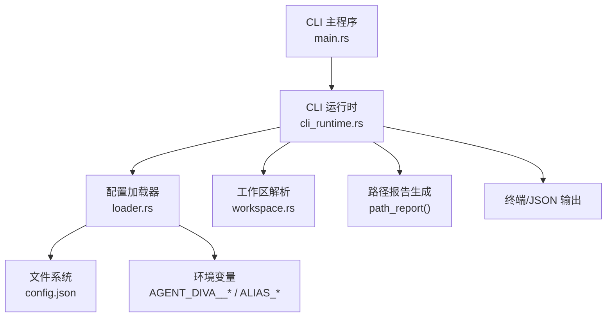
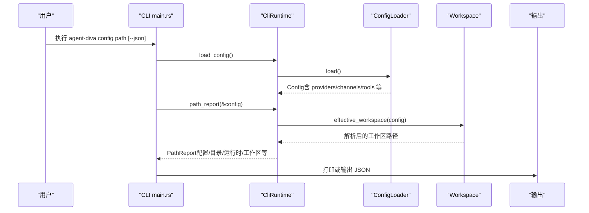
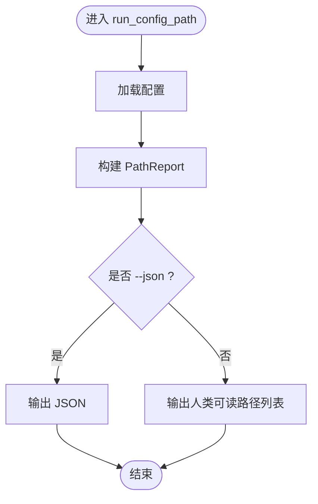
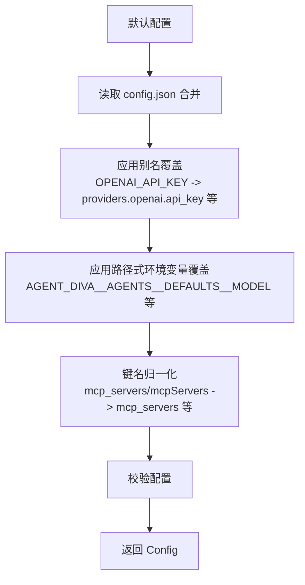
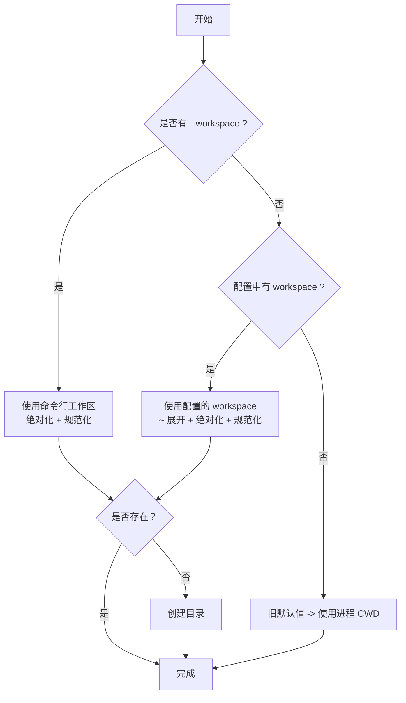
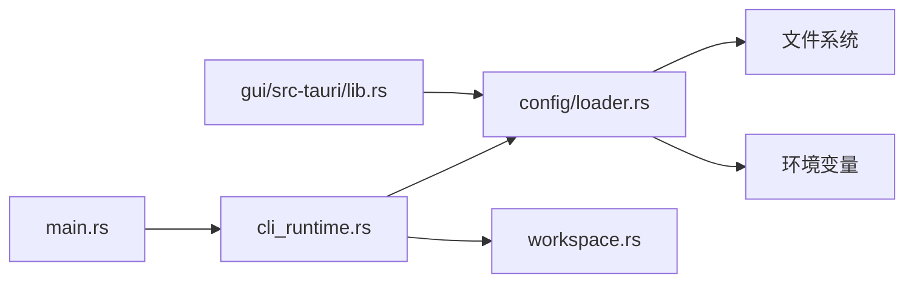

# Config Path 命令

<cite>
**本文引用的文件**
- [agent-diva-cli/src/main.rs](file://agent-diva-cli/src/main.rs)
- [agent-diva-cli/src/cli_runtime.rs](file://agent-diva-cli/src/cli_runtime.rs)
- [agent-diva-core/src/config/loader.rs](file://agent-diva-core/src/config/loader.rs)
- [agent-diva-core/src/workspace.rs](file://agent-diva-core/src/workspace.rs)
- [agent-diva-gui/src-tauri/src/lib.rs](file://agent-diva-gui/src-tauri/src/lib.rs)
- [agent-diva-core/src/security/config.rs](file://agent-diva-core/src/security/config.rs)
</cite>

## 目录
1. [简介](#简介)
2. [项目结构](#项目结构)
3. [核心组件](#核心组件)
4. [架构总览](#架构总览)
5. [详细组件分析](#详细组件分析)
6. [依赖关系分析](#依赖关系分析)
7. [性能考虑](#性能考虑)
8. [故障排查指南](#故障排查指南)
9. [结论](#结论)
10. [附录](#附录)

## 简介
本章节面向“Config Path”子命令，说明其功能、输出项、配置查找顺序与优先级规则、不同操作系统下的默认路径行为，以及配置文件组织结构与环境变量覆盖机制。该命令用于诊断和展示当前 CLI 实例所加载的配置来源、运行时根目录、工作区位置及各类运行时数据目录，便于定位问题与进行环境切换。

## 项目结构
- CLI 层：负责解析命令行参数、调用运行时并输出结果。
- 运行时层：封装配置加载器、路径计算、工作区解析等能力。
- 核心配置层：提供配置文件的默认位置、合并策略、环境变量覆盖、别名归一化等。
- GUI（可选）：通过 Tauri 暴露状态查询接口，复用相同的配置加载逻辑。

图表来源
- [agent-diva-cli/src/main.rs:1705-1723](file://agent-diva-cli/src/main.rs#L1705-L1723)
- [agent-diva-cli/src/cli_runtime.rs:215-226](file://agent-diva-cli/src/cli_runtime.rs#L215-L226)
- [agent-diva-core/src/config/loader.rs:57-74](file://agent-diva-core/src/config/loader.rs#L57-L74)
- [agent-diva-core/src/workspace.rs:87-114](file://agent-diva-core/src/workspace.rs#L87-L114)

章节来源
- [agent-diva-cli/src/main.rs:1705-1723](file://agent-diva-cli/src/main.rs#L1705-L1723)
- [agent-diva-cli/src/cli_runtime.rs:215-226](file://agent-diva-cli/src/cli_runtime.rs#L215-L226)
- [agent-diva-core/src/config/loader.rs:57-74](file://agent-diva-core/src/config/loader.rs#L57-L74)

## 核心组件
- 配置加载器（ConfigLoader）
  - 默认配置目录：用户家目录下的 .agent-diva（若无法获取家目录则回退到当前目录）。
  - 配置文件：config.json。
  - 支持三种构造方式：默认、指定目录、指定具体配置文件路径。
  - 加载流程：默认值 → 文件合并 → 别名覆盖 → 路径式环境变量覆盖 → 键名归一化 → 校验。
- CLI 运行时（CliRuntime）
  - 提供 config_path()/config_dir()/runtime_dir() 等方法。
  - 计算有效工作区（effective_workspace），并创建缺失的工作区目录。
  - 生成路径报告（PathReport），包含配置路径、配置目录、运行时根、工作区、定时任务存储、桥接目录、WhatsApp 认证与媒体目录等。
- 工作区解析（workspace）
  - 解析优先级：显式 --workspace 覆盖 > 配置中的 workspace > 旧默认值回退到进程 CWD。
  - 支持 ~ 展开与绝对化、规范化路径。
- GUI（Tauri）
  - 可通过 AGENT_DIVA_CONFIG_DIR 环境变量覆盖配置目录。
  - 提供 get_config_status/save_config 等接口，复用相同加载逻辑。

章节来源
- [agent-diva-core/src/config/loader.rs:19-32](file://agent-diva-core/src/config/loader.rs#L19-L32)
- [agent-diva-core/src/config/loader.rs:57-74](file://agent-diva-core/src/config/loader.rs#L57-L74)
- [agent-diva-cli/src/cli_runtime.rs:117-155](file://agent-diva-cli/src/cli_runtime.rs#L117-L155)
- [agent-diva-core/src/workspace.rs:87-114](file://agent-diva-core/src/workspace.rs#L87-L114)
- [agent-diva-gui/src-tauri/src/lib.rs:48-53](file://agent-diva-gui/src-tauri/src/lib.rs#L48-L53)

## 架构总览
下图展示了 Config Path 命令从 CLI 到配置加载、路径计算再到输出的完整调用链。

图表来源
- [agent-diva-cli/src/main.rs:1705-1723](file://agent-diva-cli/src/main.rs#L1705-L1723)
- [agent-diva-cli/src/cli_runtime.rs:215-226](file://agent-diva-cli/src/cli_runtime.rs#L215-L226)
- [agent-diva-core/src/config/loader.rs:57-74](file://agent-diva-core/src/config/loader.rs#L57-L74)
- [agent-diva-core/src/workspace.rs:87-114](file://agent-diva-core/src/workspace.rs#L87-L114)

## 详细组件分析

### Config Path 命令实现
- 入口函数读取配置并生成路径报告；当传入 --json 时输出结构化 JSON，否则以人类可读格式打印各路径。
- 输出字段包括：
  - Config：当前使用的配置文件路径
  - Config dir：配置目录
  - Runtime root：运行时根目录（与配置目录一致）
  - Workspace：有效工作区路径
  - Cron store：定时任务存储文件路径
  - Bridge dir：桥接目录（如 WhatsApp 桥）
  - WhatsApp auth：WhatsApp 认证目录
  - WhatsApp media：WhatsApp 媒体目录

图表来源
- [agent-diva-cli/src/main.rs:1705-1723](file://agent-diva-cli/src/main.rs#L1705-L1723)
- [agent-diva-cli/src/cli_runtime.rs:215-226](file://agent-diva-cli/src/cli_runtime.rs#L215-L226)

章节来源
- [agent-diva-cli/src/main.rs:1705-1723](file://agent-diva-cli/src/main.rs#L1705-L1723)
- [agent-diva-cli/src/cli_runtime.rs:215-226](file://agent-diva-cli/src/cli_runtime.rs#L215-L226)

### 配置加载与优先级
- 默认值：使用内置默认配置作为基础。
- 文件覆盖：若存在 config.json，则将其内容合并到默认值之上。
- 别名覆盖：将特定环境变量（如 OPENAI_API_KEY 等）映射到对应配置项。
- 路径式环境变量覆盖：所有以 AGENT_DIVA__ 开头的变量按双下划线分割为路径段，转换为小写后写入配置树中，可覆盖文件与别名设置。
- 键名归一化：将历史别名键（如 mcp_servers/mcpServers、neuro_link/neuro-link/generic_pipe 等）归一到标准键名。
- 校验：最终对配置进行校验，不合法将报错。

图表来源
- [agent-diva-core/src/config/loader.rs:57-74](file://agent-diva-core/src/config/loader.rs#L57-L74)
- [agent-diva-core/src/config/loader.rs:371-416](file://agent-diva-core/src/config/loader.rs#L371-L416)
- [agent-diva-core/src/config/loader.rs:429-463](file://agent-diva-core/src/config/loader.rs#L429-L463)

章节来源
- [agent-diva-core/src/config/loader.rs:57-74](file://agent-diva-core/src/config/loader.rs#L57-L74)
- [agent-diva-core/src/config/loader.rs:371-416](file://agent-diva-core/src/config/loader.rs#L371-L416)
- [agent-diva-core/src/config/loader.rs:429-463](file://agent-diva-core/src/config/loader.rs#L429-L463)

### 工作区解析与优先级
- 优先级：
  1) 命令行显式 --workspace 覆盖（最高）
  2) 配置中的 agents.defaults.workspace
  3) 旧默认值回退到进程当前工作目录（CWD）
- 特性：
  - 支持 ~/ 展开为用户家目录
  - 相对路径会被绝对化
  - 路径会尝试规范化（canonicalize），不存在时保留原始路径
  - 对于 ExplicitCli 与 Configured 来源，若工作区不存在会自动创建

图表来源
- [agent-diva-core/src/workspace.rs:87-114](file://agent-diva-core/src/workspace.rs#L87-L114)
- [agent-diva-cli/src/cli_runtime.rs:157-194](file://agent-diva-cli/src/cli_runtime.rs#L157-L194)

章节来源
- [agent-diva-core/src/workspace.rs:87-114](file://agent-diva-core/src/workspace.rs#L87-L114)
- [agent-diva-cli/src/cli_runtime.rs:157-194](file://agent-diva-cli/src/cli_runtime.rs#L157-L194)

### 默认配置路径与环境变量覆盖
- 默认配置目录与文件：
  - 目录：用户家目录下的 .agent-diva（若无法获取家目录则回退到当前目录）
  - 文件：config.json
- 环境变量覆盖：
  - 别名覆盖：例如 OPENAI_API_KEY 直接映射到 providers.openai.api_key
  - 路径式覆盖：AGENT_DIVA__AGENTS__DEFAULTS__MODEL 等，按双下划线拆分路径并写入配置树
- GUI 额外支持：
  - 通过 AGENT_DIVA_CONFIG_DIR 指定配置目录（支持 ~/ 展开）

章节来源
- [agent-diva-core/src/config/loader.rs:19-32](file://agent-diva-core/src/config/loader.rs#L19-L32)
- [agent-diva-core/src/config/loader.rs:371-416](file://agent-diva-core/src/config/loader.rs#L371-L416)
- [agent-diva-gui/src-tauri/src/lib.rs:48-53](file://agent-diva-gui/src-tauri/src/lib.rs#L48-L53)

### 配置文件组织结构与文件命名约定
- 配置目录（config_dir）：
  - 存放 config.json
  - 其他运行时数据目录由 CLI 运行时派生：
    - data/cron/jobs.json：定时任务存储
    - bridge：桥接相关资源
    - whatsapp-auth：WhatsApp 认证信息
    - whatsapp-media：WhatsApp 媒体文件
- 工作区：
  - 由配置或命令行决定，位于独立目录，内部可包含 skills 等模板与资源
- 安全配置（可选）：
  - 工作区内的 .agent-diva/security.json 与用户家目录的 .agent-diva/security.json、config.json 中的 security 部分可按优先级合并

章节来源
- [agent-diva-cli/src/cli_runtime.rs:196-213](file://agent-diva-cli/src/cli_runtime.rs#L196-L213)
- [agent-diva-core/src/security/config.rs:188-225](file://agent-diva-core/src/security/config.rs#L188-L225)

### 不同操作系统下的默认配置路径
- 默认配置目录基于用户家目录（dirs::home_dir）拼接 .agent-diva。
- 若无法获取家目录，则回退到当前工作目录。
- 因此跨平台行为一致：均以用户家目录下的 .agent-diva 为默认配置目录；GUI 可通过 AGENT_DIVA_CONFIG_DIR 覆盖。

章节来源
- [agent-diva-core/src/config/loader.rs:19-32](file://agent-diva-core/src/config/loader.rs#L19-L32)
- [agent-diva-gui/src-tauri/src/lib.rs:48-53](file://agent-diva-gui/src-tauri/src/lib.rs#L48-L53)

## 依赖关系分析
- CLI 主程序依赖 CliRuntime 来加载配置与生成路径报告。
- CliRuntime 依赖 ConfigLoader 进行配置加载，依赖 workspace 模块解析工作区。
- ConfigLoader 依赖文件系统读取 config.json，并读取环境变量进行覆盖。
- GUI 通过 Tauri 暴露接口，复用相同的配置加载逻辑，支持通过环境变量覆盖配置目录。

图表来源
- [agent-diva-cli/src/main.rs:1705-1723](file://agent-diva-cli/src/main.rs#L1705-L1723)
- [agent-diva-cli/src/cli_runtime.rs:215-226](file://agent-diva-cli/src/cli_runtime.rs#L215-L226)
- [agent-diva-core/src/config/loader.rs:57-74](file://agent-diva-core/src/config/loader.rs#L57-L74)
- [agent-diva-core/src/workspace.rs:87-114](file://agent-diva-core/src/workspace.rs#L87-L114)
- [agent-diva-gui/src-tauri/src/lib.rs:48-53](file://agent-diva-gui/src-tauri/src/lib.rs#L48-L53)

章节来源
- [agent-diva-cli/src/main.rs:1705-1723](file://agent-diva-cli/src/main.rs#L1705-L1723)
- [agent-diva-cli/src/cli_runtime.rs:215-226](file://agent-diva-cli/src/cli_runtime.rs#L215-L226)
- [agent-diva-core/src/config/loader.rs:57-74](file://agent-diva-core/src/config/loader.rs#L57-L74)
- [agent-diva-core/src/workspace.rs:87-114](file://agent-diva-core/src/workspace.rs#L87-L114)
- [agent-diva-gui/src-tauri/src/lib.rs:48-53](file://agent-diva-gui/src-tauri/src/lib.rs#L48-L53)

## 性能考虑
- 配置热重载：配置加载器支持后台轮询 config.json 的修改时间，并在变化后重新加载与对比差异，避免频繁重启。
- 防抖机制：检测到修改后会短暂等待再确认，合并快速保存事件，减少重复加载。
- 路径解析：工作区解析涉及路径展开与规范化，但仅在需要时执行，且对不存在的路径有回退策略。

章节来源
- [agent-diva-core/src/config/loader.rs:94-166](file://agent-diva-core/src/config/loader.rs#L94-L166)
- [agent-diva-core/src/workspace.rs:130-150](file://agent-diva-core/src/workspace.rs#L130-L150)

## 故障排查指南
- 配置无效：
  - 使用 config validate 检查配置合法性，错误信息会指出具体字段。
- 工作区未找到：
  - 检查 agents.defaults.workspace 是否正确；若为旧默认值，实际会使用进程 CWD。
  - 确保工作区目录存在或被自动创建。
- 环境变量未生效：
  - 确认使用了正确的变量前缀（AGENT_DIVA__）或别名变量（如 OPENAI_API_KEY）。
  - 注意路径式环境变量会将键转为小写，需与实际配置键匹配。
- GUI 配置目录不一致：
  - 通过 AGENT_DIVA_CONFIG_DIR 指定 GUI 使用的配置目录，避免与 CLI 默认目录混淆。

章节来源
- [agent-diva-cli/src/main.rs:1742-1771](file://agent-diva-cli/src/main.rs#L1742-L1771)
- [agent-diva-core/src/workspace.rs:87-114](file://agent-diva-core/src/workspace.rs#L87-L114)
- [agent-diva-core/src/config/loader.rs:371-416](file://agent-diva-core/src/config/loader.rs#L371-L416)
- [agent-diva-gui/src-tauri/src/lib.rs:48-53](file://agent-diva-gui/src-tauri/src/lib.rs#L48-L53)

## 结论
Config Path 命令提供了对当前 CLI 实例配置来源与运行时路径的全面可见性。通过明确的优先级规则（命令行 > 配置文件 > 旧默认回退）、灵活的环境变量覆盖机制（别名与路径式），以及跨平台一致的默认配置目录策略，用户可以准确定位配置与工作区位置，并进行有效的环境管理与问题排查。

## 附录
- 常用命令示例：
  - 显示路径：agent-diva config path
  - JSON 输出：agent-diva config path --json
  - 刷新配置：agent-diva config refresh
  - 校验配置：agent-diva config validate
  - 医生模式：agent-diva config doctor
  - 显示配置（脱敏）：agent-diva config show --format pretty|json

章节来源
- [agent-diva-cli/src/main.rs:1705-1817](file://agent-diva-cli/src/main.rs#L1705-L1817)