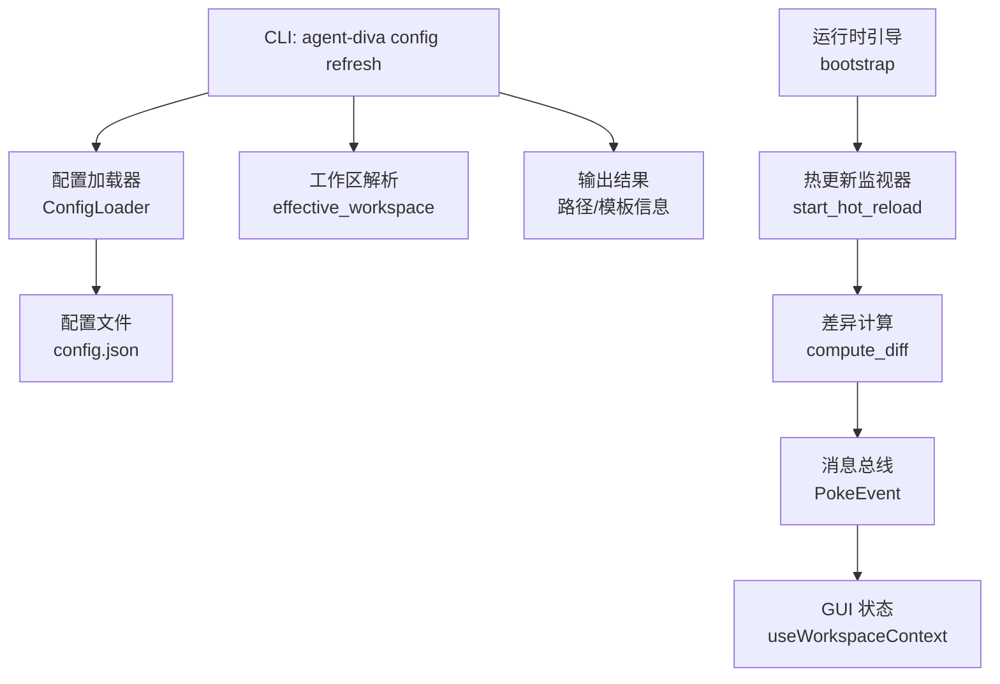
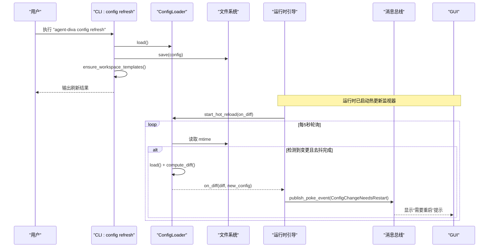
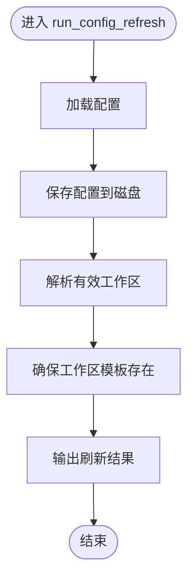
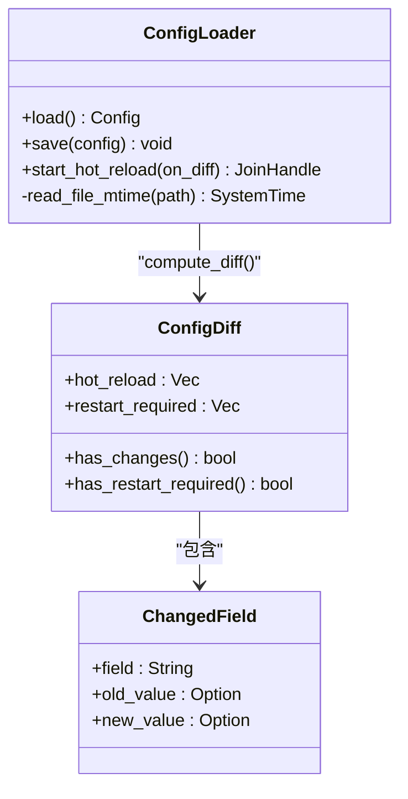
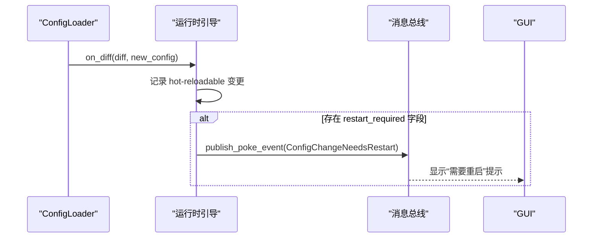
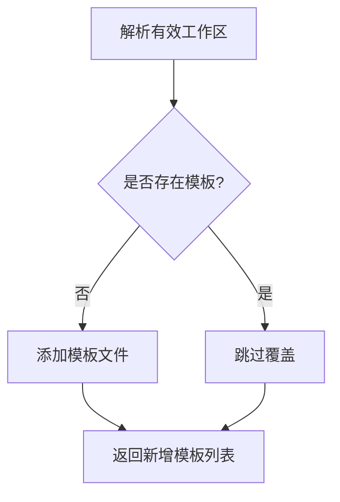
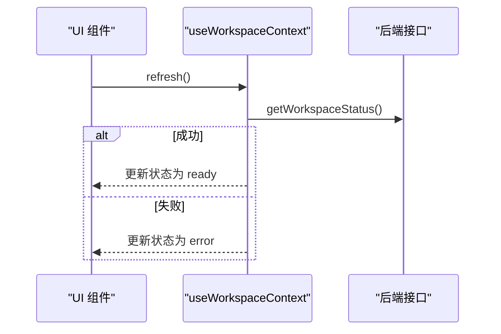
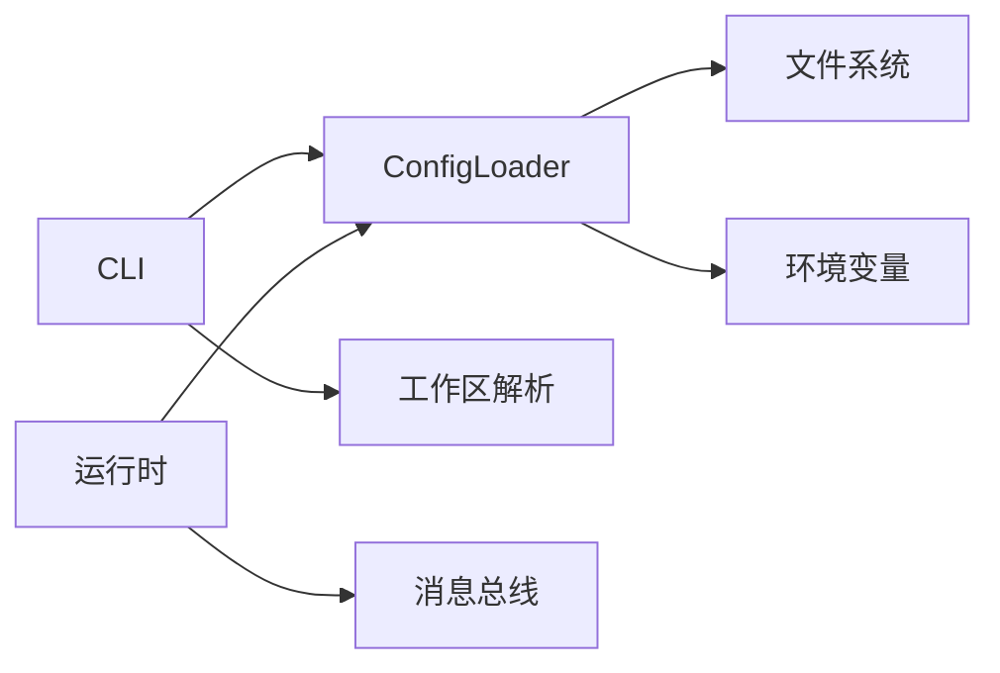

# Config Refresh 命令

<cite>
**本文引用的文件**
- [agent-diva-cli/src/main.rs](file://agent-diva-cli/src/main.rs)
- [agent-diva-core/src/config/loader.rs](file://agent-diva-core/src/config/loader.rs)
- [agent-diva-manager/src/runtime/bootstrap.rs](file://agent-diva-manager/src/runtime/bootstrap.rs)
- [agent-diva-core/src/workspace.rs](file://agent-diva-core/src/workspace.rs)
- [agent-diva-gui/src/composables/useWorkspaceContext.ts](file://agent-diva-gui/src/composables/useWorkspaceContext.ts)
</cite>

## 目录
1. [简介](#简介)
2. [项目结构](#项目结构)
3. [核心组件](#核心组件)
4. [架构总览](#架构总览)
5. [详细组件分析](#详细组件分析)
6. [依赖关系分析](#依赖关系分析)
7. [性能考虑](#性能考虑)
8. [故障排查指南](#故障排查指南)
9. [结论](#结论)
10. [附录](#附录)

## 简介
本文件面向“config refresh”子命令，系统性说明其功能、触发条件、生效范围、回滚机制与高级用法。该命令用于刷新配置并同步工作区模板；同时结合运行时的配置热更新能力，实现无需重启即可应用部分配置变更。文档还涵盖失败处理、日志记录与性能优化建议，帮助使用者安全高效地管理配置。

## 项目结构
- CLI 层：负责解析命令、持久化配置、输出结果。
- 核心配置加载器：负责读取/保存配置、检测文件变更、计算差异、启动后台热更新任务。
- 运行时引导：在网关启动时注册热更新回调，将差异分类为“可热更新”或“需重启”，并通过消息总线通知 GUI。
- 工作区解析：确定当前工作区根路径，供刷新模板时使用。
- GUI 状态：监听配置变更事件，提示是否需要重启。

**图示来源**
- [agent-diva-cli/src/main.rs:420-439](file://agent-diva-cli/src/main.rs#L420-L439)
- [agent-diva-cli/src/main.rs:1725-1740](file://agent-diva-cli/src/main.rs#L1725-L1740)
- [agent-diva-core/src/config/loader.rs:94-166](file://agent-diva-core/src/config/loader.rs#L94-L166)
- [agent-diva-manager/src/runtime/bootstrap.rs:26-75](file://agent-diva-manager/src/runtime/bootstrap.rs#L26-L75)
- [agent-diva-core/src/workspace.rs:87-124](file://agent-diva-core/src/workspace.rs#L87-L124)
- [agent-diva-gui/src/composables/useWorkspaceContext.ts:31-75](file://agent-diva-gui/src/composables/useWorkspaceContext.ts#L31-L75)

**章节来源**
- [agent-diva-cli/src/main.rs:420-439](file://agent-diva-cli/src/main.rs#L420-L439)
- [agent-diva-cli/src/main.rs:1725-1740](file://agent-diva-cli/src/main.rs#L1725-L1740)
- [agent-diva-core/src/config/loader.rs:94-166](file://agent-diva-core/src/config/loader.rs#L94-L166)
- [agent-diva-manager/src/runtime/bootstrap.rs:26-75](file://agent-diva-manager/src/runtime/bootstrap.rs#L26-L75)
- [agent-diva-core/src/workspace.rs:87-124](file://agent-diva-core/src/workspace.rs#L87-L124)
- [agent-diva-gui/src/composables/useWorkspaceContext.ts:31-75](file://agent-diva-gui/src/composables/useWorkspaceContext.ts#L31-L75)

## 核心组件
- 配置加载器（ConfigLoader）
  - 提供 load/save 方法，支持从默认目录或指定路径加载/保存配置。
  - 提供 start_hot_reload 后台任务，轮询配置文件 mtime，去抖后重新加载并计算差异。
  - 提供 compute_diff 对旧/新配置进行字段级差异比较，并将每个变更分类为“hot_reload”或“restart_required”。
- 运行时引导（bootstrap）
  - 启动时注册热更新回调，打印变更详情，并在需要重启时通过消息总线发出 PokeEvent。
- CLI 命令（config refresh）
  - 读取当前配置、保存到磁盘、确保工作区模板存在，并输出刷新结果。
- 工作区解析
  - 根据配置或命令行参数解析有效工作区根路径，供模板同步使用。
- GUI 状态
  - 刷新工作区状态，支持显式覆盖的工作区根，错误时设置 error 状态。

**章节来源**
- [agent-diva-core/src/config/loader.rs:14-82](file://agent-diva-core/src/config/loader.rs#L14-L82)
- [agent-diva-core/src/config/loader.rs:94-166](file://agent-diva-core/src/config/loader.rs#L94-L166)
- [agent-diva-core/src/config/loader.rs:241-306](file://agent-diva-core/src/config/loader.rs#L241-L306)
- [agent-diva-manager/src/runtime/bootstrap.rs:26-75](file://agent-diva-manager/src/runtime/bootstrap.rs#L26-L75)
- [agent-diva-cli/src/main.rs:420-439](file://agent-diva-cli/src/main.rs#L420-L439)
- [agent-diva-cli/src/main.rs:1725-1740](file://agent-diva-cli/src/main.rs#L1725-L1740)
- [agent-diva-core/src/workspace.rs:87-124](file://agent-diva-core/src/workspace.rs#L87-L124)
- [agent-diva-gui/src/composables/useWorkspaceContext.ts:31-75](file://agent-diva-gui/src/composables/useWorkspaceContext.ts#L31-L75)

## 架构总览
下图展示了“config refresh”命令与运行时热更新的协作流程：CLI 负责持久化配置与模板同步；运行时后台任务持续监控配置变更，计算差异并通知上层模块与 GUI。

**图示来源**
- [agent-diva-cli/src/main.rs:1725-1740](file://agent-diva-cli/src/main.rs#L1725-L1740)
- [agent-diva-core/src/config/loader.rs:94-166](file://agent-diva-core/src/config/loader.rs#L94-L166)
- [agent-diva-manager/src/runtime/bootstrap.rs:121-126](file://agent-diva-manager/src/runtime/bootstrap.rs#L121-L126)
- [agent-diva-manager/src/runtime/bootstrap.rs:26-75](file://agent-diva-manager/src/runtime/bootstrap.rs#L26-L75)

## 详细组件分析

### CLI 命令：config refresh
- 功能
  - 读取当前配置并保存到磁盘，确保工作区模板存在。
  - 输出配置路径与工作区路径，以及新增的模板文件列表。
- 行为要点
  - 不覆盖用户已有值，仅保证模板存在。
  - 若未新增模板，输出相应提示。
- 典型调用链
  - 解析命令 -> 加载配置 -> 保存配置 -> 解析工作区 -> 同步模板 -> 输出结果。

**图示来源**
- [agent-diva-cli/src/main.rs:1725-1740](file://agent-diva-cli/src/main.rs#L1725-L1740)

**章节来源**
- [agent-diva-cli/src/main.rs:420-439](file://agent-diva-cli/src/main.rs#L420-L439)
- [agent-diva-cli/src/main.rs:1725-1740](file://agent-diva-cli/src/main.rs#L1725-L1740)

### 配置加载与热更新：ConfigLoader
- 关键能力
  - load：合并默认配置、文件配置与环境变量覆盖，并进行校验。
  - save：创建目录并写入 JSON 配置。
  - start_hot_reload：后台任务每 5 秒检查配置文件 mtime，去抖 500ms 后重新加载并计算差异。
  - compute_diff：递归比较新旧配置，按字段白名单分类为“hot_reload”或“restart_required”。
- 差异分类规则
  - 允许热更新的字段包括模型、温度、工具预算、超时、搜索/抓取开关、沙箱模式/审批策略、日志级别等。
  - 其他字段（如提供商、通道、MCP 服务器、端口、密钥等）需要重启才能生效。
- 错误处理
  - 加载失败时记录警告，继续等待下一次轮询。

**图示来源**
- [agent-diva-core/src/config/loader.rs:14-82](file://agent-diva-core/src/config/loader.rs#L14-L82)
- [agent-diva-core/src/config/loader.rs:94-166](file://agent-diva-core/src/config/loader.rs#L94-L166)
- [agent-diva-core/src/config/loader.rs:182-212](file://agent-diva-core/src/config/loader.rs#L182-L212)
- [agent-diva-core/src/config/loader.rs:241-306](file://agent-diva-core/src/config/loader.rs#L241-L306)

**章节来源**
- [agent-diva-core/src/config/loader.rs:14-82](file://agent-diva-core/src/config/loader.rs#L14-L82)
- [agent-diva-core/src/config/loader.rs:94-166](file://agent-diva-core/src/config/loader.rs#L94-L166)
- [agent-diva-core/src/config/loader.rs:182-212](file://agent-diva-core/src/config/loader.rs#L182-L212)
- [agent-diva-core/src/config/loader.rs:241-306](file://agent-diva-core/src/config/loader.rs#L241-L306)

### 运行时引导：热更新回调与事件
- 职责
  - 启动时注册热更新回调，打印变更详情。
  - 当检测到需要重启的字段时，发布 PokeEvent，以便 GUI 展示“需要重启”的提示。
- 影响范围
  - 热更新字段可在运行时立即生效（如日志级别、工具开关、沙箱模式等）。
  - 需要重启的字段（如端口、提供商密钥）不会自动应用，需重启服务。

**图示来源**
- [agent-diva-manager/src/runtime/bootstrap.rs:26-75](file://agent-diva-manager/src/runtime/bootstrap.rs#L26-L75)
- [agent-diva-manager/src/runtime/bootstrap.rs:121-126](file://agent-diva-manager/src/runtime/bootstrap.rs#L121-L126)

**章节来源**
- [agent-diva-manager/src/runtime/bootstrap.rs:26-75](file://agent-diva-manager/src/runtime/bootstrap.rs#L26-L75)
- [agent-diva-manager/src/runtime/bootstrap.rs:121-126](file://agent-diva-manager/src/runtime/bootstrap.rs#L121-L126)

### 工作区解析与模板同步
- 工作区解析
  - 根据配置或命令行参数解析有效工作区根路径，兼容历史默认行为并发出告警。
- 模板同步
  - 确保工作区模板存在，不覆盖用户已有文件；首次同步会添加必要的模板文件。

**图示来源**
- [agent-diva-core/src/workspace.rs:87-124](file://agent-diva-core/src/workspace.rs#L87-L124)
- [agent-diva-cli/src/main.rs:1725-1740](file://agent-diva-cli/src/main.rs#L1725-L1740)

**章节来源**
- [agent-diva-core/src/workspace.rs:87-124](file://agent-diva-core/src/workspace.rs#L87-L124)
- [agent-diva-cli/src/main.rs:1725-1740](file://agent-diva-cli/src/main.rs#L1725-L1740)

### GUI 状态与刷新
- 刷新逻辑
  - 在非 Tauri 环境下直接标记就绪；在 Tauri 环境中调用后端接口获取工作区状态。
  - 支持显式覆盖的工作区根，错误时设置 error 状态并返回 false。
- 与热更新联动
  - 当运行时发布“需要重启”的事件时，GUI 可据此提示用户。

**图示来源**
- [agent-diva-gui/src/composables/useWorkspaceContext.ts:31-75](file://agent-diva-gui/src/composables/useWorkspaceContext.ts#L31-L75)

**章节来源**
- [agent-diva-gui/src/composables/useWorkspaceContext.ts:31-75](file://agent-diva-gui/src/composables/useWorkspaceContext.ts#L31-L75)

## 依赖关系分析
- CLI 依赖
  - 配置加载器：用于加载/保存配置。
  - 工作区解析：用于确定工作区根路径。
- 运行时依赖
  - 配置加载器：启动热更新监视器。
  - 消息总线：向 GUI 发送“需要重启”事件。
- 外部依赖
  - 文件系统：读写配置文件与模板。
  - 环境变量：注入提供商密钥与路径覆盖。

**图示来源**
- [agent-diva-cli/src/main.rs:1725-1740](file://agent-diva-cli/src/main.rs#L1725-L1740)
- [agent-diva-core/src/config/loader.rs:94-166](file://agent-diva-core/src/config/loader.rs#L94-L166)
- [agent-diva-manager/src/runtime/bootstrap.rs:121-126](file://agent-diva-manager/src/runtime/bootstrap.rs#L121-L126)

**章节来源**
- [agent-diva-cli/src/main.rs:1725-1740](file://agent-diva-cli/src/main.rs#L1725-L1740)
- [agent-diva-core/src/config/loader.rs:94-166](file://agent-diva-core/src/config/loader.rs#L94-L166)
- [agent-diva-manager/src/runtime/bootstrap.rs:121-126](file://agent-diva-manager/src/runtime/bootstrap.rs#L121-L126)

## 性能考虑
- 轮询间隔与去抖
  - 每 5 秒检查一次配置文件 mtime，检测到变更后等待 500ms 再次确认，避免编辑器自动保存导致的多次重载。
- 差异计算
  - 采用 JSON 序列化后的递归比较，粒度到字段级；对于大型配置对象，注意序列化与比较开销。
- I/O 优化
  - 仅在 mtime 变化时重新加载与比较，减少不必要的磁盘读取。
- 批量刷新建议
  - 建议在批量修改配置后统一保存，利用去抖机制合并多次写入，降低重载次数。
- 日志与监控
  - 热更新日志包含变更数量与类型，便于定位频繁变更场景。

[本节为通用性能指导，不直接分析具体文件]

## 故障排查指南
- 配置加载失败
  - 现象：热更新任务记录“Failed to reload config after mtime change”。
  - 处理：检查配置文件语法与必填字段；修正后等待下一次轮询。
- 需要重启的字段
  - 现象：GUI 显示“需要重启”提示。
  - 处理：重启网关或服务以应用变更。
- 工作区模板未生效
  - 现象：模板未出现在工作区。
  - 处理：执行“config refresh”确保模板同步；检查是否被用户覆盖。
- 环境变量覆盖异常
  - 现象：配置未按预期生效。
  - 处理：检查环境变量键名与目标路径映射是否正确。

**章节来源**
- [agent-diva-core/src/config/loader.rs:160-162](file://agent-diva-core/src/config/loader.rs#L160-L162)
- [agent-diva-manager/src/runtime/bootstrap.rs:46-74](file://agent-diva-manager/src/runtime/bootstrap.rs#L46-L74)
- [agent-diva-cli/src/main.rs:1725-1740](file://agent-diva-cli/src/main.rs#L1725-L1740)

## 结论
“config refresh”命令提供了安全的配置持久化与工作区模板同步能力；配合运行时的配置热更新机制，可实现对部分配置的即时生效与对其他配置的受控重启应用。通过差异分类、去抖轮询与消息总线通知，系统在可用性与稳定性之间取得平衡。建议在生产环境中合理设置轮询间隔与日志级别，并结合 GUI 提示进行变更管理。

[本节为总结性内容，不直接分析具体文件]

## 附录
- 常用命令
  - agent-diva config refresh：刷新配置与工作区模板。
  - agent-diva config validate：验证配置合法性。
  - agent-diva config doctor：检查配置与运行时就绪状态。
- 热更新字段示例（非穷尽）
  - agents.defaults.model / temperature / reasoning_effort
  - tools.budget / tools.exec.timeout / tools.web.search.enabled / tools.web.fetch.enabled
  - sandbox.mode / sandbox.approval_policy
  - logging.level
- 需要重启的字段示例（非穷尽）
  - gateway.port
  - providers.*.api_key
  - channels.*.enabled
  - mcp.servers.*

[本节为补充信息，不直接分析具体文件]