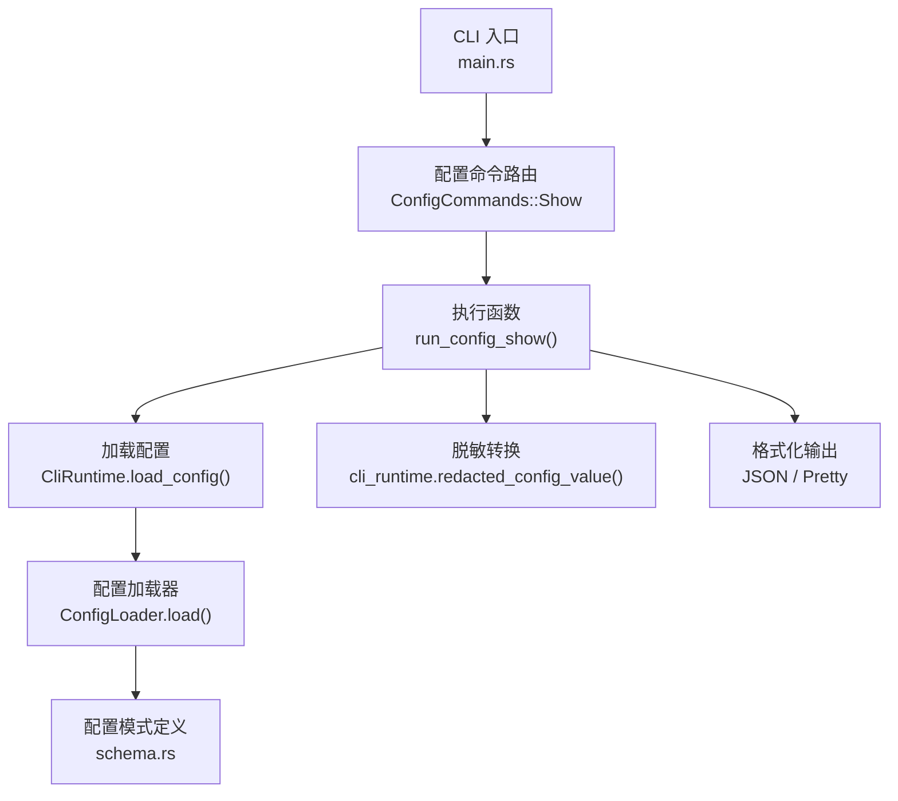
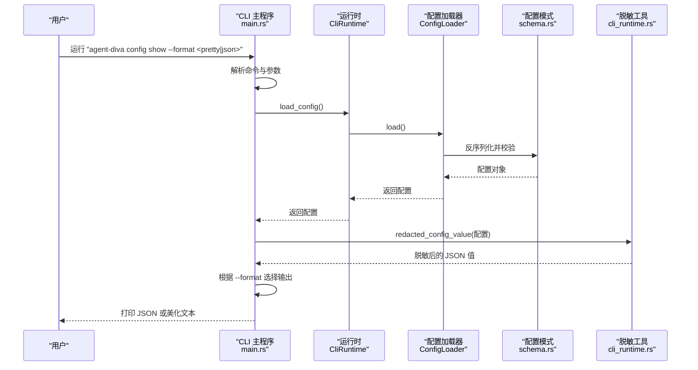
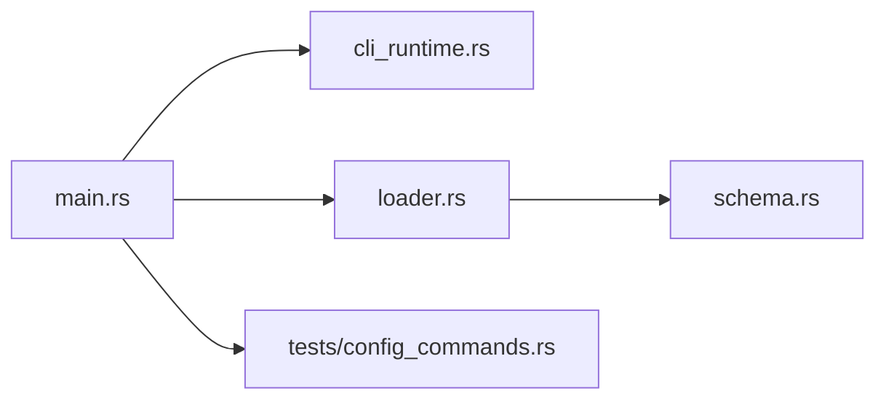

# Config Show 命令

<cite>
**本文引用的文件**
- [agent-diva-cli/src/main.rs](file://agent-diva-cli/src/main.rs)
- [agent-diva-cli/src/cli_runtime.rs](file://agent-diva-cli/src/cli_runtime.rs)
- [agent-diva-core/src/config/mod.rs](file://agent-diva-core/src/config/mod.rs)
- [agent-diva-core/src/config/loader.rs](file://agent-diva-core/src/config/loader.rs)
- [agent-diva-core/src/config/schema.rs](file://agent-diva-core/src/config/schema.rs)
- [agent-diva-cli/tests/config_commands.rs](file://agent-diva-cli/tests/config_commands.rs)
</cite>

## 目录
1. [简介](#简介)
2. [项目结构](#项目结构)
3. [核心组件](#核心组件)
4. [架构总览](#架构总览)
5. [详细组件分析](#详细组件分析)
6. [依赖关系分析](#依赖关系分析)
7. [性能考量](#性能考量)
8. [故障排查指南](#故障排查指南)
9. [结论](#结论)
10. [附录](#附录)

## 简介
本文件围绕 agent-diva CLI 的 config show 子命令，提供从使用到实现的完整说明。该命令用于显示当前生效的配置（已对敏感字段进行脱敏），支持 JSON 与“美化”两种输出格式，便于调试、审计、导出与文档生成。结合配置热重载与差异计算能力，可进一步实现版本对比与变更追踪。

## 项目结构
config show 的实现位于 CLI 层，调用运行时加载配置并进行脱敏，再按指定格式输出；配置加载、校验与差异计算由 core 层提供。

图表来源
- [agent-diva-cli/src/main.rs:421-438](file://agent-diva-cli/src/main.rs#L421-L438)
- [agent-diva-cli/src/main.rs:690-696](file://agent-diva-cli/src/main.rs#L690-L696)
- [agent-diva-cli/src/main.rs:1809-1817](file://agent-diva-cli/src/main.rs#L1809-L1817)
- [agent-diva-cli/src/cli_runtime.rs:459-463](file://agent-diva-cli/src/cli_runtime.rs#L459-L463)
- [agent-diva-core/src/config/loader.rs:57-74](file://agent-diva-core/src/config/loader.rs#L57-L74)
- [agent-diva-core/src/config/schema.rs:1-200](file://agent-diva-core/src/config/schema.rs#L1-L200)

章节来源
- [agent-diva-cli/src/main.rs:421-438](file://agent-diva-cli/src/main.rs#L421-L438)
- [agent-diva-cli/src/main.rs:690-696](file://agent-diva-cli/src/main.rs#L690-L696)
- [agent-diva-cli/src/main.rs:1809-1817](file://agent-diva-cli/src/main.rs#L1809-L1817)
- [agent-diva-cli/src/cli_runtime.rs:459-463](file://agent-diva-cli/src/cli_runtime.rs#L459-L463)
- [agent-diva-core/src/config/loader.rs:57-74](file://agent-diva-core/src/config/loader.rs#L57-L74)
- [agent-diva-core/src/config/schema.rs:1-200](file://agent-diva-core/src/config/schema.rs#L1-L200)

## 核心组件
- 命令定义与参数
  - 子命令：config show
  - 参数：--format <pretty|json>，默认 pretty
- 执行流程
  - 解析命令并路由到 run_config_show
  - 通过 CliRuntime 加载配置
  - 将配置对象转换为 JSON 值并对敏感字段脱敏
  - 根据 --format 选择紧凑或美化输出
- 配置加载与校验
  - 从配置文件与环境合并，应用别名/路径覆盖，归一化键名后反序列化为配置结构体
  - 执行 schema 与语义校验
- 差异与热重载（扩展能力）
  - 支持检测配置变更并计算 diff，区分热重载与需重启字段

章节来源
- [agent-diva-cli/src/main.rs:390-438](file://agent-diva-cli/src/main.rs#L390-L438)
- [agent-diva-cli/src/main.rs:690-696](file://agent-diva-cli/src/main.rs#L690-L696)
- [agent-diva-cli/src/main.rs:1809-1817](file://agent-diva-cli/src/main.rs#L1809-L1817)
- [agent-diva-core/src/config/mod.rs:1-12](file://agent-diva-core/src/config/mod.rs#L1-L12)
- [agent-diva-core/src/config/loader.rs:57-74](file://agent-diva-core/src/config/loader.rs#L57-L74)
- [agent-diva-core/src/config/loader.rs:107-166](file://agent-diva-core/src/config/loader.rs#L107-L166)

## 架构总览
config show 的端到端调用链如下：

图表来源
- [agent-diva-cli/src/main.rs:421-438](file://agent-diva-cli/src/main.rs#L421-L438)
- [agent-diva-cli/src/main.rs:690-696](file://agent-diva-cli/src/main.rs#L690-L696)
- [agent-diva-cli/src/main.rs:1809-1817](file://agent-diva-cli/src/main.rs#L1809-L1817)
- [agent-diva-core/src/config/loader.rs:57-74](file://agent-diva-core/src/config/loader.rs#L57-L74)
- [agent-diva-cli/src/cli_runtime.rs:459-463](file://agent-diva-cli/src/cli_runtime.rs#L459-L463)

## 详细组件分析

### 命令定义与参数
- 子命令枚举包含 Path、Init、Refresh、Validate、Doctor、Show
- Show 子命令接受 --format，取值 pretty/json，默认 pretty
- 路由在命令分发处匹配 ConfigCommands::Show 并调用 run_config_show

章节来源
- [agent-diva-cli/src/main.rs:390-438](file://agent-diva-cli/src/main.rs#L390-L438)
- [agent-diva-cli/src/main.rs:690-696](file://agent-diva-cli/src/main.rs#L690-L696)

### 执行函数 run_config_show
- 步骤
  - 通过 runtime.load_config() 获取当前配置
  - 调用 redacted_config_value() 将配置转为 JSON 并对敏感字段替换为占位符
  - 根据 format 选择 serde_json 的紧凑或美化序列化输出
- 行为要点
  - 输出仅包含配置数据，不包含启动标识或日志信息
  - 敏感字段（如 API Key）会被统一替换为固定占位符

章节来源
- [agent-diva-cli/src/main.rs:1809-1817](file://agent-diva-cli/src/main.rs#L1809-L1817)
- [agent-diva-cli/src/cli_runtime.rs:459-463](file://agent-diva-cli/src/cli_runtime.rs#L459-L463)

### 配置加载与校验
- 加载顺序
  - 以默认配置为基底
  - 若存在配置文件则读取并合并
  - 应用别名覆盖、路径覆盖、键名归一化
  - 反序列化为强类型配置结构体
  - 执行配置校验
- 热重载与差异
  - 支持后台轮询配置文件 mtime，检测到变更后重新加载并计算 diff
  - diff 分为“热重载可用”和“需重启”两类字段，便于运行时策略调整

章节来源
- [agent-diva-core/src/config/loader.rs:57-74](file://agent-diva-core/src/config/loader.rs#L57-L74)
- [agent-diva-core/src/config/loader.rs:107-166](file://agent-diva-core/src/config/loader.rs#L107-L166)
- [agent-diva-core/src/config/loader.rs:183-219](file://agent-diva-core/src/config/loader.rs#L183-L219)

### 脱敏机制
- 将配置对象序列化为 JSON 值后，递归遍历树结构
- 识别敏感字段并按规则替换为固定占位符
- 保证 show 输出不含真实密钥，适合调试与共享

章节来源
- [agent-diva-cli/src/cli_runtime.rs:448-463](file://agent-diva-cli/src/cli_runtime.rs#L448-L463)

### 测试验证
- 针对 config show 的 JSON 输出断言：当配置中包含 provider 的 api_key 时，show 输出的对应字段被替换为固定占位符
- 该用例验证了 show 的脱敏行为与结构化输出稳定性

章节来源
- [agent-diva-cli/tests/config_commands.rs:66-86](file://agent-diva-cli/tests/config_commands.rs#L66-L86)

## 依赖关系分析
- CLI 层依赖
  - main.rs：命令定义、路由、执行函数
  - cli_runtime.rs：脱敏工具、JSON 打印等辅助
- Core 层依赖
  - loader.rs：配置加载、保存、热重载与差异计算
  - schema.rs：配置结构体定义（含通道、沙箱、掩码等）
  - mod.rs：对外暴露 loader 与 schema 能力

图表来源
- [agent-diva-cli/src/main.rs:421-438](file://agent-diva-cli/src/main.rs#L421-L438)
- [agent-diva-cli/src/cli_runtime.rs:459-463](file://agent-diva-cli/src/cli_runtime.rs#L459-L463)
- [agent-diva-core/src/config/loader.rs:57-74](file://agent-diva-core/src/config/loader.rs#L57-L74)
- [agent-diva-core/src/config/schema.rs:1-200](file://agent-diva-core/src/config/schema.rs#L1-L200)
- [agent-diva-cli/tests/config_commands.rs:66-86](file://agent-diva-cli/tests/config_commands.rs#L66-L86)

章节来源
- [agent-diva-cli/src/main.rs:421-438](file://agent-diva-cli/src/main.rs#L421-L438)
- [agent-diva-cli/src/cli_runtime.rs:459-463](file://agent-diva-cli/src/cli_runtime.rs#L459-L463)
- [agent-diva-core/src/config/loader.rs:57-74](file://agent-diva-core/src/config/loader.rs#L57-L74)
- [agent-diva-core/src/config/schema.rs:1-200](file://agent-diva-core/src/config/schema.rs#L1-L200)
- [agent-diva-cli/tests/config_commands.rs:66-86](file://agent-diva-cli/tests/config_commands.rs#L66-L86)

## 性能考量
- 加载与序列化开销
  - 每次 show 都会加载配置并序列化一次，属于轻量操作
- 脱敏遍历
  - 对 JSON 树进行递归遍历，复杂度与配置大小线性相关
- 建议
  - 在自动化脚本中缓存 show 结果，避免频繁重复执行
  - 大配置场景下优先使用 JSON 输出以减少终端渲染开销

## 故障排查指南
- 常见问题
  - 输出为空或报错：检查配置文件是否存在且可读，路径是否正确
  - 敏感字段未脱敏：确认使用的是 config show，而非其他命令；查看脱敏逻辑是否被正确调用
  - 输出不符合预期：确认 --format 参数是否为 json 或 pretty
- 定位方法
  - 使用 --json 输出配合外部工具（jq/yq）过滤与比对
  - 结合 config doctor 检查配置有效性与就绪状态
  - 利用配置热重载的 diff 能力观察变更影响范围

章节来源
- [agent-diva-cli/src/main.rs:1809-1817](file://agent-diva-cli/src/main.rs#L1809-L1817)
- [agent-diva-core/src/config/loader.rs:107-166](file://agent-diva-core/src/config/loader.rs#L107-L166)

## 结论
config show 提供了安全、稳定的配置查看能力，支持结构化输出与脱敏，适用于日常调试、审计与文档生成。结合配置热重载与差异计算，可进一步实现版本对比与变更可视化，满足更高级的运维需求。

## 附录

### 用法速查
- 基本用法
  - 显示美化格式的有效配置（默认）
  - 示例：agent-diva config show
- 结构化输出
  - 显示 JSON 格式的有效配置
  - 示例：agent-diva config show --format json
- 与显式配置路径配合
  - 指定实例配置文件路径后执行 show
  - 示例：agent-diva --config <路径> config show --format json

章节来源
- [agent-diva-cli/src/main.rs:421-438](file://agent-diva-cli/src/main.rs#L421-L438)
- [agent-diva-cli/src/main.rs:690-696](file://agent-diva-cli/src/main.rs#L690-L696)
- [agent-diva-cli/src/main.rs:1809-1817](file://agent-diva-cli/src/main.rs#L1809-L1817)

### 输出格式选项
- pretty：人类可读的多行缩进格式
- json：单行紧凑格式，便于管道处理与机器消费

章节来源
- [agent-diva-cli/src/main.rs:390-438](file://agent-diva-cli/src/main.rs#L390-L438)
- [agent-diva-cli/src/main.rs:1809-1817](file://agent-diva-cli/src/main.rs#L1809-L1817)

### 过滤条件与导出
- 内置过滤：无直接字段过滤参数
- 推荐做法：使用 jq/yq 对 JSON 输出进行过滤与提取
- 导出：将 JSON 输出重定向至文件，便于归档与审阅

章节来源
- [agent-diva-cli/src/main.rs:1809-1817](file://agent-diva-cli/src/main.rs#L1809-L1817)

### 配置查询与调试
- 组合命令
  - 先运行 config doctor 检查有效性及就绪状态
  - 再用 config show 查看实际生效值
- 环境变量与覆盖
  - 配置加载会合并环境与文件，必要时通过环境变量注入临时值进行调试

章节来源
- [agent-diva-core/src/config/loader.rs:57-74](file://agent-diva-core/src/config/loader.rs#L57-L74)

### 配置可视化与版本比较
- 可视化
  - 将 JSON 输出导入可视化工具（如表格/树形视图）进行浏览
- 版本比较
  - 使用 config doctor 或热重载 diff 能力对比前后配置差异
  - 将两次 show 的 JSON 输出进行 diff，定位具体变更

章节来源
- [agent-diva-core/src/config/loader.rs:107-166](file://agent-diva-core/src/config/loader.rs#L107-L166)
- [agent-diva-core/src/config/loader.rs:183-219](file://agent-diva-core/src/config/loader.rs#L183-L219)

### 文档生成
- 基于 JSON 输出自动生成配置参考文档
- 结合 schema 定义，生成字段说明与默认值清单

章节来源
- [agent-diva-core/src/config/schema.rs:1-200](file://agent-diva-core/src/config/schema.rs#L1-L200)