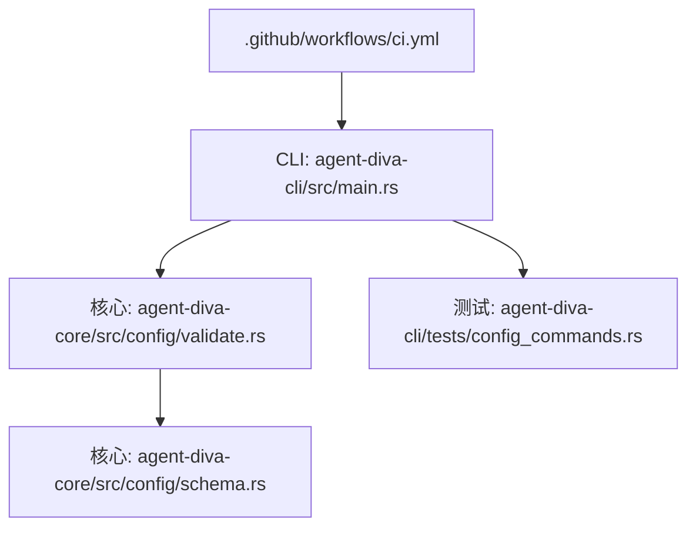
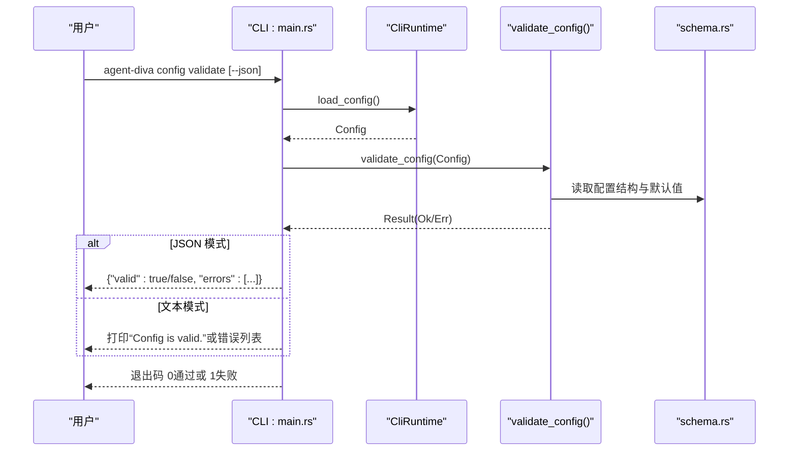
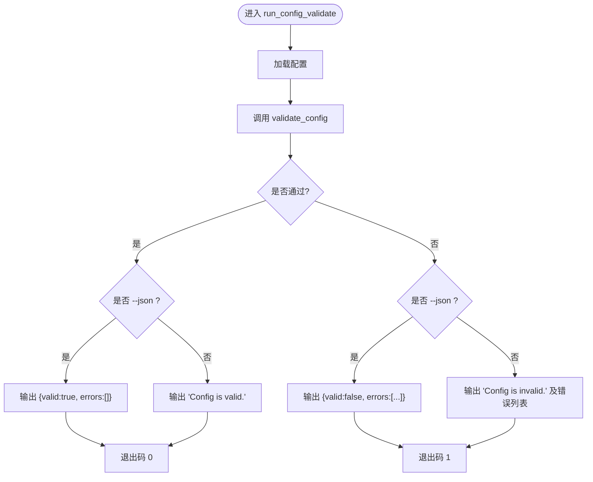
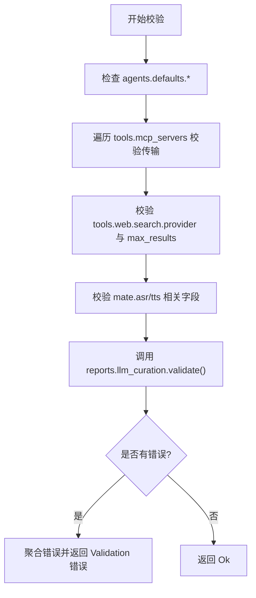
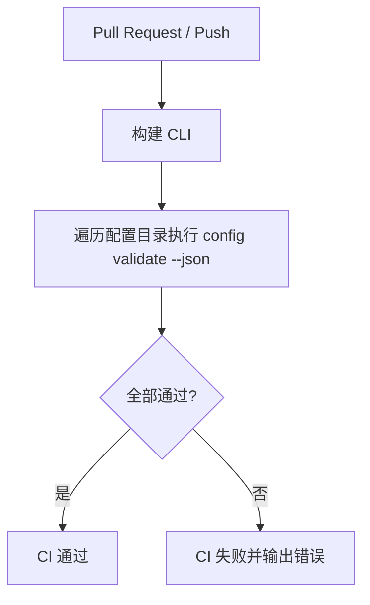
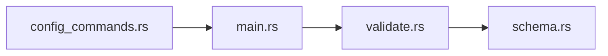

# Config Validate 命令

<cite>
**本文引用的文件**
- [agent-diva-cli/src/main.rs](file://agent-diva-cli/src/main.rs)
- [agent-diva-core/src/config/validate.rs](file://agent-diva-core/src/config/validate.rs)
- [agent-diva-core/src/config/schema.rs](file://agent-diva-core/src/config/schema.rs)
- [agent-diva-cli/tests/config_commands.rs](file://agent-diva-cli/tests/config_commands.rs)
- [.github/workflows/ci.yml](file://.github/workflows/ci.yml)
</cite>

## 目录
1. [简介](#简介)
2. [项目结构](#项目结构)
3. [核心组件](#核心组件)
4. [架构总览](#架构总览)
5. [详细组件分析](#详细组件分析)
6. [依赖关系分析](#依赖关系分析)
7. [性能考量](#性能考量)
8. [故障排查指南](#故障排查指南)
9. [结论](#结论)
10. [附录](#附录)

## 简介
Config Validate 是 agent-diva CLI 提供的配置校验子命令，用于在启动或部署前对配置文件进行“语法 + 语义”的完整性检查。它不执行任何网络请求，仅基于已加载的配置对象运行内置规则，输出人类可读或 JSON 格式的结果，并通过退出码指示成功或失败，便于集成到脚本与持续集成流程中。

主要能力：
- 配置文件解析后的结构体验证（schema 层）
- 业务语义规则校验（如必填字段、取值范围、枚举值、依赖关系等）
- 统一错误聚合与提示
- JSON 友好输出，便于自动化消费
- 与 Doctor 命令配合，区分“配置有效”和“运行时就绪”

## 项目结构
与 Config Validate 直接相关的代码分布在 CLI 入口与核心配置模块中：
- CLI 层负责解析参数、加载配置、调用验证并格式化输出
- 核心层提供配置结构定义与验证规则实现
- 测试覆盖 CLI 行为与核心验证逻辑
- CI 工作流可用于编排批量验证任务

图表来源
- [agent-diva-cli/src/main.rs:420-439](file://agent-diva-cli/src/main.rs#L420-L439)
- [agent-diva-core/src/config/validate.rs:1-100](file://agent-diva-core/src/config/validate.rs#L1-L100)
- [agent-diva-core/src/config/schema.rs:278-309](file://agent-diva-core/src/config/schema.rs#L278-L309)
- [.github/workflows/ci.yml:56-112](file://.github/workflows/ci.yml#L56-L112)

章节来源
- [agent-diva-cli/src/main.rs:420-439](file://agent-diva-cli/src/main.rs#L420-L439)
- [agent-diva-core/src/config/validate.rs:1-100](file://agent-diva-core/src/config/validate.rs#L1-L100)
- [agent-diva-core/src/config/schema.rs:278-309](file://agent-diva-core/src/config/schema.rs#L278-L309)
- [.github/workflows/ci.yml:56-112](file://.github/workflows/ci.yml#L56-L112)

## 核心组件
- CLI 命令路由与输出：定义 config validate 子命令，加载配置后调用验证函数，并以文本或 JSON 形式输出结果；失败时返回非零退出码。
- 配置结构定义：集中描述所有配置项及其默认值、可选/必填约束、枚举与取值范围。
- 验证规则：对 agents.defaults、tools.mcp_servers、tools.web.search、mate.asr/tts 等关键路径进行语义校验，并聚合错误信息。

章节来源
- [agent-diva-cli/src/main.rs:420-439](file://agent-diva-cli/src/main.rs#L420-L439)
- [agent-diva-cli/src/main.rs:1742-1771](file://agent-diva-cli/src/main.rs#L1742-L1771)
- [agent-diva-core/src/config/schema.rs:278-309](file://agent-diva-core/src/config/schema.rs#L278-L309)
- [agent-diva-core/src/config/validate.rs:1-100](file://agent-diva-core/src/config/validate.rs#L1-L100)

## 架构总览
下图展示了从命令行到验证执行的完整调用链，以及输出与退出码的处理方式。

图表来源
- [agent-diva-cli/src/main.rs:1742-1771](file://agent-diva-cli/src/main.rs#L1742-L1771)
- [agent-diva-core/src/config/validate.rs:1-100](file://agent-diva-core/src/config/validate.rs#L1-L100)
- [agent-diva-core/src/config/schema.rs:278-309](file://agent-diva-core/src/config/schema.rs#L278-L309)

## 详细组件分析

### CLI 命令与输出
- 子命令定义：config validate 接受通用状态参数（例如 --json），用于切换输出格式。
- 执行流程：
  - 加载配置（可能来自配置文件与环境变量合并）
  - 调用 validate_config 进行规则校验
  - 根据是否 JSON 模式输出结构化结果或人类可读消息
  - 若无效则设置进程退出码为 1，便于脚本判断

图表来源
- [agent-diva-cli/src/main.rs:1742-1771](file://agent-diva-cli/src/main.rs#L1742-L1771)

章节来源
- [agent-diva-cli/src/main.rs:420-439](file://agent-diva-cli/src/main.rs#L420-L439)
- [agent-diva-cli/src/main.rs:1742-1771](file://agent-diva-cli/src/main.rs#L1742-L1771)

### 配置结构与默认值
- 根配置包含多个子系统：agents、channels、providers、gateway、tools、memory、self_evolution、reports、logging、sandbox、mate。
- 各子系统有明确的默认值与可选字段，便于最小化配置即可运行。
- 报告生成（reports.llm_curation）具备独立校验方法，确保超时、令牌上限与回退策略合法。

章节来源
- [agent-diva-core/src/config/schema.rs:278-309](file://agent-diva-core/src/config/schema.rs#L278-L309)
- [agent-diva-core/src/config/schema.rs:378-463](file://agent-diva-core/src/config/schema.rs#L378-L463)

### 验证规则详解
validate_config 对以下关键路径进行检查：
- agents.defaults
  - workspace 不能为空
  - max_tokens 必须大于 0
  - temperature 必须在 [0.0, 2.0]
  - max_tool_iterations 必须大于 0
  - reasoning_effort 若提供，必须是 low/medium/high 之一
- tools.mcp_servers
  - 每个服务器必须提供 command（stdio）或 url（http）至少一个
- tools.web.search
  - provider 仅支持 brave/bocha/zhipu
  - max_results 受 provider 限制：zhipu/bocha 允许更高上限，其他为较低上限
- mate
  - asr_provider 若提供，仅支持 web_speech/siliconflow
  - tts_provider 若提供，仅支持 browser/openai/siliconflow/minimax
  - tts_speed 必须为正数且有限
  - tts_volume 必须在 [0.0, 2.0]
- reports.llm_curation
  - 通过其内部 validate 方法检查 timeout_secs、max_input_tokens、max_output_tokens、fallback 等

错误处理：
- 所有规则错误被收集为一个 Vec<String>
- 最终聚合为单一 Validation 错误，CLI 将其转换为字符串展示或 JSON errors 数组

图表来源
- [agent-diva-core/src/config/validate.rs:1-100](file://agent-diva-core/src/config/validate.rs#L1-L100)

章节来源
- [agent-diva-core/src/config/validate.rs:1-100](file://agent-diva-core/src/config/validate.rs#L1-L100)

### 常见配置错误示例与修复建议
- agents.defaults.workspace 为空
  - 现象：提示 workspace 不能为空
  - 修复：设置有效的 workspace 路径
- agents.defaults.max_tokens 为 0
  - 现象：提示必须大于 0
  - 修复：设置为正整数
- agents.defaults.temperature 超出范围
  - 现象：提示必须在 [0.0, 2.0]
  - 修复：调整到合理范围
- tools.mcp_servers 某条目未设置 command 或 url
  - 现象：提示必须设置 stdio 或 http 传输
  - 修复：补充 command 或 url
- tools.web.search.provider 不支持
  - 现象：提示仅支持 brave/bocha/zhipu
  - 修复：选择支持的 provider
- tools.web.search.max_results 超限
  - 现象：提示根据 provider 的最大值限制
  - 修复：按 provider 限制调整
- mate.tts_speed 非正或非有限
  - 现象：提示必须 > 0
  - 修复：设置为正数
- mate.tts_volume 不在 [0.0, 2.0]
  - 现象：提示范围错误
  - 修复：调整到范围内
- reports.llm_curation.timeout_secs/max_*_tokens/fallback 非法
  - 现象：提示对应字段非法
  - 修复：按规则修正

章节来源
- [agent-diva-core/src/config/validate.rs:1-100](file://agent-diva-core/src/config/validate.rs#L1-L100)
- [agent-diva-core/src/config/schema.rs:378-463](file://agent-diva-core/src/config/schema.rs#L378-L463)

### 自定义验证规则扩展
- 新增规则位置：在 validate_config 中添加新的条件分支，遵循现有错误聚合模式
- 推荐实践：
  - 将复杂规则封装为独立函数，保持 validate_config 简洁
  - 使用清晰的错误消息，指向具体配置路径
  - 为每条新规则编写单元测试，覆盖边界与异常输入
- 与 schema 的关系：
  - schema 负责类型与默认值；validate 负责跨字段语义校验
  - 对于强约束的枚举或范围，可在 schema 层用 serde 注解表达，在 validate 层做更复杂的组合校验

章节来源
- [agent-diva-core/src/config/validate.rs:1-100](file://agent-diva-core/src/config/validate.rs#L1-L100)
- [agent-diva-core/src/config/schema.rs:278-309](file://agent-diva-core/src/config/schema.rs#L278-L309)

### 批量验证与持续集成集成
- 批量验证：
  - 可通过脚本循环多个配置路径，依次执行 agent-diva config validate --json，汇总结果
  - 利用 JSON 输出中的 valid/errors 字段进行断言
- CI 集成：
  - 在 GitHub Actions 中增加步骤，构建 CLI 并运行 config validate
  - 可结合 justfile 或 shell 脚本，对多环境配置进行预检
  - 当前 CI 已包含 Rust 检查、构建与部分验证步骤，可按需加入配置校验阶段

图表来源
- [.github/workflows/ci.yml:56-112](file://.github/workflows/ci.yml#L56-L112)
- [agent-diva-cli/src/main.rs:1742-1771](file://agent-diva-cli/src/main.rs#L1742-L1771)

章节来源
- [.github/workflows/ci.yml:56-112](file://.github/workflows/ci.yml#L56-L112)
- [agent-diva-cli/src/main.rs:1742-1771](file://agent-diva-cli/src/main.rs#L1742-L1771)

### 调试技巧与最佳实践
- 使用 --json 输出：
  - 便于在脚本中解析 errors 数组，定位具体字段
- 结合 config show：
  - 先运行 config show 查看实际生效的配置（含默认值），再运行 config validate 定位问题
- 逐步缩小范围：
  - 临时注释掉可疑配置段，确认是否为该段导致失败
- 关注退出码：
  - 0 表示通过，1 表示失败；在脚本中据此决定是否继续后续步骤
- 单元测试参考：
  - 参考 core 层的 validate 测试用例，理解期望行为与边界情况

章节来源
- [agent-diva-cli/src/main.rs:1742-1771](file://agent-diva-cli/src/main.rs#L1742-L1771)
- [agent-diva-core/src/config/validate.rs:102-162](file://agent-diva-core/src/config/validate.rs#L102-L162)

## 依赖关系分析
- CLI 依赖核心验证模块：main.rs 调用 validate_config
- 验证模块依赖配置结构：validate.rs 读取 schema.rs 定义的 Config 及各子结构
- 测试覆盖 CLI 行为：config_commands.rs 验证 CLI 的输出与退出码

图表来源
- [agent-diva-cli/src/main.rs:1742-1771](file://agent-diva-cli/src/main.rs#L1742-L1771)
- [agent-diva-core/src/config/validate.rs:1-100](file://agent-diva-core/src/config/validate.rs#L1-L100)
- [agent-diva-core/src/config/schema.rs:278-309](file://agent-diva-core/src/config/schema.rs#L278-L309)
- [agent-diva-cli/tests/config_commands.rs:65-109](file://agent-diva-cli/tests/config_commands.rs#L65-L109)

章节来源
- [agent-diva-cli/src/main.rs:1742-1771](file://agent-diva-cli/src/main.rs#L1742-L1771)
- [agent-diva-core/src/config/validate.rs:1-100](file://agent-diva-core/src/config/validate.rs#L1-L100)
- [agent-diva-core/src/config/schema.rs:278-309](file://agent-diva-core/src/config/schema.rs#L278-L309)
- [agent-diva-cli/tests/config_commands.rs:65-109](file://agent-diva-cli/tests/config_commands.rs#L65-L109)

## 性能考量
- 验证过程为纯内存计算，无 I/O 阻塞，开销极低
- 错误聚合采用顺序扫描，复杂度与配置大小线性相关
- 建议在批量验证时并行执行多个配置的校验，但避免在同一进程中重复加载相同配置

[本节为一般性指导，无需特定文件引用]

## 故障排查指南
- 症状：config validate 失败
  - 步骤：
    - 使用 --json 获取 errors 数组
    - 对照“常见配置错误示例”逐项修复
    - 使用 config show 核对实际生效值
- 症状：CI 中配置校验失败
  - 步骤：
    - 在本地复现相同的配置与命令
    - 检查环境变量与配置文件路径
    - 将 CI 日志中的 JSON 输出保存以便分析
- 症状：Doctor 显示 valid=true 但 ready=false
  - 说明：配置有效但运行时依赖未就绪（如缺少 API Key）
  - 解决：补齐所需凭据或网络可达性

章节来源
- [agent-diva-cli/src/main.rs:1742-1771](file://agent-diva-cli/src/main.rs#L1742-L1771)
- [agent-diva-cli/tests/config_commands.rs:88-109](file://agent-diva-cli/tests/config_commands.rs#L88-L109)

## 结论
Config Validate 提供了轻量而强大的配置前置检查能力，覆盖关键字段的语法与语义约束，并通过结构化输出与明确退出码，便于在开发与生产环境中稳定集成。建议团队在提交前、CI 流水线与部署脚本中统一使用该命令，以降低配置错误导致的运行时风险。

[本节为总结性内容，无需特定文件引用]

## 附录
- 常用命令
  - agent-diva config validate
  - agent-diva config validate --json
  - agent-diva config show
  - agent-diva config doctor
- 参考测试
  - 通过 tests/config_commands.rs 了解 CLI 的行为与预期输出

章节来源
- [agent-diva-cli/tests/config_commands.rs:1-248](file://agent-diva-cli/tests/config_commands.rs#L1-L248)