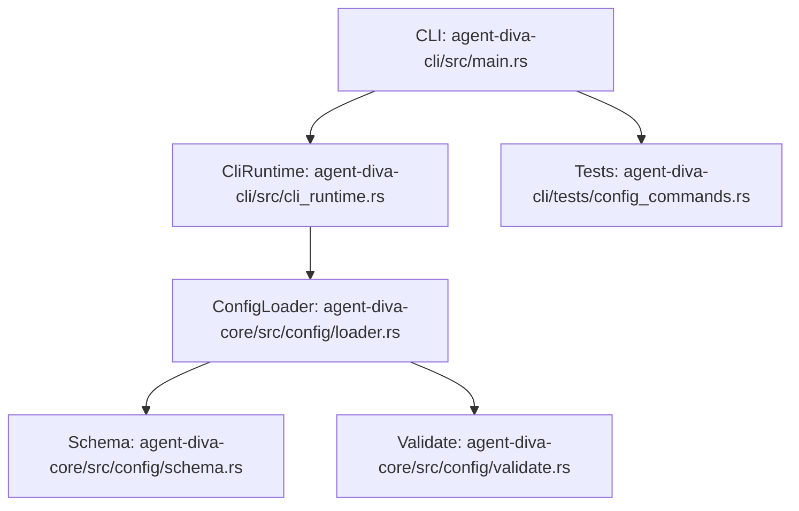
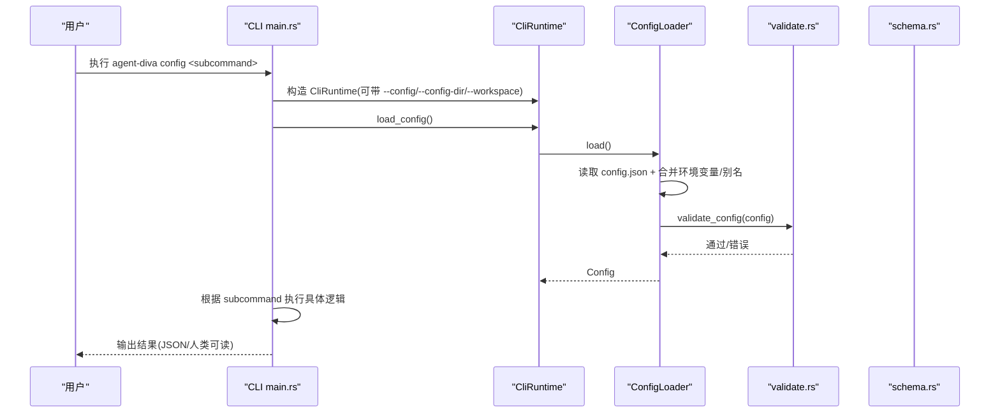
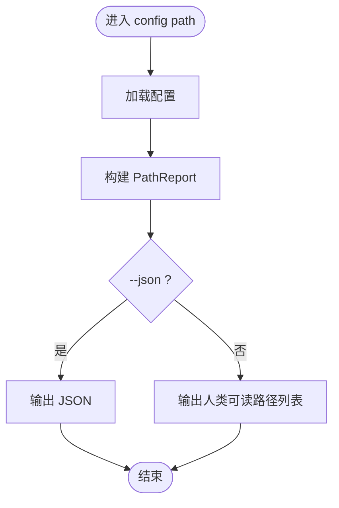
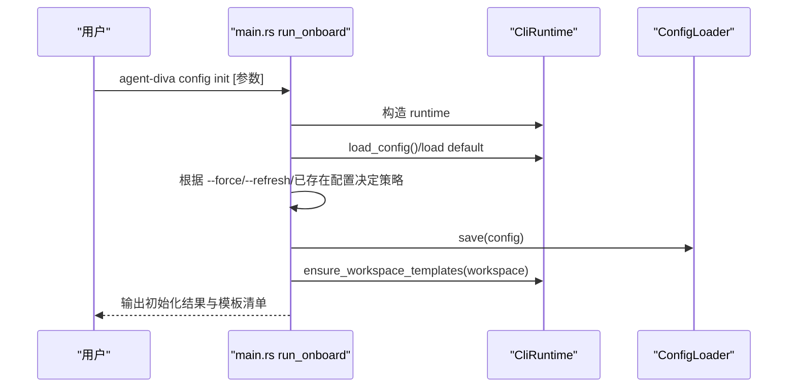
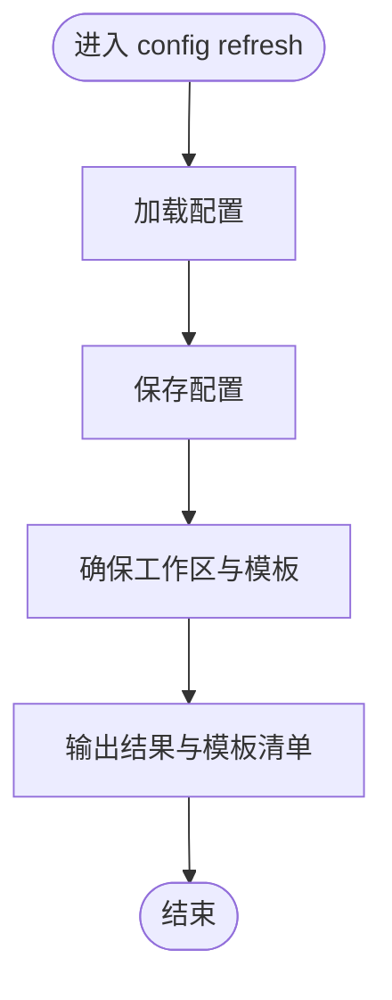
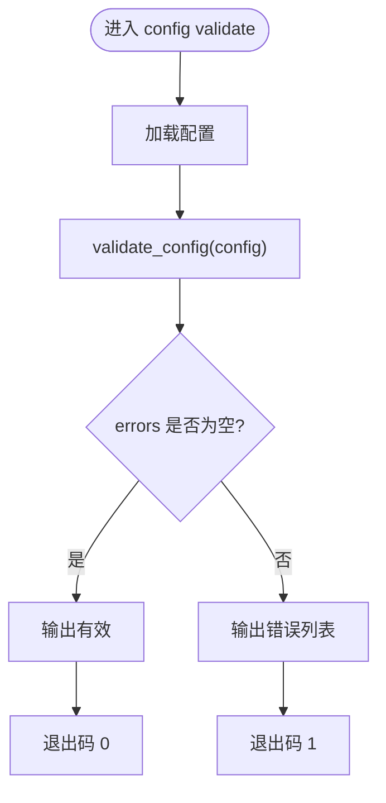
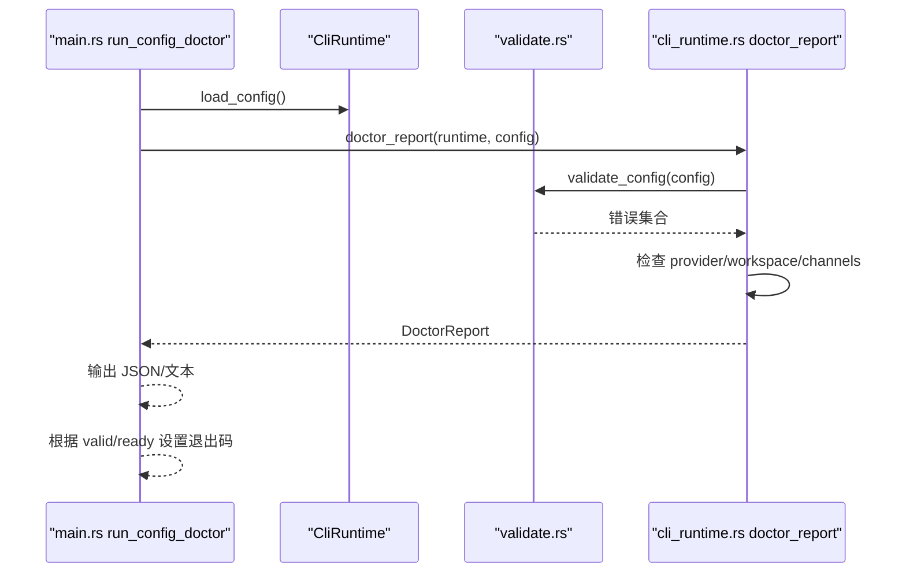
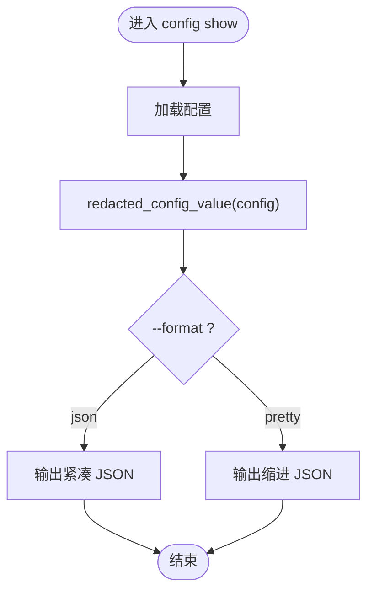
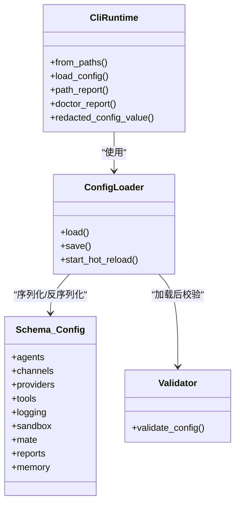

# Config 管理命令

<cite>
**本文引用的文件**
- [agent-diva-cli/src/main.rs](file://agent-diva-cli/src/main.rs)
- [agent-diva-cli/src/cli_runtime.rs](file://agent-diva-cli/src/cli_runtime.rs)
- [agent-diva-core/src/config/mod.rs](file://agent-diva-core/src/config/mod.rs)
- [agent-diva-core/src/config/loader.rs](file://agent-diva-core/src/config/loader.rs)
- [agent-diva-core/src/config/schema.rs](file://agent-diva-core/src/config/schema.rs)
- [agent-diva-core/src/config/validate.rs](file://agent-diva-core/src/config/validate.rs)
- [agent-diva-cli/tests/config_commands.rs](file://agent-diva-cli/tests/config_commands.rs)
</cite>

## 目录
1. [简介](#简介)
2. [项目结构](#项目结构)
3. [核心组件](#核心组件)
4. [架构总览](#架构总览)
5. [详细组件分析](#详细组件分析)
6. [依赖关系分析](#依赖关系分析)
7. [性能与行为特性](#性能与行为特性)
8. [故障排查指南](#故障排查指南)
9. [结论](#结论)
10. [附录：配置结构与高级用法](#附录：配置结构与高级用法)

## 简介
本文件面向 Agent Diva 的 Config 管理命令，系统化说明以下子命令的功能、参数与使用方式：
- config path：查看解析后的配置文件路径与工作区等运行时路径
- config init：非交互式初始化配置（基于 onboard 语义）
- config refresh：刷新配置并补齐工作区模板，不覆盖用户已有值
- config validate：校验配置的结构与语义规则
- config doctor：在 validate 基础上进行运行态就绪检查
- config show：输出当前生效配置（敏感信息自动脱敏），支持 pretty/json 格式

同时涵盖配置文件结构、环境变量覆盖、工作区设置、配置迁移与备份恢复、常见运维排障等。

## 项目结构
Config 管理命令由 CLI 层与 Core 配置层协作完成：
- CLI 层负责命令解析、路由、输出格式化、与 CliRuntime 交互
- Core 层提供配置加载、合并、别名处理、热重载、校验与数据结构定义

图表来源
- [agent-diva-cli/src/main.rs:421-439](file://agent-diva-cli/src/main.rs#L421-L439)
- [agent-diva-cli/src/cli_runtime.rs:14-30](file://agent-diva-cli/src/cli_runtime.rs#L14-L30)
- [agent-diva-core/src/config/loader.rs:12-32](file://agent-diva-core/src/config/loader.rs#L12-L32)
- [agent-diva-core/src/config/schema.rs:278-309](file://agent-diva-core/src/config/schema.rs#L278-L309)
- [agent-diva-core/src/config/validate.rs:5-100](file://agent-diva-core/src/config/validate.rs#L5-L100)

章节来源
- [agent-diva-cli/src/main.rs:421-439](file://agent-diva-cli/src/main.rs#L421-L439)
- [agent-diva-cli/src/cli_runtime.rs:14-30](file://agent-diva-cli/src/cli_runtime.rs#L14-L30)
- [agent-diva-core/src/config/mod.rs:1-11](file://agent-diva-core/src/config/mod.rs#L1-L11)

## 核心组件
- 命令入口与路由：main.rs 中定义 ConfigCommands 枚举及 Path/Init/Refresh/Validate/Doctor/Show 分支，并在主流程中分发到对应执行函数
- 运行时封装：cli_runtime.rs 提供 CliRuntime，统一获取配置路径、工作区、报告生成、敏感字段脱敏等能力
- 配置加载器：loader.rs 实现从默认目录或指定路径加载 config.json，合并环境变量与别名，支持热重载与差异计算
- 配置模式：schema.rs 定义 Config 及其子结构（agents/channels/providers/tools/logging/sandbox/mate/reports/self_evolution/memory 等）
- 校验器：validate.rs 对必填项、取值范围、MCP Server 传输、搜索 provider 白名单等进行约束

章节来源
- [agent-diva-cli/src/main.rs:421-439](file://agent-diva-cli/src/main.rs#L421-L439)
- [agent-diva-cli/src/cli_runtime.rs:14-30](file://agent-diva-cli/src/cli_runtime.rs#L14-L30)
- [agent-diva-core/src/config/loader.rs:12-32](file://agent-diva-core/src/config/loader.rs#L12-L32)
- [agent-diva-core/src/config/schema.rs:278-309](file://agent-diva-core/src/config/schema.rs#L278-L309)
- [agent-diva-core/src/config/validate.rs:5-100](file://agent-diva-core/src/config/validate.rs#L5-L100)

## 架构总览
Config 命令的整体调用链如下：

图表来源
- [agent-diva-cli/src/main.rs:459-467](file://agent-diva-cli/src/main.rs#L459-L467)
- [agent-diva-cli/src/main.rs:689-695](file://agent-diva-cli/src/main.rs#L689-L695)
- [agent-diva-cli/src/cli_runtime.rs:153-155](file://agent-diva-cli/src/cli_runtime.rs#L153-L155)
- [agent-diva-core/src/config/loader.rs:57-73](file://agent-diva-core/src/config/loader.rs#L57-L73)
- [agent-diva-core/src/config/validate.rs:5-100](file://agent-diva-core/src/config/validate.rs#L5-L100)

## 详细组件分析

### 命令总览与参数
- config path [--json]：打印解析后的配置与运行时路径（配置文件、配置目录、运行时目录、工作区、定时任务存储、桥接目录、WhatsApp 认证与媒体目录）。支持 JSON 结构化输出。
- config init：基于 onboard 语义初始化配置，支持 --provider、--model、--api-key、--api-base、--workspace、--force、--refresh 等参数；当已存在配置时，可选择刷新或覆盖。
- config refresh：保存当前配置并同步工作区模板，不会覆盖用户已有值；输出新增模板清单。
- config validate [--json]：校验配置结构与语义规则，JSON 模式下返回 valid/errors 对象；非 JSON 模式输出人类可读提示，失败时退出码为 1。
- config doctor [--json]：在 validate 基础上检查运行态就绪情况（如 provider 是否可识别、通道是否缺少凭据、工作区是否存在等），返回 valid/ready/errors/warnings/provider/channels；失败时按严重性返回不同退出码。
- config show [--format json|pretty]：输出当前生效配置，敏感字段（包含 api_key/token/secret/password 等关键字段）会被替换为脱敏标记。

章节来源
- [agent-diva-cli/src/main.rs:421-439](file://agent-diva-cli/src/main.rs#L421-L439)
- [agent-diva-cli/src/main.rs:689-695](file://agent-diva-cli/src/main.rs#L689-L695)
- [agent-diva-cli/src/main.rs:1705-1817](file://agent-diva-cli/src/main.rs#L1705-L1817)
- [agent-diva-cli/tests/config_commands.rs:65-109](file://agent-diva-cli/tests/config_commands.rs#L65-L109)

### config path
- 功能：展示当前实例的配置文件路径、配置目录、运行时目录、工作区、cron 存储、bridge 目录、WhatsApp 认证与媒体目录
- 数据来源：CliRuntime::path_report 聚合各路径
- 输出：人类可读文本或 JSON

图表来源
- [agent-diva-cli/src/main.rs:1705-1723](file://agent-diva-cli/src/main.rs#L1705-L1723)
- [agent-diva-cli/src/cli_runtime.rs:215-226](file://agent-diva-cli/src/cli_runtime.rs#L215-L226)

章节来源
- [agent-diva-cli/src/main.rs:1705-1723](file://agent-diva-cli/src/main.rs#L1705-L1723)
- [agent-diva-cli/src/cli_runtime.rs:215-226](file://agent-diva-cli/src/cli_runtime.rs#L215-L226)

### config init
- 功能：以非交互方式初始化配置（onboard 语义），支持覆盖默认值或增量刷新
- 关键行为：
  - 若 --force：以默认配置为起点再应用用户输入
  - 若已存在配置且未指定 provider/model：提供交互选择（刷新/覆盖/退出）
  - 若 --refresh：保留现有值并填充缺失默认值
  - 最终写入配置并创建/同步工作区模板
- 典型参数：--provider、--model、--api-key、--api-base、--workspace、--force、--refresh

图表来源
- [agent-diva-cli/src/main.rs:775-800](file://agent-diva-cli/src/main.rs#L775-L800)
- [agent-diva-cli/src/main.rs:689-695](file://agent-diva-cli/src/main.rs#L689-L695)
- [agent-diva-cli/src/cli_runtime.rs:429-433](file://agent-diva-cli/src/cli_runtime.rs#L429-L433)

章节来源
- [agent-diva-cli/src/main.rs:775-800](file://agent-diva-cli/src/main.rs#L775-L800)
- [agent-diva-cli/src/cli_runtime.rs:429-433](file://agent-diva-cli/src/cli_runtime.rs#L429-L433)

### config refresh
- 功能：保存当前配置并同步工作区模板，不覆盖用户已有值
- 行为：
  - 保存配置到磁盘
  - 确保工作区存在并同步模板
  - 输出新增模板清单

图表来源
- [agent-diva-cli/src/main.rs:1725-1740](file://agent-diva-cli/src/main.rs#L1725-L1740)
- [agent-diva-cli/src/cli_runtime.rs:429-433](file://agent-diva-cli/src/cli_runtime.rs#L429-L433)

章节来源
- [agent-diva-cli/src/main.rs:1725-1740](file://agent-diva-cli/src/main.rs#L1725-L1740)

### config validate
- 功能：校验配置结构与语义规则
- 行为：
  - 加载配置后调用 validate_config
  - JSON 模式返回 {valid, errors}
  - 文本模式输出“有效/无效”与错误列表
  - 失败时退出码为 1

图表来源
- [agent-diva-cli/src/main.rs:1742-1771](file://agent-diva-cli/src/main.rs#L1742-L1771)
- [agent-diva-core/src/config/validate.rs:5-100](file://agent-diva-core/src/config/validate.rs#L5-L100)

章节来源
- [agent-diva-cli/src/main.rs:1742-1771](file://agent-diva-cli/src/main.rs#L1742-L1771)
- [agent-diva-core/src/config/validate.rs:5-100](file://agent-diva-core/src/config/validate.rs#L5-L100)

### config doctor
- 功能：在 validate 基础上检查运行态就绪情况
- 行为：
  - 校验配置（errors）
  - 检查当前 provider 是否可识别、是否缺少 api_key/api_base
  - 检查工作区是否存在
  - 检查各通道 enabled 但缺少必要字段的情况
  - 返回 valid/ready/errors/warnings/provider/channels
  - 退出码：valid=false -> 1；ready=false -> 2；否则 0

图表来源
- [agent-diva-cli/src/main.rs:1773-1807](file://agent-diva-cli/src/main.rs#L1773-L1807)
- [agent-diva-cli/src/cli_runtime.rs:727-791](file://agent-diva-cli/src/cli_runtime.rs#L727-L791)

章节来源
- [agent-diva-cli/src/main.rs:1773-1807](file://agent-diva-cli/src/main.rs#L1773-L1807)
- [agent-diva-cli/src/cli_runtime.rs:727-791](file://agent-diva-cli/src/cli_runtime.rs#L727-L791)

### config show
- 功能：输出当前生效配置，敏感字段自动脱敏
- 行为：
  - 加载配置
  - 将配置序列化为 Value，并对敏感字段递归替换为脱敏标记
  - 支持 pretty/json 两种输出格式

图表来源
- [agent-diva-cli/src/main.rs:1809-1817](file://agent-diva-cli/src/main.rs#L1809-L1817)
- [agent-diva-cli/src/cli_runtime.rs:435-467](file://agent-diva-cli/src/cli_runtime.rs#L435-L467)

章节来源
- [agent-diva-cli/src/main.rs:1809-1817](file://agent-diva-cli/src/main.rs#L1809-L1817)
- [agent-diva-cli/src/cli_runtime.rs:435-467](file://agent-diva-cli/src/cli_runtime.rs#L435-L467)

## 依赖关系分析
- CLI 层依赖 Core 的配置加载与校验模块
- 配置加载器依赖 schema 定义的数据结构，并在加载过程中应用别名与环境变量覆盖
- 校验器依赖 schema 中的字段类型与取值范围
- 测试用例验证了 config show 的脱敏行为与 config doctor 的退出码行为

图表来源
- [agent-diva-cli/src/cli_runtime.rs:14-30](file://agent-diva-cli/src/cli_runtime.rs#L14-L30)
- [agent-diva-core/src/config/loader.rs:12-32](file://agent-diva-core/src/config/loader.rs#L12-L32)
- [agent-diva-core/src/config/schema.rs:278-309](file://agent-diva-core/src/config/schema.rs#L278-L309)
- [agent-diva-core/src/config/validate.rs:5-100](file://agent-diva-core/src/config/validate.rs#L5-L100)

章节来源
- [agent-diva-cli/src/cli_runtime.rs:14-30](file://agent-diva-cli/src/cli_runtime.rs#L14-L30)
- [agent-diva-core/src/config/loader.rs:12-32](file://agent-diva-core/src/config/loader.rs#L12-L32)
- [agent-diva-core/src/config/schema.rs:278-309](file://agent-diva-core/src/config/schema.rs#L278-L309)
- [agent-diva-core/src/config/validate.rs:5-100](file://agent-diva-core/src/config/validate.rs#L5-L100)

## 性能与行为特性
- 配置热重载：ConfigLoader 支持后台轮询配置文件 mtime，检测变化后进行 diff 并回调，区分 hot_reload 与 restart_required 两类变更
- 环境变量优先级：AGENT_DIVA__ 前缀的环境变量会按路径映射覆盖配置值，且优先级高于文件与别名覆盖
- 别名合并：支持 channels.neuro-link/generic_pipe、tools.mcpServers/mcp_servers、legacy pet->mate 等键名归一化
- 敏感字段脱敏：config show 会递归扫描并替换包含 api_key/token/secret/password 等关键字段的字符串值为脱敏标记

章节来源
- [agent-diva-core/src/config/loader.rs:94-166](file://agent-diva-core/src/config/loader.rs#L94-L166)
- [agent-diva-core/src/config/loader.rs:371-463](file://agent-diva-core/src/config/loader.rs#L371-L463)
- [agent-diva-cli/src/cli_runtime.rs:435-467](file://agent-diva-cli/src/cli_runtime.rs#L435-L467)

## 故障排查指南
- 配置无效
  - 使用 config validate 检查结构错误与语义约束
  - 关注 agents.defaults.workspace、max_tokens、temperature、max_tool_iterations、reasoning_effort、tools.web.search.provider/max_results、mate.* 等字段的合法范围
- Provider 未就绪
  - 使用 config doctor 检查当前 provider 是否可识别、是否缺少 api_key 或 api_base
  - 对于 custom provider，需显式设置 api_base
- 通道未就绪
  - 若通道 enabled 但缺少 token/app_id/client_secret 等字段，doctor 会给出警告
- 工作区不存在
  - doctor 会提示工作区尚未创建；可通过 config refresh 或 config init 创建并同步模板
- 环境变量覆盖异常
  - 确认 AGENT_DIVA__ 前缀与下划线分隔的路径是否正确
  - 注意别名键（如 OPENAI_API_KEY）会被映射到 providers.openai.api_key，但 AGENT_DIVA__ 路径覆盖优先级更高

章节来源
- [agent-diva-core/src/config/validate.rs:5-100](file://agent-diva-core/src/config/validate.rs#L5-L100)
- [agent-diva-cli/src/cli_runtime.rs:727-791](file://agent-diva-cli/src/cli_runtime.rs#L727-L791)
- [agent-diva-core/src/config/loader.rs:371-463](file://agent-diva-core/src/config/loader.rs#L371-L463)

## 结论
Config 管理命令提供了完整的配置生命周期管理能力：从路径查看、初始化、刷新、校验到诊断与显示。配合 Core 层的配置加载器、模式定义与校验器，系统实现了灵活的环境变量覆盖、别名兼容、热重载与敏感信息保护。通过 CLI 与 Core 的清晰分层，用户可以在多种场景下安全、可靠地管理配置。

## 附录：配置结构与高级用法

### 配置文件位置与解析
- 默认配置目录：用户家目录下的 .agent-diva
- 配置文件：config.json
- 可通过 --config 指定单个配置文件路径，或通过 --config-dir 指定配置目录
- 工作区可通过 --workspace 临时覆盖，不影响持久化配置

章节来源
- [agent-diva-core/src/config/loader.rs:21-32](file://agent-diva-core/src/config/loader.rs#L21-L32)
- [agent-diva-cli/src/main.rs:67-86](file://agent-diva-cli/src/main.rs#L67-L86)

### 环境变量覆盖
- 别名覆盖：ANTHROPIC_API_KEY、OPENAI_API_KEY、OPENROUTER_API_KEY、DEEPSEEK_API_KEY、GROQ_API_KEY、GEMINI_API_KEY、DASHSCOPE_API_KEY、MOONSHOT_API_KEY、MINIMAX_API_KEY、HOSTED_VLLM_API_KEY、AIHUBMIX_API_KEY、ZAI_API_KEY、ZHIPUAI_API_KEY 等将被映射到对应 providers.*.api_key
- 路径覆盖：AGENT_DIVA__AGENTS__DEFAULTS__MODEL 等形式可按点路径覆盖任意配置字段
- 优先级：路径覆盖 > 别名覆盖 > 文件配置

章节来源
- [agent-diva-core/src/config/loader.rs:371-463](file://agent-diva-core/src/config/loader.rs#L371-L463)

### 工作区设置与模板
- 工作区默认路径：~/.agent-diva/workspace
- 可通过 agents.defaults.workspace 或 --workspace 指定
- config refresh 会确保工作区存在并同步内置模板（skills 等）

章节来源
- [agent-diva-core/src/config/schema.rs:568-603](file://agent-diva-core/src/config/schema.rs#L568-L603)
- [agent-diva-cli/src/cli_runtime.rs:429-433](file://agent-diva-cli/src/cli_runtime.rs#L429-L433)

### 配置迁移与兼容性
- 键名别名：channels.neuro-link/generic_pipe、tools.mcpServers/mcp_servers、legacy pet->mate
- 迁移策略：加载时将别名合并到规范键，持久化时使用规范键

章节来源
- [agent-diva-core/src/config/loader.rs:429-463](file://agent-diva-core/src/config/loader.rs#L429-L463)

### 备份与恢复
- 备份：直接复制 config.json 与相关数据目录（data/cron/jobs.json、bridge、whatsapp-auth、whatsapp-media）
- 恢复：将备份文件放回目标配置目录，必要时执行 config refresh 以同步工作区模板

章节来源
- [agent-diva-cli/src/cli_runtime.rs:196-213](file://agent-diva-cli/src/cli_runtime.rs#L196-L213)

### 常用运维操作建议
- 新环境初始化：config init --provider ... --model ... --api-key ... --workspace ...
- 日常刷新：config refresh
- 发布前检查：config validate && config doctor
- 调试输出：config show --format json（敏感字段已脱敏）

章节来源
- [agent-diva-cli/src/main.rs:689-695](file://agent-diva-cli/src/main.rs#L689-L695)
- [agent-diva-cli/tests/config_commands.rs:65-109](file://agent-diva-cli/tests/config_commands.rs#L65-L109)