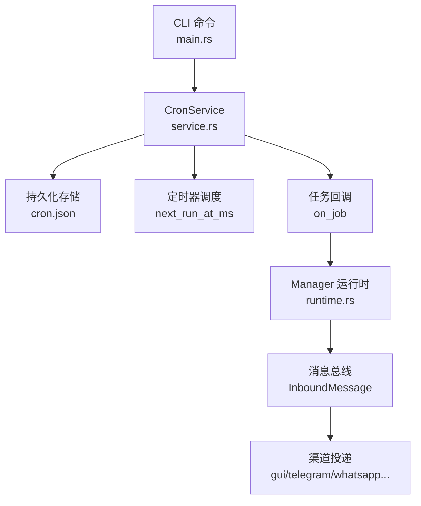
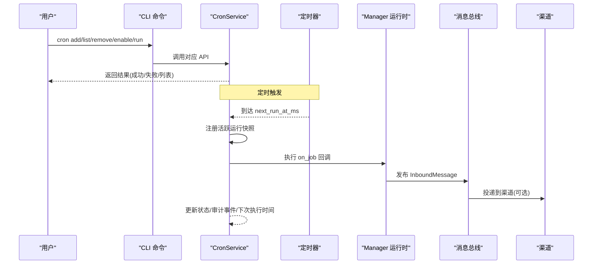
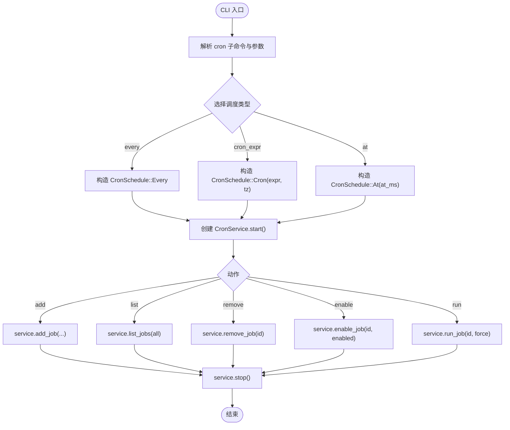
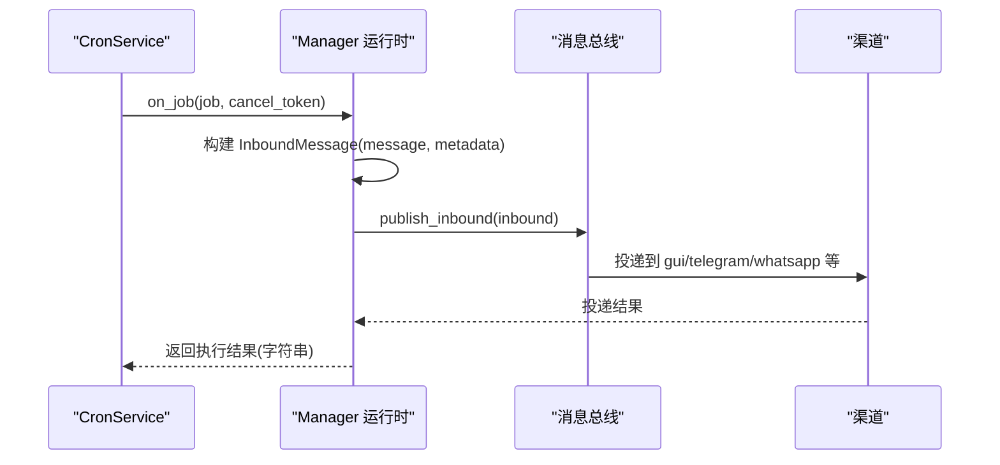
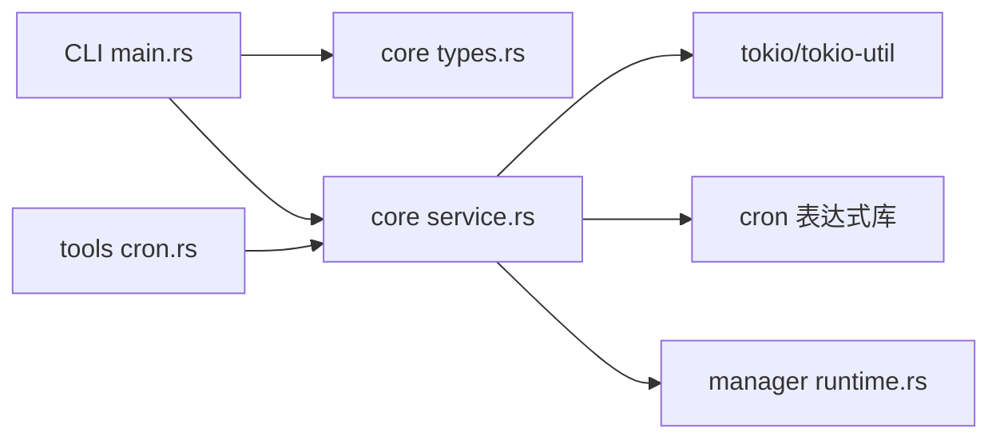

# Cron 定时任务命令

<cite>
**本文引用的文件**
- [agent-diva-cli/src/main.rs](file://agent-diva-cli/src/main.rs)
- [agent-diva-core/src/cron/types.rs](file://agent-diva-core/src/cron/types.rs)
- [agent-diva-core/src/cron/service.rs](file://agent-diva-core/src/cron/service.rs)
- [agent-diva-tools/src/cron.rs](file://agent-diva-tools/src/cron.rs)
- [agent-diva-manager/src/runtime.rs](file://agent-diva-manager/src/runtime.rs)
</cite>

## 目录
1. [简介](#简介)
2. [项目结构](#项目结构)
3. [核心组件](#核心组件)
4. [架构总览](#架构总览)
5. [详细组件分析](#详细组件分析)
6. [依赖关系分析](#依赖关系分析)
7. [性能与调度特性](#性能与调度特性)
8. [故障排除指南](#故障排除指南)
9. [结论](#结论)
10. [附录：命令速查](#附录命令速查)

## 简介
本文件面向使用 agent-diva 的运维与开发者，系统化说明 Cron 定时任务的 CLI 命令与内部实现。覆盖 add、list、remove、enable、run 等子命令的语法与参数；解释调度表达式（cron）、执行间隔（every）、一次性任务（at）的配置方式；提供常见场景示例（定期报告、数据同步、系统维护）；并说明任务日志、失败处理、通知送达、运行监控、调试与排障方法。

## 项目结构
Cron 功能由以下模块协作完成：
- CLI 层：解析命令行参数，调用服务进行增删改查与手动触发。
- 核心服务：负责持久化存储、定时器调度、任务执行回调、状态更新与审计事件。
- 工具层：为 Agent 提供 cron 工具能力（add/list/remove），支持会话上下文与投递。
- 管理器运行时：将任务执行结果通过消息总线投递到指定渠道（如 gui/telegram 等）。



图表来源
- [agent-diva-cli/src/main.rs:704-747](file://agent-diva-cli/src/main.rs#L704-L747)
- [agent-diva-core/src/cron/service.rs:176-274](file://agent-diva-core/src/cron/service.rs#L176-L274)
- [agent-diva-manager/src/runtime.rs:592-623](file://agent-diva-manager/src/runtime.rs#L592-L623)

章节来源
- [agent-diva-cli/src/main.rs:704-747](file://agent-diva-cli/src/main.rs#L704-L747)
- [agent-diva-core/src/cron/service.rs:176-274](file://agent-diva-core/src/cron/service.rs#L176-L274)
- [agent-diva-manager/src/runtime.rs:592-623](file://agent-diva-manager/src/runtime.rs#L592-L623)

## 核心组件
- 调度类型
  - at：一次性任务，指定 ISO 8601 时间戳（毫秒）。
  - every：周期性任务，指定秒数间隔。
  - cron：标准 cron 表达式，可选时区 tz。
- 任务载荷（payload）
  - kind：默认 agent_turn，表示以 Agent 对话形式执行。
  - message：任务执行时的提示词或指令。
  - deliver：是否将结果投递到渠道。
  - channel/to：目标渠道与收件人标识。
- 任务状态
  - next_run_at_ms：下次执行时间。
  - last_run_at_ms：上次执行时间。
  - last_status/last_error：最近一次执行状态与错误信息。
- 生命周期状态（computed_status）
  - Running/Scheduled/Paused/Completed/Failed，根据活跃运行与最近状态计算。

章节来源
- [agent-diva-core/src/cron/types.rs:5-109](file://agent-diva-core/src/cron/types.rs#L5-L109)
- [agent-diva-core/src/cron/types.rs:124-163](file://agent-diva-core/src/cron/types.rs#L124-L163)

## 架构总览
Cron 服务在启动时加载持久化存储，计算所有启用任务的下次执行时间，并设置定时器。当到达触发时间，服务会注册“活跃运行”快照，调用 on_job 回调执行任务，记录审计事件，更新状态并重新计算下次执行时间。CLI 命令通过创建临时服务实例操作同一份存储，实现跨进程的任务管理。



图表来源
- [agent-diva-core/src/cron/service.rs:176-274](file://agent-diva-core/src/cron/service.rs#L176-L274)
- [agent-diva-core/src/cron/service.rs:342-458](file://agent-diva-core/src/cron/service.rs#L342-L458)
- [agent-diva-manager/src/runtime.rs:592-623](file://agent-diva-manager/src/runtime.rs#L592-L623)

## 详细组件分析

### CLI 命令定义与行为
- 子命令
  - add：新增任务，支持 --every/--cron-expr/--at 三选一；可配置 --deliver/--channel/--to。
  - list：列出任务，--all 包含禁用任务。
  - remove：删除任务，传入 job_id。
  - enable：启用/禁用任务，传入 job_id 与 enabled 布尔值。
  - run：手动触发任务，--force 允许对禁用任务执行。
- 关键流程
  - 解析参数后构造 CronSchedule。
  - 初始化 CronService，start -> 调用 add/list/remove/enable/run -> stop。
  - 输出人类可读的结果或结构化输出。



图表来源
- [agent-diva-cli/src/main.rs:323-381](file://agent-diva-cli/src/main.rs#L323-L381)
- [agent-diva-cli/src/main.rs:1950-1998](file://agent-diva-cli/src/main.rs#L1950-L1998)
- [agent-diva-cli/src/main.rs:2001-2078](file://agent-diva-cli/src/main.rs#L2001-L2078)
- [agent-diva-cli/src/main.rs:2081-2150](file://agent-diva-cli/src/main.rs#L2081-L2150)

章节来源
- [agent-diva-cli/src/main.rs:323-381](file://agent-diva-cli/src/main.rs#L323-L381)
- [agent-diva-cli/src/main.rs:704-747](file://agent-diva-cli/src/main.rs#L704-L747)
- [agent-diva-cli/src/main.rs:1950-2150](file://agent-diva-cli/src/main.rs#L1950-L2150)

### 调度与执行引擎
- 调度计算
  - compute_next_run：按 at/every/cron 计算下一次执行时间；cron 表达式支持 5 字段自动补全为 6 字段，并支持可选时区。
  - arm_timer：基于最小 next_run_at_ms 设置定时器唤醒。
- 执行流程
  - execute_job_with_trigger：注册活跃运行、发出审计事件、调用 on_job 回调、记录耗时与结果、更新状态、必要时删除一次性任务、保存存储并重新计时。
- 停止与取消
  - stop：中止定时器任务，取消所有活跃运行的 CancellationToken。
  - stop_run：针对特定 job 发送取消信号。

```mermaid
classDiagram
class CronService {
+start()
+stop()
+add_job(...)
+list_jobs(include_disabled)
+get_job(job_id)
+enable_job(job_id, enabled)
+run_job_now(job_id, force)
+stop_run(job_id)
+status()
-recompute_next_runs(store)
-arm_timer()
-execute_job_with_trigger(job, trigger)
}
class CronJob {
+id
+name
+enabled
+schedule
+payload
+state
+created_at_ms
+updated_at_ms
+delete_after_run
}
class CronSchedule {
<<enum>>
+At{at_ms}
+Every{every_ms}
+Cron{expr,tz}
}
CronService --> CronJob : "管理"
CronJob --> CronSchedule : "包含"
```

图表来源
- [agent-diva-core/src/cron/service.rs:98-117](file://agent-diva-core/src/cron/service.rs#L98-L117)
- [agent-diva-core/src/cron/service.rs:176-274](file://agent-diva-core/src/cron/service.rs#L176-L274)
- [agent-diva-core/src/cron/service.rs:342-458](file://agent-diva-core/src/cron/service.rs#L342-L458)
- [agent-diva-core/src/cron/types.rs:5-109](file://agent-diva-core/src/cron/types.rs#L5-L109)

章节来源
- [agent-diva-core/src/cron/service.rs:176-274](file://agent-diva-core/src/cron/service.rs#L176-L274)
- [agent-diva-core/src/cron/service.rs:342-458](file://agent-diva-core/src/cron/service.rs#L342-L458)
- [agent-diva-core/src/cron/types.rs:5-109](file://agent-diva-core/src/cron/types.rs#L5-L109)

### 通知与投递
- 任务载荷中的 deliver/channel/to 控制是否投递以及投递目标。
- Manager 运行时将任务消息封装为 InboundMessage，附加元数据（cron_job_id、cron_trigger、delivery_channel），通过消息总线发布，最终投递到 GUI 或其他渠道。



图表来源
- [agent-diva-manager/src/runtime.rs:592-623](file://agent-diva-manager/src/runtime.rs#L592-L623)

章节来源
- [agent-diva-manager/src/runtime.rs:592-623](file://agent-diva-manager/src/runtime.rs#L592-L623)

### Agent 工具集成（cron 工具）
- 支持 action: add/list/remove。
- 支持 every_seconds、cron_expr、at、timezone 等参数。
- 限制：不允许在 cron 任务执行上下文中再次创建新任务（防止递归）。
- 安全：remove 会校验当前会话上下文（channel/chat_id），避免误删其他会话的任务。

章节来源
- [agent-diva-tools/src/cron.rs:34-151](file://agent-diva-tools/src/cron.rs#L34-L151)
- [agent-diva-tools/src/cron.rs:154-248](file://agent-diva-tools/src/cron.rs#L154-L248)

## 依赖关系分析
- CLI 依赖 core 的 CronService 与 types，用于创建/查询/修改任务。
- CronService 依赖 tokio 异步原语与 cron 表达式库，负责持久化与调度。
- Manager 运行时作为 on_job 回调的实现者，负责将任务转为消息并投递。
- Tools 层暴露给 Agent 的工具接口，便于在对话中创建与管理任务。



图表来源
- [agent-diva-cli/src/main.rs:704-747](file://agent-diva-cli/src/main.rs#L704-L747)
- [agent-diva-core/src/cron/service.rs:1-16](file://agent-diva-core/src/cron/service.rs#L1-L16)
- [agent-diva-tools/src/cron.rs:1-15](file://agent-diva-tools/src/cron.rs#L1-L15)
- [agent-diva-manager/src/runtime.rs:592-623](file://agent-diva-manager/src/runtime.rs#L592-L623)

章节来源
- [agent-diva-cli/src/main.rs:704-747](file://agent-diva-cli/src/main.rs#L704-L747)
- [agent-diva-core/src/cron/service.rs:1-16](file://agent-diva-core/src/cron/service.rs#L1-L16)
- [agent-diva-tools/src/cron.rs:1-15](file://agent-diva-tools/src/cron.rs#L1-L15)
- [agent-diva-manager/src/runtime.rs:592-623](file://agent-diva-manager/src/runtime.rs#L592-L623)

## 性能与调度特性
- 定时器精度：基于毫秒级延迟，按最小 next_run_at_ms 唤醒。
- 并发控制：同一 job 不会重复执行（活跃运行检查）。
- 资源释放：stop 会中止定时器并取消所有活跃运行。
- 存储效率：每次执行后保存 store，确保重启后可恢复调度。
- 表达式归一化：5 字段 cron 自动补全为 6 字段，减少配置错误。

[本节为通用性能讨论，不直接分析具体代码行]

## 故障排除指南
- 常见问题
  - 未找到任务：确认 job_id 正确且未被删除；list --all 查看禁用任务。
  - 无法执行：run 时若任务禁用需加 --force；否则仅允许启用任务。
  - 调度不生效：检查 schedule 是否正确（at/every/cron），cron 表达式是否合法与时区是否匹配。
  - 无通知送达：确认 payload.deliver 为真，且 channel/to 配置正确；Manager 运行时需能发布消息总线。
- 日志与审计
  - 任务开始/完成/失败均会发出审计事件，可通过系统日志查看。
  - 任务状态包含 last_status/last_error，便于定位失败原因。
- 调试步骤
  - 使用 list 查看 next_run_at_ms 与 computed_status。
  - 使用 run --force 手动触发，观察输出与错误。
  - 检查 cron.json 存储文件内容，确认任务结构与状态。
  - 在 Manager 运行时侧检查消息总线发布是否成功。

章节来源
- [agent-diva-core/src/cron/service.rs:342-458](file://agent-diva-core/src/cron/service.rs#L342-L458)
- [agent-diva-core/src/cron/service.rs:721-732](file://agent-diva-core/src/cron/service.rs#L721-L732)
- [agent-diva-cli/src/main.rs:2001-2078](file://agent-diva-cli/src/main.rs#L2001-L2078)

## 结论
Cron 定时任务提供了灵活的调度能力，支持一次性、周期性与复杂 cron 表达式；具备完善的任务生命周期管理与审计追踪；通过 Manager 运行时可将结果投递至多种渠道。CLI 命令简洁易用，适合日常运维与自动化场景。建议在生产环境中合理配置时区、投递渠道与任务名称，结合日志与状态监控保障稳定性。

[本节为总结性内容，不直接分析具体代码行]

## 附录：命令速查
- 添加任务
  - 周期性：cron add --name "每日报告" --message "生成日报" --every 86400
  - Cron 表达式：cron add --name "早间巡检" --message "检查服务健康" --cron-expr "0 9 * * *" --timezone "Asia/Shanghai"
  - 一次性：cron add --name "今晚备份" --message "执行备份脚本" --at "2024-12-31T23:00:00Z"
  - 投递通知：--deliver --channel "telegram" --to "user-id"
- 列出任务
  - 仅启用：cron list
  - 包含禁用：cron list --all
- 删除任务
  - cron remove --job-id "<id>"
- 启用/禁用
  - 启用：cron enable --job-id "<id>" --enabled true
  - 禁用：cron enable --job-id "<id>" --enabled false
- 手动执行
  - 仅启用任务：cron run --job-id "<id>"
  - 强制执行（含禁用）：cron run --job-id "<id>" --force

章节来源
- [agent-diva-cli/src/main.rs:323-381](file://agent-diva-cli/src/main.rs#L323-L381)
- [agent-diva-cli/src/main.rs:1950-2150](file://agent-diva-cli/src/main.rs#L1950-L2150)