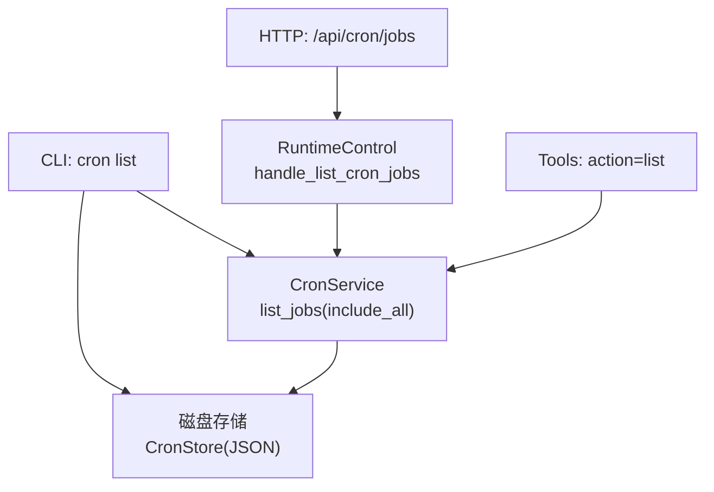
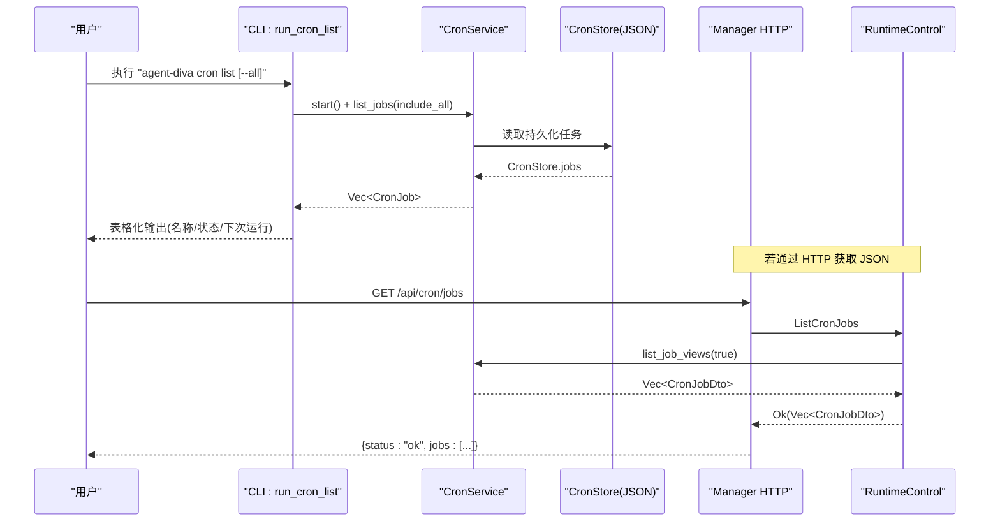
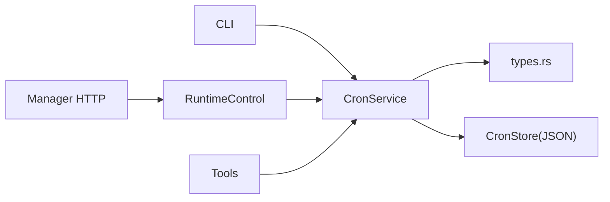

# 列出定时任务 (cron list)

<cite>
**本文引用的文件**
- [agent-diva-cli/src/main.rs](file://agent-diva-cli/src/main.rs)
- [agent-diva-core/src/cron/service.rs](file://agent-diva-core/src/cron/service.rs)
- [agent-diva-core/src/cron/types.rs](file://agent-diva-core/src/cron/types.rs)
- [agent-diva-manager/src/handlers.rs](file://agent-diva-manager/src/handlers.rs)
- [agent-diva-manager/src/manager/runtime_control.rs](file://agent-diva-manager/src/manager/runtime_control.rs)
- [agent-diva-tools/src/cron.rs](file://agent-diva-tools/src/cron.rs)
</cite>

## 目录
1. [简介](#简介)
2. [项目结构](#项目结构)
3. [核心组件](#核心组件)
4. [架构总览](#架构总览)
5. [详细组件分析](#详细组件分析)
6. [依赖关系分析](#依赖关系分析)
7. [性能考虑](#性能考虑)
8. [故障排查指南](#故障排查指南)
9. [结论](#结论)
10. [附录](#附录)

## 简介
本章节面向“列出定时任务”（cron list）命令，说明如何查看系统中所有已配置的定时任务，包括启用状态、下次执行时间、执行历史等。重点解释 all 参数的作用：用于显示包括已禁用任务在内的所有任务；并提供输出格式说明与常见查询场景，以及任务状态解读与故障排查指导。

## 项目结构
cron list 功能由 CLI 层触发，调用核心 CronService 读取持久化存储并返回任务列表；Manager 层提供 HTTP API 以 JSON 形式暴露相同能力；工具层也提供了基于工具的列表能力。整体链路如下：
- CLI: 解析参数 -> 启动 CronService -> 调用 list_jobs(include_all) -> 格式化输出
- Manager: HTTP 处理器 -> 内部命令 -> CronService.list_job_views(true) -> 返回 JSON
- Tools: 通过工具 action=list 调用 CronService.list_jobs(include_disabled)

图表来源
- [agent-diva-cli/src/main.rs:2000-2078](file://agent-diva-cli/src/main.rs#L2000-L2078)
- [agent-diva-core/src/cron/service.rs:460-481](file://agent-diva-core/src/cron/service.rs#L460-L481)
- [agent-diva-manager/src/handlers.rs:1034-1044](file://agent-diva-manager/src/handlers.rs#L1034-L1044)
- [agent-diva-manager/src/manager/runtime_control.rs:133-139](file://agent-diva-manager/src/manager/runtime_control.rs#L133-L139)
- [agent-diva-tools/src/cron.rs:99-130](file://agent-diva-tools/src/cron.rs#L99-L130)

章节来源
- [agent-diva-cli/src/main.rs:704-748](file://agent-diva-cli/src/main.rs#L704-L748)
- [agent-diva-cli/src/main.rs:2000-2078](file://agent-diva-cli/src/main.rs#L2000-L2078)
- [agent-diva-core/src/cron/service.rs:460-481](file://agent-diva-core/src/cron/service.rs#L460-L481)
- [agent-diva-manager/src/handlers.rs:1034-1044](file://agent-diva-manager/src/handlers.rs#L1034-L1044)
- [agent-diva-manager/src/manager/runtime_control.rs:133-139](file://agent-diva-manager/src/manager/runtime_control.rs#L133-L139)
- [agent-diva-tools/src/cron.rs:99-130](file://agent-diva-tools/src/cron.rs#L99-L130)

## 核心组件
- CLI 命令入口与输出：负责解析 --all 参数、初始化服务、调用 list_jobs 并以人类可读的表格形式打印任务信息（名称、ID、调度策略、状态、下次运行时间）。
- CronService：核心调度服务，负责加载/保存 CronStore、计算下次运行时间、过滤/排序任务、生成视图 DTO（包含是否运行中、活跃运行快照、计算状态）。
- Manager HTTP API：对外提供 GET /api/cron/jobs，返回 JSON 格式的 CronJobDto 列表（包含 isRunning、activeRun、computedStatus 等）。
- Tools：通过 action=list 调用 CronService.list_jobs(include_disabled)，用于工具链集成。

章节来源
- [agent-diva-cli/src/main.rs:2000-2078](file://agent-diva-cli/src/main.rs#L2000-L2078)
- [agent-diva-core/src/cron/service.rs:460-481](file://agent-diva-core/src/cron/service.rs#L460-L481)
- [agent-diva-manager/src/handlers.rs:1034-1044](file://agent-diva-manager/src/handlers.rs#L1034-L1044)
- [agent-diva-tools/src/cron.rs:99-130](file://agent-diva-tools/src/cron.rs#L99-L130)

## 架构总览
下图展示了 cron list 在 CLI、Core、Manager、Tools 之间的交互关系与数据流向。

图表来源
- [agent-diva-cli/src/main.rs:2000-2078](file://agent-diva-cli/src/main.rs#L2000-L2078)
- [agent-diva-core/src/cron/service.rs:460-481](file://agent-diva-core/src/cron/service.rs#L460-L481)
- [agent-diva-manager/src/handlers.rs:1034-1044](file://agent-diva-manager/src/handlers.rs#L1034-L1044)
- [agent-diva-manager/src/manager/runtime_control.rs:133-139](file://agent-diva-manager/src/manager/runtime_control.rs#L133-L139)

## 详细组件分析

### CLI 命令：run_cron_list
- 行为
  - 检查存储是否存在，不存在则提示无任务。
  - 启动 CronService，调用 list_jobs(include_all)。
  - 对每个任务格式化输出：名称+ID、调度策略（every/cron/at）、状态（enabled/disabled）、下次运行时间。
- all 参数
  - include_all=true：显示所有任务（含已禁用）。
  - include_all=false：仅显示 enabled=true 的任务。
- 输出
  - 默认表格视图（人类可读），未实现 JSON 输出开关。

章节来源
- [agent-diva-cli/src/main.rs:2000-2078](file://agent-diva-cli/src/main.rs#L2000-L2078)

### CronService：list_jobs 与 list_job_views
- list_jobs(include_disabled)
  - 从 CronStore 加载任务，按 include_disabled 决定是否过滤 disabled 任务。
  - 按 next_run_at_ms 升序排序（None 视为最大，排在最后）。
- list_job_views(include_disabled)
  - 在 list_jobs 基础上，为每个任务附加运行时信息：is_running、active_run、computed_status。
  - 供 Manager HTTP 接口使用，便于前端展示“运行中/计划/暂停/完成/失败”等状态。

章节来源
- [agent-diva-core/src/cron/service.rs:460-481](file://agent-diva-core/src/cron/service.rs#L460-L481)

### Manager HTTP：GET /api/cron/jobs
- 处理器将请求转为内部命令 ListCronJobs，交由 RuntimeControl 处理。
- RuntimeControl 调用 CronService.list_job_views(true)，返回完整视图（包含运行态）。
- 响应体为 JSON：{ status: "ok", jobs: [...] }。

章节来源
- [agent-diva-manager/src/handlers.rs:1034-1044](file://agent-diva-manager/src/handlers.rs#L1034-L1044)
- [agent-diva-manager/src/manager/runtime_control.rs:133-139](file://agent-diva-manager/src/manager/runtime_control.rs#L133-L139)

### Tools：action=list
- 通过工具 action=list 调用 CronService.list_jobs(include_disabled)。
- 支持 include_disabled=true 时返回所有任务（含禁用），否则仅启用任务。

章节来源
- [agent-diva-tools/src/cron.rs:99-130](file://agent-diva-tools/src/cron.rs#L99-L130)

### 数据模型：CronJob、CronJobState、CronSchedule、CronJobDto
- CronSchedule：支持 at/every/cron 三种调度方式。
- CronJobState：记录 next_run_at_ms、last_run_at_ms、last_status、last_error。
- CronJobDto：聚合 CronJob 与运行时信息（is_running、active_run、computed_status）。

章节来源
- [agent-diva-core/src/cron/types.rs:1-262](file://agent-diva-core/src/cron/types.rs#L1-L262)

## 依赖关系分析
- CLI 依赖 CronService 的 list_jobs，读取 CronStore(JSON) 进行展示。
- Manager 依赖 RuntimeControl 桥接到 CronService 的 list_job_views，返回结构化 JSON。
- Tools 直接依赖 CronService 的 list_jobs，用于工具链集成。
- 类型定义集中在 types.rs，被 CLI、Manager、Tools 共同消费。

图表来源
- [agent-diva-cli/src/main.rs:2000-2078](file://agent-diva-cli/src/main.rs#L2000-L2078)
- [agent-diva-core/src/cron/service.rs:460-481](file://agent-diva-core/src/cron/service.rs#L460-L481)
- [agent-diva-manager/src/handlers.rs:1034-1044](file://agent-diva-manager/src/handlers.rs#L1034-L1044)
- [agent-diva-manager/src/manager/runtime_control.rs:133-139](file://agent-diva-manager/src/manager/runtime_control.rs#L133-L139)
- [agent-diva-core/src/cron/types.rs:1-262](file://agent-diva-core/src/cron/types.rs#L1-L262)

章节来源
- [agent-diva-core/src/cron/types.rs:1-262](file://agent-diva-core/src/cron/types.rs#L1-L262)
- [agent-diva-core/src/cron/service.rs:460-481](file://agent-diva-core/src/cron/service.rs#L460-L481)
- [agent-diva-manager/src/handlers.rs:1034-1044](file://agent-diva-manager/src/handlers.rs#L1034-L1044)
- [agent-diva-manager/src/manager/runtime_control.rs:133-139](file://agent-diva-manager/src/manager/runtime_control.rs#L133-L139)

## 性能考虑
- 列表操作为 O(n) 扫描与排序（n 为任务数），通常规模较小，开销可忽略。
- 每次列表会加载并可能重算 next_run_at_ms（start 时已预计算），避免重复计算。
- 建议批量管理任务时合并更新，减少频繁写入 CronStore。

[本节为通用性能讨论，不直接分析具体文件]

## 故障排查指南
- 无任务
  - CLI：当存储不存在或任务为空时，输出“无定时任务”。
  - 排查：确认 CronStore 路径存在且包含有效 JSON。
- 任务未执行
  - 检查 enabled 是否为 true；disabled 的任务不会安排下一次运行。
  - 检查 next_run_at_ms 是否为空（at 类型需在未来时间）。
  - 检查 last_status/last_error 以定位最近一次执行结果。
- 无法通过 HTTP 获取列表
  - 确认 Manager 进程运行正常，/api/cron/jobs 返回 {status:"ok", jobs:...}。
  - 若返回错误，检查内部命令通道与 CronService 状态。
- 工具列表异常
  - 确认 action=list 的参数 include_disabled 是否符合预期。
  - 检查工具上下文与权限限制（如会话上下文约束）。

章节来源
- [agent-diva-cli/src/main.rs:2000-2078](file://agent-diva-cli/src/main.rs#L2000-L2078)
- [agent-diva-core/src/cron/service.rs:460-481](file://agent-diva-core/src/cron/service.rs#L460-L481)
- [agent-diva-manager/src/handlers.rs:1034-1044](file://agent-diva-manager/src/handlers.rs#L1034-L1044)
- [agent-diva-tools/src/cron.rs:99-130](file://agent-diva-tools/src/cron.rs#L99-L130)

## 结论
cron list 命令提供了直观的任务清单视图，结合 all 参数可灵活筛选启用/禁用任务。CLI 适合快速诊断与日常运维；Manager HTTP 接口适合系统集成与自动化；Tools 适合嵌入到工作流中。通过理解任务状态字段与执行历史，可有效定位问题并进行维护。

[本节为总结性内容，不直接分析具体文件]

## 附录

### 命令用法与示例
- 查看所有任务（含禁用）
  - CLI: agent-diva cron list --all
  - HTTP: GET /api/cron/jobs
- 仅查看启用的任务
  - CLI: agent-diva cron list
  - Tools: action=list, include_disabled=false

章节来源
- [agent-diva-cli/src/main.rs:704-748](file://agent-diva-cli/src/main.rs#L704-L748)
- [agent-diva-cli/src/main.rs:2000-2078](file://agent-diva-cli/src/main.rs#L2000-L2078)
- [agent-diva-manager/src/handlers.rs:1034-1044](file://agent-diva-manager/src/handlers.rs#L1034-L1044)
- [agent-diva-tools/src/cron.rs:99-130](file://agent-diva-tools/src/cron.rs#L99-L130)

### 输出格式说明
- CLI 表格视图
  - 每行包含：名称与 ID、调度策略（every/cron/at）、状态（enabled/disabled）、下次运行时间。
  - 未提供 JSON 输出开关。
- HTTP JSON 视图
  - 响应体：{ status: "ok", jobs: [ CronJobDto, ... ] }
  - CronJobDto 包含：job（基础信息）、is_running、active_run（可选）、computed_status（运行中/计划/暂停/完成/失败）。

章节来源
- [agent-diva-cli/src/main.rs:2000-2078](file://agent-diva-cli/src/main.rs#L2000-L2078)
- [agent-diva-manager/src/handlers.rs:1034-1044](file://agent-diva-manager/src/handlers.rs#L1034-L1044)
- [agent-diva-core/src/cron/types.rs:153-163](file://agent-diva-core/src/cron/types.rs#L153-L163)

### 任务状态解读
- computed_status
  - running：当前正在执行
  - scheduled：已安排但未开始
  - paused：暂停（disabled）
  - completed：已完成
  - failed：失败
- 辅助字段
  - next_run_at_ms：下次执行时间（毫秒时间戳）
  - last_run_at_ms：上次执行时间
  - last_status/last_error：最近一次执行的状态与错误信息

章节来源
- [agent-diva-core/src/cron/types.rs:78-163](file://agent-diva-core/src/cron/types.rs#L78-L163)

### 常见查询场景
- 查看所有任务（含禁用）
  - CLI: agent-diva cron list --all
  - HTTP: GET /api/cron/jobs
- 仅查看启用的任务
  - CLI: agent-diva cron list
- 通过工具列出任务
  - Tools: action=list, include_disabled=false（仅启用）或 true（全部）

章节来源
- [agent-diva-cli/src/main.rs:2000-2078](file://agent-diva-cli/src/main.rs#L2000-L2078)
- [agent-diva-manager/src/handlers.rs:1034-1044](file://agent-diva-manager/src/handlers.rs#L1034-L1044)
- [agent-diva-tools/src/cron.rs:99-130](file://agent-diva-tools/src/cron.rs#L99-L130)