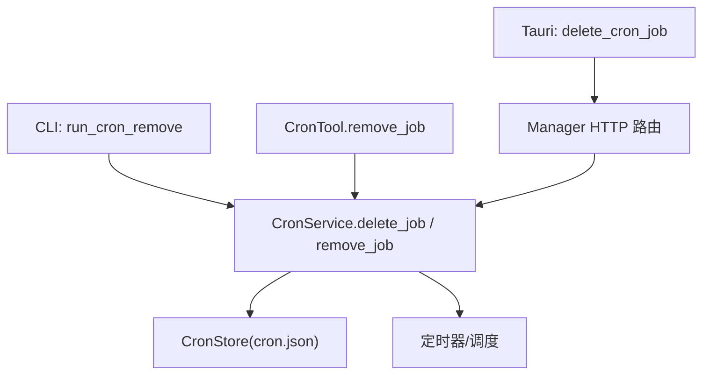
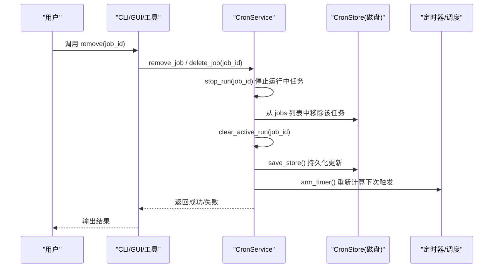
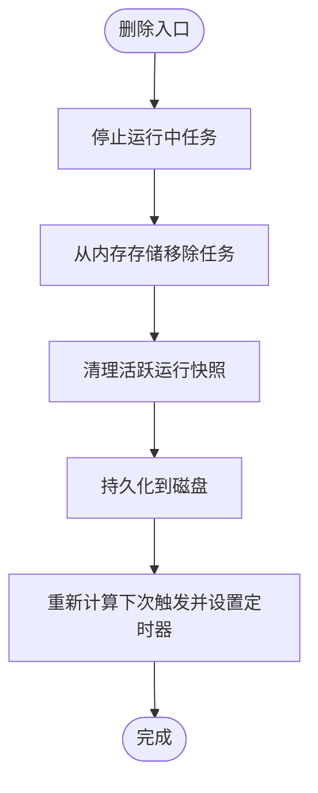
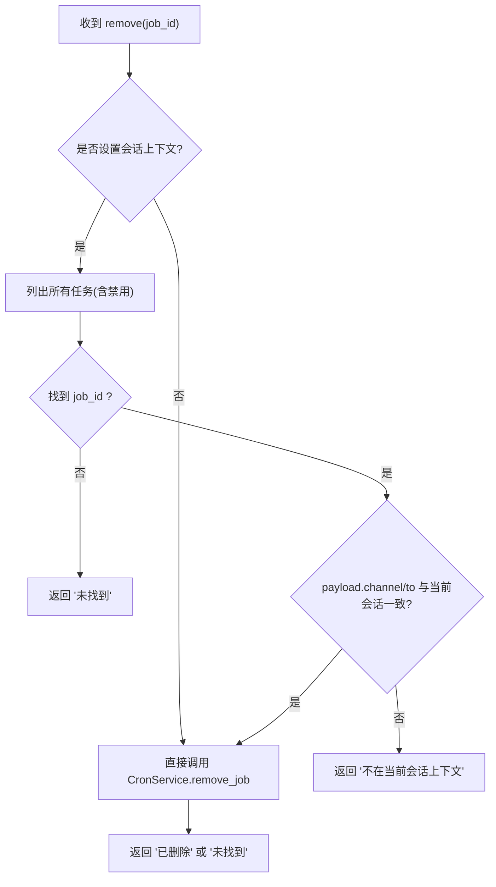
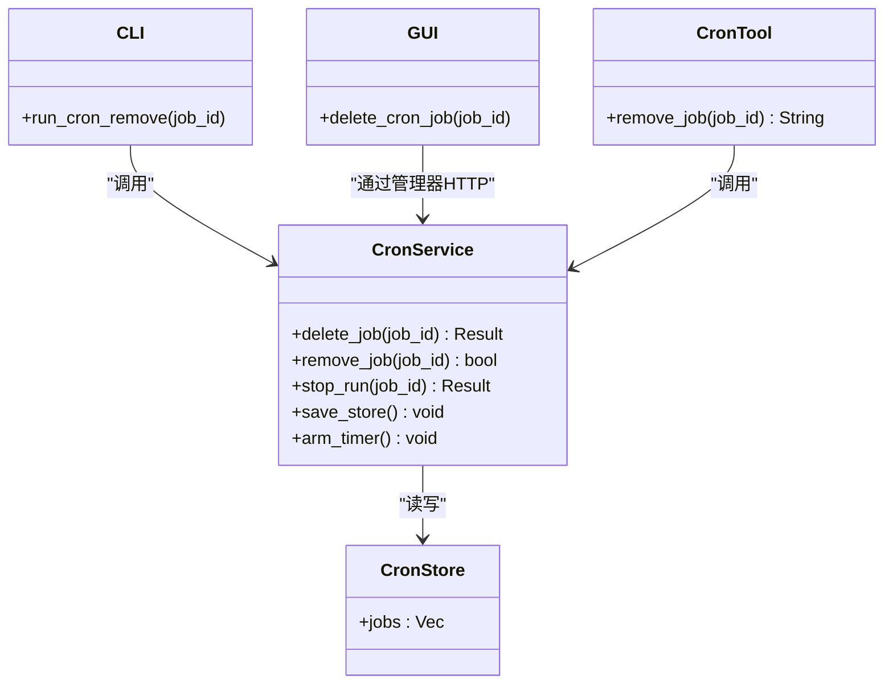

# 删除定时任务 (cron remove)

<cite>
**本文引用的文件**
- [agent-diva-core/src/cron/service.rs](file://agent-diva-core/src/cron/service.rs)
- [agent-diva-core/src/cron/types.rs](file://agent-diva-core/src/cron/types.rs)
- [agent-diva-tools/src/cron.rs](file://agent-diva-tools/src/cron.rs)
- [agent-diva-cli/src/main.rs](file://agent-diva-cli/src/main.rs)
- [agent-diva-gui/src-tauri/src/commands.rs](file://agent-diva-gui/src-tauri/src/commands.rs)
- [agent-diva-manager/src/handlers.rs](file://agent-diva-manager/src/handlers.rs)
</cite>

## 目录
1. [简介](#简介)
2. [项目结构](#项目结构)
3. [核心组件](#核心组件)
4. [架构总览](#架构总览)
5. [详细组件分析](#详细组件分析)
6. [依赖关系分析](#依赖关系分析)
7. [性能与一致性考虑](#性能与一致性考虑)
8. [故障排查指南](#故障排查指南)
9. [结论](#结论)
10. [附录：使用场景与最佳实践](#附录使用场景与最佳实践)

## 简介
本文件面向“删除定时任务（cron remove）”的完整操作说明，覆盖以下要点：
- 如何安全删除指定 job_id 的定时任务
- job_id 的获取方法
- 删除操作的确认机制与安全边界
- 删除对调度器、持久化存储、运行中任务的影响范围
- 删除前的检查建议与备份方法
- 常见错误处理（任务不存在、上下文不匹配、权限不足等）
- 强调删除不可逆的注意事项

## 项目结构
围绕 cron remove 的关键代码分布在以下模块：
- 核心服务：CronService 提供删除、启用/禁用、执行、列表等能力，并负责持久化与调度
- 工具层：CronTool 暴露 add/list/remove 动作，并在会话上下文中限制跨会话删除
- CLI：命令行入口调用 CronService 完成删除
- GUI：通过 Tauri 命令调用后端 API 删除任务
- 管理器：HTTP 路由将删除请求转发到具体处理器

图表来源
- [agent-diva-cli/src/main.rs:2080-2103](file://agent-diva-cli/src/main.rs#L2080-L2103)
- [agent-diva-tools/src/cron.rs:120-151](file://agent-diva-tools/src/cron.rs#L120-L151)
- [agent-diva-gui/src-tauri/src/commands.rs:2799-2831](file://agent-diva-gui/src-tauri/src/commands.rs#L2799-L2831)
- [agent-diva-core/src/cron/service.rs:618-644](file://agent-diva-core/src/cron/service.rs#L618-L644)
- [agent-diva-core/src/cron/types.rs:115-122](file://agent-diva-core/src/cron/types.rs#L115-L122)

章节来源
- [agent-diva-cli/src/main.rs:2080-2103](file://agent-diva-cli/src/main.rs#L2080-L2103)
- [agent-diva-tools/src/cron.rs:120-151](file://agent-diva-tools/src/cron.rs#L120-L151)
- [agent-diva-gui/src-tauri/src/commands.rs:2799-2831](file://agent-diva-gui/src-tauri/src/commands.rs#L2799-L2831)
- [agent-diva-core/src/cron/service.rs:618-644](file://agent-diva-core/src/cron/service.rs#L618-L644)
- [agent-diva-core/src/cron/types.rs:115-122](file://agent-diva-core/src/cron/types.rs#L115-L122)

## 核心组件
- CronService：实现任务的增删改查、执行、状态管理、持久化与调度。删除逻辑会停止运行中的任务、从内存与磁盘移除任务、清理活跃运行记录并重新计算下次触发时间。
- CronTool：在会话上下文中提供 remove 动作，支持按 channel/chat_id 校验，避免误删其他会话的任务。
- CLI：直接调用 CronService 删除任务，输出成功或“未找到”的结果。
- GUI：通过 Tauri 命令发起 HTTP DELETE 请求到后端，解析响应并返回结果。
- 类型定义：CronStore 持久化所有任务；CronJob/CronJobState 描述任务及其运行状态。

章节来源
- [agent-diva-core/src/cron/service.rs:98-117](file://agent-diva-core/src/cron/service.rs#L98-L117)
- [agent-diva-core/src/cron/types.rs:91-122](file://agent-diva-core/src/cron/types.rs#L91-L122)
- [agent-diva-tools/src/cron.rs:10-15](file://agent-diva-tools/src/cron.rs#L10-L15)
- [agent-diva-cli/src/main.rs:2080-2103](file://agent-diva-cli/src/main.rs#L2080-L2103)
- [agent-diva-gui/src-tauri/src/commands.rs:2799-2831](file://agent-diva-gui/src-tauri/src/commands.rs#L2799-L2831)

## 架构总览
下图展示从不同入口（CLI、工具、GUI）到核心服务的删除流程，以及删除对调度器与持久化的影响。

图表来源
- [agent-diva-core/src/cron/service.rs:618-644](file://agent-diva-core/src/cron/service.rs#L618-L644)
- [agent-diva-core/src/cron/service.rs:710-719](file://agent-diva-core/src/cron/service.rs#L710-L719)
- [agent-diva-core/src/cron/service.rs:153-174](file://agent-diva-core/src/cron/service.rs#L153-L174)
- [agent-diva-core/src/cron/service.rs:235-274](file://agent-diva-core/src/cron/service.rs#L235-L274)

## 详细组件分析

### CronService 删除流程
- 停止运行：若任务正在运行，先尝试取消（stop_run），确保不会继续执行。
- 移除任务：从内存中的 CronStore.jobs 移除对应 id 的任务。
- 清理活跃运行：清除 active_runs 中该任务的快照。
- 持久化：保存 CronStore 到磁盘（cron.json）。
- 重排调度：重新计算下一次触发时间并设置定时器。

图表来源
- [agent-diva-core/src/cron/service.rs:618-644](file://agent-diva-core/src/cron/service.rs#L618-L644)
- [agent-diva-core/src/cron/service.rs:710-719](file://agent-diva-core/src/cron/service.rs#L710-L719)
- [agent-diva-core/src/cron/service.rs:153-174](file://agent-diva-core/src/cron/service.rs#L153-L174)
- [agent-diva-core/src/cron/service.rs:235-274](file://agent-diva-core/src/cron/service.rs#L235-L274)

章节来源
- [agent-diva-core/src/cron/service.rs:618-644](file://agent-diva-core/src/cron/service.rs#L618-L644)
- [agent-diva-core/src/cron/service.rs:710-719](file://agent-diva-core/src/cron/service.rs#L710-L719)
- [agent-diva-core/src/cron/service.rs:153-174](file://agent-diva-core/src/cron/service.rs#L153-L174)
- [agent-diva-core/src/cron/service.rs:235-274](file://agent-diva-core/src/cron/service.rs#L235-L274)

### CronTool 删除与上下文校验
- 当存在当前会话上下文（channel/chat_id）时，remove 会先列出所有任务（含禁用），定位目标 job_id，并校验其 payload.channel 与 payload.to 是否与当前会话一致。不一致则拒绝删除，防止跨会话误删。
- 校验通过后调用 CronService.remove_job，返回“已删除”或“未找到”。

图表来源
- [agent-diva-tools/src/cron.rs:120-151](file://agent-diva-tools/src/cron.rs#L120-L151)

章节来源
- [agent-diva-tools/src/cron.rs:120-151](file://agent-diva-tools/src/cron.rs#L120-L151)

### CLI 删除入口
- 读取 cron store 路径，若不存在则提示无任务。
- 启动 CronService，调用 remove_job，停止服务后输出结果。

章节来源
- [agent-diva-cli/src/main.rs:2080-2103](file://agent-diva-cli/src/main.rs#L2080-L2103)

### GUI 删除入口
- Tauri 命令构造 HTTP DELETE 请求到后端 /cron/jobs/{job_id}。
- 校验响应状态码与 body 的 status 字段，非成功则返回错误信息。

章节来源
- [agent-diva-gui/src-tauri/src/commands.rs:2799-2831](file://agent-diva-gui/src-tauri/src/commands.rs#L2799-L2831)

### 管理器 HTTP 路由
- 管理器注册删除处理器，并将请求转发给运行时处理函数，最终落到 CronService。

章节来源
- [agent-diva-manager/src/handlers.rs:1160-1166](file://agent-diva-manager/src/handlers.rs#L1160-L1166)
- [agent-diva-manager/src/server.rs:15-15](file://agent-diva-manager/src/server.rs#L15-L15)
- [agent-diva-manager/src/server.rs:305-305](file://agent-diva-manager/src/server.rs#L305-L305)

## 依赖关系分析
- CronService 依赖 CronStore（持久化）、定时器（调度）、审计事件（执行生命周期）。
- CronTool 依赖 CronService 与当前会话上下文。
- CLI/GUI 通过各自入口调用 CronService 或经由管理器 HTTP 路由。

图表来源
- [agent-diva-core/src/cron/service.rs:618-644](file://agent-diva-core/src/cron/service.rs#L618-L644)
- [agent-diva-core/src/cron/types.rs:115-122](file://agent-diva-core/src/cron/types.rs#L115-L122)
- [agent-diva-tools/src/cron.rs:120-151](file://agent-diva-tools/src/cron.rs#L120-L151)
- [agent-diva-cli/src/main.rs:2080-2103](file://agent-diva-cli/src/main.rs#L2080-L2103)
- [agent-diva-gui/src-tauri/src/commands.rs:2799-2831](file://agent-diva-gui/src-tauri/src/commands.rs#L2799-L2831)

章节来源
- [agent-diva-core/src/cron/service.rs:618-644](file://agent-diva-core/src/cron/service.rs#L618-L644)
- [agent-diva-core/src/cron/types.rs:115-122](file://agent-diva-core/src/cron/types.rs#L115-L122)
- [agent-diva-tools/src/cron.rs:120-151](file://agent-diva-tools/src/cron.rs#L120-L151)
- [agent-diva-cli/src/main.rs:2080-2103](file://agent-diva-cli/src/main.rs#L2080-L2103)
- [agent-diva-gui/src-tauri/src/commands.rs:2799-2831](file://agent-diva-gui/src-tauri/src/commands.rs#L2799-L2831)

## 性能与一致性考虑
- 删除为原子性内存操作后落盘：先修改内存中的 CronStore，再写入磁盘，最后调整定时器。
- 并发安全：使用 RwLock/Mutex 保护共享状态，避免竞态条件。
- 定时器重算：删除后立即重新计算下次触发时间，保证调度正确性。
- 运行中任务：删除前尝试停止运行，减少资源占用与副作用。

[本节为通用指导，无需特定文件引用]

## 故障排查指南
- 任务不存在
  - CLI：输出“未找到”提示。
  - 工具：返回“未找到”。
  - GUI：服务端返回非成功状态码或消息体 status 不为 ok。
- 上下文不匹配（工具模式）
  - 当设置了 channel/chat_id 时，若目标任务的 payload.channel 与 payload.to 与当前会话不一致，删除将被拒绝。
- 权限不足
  - 当前代码未显式实现基于角色的权限控制；如需权限校验，应在上层（管理器或网关）增加鉴权逻辑。
- 删除后仍显示任务
  - 检查是否成功持久化（cron.json），确认服务是否重启加载最新数据。
- 删除后仍有任务执行
  - 确认是否成功调用 stop_run；若任务仍在运行，检查回调是否被取消。

章节来源
- [agent-diva-cli/src/main.rs:2080-2103](file://agent-diva-cli/src/main.rs#L2080-L2103)
- [agent-diva-tools/src/cron.rs:120-151](file://agent-diva-tools/src/cron.rs#L120-L151)
- [agent-diva-gui/src-tauri/src/commands.rs:2799-2831](file://agent-diva-gui/src-tauri/src/commands.rs#L2799-L2831)
- [agent-diva-core/src/cron/service.rs:710-719](file://agent-diva-core/src/cron/service.rs#L710-L719)

## 结论
cron remove 提供了跨入口的安全删除能力：CLI 直接调用、工具在会话上下文中校验、GUI 通过 HTTP 删除。删除操作会停止运行、清理状态、持久化并重新调度。请谨慎操作，因为删除不可逆。

[本节为总结，无需特定文件引用]

## 附录：使用场景与最佳实践

- 获取 job_id
  - 使用 list 动作列出所有任务，从中提取 job_id。
  - CLI 可通过查看任务列表输出获取。
  - GUI 可在任务管理界面选择目标任务。

- 删除前检查建议
  - 确认任务是否正在运行（如需要可先手动停止）。
  - 确认任务所属会话上下文（工具模式下）。
  - 备份 cron.json 文件，以防误删。

- 备份方法
  - 直接复制 cron.json 到安全位置。
  - 或通过导出/归档机制定期备份。

- 删除后的影响范围
  - 任务从调度器移除，不再触发。
  - 任务从持久化存储移除。
  - 运行中任务会被尝试停止并清理活跃快照。
  - 历史记录：任务执行历史保存在任务状态中；删除任务后，这些历史随任务一并移除。

- 常见错误处理
  - 任务不存在：检查 job_id 是否正确，或任务已被删除。
  - 上下文不匹配：切换到正确的会话上下文后再删除。
  - 权限不足：在上层增加鉴权策略。

- 不可逆注意事项
  - 删除操作不可撤销，请务必备份与确认后再执行。

章节来源
- [agent-diva-tools/src/cron.rs:98-118](file://agent-diva-tools/src/cron.rs#L98-L118)
- [agent-diva-core/src/cron/types.rs:78-109](file://agent-diva-core/src/cron/types.rs#L78-L109)
- [agent-diva-core/src/cron/service.rs:153-174](file://agent-diva-core/src/cron/service.rs#L153-L174)
- [agent-diva-core/src/cron/service.rs:618-644](file://agent-diva-core/src/cron/service.rs#L618-L644)