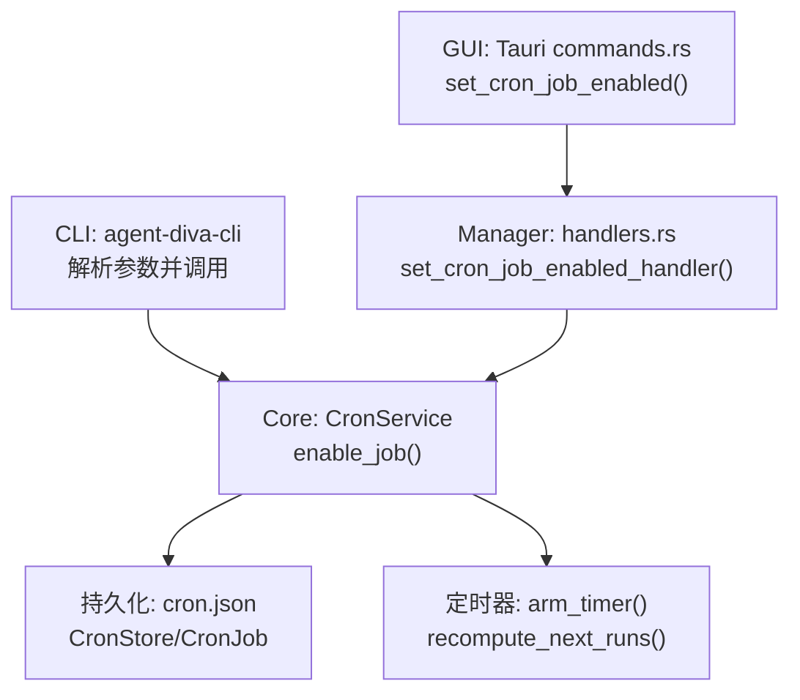
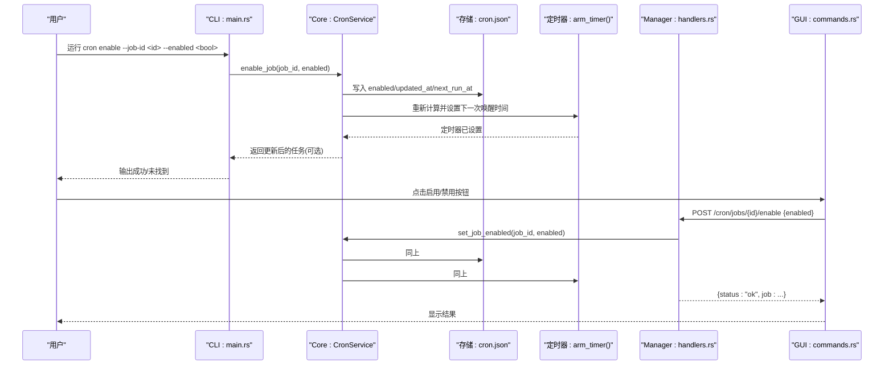
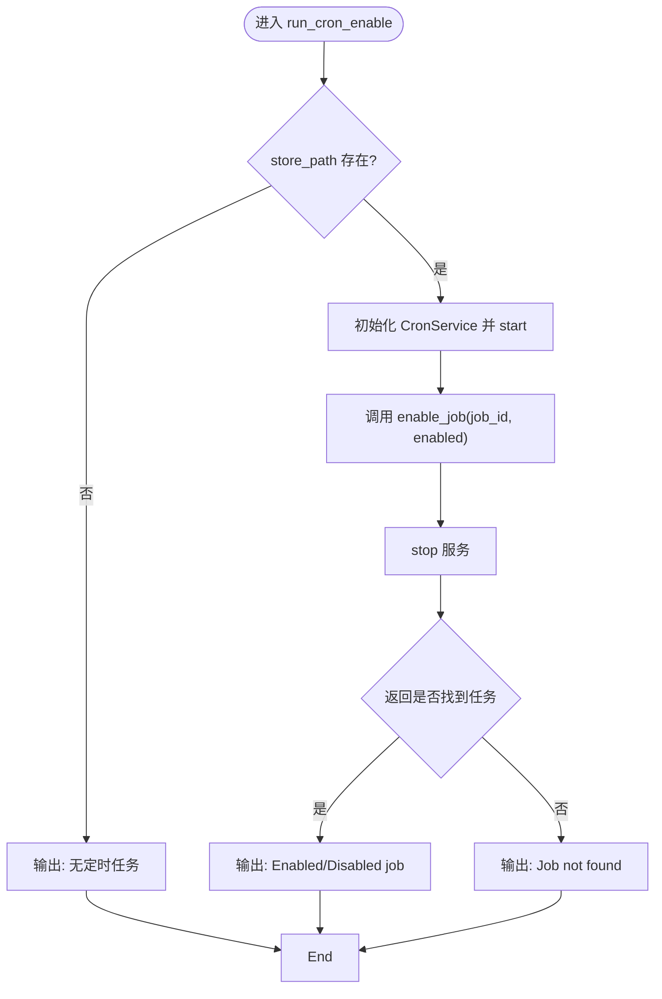
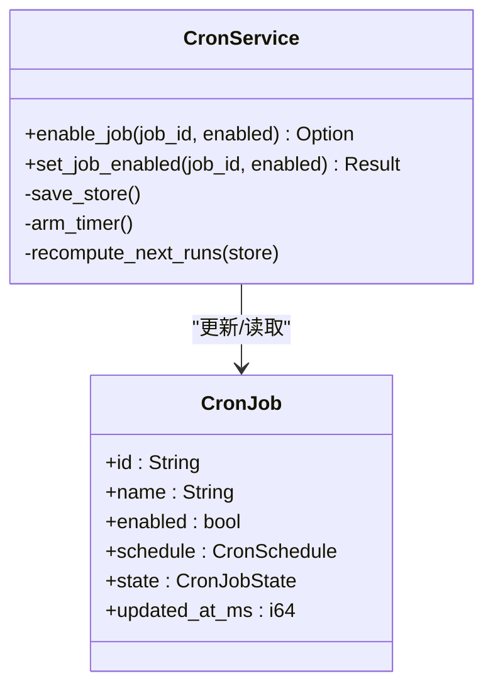
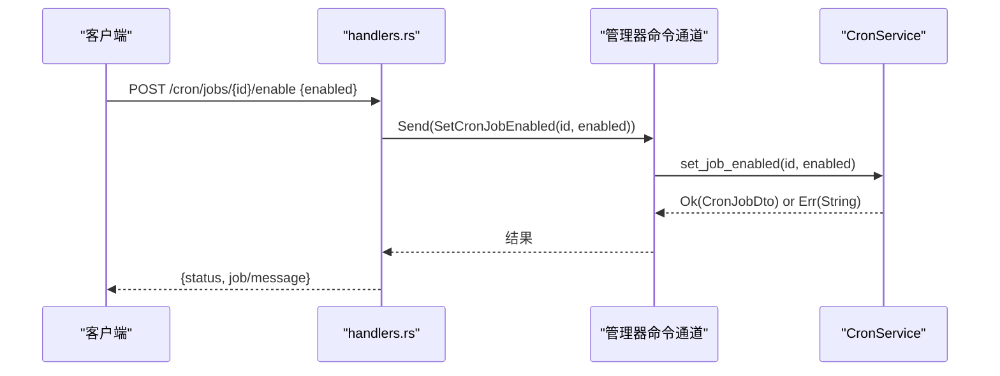
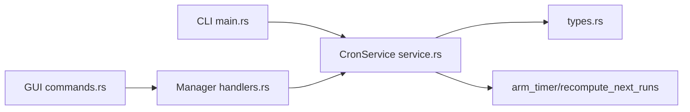

# 启用/禁用定时任务 (cron enable)

<cite>
**本文引用的文件**
- [agent-diva-cli/src/main.rs](file://agent-diva-cli/src/main.rs)
- [agent-diva-core/src/cron/service.rs](file://agent-diva-core/src/cron/service.rs)
- [agent-diva-core/src/cron/types.rs](file://agent-diva-core/src/cron/types.rs)
- [agent-diva-manager/src/handlers.rs](file://agent-diva-manager/src/handlers.rs)
- [agent-diva-gui/src-tauri/src/commands.rs](file://agent-diva-gui/src-tauri/src/commands.rs)
</cite>

## 目录
1. [简介](#简介)
2. [项目结构](#项目结构)
3. [核心组件](#核心组件)
4. [架构总览](#架构总览)
5. [详细组件分析](#详细组件分析)
6. [依赖关系分析](#依赖关系分析)
7. [性能考虑](#性能考虑)
8. [故障排查指南](#故障排查指南)
9. [结论](#结论)
10. [附录](#附录)

## 简介
本文件面向“启用/禁用定时任务”的 cron enable 命令，说明如何使用该命令对指定 job_id 的任务进行启用或禁用（enabled 布尔参数），并解释其对调度器的影响：包括当前正在执行的任务如何处理、下次执行时间如何调整、以及持久化与定时器重设等。同时提供批量管理场景示例（如临时禁用某任务进行维护、批量启用多个任务）以及状态验证与错误处理机制说明。

## 项目结构
cron enable 功能涉及 CLI 层、核心服务层、HTTP 接口层和 GUI 调用层：
- CLI 层：解析命令行参数并调用 CronService.enable_job
- 核心服务层：CronService 负责读写存储、更新任务状态、计算下次执行时间、重设定时器
- HTTP 接口层：Manager handlers 暴露 REST 接口，供 GUI 或其他客户端调用
- GUI 层：Tauri 命令封装 HTTP 请求，返回结果给前端

图表来源
- [agent-diva-cli/src/main.rs:736-741](file://agent-diva-cli/src/main.rs#L736-L741)
- [agent-diva-core/src/cron/service.rs:646-684](file://agent-diva-core/src/cron/service.rs#L646-L684)
- [agent-diva-manager/src/handlers.rs:1101-1119](file://agent-diva-manager/src/handlers.rs#L1101-L1119)
- [agent-diva-gui/src-tauri/src/commands.rs:2685-2721](file://agent-diva-gui/src-tauri/src/commands.rs#L2685-L2721)

章节来源
- [agent-diva-cli/src/main.rs:700-748](file://agent-diva-cli/src/main.rs#L700-L748)
- [agent-diva-core/src/cron/service.rs:176-274](file://agent-diva-core/src/cron/service.rs#L176-L274)
- [agent-diva-manager/src/handlers.rs:1101-1119](file://agent-diva-manager/src/handlers.rs#L1101-L1119)
- [agent-diva-gui/src-tauri/src/commands.rs:2685-2721](file://agent-diva-gui/src-tauri/src/commands.rs#L2685-L2721)

## 核心组件
- CLI 命令定义与路由：在 CLI 中定义 Enable 子命令，包含 job_id 与 --enabled 布尔参数；匹配后调用 run_cron_enable
- CronService.enable_job：查找并更新任务的 enabled 字段，设置 updated_at_ms，根据 enabled 计算 next_run_at_ms；保存存储并重设定时器
- CronService.set_job_enabled：包装 enable_job 并返回 DTO（含 computed_status、active_run 等）
- Manager handler：接收 HTTP 请求，转发到管理器命令通道，最终调用 CronService.set_job_enabled
- GUI 命令：通过 HTTP POST /cron/jobs/{job_id}/enable 发送 { enabled }，校验响应 status 为 ok

章节来源
- [agent-diva-cli/src/main.rs:365-372](file://agent-diva-cli/src/main.rs#L365-L372)
- [agent-diva-cli/src/main.rs:736-741](file://agent-diva-cli/src/main.rs#L736-L741)
- [agent-diva-cli/src/main.rs:2106-2129](file://agent-diva-cli/src/main.rs#L2106-L2129)
- [agent-diva-core/src/cron/service.rs:646-684](file://agent-diva-core/src/cron/service.rs#L646-L684)
- [agent-diva-manager/src/handlers.rs:1101-1119](file://agent-diva-manager/src/handlers.rs#L1101-L1119)
- [agent-diva-gui/src-tauri/src/commands.rs:2685-2721](file://agent-diva-gui/src-tauri/src/commands.rs#L2685-L2721)

## 架构总览
下图展示了从 CLI/GUI 到核心服务的完整调用链，以及调度器对 enable/disable 的处理流程。

图表来源
- [agent-diva-cli/src/main.rs:736-741](file://agent-diva-cli/src/main.rs#L736-L741)
- [agent-diva-core/src/cron/service.rs:646-684](file://agent-diva-core/src/cron/service.rs#L646-L684)
- [agent-diva-manager/src/handlers.rs:1101-1119](file://agent-diva-manager/src/handlers.rs#L1101-L1119)
- [agent-diva-gui/src-tauri/src/commands.rs:2685-2721](file://agent-diva-gui/src-tauri/src/commands.rs#L2685-L2721)

## 详细组件分析

### CLI 命令：cron enable
- 参数
  - job_id：要启用的任务 ID
  - --enabled：布尔值，true 表示启用，false 表示禁用
- 行为
  - 若存储不存在则提示无定时任务并退出
  - 启动 CronService，调用 enable_job(job_id, enabled)
  - 停止服务，输出成功或未找到信息

图表来源
- [agent-diva-cli/src/main.rs:2106-2129](file://agent-diva-cli/src/main.rs#L2106-L2129)

章节来源
- [agent-diva-cli/src/main.rs:365-372](file://agent-diva-cli/src/main.rs#L365-L372)
- [agent-diva-cli/src/main.rs:736-741](file://agent-diva-cli/src/main.rs#L736-L741)
- [agent-diva-cli/src/main.rs:2106-2129](file://agent-diva-cli/src/main.rs#L2106-L2129)

### 核心服务：CronService.enable_job/set_job_enabled
- 关键逻辑
  - 查找任务，更新 enabled 与 updated_at_ms
  - 若启用：计算 next_run_at_ms；若禁用：清空 next_run_at_ms
  - 持久化存储并重新设置定时器（arm_timer）
  - set_job_enabled 包装 enable_job，返回 DTO（包含 computed_status、active_run）

图表来源
- [agent-diva-core/src/cron/service.rs:646-684](file://agent-diva-core/src/cron/service.rs#L646-L684)
- [agent-diva-core/src/cron/types.rs:91-109](file://agent-diva-core/src/cron/types.rs#L91-L109)

章节来源
- [agent-diva-core/src/cron/service.rs:646-684](file://agent-diva-core/src/cron/service.rs#L646-L684)
- [agent-diva-core/src/cron/types.rs:78-109](file://agent-diva-core/src/cron/types.rs#L78-L109)

### HTTP 接口：Manager handlers
- 端点：POST /cron/jobs/{id}/enable
- 请求体：{ enabled: bool }
- 行为：通过 oneshot channel 将 SetCronJobEnabled 命令发送到管理器，再调用 CronService.set_job_enabled，返回 { status, job } 或错误信息

图表来源
- [agent-diva-manager/src/handlers.rs:1101-1119](file://agent-diva-manager/src/handlers.rs#L1101-L1119)
- [agent-diva-core/src/cron/service.rs:675-684](file://agent-diva-core/src/cron/service.rs#L675-L684)

章节来源
- [agent-diva-manager/src/handlers.rs:1101-1119](file://agent-diva-manager/src/handlers.rs#L1101-L1119)

### GUI 调用：Tauri commands
- 函数：set_cron_job_enabled(job_id, enabled)
- 行为：构造 URL /cron/jobs/{job_id}/enable，发送 JSON { enabled }，检查响应状态码与 body.status == "ok"，返回 job 数据或错误消息

章节来源
- [agent-diva-gui/src-tauri/src/commands.rs:2685-2721](file://agent-diva-gui/src-tauri/src/commands.rs#L2685-L2721)

## 依赖关系分析
- CLI 依赖 CronService 的 enable_job；Manager handlers 依赖 CronService 的 set_job_enabled；GUI 通过 HTTP 调用 Manager handlers
- CronService 依赖类型定义（CronJob、CronJobState、CronSchedule）用于数据结构与序列化
- 定时器 arm_timer 与 recompute_next_runs 确保调度器在状态变更后立即生效

图表来源
- [agent-diva-cli/src/main.rs:736-741](file://agent-diva-cli/src/main.rs#L736-L741)
- [agent-diva-core/src/cron/service.rs:646-684](file://agent-diva-core/src/cron/service.rs#L646-L684)
- [agent-diva-manager/src/handlers.rs:1101-1119](file://agent-diva-manager/src/handlers.rs#L1101-L1119)
- [agent-diva-core/src/cron/types.rs:91-109](file://agent-diva-core/src/cron/types.rs#L91-L109)

章节来源
- [agent-diva-cli/src/main.rs:736-741](file://agent-diva-cli/src/main.rs#L736-L741)
- [agent-diva-core/src/cron/service.rs:646-684](file://agent-diva-core/src/cron/service.rs#L646-L684)
- [agent-diva-manager/src/handlers.rs:1101-1119](file://agent-diva-manager/src/handlers.rs#L1101-L1119)
- [agent-diva-core/src/cron/types.rs:91-109](file://agent-diva-core/src/cron/types.rs#L91-L109)

## 性能考虑
- 每次 enable/disable 都会持久化存储并重新设置定时器，频繁操作可能带来 I/O 与调度开销
- 建议批量操作时合并多次变更后再统一保存（例如先收集多个 job_id 与目标状态，再逐个调用 enable_job，最后统一保存与重设定时器）
- 对于大量任务，避免在同一时刻触发过多定时器重设，可考虑延迟批处理

[本节为通用指导，不直接分析具体文件]

## 故障排查指南
- 常见错误
  - 任务未找到：CLI 输出 “Job <id> not found”；HTTP 返回 { status: "error", message: "job <id> not found" }
  - 网络错误：GUI 层捕获 HTTP 失败并返回错误消息
  - 无效响应：GUI 层检查 response.status 与 body.status 是否为 "ok"
- 状态验证
  - 可通过 list jobs 查看任务状态（computed_status、is_running、nextRunAtMs）
  - 启用后 nextRunAtMs 将被计算；禁用后被清空
- 调试建议
  - 检查 cron.json 中对应任务的 enabled、updated_at_ms、state.next_run_at_ms
  - 查看日志中的定时器重设与任务执行审计事件

章节来源
- [agent-diva-cli/src/main.rs:2106-2129](file://agent-diva-cli/src/main.rs#L2106-L2129)
- [agent-diva-manager/src/handlers.rs:1101-1119](file://agent-diva-manager/src/handlers.rs#L1101-L1119)
- [agent-diva-gui/src-tauri/src/commands.rs:2685-2721](file://agent-diva-gui/src-tauri/src/commands.rs#L2685-L2721)
- [agent-diva-core/src/cron/service.rs:646-684](file://agent-diva-core/src/cron/service.rs#L646-L684)

## 结论
cron enable 命令提供了对定时任务的细粒度控制能力。通过 CLI 或 GUI 调用，可以安全地启用或禁用指定任务，调度器会即时更新下次执行时间并持久化状态。结合批量管理策略与完善的错误处理机制，可以在生产环境中稳定地进行任务维护与恢复。

[本节为总结性内容，不直接分析具体文件]

## 附录

### 使用示例
- 单个任务启用/禁用
  - CLI: agent-diva cron enable --job-id <id> --enabled true/false
  - GUI: 调用 set_cron_job_enabled(job_id, enabled)
- 批量管理
  - 临时禁用某个任务进行维护：对目标 job_id 调用 disable，确认 nextRunAtMs 被清空
  - 批量启用多个任务：循环调用 enable 并将 enabled 设为 true，随后通过 list 验证状态

[本节为概念性说明，不直接分析具体文件]

### 调度器影响说明
- 当前正在执行的任务：enable/disable 不会中断正在运行的任务；仅影响后续调度
- 下次执行时间：启用时重新计算 nextRunAtMs；禁用时清空 nextRunAtMs
- 定时器重设：每次变更后调用 arm_timer 以尽快反映新状态

章节来源
- [agent-diva-core/src/cron/service.rs:646-684](file://agent-diva-core/src/cron/service.rs#L646-L684)
- [agent-diva-core/src/cron/service.rs:212-274](file://agent-diva-core/src/cron/service.rs#L212-L274)