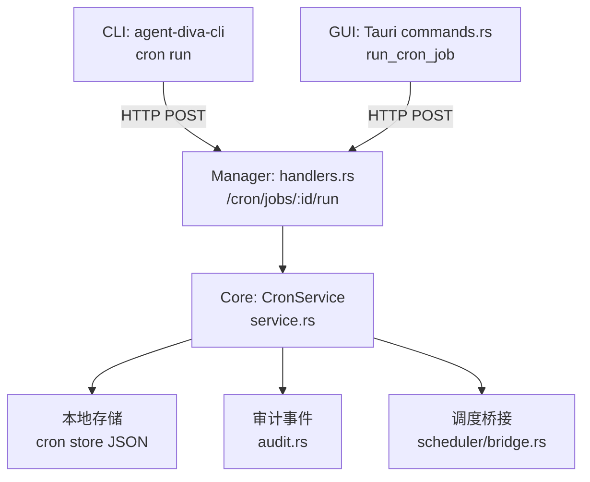
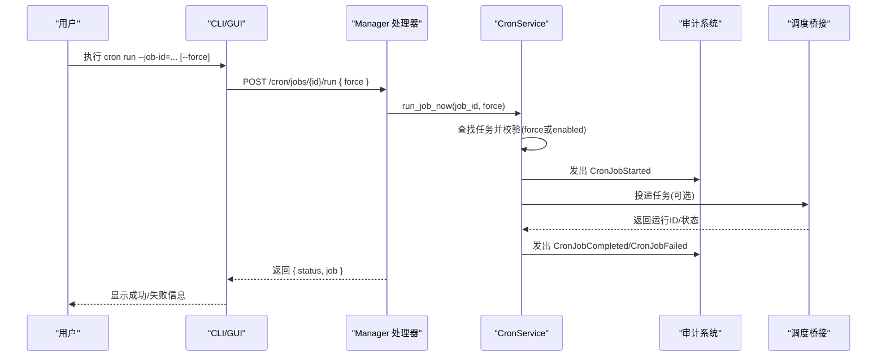
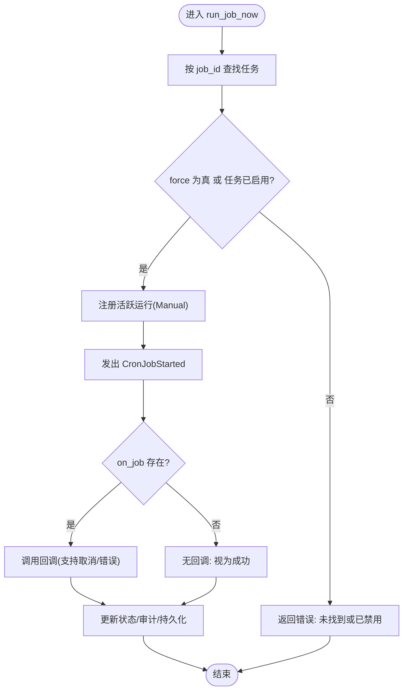
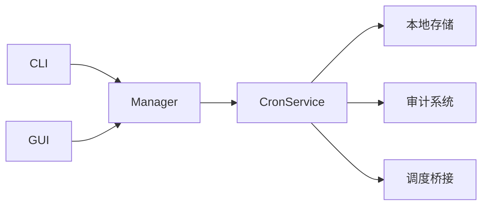

# 手动执行定时任务 (cron run)

<cite>
**本文引用的文件**
- [agent-diva-core/src/cron/service.rs](file://agent-diva-core/src/cron/service.rs)
- [agent-diva-core/src/cron/types.rs](file://agent-diva-core/src/cron/types.rs)
- [agent-diva-cli/src/main.rs](file://agent-diva-cli/src/main.rs)
- [agent-diva-manager/src/handlers.rs](file://agent-diva-manager/src/handlers.rs)
- [agent-diva-gui/src-tauri/src/commands.rs](file://agent-diva-gui/src-tauri/src/commands.rs)
- [agent-diva-core/src/scheduler/bridge.rs](file://agent-diva-core/src/scheduler/bridge.rs)
- [agent-diva-core/src/audit.rs](file://agent-diva-core/src/audit.rs)
</cite>

## 目录
1. [简介](#简介)
2. [项目结构](#项目结构)
3. [核心组件](#核心组件)
4. [架构总览](#架构总览)
5. [详细组件分析](#详细组件分析)
6. [依赖关系分析](#依赖关系分析)
7. [性能与可靠性](#性能与可靠性)
8. [故障排查指南](#故障排查指南)
9. [结论](#结论)
10. [附录：常用命令与场景](#附录常用命令与场景)

## 简介
本文件面向“如何手动触发并监控指定定时任务”的使用者，围绕 cron run 命令展开，覆盖以下要点：
- 如何使用 job_id 参数精确触发某个任务
- force 参数的作用与适用场景（跳过禁用检查、调试等）
- 执行权限与依赖验证机制
- 执行过程监控与结果查看（日志、输出消息、错误信息）
- 常见使用场景（测试配置、立即执行、调试逻辑）

## 项目结构
cron run 能力由 CLI、Manager HTTP API、GUI Tauri 命令以及核心 CronService 共同实现。CLI 和 GUI 通过 Manager 的 HTTP 接口或直接调用 CronService 来触发任务；CronService 负责查找任务、校验状态、执行回调、记录审计事件与持久化状态。

图表来源
- [agent-diva-cli/src/main.rs:740-747](file://agent-diva-cli/src/main.rs#L740-L747)
- [agent-diva-manager/src/handlers.rs:1121-1139](file://agent-diva-manager/src/handlers.rs#L1121-L1139)
- [agent-diva-core/src/cron/service.rs:686-708](file://agent-diva-core/src/cron/service.rs#L686-L708)
- [agent-diva-core/src/audit.rs:184-197](file://agent-diva-core/src/audit.rs#L184-L197)
- [agent-diva-core/src/scheduler/bridge.rs:73-98](file://agent-diva-core/src/scheduler/bridge.rs#L73-L98)

章节来源
- [agent-diva-cli/src/main.rs:740-747](file://agent-diva-cli/src/main.rs#L740-L747)
- [agent-diva-manager/src/handlers.rs:1121-1139](file://agent-diva-manager/src/handlers.rs#L1121-L1139)
- [agent-diva-core/src/cron/service.rs:686-708](file://agent-diva-core/src/cron/service.rs#L686-L708)

## 核心组件
- CLI 入口与命令路由：解析 cron run 子命令，将 job_id 与 force 传入运行函数。
- Manager HTTP 处理器：暴露 /cron/jobs/{id}/run 接口，接收 { force } 请求体并转发到核心服务。
- GUI Tauri 命令：提供前端调用的 run_cron_job(job_id, force)，封装为 HTTP 请求。
- CronService：核心执行引擎，负责按 job_id 查找任务、根据 force 决定是否绕过启用检查、注册活跃运行、执行回调、更新状态、写入审计事件与持久化。
- 调度桥接：将 cron 任务投递到受管运行队列，支持重试与死信队列。
- 审计系统：记录任务开始、完成、失败等事件，便于追踪与排障。

章节来源
- [agent-diva-cli/src/main.rs:740-747](file://agent-diva-cli/src/main.rs#L740-L747)
- [agent-diva-manager/src/handlers.rs:1121-1139](file://agent-diva-manager/src/handlers.rs#L1121-L1139)
- [agent-diva-gui/src-tauri/src/commands.rs:2724-2760](file://agent-diva-gui/src-tauri/src/commands.rs#L2724-L2760)
- [agent-diva-core/src/cron/service.rs:686-708](file://agent-diva-core/src/cron/service.rs#L686-L708)
- [agent-diva-core/src/scheduler/bridge.rs:73-98](file://agent-diva-core/src/scheduler/bridge.rs#L73-L98)
- [agent-diva-core/src/audit.rs:184-197](file://agent-diva-core/src/audit.rs#L184-L197)

## 架构总览
下图展示一次“手动执行任务”的端到端流程：从 CLI/GUI 发起请求，经 Manager 转发至 CronService，最终执行任务并记录审计事件。

图表来源
- [agent-diva-cli/src/main.rs:740-747](file://agent-diva-cli/src/main.rs#L740-L747)
- [agent-diva-manager/src/handlers.rs:1121-1139](file://agent-diva-manager/src/handlers.rs#L1121-L1139)
- [agent-diva-core/src/cron/service.rs:686-708](file://agent-diva-core/src/cron/service.rs#L686-L708)
- [agent-diva-core/src/audit.rs:184-197](file://agent-diva-core/src/audit.rs#L184-L197)
- [agent-diva-core/src/scheduler/bridge.rs:73-98](file://agent-diva-core/src/scheduler/bridge.rs#L73-L98)

## 详细组件分析

### CLI 命令与参数
- 命令路由：当解析到 cron run 时，CLI 会调用内部函数处理，传入 job_id 与 force。
- 行为：
  - 若未找到任务或任务被禁用且未设置 force，则返回错误提示。
  - 若 force 为真，即使任务处于禁用状态也会尝试执行。
  - 执行成功后输出成功标记，否则输出错误信息。

章节来源
- [agent-diva-cli/src/main.rs:740-747](file://agent-diva-cli/src/main.rs#L740-L747)
- [agent-diva-cli/src/main.rs:2132-2158](file://agent-diva-cli/src/main.rs#L2132-L2158)

### Manager HTTP 接口
- 接口路径：POST /cron/jobs/{id}/run
- 请求体：{ "force": boolean }
- 响应：{ "status": "ok"|"error", "job": ... | "message": ... }
- 职责：接收请求，转发给核心服务，统一包装错误与结果。

章节来源
- [agent-diva-manager/src/handlers.rs:1121-1139](file://agent-diva-manager/src/handlers.rs#L1121-L1139)

### GUI Tauri 命令
- 提供 run_cron_job(job_id, force) 供前端调用，内部封装为对 Manager 的 HTTP 请求。
- 错误处理：非 2xx 状态码或响应体 status 不为 ok 时，返回错误消息。

章节来源
- [agent-diva-gui/src-tauri/src/commands.rs:2724-2760](file://agent-diva-gui/src-tauri/src/commands.rs#L2724-L2760)

### CronService 执行流程
- 查找任务：按 job_id 在存储中查找，若 force 为真则忽略 enabled 检查，否则仅允许已启用的任务。
- 注册活跃运行：生成 run_id、时间戳、触发类型为 Manual，并维护可取消令牌。
- 执行回调：调用 on_job 回调（如为空则视为空操作），支持取消与错误传播。
- 状态更新：记录 last_run_at_ms、last_status、last_error，计算下次运行时间，必要时删除一次性任务。
- 审计事件：发出 CronJobStarted、CronJobCompleted、CronJobFailed。
- 持久化：保存存储并重新武装定时器。

图表来源
- [agent-diva-core/src/cron/service.rs:686-708](file://agent-diva-core/src/cron/service.rs#L686-L708)
- [agent-diva-core/src/cron/service.rs:342-458](file://agent-diva-core/src/cron/service.rs#L342-L458)
- [agent-diva-core/src/audit.rs:184-197](file://agent-diva-core/src/audit.rs#L184-L197)

章节来源
- [agent-diva-core/src/cron/service.rs:686-708](file://agent-diva-core/src/cron/service.rs#L686-L708)
- [agent-diva-core/src/cron/service.rs:342-458](file://agent-diva-core/src/cron/service.rs#L342-L458)

### 类型与数据结构
- CronSchedule：支持 at/every/cron 三种调度方式。
- CronPayload：定义任务负载，包含 kind、message、deliver、channel、to。
- CronJobState：记录 next_run_at_ms、last_run_at_ms、last_status、last_error。
- CronRunSnapshot：记录单次运行的 run_id、started_at_ms、trigger、cancelable 等。
- CronJobDto：对外视图，包含 job、is_running、active_run、computed_status。

章节来源
- [agent-diva-core/src/cron/types.rs:1-262](file://agent-diva-core/src/cron/types.rs#L1-L262)

### 调度桥接与重试
- CronBridge 将 cron 任务投递到受管运行队列，并在需要时创建关联的待办项。
- 失败重试：采用指数退避，最多 5 次；超过后转入死信队列。
- 该机制确保任务执行的可靠性与可观测性。

章节来源
- [agent-diva-core/src/scheduler/bridge.rs:73-98](file://agent-diva-core/src/scheduler/bridge.rs#L73-L98)
- [agent-diva-core/src/scheduler/bridge.rs:100-174](file://agent-diva-core/src/scheduler/bridge.rs#L100-L174)

## 依赖关系分析
- CLI 依赖 Manager HTTP 接口或直接使用 CronService（取决于运行模式）。
- Manager 依赖核心 CronService 进行实际执行。
- GUI 通过 Tauri 命令调用 Manager HTTP 接口。
- CronService 依赖本地存储、审计系统与调度桥接。

图表来源
- [agent-diva-cli/src/main.rs:740-747](file://agent-diva-cli/src/main.rs#L740-L747)
- [agent-diva-manager/src/handlers.rs:1121-1139](file://agent-diva-manager/src/handlers.rs#L1121-L1139)
- [agent-diva-core/src/cron/service.rs:686-708](file://agent-diva-core/src/cron/service.rs#L686-L708)

章节来源
- [agent-diva-cli/src/main.rs:740-747](file://agent-diva-cli/src/main.rs#L740-L747)
- [agent-diva-manager/src/handlers.rs:1121-1139](file://agent-diva-manager/src/handlers.rs#L1121-L1139)
- [agent-diva-core/src/cron/service.rs:686-708](file://agent-diva-core/src/cron/service.rs#L686-L708)

## 性能与可靠性
- 并发控制：同一 job_id 不允许重复运行（注册活跃运行时会检查是否已有运行）。
- 取消机制：通过 CancellationToken 支持停止正在运行的任务。
- 重试与死信：失败任务自动重试，达到上限后进入死信队列，避免无限重试。
- 持久化：每次执行后更新并保存存储，保证状态一致性。
- 审计：关键生命周期事件均被记录，便于追踪与审计。

[本节为通用指导，不直接分析具体文件]

## 故障排查指南
- 常见问题
  - 任务未找到或已禁用：确认 job_id 正确，或使用 force 跳过禁用检查。
  - 网络错误：GUI/CLI 调用 Manager 失败时，检查服务端状态与端口连通性。
  - 执行失败：查看任务状态中的 last_error 与审计事件。
- 查看执行结果
  - 通过 get 接口或 list 接口获取任务详情，关注 computed_status、active_run、state.last_status、state.last_error。
  - 审计事件：CronJobStarted、CronJobCompleted、CronJobFailed 可用于定位问题。
- 停止运行中的任务
  - 使用 stop 接口或 CLI 对应功能，触发取消令牌以中止执行。

章节来源
- [agent-diva-core/src/cron/service.rs:686-708](file://agent-diva-core/src/cron/service.rs#L686-L708)
- [agent-diva-core/src/cron/service.rs:710-719](file://agent-diva-core/src/cron/service.rs#L710-L719)
- [agent-diva-core/src/audit.rs:184-197](file://agent-diva-core/src/audit.rs#L184-L197)

## 结论
cron run 提供了灵活的手动触发能力，结合 job_id 与 force 参数，既能精准执行特定任务，也能在调试或测试场景中绕过禁用检查。配合审计事件与状态快照，用户可以全面监控任务的执行过程与结果。对于生产环境，建议谨慎使用 force，并确保任务幂等性与错误处理完善。

[本节为总结性内容，不直接分析具体文件]

## 附录：常用命令与场景
- 测试任务配置
  - 使用 cron add 创建任务，然后 cron run --job-id=<id> 立即执行，验证 payload 与调度是否正确。
- 立即执行定时任务
  - 使用 cron run --job-id=<id> 触发下一次计划外的执行。
- 调试任务逻辑
  - 使用 cron run --job-id=<id> --force 跳过禁用检查，快速验证逻辑。
- 查看执行历史与错误
  - 通过 get/list 接口查看 state.last_status、state.last_error 与 active_run。
  - 通过审计事件 CronJobFailed 获取错误详情。

[本节为概念性说明，不直接分析具体文件]