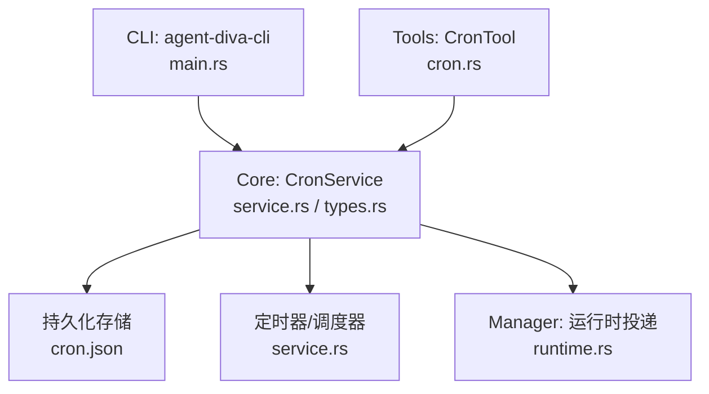
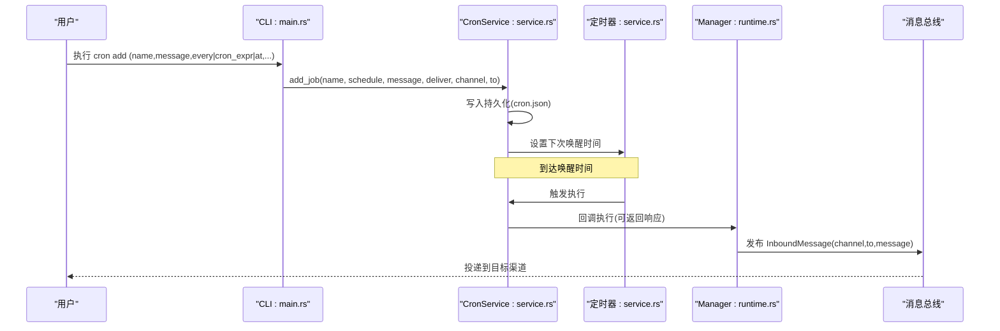
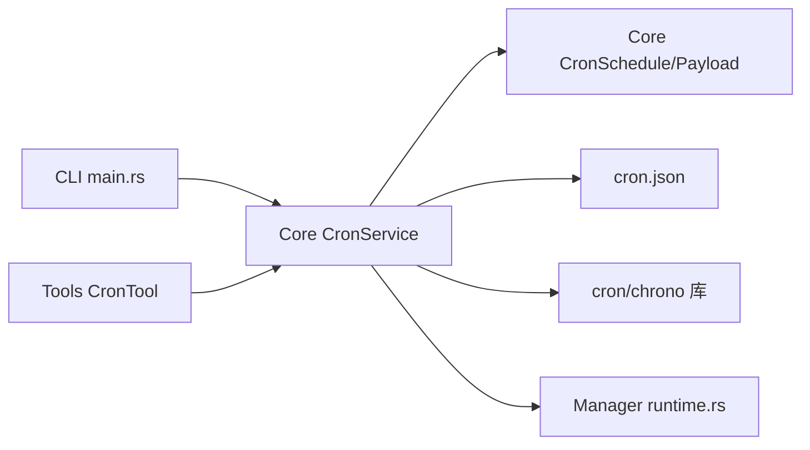

# 添加定时任务 (cron add)

<cite>
**本文引用的文件**
- [agent-diva-cli/src/main.rs](file://agent-diva-cli/src/main.rs)
- [agent-diva-core/src/cron/types.rs](file://agent-diva-core/src/cron/types.rs)
- [agent-diva-core/src/cron/service.rs](file://agent-diva-core/src/cron/service.rs)
- [agent-diva-tools/src/cron.rs](file://agent-diva-tools/src/cron.rs)
- [agent-diva-manager/src/runtime.rs](file://agent-diva-manager/src/runtime.rs)
</cite>

## 目录
1. [简介](#简介)
2. [项目结构](#项目结构)
3. [核心组件](#核心组件)
4. [架构总览](#架构总览)
5. [详细组件分析](#详细组件分析)
6. [依赖关系分析](#依赖关系分析)
7. [性能与可靠性](#性能与可靠性)
8. [故障排查指南](#故障排查指南)
9. [结论](#结论)
10. [附录：常用示例与最佳实践](#附录：常用示例与最佳实践)

## 简介
本章节面向使用 CLI 的“添加定时任务”能力，聚焦 `cron add` 命令。该命令用于创建一条定时或一次性任务，支持多种调度方式（每 N 秒、cron 表达式、一次性时间戳），并可配置消息投递目标（通道与收件人）。系统会在后台服务运行时按调度触发任务执行，并将结果投递到指定渠道。

## 项目结构
与 `cron add` 相关的代码分布在以下模块：
- CLI 层：负责参数解析与调用服务
- Core 层：定义任务类型、调度策略与服务实现
- Tools 层：提供工具化接口（如 Agent 内嵌 cron 工具）
- Manager 层：在任务触发时进行消息投递路由

图表来源
- [agent-diva-cli/src/main.rs:321-353](file://agent-diva-cli/src/main.rs#L321-L353)
- [agent-diva-core/src/cron/service.rs:176-274](file://agent-diva-core/src/cron/service.rs#L176-L274)
- [agent-diva-core/src/cron/types.rs:6-28](file://agent-diva-core/src/cron/types.rs#L6-L28)
- [agent-diva-manager/src/runtime.rs:592-623](file://agent-diva-manager/src/runtime.rs#L592-L623)

章节来源
- [agent-diva-cli/src/main.rs:321-353](file://agent-diva-cli/src/main.rs#L321-L353)
- [agent-diva-core/src/cron/types.rs:6-28](file://agent-diva-core/src/cron/types.rs#L6-L28)
- [agent-diva-core/src/cron/service.rs:176-274](file://agent-diva-core/src/cron/service.rs#L176-L274)
- [agent-diva-manager/src/runtime.rs:592-623](file://agent-diva-manager/src/runtime.rs#L592-L623)

## 核心组件
- CLI 命令定义与处理：负责接收 name、message、every、cron_expr、at、timezone、deliver、to、channel 等参数，并构造调度策略后调用服务。
- Cron 类型与调度：定义 at/every/cron 三种调度模式，以及任务负载（含 deliver/channel/to）。
- Cron 服务：负责任务的增删改查、持久化、定时器唤醒、执行回调、状态更新与审计。
- 工具封装：Agent 内部通过 CronTool 暴露 add/list/remove 操作，自动注入会话上下文（channel/chat_id）。
- 运行时投递：任务触发后将消息以 InboundMessage 形式发布到总线，并根据 channel/to 决定投递目标。

章节来源
- [agent-diva-cli/src/main.rs:321-353](file://agent-diva-cli/src/main.rs#L321-L353)
- [agent-diva-cli/src/main.rs:1950-1998](file://agent-diva-cli/src/main.rs#L1950-L1998)
- [agent-diva-core/src/cron/types.rs:6-76](file://agent-diva-core/src/cron/types.rs#L6-L76)
- [agent-diva-core/src/cron/service.rs:490-539](file://agent-diva-core/src/cron/service.rs#L490-L539)
- [agent-diva-tools/src/cron.rs:34-96](file://agent-diva-tools/src/cron.rs#L34-L96)
- [agent-diva-manager/src/runtime.rs:592-623](file://agent-diva-manager/src/runtime.rs#L592-L623)

## 架构总览
下图展示了从 CLI 添加任务到任务执行的完整流程，包括调度计算、持久化、定时器唤醒、执行回调与投递。

图表来源
- [agent-diva-cli/src/main.rs:1950-1998](file://agent-diva-cli/src/main.rs#L1950-L1998)
- [agent-diva-core/src/cron/service.rs:176-274](file://agent-diva-core/src/cron/service.rs#L176-L274)
- [agent-diva-core/src/cron/service.rs:342-458](file://agent-diva-core/src/cron/service.rs#L342-L458)
- [agent-diva-manager/src/runtime.rs:592-623](file://agent-diva-manager/src/runtime.rs#L592-L623)

## 详细组件分析

### CLI 命令：cron add
- 入口与参数
  - 子命令：CronCommands::Add
  - 必需参数：name、message
  - 可选参数：
    - every：执行间隔（秒）
    - cron_expr：cron 表达式
    - at：一次性任务的 ISO 8601 时间戳
    - timezone：cron 表达式的时区
    - deliver：是否将结果投递到渠道
    - to：投递收件人标识
    - channel：投递渠道名称（如 telegram、whatsapp、gui 等）
- 调度策略选择
  - 若提供 every，则构建“每 N 秒”调度
  - 若提供 cron_expr，则构建 cron 调度，并携带 timezone
  - 若提供 at，则解析为一次性时间点
  - 三者必须至少提供一个，否则报错
- 服务调用
  - 初始化 CronService，start -> add_job -> stop
  - 输出新增任务名与 ID

章节来源
- [agent-diva-cli/src/main.rs:321-353](file://agent-diva-cli/src/main.rs#L321-L353)
- [agent-diva-cli/src/main.rs:1950-1998](file://agent-diva-cli/src/main.rs#L1950-L1998)

### 调度类型与数据模型
- CronSchedule
  - At：一次性任务，精确到毫秒的时间点
  - Every：周期性任务，固定毫秒间隔
  - Cron：基于 cron 表达式，支持可选时区 tz
- CronPayload
  - kind：任务类型（默认 agent_turn）
  - message：任务内容
  - deliver：是否投递
  - channel：投递渠道
  - to：投递目标
- CronJob/CronStore
  - 包含任务元信息、调度、负载、运行状态、创建/更新时间、是否运行后删除等

章节来源
- [agent-diva-core/src/cron/types.rs:6-109](file://agent-diva-core/src/cron/types.rs#L6-L109)

### Cron 服务：调度与执行
- 启动与持久化
  - start：加载 store，重算 next_run_at_ms，保存并启动定时器
  - save_store/load_store：JSON 文件持久化
- 定时器与唤醒
  - arm_timer：根据最近唤醒时间设置 sleep，到期后 on_timer
  - compute_next_run：根据调度类型计算下一次执行时间
- 执行与状态
  - execute_job_with_trigger：注册活跃运行、回调执行、记录状态、审计事件、更新 next_run_at_ms
  - 一次性任务（At）：可选择运行后删除
- 列表与查询
  - list_jobs/list_job_views/get_job/status/run_job_now 等

章节来源
- [agent-diva-core/src/cron/service.rs:176-274](file://agent-diva-core/src/cron/service.rs#L176-L274)
- [agent-diva-core/src/cron/service.rs:34-81](file://agent-diva-core/src/cron/service.rs#L34-L81)
- [agent-diva-core/src/cron/service.rs:342-458](file://agent-diva-core/src/cron/service.rs#L342-L458)
- [agent-diva-core/src/cron/service.rs:460-733](file://agent-diva-core/src/cron/service.rs#L460-L733)

### 工具封装：CronTool（Agent 内使用）
- 作用：为 Agent 提供 add/list/remove 能力，自动注入当前会话的 channel/chat_id
- 校验：
  - 禁止在 cron 执行上下文中再创建新任务
  - 要求具备会话上下文（channel/chat_id）
- 行为：
  - add：根据参数构建调度，设置 deliver=true，并注入 channel/chat_id
  - list：列出启用中的任务
  - remove：在当前会话上下文范围内删除任务

章节来源
- [agent-diva-tools/src/cron.rs:34-96](file://agent-diva-tools/src/cron.rs#L34-L96)
- [agent-diva-tools/src/cron.rs:154-249](file://agent-diva-tools/src/cron.rs#L154-L249)
- [agent-diva-tools/src/cron.rs:120-151](file://agent-diva-tools/src/cron.rs#L120-L151)

### 运行时投递：Manager 侧
- 当任务触发时，Manager 将任务 payload 包装为 InboundMessage，并附加元数据（job id、trigger、delivery channel）
- 根据 target_channel 与 target_chat_id 决定投递路径；对于 gui 渠道会转换为 api 通道并使用特定 chat_id 前缀

章节来源
- [agent-diva-manager/src/runtime.rs:592-623](file://agent-diva-manager/src/runtime.rs#L592-L623)

## 依赖关系分析
- CLI 依赖 Core 的 CronService 与 CronSchedule
- Core 的 CronService 依赖持久化 JSON 与外部 cron 表达式库（chrono + cron crate）
- Manager 依赖消息总线进行投递
- Tools 封装了 CronService，并在 Agent 环境中注入上下文

图表来源
- [agent-diva-cli/src/main.rs:321-353](file://agent-diva-cli/src/main.rs#L321-L353)
- [agent-diva-core/src/cron/service.rs:176-274](file://agent-diva-core/src/cron/service.rs#L176-L274)
- [agent-diva-core/src/cron/types.rs:6-76](file://agent-diva-core/src/cron/types.rs#L6-L76)
- [agent-diva-manager/src/runtime.rs:592-623](file://agent-diva-manager/src/runtime.rs#L592-L623)
- [agent-diva-tools/src/cron.rs:34-96](file://agent-diva-tools/src/cron.rs#L34-L96)

章节来源
- [agent-diva-cli/src/main.rs:321-353](file://agent-diva-cli/src/main.rs#L321-L353)
- [agent-diva-core/src/cron/service.rs:176-274](file://agent-diva-core/src/cron/service.rs#L176-L274)
- [agent-diva-core/src/cron/types.rs:6-76](file://agent-diva-core/src/cron/types.rs#L6-L76)
- [agent-diva-manager/src/runtime.rs:592-623](file://agent-diva-manager/src/runtime.rs#L592-L623)
- [agent-diva-tools/src/cron.rs:34-96](file://agent-diva-tools/src/cron.rs#L34-L96)

## 性能与可靠性
- 定时器精度：基于毫秒级休眠，适合分钟及以上级别调度；不建议用于亚秒级高频任务
- 持久化：每次任务变更都会写盘，频繁启停或大量任务可能带来 I/O 压力
- 并发执行：同一 job 不会重复执行（通过活跃运行表保护）
- 错误恢复：任务失败会记录 last_status=error 与 last_error；重启后会重新计算 next_run_at_ms
- 一次性任务：At 类型可在成功后自动删除，避免残留

[本节为通用指导，不直接分析具体文件]

## 故障排查指南
- 未提供调度参数
  - 现象：CLI 报错提示必须提供 --every、--cron-expr 或 --at
  - 处理：确保至少提供一个调度参数
- 无效的 ISO 时间
  - 现象：解析 at 失败
  - 处理：检查 ISO 8601 格式与时区表示
- 无效的 cron 表达式或时区
  - 现象：日志警告无效表达式或时区，回退到 UTC
  - 处理：修正表达式或使用支持的时区名称
- 缺少会话上下文（Agent 内使用）
  - 现象：add 时报错无 session context
  - 处理：确保已设置 channel/chat_id
- 无法投递
  - 现象：Manager 发布 inbound 失败
  - 处理：检查 channel 配置与目标可用性

章节来源
- [agent-diva-cli/src/main.rs:1950-1998](file://agent-diva-cli/src/main.rs#L1950-L1998)
- [agent-diva-core/src/cron/service.rs:50-81](file://agent-diva-core/src/cron/service.rs#L50-L81)
- [agent-diva-tools/src/cron.rs:43-69](file://agent-diva-tools/src/cron.rs#L43-L69)
- [agent-diva-manager/src/runtime.rs:592-623](file://agent-diva-manager/src/runtime.rs#L592-L623)

## 结论
`cron add` 提供了灵活的定时任务管理能力，支持周期、cron 表达式与一次性任务，并可配置消息投递。结合 CLI、Core、Tools 与 Manager 的分层设计，既便于命令行管理，也支持 Agent 内嵌工具化使用。建议在生产环境关注 cron 表达式与时区配置的正确性，合理设置投递渠道，并监控任务执行状态与错误日志。

[本节为总结，不直接分析具体文件]

## 附录：常用示例与最佳实践

### 参数说明
- 必需参数
  - name：任务名称
  - message：任务内容（将被作为消息执行或投递）
- 可选参数
  - every：执行间隔（秒）
  - cron_expr：cron 表达式（例如“0 9 * * *”）
  - at：一次性任务的 ISO 8601 时间戳（例如“2024-01-01T09:00:00Z”）
  - timezone：cron 表达式的时区（例如“Asia/Shanghai”）
  - deliver：是否将结果投递到渠道
  - to：投递收件人标识
  - channel：投递渠道（如 telegram、whatsapp、gui 等）

### 常见用法
- 每 5 分钟执行一次
  - 使用 every=300
- 每天早 9 点发送报告
  - 使用 cron_expr="0 9 * * *"，可按需设置 timezone
- 一次性任务
  - 使用 at 指定 ISO 8601 时间，完成后按需删除

### Cron 表达式与时区
- 表达式字段：分、时、日、月、周（标准 5 字段）
- 时区：通过 timezone 指定；若无效则回退到 UTC
- 注意：系统会对 5 字段表达式进行规范化处理

### 任务验证与错误处理
- CLI 层：校验至少一个调度参数；解析 at 时间
- Core 层：校验 cron 表达式与时区；计算 next_run_at_ms
- 工具层：校验会话上下文与执行上下文限制
- 运行时：投递失败记录错误并继续调度

### 最佳实践
- 明确区分周期性任务与一次性任务
- 为 cron 表达式设置合适的时区，避免跨时区歧义
- 对重要任务开启 deliver 并指定 channel 与 to，确保触达
- 定期查看任务列表与状态，及时处理失败任务
- 避免在 cron 执行上下文中再次创建新任务

[本节为概念性指导，不直接分析具体文件]