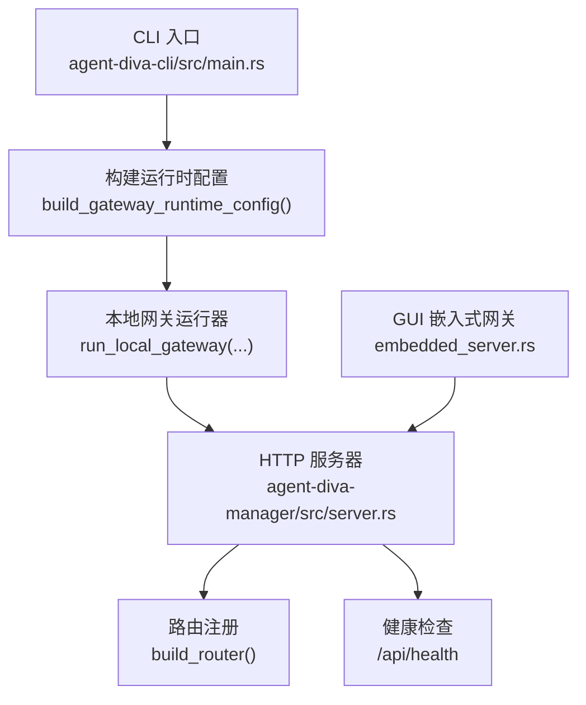
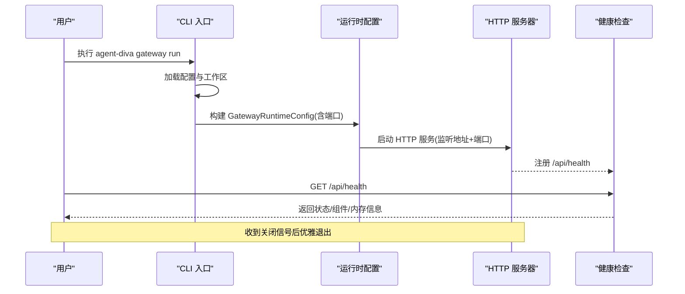
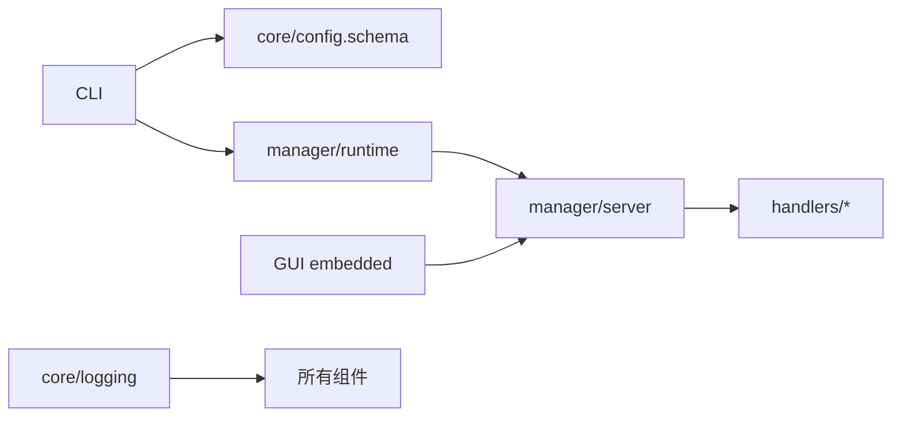

# Gateway 命令

<cite>
**本文引用的文件**
- [agent-diva-cli/src/main.rs](file://agent-diva-cli/src/main.rs)
- [agent-diva-core/src/config/schema.rs](file://agent-diva-core/src/config/schema.rs)
- [agent-diva-manager/src/server.rs](file://agent-diva-manager/src/server.rs)
- [agent-diva-manager/src/handlers/health.rs](file://agent-diva-manager/src/handlers/health.rs)
- [agent-diva-manager/src/runtime.rs](file://agent-diva-manager/src/runtime.rs)
- [agent-diva-manager/src/runtime/shutdown.rs](file://agent-diva-manager/src/runtime/shutdown.rs)
- [agent-diva-gui/src-tauri/src/embedded_server.rs](file://agent-diva-gui/src-tauri/src/embedded_server.rs)
- [agent-diva-gui/src-tauri/src/commands.rs](file://agent-diva-gui/src-tauri/src/commands.rs)
- [agent-diva-core/src/logging.rs](file://agent-diva-core/src/logging.rs)
- [contrib/systemd/agent-diva.service](file://contrib/systemd/agent-diva.service)
- [contrib/launchd/com.agent-diva.gateway.plist](file://contrib/launchd/com.agent-diva.gateway.plist)
- [agent-diva-gui/src-tauri/resources/launchd/com.agent-diva.gateway.plist](file://agent-diva-gui/src-tauri/resources/launchd/com.agent-diva.gateway.plist)
</cite>

## 目录
1. [简介](#简介)
2. [项目结构](#项目结构)
3. [核心组件](#核心组件)
4. [架构总览](#架构总览)
5. [详细组件分析](#详细组件分析)
6. [依赖关系分析](#依赖关系分析)
7. [性能与可靠性](#性能与可靠性)
8. [故障排查指南](#故障排查指南)
9. [结论](#结论)
10. [附录](#附录)

## 简介
本文件面向“Gateway 命令”的使用与部署，重点说明 gateway run 子命令的语法、功能与生产环境最佳实践。内容覆盖：
- 启动参数、配置文件加载、端口绑定与日志级别设置
- 健康检查与服务监控
- 优雅关闭与企业级运维
- 与 GUI 嵌入模式、系统服务（systemd/launchd）集成方式
- 网络与安全配置建议

## 项目结构
Gateway 命令由 CLI 入口触发，构建运行时配置后调用本地网关运行器；HTTP 服务由 Manager 模块提供，包含路由、健康端点与优雅关闭能力。GUI 支持以嵌入式方式在进程内启动同一套运行时。

**图表来源**
- [agent-diva-cli/src/main.rs:986-1027](file://agent-diva-cli/src/main.rs#L986-L1027)
- [agent-diva-manager/src/server.rs:45-113](file://agent-diva-manager/src/server.rs#L45-L113)
- [agent-diva-gui/src-tauri/src/embedded_server.rs:72-143](file://agent-diva-gui/src-tauri/src/embedded_server.rs#L72-L143)

**章节来源**
- [agent-diva-cli/src/main.rs:986-1027](file://agent-diva-cli/src/main.rs#L986-L1027)
- [agent-diva-manager/src/server.rs:45-113](file://agent-diva-manager/src/server.rs#L45-L113)

## 核心组件
- CLI 命令与入口
  - gateway run 子命令：负责加载配置、校验模型提供者、构建运行时并启动本地网关。
  - 运行时配置：从配置中读取 gateway.port，并注入工作区、cron 存储路径等上下文。
- HTTP 服务器与路由
  - 基于 Axum 的 HTTP 服务，监听地址默认 127.0.0.1 与指定端口。
  - 路由聚合：聊天、会话、技能、MCP、计划、审计、健康等。
- 健康检查
  - /api/health 返回状态、版本、运行时长、组件就绪情况与内存健康信息。
- 日志系统
  - 按日滚动写入 gateway.log.*，支持 JSON/文本格式，可通过环境变量控制输出格式。
- 优雅关闭
  - 通过信号或 watch channel 触发 axum 优雅关闭，等待现有请求完成。
- GUI 嵌入式网关
  - 在 GUI 进程中以内嵌方式启动同一运行时，使用临时端口并通过健康检查确认就绪。

**章节来源**
- [agent-diva-cli/src/main.rs:986-1027](file://agent-diva-cli/src/main.rs#L986-L1027)
- [agent-diva-manager/src/server.rs:45-113](file://agent-diva-manager/src/server.rs#L45-L113)
- [agent-diva-manager/src/handlers/health.rs:1-42](file://agent-diva-manager/src/handlers/health.rs#L1-L42)
- [agent-diva-core/src/logging.rs:34-66](file://agent-diva-core/src/logging.rs#L34-L66)
- [agent-diva-gui/src-tauri/src/embedded_server.rs:72-143](file://agent-diva-gui/src-tauri/src/embedded_server.rs#L72-L143)

## 架构总览
Gateway 命令执行流程如下：
1. 解析命令行参数，进入 gateway run。
2. 加载配置与工作区上下文，校验模型提供者可用性。
3. 构建 GatewayRuntimeConfig（含端口、工作区、cron 存储等）。
4. 调用本地网关运行器启动 HTTP 服务与后台任务。
5. 通过 /api/health 暴露健康检查，供外部探针与 GUI 使用。
6. 收到关闭信号时，触发优雅关闭，停止接受新连接并等待请求完成。

**图表来源**
- [agent-diva-cli/src/main.rs:986-1027](file://agent-diva-cli/src/main.rs#L986-L1027)
- [agent-diva-manager/src/server.rs:45-113](file://agent-diva-manager/src/server.rs#L45-L113)
- [agent-diva-manager/src/handlers/health.rs:1-42](file://agent-diva-manager/src/handlers/health.rs#L1-L42)

## 详细组件分析

### 命令语法与行为
- 命令
  - agent-diva gateway run
- 行为
  - 加载配置与工作区，校验模型提供者是否存在。
  - 打印启动信息与引导提示。
  - 构建运行时配置并调用本地网关运行器。
  - 正常退出时打印“Gateway stopped.”。

**章节来源**
- [agent-diva-cli/src/main.rs:986-1027](file://agent-diva-cli/src/main.rs#L986-L1027)

### 启动参数与配置加载
- 配置来源
  - 配置文件中的 gateway.host 与 gateway.port。
  - 默认值：host=0.0.0.0，port=3000。
- 运行时注入
  - 将 port、config、workspace、cron_store 等注入到 GatewayRuntimeConfig。
- 端口生效验证
  - 测试用例确保当配置了自定义端口时，运行时使用该端口；未配置时保持默认端口。

**章节来源**
- [agent-diva-core/src/config/schema.rs:1350-1375](file://agent-diva-core/src/config/schema.rs#L1350-L1375)
- [agent-diva-cli/src/main.rs:986-1027](file://agent-diva-cli/src/main.rs#L986-L1027)
- [agent-diva-cli/src/main.rs:2600-2637](file://agent-diva-cli/src/main.rs#L2600-L2637)

### 端口绑定与网络配置
- 监听地址
  - 服务器默认绑定到 127.0.0.1 与配置的端口。
- 端口策略
  - 若未显式配置，则使用默认端口 3000。
  - GUI 嵌入式模式使用临时端口并在内部进行健康检查。
- 外部访问
  - 如需外部访问，可在反向代理前放置安全边界（如防火墙/Nginx），避免直接暴露 0.0.0.0。

**章节来源**
- [agent-diva-manager/src/server.rs:45-58](file://agent-diva-manager/src/server.rs#L45-L58)
- [agent-diva-gui/src-tauri/src/embedded_server.rs:72-143](file://agent-diva-gui/src-tauri/src/embedded_server.rs#L72-L143)

### 日志级别与输出
- 日志格式
  - 通过 LOG_FORMAT 环境变量设置为 json 或非 json。
- 日志文件
  - 使用每日滚动，文件名为 gateway.log.YYYY-MM-DD。
- GUI 日志面板
  - GUI 会读取配置目录下的日志文件并展示最近条目。

**章节来源**
- [agent-diva-core/src/logging.rs:34-66](file://agent-diva-core/src/logging.rs#L34-L66)
- [agent-diva-gui/src-tauri/src/commands.rs:7516-7523](file://agent-diva-gui/src-tauri/src/commands.rs#L7516-L7523)

### 健康检查与服务监控
- 健康端点
  - GET /api/health 返回 status、version、uptime_secs、components、memory。
- 心跳端点
  - GET /api/heartbeat 用于轻量探测。
- 组件就绪
  - 工作区存在性、审计写入器就绪、事件总线、定时任务等。

**章节来源**
- [agent-diva-manager/src/server.rs:371-382](file://agent-diva-manager/src/server.rs#L371-L382)
- [agent-diva-manager/src/handlers/health.rs:1-42](file://agent-diva-manager/src/handlers/health.rs#L1-L42)

### 优雅关闭与企业级特性
- 优雅关闭
  - 通过 axum 的 with_graceful_shutdown 接收关闭信号，停止接受新连接并等待请求完成。
- 信号源
  - 支持 Ctrl+C 或 manager 任务结束作为关闭条件。
- GUI 嵌入式关闭
  - 通过 watch channel 发送 true 触发关闭，并等待后台线程结束。

**章节来源**
- [agent-diva-manager/src/server.rs:76-91](file://agent-diva-manager/src/server.rs#L76-L91)
- [agent-diva-manager/src/runtime/shutdown.rs:21-35](file://agent-diva-manager/src/runtime/shutdown.rs#L21-L35)
- [agent-diva-gui/src-tauri/src/embedded_server.rs:40-67](file://agent-diva-gui/src-tauri/src/embedded_server.rs#L40-L67)

### 与其他组件的集成
- GUI 嵌入式网关
  - 在 GUI 进程内启动同一运行时，使用临时端口并通过健康检查确认就绪。
  - GUI 可保存/加载端口配置，便于后续启动。
- 系统服务
  - systemd 与 launchd 模板均使用 gateway run 子命令，便于守护进程管理。

**章节来源**
- [agent-diva-gui/src-tauri/src/embedded_server.rs:72-143](file://agent-diva-gui/src-tauri/src/embedded_server.rs#L72-L143)
- [contrib/systemd/agent-diva.service:1-28](file://contrib/systemd/agent-diva.service#L1-L28)
- [contrib/launchd/com.agent-diva.gateway.plist:1-31](file://contrib/launchd/com.agent-diva.gateway.plist#L1-L31)
- [agent-diva-gui/src-tauri/resources/launchd/com.agent-diva.gateway.plist:1-36](file://agent-diva-gui/src-tauri/resources/launchd/com.agent-diva.gateway.plist#L1-L36)

## 依赖关系分析
- CLI 依赖 core 的配置结构与工作区上下文。
- Manager 提供 HTTP 服务与路由，依赖 handlers 实现各业务接口。
- GUI 通过 embedded_server 复用 Manager 的运行能力，形成嵌入式网关。
- 日志系统统一由 core 提供，支持 JSON/文本与滚动策略。

**图表来源**
- [agent-diva-cli/src/main.rs:986-1027](file://agent-diva-cli/src/main.rs#L986-L1027)
- [agent-diva-manager/src/server.rs:45-113](file://agent-diva-manager/src/server.rs#L45-L113)
- [agent-diva-core/src/logging.rs:34-66](file://agent-diva-core/src/logging.rs#L34-L66)

**章节来源**
- [agent-diva-cli/src/main.rs:986-1027](file://agent-diva-cli/src/main.rs#L986-L1027)
- [agent-diva-manager/src/server.rs:45-113](file://agent-diva-manager/src/server.rs#L45-L113)
- [agent-diva-core/src/logging.rs:34-66](file://agent-diva-core/src/logging.rs#L34-L66)

## 性能与可靠性
- 性能
  - 日志采用非阻塞写入，减少 I/O 对主循环的影响。
  - HTTP 服务基于 Axum，具备高并发处理能力。
- 可靠性
  - 健康检查与心跳可用于负载均衡与健康探针。
  - 优雅关闭保证请求不丢失，提升服务稳定性。
  - 系统服务模板提供自动重启与资源限制，增强容错能力。

[本节为通用指导，无需具体文件引用]

## 故障排查指南
- 无法启动或端口冲突
  - 检查配置中的 gateway.port 是否被占用；必要时调整端口或使用 GUI 的动态端口策略。
- 健康检查失败
  - 确认 /api/health 与 /api/heartbeat 可达；检查组件就绪状态与内存健康字段。
- 日志缺失或格式异常
  - 检查 LOG_FORMAT 环境变量；确认日志目录与滚动文件名符合预期。
- 优雅关闭无效
  - 确认关闭信号已传递至 axum 的 graceful shutdown；检查 GUI 嵌入式模式的 watch channel 是否正确触发。

**章节来源**
- [agent-diva-manager/src/handlers/health.rs:1-42](file://agent-diva-manager/src/handlers/health.rs#L1-L42)
- [agent-diva-core/src/logging.rs:34-66](file://agent-diva-core/src/logging.rs#L34-L66)
- [agent-diva-manager/src/server.rs:76-91](file://agent-diva-manager/src/server.rs#L76-L91)
- [agent-diva-gui/src-tauri/src/embedded_server.rs:40-67](file://agent-diva-gui/src-tauri/src/embedded_server.rs#L40-L67)

## 结论
Gateway 命令提供了简洁的前台运行方式，配合完善的配置加载、端口绑定、健康检查与优雅关闭机制，适合开发与生产环境使用。通过 systemd/launchd 模板与 GUI 嵌入式模式，可实现跨平台的服务化部署与统一管理。建议在生产环境中结合反向代理、日志轮转与健康探针，确保服务的稳定与可观测性。

[本节为总结，无需具体文件引用]

## 附录

### 生产环境部署示例与最佳实践
- systemd 服务
  - 使用 contrib/systemd/agent-diva.service 模板，设置 ExecStart 为 gateway run。
  - 配置 Restart=on-failure 与 TimeoutStopSec，保障自动恢复与优雅退出。
  - 设置 RUST_LOG 与 AGENT_DIVA_CONFIG 环境变量，集中管理日志级别与配置路径。
- macOS launchd
  - 使用 contrib/launchd 或 GUI 内置模板，配置 ProgramArguments 为 gateway run。
  - 配置 StandardOutPath 与 StandardErrorPath 收集日志。
- 网络与安全
  - 默认监听 127.0.0.1，仅本机访问；如需外网访问，请通过反向代理与防火墙策略控制。
  - 建议使用最小权限账户运行服务，限制文件系统读写路径。

**章节来源**
- [contrib/systemd/agent-diva.service:1-28](file://contrib/systemd/agent-diva.service#L1-L28)
- [contrib/launchd/com.agent-diva.gateway.plist:1-31](file://contrib/launchd/com.agent-diva.gateway.plist#L1-L31)
- [agent-diva-gui/src-tauri/resources/launchd/com.agent-diva.gateway.plist:1-36](file://agent-diva-gui/src-tauri/resources/launchd/com.agent-diva.gateway.plist#L1-L36)

### 常用命令与验证
- 启动网关
  - agent-diva gateway run
- 健康检查
  - curl http://127.0.0.1:<port>/api/health
- 查看日志
  - 检查 logs 目录下的 gateway.log.<date> 文件，或通过 GUI 的日志面板刷新查看。

**章节来源**
- [agent-diva-cli/src/main.rs:986-1027](file://agent-diva-cli/src/main.rs#L986-L1027)
- [agent-diva-manager/src/server.rs:371-382](file://agent-diva-manager/src/server.rs#L371-L382)
- [agent-diva-core/src/logging.rs:34-66](file://agent-diva-core/src/logging.rs#L34-L66)