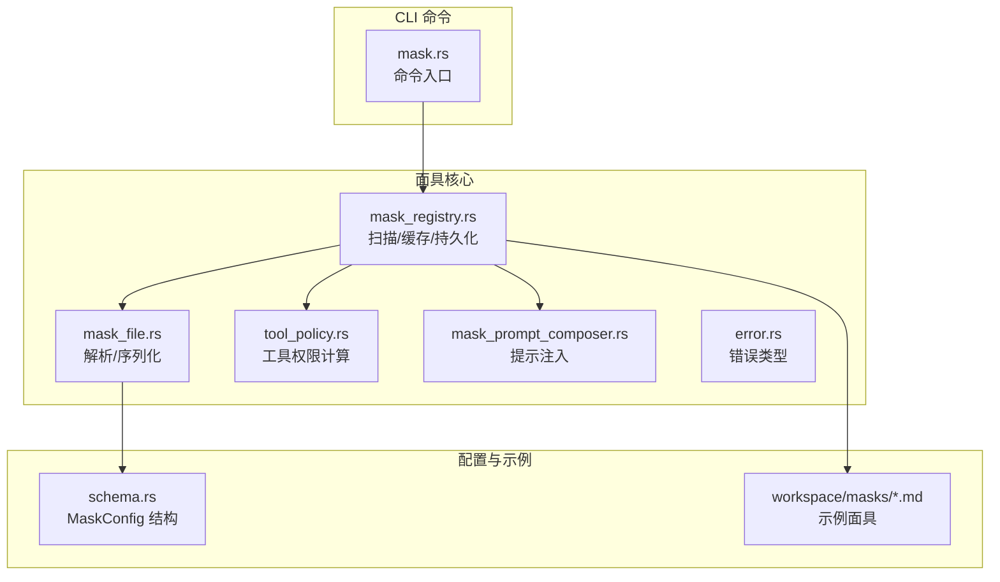
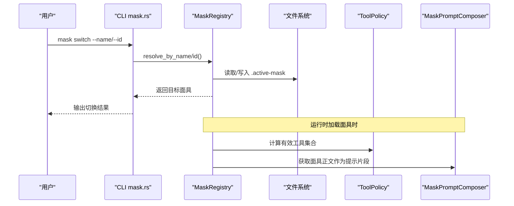
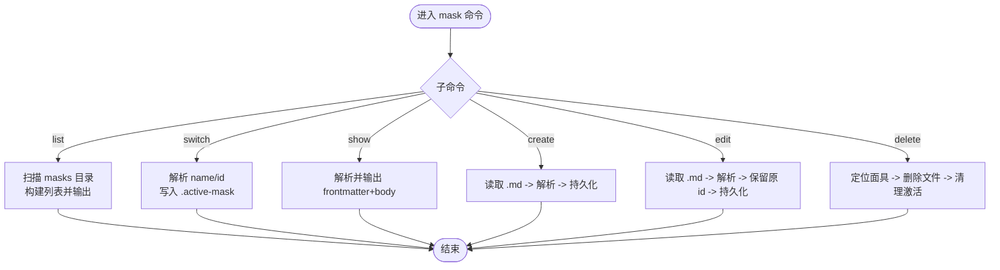
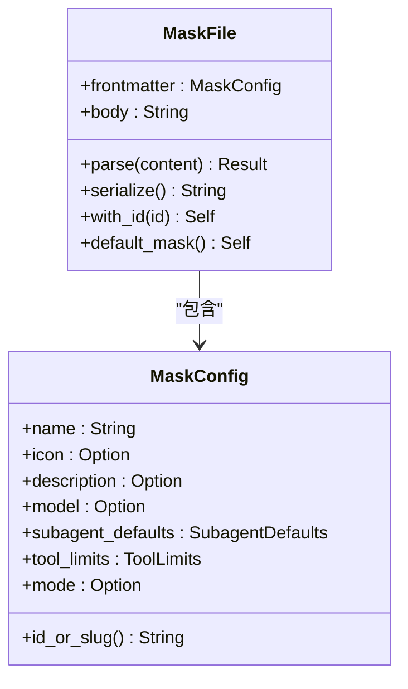
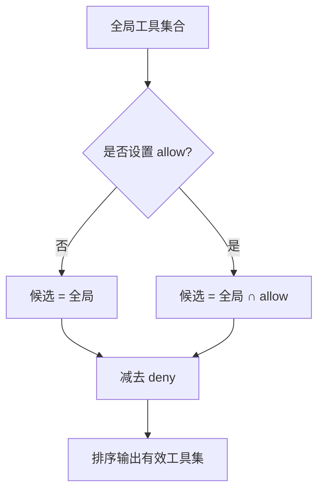
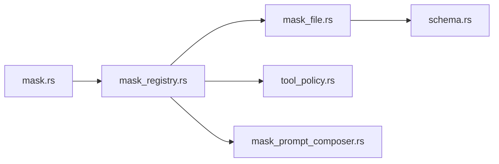

# 面具命令文档

<cite>
**本文档引用的文件**
- [mask.rs](file://agent-diva-cli/src/commands/mask.rs)
- [mod.rs](file://agent-diva-agent/src/mask/mod.rs)
- [mask_file.rs](file://agent-diva-agent/src/mask/mask_file.rs)
- [mask_registry.rs](file://agent-diva-agent/src/mask/mask_registry.rs)
- [tool_policy.rs](file://agent-diva-agent/src/mask/tool_policy.rs)
- [error.rs](file://agent-diva-agent/src/mask/error.rs)
- [schema.rs](file://agent-diva-core/src/config/schema.rs)
- [assistant.md](file://workspace/masks/assistant.md)
- [coder.md](file://workspace/masks/coder.md)
- [researcher.md](file://workspace/masks/researcher.md)
- [reviewer.md](file://workspace/masks/reviewer.md)
- [mask_commands.rs](file://agent-diva-cli/tests/mask_commands.rs)
</cite>

## 目录
1. [简介](#简介)
2. [项目结构](#项目结构)
3. [核心组件](#核心组件)
4. [架构总览](#架构总览)
5. [详细组件分析](#详细组件分析)
6. [依赖关系分析](#依赖关系分析)
7. [性能考虑](#性能考虑)
8. [故障排查指南](#故障排查指南)
9. [结论](#结论)
10. [附录](#附录)

## 简介
本文件面向“面具（Mask）”系统的命令行与运行时能力，系统通过 Markdown + YAML frontmatter 定义角色面具，控制模型选择、工具权限、系统提示注入等。本文档覆盖：
- 面具的创建、编辑、切换、删除、展示、列举等 CLI 命令
- 面具模板系统与角色定义
- 行为定制：工具白名单/黑名单、只读模式、子代理默认配置
- 高级特性：稳定 ID、冲突检测、持久化当前激活状态
- 协作相关：基于工作区共享的面具文件、版本管理建议与团队协作实践

## 项目结构
面具系统由 CLI 命令层、面具解析与注册表、工具策略与提示组合器组成，配合工作区下的面具文件实现可移植的角色配置。



图表来源
- [mask.rs:1-73](file://agent-diva-cli/src/commands/mask.rs#L1-L73)
- [mask_file.rs:1-116](file://agent-diva-agent/src/mask/mask_file.rs#L1-L116)
- [mask_registry.rs:1-242](file://agent-diva-agent/src/mask/mask_registry.rs#L1-L242)
- [tool_policy.rs:1-146](file://agent-diva-agent/src/mask/tool_policy.rs#L1-L146)
- [schema.rs:153-197](file://agent-diva-core/src/config/schema.rs#L153-L197)

章节来源
- [mask.rs:1-73](file://agent-diva-cli/src/commands/mask.rs#L1-L73)
- [mask_file.rs:1-116](file://agent-diva-agent/src/mask/mask_file.rs#L1-L116)
- [mask_registry.rs:1-242](file://agent-diva-agent/src/mask/mask_registry.rs#L1-L242)
- [tool_policy.rs:1-146](file://agent-diva-agent/src/mask/tool_policy.rs#L1-L146)
- [schema.rs:153-197](file://agent-diva-core/src/config/schema.rs#L153-L197)

## 核心组件
- 面具文件（MaskFile）：解析/序列化 Markdown + YAML frontmatter，提供默认面具与 ID 生成策略。
- 面具注册表（MaskRegistry）：扫描 masks 目录、维护内存缓存、持久化当前激活面具、支持创建/更新/删除/按名或 ID 切换。
- 工具策略（ToolPolicy）：根据全局可用工具与面具的 allow/deny 列表计算有效工具集；支持只读模式过滤。
- 提示组合器（MaskPromptComposer）：从面具正文提取系统提示并注入到对话上下文。
- 错误类型（MaskError）：统一描述未找到、重复名称、文件冲突、格式错误等。

章节来源
- [mask_file.rs:1-116](file://agent-diva-agent/src/mask/mask_file.rs#L1-L116)
- [mask_registry.rs:1-242](file://agent-diva-agent/src/mask/mask_registry.rs#L1-L242)
- [tool_policy.rs:1-146](file://agent-diva-agent/src/mask/tool_policy.rs#L1-L146)
- [error.rs:1-32](file://agent-diva-agent/src/mask/error.rs#L1-L32)

## 架构总览
面具系统以“文件即配置”为核心：用户在工作区的 masks 目录下维护 .md 面具文件，CLI 通过注册表进行 CRUD 与切换，运行时将面具的 frontmatter 与 body 用于模型与工具策略以及提示注入。



图表来源
- [mask.rs:100-129](file://agent-diva-cli/src/commands/mask.rs#L100-L129)
- [mask_registry.rs:117-128](file://agent-diva-agent/src/mask/mask_registry.rs#L117-L128)
- [tool_policy.rs:35-55](file://agent-diva-agent/src/mask/tool_policy.rs#L35-L55)
- [mask_prompt_composer.rs:12-33](file://agent-diva-agent/src/mask/mask_prompt_composer.rs#L12-L33)

## 详细组件分析

### CLI 命令：mask
- list：列出所有面具（包含默认面具），显示名称、图标、描述，并标注当前激活项。
- switch：按 name 或 id 切换面具；优先使用 id 切换以保证稳定性；写入 .active-mask。
- show：打印指定面具的 frontmatter 与正文；不传参时显示当前激活或默认面具。
- create：从本地 .md 文件创建面具；自动补全稳定 id 并持久化。
- edit：用新 .md 替换现有面具；保留原 id 避免路径变化。
- delete：按 name 或 id 删除面具；若删除的是当前激活面具，则清除激活状态。



图表来源
- [mask.rs:60-193](file://agent-diva-cli/src/commands/mask.rs#L60-L193)

章节来源
- [mask.rs:8-73](file://agent-diva-cli/src/commands/mask.rs#L8-L73)
- [mask.rs:75-193](file://agent-diva-cli/src/commands/mask.rs#L75-L193)

### 面具文件与模板系统
- 文件格式：Markdown 文件，YAML frontmatter 定义元数据，分隔符后为正文（系统提示）。
- 关键字段：
  - name：必填，显示名；DEFAULT_NAME 表示默认面具（无额外提示）。
  - icon/description：可选，UI 展示信息。
  - model/subagent_defaults：可选，覆盖模型与子代理默认参数。
  - tool_limits.allow/deny：可选，工具白名单/黑名单。
  - mode：可选，AgentMode，Assist 表示只读模式。
- 稳定 ID：若未显式设置 id，则根据 name 生成 URL-safe slug；非 ASCII 字符会哈希以避免冲突。



图表来源
- [mask_file.rs:10-116](file://agent-diva-agent/src/mask/mask_file.rs#L10-L116)
- [schema.rs:153-197](file://agent-diva-core/src/config/schema.rs#L153-L197)

章节来源
- [mask_file.rs:1-116](file://agent-diva-agent/src/mask/mask_file.rs#L1-L116)
- [schema.rs:153-197](file://agent-diva-core/src/config/schema.rs#L153-L197)

### 面具注册表与生命周期
- 扫描与缓存：递归扫描 masks 目录，解析 .md 并缓存；无效文件跳过并记录警告。
- 当前激活：通过 .active-mask 持久化当前面具的 name 或 id；重启后恢复。
- 操作：
  - switch_to / switch_to_by_id：切换并持久化；支持按 id 消歧。
  - create_or_update：写入文件并刷新缓存；存在冲突时拒绝覆盖。
  - delete：删除文件并清理激活状态；对默认面具不可删。
  - reload：重新扫描目录并重建缓存。

```mermaid
sequenceDiagram
participant REG as "MaskRegistry"
participant FS as "文件系统"
participant PAR as "MaskFile.parse"
REG->>FS : 扫描 masks 目录
loop 每个 .md
FS-->>REG : 内容
REG->>PAR : 解析 frontmatter
PAR-->>REG : MaskFile
REG->>REG : 加入缓存
end
Note over REG : 切换/创建/删除时写 .active-mask
```

图表来源
- [mask_registry.rs:248-327](file://agent-diva-agent/src/mask/mask_registry.rs#L248-L327)
- [mask_registry.rs:130-181](file://agent-diva-agent/src/mask/mask_registry.rs#L130-L181)
- [mask_registry.rs:183-228](file://agent-diva-agent/src/mask/mask_registry.rs#L183-L228)

章节来源
- [mask_registry.rs:1-242](file://agent-diva-agent/src/mask/mask_registry.rs#L1-L242)
- [mask_registry.rs:248-378](file://agent-diva-agent/src/mask/mask_registry.rs#L248-L378)

### 工具策略与权限控制
- 计算公式：effective = global ∩ allow − deny；未知工具名被忽略。
- 子代理继承：child ⊆ parent，确保子代理无法获得父代理之外的工具。
- 只读模式：当 mode=Assist 时，仅暴露安全读取工具（如 read_file、list_dir、web_search 等）。
- 实用方法：resolve、resolve_child、is_tool_allowed、filter_read_only_tools、is_read_only_mode。



图表来源
- [tool_policy.rs:35-55](file://agent-diva-agent/src/mask/tool_policy.rs#L35-L55)
- [tool_policy.rs:57-87](file://agent-diva-agent/src/mask/tool_policy.rs#L57-L87)
- [tool_policy.rs:113-145](file://agent-diva-agent/src/mask/tool_policy.rs#L113-L145)

章节来源
- [tool_policy.rs:1-146](file://agent-diva-agent/src/mask/tool_policy.rs#L1-L146)

### 提示注入与角色行为
- 默认面具不注入额外提示；自定义面具的非空正文将被注入为系统提示片段。
- 结合工具策略与模型覆盖，可实现不同角色的行为差异（如研究员受限工具、审查员只读模式）。

章节来源
- [mask_prompt_composer.rs:1-33](file://agent-diva-agent/src/mask/mask_prompt_composer.rs#L1-L33)

### 错误处理
- 常见错误：未找到面具、重复名称、文件冲突、非法 frontmatter、IO 失败。
- 在 CLI 层统一转换为 anyhow::Error 并输出可读信息。

章节来源
- [error.rs:1-32](file://agent-diva-agent/src/mask/error.rs#L1-L32)
- [mask.rs:260-263](file://agent-diva-cli/src/commands/mask.rs#L260-L263)

## 依赖关系分析
- CLI 依赖 MaskRegistry 完成面具的增删改查与切换。
- MaskRegistry 依赖 MaskFile 进行解析/序列化，依赖文件系统读写 .active-mask。
- ToolPolicy 与 MaskPromptComposer 在运行时消费面具配置，影响工具可见性与提示注入。
- schema.rs 提供 MaskConfig 的结构与 id_or_slug 生成逻辑。



图表来源
- [mask.rs:1-73](file://agent-diva-cli/src/commands/mask.rs#L1-L73)
- [mask_registry.rs:1-242](file://agent-diva-agent/src/mask/mask_registry.rs#L1-L242)
- [mask_file.rs:1-116](file://agent-diva-agent/src/mask/mask_file.rs#L1-L116)
- [tool_policy.rs:1-146](file://agent-diva-agent/src/mask/tool_policy.rs#L1-L146)
- [schema.rs:153-197](file://agent-diva-core/src/config/schema.rs#L153-L197)

章节来源
- [mask.rs:1-73](file://agent-diva-cli/src/commands/mask.rs#L1-L73)
- [mask_registry.rs:1-242](file://agent-diva-agent/src/mask/mask_registry.rs#L1-L242)

## 性能考虑
- 目录扫描与解析：首次启动或 reload 时会递归扫描 masks 目录并解析 .md 文件；建议在大型仓库中合理组织面具目录，避免过多无关文件。
- 缓存机制：注册表维护内存缓存，切换与查询为 O(1) 查找；新增/删除后需 reload。
- 工具策略计算：基于集合运算，复杂度与工具数量线性相关；结果排序保证确定性。
- I/O 优化：.active-mask 读写仅在切换/删除时发生；批量操作可通过一次 reload 减少多次磁盘访问。

[本节为通用指导，不直接分析具体文件]

## 故障排查指南
- 无法切换到面具：
  - 检查是否存在同名面具导致歧义，改用 --id 切换。
  - 确认 .active-mask 文件是否可写。
- 创建/编辑失败：
  - 检查 .md 文件的 frontmatter 是否合法（分隔符与 YAML 语法）。
  - 若出现文件冲突，说明目标路径已存在且归属其他面具，需调整 id 或名称。
- 工具不可用：
  - 检查面具的 tool_limits.allow/deny 是否正确配置。
  - 若处于 Assist 只读模式，仅允许安全读取工具。
- 提示未生效：
  - 确认面具正文非空；默认面具不会注入额外提示。

章节来源
- [mask.rs:195-258](file://agent-diva-cli/src/commands/mask.rs#L195-L258)
- [mask_registry.rs:130-181](file://agent-diva-agent/src/mask/mask_registry.rs#L130-L181)
- [tool_policy.rs:35-55](file://agent-diva-agent/src/mask/tool_policy.rs#L35-L55)
- [mask_prompt_composer.rs:12-33](file://agent-diva-agent/src/mask/mask_prompt_composer.rs#L12-L33)

## 结论
面具系统通过简洁的文件化配置实现了角色化行为控制，涵盖模型选择、工具权限、提示注入与只读模式等关键能力。CLI 提供了完整的生命周期管理，注册表保证了稳定的 ID 与持久化状态，工具策略确保了最小权限原则。推荐团队在工作区共享面具文件，结合版本控制进行协作与演进。

[本节为总结性内容，不直接分析具体文件]

## 附录

### 常用命令速查
- 列举面具：mask list
- 切换面具：mask switch --name <名> | --id <稳定ID>
- 查看面具：mask show [--name|--id]
- 创建面具：mask create --file <路径>
- 编辑面具：mask edit --name|--id --file <路径>
- 删除面具：mask delete --name|--id

章节来源
- [mask.rs:8-73](file://agent-diva-cli/src/commands/mask.rs#L8-L73)

### 面具模板与示例
- 助手：通用助手，无特殊限制。
- 程序员：专注代码编写与调试，遵循最佳实践。
- 研究员：限定工具（如搜索、读取），禁止终端与写入。
- 审查员：只读模式，仅允许读取与网络检索类工具。

章节来源
- [assistant.md:1-8](file://workspace/masks/assistant.md#L1-L8)
- [coder.md:1-8](file://workspace/masks/coder.md#L1-L8)
- [researcher.md:1-11](file://workspace/masks/researcher.md#L1-L11)
- [reviewer.md:1-12](file://workspace/masks/reviewer.md#L1-L12)

### 前端与测试参考
- 前端面板与卡片展示了面具的名称、图标、描述、模式标签与只读标识，便于可视化选择与管理。
- 集成测试覆盖了 list、switch、show、create、delete 等命令的行为验证。

章节来源
- [mask_commands.rs:52-252](file://agent-diva-cli/tests/mask_commands.rs#L52-L252)