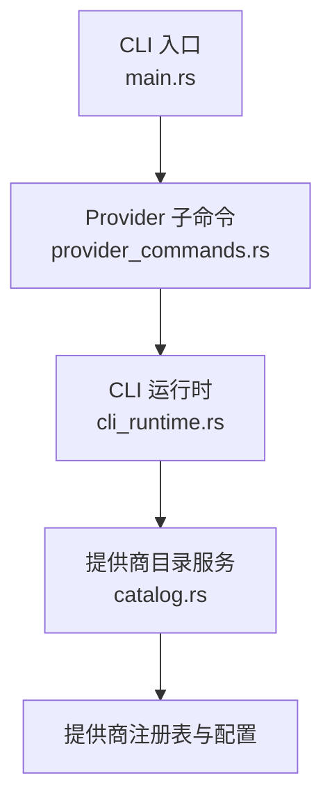
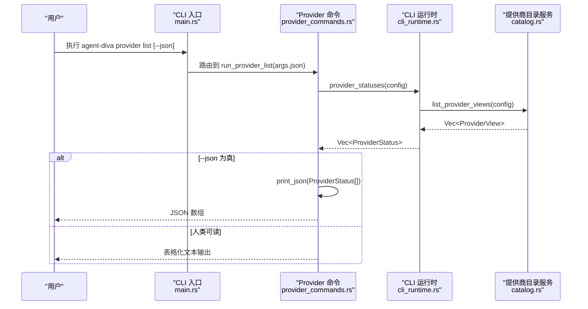
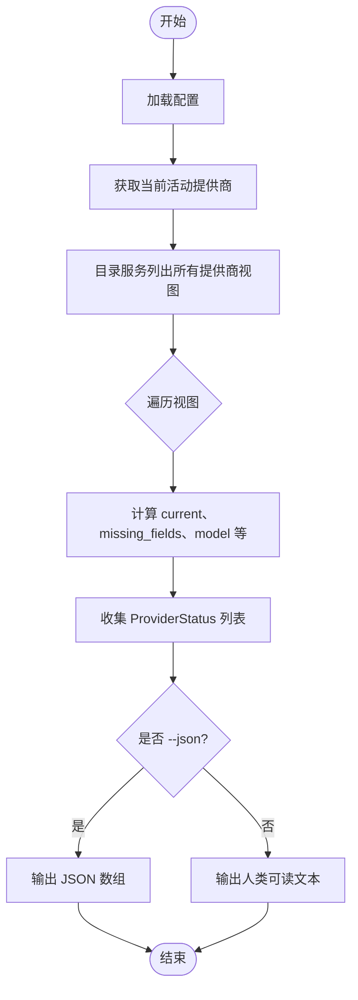
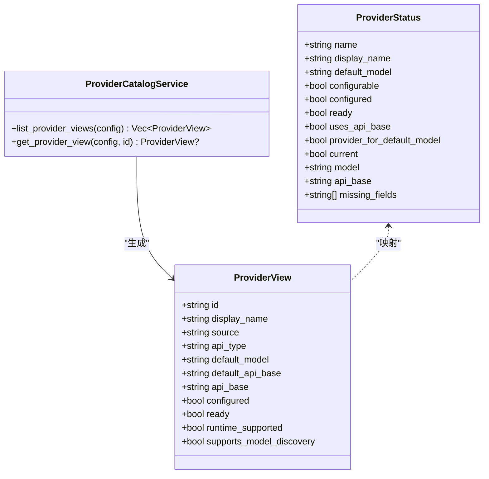
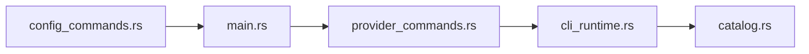

# Provider 列表命令

<cite>
**本文引用的文件**
- [agent-diva-cli/src/main.rs](file://agent-diva-cli/src/main.rs)
- [agent-diva-cli/src/provider_commands.rs](file://agent-diva-cli/src/provider_commands.rs)
- [agent-diva-cli/src/cli_runtime.rs](file://agent-diva-cli/src/cli_runtime.rs)
- [agent-diva-providers/src/catalog.rs](file://agent-diva-providers/src/catalog.rs)
- [agent-diva-cli/tests/config_commands.rs](file://agent-diva-cli/tests/config_commands.rs)
</cite>

## 目录
1. [简介](#简介)
2. [项目结构](#项目结构)
3. [核心组件](#核心组件)
4. [架构总览](#架构总览)
5. [详细组件分析](#详细组件分析)
6. [依赖关系分析](#依赖关系分析)
7. [性能考虑](#性能考虑)
8. [故障排除指南](#故障排除指南)
9. [结论](#结论)
10. [附录](#附录)

## 简介
本文件面向 agent-diva CLI 的 provider list 子命令，提供完整的使用说明与实现原理。内容包括：
- 命令语法、参数与输出格式（人类可读与 JSON）
- 如何查看所有已配置的 LLM 提供商及其名称、显示名、状态（已配置/缺少配置）、当前活动状态和默认模型信息
- --json 参数的使用方式与输出结构
- 常见使用场景与故障排除建议

## 项目结构
provider list 命令由 CLI 层解析参数并调用业务逻辑，最终通过提供商目录服务汇总视图数据并输出。关键路径如下：
- CLI 入口与命令分发：main.rs
- provider 子命令实现：provider_commands.rs
- CLI 运行时与数据结构：cli_runtime.rs
- 提供商目录与服务：catalog.rs
- 行为验证测试：config_commands.rs

图表来源
- [agent-diva-cli/src/main.rs:666-688](file://agent-diva-cli/src/main.rs#L666-L688)
- [agent-diva-cli/src/provider_commands.rs:25-52](file://agent-diva-cli/src/provider_commands.rs#L25-L52)
- [agent-diva-cli/src/cli_runtime.rs:517-554](file://agent-diva-cli/src/cli_runtime.rs#L517-L554)
- [agent-diva-providers/src/catalog.rs:82-99](file://agent-diva-providers/src/catalog.rs#L82-L99)

章节来源
- [agent-diva-cli/src/main.rs:666-688](file://agent-diva-cli/src/main.rs#L666-L688)
- [agent-diva-cli/src/provider_commands.rs:25-52](file://agent-diva-cli/src/provider_commands.rs#L25-L52)
- [agent-diva-cli/src/cli_runtime.rs:517-554](file://agent-diva-cli/src/cli_runtime.rs#L517-L554)
- [agent-diva-providers/src/catalog.rs:82-99](file://agent-diva-providers/src/catalog.rs#L82-L99)

## 核心组件
- 命令处理器：run_provider_list
  - 加载配置
  - 调用 provider_statuses 生成提供商状态列表
  - 根据 --json 决定输出为 JSON 或人类可读文本
- CLI 运行时：provider_statuses
  - 基于 ProviderCatalogService.list_provider_views 获取所有提供商视图
  - 计算当前活动提供商、缺失字段、是否使用 api_base 等
- 提供商目录服务：ProviderCatalogService
  - 聚合内置与自定义提供商视图
  - 提供 get_provider_view、list_provider_models 等能力
- 数据结构：
  - ProviderStatus（CLI 输出用）
  - ProviderView（目录服务内部视图）

章节来源
- [agent-diva-cli/src/provider_commands.rs:25-52](file://agent-diva-cli/src/provider_commands.rs#L25-L52)
- [agent-diva-cli/src/cli_runtime.rs:33-46](file://agent-diva-cli/src/cli_runtime.rs#L33-L46)
- [agent-diva-cli/src/cli_runtime.rs:517-554](file://agent-diva-cli/src/cli_runtime.rs#L517-L554)
- [agent-diva-providers/src/catalog.rs:25-37](file://agent-diva-providers/src/catalog.rs#L25-L37)

## 架构总览
下图展示了从 CLI 到提供商目录服务的调用链，以及数据在运行时的流转过程。

图表来源
- [agent-diva-cli/src/main.rs:666-688](file://agent-diva-cli/src/main.rs#L666-L688)
- [agent-diva-cli/src/provider_commands.rs:25-52](file://agent-diva-cli/src/provider_commands.rs#L25-L52)
- [agent-diva-cli/src/cli_runtime.rs:517-554](file://agent-diva-cli/src/cli_runtime.rs#L517-L554)
- [agent-diva-providers/src/catalog.rs:82-99](file://agent-diva-providers/src/catalog.rs#L82-L99)

## 详细组件分析

### 命令语法与参数
- 基本用法
  - agent-diva provider list
- 可选参数
  - --json：以 JSON 形式输出提供商列表
- 示例
  - 查看人类可读列表：agent-diva provider list
  - 查看 JSON 列表：agent-diva provider list --json

章节来源
- [agent-diva-cli/src/main.rs:666-688](file://agent-diva-cli/src/main.rs#L666-L688)
- [agent-diva-cli/src/provider_commands.rs:25-52](file://agent-diva-cli/src/provider_commands.rs#L25-L52)

### 人类可读输出格式
当未指定 --json 时，命令会打印一个标题行，然后逐条列出每个提供商的信息，包括：
- 名称与显示名
- 状态：已配置 / 缺少配置
- 当前活动标记：[active]
- 默认模型：若未设置则提示需要显式指定模型

输出要点：
- 每行包含提供商标识与显示名
- 下一行展示状态与默认模型
- 当前活动提供商会在名称后标注 [active]

章节来源
- [agent-diva-cli/src/provider_commands.rs:33-49](file://agent-diva-cli/src/provider_commands.rs#L33-L49)

### JSON 输出结构与模式
当指定 --json 时，命令输出一个 JSON 数组，每个元素对应一个提供商的状态对象。字段定义如下：

- name: 字符串，提供商的内部标识名
- display_name: 字符串，用于显示的友好名称
- default_model: 字符串或空，提供商的默认模型；若为空表示需要显式指定
- configurable: 布尔值，是否可配置
- configured: 布尔值，是否已配置完成
- ready: 布尔值，是否处于就绪状态
- uses_api_base: 布尔值，是否使用 api_base 认证方式
- provider_for_default_model: 布尔值，是否为当前默认模型所属的提供商
- current: 布尔值，是否为当前活动提供商
- model: 字符串或空，当前活动提供商对应的模型
- api_base: 字符串或空，提供商的 API Base 地址
- missing_fields: 字符串数组，缺失的配置字段列表（如 api_key、api_base）

JSON 模式（概念性描述）：
- 根类型为数组
- 数组元素为对象，包含上述字段
- 布尔字段表示状态与开关
- 字符串字段可能为空
- 数组字段为缺失字段列表

章节来源
- [agent-diva-cli/src/cli_runtime.rs:33-46](file://agent-diva-cli/src/cli_runtime.rs#L33-L46)
- [agent-diva-cli/src/provider_commands.rs:25-52](file://agent-diva-cli/src/provider_commands.rs#L25-L52)
- [agent-diva-cli/tests/config_commands.rs:112-139](file://agent-diva-cli/tests/config_commands.rs#L112-L139)

### 数据生成流程
provider list 的数据来源于 CLI 运行时的 provider_statuses 函数，该函数：
- 创建 ProviderCatalogService
- 获取当前活动提供商名称
- 遍历目录服务返回的所有 ProviderView
- 将每个视图转换为 ProviderStatus，补充 current、missing_fields、model 等信息
- 返回 ProviderStatus 列表供 CLI 输出

图表来源
- [agent-diva-cli/src/cli_runtime.rs:517-554](file://agent-diva-cli/src/cli_runtime.rs#L517-L554)
- [agent-diva-cli/src/provider_commands.rs:25-52](file://agent-diva-cli/src/provider_commands.rs#L25-L52)

章节来源
- [agent-diva-cli/src/cli_runtime.rs:517-554](file://agent-diva-cli/src/cli_runtime.rs#L517-L554)
- [agent-diva-cli/src/provider_commands.rs:25-52](file://agent-diva-cli/src/provider_commands.rs#L25-L52)

### 类与数据结构关系

图表来源
- [agent-diva-cli/src/cli_runtime.rs:33-46](file://agent-diva-cli/src/cli_runtime.rs#L33-L46)
- [agent-diva-providers/src/catalog.rs:25-37](file://agent-diva-providers/src/catalog.rs#L25-L37)
- [agent-diva-providers/src/catalog.rs:82-99](file://agent-diva-providers/src/catalog.rs#L82-L99)

章节来源
- [agent-diva-cli/src/cli_runtime.rs:33-46](file://agent-diva-cli/src/cli_runtime.rs#L33-L46)
- [agent-diva-providers/src/catalog.rs:25-37](file://agent-diva-providers/src/catalog.rs#L25-L37)
- [agent-diva-providers/src/catalog.rs:82-99](file://agent-diva-providers/src/catalog.rs#L82-L99)

## 依赖关系分析
- main.rs 负责命令分发，将 provider list 路由到 provider_commands.rs 的 run_provider_list
- provider_commands.rs 调用 cli_runtime.rs 的 provider_statuses 获取数据
- cli_runtime.rs 依赖 provider catalog 服务（catalog.rs）来聚合内置与自定义提供商视图
- tests/config_commands.rs 验证 JSON 输出中包含 registry 默认模型字段

图表来源
- [agent-diva-cli/src/main.rs:666-688](file://agent-diva-cli/src/main.rs#L666-L688)
- [agent-diva-cli/src/provider_commands.rs:25-52](file://agent-diva-cli/src/provider_commands.rs#L25-L52)
- [agent-diva-cli/src/cli_runtime.rs:517-554](file://agent-diva-cli/src/cli_runtime.rs#L517-L554)
- [agent-diva-providers/src/catalog.rs:82-99](file://agent-diva-providers/src/catalog.rs#L82-L99)
- [agent-diva-cli/tests/config_commands.rs:112-139](file://agent-diva-cli/tests/config_commands.rs#L112-L139)

章节来源
- [agent-diva-cli/src/main.rs:666-688](file://agent-diva-cli/src/main.rs#L666-L688)
- [agent-diva-cli/src/provider_commands.rs:25-52](file://agent-diva-cli/src/provider_commands.rs#L25-L52)
- [agent-diva-cli/src/cli_runtime.rs:517-554](file://agent-diva-cli/src/cli_runtime.rs#L517-L554)
- [agent-diva-providers/src/catalog.rs:82-99](file://agent-diva-providers/src/catalog.rs#L82-L99)
- [agent-diva-cli/tests/config_commands.rs:112-139](file://agent-diva-cli/tests/config_commands.rs#L112-L139)

## 性能考虑
- 列表操作主要涉及内存中的配置读取与视图构建，复杂度与提供商数量线性相关
- 不发起网络请求，因此响应时间受限于配置加载与序列化开销
- 大量自定义提供商时，排序与序列化仍保持高效

## 故障排除指南
常见问题与处理建议：
- 缺少配置导致状态为“缺少配置”
  - 检查 missing_fields 字段，确认是否需要设置 api_key 或 api_base
  - 使用 provider set 命令补充相应字段
- 未显示默认模型
  - 若 default_model 为空，需在使用时显式指定模型
- 当前活动提供商不正确
  - 检查 agents.defaults.provider 与 agents.defaults.model 的设置
  - 使用 provider set 更新默认提供商与模型
- JSON 输出异常
  - 确保使用 --json 参数
  - 校验输出是否符合前述 JSON 模式

章节来源
- [agent-diva-cli/src/provider_commands.rs:25-52](file://agent-diva-cli/src/provider_commands.rs#L25-L52)
- [agent-diva-cli/src/cli_runtime.rs:517-554](file://agent-diva-cli/src/cli_runtime.rs#L517-L554)
- [agent-diva-cli/tests/config_commands.rs:112-139](file://agent-diva-cli/tests/config_commands.rs#L112-L139)

## 结论
provider list 命令提供了对系统内所有 LLM 提供商的统一概览，支持人类可读与 JSON 两种输出格式。通过 --json 可以方便地在脚本或工具中消费结构化数据。结合 provider set 与 provider models 等命令，用户可以快速完成提供商配置与模型选择。

## 附录

### 常见使用场景
- 快速检查各提供商配置状态
  - 直接运行 provider list，观察状态与默认模型
- 在自动化脚本中消费提供商列表
  - 使用 provider list --json 并将结果传递给后续步骤
- 切换默认提供商与模型
  - 使用 provider set 指定提供商、模型与凭据

### JSON 输出示例（概念性）
以下为概念性示例，展示 JSON 数组的结构与字段含义：
- 数组项包含 name、display_name、default_model、configured、ready、current、model、api_base、missing_fields 等字段
- 若 default_model 为空，表示需要显式指定模型
- missing_fields 非空时，表明存在缺失的配置项

章节来源
- [agent-diva-cli/src/cli_runtime.rs:33-46](file://agent-diva-cli/src/cli_runtime.rs#L33-L46)
- [agent-diva-cli/tests/config_commands.rs:112-139](file://agent-diva-cli/tests/config_commands.rs#L112-L139)