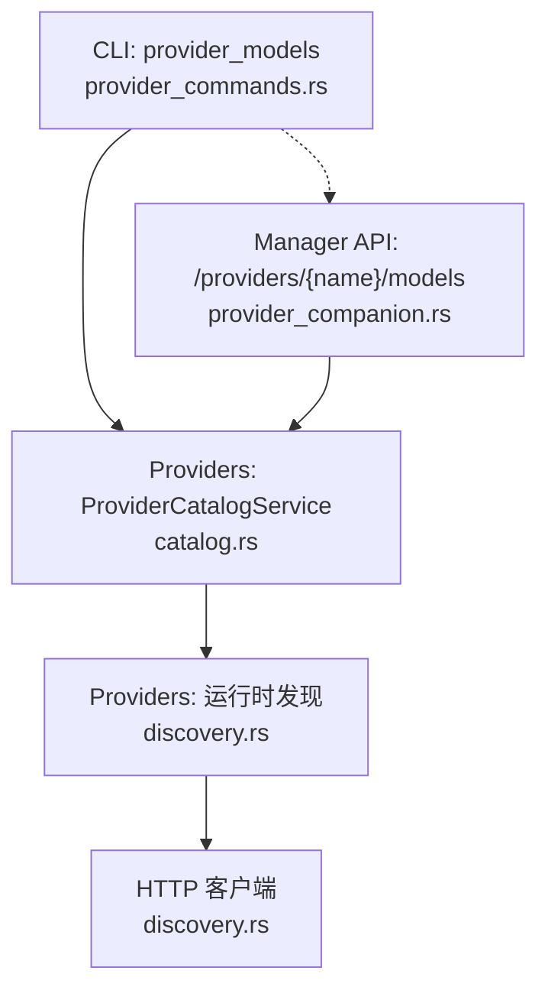
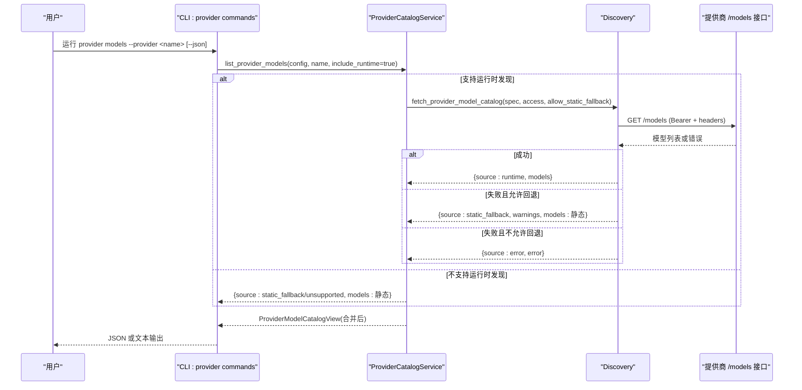
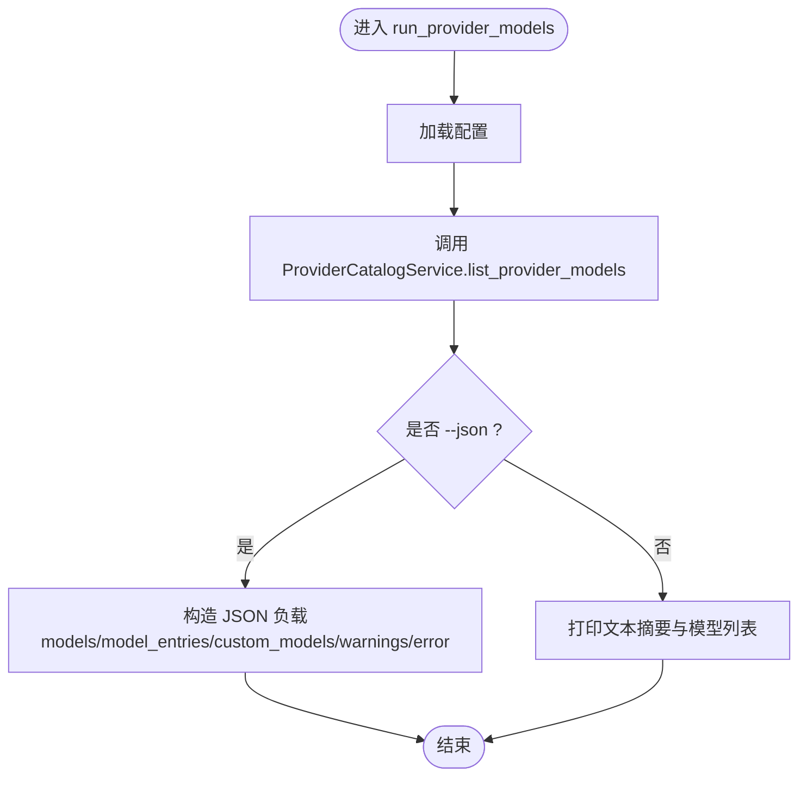
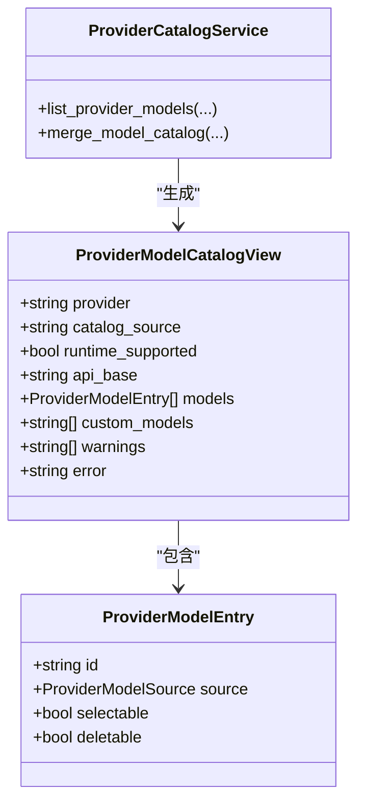
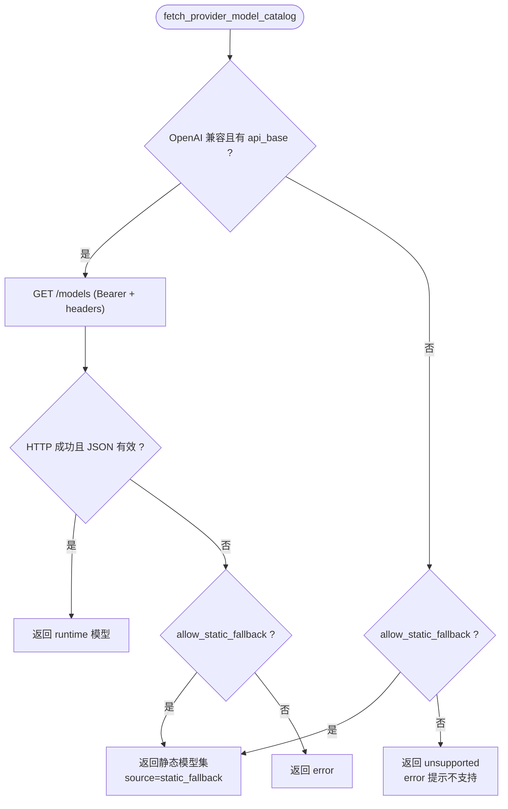
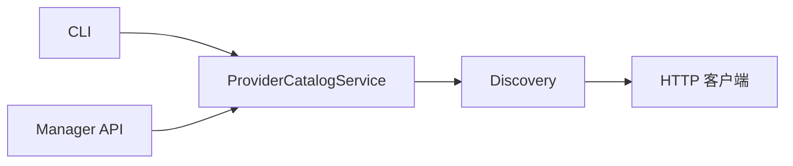

# Provider 模型查询命令

<cite>
**本文引用的文件**
- [agent-diva-cli/src/provider_commands.rs](file://agent-diva-cli/src/provider_commands.rs)
- [agent-diva-providers/src/catalog.rs](file://agent-diva-providers/src/catalog.rs)
- [agent-diva-providers/src/discovery.rs](file://agent-diva-providers/src/discovery.rs)
- [agent-diva-manager/src/handlers/provider_companion.rs](file://agent-diva-manager/src/handlers/provider_companion.rs)
- [agent-diva-cli/src/main.rs](file://agent-diva-cli/src/main.rs)
</cite>

## 目录
1. [简介](#简介)
2. [项目结构](#项目结构)
3. [核心组件](#核心组件)
4. [架构总览](#架构总览)
5. [详细组件分析](#详细组件分析)
6. [依赖关系分析](#依赖关系分析)
7. [性能与可靠性](#性能与可靠性)
8. [故障排查指南](#故障排查指南)
9. [结论](#结论)
10. [附录：JSON 输出结构与示例](#附录json-输出结构与示例)

## 简介
本文件面向“Provider 模型查询”能力，聚焦 CLI 子命令 provider models 的功能、数据流与 JSON 输出规范。该命令用于查询指定提供商支持的所有模型，并合并运行时发现、静态内置与自定义模型，返回统一视图。文档同时说明模型来源分类（runtime、static、custom）、元数据字段含义、错误与网络异常处理策略，以及不同提供商的示例输出与选择建议。

## 项目结构
围绕 provider models 的关键代码分布在以下模块：
- CLI 层：解析参数、调用服务、格式化输出（CLI 文本与 JSON）
- Providers 层：提供 ProviderCatalogService 与 discovery 逻辑，负责从运行时或静态源获取模型列表，并与自定义模型合并
- Manager 层：HTTP 处理器将请求转发到内部服务，并以统一结构返回结果

图表来源
- [agent-diva-cli/src/provider_commands.rs:177-233](file://agent-diva-cli/src/provider_commands.rs#L177-L233)
- [agent-diva-providers/src/catalog.rs:161-193](file://agent-diva-providers/src/catalog.rs#L161-L193)
- [agent-diva-providers/src/discovery.rs:63-143](file://agent-diva-providers/src/discovery.rs#L63-L143)
- [agent-diva-manager/src/handlers/provider_companion.rs:77-115](file://agent-diva-manager/src/handlers/provider_companion.rs#L77-L115)

章节来源
- [agent-diva-cli/src/provider_commands.rs:177-233](file://agent-diva-cli/src/provider_commands.rs#L177-L233)
- [agent-diva-providers/src/catalog.rs:161-193](file://agent-diva-providers/src/catalog.rs#L161-L193)
- [agent-diva-providers/src/discovery.rs:63-143](file://agent-diva-providers/src/discovery.rs#L63-L143)
- [agent-diva-manager/src/handlers/provider_companion.rs:77-115](file://agent-diva-manager/src/handlers/provider_companion.rs#L77-L115)

## 核心组件
- CLI 命令入口与输出：
  - 解析 provider、--json、--static-fallback 等参数
  - 调用 ProviderCatalogService.list_provider_models
  - 输出结构化 JSON 或人类可读文本
- ProviderCatalogService：
  - 根据 provider 名称查找规格
  - 决定是否启用运行时发现
  - 合并静态/运行时/自定义模型，去重并标注来源
- Discovery：
  - 对 OpenAI 兼容接口执行 GET /models 动态拉取
  - 失败时按 allow_static_fallback 回退到静态模型或报错
- Manager API：
  - 暴露 /providers/{name}/models?runtime=true|false
  - 统一返回 ProviderModelCatalogView

章节来源
- [agent-diva-cli/src/provider_commands.rs:177-233](file://agent-diva-cli/src/provider_commands.rs#L177-L233)
- [agent-diva-providers/src/catalog.rs:161-193](file://agent-diva-providers/src/catalog.rs#L161-L193)
- [agent-diva-providers/src/discovery.rs:63-143](file://agent-diva-providers/src/discovery.rs#L63-L143)
- [agent-diva-manager/src/handlers/provider_companion.rs:77-115](file://agent-diva-manager/src/handlers/provider_companion.rs#L77-L115)

## 架构总览
下图展示了从 CLI 到 Providers 再到外部 HTTP 的完整调用链，以及错误回退路径。

图表来源
- [agent-diva-cli/src/provider_commands.rs:177-233](file://agent-diva-cli/src/provider_commands.rs#L177-L233)
- [agent-diva-providers/src/catalog.rs:161-193](file://agent-diva-providers/src/catalog.rs#L161-L193)
- [agent-diva-providers/src/discovery.rs:63-143](file://agent-diva-providers/src/discovery.rs#L63-L143)
- [agent-diva-providers/src/discovery.rs:179-246](file://agent-diva-providers/src/discovery.rs#L179-L246)

## 详细组件分析

### CLI 命令 provider models
- 功能：查询指定 provider 的可用模型，支持 JSON 输出与静态回退开关。
- 关键流程：
  - 加载配置
  - 调用 ProviderCatalogService.list_provider_models(include_runtime=true)
  - 构建 JSON 负载，包含 provider、source/catalog_source、runtime_supported、api_base、models、model_entries、custom_models、warnings、error
  - 非 JSON 模式打印人类可读摘要与模型列表（含来源标签）

图表来源
- [agent-diva-cli/src/provider_commands.rs:177-233](file://agent-diva-cli/src/provider_commands.rs#L177-L233)

章节来源
- [agent-diva-cli/src/provider_commands.rs:177-233](file://agent-diva-cli/src/provider_commands.rs#L177-L233)

### ProviderCatalogService 模型目录合并
- 职责：
  - 解析 provider 规格
  - 决定 include_runtime 行为
  - 合并运行时/静态/自定义模型，去重并标注来源
  - 生成 ProviderModelCatalogView
- 关键点：
  - 当 include_runtime=false 时，直接返回静态模型集
  - 自定义模型来自配置项 custom_models（内建 provider）或 models（自定义 provider），标记为 custom，可删除
  - 运行时/静态模型标记为 selectable=true, deletable=false；自定义模型 deletable=true

图表来源
- [agent-diva-providers/src/catalog.rs:39-57](file://agent-diva-providers/src/catalog.rs#L39-L57)
- [agent-diva-providers/src/catalog.rs:389-435](file://agent-diva-providers/src/catalog.rs#L389-L435)

章节来源
- [agent-diva-providers/src/catalog.rs:161-193](file://agent-diva-providers/src/catalog.rs#L161-L193)
- [agent-diva-providers/src/catalog.rs:389-435](file://agent-diva-providers/src/catalog.rs#L389-L435)

### Discovery 运行时发现与回退
- 支持策略：
  - 仅 OpenAI 兼容类型且存在 api_base 时启用运行时发现
  - 通过 HTTP GET /models 拉取模型 ID 列表
- 错误与回退：
  - 网络/鉴权/响应格式错误会生成警告或错误信息
  - 若 allow_static_fallback=true 且存在静态模型，则回退到静态模型集，并将错误放入 warnings
  - 否则返回 error 并清空 models

图表来源
- [agent-diva-providers/src/discovery.rs:63-143](file://agent-diva-providers/src/discovery.rs#L63-L143)
- [agent-diva-providers/src/discovery.rs:179-246](file://agent-diva-providers/src/discovery.rs#L179-L246)

章节来源
- [agent-diva-providers/src/discovery.rs:63-143](file://agent-diva-providers/src/discovery.rs#L63-L143)
- [agent-diva-providers/src/discovery.rs:179-246](file://agent-diva-providers/src/discovery.rs#L179-L246)

### Manager API 端点
- 路由：/providers/{name}/models?runtime=true|false
- 行为：
  - 将请求转为内部命令并等待结果
  - 任何发送或接收错误均返回统一的 ProviderModelCatalogView，其中 catalog_source="error"，error 携带错误信息

章节来源
- [agent-diva-manager/src/handlers/provider_companion.rs:77-115](file://agent-diva-manager/src/handlers/provider_companion.rs#L77-L115)

## 依赖关系分析
- CLI 依赖 Providers 层的 ProviderCatalogService，后者依赖 discovery 进行网络访问
- Manager 作为中间层，将 HTTP 请求转换为内部命令并复用同一服务
- 对外部 HTTP 的超时、鉴权、响应格式均有健壮的错误封装

图表来源
- [agent-diva-cli/src/provider_commands.rs:177-233](file://agent-diva-cli/src/provider_commands.rs#L177-L233)
- [agent-diva-providers/src/catalog.rs:161-193](file://agent-diva-providers/src/catalog.rs#L161-L193)
- [agent-diva-providers/src/discovery.rs:179-246](file://agent-diva-providers/src/discovery.rs#L179-L246)
- [agent-diva-manager/src/handlers/provider_companion.rs:77-115](file://agent-diva-manager/src/handlers/provider_companion.rs#L77-L115)

章节来源
- [agent-diva-cli/src/provider_commands.rs:177-233](file://agent-diva-cli/src/provider_commands.rs#L177-L233)
- [agent-diva-providers/src/catalog.rs:161-193](file://agent-diva-providers/src/catalog.rs#L161-L193)
- [agent-diva-providers/src/discovery.rs:179-246](file://agent-diva-providers/src/discovery.rs#L179-L246)
- [agent-diva-manager/src/handlers/provider_companion.rs:77-115](file://agent-diva-manager/src/handlers/provider_companion.rs#L77-L115)

## 性能与可靠性
- 运行时发现使用带超时的 HTTP 客户端，避免长时间阻塞
- 去重逻辑使用集合保证模型列表唯一性，减少冗余
- 失败时优先回退到静态模型，提升可用性
- 自定义模型与运行时/静态模型合并，确保用户扩展能力不受影响

[本节为通用指导，不直接分析具体文件]

## 故障排查指南
- 常见错误来源：
  - 未配置 api_base：运行时发现无法发起请求
  - 鉴权失败：返回 401/403，会被记录为警告或错误
  - 网络不可达：请求失败，触发回退或错误
  - 响应非 JSON：解析失败，触发错误
- 诊断步骤：
  - 检查 provider 配置中的 api_base 与 api_key
  - 确认目标提供商暴露 /models 接口且可达
  - 查看返回的 warnings 与 error 字段定位问题
  - 如无需运行时发现，可通过关闭 include_runtime 或依赖静态回退

章节来源
- [agent-diva-providers/src/discovery.rs:179-246](file://agent-diva-providers/src/discovery.rs#L179-L246)
- [agent-diva-manager/src/handlers/provider_companion.rs:77-115](file://agent-diva-manager/src/handlers/provider_companion.rs#L77-L115)

## 结论
Provider 模型查询命令通过 CLI、Providers 服务与 Manager API 协同工作，提供统一的模型目录视图。它支持运行时发现、静态回退与自定义模型扩展，并通过清晰的 JSON 结构暴露来源、状态与错误信息，便于自动化与人工决策。

[本节为总结，不直接分析具体文件]

## 附录：JSON 输出结构与示例

### JSON 输出字段说明
- provider：提供商标识
- source/catalog_source：数据来源，可能为 runtime、static_fallback、unsupported、error
- runtime_supported：当前构建是否支持该提供商的运行时发现
- api_base：实际使用的 API 基地址
- models：模型 ID 数组（仅 ID）
- model_entries：模型条目数组，每个元素包含：
  - id：模型标识
  - source：来源，枚举值 runtime、static、custom
  - selectable：是否可选择
  - deletable：是否可删除（仅 custom 为 true）
- custom_models：自定义模型 ID 列表
- warnings：警告信息数组（例如运行时发现失败但回退到静态）
- error：错误信息（仅在失败路径出现）

章节来源
- [agent-diva-cli/src/provider_commands.rs:189-203](file://agent-diva-cli/src/provider_commands.rs#L189-L203)
- [agent-diva-providers/src/catalog.rs:39-57](file://agent-diva-providers/src/catalog.rs#L39-L57)
- [agent-diva-providers/src/catalog.rs:389-435](file://agent-diva-providers/src/catalog.rs#L389-L435)

### 典型场景与示例输出要点
- 场景 A：OpenAI 兼容提供商，运行时发现成功
  - source/catalog_source: "runtime"
  - runtime_supported: true
  - models 与 model_entries.source: "runtime"
  - warnings: []
  - error: null
- 场景 B：运行时发现失败，允许静态回退
  - source/catalog_source: "static_fallback"
  - runtime_supported: false
  - models 与 model_entries.source: "static"
  - warnings: 包含失败原因（如鉴权失败、网络错误）
  - error: null
- 场景 C：不支持运行时发现且无静态模型
  - source/catalog_source: "unsupported"
  - runtime_supported: false
  - models: []
  - error: 提示不支持
- 场景 D：自定义模型存在
  - custom_models: 用户配置的模型 ID 列表
  - model_entries 中对应 custom 来源，deletable: true

章节来源
- [agent-diva-providers/src/discovery.rs:63-143](file://agent-diva-providers/src/discovery.rs#L63-L143)
- [agent-diva-providers/src/catalog.rs:389-435](file://agent-diva-providers/src/catalog.rs#L389-L435)

### 模型选择建议
- 优先选择 runtime 来源的模型，反映最新可用列表
- 若 runtime 不可用，使用 static_fallback 的模型作为备选
- 如需特定私有模型，添加至 custom_models，并在 model_entries 中标记为 custom
- 对于不支持运行时发现的提供商，维护好静态模型列表以确保可用性

[本节为通用指导，不直接分析具体文件]