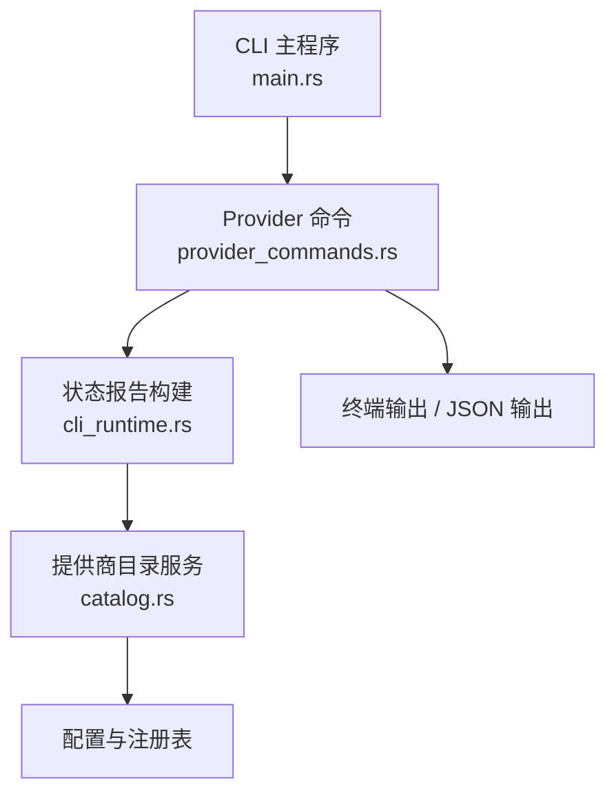
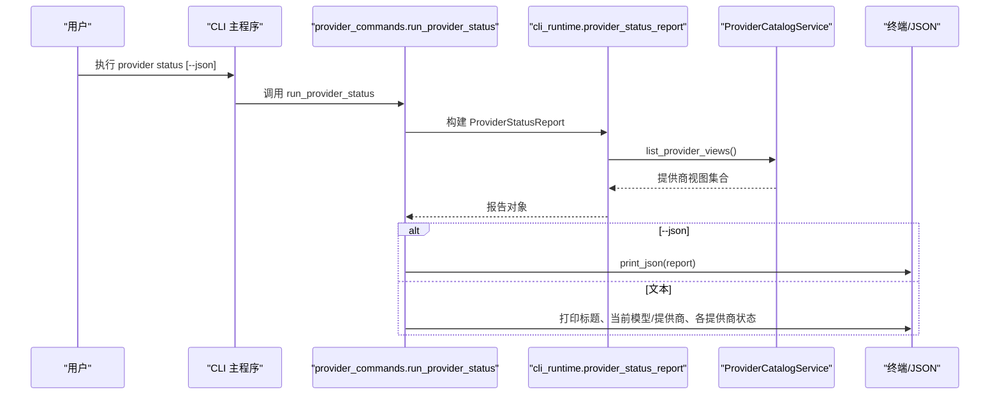
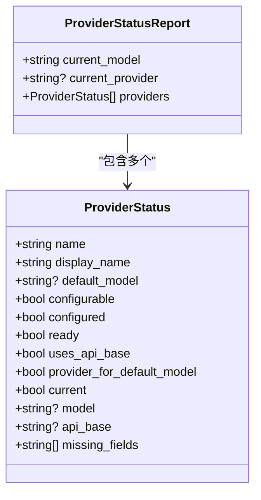
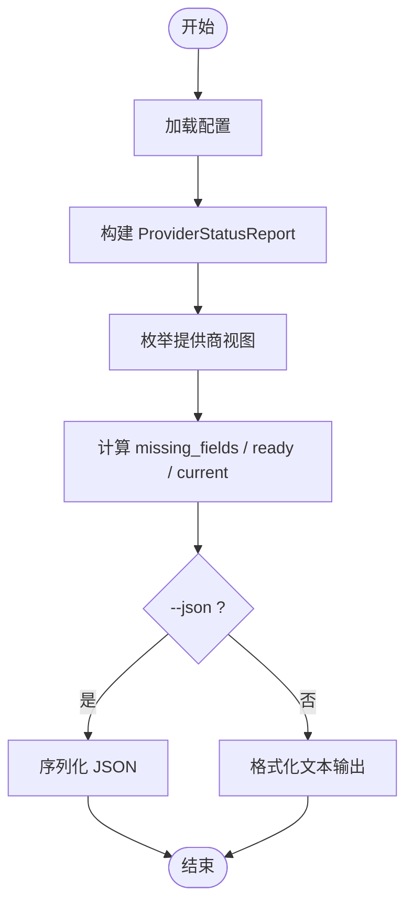

# Provider 状态命令

<cite>
**本文引用的文件**
- [agent-diva-cli/src/provider_commands.rs](file://agent-diva-cli/src/provider_commands.rs)
- [agent-diva-cli/src/cli_runtime.rs](file://agent-diva-cli/src/cli_runtime.rs)
- [agent-diva-cli/src/main.rs](file://agent-diva-cli/src/main.rs)
- [agent-diva-providers/src/catalog.rs](file://agent-diva-providers/src/catalog.rs)
- [agent-diva-manager/src/manager.rs](file://agent-diva-manager/src/manager.rs)
- [agent-diva-gui/src/api/desktop.ts](file://agent-diva-gui/src/api/desktop.ts)
</cite>

## 目录
1. [简介](#简介)
2. [项目结构](#项目结构)
3. [核心组件](#核心组件)
4. [架构总览](#架构总览)
5. [详细组件分析](#详细组件分析)
6. [依赖关系分析](#依赖关系分析)
7. [性能与可靠性](#性能与可靠性)
8. [故障诊断指南](#故障诊断指南)
9. [结论](#结论)
10. [附录：JSON 模式数据结构](#附录json-模式数据结构)

## 简介
本文件面向使用 CLI 的运维与开发者，详细说明 `provider status` 子命令的功能、输出格式与使用方法。该命令用于：
- 查看当前使用的提供商与模型
- 检查每个提供商的配置状态、缺失字段信息与默认模型设置
- 以人类可读或 JSON 格式输出结果，便于脚本化消费
- 辅助进行提供商连接性检查与故障定位

## 项目结构
`provider status` 的实现横跨 CLI 层、运行时工具函数与提供商目录服务：
- CLI 入口与命令分发：`agent-diva-cli/src/main.rs`
- 命令实现与输出渲染：`agent-diva-cli/src/provider_commands.rs`
- 状态报告构建与数据模型：`agent-diva-cli/src/cli_runtime.rs`
- 提供商视图与默认模型解析：`agent-diva-providers/src/catalog.rs`
- 管理器侧默认模型回退逻辑（影响最终选择）：`agent-diva-manager/src/manager.rs`
- GUI 前端类型定义（与 CLI JSON 结构一致）：`agent-diva-gui/src/api/desktop.ts`



**图表来源**
- [agent-diva-cli/src/main.rs:1628-1663](file://agent-diva-cli/src/main.rs#L1628-L1663)
- [agent-diva-cli/src/provider_commands.rs:54-88](file://agent-diva-cli/src/provider_commands.rs#L54-L88)
- [agent-diva-cli/src/cli_runtime.rs:470-554](file://agent-diva-cli/src/cli_runtime.rs#L470-L554)
- [agent-diva-providers/src/catalog.rs:126-168](file://agent-diva-providers/src/catalog.rs#L126-L168)

**章节来源**
- [agent-diva-cli/src/main.rs:1628-1663](file://agent-diva-cli/src/main.rs#L1628-L1663)
- [agent-diva-cli/src/provider_commands.rs:54-88](file://agent-diva-cli/src/provider_commands.rs#L54-L88)
- [agent-diva-cli/src/cli_runtime.rs:470-554](file://agent-diva-cli/src/cli_runtime.rs#L470-L554)
- [agent-diva-providers/src/catalog.rs:126-168](file://agent-diva-providers/src/catalog.rs#L126-L168)

## 核心组件
- 命令实现：`run_provider_status` 负责加载配置、生成状态报告并输出。支持 `--json` 开关切换为结构化输出。
- 状态报告：`ProviderStatusReport` 包含当前模型、当前提供商以及所有提供商的状态列表。
- 提供商状态：`ProviderStatus` 描述单个提供商是否就绪、缺失字段、默认模型、是否为当前提供商等。
- 提供商视图：通过 `ProviderCatalogService` 获取各提供商视图，包括 `configured`、`ready`、`default_model`、`api_base` 等。

**章节来源**
- [agent-diva-cli/src/provider_commands.rs:54-88](file://agent-diva-cli/src/provider_commands.rs#L54-L88)
- [agent-diva-cli/src/cli_runtime.rs:30-72](file://agent-diva-cli/src/cli_runtime.rs#L30-L72)
- [agent-diva-cli/src/cli_runtime.rs:470-554](file://agent-diva-cli/src/cli_runtime.rs#L470-L554)
- [agent-diva-providers/src/catalog.rs:126-168](file://agent-diva-providers/src/catalog.rs#L126-L168)

## 架构总览
`provider status` 的执行流程如下：
1. CLI 解析参数并调用 `run_provider_status`。
2. 从运行时加载配置。
3. 调用 `provider_status_report` 构建报告，其中包含：
   - 当前模型：来自配置默认值
   - 当前提供商：根据配置推断
   - 提供商列表：遍历目录服务返回的视图，计算缺失字段与就绪状态
4. 若启用 `--json`，直接序列化报告；否则按人类可读格式打印。



**图表来源**
- [agent-diva-cli/src/provider_commands.rs:54-88](file://agent-diva-cli/src/provider_commands.rs#L54-L88)
- [agent-diva-cli/src/cli_runtime.rs:470-554](file://agent-diva-cli/src/cli_runtime.rs#L470-L554)
- [agent-diva-providers/src/catalog.rs:126-168](file://agent-diva-providers/src/catalog.rs#L126-L168)

## 详细组件分析

### 命令实现与输出
- 文本输出：
  - 标题行显示“Provider Status”
  - 当前模型与当前提供商
  - 对每个提供商：
    - 名称与状态（就绪或缺失字段）
    - 缺失字段列表（如 `api_key`、`api_base`）
    - 默认模型（如有）
- JSON 输出：
  - 直接序列化 `ProviderStatusReport`，包含顶层字段与 `providers` 数组

**章节来源**
- [agent-diva-cli/src/provider_commands.rs:54-88](file://agent-diva-cli/src/provider_commands.rs#L54-L88)

### 状态报告构建
- `provider_status_report` 聚合：
  - `current_model`：来自配置默认模型
  - `current_provider`：推断当前提供商名
  - `providers`：由 `provider_statuses` 生成
- `provider_statuses` 遍历目录服务视图，计算：
  - `missing_fields`：当 `view.ready` 为假时，若 `api_base` 为空则标记缺失 `api_base`，否则标记缺失 `api_key`
  - `uses_api_base`：基于缺失字段判断是否使用 API Base
  - `current`：是否与当前提供商匹配
  - `model`：仅在提供商为当前时填充当前模型
  - `default_model`：来自提供商视图的默认模型

**章节来源**
- [agent-diva-cli/src/cli_runtime.rs:470-554](file://agent-diva-cli/src/cli_runtime.rs#L470-L554)

### 提供商视图与默认模型
- 目录服务提供 `list_provider_views`，返回各提供商的元数据与配置状态
- 默认模型解析策略：
  - 优先使用提供商视图中的 `default_model`
  - 其次尝试从全局默认模型推断提供商前缀
  - 最后回退到注册表查找
- 管理器侧在缺少显式模型时，会依次尝试：
  - 提供商视图默认模型
  - 提供商模型列表第一个可用模型
  - 最终回退到请求模型字符串

**章节来源**
- [agent-diva-providers/src/catalog.rs:126-168](file://agent-diva-providers/src/catalog.rs#L126-L168)
- [agent-diva-manager/src/manager.rs:219-241](file://agent-diva-manager/src/manager.rs#L219-L241)

### 类图：状态数据结构


**图表来源**
- [agent-diva-cli/src/cli_runtime.rs:30-72](file://agent-diva-cli/src/cli_runtime.rs#L30-L72)

## 依赖关系分析
- CLI 命令依赖运行时工具函数来构建报告
- 运行时工具函数依赖提供商目录服务获取视图
- 管理器侧逻辑影响默认模型选择，间接影响“当前模型”语义
- GUI 前端类型定义与 CLI JSON 结构保持一致，便于跨端消费

```mermaid
graph LR
CLI["CLI 命令"] --> RT["运行时工具"]
RT --> CAT["提供商目录服务"]
MAN["管理器默认模型回退"] --> |影响| RT
GUI["GUI 类型定义"] <- --> |结构一致| CLI
```

**图表来源**
- [agent-diva-cli/src/provider_commands.rs:54-88](file://agent-diva-cli/src/provider_commands.rs#L54-L88)
- [agent-diva-cli/src/cli_runtime.rs:470-554](file://agent-diva-cli/src/cli_runtime.rs#L470-L554)
- [agent-diva-providers/src/catalog.rs:126-168](file://agent-diva-providers/src/catalog.rs#L126-L168)
- [agent-diva-manager/src/manager.rs:219-241](file://agent-diva-manager/src/manager.rs#L219-L241)
- [agent-diva-gui/src/api/desktop.ts:147-160](file://agent-diva-gui/src/api/desktop.ts#L147-L160)

**章节来源**
- [agent-diva-cli/src/provider_commands.rs:54-88](file://agent-diva-cli/src/provider_commands.rs#L54-L88)
- [agent-diva-cli/src/cli_runtime.rs:470-554](file://agent-diva-cli/src/cli_runtime.rs#L470-L554)
- [agent-diva-providers/src/catalog.rs:126-168](file://agent-diva-providers/src/catalog.rs#L126-L168)
- [agent-diva-manager/src/manager.rs:219-241](file://agent-diva-manager/src/manager.rs#L219-L241)
- [agent-diva-gui/src/api/desktop.ts:147-160](file://agent-diva-gui/src/api/desktop.ts#L147-L160)

## 性能与可靠性
- 命令执行主要开销在于读取配置与枚举提供商视图，通常为轻量操作
- 缺失字段判定基于内存配置与视图元数据，不涉及网络 I/O
- 默认模型解析可能涉及注册表查询，但属于本地元数据访问
- 建议在批量环境中缓存提供商视图以减少重复开销（如需）

[本节为通用指导，不直接分析具体文件]

## 故障诊断指南
- 常见错误与提示：
  - 未配置提供商：状态显示“missing fields”，并列出缺失字段（如 `api_key` 或 `api_base`）
  - 无法解析当前提供商：当前提供商显示为“unresolved”
  - 未暴露默认模型的提供商：需要显式指定 `--model`
- 排查步骤：
  - 检查配置文件中的 `agents.defaults.provider` 与 `agents.defaults.model`
  - 确认提供商视图中的 `configured` 与 `ready` 标志
  - 核对缺失字段并按需补充（API Key 或 API Base）
  - 若默认模型缺失，参考管理器侧回退逻辑，确保提供商模型列表存在可用项

**章节来源**
- [agent-diva-cli/src/provider_commands.rs:54-88](file://agent-diva-cli/src/provider_commands.rs#L54-L88)
- [agent-diva-cli/src/cli_runtime.rs:470-554](file://agent-diva-cli/src/cli_runtime.rs#L470-L554)
- [agent-diva-manager/src/manager.rs:219-241](file://agent-diva-manager/src/manager.rs#L219-L241)

## 结论
`provider status` 提供了清晰的提供商配置与健康状态概览，既能满足日常巡检，也能作为自动化脚本的数据源。通过理解其数据模型与输出格式，用户可以快速定位缺失配置、默认模型问题与当前提供商选择逻辑。

[本节为总结，不直接分析具体文件]

## 附录：JSON 模式数据结构
- 顶层对象 `ProviderStatusReport`：
  - `current_model`: 字符串，当前模型
  - `current_provider`: 可选字符串，当前提供商名（可能为空）
  - `providers`: 数组，元素为 `ProviderStatus`
- 每个 `ProviderStatus` 对象字段含义：
  - `name`: 提供商标识
  - `display_name`: 显示名称
  - `default_model`: 可选字符串，提供商默认模型
  - `configurable`: 布尔，是否可配置
  - `configured`: 布尔，是否已配置
  - `ready`: 布尔，是否就绪（配置完整且可用）
  - `uses_api_base`: 布尔，是否使用 API Base（而非仅 API Key）
  - `provider_for_default_model`: 布尔，是否为默认模型来源提供商
  - `current`: 布尔，是否为当前激活的提供商
  - `model`: 可选字符串，当前提供商对应的模型（仅当前提供商时存在）
  - `api_base`: 可选字符串，API Base 地址
  - `missing_fields`: 字符串数组，缺失的配置字段（如 `api_key`、`api_base`）



**图表来源**
- [agent-diva-cli/src/provider_commands.rs:54-88](file://agent-diva-cli/src/provider_commands.rs#L54-L88)
- [agent-diva-cli/src/cli_runtime.rs:470-554](file://agent-diva-cli/src/cli_runtime.rs#L470-L554)

**章节来源**
- [agent-diva-cli/src/cli_runtime.rs:30-72](file://agent-diva-cli/src/cli_runtime.rs#L30-L72)
- [agent-diva-gui/src/api/desktop.ts:147-160](file://agent-diva-gui/src/api/desktop.ts#L147-L160)