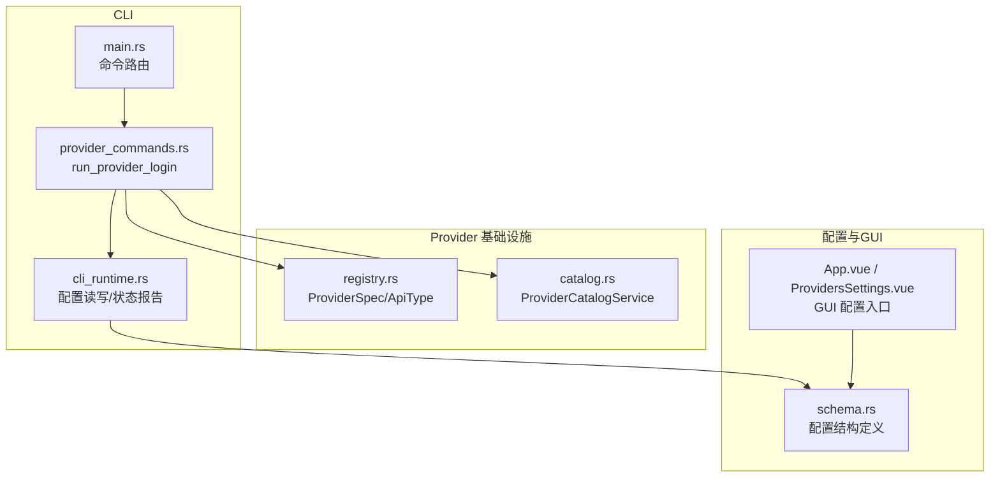
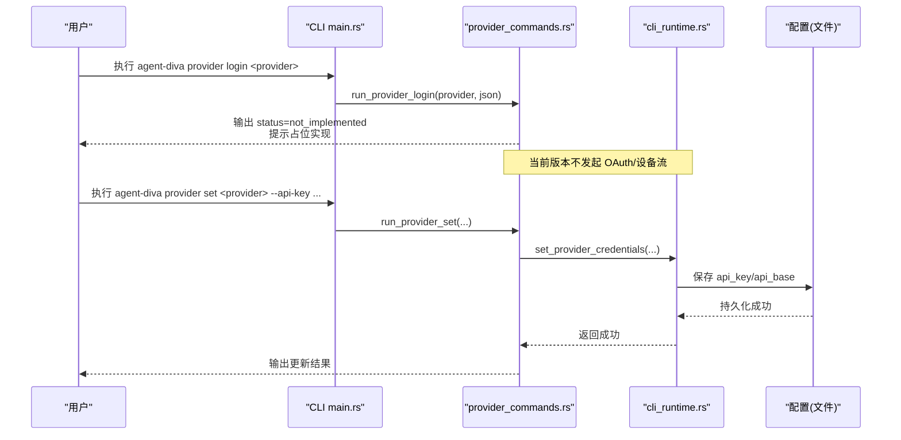
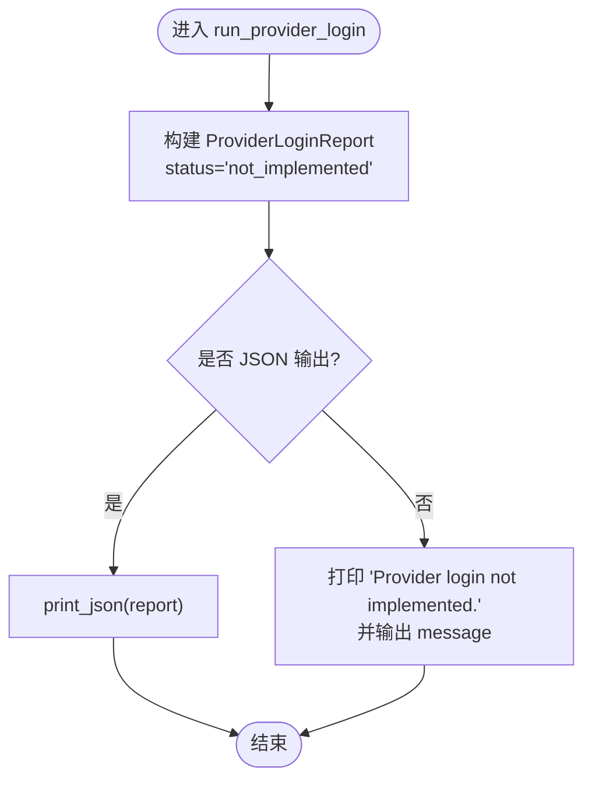
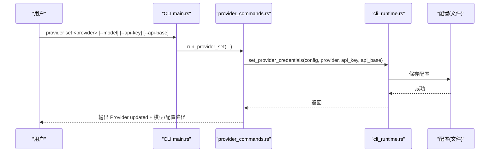
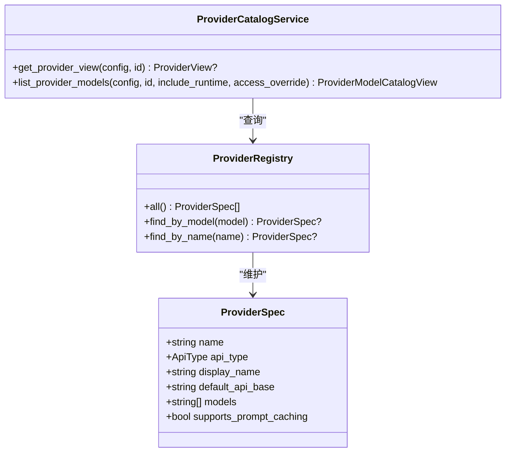
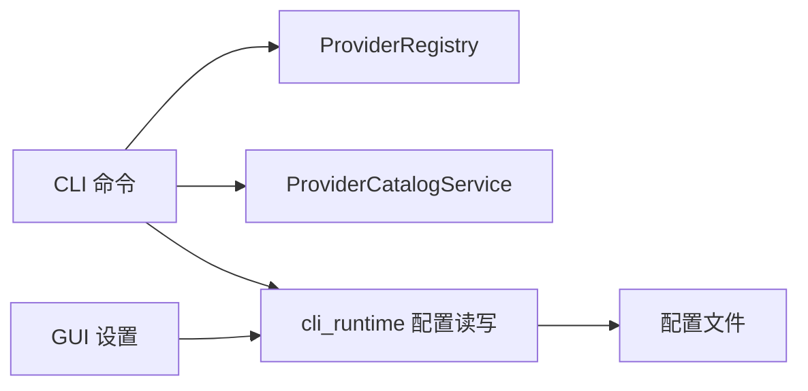

# Provider 登录命令

<cite>
**本文引用的文件**
- [agent-diva-cli/src/provider_commands.rs](file://agent-diva-cli/src/provider_commands.rs)
- [agent-diva-cli/src/main.rs](file://agent-diva-cli/src/main.rs)
- [agent-diva-providers/src/registry.rs](file://agent-diva-providers/src/registry.rs)
- [agent-diva-providers/src/catalog.rs](file://agent-diva-providers/src/catalog.rs)
- [agent-diva-core/src/config/schema.rs](file://agent-diva-core/src/config/schema.rs)
- [agent-diva-cli/src/cli_runtime.rs](file://agent-diva-cli/src/cli_runtime.rs)
- [agent-diva-gui/src/App.vue](file://agent-diva-gui/src/App.vue)
- [agent-diva-gui/src/components/settings/ProvidersSettings.vue](file://agent-diva-gui/src/components/settings/ProvidersSettings.vue)
- [agent-diva-providers/src/retry.rs](file://agent-diva-providers/src/retry.rs)
- [agent-diva-core/src/error_category.rs](file://agent-diva-core/src/error_category.rs)
</cite>

## 目录
1. [简介](#简介)
2. [项目结构](#项目结构)
3. [核心组件](#核心组件)
4. [架构总览](#架构总览)
5. [详细组件分析](#详细组件分析)
6. [依赖关系分析](#依赖关系分析)
7. [性能与可靠性](#性能与可靠性)
8. [故障排查指南](#故障排查指南)
9. [结论](#结论)
10. [附录：配置与替代方案](#附录：配置与替代方案)

## 简介
本文件聚焦于 CLI 的 provider login 子命令在当前仓库中的实现状态、功能限制、未来扩展方向，以及当前可用的替代认证方式（API Key）。同时提供不同提供商的认证方式对比、常见失败原因与解决方案，并给出如何为自定义提供商集成登录流程的技术指引。

## 项目结构
与 provider login 直接相关的代码主要分布在以下模块：
- CLI 命令层：负责解析参数、路由到具体处理函数、输出结构化结果或人类可读信息
- Provider 注册表与目录服务：维护提供商元数据、模型列表、访问能力等
- 配置与凭据管理：保存/读取提供商配置（如 API Key、API Base）
- GUI 设置界面：提供可视化配置入口（主要用于 API Key）

图表来源
- [agent-diva-cli/src/main.rs:680-690](file://agent-diva-cli/src/main.rs#L680-L690)
- [agent-diva-cli/src/provider_commands.rs:155-175](file://agent-diva-cli/src/provider_commands.rs#L155-L175)
- [agent-diva-providers/src/registry.rs:1-50](file://agent-diva-providers/src/registry.rs#L1-L50)
- [agent-diva-providers/src/catalog.rs:24-37](file://agent-diva-providers/src/catalog.rs#L24-L37)
- [agent-diva-core/src/config/schema.rs:1-60](file://agent-diva-core/src/config/schema.rs#L1-L60)
- [agent-diva-gui/src/App.vue:751-782](file://agent-diva-gui/src/App.vue#L751-L782)

章节来源
- [agent-diva-cli/src/main.rs:680-690](file://agent-diva-cli/src/main.rs#L680-L690)
- [agent-diva-cli/src/provider_commands.rs:155-175](file://agent-diva-cli/src/provider_commands.rs#L155-L175)
- [agent-diva-providers/src/registry.rs:1-50](file://agent-diva-providers/src/registry.rs#L1-L50)
- [agent-diva-providers/src/catalog.rs:24-37](file://agent-diva-providers/src/catalog.rs#L24-L37)
- [agent-diva-core/src/config/schema.rs:1-60](file://agent-diva-core/src/config/schema.rs#L1-L60)
- [agent-diva-gui/src/App.vue:751-782](file://agent-diva-gui/src/App.vue#L751-L782)

## 核心组件
- provider login 命令占位实现：当前返回“未实现”的状态，不执行任何 OAuth/设备流交互
- provider set 命令：用于写入提供商配置（API Key、API Base），是当前的主要认证手段
- Provider 注册表与目录服务：提供提供商元数据、默认模型、运行时能力等信息
- 配置与 GUI：通过 CLI 和 GUI 两种方式维护提供商配置

章节来源
- [agent-diva-cli/src/provider_commands.rs:155-175](file://agent-diva-cli/src/provider_commands.rs#L155-L175)
- [agent-diva-cli/src/provider_commands.rs:90-153](file://agent-diva-cli/src/provider_commands.rs#L90-L153)
- [agent-diva-providers/src/registry.rs:17-50](file://agent-diva-providers/src/registry.rs#L17-L50)
- [agent-diva-providers/src/catalog.rs:24-37](file://agent-diva-providers/src/catalog.rs#L24-L37)
- [agent-diva-gui/src/App.vue:751-782](file://agent-diva-gui/src/App.vue#L751-L782)

## 架构总览
下图展示了从 CLI 调用 provider login 到当前占位实现的完整路径，以及与 provider set、配置存储的关系。

图表来源
- [agent-diva-cli/src/main.rs:680-690](file://agent-diva-cli/src/main.rs#L680-L690)
- [agent-diva-cli/src/provider_commands.rs:155-175](file://agent-diva-cli/src/provider_commands.rs#L155-L175)
- [agent-diva-cli/src/provider_commands.rs:90-153](file://agent-diva-cli/src/provider_commands.rs#L90-L153)
- [agent-diva-cli/src/cli_runtime.rs:383-390](file://agent-diva-cli/src/cli_runtime.rs#L383-L390)

## 详细组件分析

### provider login 命令（当前实现）
- 行为：立即返回“未实现”，不发起浏览器授权、设备码获取或 token 交换
- 输出：JSON 包含 provider、status="not_implemented"、message；文本模式打印友好提示
- 影响：无法通过该命令完成 OAuth/设备流登录；需使用 provider set 或 GUI 配置 API Key

图表来源
- [agent-diva-cli/src/provider_commands.rs:155-175](file://agent-diva-cli/src/provider_commands.rs#L155-L175)

章节来源
- [agent-diva-cli/src/provider_commands.rs:155-175](file://agent-diva-cli/src/provider_commands.rs#L155-L175)

### provider set 命令（当前可用认证方式）
- 行为：选择/切换默认提供商与模型，并可写入 API Key、API Base
- 配置落点：通过 cli_runtime 的 set_provider_credentials 写入配置对象，再持久化到配置文件
- GUI 支持：GUI 设置页也允许输入 API Key，最终同样写入配置

图表来源
- [agent-diva-cli/src/provider_commands.rs:90-153](file://agent-diva-cli/src/provider_commands.rs#L90-L153)
- [agent-diva-cli/src/cli_runtime.rs:383-390](file://agent-diva-cli/src/cli_runtime.rs#L383-L390)
- [agent-diva-gui/src/App.vue:751-782](file://agent-diva-gui/src/App.vue#L751-L782)

章节来源
- [agent-diva-cli/src/provider_commands.rs:90-153](file://agent-diva-cli/src/provider_commands.rs#L90-L153)
- [agent-diva-cli/src/cli_runtime.rs:383-390](file://agent-diva-cli/src/cli_runtime.rs#L383-L390)
- [agent-diva-gui/src/App.vue:751-782](file://agent-diva-gui/src/App.vue#L751-L782)
- [agent-diva-gui/src/components/settings/ProvidersSettings.vue:1219-1246](file://agent-diva-gui/src/components/settings/ProvidersSettings.vue#L1219-L1246)

### Provider 注册表与目录服务
- registry.rs：集中声明提供商元数据（名称、API 类型、默认模型、默认 API Base、模型列表等）
- catalog.rs：提供 ProviderView、模型发现与合并、访问能力判断等能力，供 CLI 与 GUI 使用

图表来源
- [agent-diva-providers/src/registry.rs:17-50](file://agent-diva-providers/src/registry.rs#L17-L50)
- [agent-diva-providers/src/registry.rs:74-108](file://agent-diva-providers/src/registry.rs#L74-L108)
- [agent-diva-providers/src/catalog.rs:24-37](file://agent-diva-providers/src/catalog.rs#L24-L37)
- [agent-diva-providers/src/catalog.rs:161-193](file://agent-diva-providers/src/catalog.rs#L161-L193)

章节来源
- [agent-diva-providers/src/registry.rs:17-50](file://agent-diva-providers/src/registry.rs#L17-L50)
- [agent-diva-providers/src/registry.rs:74-108](file://agent-diva-providers/src/registry.rs#L74-L108)
- [agent-diva-providers/src/catalog.rs:24-37](file://agent-diva-providers/src/catalog.rs#L24-L37)
- [agent-diva-providers/src/catalog.rs:161-193](file://agent-diva-providers/src/catalog.rs#L161-L193)

### 配置与 GUI
- schema.rs：定义配置结构（包括沙箱、掩码等），提供商配置由 core 配置模块承载
- App.vue / ProvidersSettings.vue：GUI 中新增/编辑提供商时，可填写 API Key、API Base，并保存到 providers 或 custom_providers 区域

章节来源
- [agent-diva-core/src/config/schema.rs:1-60](file://agent-diva-core/src/config/schema.rs#L1-L60)
- [agent-diva-gui/src/App.vue:751-782](file://agent-diva-gui/src/App.vue#L751-L782)
- [agent-diva-gui/src/components/settings/ProvidersSettings.vue:1219-1246](file://agent-diva-gui/src/components/settings/ProvidersSettings.vue#L1219-L1246)

## 依赖关系分析
- CLI 命令层依赖 provider 注册表与目录服务以获取提供商元数据和模型列表
- 配置读写集中在 cli_runtime，provider set 通过它写入配置
- GUI 与 CLI 共享同一配置结构，确保配置一致性

图表来源
- [agent-diva-cli/src/provider_commands.rs:90-153](file://agent-diva-cli/src/provider_commands.rs#L90-L153)
- [agent-diva-cli/src/cli_runtime.rs:383-390](file://agent-diva-cli/src/cli_runtime.rs#L383-L390)
- [agent-diva-providers/src/registry.rs:74-108](file://agent-diva-providers/src/registry.rs#L74-L108)
- [agent-diva-providers/src/catalog.rs:161-193](file://agent-diva-providers/src/catalog.rs#L161-L193)

章节来源
- [agent-diva-cli/src/provider_commands.rs:90-153](file://agent-diva-cli/src/provider_commands.rs#L90-L153)
- [agent-diva-cli/src/cli_runtime.rs:383-390](file://agent-diva-cli/src/cli_runtime.rs#L383-L390)
- [agent-diva-providers/src/registry.rs:74-108](file://agent-diva-providers/src/registry.rs#L74-L108)
- [agent-diva-providers/src/catalog.rs:161-193](file://agent-diva-providers/src/catalog.rs#L161-L193)

## 性能与可靠性
- 当前 provider login 为占位实现，无网络开销
- provider set 仅写配置，I/O 成本极低
- 重试与错误分类在 provider 运行时层（HTTP 429/5xx 等），不影响登录命令本身

章节来源
- [agent-diva-providers/src/retry.rs:36-76](file://agent-diva-providers/src/retry.rs#L36-L76)

## 故障排查指南
- 登录失败（当前）：由于 provider login 未实现，任何调用都会返回“未实现”。请使用 provider set 或 GUI 配置 API Key
- 配置无效：检查是否正确设置了 API Key 与 API Base；可通过 provider status 查看缺失字段
- 运行时错误：若后续启用 OAuth/设备流，关注 HTTP 状态码与错误分类（429 限流、5xx 服务器错误等）
- 权限/认证错误：当出现 Unauthorized 等错误时，确认凭据有效且未被篡改

章节来源
- [agent-diva-cli/src/provider_commands.rs:155-175](file://agent-diva-cli/src/provider_commands.rs#L155-L175)
- [agent-diva-cli/src/provider_commands.rs:54-88](file://agent-diva-cli/src/provider_commands.rs#L54-L88)
- [agent-diva-providers/src/retry.rs:49-76](file://agent-diva-providers/src/retry.rs#L49-L76)
- [agent-diva-core/src/error_category.rs:95-110](file://agent-diva-core/src/error_category.rs#L95-L110)

## 结论
- 当前版本的 provider login 是占位实现，不会执行 OAuth 或设备流
- 推荐使用 provider set 或通过 GUI 配置 API Key 进行认证
- 未来可扩展为按提供商实现的统一登录流程，并与配置/状态报告解耦

## 附录：配置与替代方案

### 当前可用认证方式对比
- API Key（推荐）：通过 provider set 或 GUI 设置，简单可靠，适合大多数场景
- OAuth/设备流：当前未实现，计划在未来按提供商逐步落地

章节来源
- [agent-diva-cli/src/provider_commands.rs:90-153](file://agent-diva-cli/src/provider_commands.rs#L90-L153)
- [agent-diva-gui/src/App.vue:751-782](file://agent-diva-gui/src/App.vue#L751-L782)

### 不同提供商的认证方式
- 基于 OpenAI/Anthropic/Generic 兼容接口的提供商：当前通过 API Key 认证
- 未来可能引入 OAuth/设备流的提供商：将遵循统一登录契约（状态、字段、错误语义）

章节来源
- [agent-diva-providers/src/registry.rs:17-50](file://agent-diva-providers/src/registry.rs#L17-L50)
- [agent-diva-providers/src/catalog.rs:24-37](file://agent-diva-providers/src/catalog.rs#L24-L37)

### 配置指南（API Key）
- CLI：使用 provider set 指定提供商、模型、API Key、API Base
- GUI：在设置页面创建/编辑提供商，填写 API Key 与 API Base
- 验证：使用 provider status 检查是否 ready 与缺失字段

章节来源
- [agent-diva-cli/src/provider_commands.rs:90-153](file://agent-diva-cli/src/provider_commands.rs#L90-L153)
- [agent-diva-cli/src/provider_commands.rs:54-88](file://agent-diva-cli/src/provider_commands.rs#L54-L88)
- [agent-diva-gui/src/App.vue:751-782](file://agent-diva-gui/src/App.vue#L751-L782)

### 如何实现自定义提供商的登录流程集成（规划）
- 在 CLI 层增加对特定提供商的登录分支，区分 OAuth/设备流与 API Key
- 在 provider 基础设施层抽象登录协议（发现、回调、scope、存储模式）
- 在配置层分离“配置项”与“凭据存储”，避免将 token 写入用户配置
- 在状态报告中暴露 auth_mode、authenticated、credential_store、expires_at 等字段
- 保持 provider set 与 provider login 的职责解耦：set 只改配置，login 只做认证

章节来源
- [agent-diva-cli/src/provider_commands.rs:155-175](file://agent-diva-cli/src/provider_commands.rs#L155-L175)
- [agent-diva-providers/src/registry.rs:17-50](file://agent-diva-providers/src/registry.rs#L17-L50)
- [agent-diva-providers/src/catalog.rs:24-37](file://agent-diva-providers/src/catalog.rs#L24-L37)