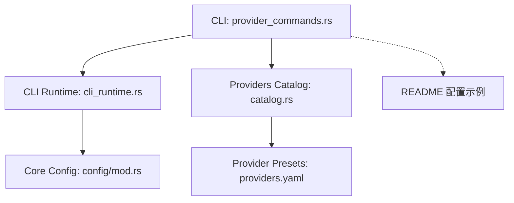
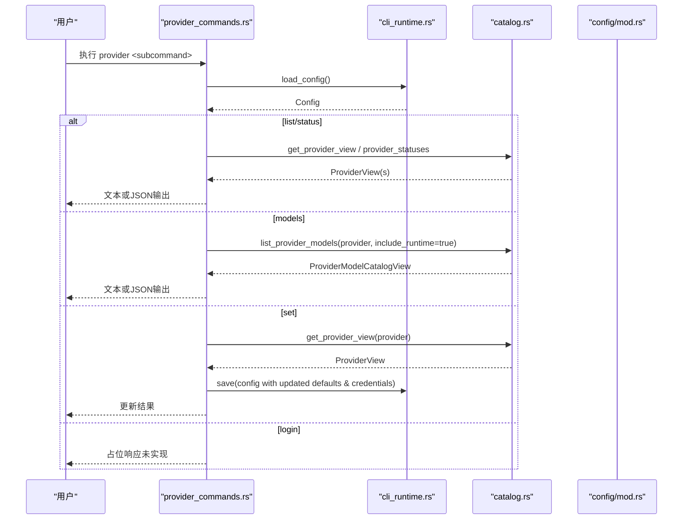
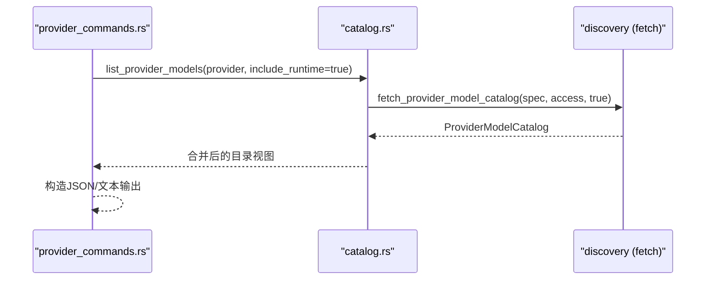
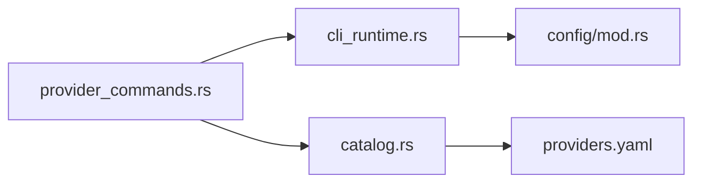

# Provider 管理命令

<cite>
**本文引用的文件**
- [agent-diva-cli/src/provider_commands.rs](file://agent-diva-cli/src/provider_commands.rs)
- [agent-diva-cli/src/cli_runtime.rs](file://agent-diva-cli/src/cli_runtime.rs)
- [agent-diva-providers/src/catalog.rs](file://agent-diva-providers/src/catalog.rs)
- [agent-diva-providers/src/providers.yaml](file://agent-diva-providers/src/providers.yaml)
- [agent-diva-core/src/config/mod.rs](file://agent-diva-core/src/config/mod.rs)
- [README.md](file://README.md)
</cite>

## 目录
1. [简介](#简介)
2. [项目结构](#项目结构)
3. [核心组件](#核心组件)
4. [架构总览](#架构总览)
5. [详细组件分析](#详细组件分析)
6. [依赖关系分析](#依赖关系分析)
7. [性能与可用性考虑](#性能与可用性考虑)
8. [故障诊断与连接测试](#故障诊断与连接测试)
9. [结论](#结论)
10. [附录：提供商配置示例与最佳实践](#附录提供商配置示例与最佳实践)

## 简介
本文件面向 Agent Diva 的 CLI 中 Provider 管理相关命令，系统性说明 provider list、provider status、provider set、provider models、provider login 等子命令的语法、参数与行为，覆盖 LLM 提供商的配置管理、模型查询、认证流程、状态检查与故障诊断。文档同时给出 OpenAI、Anthropic、Ollama（通过兼容端点）等常见提供商的配置示例与最佳实践，并解释 API Key 管理、Base URL 配置与模型选择策略。

## 项目结构
Provider 管理命令由 CLI 层实现，调用 providers 层的目录服务与发现能力，底层配置由 core 层加载与校验。关键路径如下：
- CLI 命令实现：agent-diva-cli/src/provider_commands.rs
- CLI 运行时与状态报告：agent-diva-cli/src/cli_runtime.rs
- Provider 目录与服务：agent-diva-providers/src/catalog.rs
- 内置提供商清单与默认值：agent-diva-providers/src/providers.yaml
- 配置加载与校验入口：agent-diva-core/src/config/mod.rs
- 用户指南与配置片段：README.md



图表来源
- [agent-diva-cli/src/provider_commands.rs:25-233](file://agent-diva-cli/src/provider_commands.rs#L25-L233)
- [agent-diva-cli/src/cli_runtime.rs:15-85](file://agent-diva-cli/src/cli_runtime.rs#L15-L85)
- [agent-diva-providers/src/catalog.rs:71-193](file://agent-diva-providers/src/catalog.rs#L71-L193)
- [agent-diva-providers/src/providers.yaml:1-120](file://agent-diva-providers/src/providers.yaml#L1-L120)
- [agent-diva-core/src/config/mod.rs:1-12](file://agent-diva-core/src/config/mod.rs#L1-L12)
- [README.md:150-200](file://README.md#L150-L200)

章节来源
- [agent-diva-cli/src/provider_commands.rs:25-233](file://agent-diva-cli/src/provider_commands.rs#L25-L233)
- [agent-diva-cli/src/cli_runtime.rs:15-85](file://agent-diva-cli/src/cli_runtime.rs#L15-L85)
- [agent-diva-providers/src/catalog.rs:71-193](file://agent-diva-providers/src/catalog.rs#L71-L193)
- [agent-diva-providers/src/providers.yaml:1-120](file://agent-diva-providers/src/providers.yaml#L1-L120)
- [agent-diva-core/src/config/mod.rs:1-12](file://agent-diva-core/src/config/mod.rs#L1-L12)
- [README.md:150-200](file://README.md#L150-L200)

## 核心组件
- Provider 命令处理器：提供 list/status/set/models/login 等子命令的实现与输出格式化。
- CLI 运行时：负责加载配置、生成 Provider 状态报告、保存配置变更。
- Provider 目录服务：聚合内置与自定义提供商视图，支持模型目录获取与合并。
- 提供商清单：以 YAML 定义各提供商的 API 类型、环境变量键、默认模型、默认 Base URL、模型列表等。
- 配置模块：统一加载、校验与持久化配置。

章节来源
- [agent-diva-cli/src/provider_commands.rs:25-233](file://agent-diva-cli/src/provider_commands.rs#L25-L233)
- [agent-diva-cli/src/cli_runtime.rs:15-85](file://agent-diva-cli/src/cli_runtime.rs#L15-L85)
- [agent-diva-providers/src/catalog.rs:71-193](file://agent-diva-providers/src/catalog.rs#L71-L193)
- [agent-diva-providers/src/providers.yaml:1-120](file://agent-diva-providers/src/providers.yaml#L1-L120)
- [agent-diva-core/src/config/mod.rs:1-12](file://agent-diva-core/src/config/mod.rs#L1-L12)

## 架构总览
Provider 管理命令的工作流：
- 读取当前配置（包含 agents.defaults.providers/model 与 providers.*）。
- 通过 ProviderCatalogService 获取提供商视图或模型目录。
- 对 set 操作进行校验与持久化；对 models 操作进行动态/静态模型合并；对 status/list 输出结构化报告。
- login 在当前构建中为占位实现，返回未实现提示。



图表来源
- [agent-diva-cli/src/provider_commands.rs:25-233](file://agent-diva-cli/src/provider_commands.rs#L25-L233)
- [agent-diva-cli/src/cli_runtime.rs:15-85](file://agent-diva-cli/src/cli_runtime.rs#L15-L85)
- [agent-diva-providers/src/catalog.rs:71-193](file://agent-diva-providers/src/catalog.rs#L71-L193)
- [agent-diva-core/src/config/mod.rs:1-12](file://agent-diva-core/src/config/mod.rs#L1-L12)

## 详细组件分析

### 子命令：provider list
- 功能：列出所有已知提供商及其配置就绪状态、是否当前激活、默认模型。
- 参数：
  - --json：输出 JSON 格式。
- 行为要点：
  - 从运行时加载配置后，计算提供商状态集合。
  - 非 JSON 模式以人类可读方式打印名称、显示名、状态、默认模型及是否当前激活。
  - JSON 模式直接输出提供商状态数组。

章节来源
- [agent-diva-cli/src/provider_commands.rs:25-52](file://agent-diva-cli/src/provider_commands.rs#L25-L52)
- [agent-diva-cli/src/cli_runtime.rs:32-46](file://agent-diva-cli/src/cli_runtime.rs#L32-L46)

### 子命令：provider status
- 功能：查看当前使用的模型与提供商，以及各提供商字段缺失情况与默认模型。
- 参数：
  - --json：输出 JSON 格式。
- 行为要点：
  - 生成 ProviderStatusReport，包含 current_model、current_provider 与各提供商的 missing_fields、default_model 等。
  - 非 JSON 模式逐条打印提供商状态与缺失字段。

章节来源
- [agent-diva-cli/src/provider_commands.rs:54-88](file://agent-diva-cli/src/provider_commands.rs#L54-L88)
- [agent-diva-cli/src/cli_runtime.rs:67-72](file://agent-diva-cli/src/cli_runtime.rs#L67-L72)

### 子命令：provider set
- 功能：设置默认提供商与模型，并可选更新 API Key/Base URL。
- 参数：
  - provider：目标提供商标识（需存在于内置或自定义提供商）。
  - --model：指定模型；若未提供则按优先级使用提供商默认模型或全局默认模型。
  - --api-key：设置或更新该提供商的 API Key。
  - --api-base：设置或更新该提供商的 Base URL。
  - --json：输出 JSON 格式。
- 行为要点：
  - 解析提供商视图，确定最终模型。
  - 更新 agents.defaults.provider 与 model。
  - 若提供商已存在则更新凭据；若是自定义提供商则更新 api_key/api_base。
  - 持久化配置并返回更新摘要（提供商、模型、配置文件路径、是否已配置、API Base）。

```mermaid
flowchart TD
Start(["进入 provider set"]) --> LoadCfg["加载配置"]
LoadCfg --> GetView{"获取提供商视图"}
GetView --> |成功| ResolveModel["解析模型<br/>优先级: --model > 提供商默认 > 全局默认"]
ResolveModel --> UpdateDefaults["更新 agents.defaults.provider/model"]
UpdateDefaults --> UpdateCreds{"提供商是否存在?"}
UpdateCreds --> |是| SetKeyBase["更新 api_key / api_base"]
UpdateCreds --> |否(自定义)| SetCustom["写入自定义提供商 api_key / api_base"]
SetKeyBase --> Save["保存配置"]
SetCustom --> Save
Save --> Report["输出更新报告(JSON/文本)"]
GetView --> |失败| Err["报错: 未知提供商"]
```

图表来源
- [agent-diva-cli/src/provider_commands.rs:90-153](file://agent-diva-cli/src/provider_commands.rs#L90-L153)

章节来源
- [agent-diva-cli/src/provider_commands.rs:90-153](file://agent-diva-cli/src/provider_commands.rs#L90-L153)

### 子命令：provider models
- 功能：列出某提供商可用模型，支持运行时发现与静态回退，并合并自定义模型。
- 参数：
  - provider：目标提供商标识。
  - --json：输出 JSON 格式。
  - --static-fallback：保留参数用于控制是否仅使用静态模型（内部实现中未使用）。
- 行为要点：
  - 通过 ProviderCatalogService.list_provider_models 获取目录，include_runtime=true。
  - 将运行时目录与静态目录、自定义模型合并，输出模型 ID 列表与元数据（来源、警告、错误等）。



图表来源
- [agent-diva-cli/src/provider_commands.rs:177-233](file://agent-diva-cli/src/provider_commands.rs#L177-L233)
- [agent-diva-providers/src/catalog.rs:161-193](file://agent-diva-providers/src/catalog.rs#L161-L193)

章节来源
- [agent-diva-cli/src/provider_commands.rs:177-233](file://agent-diva-cli/src/provider_commands.rs#L177-L233)
- [agent-diva-providers/src/catalog.rs:161-193](file://agent-diva-providers/src/catalog.rs#L161-L193)

### 子命令：provider login
- 功能：当前构建中的占位实现，返回“未实现”的状态与消息。
- 参数：
  - provider：目标提供商标识。
  - --json：输出 JSON 格式。
- 行为要点：
  - 固定返回 status=not_implemented 与提示信息，后续可按提供商实现 OAuth/设备码流程。

章节来源
- [agent-diva-cli/src/provider_commands.rs:155-175](file://agent-diva-cli/src/provider_commands.rs#L155-L175)

## 依赖关系分析
- CLI 命令依赖 CLI 运行时提供的配置加载与保存能力。
- 提供商视图与模型目录来自 providers 层的目录服务，后者基于内置注册表与 YAML 清单。
- 配置结构与校验由 core 层提供。



图表来源
- [agent-diva-cli/src/provider_commands.rs:25-233](file://agent-diva-cli/src/provider_commands.rs#L25-L233)
- [agent-diva-cli/src/cli_runtime.rs:15-85](file://agent-diva-cli/src/cli_runtime.rs#L15-L85)
- [agent-diva-providers/src/catalog.rs:71-193](file://agent-diva-providers/src/catalog.rs#L71-L193)
- [agent-diva-providers/src/providers.yaml:1-120](file://agent-diva-providers/src/providers.yaml#L1-L120)
- [agent-diva-core/src/config/mod.rs:1-12](file://agent-diva-core/src/config/mod.rs#L1-L12)

章节来源
- [agent-diva-cli/src/provider_commands.rs:25-233](file://agent-diva-cli/src/provider_commands.rs#L25-L233)
- [agent-diva-cli/src/cli_runtime.rs:15-85](file://agent-diva-cli/src/cli_runtime.rs#L15-L85)
- [agent-diva-providers/src/catalog.rs:71-193](file://agent-diva-providers/src/catalog.rs#L71-L193)
- [agent-diva-providers/src/providers.yaml:1-120](file://agent-diva-providers/src/providers.yaml#L1-L120)
- [agent-diva-core/src/config/mod.rs:1-12](file://agent-diva-core/src/config/mod.rs#L1-L12)

## 性能与可用性考虑
- 模型目录获取：当 include_runtime=true 时，会尝试从提供商接口拉取模型列表；网络不可达或限流会导致延迟与错误，建议结合缓存或降级到静态模型。
- 配置保存：set 操作会持久化配置，频繁调用可能带来 I/O 开销，建议在批量设置后统一保存。
- 输出格式：JSON 便于自动化处理；文本更适合交互式排查。

[本节为通用指导，不直接分析具体文件]

## 故障诊断与连接测试
- 使用 provider status 检查当前提供商与模型是否解析正确，查看 missing_fields 定位缺失配置项。
- 使用 provider list 快速识别哪些提供商处于“缺少配置”状态。
- 使用 provider models 验证提供商是否可访问：
  - 若返回空模型且无错误，可能是提供商不支持运行时发现或网络受限。
  - 若返回错误信息，根据错误内容调整 Base URL、API Key 或网络代理。
- 对于本地 Ollama 等兼容端点：
  - 在 providers.yaml 中可通过自定义或 vLLM/Local 预设配置 Base URL（如 localhost:端口/v1），并通过 provider set 更新 api-base。
  - 使用 provider models 确认是否能枚举模型。

章节来源
- [agent-diva-cli/src/provider_commands.rs:54-88](file://agent-diva-cli/src/provider_commands.rs#L54-L88)
- [agent-diva-cli/src/provider_commands.rs:177-233](file://agent-diva-cli/src/provider_commands.rs#L177-L233)
- [agent-diva-providers/src/providers.yaml:311-328](file://agent-diva-providers/src/providers.yaml#L311-L328)

## 结论
Agent Diva 的 Provider 管理命令提供了完整的提供商配置、模型查询与状态检查能力。通过 provider set 可便捷地切换默认提供商与模型，并维护 API Key 与 Base URL；通过 provider models 可验证连通性与模型可用性；provider status/list 帮助快速定位配置问题。login 命令当前为占位实现，未来可按提供商接入 OAuth/设备码流程。

[本节为总结性内容，不直接分析具体文件]

## 附录：提供商配置示例与最佳实践

### 常用提供商与环境变量
以下提供商在 providers.yaml 中定义了环境变量键、默认模型与默认 Base URL。请确保对应环境变量已设置或在配置文件中提供 apiKey。

- OpenAI
  - 环境变量键：OPENAI_API_KEY
  - 默认模型：openai/gpt-4o
  - 默认 Base URL：https://api.openai.com/v1
  - 参考行：[providers.yaml:106-138](file://agent-diva-providers/src/providers.yaml#L106-L138)

- Anthropic
  - 环境变量键：ANTHROPIC_API_KEY
  - 默认模型：claude-sonnet-4-5
  - 默认 Base URL：https://api.anthropic.com
  - 参考行：[providers.yaml:77-104](file://agent-diva-providers/src/providers.yaml#L77-L104)

- Ollama（通过兼容端点）
  - 可使用 vLLM/Local 预设或自定义提供商指向本地服务（例如 http://localhost:11434/v1）
  - 默认模型：vllm/meta-llama/Llama-3.3-70B-Instruct
  - 参考行：[providers.yaml:311-328](file://agent-diva-providers/src/providers.yaml#L311-L328)

- DeepSeek
  - 环境变量键：DEEPSEEK_API_KEY
  - 默认模型：deepseek-v4-pro
  - 默认 Base URL：https://api.deepseek.com/v1
  - 参考行：[providers.yaml:140-163](file://agent-diva-providers/src/providers.yaml#L140-L163)

- Gemini
  - 环境变量键：GEMINI_API_KEY
  - 默认模型：gemini/gemini-2.0-flash
  - 默认 Base URL：https://generativelanguage.googleapis.com/v1beta
  - 参考行：[providers.yaml:165-189](file://agent-diva-providers/src/providers.yaml#L165-L189)

- Zhipu AI
  - 环境变量键：ZAI_API_KEY
  - 默认模型：zhipu/glm-4-flash
  - 默认 Base URL：https://open.bigmodel.cn/api/paas/v4
  - 参考行：[providers.yaml:191-224](file://agent-diva-providers/src/providers.yaml#L191-L224)

- Moonshot
  - 环境变量键：MOONSHOT_API_KEY
  - 默认模型：moonshot/moonshot-v1-8k
  - 默认 Base URL：https://api.moonshot.cn/v1
  - 参考行：[providers.yaml:256-284](file://agent-diva-providers/src/providers.yaml#L256-L284)

- Groq
  - 环境变量键：GROQ_API_KEY
  - 默认模型：groq/llama-3.3-70b-versatile
  - 默认 Base URL：https://api.groq.com/openai/v1
  - 参考行：[providers.yaml:330-354](file://agent-diva-providers/src/providers.yaml#L330-L354)

- Mistral AI
  - 环境变量键：MISTRAL_API_KEY
  - 默认模型：mistral-large-latest
  - 默认 Base URL：https://api.mistral.ai/v1
  - 参考行：[providers.yaml:730-750](file://agent-diva-providers/src/providers.yaml#L730-L750)

- SiliconFlow
  - 环境变量键：SILICON_API_KEY
  - 默认模型：deepseek-ai/DeepSeek-V3.2
  - 默认 Base URL：https://api.siliconflow.cn/v1
  - 参考行：[providers.yaml:483-502](file://agent-diva-providers/src/providers.yaml#L483-L502)

- Together AI
  - 环境变量键：TOGETHER_API_KEY
  - 默认模型：meta-llama/Llama-3.2-90B-Vision-Instruct-Turbo
  - 默认 Base URL：https://api.together.xyz/v1
  - 参考行：[providers.yaml:525-544](file://agent-diva-providers/src/providers.yaml#L525-L544)

- GitHub Models
  - 环境变量键：GITHUB_API_KEY
  - 默认模型：gpt-4o
  - 默认 Base URL：https://models.inference.ai.azure.com
  - 参考行：[providers.yaml:568-585](file://agent-diva-providers/src/providers.yaml#L568-L585)

- Yi (01.AI)
  - 环境变量键：YI_API_KEY
  - 默认模型：yi-lightning
  - 默认 Base URL：https://api.lingyiwanwu.com/v1
  - 参考行：[providers.yaml:607-626](file://agent-diva-providers/src/providers.yaml#L607-L626)

- Baichuan
  - 环境变量键：BAICHUAN_API_KEY
  - 默认模型：Baichuan4
  - 默认 Base URL：https://api.baichuan-ai.com/v1
  - 参考行：[providers.yaml:628-647](file://agent-diva-providers/src/providers.yaml#L628-L647)

- ModelScope
  - 环境变量键：MODELSCOPE_API_KEY
  - 默认模型：Qwen/Qwen2.5-72B-Instruct
  - 默认 Base URL：https://api-inference.modelscope.cn/v1
  - 参考行：[providers.yaml:649-667](file://agent-diva-providers/src/providers.yaml#L649-L667)

- StepFun
  - 环境变量键：STEPFUN_API_KEY
  - 默认模型：step-1-8k
  - 默认 Base URL：https://api.stepfun.com/v1
  - 参考行：[providers.yaml:669-687](file://agent-diva-providers/src/providers.yaml#L669-L687)

- Doubao (Ark)
  - 环境变量键：DOUBAO_API_KEY
  - 默认模型：doubao-pro-32k
  - 默认 Base URL：https://ark.cn-beijing.volces.com/api/v3
  - 参考行：[providers.yaml:689-708](file://agent-diva-providers/src/providers.yaml#L689-L708)

- Hyperbolic
  - 环境变量键：HYPERBOLIC_API_KEY
  - 默认模型：meta-llama/Meta-Llama-3.1-405B
  - 默认 Base URL：https://api.hyperbolic.xyz/v1
  - 参考行：[providers.yaml:710-728](file://agent-diva-providers/src/providers.yaml#L710-L728)

- Jina AI
  - 环境变量键：JINA_API_KEY
  - 默认模型：jina-embeddings-v3
  - 默认 Base URL：https://api.jina.ai/v1
  - 参考行：[providers.yaml:752-770](file://agent-diva-providers/src/providers.yaml#L752-L770)

- Fireworks AI
  - 环境变量键：FIREWORKS_API_KEY
  - 默认模型：accounts/fireworks/models/llama-v3-70b-instruct
  - 默认 Base URL：https://api.fireworks.ai/inference/v1
  - 参考行：[providers.yaml:772-789](file://agent-diva-providers/src/providers.yaml#L772-L789)

- Hunyuan
  - 环境变量键：HUNYUAN_API_KEY
  - 默认 Base URL：https://...（见 providers.yaml）
  - 参考行：[providers.yaml:791-800](file://agent-diva-providers/src/providers.yaml#L791-L800)

### API Key 管理
- 推荐通过环境变量注入密钥（如 OPENAI_API_KEY、ANTHROPIC_API_KEY），避免硬编码到配置文件中。
- 也可在 ~/.agent-diva/config.json 的 providers 段中设置 apiKey，但需注意权限与备份安全。
- 使用 provider set --api-key 可快速更新密钥；使用 provider status 检查缺失字段。

章节来源
- [README.md:150-200](file://README.md#L150-L200)
- [agent-diva-cli/src/provider_commands.rs:90-153](file://agent-diva-cli/src/provider_commands.rs#L90-L153)
- [agent-diva-cli/src/provider_commands.rs:54-88](file://agent-diva-cli/src/provider_commands.rs#L54-L88)

### Base URL 配置
- 多数提供商提供默认 Base URL；如需代理或私有部署，可通过 provider set --api-base 覆盖。
- 本地服务（如 Ollama、vLLM）通常以 http://localhost:端口/v1 形式暴露兼容接口。
- 使用 provider models 验证 Base URL 是否正确。

章节来源
- [agent-diva-providers/src/providers.yaml:311-328](file://agent-diva-providers/src/providers.yaml#L311-L328)
- [agent-diva-cli/src/provider_commands.rs:90-153](file://agent-diva-cli/src/provider_commands.rs#L90-L153)
- [agent-diva-cli/src/provider_commands.rs:177-233](file://agent-diva-cli/src/provider_commands.rs#L177-L233)

### 模型选择策略
- 优先级：命令行 --model > 提供商默认模型 > 全局默认模型。
- 通过 provider models 查看可用模型来源（runtime/static/custom）。
- 对于网关/聚合器（如 OpenRouter），可使用 provider/model 前缀路由；原生端点直接使用模型 ID。

章节来源
- [agent-diva-cli/src/provider_commands.rs:90-153](file://agent-diva-cli/src/provider_commands.rs#L90-L153)
- [agent-diva-cli/src/provider_commands.rs:177-233](file://agent-diva-cli/src/provider_commands.rs#L177-L233)
- [README.md:172-174](file://README.md#L172-L174)

### 认证流程
- 当前 provider login 为占位实现，返回“未实现”。
- 建议通过环境变量或配置文件设置 API Key；未来可按提供商实现 OAuth/设备码流程。

章节来源
- [agent-diva-cli/src/provider_commands.rs:155-175](file://agent-diva-cli/src/provider_commands.rs#L155-L175)