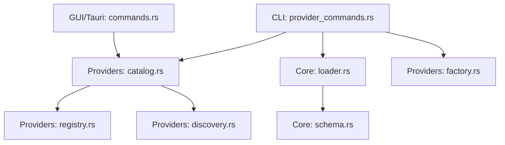
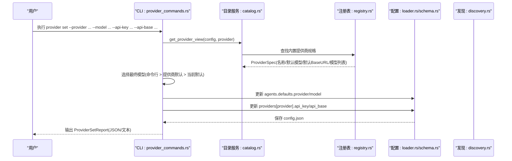
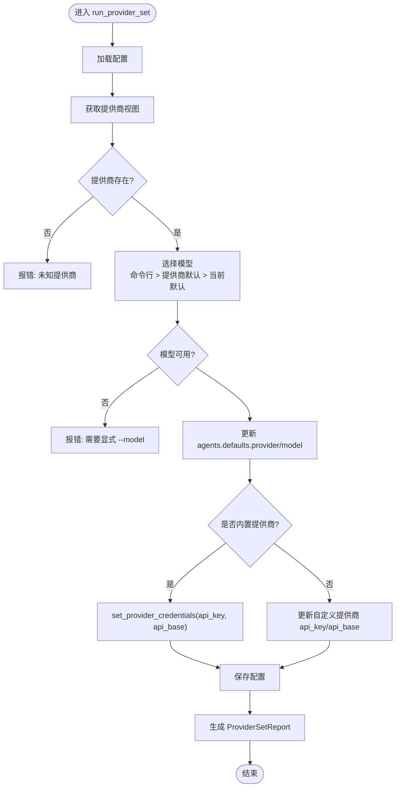
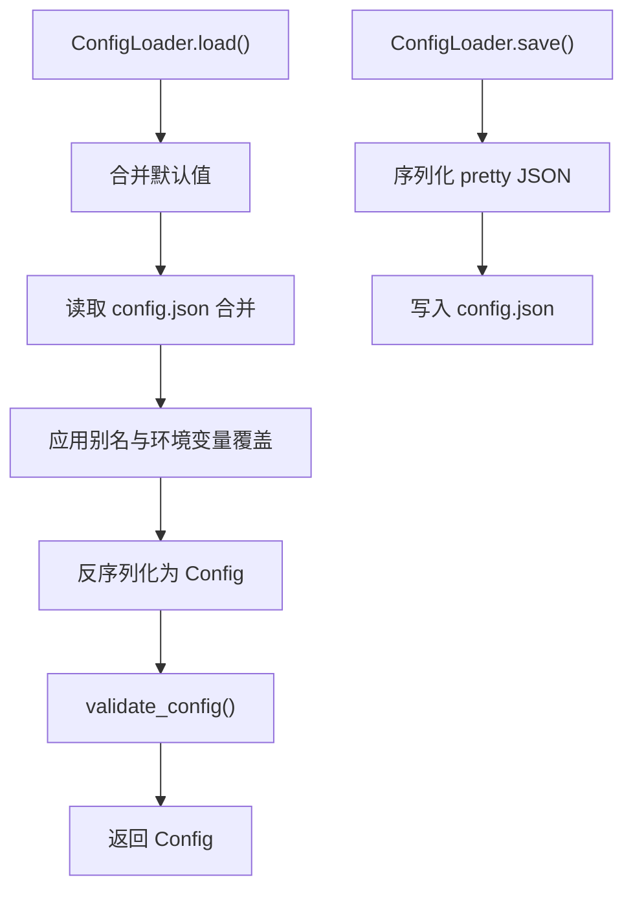
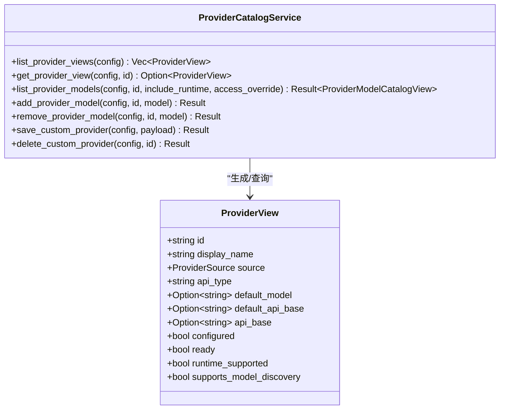
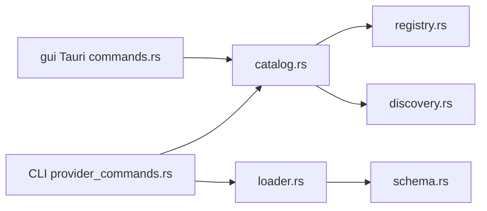

# Provider 设置命令

<cite>
**本文引用的文件**
- [agent-diva-cli/src/provider_commands.rs](file://agent-diva-cli/src/provider_commands.rs)
- [agent-diva-core/src/config/schema.rs](file://agent-diva-core/src/config/schema.rs)
- [agent-diva-core/src/config/loader.rs](file://agent-diva-core/src/config/loader.rs)
- [agent-diva-providers/src/catalog.rs](file://agent-diva-providers/src/catalog.rs)
- [agent-diva-providers/src/registry.rs](file://agent-diva-providers/src/registry.rs)
- [agent-diva-providers/src/providers.yaml](file://agent-diva-providers/src/providers.yaml)
- [agent-diva-providers/src/discovery.rs](file://agent-diva-providers/src/discovery.rs)
- [agent-diva-providers/src/factory.rs](file://agent-diva-providers/src/factory.rs)
- [agent-diva-gui/src-tauri/src/commands.rs](file://agent-diva-gui/src-tauri/src/commands.rs)
</cite>

## 目录
1. [简介](#简介)
2. [项目结构](#项目结构)
3. [核心组件](#核心组件)
4. [架构总览](#架构总览)
5. [详细组件分析](#详细组件分析)
6. [依赖关系分析](#依赖关系分析)
7. [性能与可靠性](#性能与可靠性)
8. [故障排查指南](#故障排查指南)
9. [结论](#结论)
10. [附录](#附录)

## 简介
本文件面向使用 agent-diva 的用户与开发者，系统性说明 provider set 子命令的用法、参数含义、配置持久化机制、验证方法以及常见错误处理。重点覆盖以下能力：
- 通过 --provider、--model、--api-key、--api-base 等参数设置默认提供商与模型
- 为内置或自定义提供商配置 API Key 与 Base URL
- 针对 OpenAI、Anthropic、Ollama（本地）等不同提供商的配置示例
- 自定义提供商的最佳实践与限制
- 配置文件更新后的验证方法与回滚策略

## 项目结构
Provider 设置功能涉及 CLI 层、配置加载与持久化、提供商目录与服务、以及 GUI/Tauri 集成。关键路径如下：
- CLI 命令实现：agent-diva-cli/src/provider_commands.rs
- 配置结构与校验：agent-diva-core/src/config/schema.rs、loader.rs
- 提供商目录与视图：agent-diva-providers/src/catalog.rs、registry.rs、providers.yaml
- 运行时访问与发现：agent-diva-providers/src/discovery.rs
- 构建 LLM 客户端：agent-diva-providers/src/factory.rs
- GUI 侧调用与 DTO：agent-diva-gui/src-tauri/src/commands.rs

图表来源
- [agent-diva-cli/src/provider_commands.rs:90-153](file://agent-diva-cli/src/provider_commands.rs#L90-L153)
- [agent-diva-core/src/config/loader.rs:57-82](file://agent-diva-core/src/config/loader.rs#L57-L82)
- [agent-diva-providers/src/catalog.rs:71-109](file://agent-diva-providers/src/catalog.rs#L71-L109)
- [agent-diva-providers/src/registry.rs:104-107](file://agent-diva-providers/src/registry.rs#L104-L107)
- [agent-diva-providers/src/discovery.rs:17-45](file://agent-diva-providers/src/discovery.rs#L17-L45)
- [agent-diva-providers/src/factory.rs:23-40](file://agent-diva-providers/src/factory.rs#L23-L40)
- [agent-diva-gui/src-tauri/src/commands.rs:4466-4508](file://agent-diva-gui/src-tauri/src/commands.rs#L4466-L4508)

章节来源
- [agent-diva-cli/src/provider_commands.rs:90-153](file://agent-diva-cli/src/provider_commands.rs#L90-L153)
- [agent-diva-core/src/config/loader.rs:57-82](file://agent-diva-core/src/config/loader.rs#L57-L82)
- [agent-diva-providers/src/catalog.rs:71-109](file://agent-diva-providers/src/catalog.rs#L71-L109)

## 核心组件
- CLI provider set 命令：解析参数、校验提供商、选择模型、写入配置并输出报告
- 配置加载器：读取 config.json、合并环境变量、保存配置、支持热重载
- 提供商目录服务：提供提供商视图、模型目录、访问凭据、自定义提供商管理
- 提供商注册表与清单：内置提供商元数据、默认模型、默认 Base URL、模型列表
- 运行时访问封装：从配置提取 api_key、api_base、extra_headers
- 客户端构建：根据 api_type 与 model 构造具体 LLM 客户端

章节来源
- [agent-diva-cli/src/provider_commands.rs:90-153](file://agent-diva-cli/src/provider_commands.rs#L90-L153)
- [agent-diva-core/src/config/loader.rs:57-82](file://agent-diva-core/src/config/loader.rs#L57-L82)
- [agent-diva-providers/src/catalog.rs:71-109](file://agent-diva-providers/src/catalog.rs#L71-L109)
- [agent-diva-providers/src/discovery.rs:17-45](file://agent-diva-providers/src/discovery.rs#L17-L45)
- [agent-diva-providers/src/factory.rs:23-40](file://agent-diva-providers/src/factory.rs#L23-L40)

## 架构总览
下图展示了 provider set 命令从参数到配置落盘的关键流程，以及与提供商目录、注册表的交互。

图表来源
- [agent-diva-cli/src/provider_commands.rs:90-153](file://agent-diva-cli/src/provider_commands.rs#L90-L153)
- [agent-diva-providers/src/catalog.rs:71-109](file://agent-diva-providers/src/catalog.rs#L71-L109)
- [agent-diva-providers/src/registry.rs:104-107](file://agent-diva-providers/src/registry.rs#L104-L107)
- [agent-diva-core/src/config/loader.rs:57-82](file://agent-diva-core/src/config/loader.rs#L57-L82)

## 详细组件分析

### provider set 子命令
- 作用：设置默认提供商与模型，并可选更新该提供商的 API Key 与 Base URL
- 参数说明
  - --provider：必填。提供商标识（如 openai、anthropic、deepseek、custom 等）。必须存在于内置注册表或自定义提供商中
  - --model：可选。目标模型 ID。若未提供，则优先使用提供商暴露的默认模型；否则回退到当前默认提供商的默认模型；仍不可用则报错并要求显式传入
  - --api-key：可选。提供商密钥。对内置提供商会写入对应 slot；对自定义提供商会写入其 api_key 字段
  - --api-base：可选。API Base URL。对内置提供商会写入对应 slot；对自定义提供商会写入其 api_base 字段
  - --json：可选。以 JSON 形式输出结果，便于脚本化处理
- 行为要点
  - 校验提供商是否存在
  - 选择最终模型并写入 agents.defaults.provider/model
  - 更新提供商凭据（api_key/api_base）
  - 保存配置后输出 ProviderSetReport（包含 provider、model、config_path、configured、api_base）

图表来源
- [agent-diva-cli/src/provider_commands.rs:90-153](file://agent-diva-cli/src/provider_commands.rs#L90-L153)

章节来源
- [agent-diva-cli/src/provider_commands.rs:90-153](file://agent-diva-cli/src/provider_commands.rs#L90-L153)

### 配置结构与持久化
- 配置位置：默认位于 ~/.agent-diva/config.json（可通过 ConfigLoader::with_dir/with_file 指定）
- 加载流程：默认值 -> 合并文件 -> 别名与环境变量覆盖 -> 校验 -> 返回 Config
- 保存流程：序列化 pretty JSON -> 写入文件
- 热重载：后台任务轮询 mtime，检测变更并计算 diff，区分 hot_reload 与 restart_required 字段
- 环境变量覆盖
  - 别名键映射：如 OPENAI_API_KEY -> providers.openai.api_key
  - 路径键映射：AGENT_DIVA__AGENTS__DEFAULTS__MODEL 等
- 注意：provider 相关字段变更属于 restart_required，需重启生效

图表来源
- [agent-diva-core/src/config/loader.rs:57-82](file://agent-diva-core/src/config/loader.rs#L57-L82)
- [agent-diva-core/src/config/loader.rs:371-416](file://agent-diva-core/src/config/loader.rs#L371-L416)
- [agent-diva-core/src/config/loader.rs:107-166](file://agent-diva-core/src/config/loader.rs#L107-L166)

章节来源
- [agent-diva-core/src/config/loader.rs:57-82](file://agent-diva-core/src/config/loader.rs#L57-L82)
- [agent-diva-core/src/config/loader.rs:107-166](file://agent-diva-core/src/config/loader.rs#L107-L166)
- [agent-diva-core/src/config/loader.rs:371-416](file://agent-diva-core/src/config/loader.rs#L371-L416)

### 提供商目录与视图
- ProviderCatalogService 负责：
  - 列出所有提供商视图（内置 + 自定义）
  - 按名称获取提供商视图（含 configured/ready/default_model/api_base/runtime_supported 等）
  - 解析提供商规格（ProviderSpec），用于模型目录与访问凭据
  - 管理自定义提供商增删改查
- ProviderView 关键字段：id、display_name、source、api_type、default_model、default_api_base、api_base、configured、ready、runtime_supported、supports_model_discovery
- 自定义提供商限制：当前仅支持 api_type=openai

图表来源
- [agent-diva-providers/src/catalog.rs:24-57](file://agent-diva-providers/src/catalog.rs#L24-L57)
- [agent-diva-providers/src/catalog.rs:71-109](file://agent-diva-providers/src/catalog.rs#L71-L109)
- [agent-diva-providers/src/catalog.rs:239-292](file://agent-diva-providers/src/catalog.rs#L239-L292)

章节来源
- [agent-diva-providers/src/catalog.rs:71-109](file://agent-diva-providers/src/catalog.rs#L71-L109)
- [agent-diva-providers/src/catalog.rs:239-292](file://agent-diva-providers/src/catalog.rs#L239-L292)

### 提供商注册表与清单
- 内置提供商由 providers.yaml 定义，包含 name、api_type、keywords、env_key、display_name、default_model、gateway_prefix、skip_prefixes、default_api_base、models 等
- 注册表在启动时加载 YAML，并提供 find_by_name/find_by_model 等方法
- 常用内置提供商示例（节选）：openai、anthropic、deepseek、gemini、dashscope、moonshot、minimax、vllm、groq、xai、cherryin、302ai、ph8、burncloud、silicon、ppio、together、ocoolai、github、yi、baichuan、modelscope、stepfun、doubao、hyperbolic、mistral、jina、fireworks、hunyuan 等

章节来源
- [agent-diva-providers/src/registry.rs:104-107](file://agent-diva-providers/src/registry.rs#L104-L107)
- [agent-diva-providers/src/providers.yaml:1-800](file://agent-diva-providers/src/providers.yaml#L1-L800)

### 运行时访问与发现
- ProviderAccess 从配置中提取 api_key、api_base、extra_headers，并进行空字符串过滤与末尾斜杠去除
- 模型目录发现：支持运行时发现（OpenAI 兼容）或静态回退；可合并自定义模型
- GUI/Tauri 侧通过 ProviderCatalogService 获取访问凭据与模型目录

章节来源
- [agent-diva-providers/src/discovery.rs:17-45](file://agent-diva-providers/src/discovery.rs#L17-L45)
- [agent-diva-gui/src-tauri/src/commands.rs:4466-4508](file://agent-diva-gui/src-tauri/src/commands.rs#L4466-L4508)

### 客户端构建与协议约束
- build_llm_provider 根据 spec 与 access 构建 LLM 客户端
- 特殊约束：当 response_protocol=deepseek_v4_dsml 时，要求模型名包含 deepseek-v4

章节来源
- [agent-diva-providers/src/factory.rs:23-40](file://agent-diva-providers/src/factory.rs#L23-L40)

## 依赖关系分析
- CLI 命令依赖 ProviderCatalogService 进行提供商视图查询与模型目录获取
- 配置持久化依赖 ConfigLoader，支持环境变量覆盖与热重载
- 提供商清单与注册表提供默认模型与 Base URL，影响模型选择与访问地址
- GUI/Tauri 通过相同目录服务与访问封装，保证 CLI 与 GUI 行为一致

图表来源
- [agent-diva-cli/src/provider_commands.rs:90-153](file://agent-diva-cli/src/provider_commands.rs#L90-L153)
- [agent-diva-core/src/config/loader.rs:57-82](file://agent-diva-core/src/config/loader.rs#L57-L82)
- [agent-diva-providers/src/catalog.rs:71-109](file://agent-diva-providers/src/catalog.rs#L71-L109)
- [agent-diva-gui/src-tauri/src/commands.rs:4466-4508](file://agent-diva-gui/src-tauri/src/commands.rs#L4466-L4508)

章节来源
- [agent-diva-cli/src/provider_commands.rs:90-153](file://agent-diva-cli/src/provider_commands.rs#L90-L153)
- [agent-diva-core/src/config/loader.rs:57-82](file://agent-diva-core/src/config/loader.rs#L57-L82)
- [agent-diva-providers/src/catalog.rs:71-109](file://agent-diva-providers/src/catalog.rs#L71-L109)
- [agent-diva-gui/src-tauri/src/commands.rs:4466-4508](file://agent-diva-gui/src-tauri/src/commands.rs#L4466-L4508)

## 性能与可靠性
- 配置热重载：每 5 秒轮询一次，检测到变更后去抖 500ms，避免频繁重读
- 模型目录发现：OpenAI 兼容提供商支持运行时发现，其他提供商使用静态回退
- 错误快速失败：未知提供商或缺少必需模型时立即报错，避免无效配置继续运行
- 环境变量覆盖优先级高：路径级环境变量可覆盖别名与环境变量，确保部署可控

章节来源
- [agent-diva-core/src/config/loader.rs:107-166](file://agent-diva-core/src/config/loader.rs#L107-L166)
- [agent-diva-providers/src/catalog.rs:161-193](file://agent-diva-providers/src/catalog.rs#L161-L193)
- [agent-diva-cli/src/provider_commands.rs:90-153](file://agent-diva-cli/src/provider_commands.rs#L90-L153)

## 故障排查指南
- 未知提供商
  - 现象：提示未知提供商
  - 原因：--provider 不在内置注册表或自定义提供商中
  - 解决：确认提供商名称或使用自定义提供商创建接口
  - 参考：[agent-diva-cli/src/provider_commands.rs:90-153](file://agent-diva-cli/src/provider_commands.rs#L90-L153)
- 缺少默认模型
  - 现象：提示需要显式 --model
  - 原因：提供商未暴露默认模型且当前默认提供商无模型
  - 解决：显式传入 --model，或先设置默认提供商与模型
  - 参考：[agent-diva-cli/src/provider_commands.rs:90-153](file://agent-diva-cli/src/provider_commands.rs#L90-L153)
- 自定义提供商类型限制
  - 现象：保存自定义提供商时报错
  - 原因：当前仅支持 api_type=openai
  - 解决：将 api_type 设置为 openai，并确保 api_base 有效
  - 参考：[agent-diva-providers/src/catalog.rs:239-292](file://agent-diva-providers/src/catalog.rs#L239-L292)
- 响应协议与模型不匹配
  - 现象：构建客户端时报错
  - 原因：response_protocol=deepseek_v4_dsml 要求模型包含 deepseek-v4
  - 解决：调整模型或协议
  - 参考：[agent-diva-providers/src/factory.rs:23-40](file://agent-diva-providers/src/factory.rs#L23-L40)
- 配置未生效
  - 现象：修改 provider 相关字段后未生效
  - 原因：provider 字段变更属于 restart_required
  - 解决：重启进程使新配置生效
  - 参考：[agent-diva-core/src/config/loader.rs:214-239](file://agent-diva-core/src/config/loader.rs#L214-L239)

章节来源
- [agent-diva-cli/src/provider_commands.rs:90-153](file://agent-diva-cli/src/provider_commands.rs#L90-L153)
- [agent-diva-providers/src/catalog.rs:239-292](file://agent-diva-providers/src/catalog.rs#L239-L292)
- [agent-diva-providers/src/factory.rs:23-40](file://agent-diva-providers/src/factory.rs#L23-L40)
- [agent-diva-core/src/config/loader.rs:214-239](file://agent-diva-core/src/config/loader.rs#L214-L239)

## 结论
provider set 命令提供了统一的入口来设置默认提供商与模型，并支持为内置或自定义提供商配置 API Key 与 Base URL。通过提供商目录与注册表，系统能够自动选择默认模型与 Base URL，并在必要时要求显式传入。配置持久化采用 JSON 文件存储，支持环境变量覆盖与热重载；但 provider 相关变更需要重启生效。遵循本文提供的最佳实践与故障排查步骤，可以高效完成多提供商配置与管理。

## 附录

### 参数速查
- --provider：必填。提供商标识（内置或自定义）
- --model：可选。目标模型 ID（优先级高于提供商默认与当前默认）
- --api-key：可选。提供商密钥
- --api-base：可选。API Base URL
- --json：可选。JSON 输出

章节来源
- [agent-diva-cli/src/provider_commands.rs:90-153](file://agent-diva-cli/src/provider_commands.rs#L90-L153)

### 不同提供商配置示例
- OpenAI
  - 提供商：openai
  - 默认模型：openai/gpt-4o（来自 providers.yaml）
  - 默认 Base URL：https://api.openai.com/v1（来自 providers.yaml）
  - 配置方式：provider set --provider openai --model gpt-4o --api-key <你的密钥>
  - 参考：[agent-diva-providers/src/providers.yaml:106-138](file://agent-diva-providers/src/providers.yaml#L106-L138)
- Anthropic
  - 提供商：anthropic
  - 默认模型：claude-sonnet-4-5（来自 providers.yaml）
  - 默认 Base URL：https://api.anthropic.com（来自 providers.yaml）
  - 配置方式：provider set --provider anthropic --model claude-sonnet-4-5 --api-key <你的密钥>
  - 参考：[agent-diva-providers/src/providers.yaml:77-104](file://agent-diva-providers/src/providers.yaml#L77-L104)
- Ollama（本地）
  - 提供商：可使用 vllm/custom 或自定义 openai 兼容端点
  - 默认 Base URL：http://localhost:11434/v1（vllm 默认，来自 providers.yaml）
  - 配置方式：provider set --provider custom --api-base http://localhost:11434/v1 --model llama3
  - 参考：[agent-diva-providers/src/providers.yaml:311-328](file://agent-diva-providers/src/providers.yaml#L311-L328)

章节来源
- [agent-diva-providers/src/providers.yaml:77-104](file://agent-diva-providers/src/providers.yaml#L77-L104)
- [agent-diva-providers/src/providers.yaml:106-138](file://agent-diva-providers/src/providers.yaml#L106-L138)
- [agent-diva-providers/src/providers.yaml:311-328](file://agent-diva-providers/src/providers.yaml#L311-L328)

### 自定义提供商最佳实践
- 仅支持 api_type=openai
- 建议提供有效的 api_base 与 models 列表，以便模型发现与选择
- 如需额外请求头，可在 CustomProviderUpsert 中设置 extra_headers
- 删除自定义提供商时使用 delete 接口，避免残留配置
- 参考：[agent-diva-providers/src/catalog.rs:239-292](file://agent-diva-providers/src/catalog.rs#L239-L292)

章节来源
- [agent-diva-providers/src/catalog.rs:239-292](file://agent-diva-providers/src/catalog.rs#L239-L292)

### 配置文件更新后的验证方法
- 使用 provider status 查看当前提供商状态与缺失字段
- 使用 provider list 查看所有提供商及其默认模型
- 使用 provider models 查看提供商模型目录（支持运行时发现或静态回退）
- 检查 config.json 中 agents.defaults.provider/model 与 providers[provider] 的 api_key/api_base
- 参考：
  - [agent-diva-cli/src/provider_commands.rs:25-88](file://agent-diva-cli/src/provider_commands.rs#L25-L88)
  - [agent-diva-cli/src/provider_commands.rs:177-233](file://agent-diva-cli/src/provider_commands.rs#L177-L233)
  - [agent-diva-core/src/config/loader.rs:57-82](file://agent-diva-core/src/config/loader.rs#L57-L82)

章节来源
- [agent-diva-cli/src/provider_commands.rs:25-88](file://agent-diva-cli/src/provider_commands.rs#L25-L88)
- [agent-diva-cli/src/provider_commands.rs:177-233](file://agent-diva-cli/src/provider_commands.rs#L177-L233)
- [agent-diva-core/src/config/loader.rs:57-82](file://agent-diva-core/src/config/loader.rs#L57-L82)

### 配置持久化与回滚策略
- 持久化：ConfigLoader.save 直接写入 config.json；支持环境变量覆盖与热重载
- 回滚策略：当前 provider set 未实现原子写或备份回滚；建议在重要变更前手动备份 config.json
- 热重载：provider 相关字段变更属于 restart_required，需重启进程
- 参考：
  - [agent-diva-core/src/config/loader.rs:57-82](file://agent-diva-core/src/config/loader.rs#L57-L82)
  - [agent-diva-core/src/config/loader.rs:107-166](file://agent-diva-core/src/config/loader.rs#L107-L166)
  - [agent-diva-core/src/config/loader.rs:214-239](file://agent-diva-core/src/config/loader.rs#L214-L239)

章节来源
- [agent-diva-core/src/config/loader.rs:57-82](file://agent-diva-core/src/config/loader.rs#L57-L82)
- [agent-diva-core/src/config/loader.rs:107-166](file://agent-diva-core/src/config/loader.rs#L107-L166)
- [agent-diva-core/src/config/loader.rs:214-239](file://agent-diva-core/src/config/loader.rs#L214-L239)