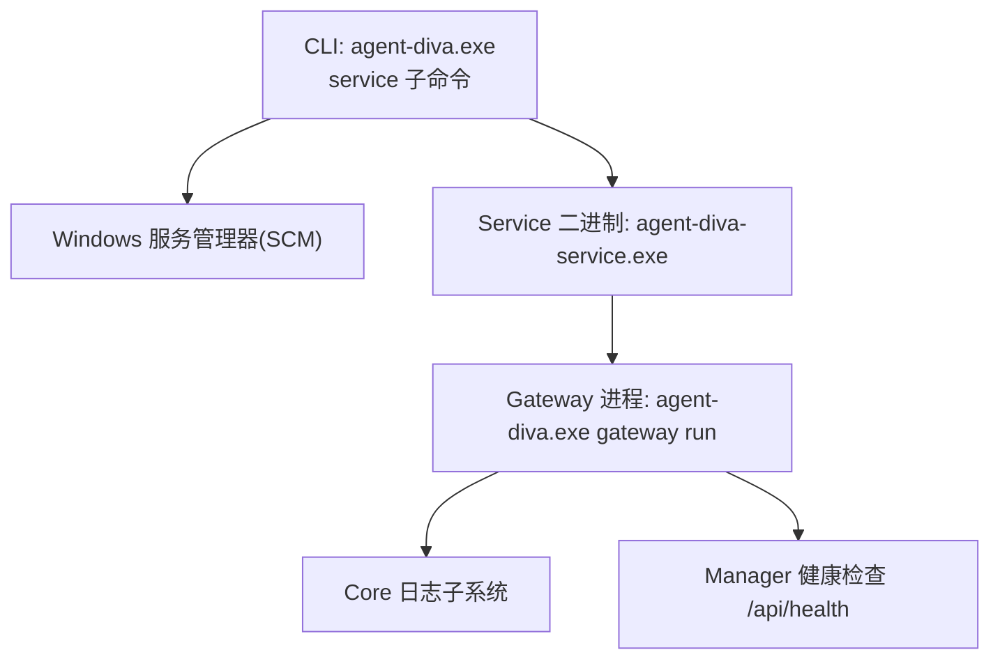
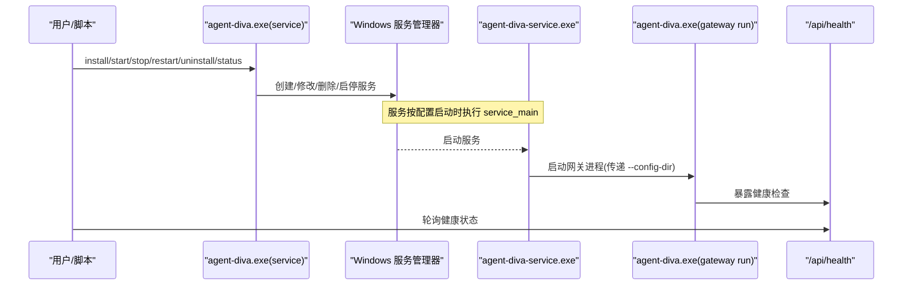
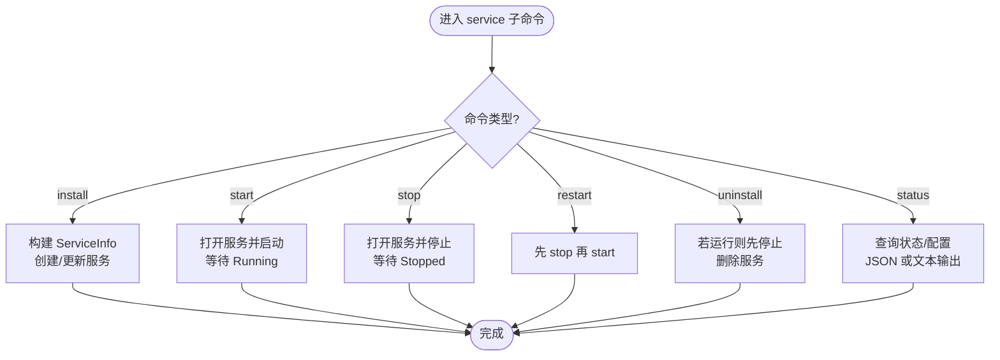
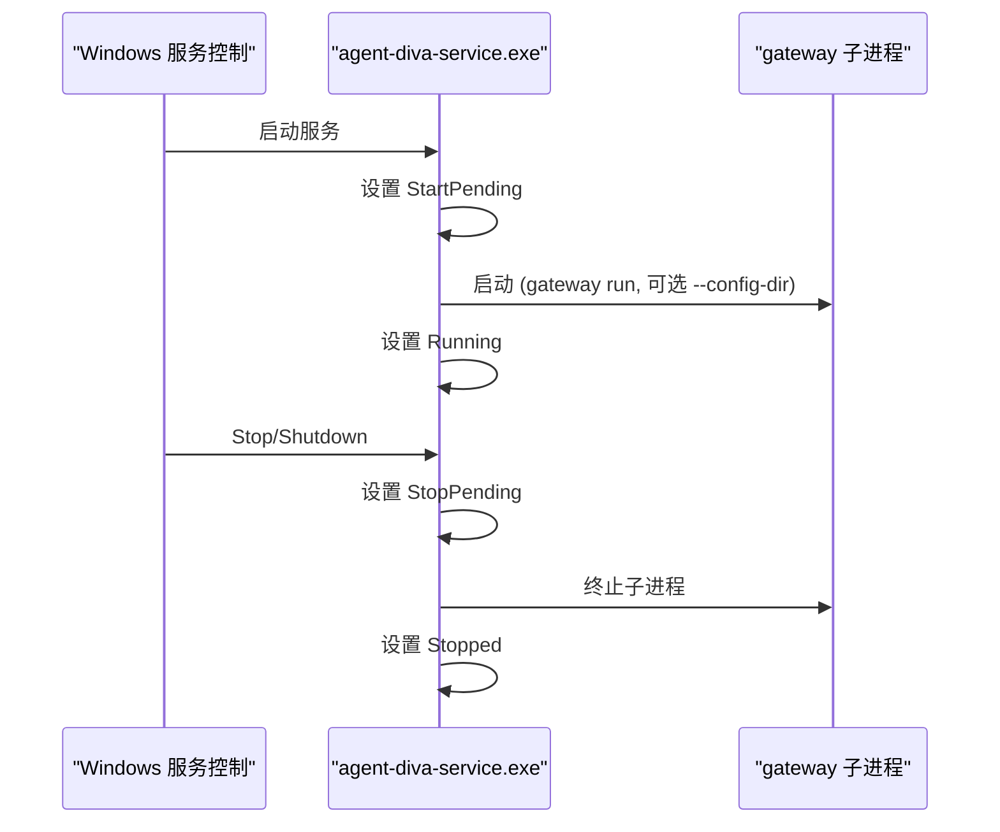
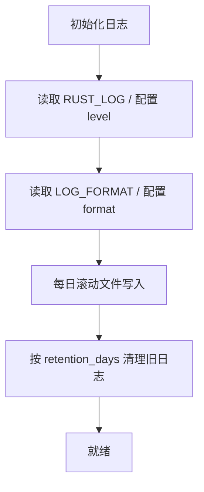
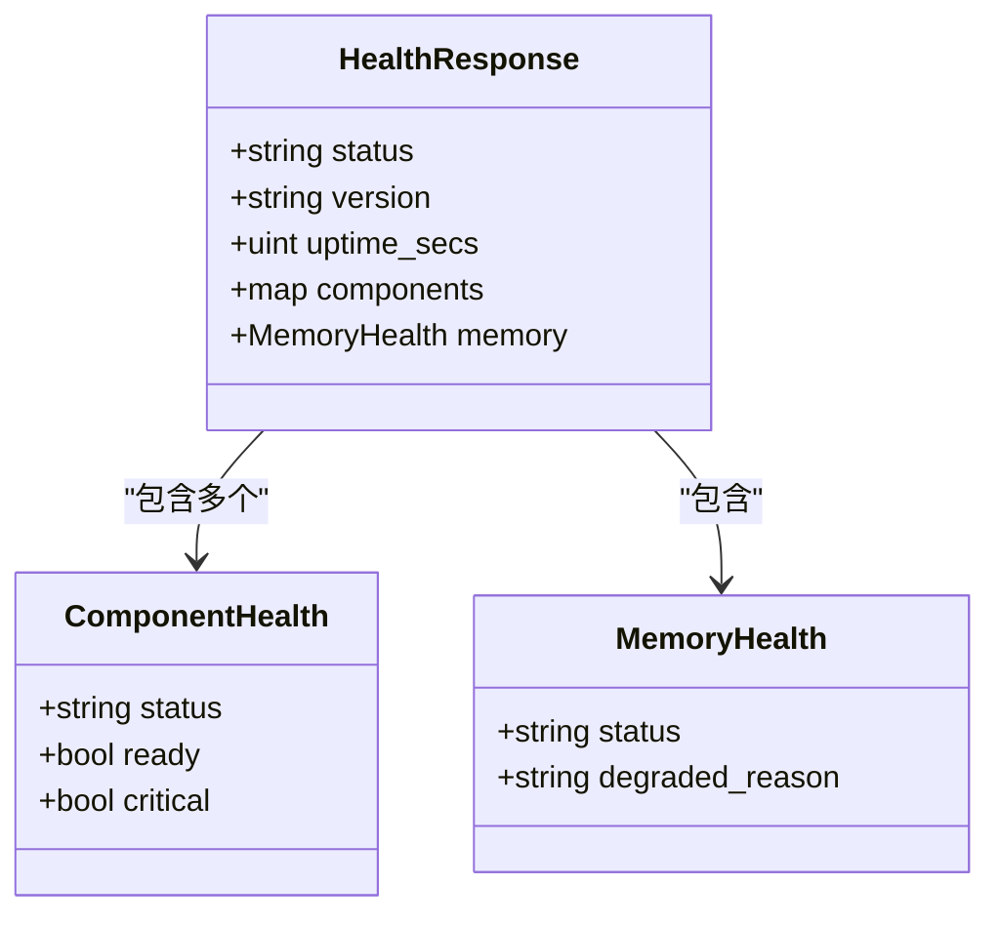
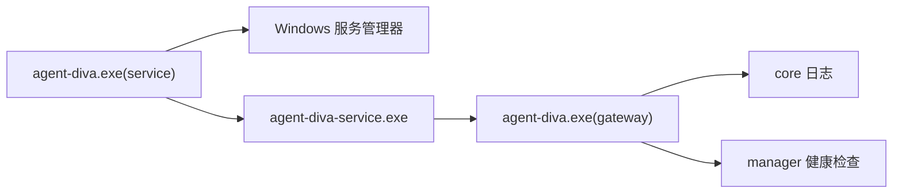

# Service 服务命令

<cite>
**本文引用的文件**
- [agent-diva-service/src/main.rs](file://agent-diva-service/src/main.rs)
- [agent-diva-cli/src/service.rs](file://agent-diva-cli/src/service.rs)
- [agent-diva-core/src/logging.rs](file://agent-diva-core/src/logging.rs)
- [agent-diva-manager/src/handlers/health.rs](file://agent-diva-manager/src/handlers/health.rs)
- [contrib/systemd/agent-diva.service](file://contrib/systemd/agent-diva.service)
</cite>

## 目录
1. [简介](#简介)
2. [项目结构](#项目结构)
3. [核心组件](#核心组件)
4. [架构总览](#架构总览)
5. [详细组件分析](#详细组件分析)
6. [依赖关系分析](#依赖关系分析)
7. [性能与可观测性](#性能与可观测性)
8. [生产部署最佳实践](#生产部署最佳实践)
9. [故障排除指南](#故障排除指南)
10. [结论](#结论)

## 简介
本文件聚焦于 Agent Diva 的 Windows 服务管理命令，覆盖服务的安装、卸载、启动、停止、重启与状态查询等生命周期操作；同时说明服务配置、日志、健康检查以及与监控告警系统的集成方式。文档面向运维与平台工程团队，提供生产环境部署与排障建议。

## 项目结构
Agent Diva 将“Windows 服务控制”和“服务进程本身”解耦：
- CLI 子命令负责与服务管理器（SCM）交互，完成安装、启动、停止、重启、卸载与状态查询。
- 独立的 service 二进制作为 Windows 服务宿主，负责注册系统服务、接收控制信号并启动实际网关进程。
- 网关进程通过 core 模块初始化日志，并通过 manager 暴露健康检查接口，便于外部监控。

图表来源
- [agent-diva-cli/src/service.rs:103-121](file://agent-diva-cli/src/service.rs#L103-L121)
- [agent-diva-service/src/main.rs:59-68](file://agent-diva-service/src/main.rs#L59-L68)
- [agent-diva-service/src/main.rs:164-181](file://agent-diva-service/src/main.rs#L164-L181)
- [agent-diva-core/src/logging.rs:10-114](file://agent-diva-core/src/logging.rs#L10-L114)
- [agent-diva-manager/src/handlers/health.rs:32-72](file://agent-diva-manager/src/handlers/health.rs#L32-L72)

章节来源
- [agent-diva-cli/src/service.rs:1-67](file://agent-diva-cli/src/service.rs#L1-L67)
- [agent-diva-service/src/main.rs:1-68](file://agent-diva-service/src/main.rs#L1-L68)

## 核心组件
- Windows 服务管理 CLI（agent-diva.exe service ...）
  - 支持命令：install、start、stop、restart、uninstall、status
  - 支持 dry-run 模式用于 CI 校验
  - 支持 JSON 输出以对接自动化
- Windows 服务宿主（agent-diva-service.exe）
  - 注册为系统服务，名称固定
  - 接收 Stop/Shutdown 控制事件，优雅关闭子进程
  - 控制台模式用于本地验证
- 网关进程（agent-diva.exe gateway run）
  - 由 service 二进制拉起，承载业务逻辑
  - 初始化日志与健康检查端点

章节来源
- [agent-diva-cli/src/service.rs:5-50](file://agent-diva-cli/src/service.rs#L5-L50)
- [agent-diva-service/src/main.rs:4-27](file://agent-diva-service/src/main.rs#L4-L27)
- [agent-diva-service/src/main.rs:92-146](file://agent-diva-service/src/main.rs#L92-L146)

## 架构总览
下图展示从 CLI 到 SCM、再到服务宿主与网关进程的完整调用链，以及健康检查端点的对外暴露。

图表来源
- [agent-diva-cli/src/service.rs:103-121](file://agent-diva-cli/src/service.rs#L103-L121)
- [agent-diva-service/src/main.rs:59-68](file://agent-diva-service/src/main.rs#L59-L68)
- [agent-diva-service/src/main.rs:164-181](file://agent-diva-service/src/main.rs#L164-L181)
- [agent-diva-manager/src/handlers/health.rs:32-72](file://agent-diva-manager/src/handlers/health.rs#L32-L72)

## 详细组件分析

### Windows 服务管理命令（CLI）
- 命令清单
  - install [--auto-start] [--dry-run]：安装或更新服务定义，可选自动启动与延迟自动启动
  - start [--dry-run]：启动服务
  - stop [--dry-run]：停止服务
  - restart [--dry-run]：先停后启
  - uninstall [--dry-run]：卸载服务（若运行则先停）
  - status [--json] [--dry-run]：查询服务是否安装、运行状态、可执行路径
- 关键行为
  - 通过本地服务管理器连接，使用固定服务名与显示名
  - 安装时写入可执行路径与启动参数（含 --config-dir）
  - 启动/停止前会查询当前状态，避免重复操作
  - 所有写操作均支持 dry-run 打印计划动作
  - status 支持 JSON 输出，便于自动化解析

图表来源
- [agent-diva-cli/src/service.rs:103-121](file://agent-diva-cli/src/service.rs#L103-L121)
- [agent-diva-cli/src/service.rs:153-170](file://agent-diva-cli/src/service.rs#L153-L170)
- [agent-diva-cli/src/service.rs:231-291](file://agent-diva-cli/src/service.rs#L231-L291)
- [agent-diva-cli/src/service.rs:293-319](file://agent-diva-cli/src/service.rs#L293-L319)
- [agent-diva-cli/src/service.rs:321-375](file://agent-diva-cli/src/service.rs#L321-L375)

章节来源
- [agent-diva-cli/src/service.rs:5-50](file://agent-diva-cli/src/service.rs#L5-L50)
- [agent-diva-cli/src/service.rs:103-121](file://agent-diva-cli/src/service.rs#L103-L121)
- [agent-diva-cli/src/service.rs:153-170](file://agent-diva-cli/src/service.rs#L153-L170)
- [agent-diva-cli/src/service.rs:231-375](file://agent-diva-cli/src/service.rs#L231-L375)

### Windows 服务宿主（agent-diva-service.exe）
- 角色
  - 非 Windows 平台直接报错退出
  - Windows 平台注册服务分发器，处理 Stop/Shutdown/Interrogate
  - 控制台模式用于本地调试：直接拉起网关进程并等待退出
- 生命周期
  - 启动：设置 StartPending -> 拉起网关子进程 -> 设置为 Running
  - 运行中：轮询子进程退出或接收停止信号
  - 停止：设置 StopPending -> 终止子进程 -> 设置为 Stopped
- 日志
  - 使用 tracing_subscriber 初始化，默认 info 级别，目标 false（不输出到控制台）
  - 可通过环境变量调整过滤规则

图表来源
- [agent-diva-service/src/main.rs:92-146](file://agent-diva-service/src/main.rs#L92-L146)
- [agent-diva-service/src/main.rs:164-181](file://agent-diva-service/src/main.rs#L164-L181)
- [agent-diva-service/src/main.rs:70-79](file://agent-diva-service/src/main.rs#L70-L79)

章节来源
- [agent-diva-service/src/main.rs:17-27](file://agent-diva-service/src/main.rs#L17-L27)
- [agent-diva-service/src/main.rs:59-68](file://agent-diva-service/src/main.rs#L59-L68)
- [agent-diva-service/src/main.rs:92-146](file://agent-diva-service/src/main.rs#L92-L146)
- [agent-diva-service/src/main.rs:164-181](file://agent-diva-service/src/main.rs#L164-L181)

### 日志子系统（core）
- 能力
  - 支持按模块覆盖日志级别
  - 支持 JSON 或结构化文本格式
  - 每日滚动日志文件，保留天数可配
  - 清理过期日志文件（gateway.log*、gui.log*）
- 环境变量
  - RUST_LOG：覆盖全局日志级别
  - LOG_FORMAT：覆盖日志格式（json 或其他）

图表来源
- [agent-diva-core/src/logging.rs:10-114](file://agent-diva-core/src/logging.rs#L10-L114)
- [agent-diva-core/src/logging.rs:116-163](file://agent-diva-core/src/logging.rs#L116-L163)

章节来源
- [agent-diva-core/src/logging.rs:10-114](file://agent-diva-core/src/logging.rs#L10-L114)
- [agent-diva-core/src/logging.rs:116-163](file://agent-diva-core/src/logging.rs#L116-L163)

### 健康检查与监控集成（manager）
- 健康端点
  - GET /api/health 返回整体状态、版本、运行时长、组件健康与内存健康
  - 当关键组件不可用时返回 503，否则 200
- 组件
  - audit_sink、cron、event_bus、workspace、memory
- 集成建议
  - 监控系统定期轮询 /api/health，结合 HTTP 状态码与 components 字段判断可用性
  - 对 memory 与 cron 等关键组件设置告警阈值

图表来源
- [agent-diva-manager/src/handlers/health.rs:10-30](file://agent-diva-manager/src/handlers/health.rs#L10-L30)
- [agent-diva-manager/src/handlers/health.rs:32-72](file://agent-diva-manager/src/handlers/health.rs#L32-L72)

章节来源
- [agent-diva-manager/src/handlers/health.rs:32-72](file://agent-diva-manager/src/handlers/health.rs#L32-L72)

## 依赖关系分析
- CLI 依赖 Windows 服务管理器 API 进行服务生命周期管理
- Service 二进制依赖 windows_service crate 注册服务、处理控制事件
- Gateway 进程依赖 core 日志与 manager 健康检查
- 跨平台差异：非 Windows 平台 CLI 与 service 均拒绝执行相关命令

图表来源
- [agent-diva-cli/src/service.rs:103-121](file://agent-diva-cli/src/service.rs#L103-L121)
- [agent-diva-service/src/main.rs:59-68](file://agent-diva-service/src/main.rs#L59-L68)
- [agent-diva-core/src/logging.rs:10-114](file://agent-diva-core/src/logging.rs#L10-L114)
- [agent-diva-manager/src/handlers/health.rs:32-72](file://agent-diva-manager/src/handlers/health.rs#L32-L72)

章节来源
- [agent-diva-cli/src/service.rs:103-121](file://agent-diva-cli/src/service.rs#L103-L121)
- [agent-diva-service/src/main.rs:59-68](file://agent-diva-service/src/main.rs#L59-L68)

## 性能与可观测性
- 日志性能
  - 使用非阻塞写入器与每日滚动，降低 I/O 抖动
  - 支持 JSON 格式便于集中采集与检索
- 健康检查
  - 轻量级 HTTP 端点，适合高频探测
  - 组件级 readiness 信息有助于快速定位瓶颈
- 资源限制
  - 在 Linux 环境下可使用 systemd 单元进行资源隔离与重启策略（参考 systemd 模板）

章节来源
- [agent-diva-core/src/logging.rs:10-114](file://agent-diva-core/src/logging.rs#L10-L114)
- [agent-diva-manager/src/handlers/health.rs:32-72](file://agent-diva-manager/src/handlers/health.rs#L32-L72)
- [contrib/systemd/agent-diva.service:1-28](file://contrib/systemd/agent-diva.service#L1-L28)

## 生产部署最佳实践
- 服务安装与启动
  - 首次安装使用 install --auto-start 以便开机自启；必要时启用延迟自动启动
  - 使用 status --json 接入自动化巡检
- 配置与环境
  - 通过 --config-dir 指定配置目录，确保服务与 CLI 一致
  - 使用 RUST_LOG 与 LOG_FORMAT 统一日志级别与格式
- 日志与保留
  - 合理设置日志保留天数，避免磁盘占满
  - 将日志目录纳入备份与监控
- 健康检查与告警
  - 每 30-60 秒轮询 /api/health，HTTP 非 200 或 components 中有 degraded 即告警
  - 对 memory、cron、audit_sink 等关键组件单独设置阈值
- 安全与权限
  - 遵循最小权限原则，仅授予必要目录读写权限
  - 在 Linux 上参考 systemd 单元的 ProtectSystem、PrivateTmp 等安全选项

[本节为通用指导，无需特定文件引用]

## 故障排除指南
- 常见错误与定位
  - 无法连接服务管理器：检查权限与账户上下文
  - 服务二进制缺失：确认已构建并放置在与 CLI 同级目录
  - 启动超时：检查网关进程是否正常初始化日志与健康端点
  - 停止失败：确认子进程未被占用，必要时强制终止
- 诊断步骤
  - 使用 status --json 获取服务状态与可执行路径
  - 查看日志目录中的 gateway.log 与 gui.log，关注初始化阶段错误
  - 访问 /api/health 确认各组件就绪情况
- 恢复策略
  - 重启服务：restart 命令
  - 重新安装：install 更新服务定义
  - 卸载重装：uninstall 后重新 install

章节来源
- [agent-diva-cli/src/service.rs:127-142](file://agent-diva-cli/src/service.rs#L127-L142)
- [agent-diva-cli/src/service.rs:231-375](file://agent-diva-cli/src/service.rs#L231-L375)
- [agent-diva-core/src/logging.rs:10-114](file://agent-diva-core/src/logging.rs#L10-L114)
- [agent-diva-manager/src/handlers/health.rs:32-72](file://agent-diva-manager/src/handlers/health.rs#L32-L72)

## 结论
Agent Diva 的 Windows 服务管理通过 CLI 与独立服务宿主的解耦设计，提供了稳定可靠的服务生命周期管理能力。配合 core 的日志系统与 manager 的健康检查端点，能够满足生产环境的可观测性与自动化运维需求。建议在生产环境中结合健康检查与日志轮转策略，建立完善的监控告警体系，确保服务高可用与可维护性。

[本节为总结，无需特定文件引用]