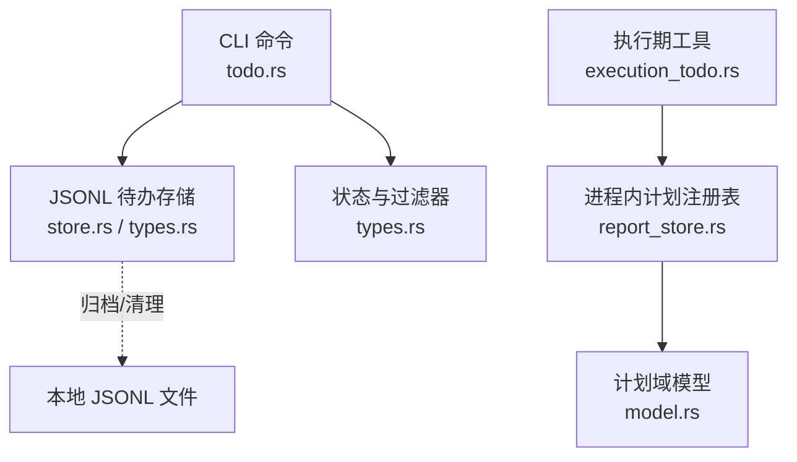
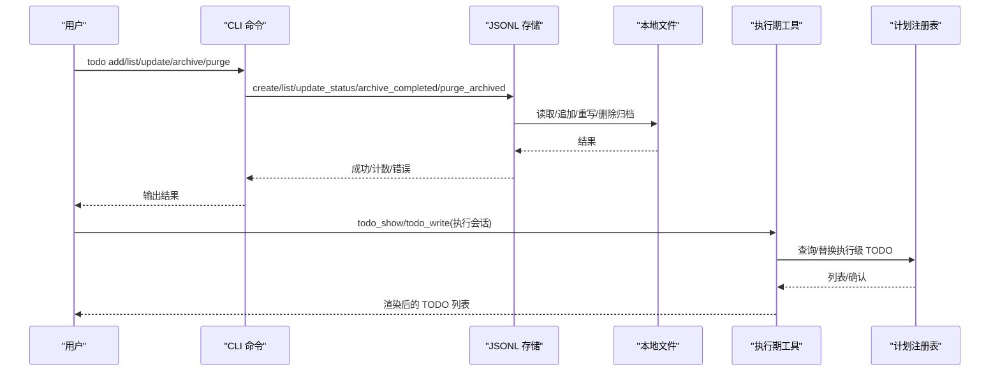
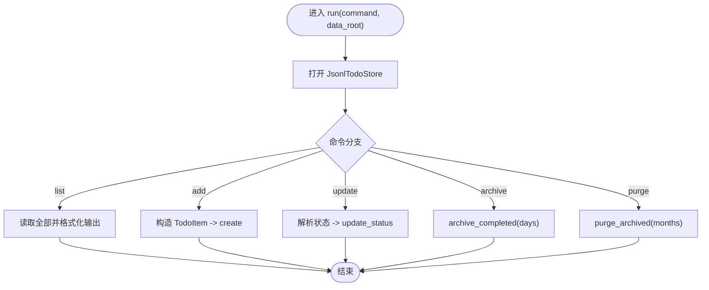
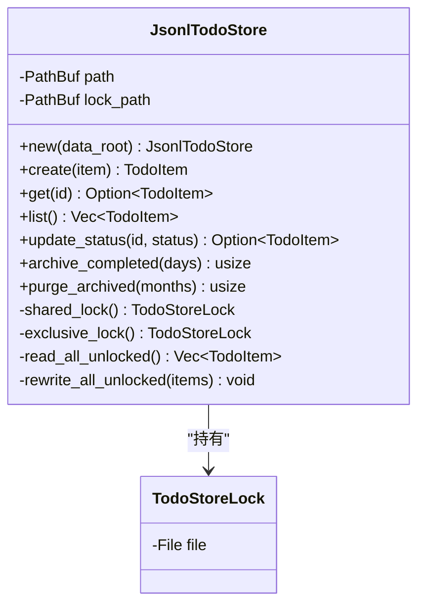
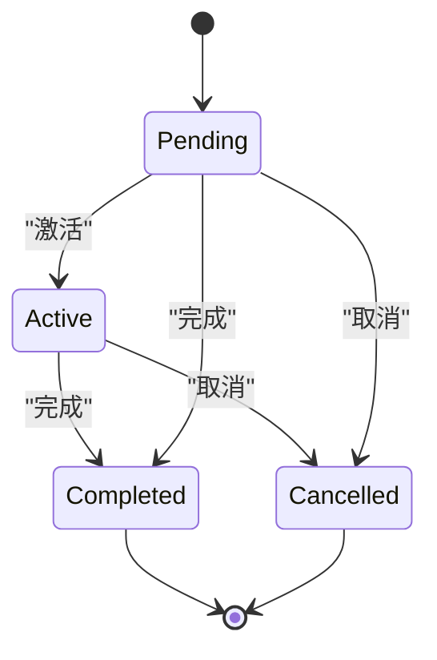
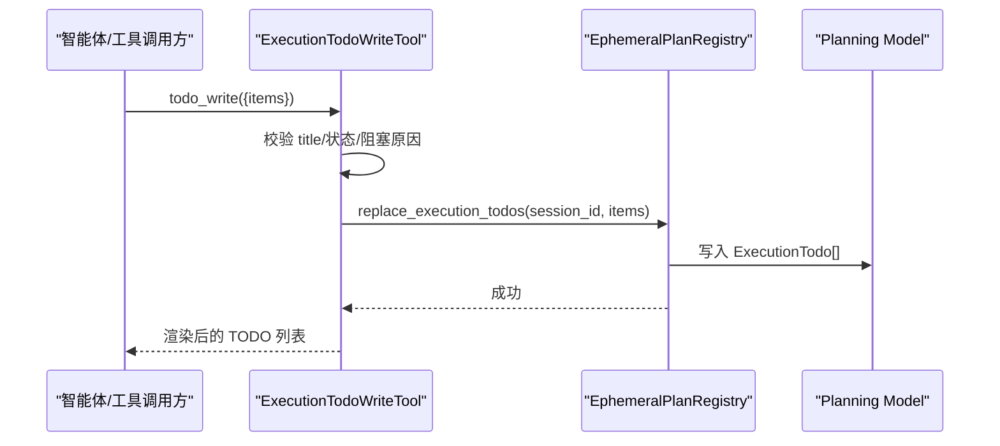
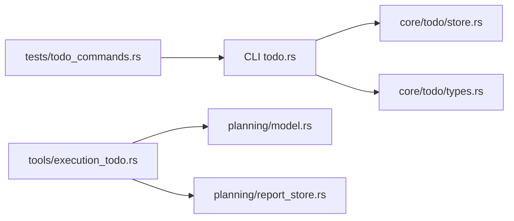

# Todo 待办事项命令

<cite>
**本文引用的文件**
- [agent-diva-cli/src/commands/todo.rs](file://agent-diva-cli/src/commands/todo.rs)
- [agent-diva-core/src/todo/mod.rs](file://agent-diva-core/src/todo/mod.rs)
- [agent-diva-core/src/todo/types.rs](file://agent-diva-core/src/todo/types.rs)
- [agent-diva-core/src/todo/store.rs](file://agent-diva-core/src/todo/store.rs)
- [agent-diva-tools/src/execution_todo.rs](file://agent-diva-tools/src/execution_todo.rs)
- [agent-diva-core/src/planning/model.rs](file://agent-diva-core/src/planning/model.rs)
- [agent-diva-core/src/planning/report_store.rs](file://agent-diva-core/src/planning/report_store.rs)
- [agent-diva-cli/tests/todo_commands.rs](file://agent-diva-cli/tests/todo_commands.rs)
</cite>

## 目录
1. [简介](#简介)
2. [项目结构](#项目结构)
3. [核心组件](#核心组件)
4. [架构总览](#架构总览)
5. [详细组件分析](#详细组件分析)
6. [依赖关系分析](#依赖关系分析)
7. [性能考虑](#性能考虑)
8. [故障排查指南](#故障排查指南)
9. [结论](#结论)
10. [附录](#附录)

## 简介
本文件面向 Agent-Diva 中的“Todo 待办事项”能力，覆盖 CLI 命令、运行时持久化、执行期任务管理以及与工作区、智能体的集成方式。内容涵盖：
- 创建、查看、更新、归档与清理等命令
- 数据结构与状态机（含别名与过滤）
- 优先级、截止日期（时间戳）、来源与关联会话/运行 ID
- 批量操作、筛选搜索、导出导入思路
- 自动化、提醒通知、统计分析的扩展用法

## 项目结构
Todo 功能由三层组成：
- CLI 层：提供用户可执行的 todo 子命令（list/add/update/archive/purge）
- 运行时存储层：JSONL 追加式持久化，支持并发安全与归档清理
- 执行期工具层：为已批准的执行会话提供“显示/写入”执行级 TODO 的能力，并与计划子系统类型对齐

图表来源
- [agent-diva-cli/src/commands/todo.rs:1-110](file://agent-diva-cli/src/commands/todo.rs#L1-L110)
- [agent-diva-core/src/todo/store.rs:1-233](file://agent-diva-core/src/todo/store.rs#L1-L233)
- [agent-diva-core/src/todo/types.rs:1-192](file://agent-diva-core/src/todo/types.rs#L1-L192)
- [agent-diva-tools/src/execution_todo.rs:1-193](file://agent-diva-tools/src/execution_todo.rs#L1-L193)
- [agent-diva-core/src/planning/report_store.rs:1-77](file://agent-diva-core/src/planning/report_store.rs#L1-L77)
- [agent-diva-core/src/planning/model.rs:1-200](file://agent-diva-core/src/planning/model.rs#L1-L200)

章节来源
- [agent-diva-cli/src/commands/todo.rs:1-110](file://agent-diva-cli/src/commands/todo.rs#L1-L110)
- [agent-diva-core/src/todo/mod.rs:1-8](file://agent-diva-core/src/todo/mod.rs#L1-L8)

## 核心组件
- CLI 命令入口：定义 list/add/update/archive/purge 五个子命令，解析参数并调用存储层
- 运行时存储：基于 JSONL 的追加式存储，具备共享/独占锁、原子重写、归档与清理
- 数据类型：统一的状态枚举、过滤器、项结构体，支持别名与终端态保护
- 执行期工具：为审批通过的执行会话提供“展示/替换”执行级 TODO 的工具，包含优先级、阻塞原因、证据引用等字段

章节来源
- [agent-diva-cli/src/commands/todo.rs:1-110](file://agent-diva-cli/src/commands/todo.rs#L1-L110)
- [agent-diva-core/src/todo/store.rs:1-233](file://agent-diva-core/src/todo/store.rs#L1-L233)
- [agent-diva-core/src/todo/types.rs:1-192](file://agent-diva-core/src/todo/types.rs#L1-L192)
- [agent-diva-tools/src/execution_todo.rs:1-193](file://agent-diva-tools/src/execution_todo.rs#L1-L193)

## 架构总览
下图展示了从 CLI 到存储再到归档文件的完整数据流，以及执行期工具如何与计划子系统协作。

图表来源
- [agent-diva-cli/src/commands/todo.rs:38-99](file://agent-diva-cli/src/commands/todo.rs#L38-L99)
- [agent-diva-core/src/todo/store.rs:33-154](file://agent-diva-core/src/todo/store.rs#L33-L154)
- [agent-diva-tools/src/execution_todo.rs:24-161](file://agent-diva-tools/src/execution_todo.rs#L24-L161)
- [agent-diva-core/src/planning/report_store.rs:31-77](file://agent-diva-core/src/planning/report_store.rs#L31-L77)

## 详细组件分析

### CLI 命令：todo
- 可用子命令
  - list：列出所有待办，打印 ID、状态、标题
  - add：新增待办，默认来源为 cli
  - update：按 ID 更新状态，支持 open/pending/active/done/completed/cancelled 等别名
  - archive：归档超过 N 天的已完成项
  - purge：清理超过 N 个月的归档文件
- 关键行为
  - 通过 JsonlTodoStore 打开数据根目录下的 todos.jsonl
  - 状态解析使用统一的 parse_update，确保别名兼容
  - 归档/清理返回处理数量，便于脚本化

图表来源
- [agent-diva-cli/src/commands/todo.rs:38-99](file://agent-diva-cli/src/commands/todo.rs#L38-L99)

章节来源
- [agent-diva-cli/src/commands/todo.rs:1-110](file://agent-diva-cli/src/commands/todo.rs#L1-L110)
- [agent-diva-cli/tests/todo_commands.rs:35-276](file://agent-diva-cli/tests/todo_commands.rs#L35-L276)

### 运行时存储：JsonlTodoStore
- 存储格式
  - 主文件：todos.jsonl（每行一个 JSON 对象）
  - 归档文件：todos.archive.YYYY-MM.jsonl（按月归档）
  - 锁文件：todos.lock（用于并发控制）
- 并发与一致性
  - 读操作使用共享锁；写/改/归档/清理使用独占锁
  - 更新采用“临时文件 + 原子替换”策略，避免部分写入
- 核心方法
  - create/get/list：追加、查找、全量读取
  - update_status：非终端态允许更新；终端态不可变
  - archive_completed：将满足条件的已完成项移至当月归档，并从主文件剔除
  - purge_archived：删除早于阈值的归档文件
- 健壮性
  - 读取时跳过空行与无法解析的行
  - 跨平台文件替换兼容

图表来源
- [agent-diva-core/src/todo/store.rs:10-233](file://agent-diva-core/src/todo/store.rs#L10-L233)

章节来源
- [agent-diva-core/src/todo/store.rs:1-598](file://agent-diva-core/src/todo/store.rs#L1-L598)

### 数据类型与状态机
- 状态枚举
  - Pending、Active、Completed、Cancelled
  - 终端态：Completed、Cancelled（不可再变更）
  - 别名映射：open→pending；done→completed
- 过滤器
  - Open：包含 pending 与 active
  - Status：精确匹配某个状态
- 项结构
  - id、title、status、source、session_id、linked_run_id、created_at、updated_at
  - 新项默认状态为 Pending，时间戳为当前 UTC 时间

图表来源
- [agent-diva-core/src/todo/types.rs:6-79](file://agent-diva-core/src/todo/types.rs#L6-L79)

章节来源
- [agent-diva-core/src/todo/types.rs:1-192](file://agent-diva-core/src/todo/types.rs#L1-L192)

### 执行期 TODO：与计划子系统集成
- 工具
  - todo_show：展示指定执行会话的 TODO 列表
  - todo_write：批量创建或替换执行会话的 TODO 列表
- 数据结构
  - 执行级 TODO 包含：id、title、detail、status、priority、evidence_ref、block_reason、updated_at
  - 状态：Pending、InProgress、Blocked、Completed、Canceled
  - 优先级：Low、Normal、High
- 存储
  - 通过 EphemeralPlanRegistry 在进程内维护会话隔离的执行上下文与 TODO 快照
  - 与 planning 模块的类型体系一致，便于后续持久化与审计

图表来源
- [agent-diva-tools/src/execution_todo.rs:24-161](file://agent-diva-tools/src/execution_todo.rs#L24-L161)
- [agent-diva-core/src/planning/report_store.rs:31-77](file://agent-diva-core/src/planning/report_store.rs#L31-L77)
- [agent-diva-core/src/planning/model.rs:69-185](file://agent-diva-core/src/planning/model.rs#L69-L185)

章节来源
- [agent-diva-tools/src/execution_todo.rs:1-193](file://agent-diva-tools/src/execution_todo.rs#L1-L193)
- [agent-diva-core/src/planning/model.rs:1-200](file://agent-diva-core/src/planning/model.rs#L1-L200)
- [agent-diva-core/src/planning/report_store.rs:1-77](file://agent-diva-core/src/planning/report_store.rs#L1-L77)

## 依赖关系分析
- CLI 依赖 core::todo（store/types），并通过 clap 暴露子命令
- 存储层依赖 fs2 进行文件级锁，chrono 处理时间，serde_json 序列化
- 执行期工具依赖 planning 模块的类型与进程内注册表，实现会话隔离
- 测试覆盖 CLI 端到端流程（添加、列出、更新、归档、清理）

图表来源
- [agent-diva-cli/src/commands/todo.rs:1-110](file://agent-diva-cli/src/commands/todo.rs#L1-L110)
- [agent-diva-core/src/todo/store.rs:1-233](file://agent-diva-core/src/todo/store.rs#L1-L233)
- [agent-diva-core/src/todo/types.rs:1-192](file://agent-diva-core/src/todo/types.rs#L1-L192)
- [agent-diva-tools/src/execution_todo.rs:1-193](file://agent-diva-tools/src/execution_todo.rs#L1-L193)
- [agent-diva-core/src/planning/model.rs:1-200](file://agent-diva-core/src/planning/model.rs#L1-L200)
- [agent-diva-core/src/planning/report_store.rs:1-77](file://agent-diva-core/src/planning/report_store.rs#L1-L77)
- [agent-diva-cli/tests/todo_commands.rs:35-276](file://agent-diva-cli/tests/todo_commands.rs#L35-L276)

章节来源
- [agent-diva-cli/tests/todo_commands.rs:35-276](file://agent-diva-cli/tests/todo_commands.rs#L35-L276)

## 性能考虑
- 存储 I/O
  - 追加写入 O(1)，读取全量 O(n)
  - 更新/归档会触发全量重写，适合中小规模数据集
- 并发安全
  - 文件级锁保证多进程/多线程读写一致性
  - 原子替换避免损坏主文件
- 归档与清理
  - 按月归档减少主文件膨胀
  - 定期 purge 控制磁盘占用
- 建议
  - 大批量更新时合并为一次 replace（执行期工具已支持批量替换）
  - 对高频读取场景可结合缓存或索引（例如按状态/时间范围）

[本节为通用指导，不直接分析具体文件]

## 故障排查指南
- 常见错误
  - 无效状态：update 时传入未识别的状态值会被拒绝
  - 找不到项：update 目标 ID 不存在返回 None
  - 终端态不可变：Completed/Cancelled 再次更新不会改变状态
  - 归档/清理失败：检查数据根目录权限与路径有效性
- 定位方法
  - 使用 list 验证当前数据
  - 使用 archive 与 purge 的返回值判断是否生效
  - 检查本地 JSONL 文件格式与锁文件是否存在
- 参考用例
  - 端到端测试覆盖了 add → list → update → archive → purge 的完整链路

章节来源
- [agent-diva-cli/src/commands/todo.rs:101-109](file://agent-diva-cli/src/commands/todo.rs#L101-L109)
- [agent-diva-core/src/todo/store.rs:61-154](file://agent-diva-core/src/todo/store.rs#L61-L154)
- [agent-diva-cli/tests/todo_commands.rs:108-276](file://agent-diva-cli/tests/todo_commands.rs#L108-L276)

## 结论
Agent-Diva 的 Todo 能力以轻量 JSONL 存储为核心，提供稳定的 CLI 接口与执行期工具集成。其状态机清晰、并发安全、支持归档与清理，便于在生产环境中长期运行。配合执行期工具的批量写入与优先级/阻塞信息，可与计划系统协同，形成从规划到执行的闭环。

[本节为总结性内容，不直接分析具体文件]

## 附录

### 命令速查
- todo list：列出所有待办
- todo add <标题>：新增待办
- todo update <ID> --status <状态>：更新状态（支持 open/pending/active/done/completed/cancelled）
- todo archive --days <天数>：归档超时的已完成项
- todo purge --months <月数>：清理过期归档文件

章节来源
- [agent-diva-cli/src/commands/todo.rs:6-36](file://agent-diva-cli/src/commands/todo.rs#L6-L36)

### 数据结构要点
- 运行时项：id、title、status、source、session_id、linked_run_id、created_at、updated_at
- 执行期项：id、title、detail、status、priority、evidence_ref、block_reason、updated_at
- 状态与优先级：见类型定义与别名映射

章节来源
- [agent-diva-core/src/todo/types.rs:81-112](file://agent-diva-core/src/todo/types.rs#L81-L112)
- [agent-diva-core/src/planning/model.rs:163-185](file://agent-diva-core/src/planning/model.rs#L163-L185)

### 高级用法与实践
- 批量操作
  - 执行期工具支持一次性替换整个会话的 TODO 列表，适合任务分解与重排
- 筛选与搜索
  - 使用过滤器 Open/Status 快速定位活跃或特定状态的项
  - 结合时间戳（created_at/updated_at）做时间范围筛选
- 导出与导入
  - 导出：直接读取 todos.jsonl 与归档文件
  - 导入：按 JSONL 格式追加条目（注意保持唯一 ID 与时间戳）
- 自动化与提醒
  - 定时任务：周期性执行 archive/purge，保持数据整洁
  - 提醒：基于 updated_at 与状态变化，结合外部渠道发送通知
- 统计分析
  - 统计各状态数量、平均完成时长、阻塞原因分布等，辅助复盘与优化

[本节为概念性说明，不直接分析具体文件]