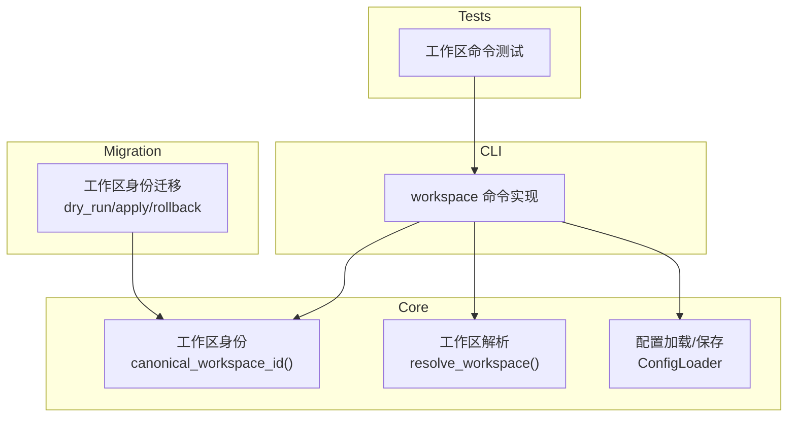
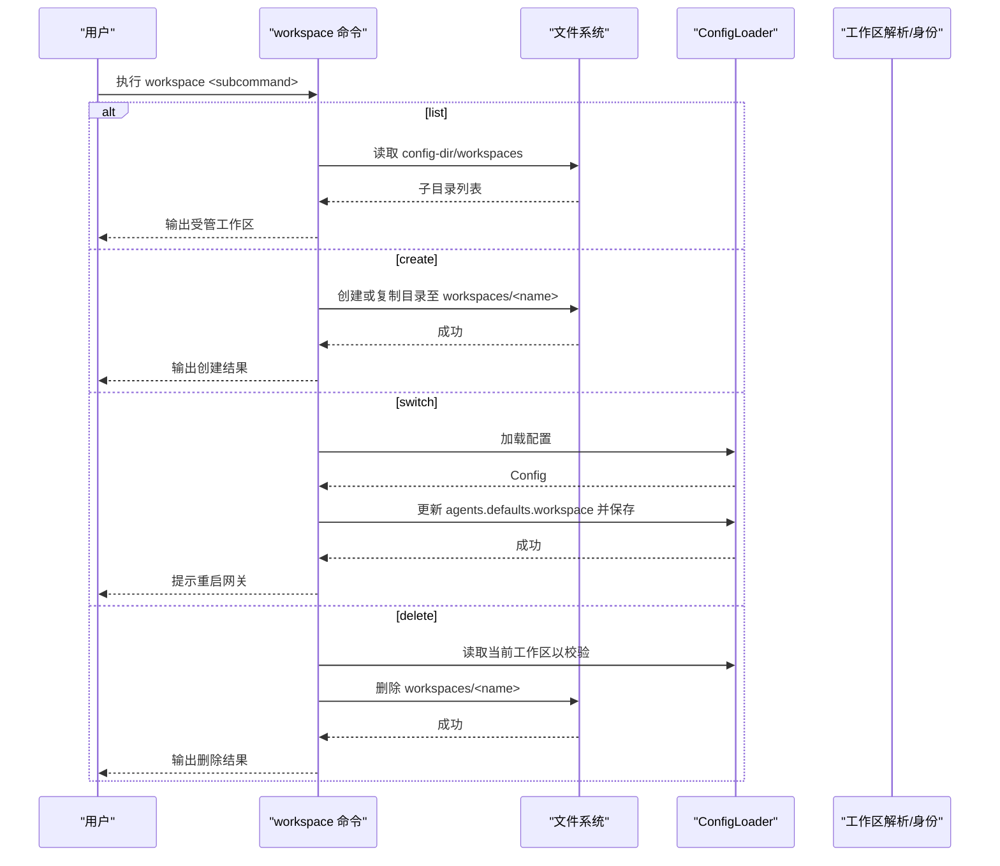
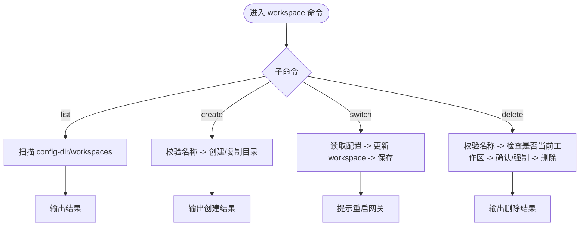
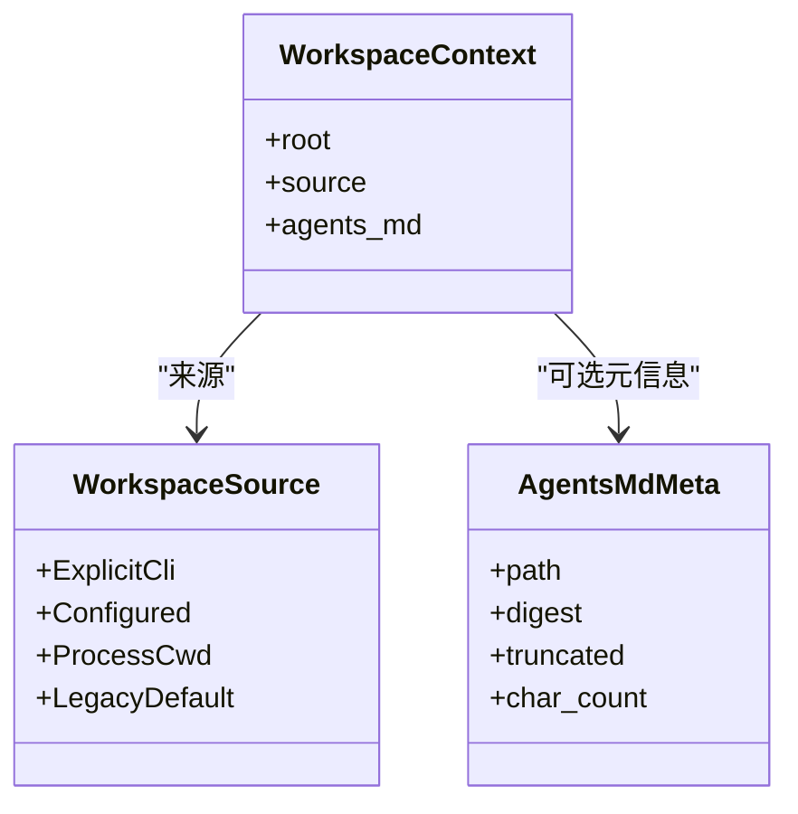
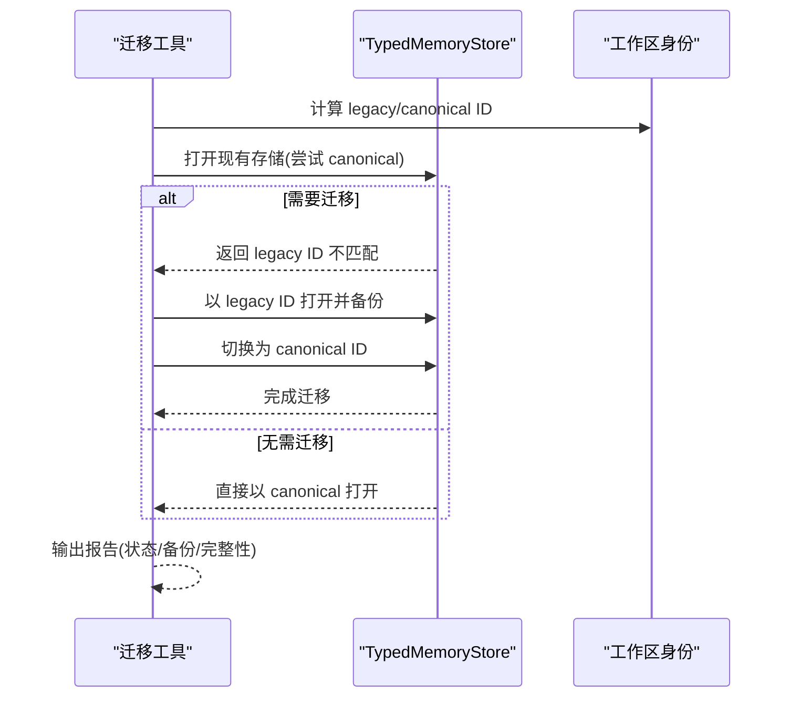
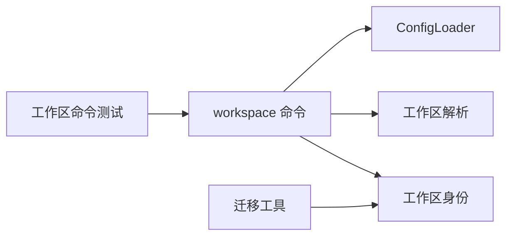

# Workspace 管理命令

<cite>
**本文引用的文件**
- [agent-diva-cli/src/commands/workspace.rs](file://agent-diva-cli/src/commands/workspace.rs)
- [agent-diva-core/src/workspace.rs](file://agent-diva-core/src/workspace.rs)
- [agent-diva-core/src/workspace_identity.rs](file://agent-diva-core/src/workspace_identity.rs)
- [agent-diva-core/src/config/schema.rs](file://agent-diva-core/src/config/schema.rs)
- [agent-diva-core/src/config/loader.rs](file://agent-diva-core/src/config/loader.rs)
- [agent-diva-migration/src/workspace_identity.rs](file://agent-diva-migration/src/workspace_identity.rs)
- [agent-diva-cli/tests/workspace_commands.rs](file://agent-diva-cli/tests/workspace_commands.rs)
</cite>

## 目录
1. [简介](#简介)
2. [项目结构](#项目结构)
3. [核心组件](#核心组件)
4. [架构总览](#架构总览)
5. [详细组件分析](#详细组件分析)
6. [依赖关系分析](#依赖关系分析)
7. [性能与可扩展性](#性能与可扩展性)
8. [故障排查指南](#故障排查指南)
9. [结论](#结论)
10. [附录](#附录)

## 简介
本文件面向 Agent-Diva 的“工作区（Workspace）”管理能力，围绕 CLI 提供的 workspace 子命令，系统说明工作区的创建、切换、查看、删除等操作的语义、数据流向与约束；并解释工作区概念、目录组织、配置文件中的工作区字段、数据隔离机制、迁移与备份策略，以及多工作区管理的最佳实践。

## 项目结构
- CLI 层：提供 workspace 子命令（list/create/switch/delete），负责用户交互、参数校验、工作区目录操作与配置持久化。
- Core 层：定义工作区解析规则（优先级、路径规范化）、工作区身份标识（稳定 ID），以及配置加载与热重载。
- Migration 层：提供工作区身份迁移能力（从旧路径 ID 迁移到规范 ID），支持干跑、应用与回滚。
- Tests：覆盖工作区命令的端到端行为，包括创建、列表、切换、删除、安全限制等。

图表来源
- [agent-diva-cli/src/commands/workspace.rs:36-152](file://agent-diva-cli/src/commands/workspace.rs#L36-L152)
- [agent-diva-core/src/workspace.rs:77-114](file://agent-diva-core/src/workspace.rs#L77-L114)
- [agent-diva-core/src/workspace_identity.rs:6-22](file://agent-diva-core/src/workspace_identity.rs#L6-L22)
- [agent-diva-core/src/config/loader.rs:57-82](file://agent-diva-core/src/config/loader.rs#L57-L82)
- [agent-diva-migration/src/workspace_identity.rs:19-71](file://agent-diva-migration/src/workspace_identity.rs#L19-L71)
- [agent-diva-cli/tests/workspace_commands.rs:35-191](file://agent-diva-cli/tests/workspace_commands.rs#L35-L191)

章节来源
- [agent-diva-cli/src/commands/workspace.rs:36-152](file://agent-diva-cli/src/commands/workspace.rs#L36-L152)
- [agent-diva-core/src/workspace.rs:77-114](file://agent-diva-core/src/workspace.rs#L77-L114)
- [agent-diva-core/src/config/loader.rs:57-82](file://agent-diva-core/src/config/loader.rs#L57-L82)
- [agent-diva-migration/src/workspace_identity.rs:19-71](file://agent-diva-migration/src/workspace_identity.rs#L19-L71)
- [agent-diva-cli/tests/workspace_commands.rs:35-191](file://agent-diva-cli/tests/workspace_commands.rs#L35-L191)

## 核心组件
- 工作区命令（CLI）
  - list：列出受管工作区（config-dir/workspaces 下的子目录）。
  - create：在 config-dir/workspaces 下创建工作区目录，可选从源路径复制内容。
  - switch：将当前实例的配置 agents.defaults.workspace 指向目标工作区，并提示重启网关生效。
  - delete：删除指定工作区，阻止删除当前已激活的工作区，支持 --force 跳过确认。
- 工作区解析（Core）
  - 解析优先级：CLI 显式覆盖 > 配置中显式设置 > 进程启动 CWD；若配置仍为遗留默认值则告警并回退到 CWD。
  - 路径处理：展开 ~、绝对化、规范化（符号链接/尾随分隔符）。
- 工作区身份（Core/Migration）
  - 基于规范化绝对路径计算稳定 ID，用于存储与索引定位。
  - 迁移工具支持 dry-run、apply、rollback，保障历史数据可追溯与可恢复。
- 配置加载（Core）
  - 读取/写入 config.json，支持环境变量覆盖、别名归一化、热重载差异分类。

章节来源
- [agent-diva-cli/src/commands/workspace.rs:8-34](file://agent-diva-cli/src/commands/workspace.rs#L8-L34)
- [agent-diva-core/src/workspace.rs:7-16](file://agent-diva-core/src/workspace.rs#L7-L16)
- [agent-diva-core/src/workspace_identity.rs:6-22](file://agent-diva-core/src/workspace_identity.rs#L6-L22)
- [agent-diva-core/src/config/loader.rs:57-82](file://agent-diva-core/src/config/loader.rs#L57-L82)

## 架构总览
下图展示了工作区命令与核心模块之间的调用关系与数据流。

图表来源
- [agent-diva-cli/src/commands/workspace.rs:36-152](file://agent-diva-cli/src/commands/workspace.rs#L36-L152)
- [agent-diva-core/src/config/loader.rs:57-82](file://agent-diva-core/src/config/loader.rs#L57-L82)

## 详细组件分析

### 工作区命令（CLI）
- 命令定义与参数
  - list：无参，仅扫描 config-dir/workspaces。
  - create name [--path src]：name 必须为单一目录名，拒绝路径穿越；可选从 src 递归复制。
  - switch name：将 agents.defaults.workspace 设置为该工作区绝对路径。
  - delete name [--force]：删除前检查是否为当前激活工作区，非强制时交互式确认。
- 关键流程
  - 名称校验：仅允许普通目录名且不含路径分隔或遍历段。
  - 路径解析：workspaces_root = config_dir + "/workspaces"；目标 = workspaces_root + name。
  - 切换逻辑：读取配置 -> 修改 agents.defaults.workspace -> 保存 -> 提示重启。
  - 删除保护：比较规范化后的当前工作区与待删目标，相同则拒绝。
- 错误与安全
  - 名称非法：立即报错。
  - 目标不存在：报错。
  - 删除当前工作区：拒绝并给出明确提示。

图表来源
- [agent-diva-cli/src/commands/workspace.rs:36-152](file://agent-diva-cli/src/commands/workspace.rs#L36-L152)
- [agent-diva-cli/src/commands/workspace.rs:154-173](file://agent-diva-cli/src/commands/workspace.rs#L154-L173)

章节来源
- [agent-diva-cli/src/commands/workspace.rs:8-34](file://agent-diva-cli/src/commands/workspace.rs#L8-L34)
- [agent-diva-cli/src/commands/workspace.rs:36-152](file://agent-diva-cli/src/commands/workspace.rs#L36-L152)
- [agent-diva-cli/src/commands/workspace.rs:154-173](file://agent-diva-cli/src/commands/workspace.rs#L154-L173)
- [agent-diva-cli/tests/workspace_commands.rs:35-191](file://agent-diva-cli/tests/workspace_commands.rs#L35-L191)

### 工作区解析与数据隔离（Core）
- 解析优先级
  - CLI 显式 --workspace 覆盖（最高优先级）。
  - 配置 agents.defaults.workspace（若非遗留默认值）。
  - 进程启动 CWD（若配置为遗留默认值，记录警告日志）。
- 路径处理
  - 展开 ~/ 前缀、相对路径绝对化、符号链接规范化。
- 数据隔离
  - 每个运行时会话携带独立的 WorkspaceContext，不修改全局 CWD，避免并发冲突。
  - 工作区身份基于规范化路径生成稳定 ID，确保跨平台一致性与可迁移性。

图表来源
- [agent-diva-core/src/workspace.rs:20-72](file://agent-diva-core/src/workspace.rs#L20-L72)
- [agent-diva-core/src/workspace.rs:77-114](file://agent-diva-core/src/workspace.rs#L77-L114)

章节来源
- [agent-diva-core/src/workspace.rs:7-16](file://agent-diva-core/src/workspace.rs#L7-L16)
- [agent-diva-core/src/workspace.rs:77-114](file://agent-diva-core/src/workspace.rs#L77-L114)

### 工作区身份与迁移（Core/Migration）
- 身份生成
  - canonical_workspace_id：对规范化绝对路径做 SHA-256 摘要，生成稳定 ID（长度固定，便于索引与迁移）。
  - legacy_path_workspace_id：兼容旧存储使用原始路径作为 ID。
- 迁移能力
  - dry_run：评估是否需要迁移，返回报告（含备份位置、完整性信息）。
  - apply：将存储切换到规范 ID，保留备份与清单。
  - rollback：回滚到旧 ID，恢复原状。

图表来源
- [agent-diva-core/src/workspace_identity.rs:6-22](file://agent-diva-core/src/workspace_identity.rs#L6-L22)
- [agent-diva-migration/src/workspace_identity.rs:19-71](file://agent-diva-migration/src/workspace_identity.rs#L19-L71)

章节来源
- [agent-diva-core/src/workspace_identity.rs:6-22](file://agent-diva-core/src/workspace_identity.rs#L6-L22)
- [agent-diva-migration/src/workspace_identity.rs:19-71](file://agent-diva-migration/src/workspace_identity.rs#L19-L71)

### 配置组织与热重载（Core）
- 配置结构
  - agents.defaults.workspace：当前工作区路径（支持 ~ 展开）。
  - 其他字段如 provider/model 等与工作区无关，但可通过环境变量覆盖。
- 加载与保存
  - 合并默认值、文件与环境变量，进行别名归一化与校验。
  - 支持热重载：部分字段变更无需重启，其余需重启。
- 工作区切换影响
  - 通过 workspace switch 修改 agents.defaults.workspace 后，需重启网关使新工作区生效。

章节来源
- [agent-diva-core/src/config/schema.rs:559-603](file://agent-diva-core/src/config/schema.rs#L559-L603)
- [agent-diva-core/src/config/loader.rs:57-82](file://agent-diva-core/src/config/loader.rs#L57-L82)
- [agent-diva-core/src/config/loader.rs:94-166](file://agent-diva-core/src/config/loader.rs#L94-L166)

## 依赖关系分析
- CLI 依赖 Core 的配置加载器进行读写；依赖 Core 的工作区解析与身份模块进行路径与 ID 处理。
- Migration 依赖 Core 的身份模块，提供可逆的数据迁移能力。
- Tests 通过真实进程调用验证 CLI 行为与边界条件。

图表来源
- [agent-diva-cli/src/commands/workspace.rs:36-152](file://agent-diva-cli/src/commands/workspace.rs#L36-L152)
- [agent-diva-core/src/config/loader.rs:57-82](file://agent-diva-core/src/config/loader.rs#L57-L82)
- [agent-diva-core/src/workspace.rs:77-114](file://agent-diva-core/src/workspace.rs#L77-L114)
- [agent-diva-core/src/workspace_identity.rs:6-22](file://agent-diva-core/src/workspace_identity.rs#L6-L22)
- [agent-diva-migration/src/workspace_identity.rs:19-71](file://agent-diva-migration/src/workspace_identity.rs#L19-L71)
- [agent-diva-cli/tests/workspace_commands.rs:35-191](file://agent-diva-cli/tests/workspace_commands.rs#L35-L191)

章节来源
- [agent-diva-cli/src/commands/workspace.rs:36-152](file://agent-diva-cli/src/commands/workspace.rs#L36-L152)
- [agent-diva-core/src/config/loader.rs:57-82](file://agent-diva-core/src/config/loader.rs#L57-L82)
- [agent-diva-core/src/workspace.rs:77-114](file://agent-diva-core/src/workspace.rs#L77-L114)
- [agent-diva-core/src/workspace_identity.rs:6-22](file://agent-diva-core/src/workspace_identity.rs#L6-L22)
- [agent-diva-migration/src/workspace_identity.rs:19-71](file://agent-diva-migration/src/workspace_identity.rs#L19-L71)
- [agent-diva-cli/tests/workspace_commands.rs:35-191](file://agent-diva-cli/tests/workspace_commands.rs#L35-L191)

## 性能与可扩展性
- 工作区列表：仅扫描 config-dir/workspaces 目录，复杂度 O(N)，N 为子目录数量。
- 切换工作区：一次配置读取与一次写回，开销极低。
- 删除工作区：递归删除目录，注意大目录耗时；建议配合 --force 自动化脚本。
- 扩展点
  - 可在 CLI 增加批量操作（如批量复制模板、批量切换）。
  - 可在 Core 增加工作区级权限与沙箱策略，进一步隔离不同工作区的资源访问。

[本节为通用指导，不直接分析具体文件]

## 故障排查指南
- 常见错误
  - 工作区名称非法：包含路径分隔或遍历段会被拒绝。
  - 删除当前工作区：被阻止，需先切换到其他工作区。
  - 切换后未生效：需重启网关以使新的工作区配置生效。
- 诊断步骤
  - 使用 workspace list 确认受管工作区是否存在。
  - 使用 workspace switch 后检查 config.json 中 agents.defaults.workspace 是否正确。
  - 若涉及存储迁移，使用迁移工具的 dry-run 预览状态，再 apply 或 rollback。

章节来源
- [agent-diva-cli/src/commands/workspace.rs:114-148](file://agent-diva-cli/src/commands/workspace.rs#L114-L148)
- [agent-diva-cli/tests/workspace_commands.rs:249-336](file://agent-diva-cli/tests/workspace_commands.rs#L249-L336)
- [agent-diva-migration/src/workspace_identity.rs:19-71](file://agent-diva-migration/src/workspace_identity.rs#L19-L71)

## 结论
Agent-Diva 的工作区管理通过 CLI 命令与 Core 解析/身份模块协同，提供了清晰、安全的多工作区管理能力。其设计强调：
- 明确的解析优先级与路径规范化，避免歧义。
- 严格的安全校验与保护（名称合法性、禁止删除当前工作区）。
- 稳定的工作区身份与可逆迁移，保障数据一致性。
- 配置集中管理与热重载，提升运维效率。

## 附录
- 常用命令速查
  - 列出工作区：workspace list
  - 创建工作区：workspace create <name> [--path <src>]
  - 切换工作区：workspace switch <name>
  - 删除工作区：workspace delete <name> [--force]
- 最佳实践
  - 将项目根目录作为工作区，保持 agents.defaults.workspace 指向明确路径。
  - 使用 workspace create --path 快速复制模板，统一团队环境。
  - 定期使用迁移工具 dry-run 检查存储状态，必要时 apply 或 rollback。
  - 切换工作区后务必重启网关，确保配置生效。

[本节为通用指导，不直接分析具体文件]