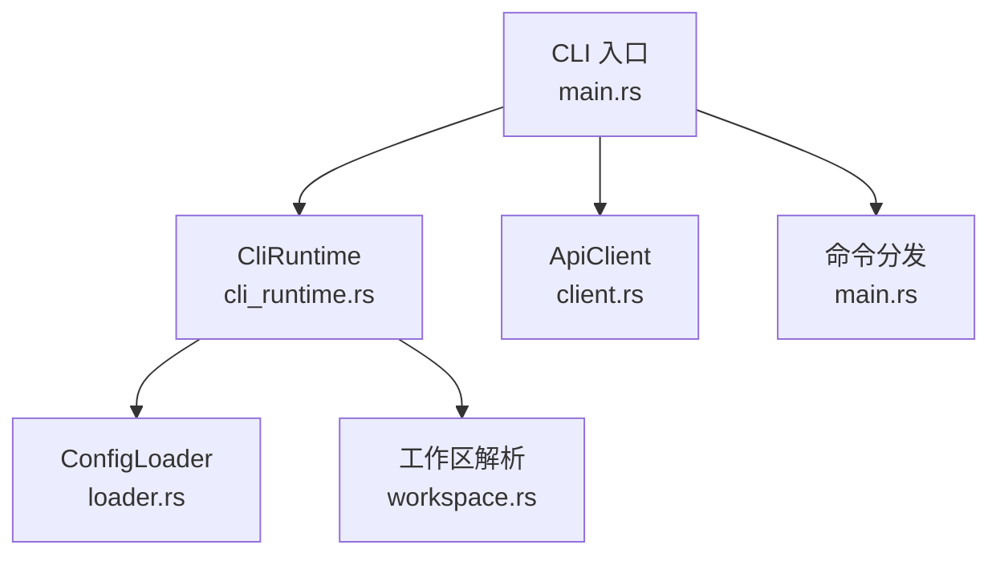
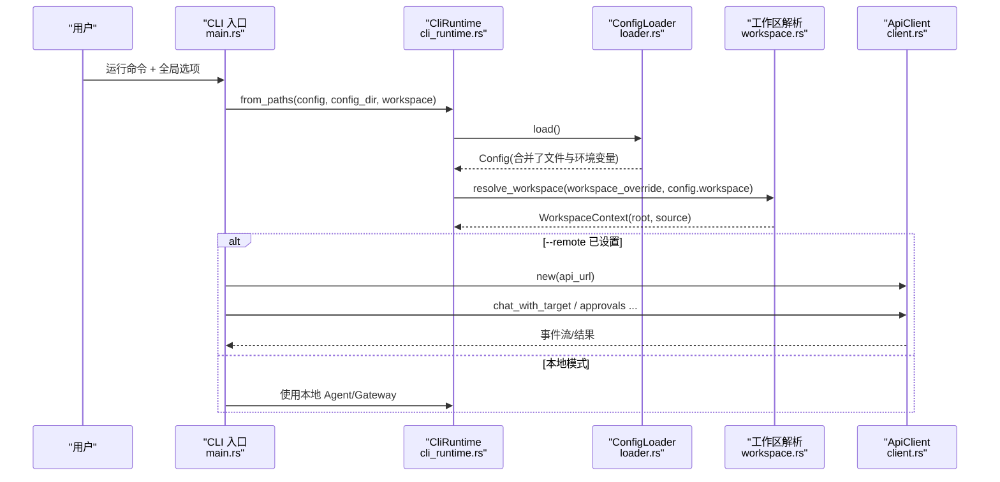
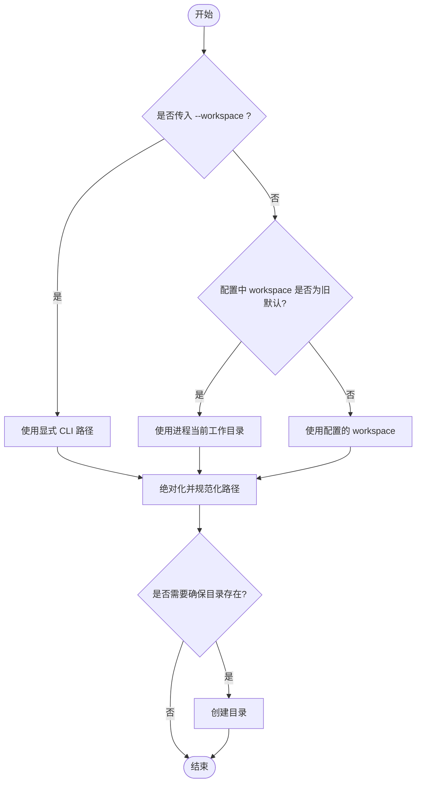
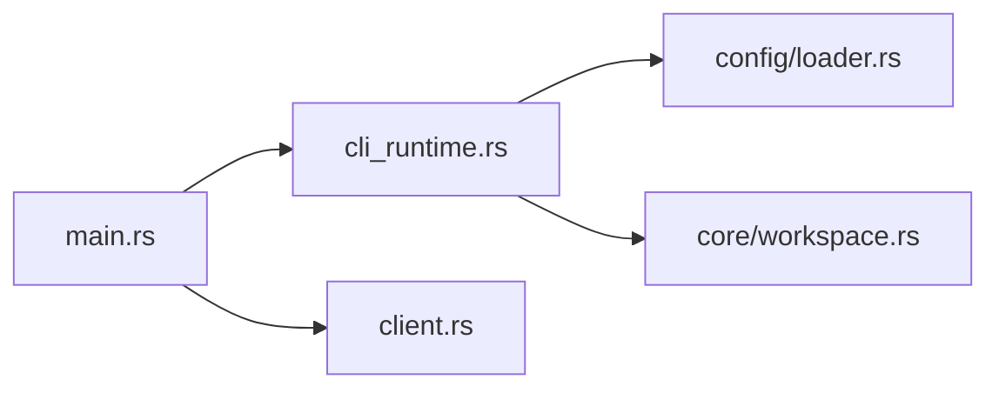

# 全局选项

<cite>
**本文引用的文件**
- [agent-diva-cli/src/main.rs](file://agent-diva-cli/src/main.rs)
- [agent-diva-cli/src/cli_runtime.rs](file://agent-diva-cli/src/cli_runtime.rs)
- [agent-diva-core/src/config/loader.rs](file://agent-diva-core/src/config/loader.rs)
- [agent-diva-cli/src/client.rs](file://agent-diva-cli/src/client.rs)
- [agent-diva-core/src/workspace.rs](file://agent-diva-core/src/workspace.rs)
</cite>

## 目录
1. [简介](#简介)
2. [项目结构](#项目结构)
3. [核心组件](#核心组件)
4. [架构总览](#架构总览)
5. [详细组件分析](#详细组件分析)
6. [依赖关系分析](#依赖关系分析)
7. [性能考虑](#性能考虑)
8. [故障排查指南](#故障排查指南)
9. [结论](#结论)
10. [附录](#附录)

## 简介
本章节面向 CLI 用户与集成方，系统化说明所有命令共享的全局选项及其行为。重点覆盖：
- --config：指定配置文件路径
- --config-dir：指定配置目录
- --workspace：临时覆盖工作区（不修改持久配置）
- --remote：切换到远程模式（通过 Manager API 执行）
- --api-url：指定远程 API 地址

同时解释各选项的默认值、使用场景、优先级与环境变量覆盖方式，并提供开发/测试/生产环境的差异化配置示例。

## 项目结构
CLI 入口定义全局参数，运行时负责解析配置与工作区，远程模式通过 HTTP 客户端连接 Manager。

图表来源
- [agent-diva-cli/src/main.rs:59-86](file://agent-diva-cli/src/main.rs#L59-L86)
- [agent-diva-cli/src/cli_runtime.rs:117-135](file://agent-diva-cli/src/cli_runtime.rs#L117-L135)
- [agent-diva-core/src/config/loader.rs:19-55](file://agent-diva-core/src/config/loader.rs#L19-L55)
- [agent-diva-cli/src/client.rs:43-54](file://agent-diva-cli/src/client.rs#L43-L54)
- [agent-diva-core/src/workspace.rs:87-114](file://agent-diva-core/src/workspace.rs#L87-L114)

章节来源
- [agent-diva-cli/src/main.rs:59-86](file://agent-diva-cli/src/main.rs#L59-L86)
- [agent-diva-cli/src/cli_runtime.rs:117-135](file://agent-diva-cli/src/cli_runtime.rs#L117-L135)
- [agent-diva-core/src/config/loader.rs:19-55](file://agent-diva-core/src/config/loader.rs#L19-L55)
- [agent-diva-cli/src/client.rs:43-54](file://agent-diva-cli/src/client.rs#L43-L54)
- [agent-diva-core/src/workspace.rs:87-114](file://agent-diva-core/src/workspace.rs#L87-L114)

## 核心组件
- CLI 全局参数：在 CLI 入口中声明为全局参数，供所有子命令共享。
- 配置加载器：负责从默认位置或显式路径加载配置，并应用环境变量覆盖与别名归一化。
- 运行时：封装配置加载、工作区解析、路径报告等能力。
- 远程客户端：提供与 Manager 的 HTTP 通信能力，支持本地回环自动禁用代理。

章节来源
- [agent-diva-cli/src/main.rs:59-86](file://agent-diva-cli/src/main.rs#L59-L86)
- [agent-diva-core/src/config/loader.rs:57-74](file://agent-diva-core/src/config/loader.rs#L57-L74)
- [agent-diva-cli/src/cli_runtime.rs:117-135](file://agent-diva-cli/src/cli_runtime.rs#L117-L135)
- [agent-diva-cli/src/client.rs:43-54](file://agent-diva-cli/src/client.rs#L43-L54)

## 架构总览
下图展示了全局选项如何影响配置加载、工作区选择与远程调用流程。

图表来源
- [agent-diva-cli/src/main.rs:59-86](file://agent-diva-cli/src/main.rs#L59-L86)
- [agent-diva-cli/src/cli_runtime.rs:117-135](file://agent-diva-cli/src/cli_runtime.rs#L117-L135)
- [agent-diva-core/src/config/loader.rs:57-74](file://agent-diva-core/src/config/loader.rs#L57-L74)
- [agent-diva-core/src/workspace.rs:87-114](file://agent-diva-core/src/workspace.rs#L87-L114)
- [agent-diva-cli/src/client.rs:43-54](file://agent-diva-cli/src/client.rs#L43-L54)

## 详细组件分析

### 全局选项总览
- --config <path>
  - 作用：指定配置文件路径。若提供，则以此文件为准；其父目录作为配置目录。
  - 默认值：未提供时，默认使用用户主目录下的 .agent-diva/config.json。
  - 冲突：与 --config-dir 互斥。
  - 使用场景：多实例管理、CI 中按环境切换不同配置文件。
  - 参考实现：[CLI 定义:67-69](file://agent-diva-cli/src/main.rs#L67-L69)、[配置加载器 with_file:43-55](file://agent-diva-core/src/config/loader.rs#L43-L55)。

- --config-dir <dir>
  - 作用：指定配置目录。该目录下需存在 config.json。
  - 默认值：未提供时使用默认配置目录。
  - 使用场景：将一组配置与数据隔离到独立目录，便于容器化或多租户。
  - 参考实现：[CLI 定义:71-73](file://agent-diva-cli/src/main.rs#L71-L73)、[配置加载器 with_dir:34-41](file://agent-diva-core/src/config/loader.rs#L34-L41)。

- --workspace <path>
  - 作用：仅对当前命令生效的工作区覆盖，不会写入配置。
  - 默认值：来自配置中的 agents.defaults.workspace；若为旧默认值则回退到进程当前工作目录。
  - 行为：解析后会绝对化并规范化；如源为显式 CLI 或配置项，且目录不存在会尝试创建。
  - 使用场景：临时针对某个项目目录运行命令，而不改变全局配置。
  - 参考实现：[CLI 定义:75-77](file://agent-diva-cli/src/main.rs#L75-L77)、[工作区解析:87-114](file://agent-diva-core/src/workspace.rs#L87-L114)、[运行时上下文:170-194](file://agent-diva-cli/src/cli_runtime.rs#L170-L194)。

- --remote
  - 作用：启用远程模式，所有需要与 Agent/Manager 交互的命令将通过 HTTP 调用远程服务。
  - 默认值：关闭（本地模式）。
  - 使用场景：在 CI、无头环境或跨主机场景中统一由 Manager 调度执行。
  - 参考实现：[命令分支处理:506-553](file://agent-diva-cli/src/main.rs#L506-L553)。

- --api-url <url>
  - 作用：指定远程 API 基地址。
  - 默认值：http://localhost:3000/api。
  - 行为：当 URL 指向本地回环地址时，自动禁用系统代理以避免代理干扰。
  - 使用场景：对接非本机 Manager、或通过反向代理暴露的 Manager。
  - 参考实现：[客户端初始化:43-54](file://agent-diva-cli/src/client.rs#L43-L54)。

章节来源
- [agent-diva-cli/src/main.rs:59-86](file://agent-diva-cli/src/main.rs#L59-L86)
- [agent-diva-core/src/config/loader.rs:19-55](file://agent-diva-core/src/config/loader.rs#L19-L55)
- [agent-diva-core/src/workspace.rs:87-114](file://agent-diva-core/src/workspace.rs#L87-L114)
- [agent-diva-cli/src/cli_runtime.rs:170-194](file://agent-diva-cli/src/cli_runtime.rs#L170-L194)
- [agent-diva-cli/src/client.rs:43-54](file://agent-diva-cli/src/client.rs#L43-L54)

### 配置加载与优先级
配置加载顺序与覆盖规则如下：
1. 基础默认值：程序内置默认。
2. 配置文件：如果存在，则合并到默认值之上。
3. 别名与路径覆盖：
   - 别名键映射：例如 OPENAI_API_KEY -> providers.openai.api_key。
   - 路径键映射：以 AGENT_DIVA__ 前缀的环境变量，按双下划线分隔映射到配置路径。
4. 校验：最终生成 Config 并进行语义校验。

注意：
- 路径键覆盖优先级高于别名键与配置文件。
- 支持热重载检测（用于长驻进程），但 CLI 单次执行不涉及热更新。

章节来源
- [agent-diva-core/src/config/loader.rs:57-74](file://agent-diva-core/src/config/loader.rs#L57-L74)
- [agent-diva-core/src/config/loader.rs:371-416](file://agent-diva-core/src/config/loader.rs#L371-L416)

### 工作区解析流程

图表来源
- [agent-diva-core/src/workspace.rs:87-114](file://agent-diva-core/src/workspace.rs#L87-L114)
- [agent-diva-cli/src/cli_runtime.rs:170-194](file://agent-diva-cli/src/cli_runtime.rs#L170-L194)

章节来源
- [agent-diva-core/src/workspace.rs:87-114](file://agent-diva-core/src/workspace.rs#L87-L114)
- [agent-diva-cli/src/cli_runtime.rs:170-194](file://agent-diva-cli/src/cli_runtime.rs#L170-L194)

### 远程模式与 API 客户端
- 当启用 --remote 时，CLI 将构造 ApiClient 并通过 HTTP 与 Manager 通信。
- 默认 API 地址为 http://localhost:3000/api，可通过 --api-url 覆盖。
- 对于本地回环地址，自动禁用代理，避免代理层导致连接失败。
- 支持聊天、审批队列、停止任务等接口。

章节来源
- [agent-diva-cli/src/client.rs:43-54](file://agent-diva-cli/src/client.rs#L43-L54)
- [agent-diva-cli/src/main.rs:506-553](file://agent-diva-cli/src/main.rs#L506-L553)

## 依赖关系分析
- CLI 入口依赖 CliRuntime 进行配置与工作区解析。
- CliRuntime 依赖 ConfigLoader 完成配置加载与保存。
- 工作区解析依赖 core 模块的 resolve_workspace。
- 远程模式依赖 ApiClient 发起 HTTP 请求。

图表来源
- [agent-diva-cli/src/main.rs:59-86](file://agent-diva-cli/src/main.rs#L59-L86)
- [agent-diva-cli/src/cli_runtime.rs:117-135](file://agent-diva-cli/src/cli_runtime.rs#L117-L135)
- [agent-diva-core/src/config/loader.rs:19-55](file://agent-diva-core/src/config/loader.rs#L19-L55)
- [agent-diva-core/src/workspace.rs:87-114](file://agent-diva-core/src/workspace.rs#L87-L114)
- [agent-diva-cli/src/client.rs:43-54](file://agent-diva-cli/src/client.rs#L43-L54)

章节来源
- [agent-diva-cli/src/main.rs:59-86](file://agent-diva-cli/src/main.rs#L59-L86)
- [agent-diva-cli/src/cli_runtime.rs:117-135](file://agent-diva-cli/src/cli_runtime.rs#L117-L135)
- [agent-diva-core/src/config/loader.rs:19-55](file://agent-diva-core/src/config/loader.rs#L19-L55)
- [agent-diva-core/src/workspace.rs:87-114](file://agent-diva-core/src/workspace.rs#L87-L114)
- [agent-diva-cli/src/client.rs:43-54](file://agent-diva-cli/src/client.rs#L43-L54)

## 性能考虑
- 配置加载仅在启动时执行一次，开销较小。
- 远程模式涉及网络 I/O，建议合理设置超时与重试策略（由底层 HTTP 客户端负责）。
- 本地回环地址自动禁用代理可减少不必要的代理协商开销。

## 故障排查指南
- 无法找到配置文件：
  - 检查 --config 或 --config-dir 是否正确。
  - 确认目标目录下是否存在 config.json。
- 工作区路径异常：
  - 使用 --workspace 临时覆盖验证。
  - 若为旧默认值，将回退到进程当前工作目录，注意权限与可写性。
- 远程模式连接失败：
  - 检查 --api-url 是否可达。
  - 确认 Manager 服务已启动并监听对应端口。
  - 若使用代理，避免对本地回环地址走代理（客户端已自动处理）。

章节来源
- [agent-diva-core/src/config/loader.rs:57-74](file://agent-diva-core/src/config/loader.rs#L57-L74)
- [agent-diva-core/src/workspace.rs:87-114](file://agent-diva-core/src/workspace.rs#L87-L114)
- [agent-diva-cli/src/client.rs:43-54](file://agent-diva-cli/src/client.rs#L43-L54)

## 结论
- 全局选项提供了灵活而强大的配置与运行模式控制能力。
- 通过 --config/--config-dir 精确控制配置来源，--workspace 提供临时覆盖，--remote/--api-url 支持跨进程/跨主机执行。
- 环境变量覆盖机制允许在不修改配置文件的情况下快速切换环境。

## 附录

### 环境变量覆盖速查
- 别名键（直接映射到 providers.*.api_key）：
  - OPENAI_API_KEY、ANTHROPIC_API_KEY、OPENROUTER_API_KEY、DEEPSEEK_API_KEY、GROQ_API_KEY、GEMINI_API_KEY、DASHSCOPE_API_KEY、MOONSHOT_API_KEY、MINIMAX_API_KEY、HOSTED_VLLM_API_KEY、AIHUBMIX_API_KEY、ZAI_API_KEY、ZHIPUAI_API_KEY
- 路径键（AGENT_DIVA__ 前缀，按 __ 分割映射到配置路径）：
  - 示例：AGENT_DIVA__AGENTS__DEFAULTS__MODEL、AGENT_DIVA__CHANNELS__TELEGRAM__ENABLED、AGENT_DIVA__PROVIDERS__OPENAI__API_KEY

章节来源
- [agent-diva-core/src/config/loader.rs:371-416](file://agent-diva-core/src/config/loader.rs#L371-L416)

### 不同环境配置示例（概念性）
- 开发环境
  - 使用本地 Manager：--remote --api-url http://localhost:3000/api
  - 工作区：--workspace ./dev-workspace
  - 可选：通过 AGENT_DIVA__ 环境变量覆盖模型或通道开关
- 测试环境
  - 使用专用 Manager：--remote --api-url https://test-manager.example.com/api
  - 使用独立配置目录：--config-dir ./configs/test
- 生产环境
  - 使用正式 Manager：--remote --api-url https://prod-manager.example.com/api
  - 使用独立配置文件：--config ./configs/prod/config.json
  - 通过环境变量注入敏感信息（如 API Key），避免落盘

说明：以上为概念性示例，具体值请根据实际部署调整。