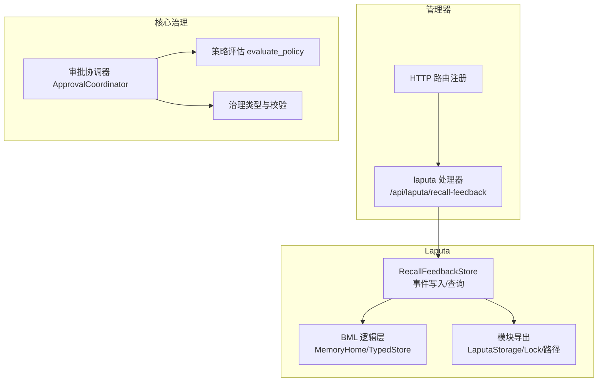
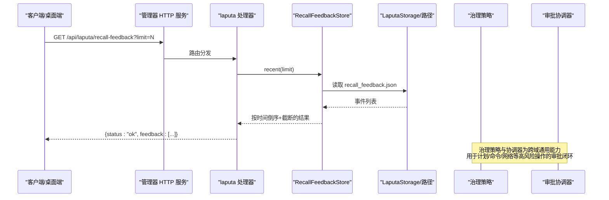
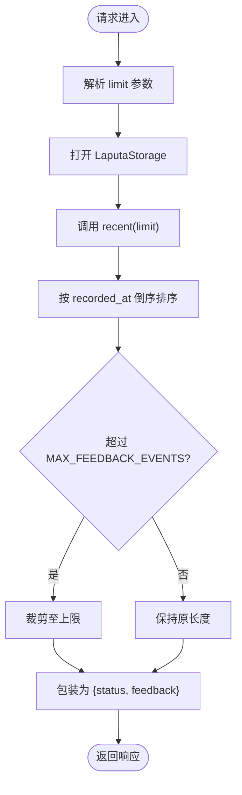
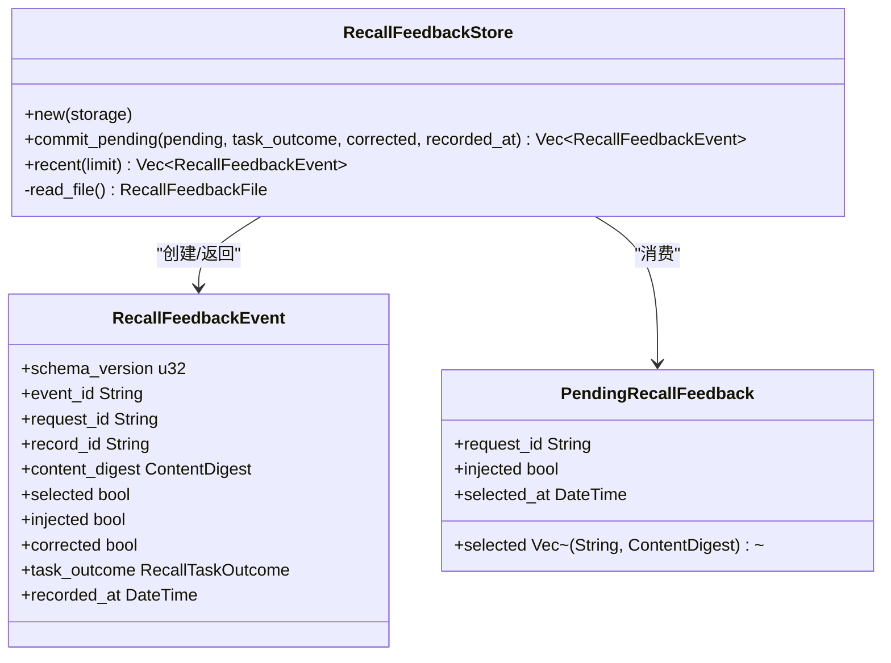
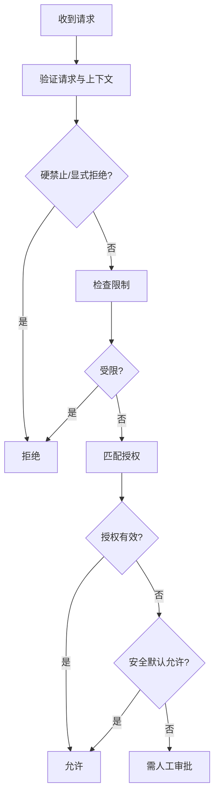
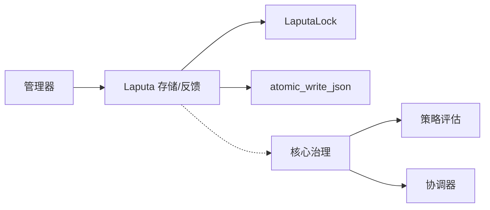

# Laputa 治理

<cite>
**本文引用的文件**
- [agent-diva-laputa/src/lib.rs](file://agent-diva-laputa/src/lib.rs)
- [agent-diva-laputa/src/feedback.rs](file://agent-diva-laputa/src/feedback.rs)
- [agent-diva-manager/src/handlers/laputa.rs](file://agent-diva-manager/src/handlers/laputa.rs)
- [agent-diva-manager/src/server.rs](file://agent-diva-manager/src/server.rs)
- [agent-diva-core/src/governance/mod.rs](file://agent-diva-core/src/governance/mod.rs)
- [agent-diva-core/src/governance/coordinator.rs](file://agent-diva-core/src/governance/coordinator.rs)
- [agent-diva-core/src/governance/policy.rs](file://agent-diva-core/src/governance/policy.rs)
- [agent-diva-core/src/governance/types.rs](file://agent-diva-core/src/governance/types.rs)
- [agent-diva-core/src/quality/mod.rs](file://agent-diva-core/src/quality/mod.rs)
- [agent-diva-laputa/src/bml/mod.rs](file://agent-diva-laputa/src/bml/mod.rs)
</cite>

## 目录
1. [简介](#简介)
2. [项目结构](#项目结构)
3. [核心组件](#核心组件)
4. [架构总览](#架构总览)
5. [详细组件分析](#详细组件分析)
6. [依赖关系分析](#依赖关系分析)
7. [性能与容量特性](#性能与容量特性)
8. [故障排查指南](#故障排查指南)
9. [结论](#结论)
10. [附录：API 契约与配置建议](#附录api-契约与配置建议)

## 简介
本文件面向 Laputa 治理层及其“回忆反馈”能力，聚焦以下目标：
- 说明 Laputa 在记忆治理中的职责边界：BML 逻辑层、人格工作区、冻结核心快照以及无负载的回忆反馈读取。
- 详细说明 /api/laputa/recall-feedback 接口：用途、参数、响应、错误处理与使用场景。
- 解释反馈收集机制、质量评估与治理决策流程之间的关系。
- 提供记忆治理的配置、监控与优化建议，帮助运维与开发者稳定运行并持续改进。

## 项目结构
Laputa 治理相关代码分布在三个主要位置：
- agent-diva-laputa：定义 Laputa 存储边界、BML 逻辑层、人格与冻结核心、以及回忆反馈持久化。
- agent-diva-manager：暴露 HTTP API，其中包含 /api/laputa/recall-feedback 处理器。
- agent-diva-core：提供跨域治理策略、审批协调器与类型契约，用于统一的质量与合规控制。

图表来源
- [agent-diva-manager/src/server.rs:740-775](file://agent-diva-manager/src/server.rs#L740-L775)
- [agent-diva-manager/src/handlers/laputa.rs:1-49](file://agent-diva-manager/src/handlers/laputa.rs#L1-L49)
- [agent-diva-laputa/src/feedback.rs:1-144](file://agent-diva-laputa/src/feedback.rs#L1-L144)
- [agent-diva-laputa/src/bml/mod.rs:1-37](file://agent-diva-laputa/src/bml/mod.rs#L1-L37)
- [agent-diva-core/src/governance/mod.rs:1-17](file://agent-diva-core/src/governance/mod.rs#L1-L17)
- [agent-diva-core/src/governance/coordinator.rs:1-186](file://agent-diva-core/src/governance/coordinator.rs#L1-L186)
- [agent-diva-core/src/governance/policy.rs:1-205](file://agent-diva-core/src/governance/policy.rs#L1-L205)
- [agent-diva-core/src/governance/types.rs:1-161](file://agent-diva-core/src/governance/types.rs#L1-L161)

章节来源
- [agent-diva-manager/src/server.rs:740-775](file://agent-diva-manager/src/server.rs#L740-L775)
- [agent-diva-manager/src/handlers/laputa.rs:1-49](file://agent-diva-manager/src/handlers/laputa.rs#L1-L49)
- [agent-diva-laputa/src/lib.rs:1-56](file://agent-diva-laputa/src/lib.rs#L1-L56)
- [agent-diva-laputa/src/bml/mod.rs:1-37](file://agent-diva-laputa/src/bml/mod.rs#L1-L37)
- [agent-diva-core/src/governance/mod.rs:1-17](file://agent-diva-core/src/governance/mod.rs#L1-L17)

## 核心组件
- 回忆反馈存储（RecallFeedbackStore）
  - 负责将“已选择的记忆条目”以事件形式持久化到 JSON 文件，支持去重、排序与上限裁剪。
  - 通过 LaputaLock 保证并发安全，避免多进程/多线程竞争写。
  - 提供 recent(limit) 查询，供上层 API 返回最近 N 条反馈。
- Laputa 存储与路径（LaputaStorage/LaputaPaths）
  - 提供 recall_feedback_json() 等路径解析，确保反馈文件位于工作区下的固定位置。
- BML 逻辑层（MemoryHome/TypedStore）
  - 作为机器级记忆权威存储，提供搜索、完整性检查、元数据与记录迁移等能力。
  - 当前生产路径中，记忆 CRUD 直接调用，不再走受控审批管线；但治理策略仍适用于其他领域。
- 治理策略与协调器（Policy + Coordinator）
  - 策略评估函数 evaluate_policy 是无副作用的纯函数，依据风险等级、自主级别、限制与授权决定允许/拒绝/需人工审批。
  - 协调器负责提交待审批请求、消费一次性收据、分页读取状态与事件，贯穿计划、沙箱与记忆等域的审批边界。

章节来源
- [agent-diva-laputa/src/feedback.rs:1-144](file://agent-diva-laputa/src/feedback.rs#L1-L144)
- [agent-diva-laputa/src/bml/mod.rs:1-37](file://agent-diva-laputa/src/bml/mod.rs#L1-L37)
- [agent-diva-core/src/governance/policy.rs:1-205](file://agent-diva-core/src/governance/policy.rs#L1-L205)
- [agent-diva-core/src/governance/coordinator.rs:1-186](file://agent-diva-core/src/governance/coordinator.rs#L1-L186)

## 架构总览
下图展示从 HTTP 请求到反馈事件的端到端流程，以及治理策略如何影响整体系统行为。

图表来源
- [agent-diva-manager/src/handlers/laputa.rs:1-49](file://agent-diva-manager/src/handlers/laputa.rs#L1-L49)
- [agent-diva-laputa/src/feedback.rs:62-133](file://agent-diva-laputa/src/feedback.rs#L62-L133)
- [agent-diva-core/src/governance/policy.rs:98-205](file://agent-diva-core/src/governance/policy.rs#L98-L205)
- [agent-diva-core/src/governance/coordinator.rs:73-186](file://agent-diva-core/src/governance/coordinator.rs#L73-L186)

## 详细组件分析

### 组件 A：回忆反馈查询 API（/api/laputa/recall-feedback）
- 功能
  - 返回最近的回忆反馈事件，供桌面端记忆工作区展示与分析。
  - 仅读取，不写入；写入由上游任务完成后批量提交。
- 路由与参数
  - 路径：/api/laputa/recall-feedback
  - 查询参数：limit（可选，默认 50，最大 200）
- 响应格式
  - status: "ok" | "error"
  - feedback: 事件数组（按 recorded_at 降序，event_id 次级排序）
- 错误处理
  - 内部错误统一返回 500，携带 code 与 message。
- 关键实现要点
  - 通过 LaputaStorage::open 获取工作区路径。
  - 调用 RecallFeedbackStore::recent 限制结果集大小。
  - 所有错误经 laputa_error_response 转换为标准 JSON 错误体。

图表来源
- [agent-diva-manager/src/handlers/laputa.rs:18-49](file://agent-diva-manager/src/handlers/laputa.rs#L18-L49)
- [agent-diva-laputa/src/feedback.rs:123-133](file://agent-diva-laputa/src/feedback.rs#L123-L133)
- [agent-diva-laputa/src/feedback.rs:9-10](file://agent-diva-laputa/src/feedback.rs#L9-L10)

章节来源
- [agent-diva-manager/src/handlers/laputa.rs:1-49](file://agent-diva-manager/src/handlers/laputa.rs#L1-L49)
- [agent-diva-manager/src/server.rs:740-775](file://agent-diva-manager/src/server.rs#L740-L775)

### 组件 B：回忆反馈持久化（RecallFeedbackStore）
- 数据结构
  - RecallFeedbackEvent：包含 schema_version、event_id、request_id、record_id、content_digest、selected、injected、corrected、task_outcome、recorded_at。
  - PendingRecallFeedback：批提交前暂存的选择集合与时间戳。
  - RecallFeedbackFile：schema_version + events 列表。
- 写入流程
  - 加锁：使用 LaputaLock 对 recall-feedback 锁文件加锁，超时 5 秒。
  - 读文件：若不存在则使用默认空文件。
  - 构建事件：基于 pending 列表生成事件，去重（event_id）。
  - 排序与裁剪：按 recorded_at 排序，超过 MAX_FEEDBACK_EVENTS 时裁剪最旧部分。
  - 原子写入：atomic_write_json 持久化。
- 读取流程
  - recent(limit)：读取后按 recorded_at 倒序排序，再按 event_id 次级排序，最后截断到 limit。

图表来源
- [agent-diva-laputa/src/feedback.rs:20-46](file://agent-diva-laputa/src/feedback.rs#L20-L46)
- [agent-diva-laputa/src/feedback.rs:57-144](file://agent-diva-laputa/src/feedback.rs#L57-L144)

章节来源
- [agent-diva-laputa/src/feedback.rs:1-144](file://agent-diva-laputa/src/feedback.rs#L1-L144)

### 组件 C：治理策略与协调器（Policy + Coordinator）
- 策略评估（evaluate_policy）
  - 输入：ApprovalRequest
 与 PolicyContext。
  - 输出：PolicyEvaluation（decision、reason、constraints、evidence_refs）。
  - 规则优先级：硬禁止 > 显式拒绝 > 上下文无效 > 资源能力不匹配 > 限制拒绝 > 授权匹配 > 安全默认允许 > 需要人工审批。
  - 安全默认：低风险的 Inspect/PlanMutate 在 L1 可自动允许。
- 协调器（ApprovalCoordinator）
  - coordinate：评估并仅在需要人工审批时提交到账本。
  - decide/consume_once/revoke/expire：对审批状态进行 CAS 操作，保证幂等与安全。
  - states_page/events_page：分页读取状态与事件，便于审计与监控。

图表来源
- [agent-diva-core/src/governance/policy.rs:98-205](file://agent-diva-core/src/governance/policy.rs#L98-L205)
- [agent-diva-core/src/governance/coordinator.rs:73-186](file://agent-diva-core/src/governance/coordinator.rs#L73-L186)

章节来源
- [agent-diva-core/src/governance/policy.rs:1-678](file://agent-diva-core/src/governance/policy.rs#L1-L678)
- [agent-diva-core/src/governance/coordinator.rs:1-425](file://agent-diva-core/src/governance/coordinator.rs#L1-L425)
- [agent-diva-core/src/governance/types.rs:1-548](file://agent-diva-core/src/governance/types.rs#L1-L548)

## 依赖关系分析
- 管理器依赖 Laputa 的存储与路径抽象，通过 LaputaStorage 定位反馈文件。
- Laputa 的反馈存储依赖 LaputaLock 与 atomic_write_json 保证并发与原子性。
- 治理策略与协调器为跨域通用能力，被计划、沙箱、记忆等域复用，形成统一的审批边界。
- BML 逻辑层作为记忆权威存储，提供搜索与完整性保障，但不参与受控审批管线。

图表来源
- [agent-diva-manager/src/handlers/laputa.rs:1-49](file://agent-diva-manager/src/handlers/laputa.rs#L1-L49)
- [agent-diva-laputa/src/feedback.rs:67-120](file://agent-diva-laputa/src/feedback.rs#L67-L120)
- [agent-diva-core/src/governance/mod.rs:1-17](file://agent-diva-core/src/governance/mod.rs#L1-L17)

章节来源
- [agent-diva-manager/src/handlers/laputa.rs:1-49](file://agent-diva-manager/src/handlers/laputa.rs#L1-L49)
- [agent-diva-laputa/src/feedback.rs:67-120](file://agent-diva-laputa/src/feedback.rs#L67-L120)
- [agent-diva-core/src/governance/mod.rs:1-17](file://agent-diva-core/src/governance/mod.rs#L1-L17)

## 性能与容量特性
- 反馈事件上限：MAX_FEEDBACK_EVENTS = 5000，超出时裁剪最旧事件，防止文件膨胀。
- 查询限制：API 的 limit 默认 50，最大 200，避免过大结果集。
- 并发写入：使用 LaputaLock 对 recall-feedback 加锁，超时 5 秒，降低竞争冲突。
- 排序成本：recent 先排序再截断，建议在 limit 较小且事件量较大时关注 I/O 与 CPU 开销。
- 原子写入：atomic_write_json 减少部分写入导致的损坏风险。

章节来源
- [agent-diva-laputa/src/feedback.rs:9-10](file://agent-diva-laputa/src/feedback.rs#L9-L10)
- [agent-diva-laputa/src/feedback.rs:67-120](file://agent-diva-laputa/src/feedback.rs#L67-L120)
- [agent-diva-manager/src/handlers/laputa.rs:23-35](file://agent-diva-manager/src/handlers/laputa.rs#L23-L35)

## 故障排查指南
- 常见问题
  - 反馈为空：确认是否有上游任务提交过 commit_pending；检查 recall_feedback.json 是否存在。
  - 权限或锁失败：检查 LaputaLock 是否超时；确认磁盘空间与文件权限。
  - 事件重复：确认 event_id 生成唯一性（request_id + record_id + selected_at）。
  - 数据丢失：确认 atomic_write_json 成功；必要时回滚到上次完整快照。
- 诊断步骤
  - 查看最近反馈：调用 /api/laputa/recall-feedback?limit=200，观察事件数量与时间分布。
  - 检查锁文件：确认 recall-feedback 锁文件未被异常占用。
  - 核对策略：如需对高风险操作启用审批，检查 PolicyContext 与 Authorization 是否正确传入。
- 日志与指标
  - 管理器日志：关注 laputa_error_response 的错误码与消息。
  - 治理事件：通过协调器的 events_page 拉取审批事件，辅助审计。

章节来源
- [agent-diva-manager/src/handlers/laputa.rs:38-49](file://agent-diva-manager/src/handlers/laputa.rs#L38-L49)
- [agent-diva-laputa/src/feedback.rs:67-120](file://agent-diva-laputa/src/feedback.rs#L67-L120)
- [agent-diva-core/src/governance/coordinator.rs:178-186](file://agent-diva-core/src/governance/coordinator.rs#L178-L186)

## 结论
- Laputa 治理层在当前版本聚焦于 BML 逻辑层、人格工作区、冻结核心快照与无负载的回忆反馈读取。
- /api/laputa/recall-feedback 提供稳定的只读接口，用于桌面端记忆工作区的反馈可视化与质量分析。
- 治理策略与协调器为跨域通用能力，确保高风险操作的审批闭环与可审计性。
- 通过合理配置 limit、监控反馈事件规模与治理事件流，可实现稳定的记忆治理与持续优化。

## 附录：API 契约与配置建议
- API 契约
  - 路径：/api/laputa/recall-feedback
  - 方法：GET
  - 查询参数：limit（可选，默认 50，最大 200）
  - 响应体：{ status: "ok"|"error", feedback: [...] }
  - 错误码：INTERNAL_SERVER_ERROR（含 code、message）
- 配置建议
  - 限制 limit：建议前端默认 50，最大 200，避免大结果集。
  - 监控反馈规模：定期统计事件数量与增长趋势，接近 5000 时考虑归档或清理策略。
  - 锁与原子写入：确保磁盘可用空间与权限正确，避免锁超时与写入失败。
  - 治理策略：对高风险操作启用审批，结合 PolicyContext 与 Authorization 精确控制。
- 监控与优化
  - 指标：recent 查询耗时、事件写入耗时、锁等待次数。
  - 优化：当事件量较大时，考虑分片存储或增量导出；对高频查询增加缓存层。
  - 审计：通过协调器的 events_page 拉取审批事件，建立告警与报表。

章节来源
- [agent-diva-manager/src/handlers/laputa.rs:18-49](file://agent-diva-manager/src/handlers/laputa.rs#L18-L49)
- [agent-diva-laputa/src/feedback.rs:9-10](file://agent-diva-laputa/src/feedback.rs#L9-L10)
- [agent-diva-core/src/governance/coordinator.rs:178-186](file://agent-diva-core/src/governance/coordinator.rs#L178-L186)
- [agent-diva-core/src/quality/mod.rs:1-7](file://agent-diva-core/src/quality/mod.rs#L1-L7)