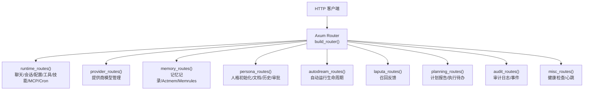
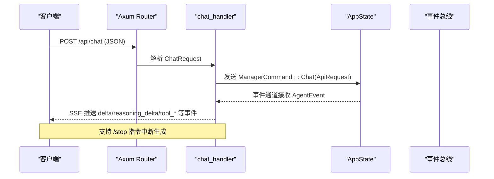
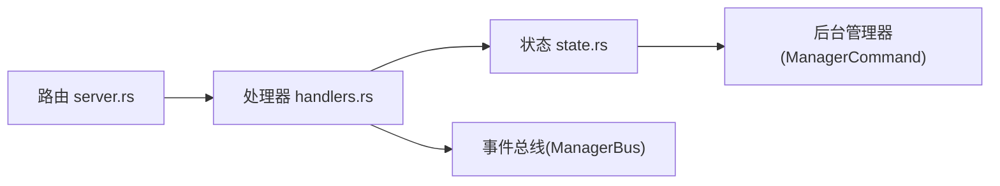

# RESTful API

<cite>
**本文引用的文件**
- [server.rs](file://agent-diva-manager/src/server.rs)
- [handlers.rs](file://agent-diva-manager/src/handlers.rs)
- [state.rs](file://agent-diva-manager/src/state.rs)
- [approvals.rs](file://agent-diva-manager/src/handlers/approvals.rs)
</cite>

## 目录
1. [简介](#简介)
2. [项目结构](#项目结构)
3. [核心组件](#核心组件)
4. [架构总览](#架构总览)
5. [详细接口说明](#详细接口说明)
6. [依赖关系分析](#依赖关系分析)
7. [性能与可靠性](#性能与可靠性)
8. [故障排查指南](#故障排查指南)
9. [结论](#结论)
10. [附录：状态码与错误约定](#附录：状态码与错误约定)

## 简介
本文件为 Agent Diva 管理服务的 RESTful API 文档，覆盖聊天、会话、配置、提供商、记忆、人格、技能市场、定时任务等核心模块。所有端点基于 Axum 路由注册，请求体/查询参数/路径参数在处理器中解析，响应统一以 JSON 返回；部分接口使用 SSE（Server-Sent Events）进行流式推送。

## 项目结构
服务端通过单一 Router 聚合多个功能子路由，并挂载 CORS、Trace 层，最终绑定到本地回环地址监听端口。

图表来源
- [server.rs:94-113](file://agent-diva-manager/src/server.rs#L94-L113)
- [server.rs:115-382](file://agent-diva-manager/src/server.rs#L115-L382)

章节来源
- [server.rs:94-113](file://agent-diva-manager/src/server.rs#L94-L113)

## 核心组件
- 路由与中间件：Axum Router + CORS + Trace，统一挂载 AppState。
- 处理器：按功能模块拆分 handlers，负责参数校验、业务编排、响应构造。
- 状态与命令：AppState 持有服务上下文，处理器通过 ManagerCommand 与后台进程通信。
- 事件总线：SSE 推送 AgentEvent、BusEvent 等运行时事件。

章节来源
- [server.rs:94-113](file://agent-diva-manager/src/server.rs#L94-L113)
- [handlers.rs:61-81](file://agent-diva-manager/src/handlers.rs#L61-L81)
- [state.rs:64-95](file://agent-diva-manager/src/state.rs#L64-L95)

## 架构总览
以下时序图展示聊天接口的典型调用链：客户端发起 POST /api/chat，处理器校验并转发消息至管理器，随后通过事件通道将增量结果以 SSE 推送到客户端。

图表来源
- [handlers.rs:137-351](file://agent-diva-manager/src/handlers.rs#L137-L351)
- [state.rs:310-324](file://agent-diva-manager/src/state.rs#L310-L324)

## 详细接口说明

### 通用约定
- 内容类型：默认 application/json；上传接口使用 multipart/form-data。
- 认证机制：当前路由未内置鉴权中间件，建议部署于受信任网络或通过反向代理鉴权。
- 请求体校验：由 Axum 提取器与处理器共同完成；非法请求通常返回 422。
- 响应格式：成功响应包含 status 字段；错误响应包含 error.message 或 reason_code 等字段。
- 流式接口：/api/chat 和 /api/events 使用 SSE，客户端需处理 keep-alive。

### 聊天接口 /api/chat
- 方法：POST
- 路径：/api/chat
- 请求体字段（示例）：
  - message: string（必填）
  - channel: string（可选，默认 api）
  - chat_id: string（可选，默认 default）
  - attachments: array<string>（可选）
  - mode: string（可选，规范化为 agent/plan/ask）
  - execution_start: boolean（可选）
  - plan_id: string（可选）
  - plan_revision: integer（可选）
  - execution_id: string（可选）
  - approval_policy: string（可选，on-request/on-failure/unless-trusted/never）
- 响应：SSE 事件流，事件类型包括 delta、reasoning_delta、tool_start、tool_finish、final、error、todo_*、plan_ready_for_approval、turn_plan_updated、provider_retry、provider_stalled、context_compaction 等。
- 错误：若人格未就绪，会推送 event=error 的 JSON 数据，包含 code/message/persona_status。

章节来源
- [handlers.rs:83-128](file://agent-diva-manager/src/handlers.rs#L83-L128)
- [handlers.rs:137-351](file://agent-diva-manager/src/handlers.rs#L137-L351)

### 停止聊天 /api/chat/stop
- 方法：POST
- 路径：/api/chat/stop
- 请求体：channel、chat_id（可选）
- 响应：{ status: "ok"|"error", stopped?: boolean }
- 行为：取消命令审批范围并尝试停止生成。

章节来源
- [handlers.rs:353-383](file://agent-diva-manager/src/handlers.rs#L353-L383)

### 事件订阅 /api/events
- 方法：GET
- 路径：/api/events?channel=&chat_id=&chat_prefix=
- 响应：SSE 事件流，过滤后可获取 final/error/turn_plan_updated 等事件。

章节来源
- [handlers.rs:617-656](file://agent-diva-manager/src/handlers.rs#L617-L656)

### 会话管理 /api/sessions
- GET /api/sessions
  - 响应：{ status: "ok", sessions: [...] }
- GET /api/sessions/:id
  - 路径参数：id（支持 channel:chat_id 或仅 chat_id）
  - 响应：{ status: "ok", session: ... } 或 { status: "error", message: "Session not found" }
- DELETE /api/sessions/:id 或 POST /api/sessions/:id（兼容旧用法）
  - 响应：{ status: "ok", deleted: boolean }
- PATCH /api/sessions/:id/title
  - 请求体：{ title: string }
  - 响应：{ status: "ok", title: string|null }
- POST /api/sessions/:id/generate-title
  - 请求体：first_user_message, first_assistant_message
  - 响应：{ status: "ok", title, title_generated, title_manually_set }
- POST /api/sessions/reset
  - 请求体：channel?, chat_id?
  - 响应：{ status: "ok", reset: boolean } 或错误

章节来源
- [server.rs:204-224](file://agent-diva-manager/src/server.rs#L204-L224)
- [handlers.rs:409-581](file://agent-diva-manager/src/handlers.rs#L409-L581)

### 配置管理 /api/config
- GET /api/config
  - 响应：ConfigResponse（provider?, api_base?, model, has_api_key）
- POST /api/config
  - 请求体：ConfigUpdate（api_base?, api_key?, provider?, model?）
  - 响应：{ status: "ok" }
- GET /api/config/self-evolution
  - 响应：{ status: "ok", config: SelfEvolutionConfig }
- POST /api/config/self-evolution
  - 请求体：SelfEvolutionConfig
  - 响应：{ status: "ok", config: SelfEvolutionConfig }

章节来源
- [server.rs:225-233](file://agent-diva-manager/src/server.rs#L225-L233)
- [handlers.rs:658-755](file://agent-diva-manager/src/handlers.rs#L658-L755)
- [state.rs:449-482](file://agent-diva-manager/src/state.rs#L449-L482)

### 提供商管理 /api/providers
- GET /api/providers
  - 响应：ProviderView[]
- POST /api/providers
  - 请求体：CustomProviderUpsert
  - 响应：ProviderView?
- POST /api/providers/resolve
  - 请求体：name, model?
  - 响应：resolved model name?
- GET /api/providers/:name
  - 响应：ProviderView?
- PUT /api/providers/:name
  - 请求体：CustomProviderUpsert
  - 响应：ProviderView?
- DELETE /api/providers/:name
  - 响应：Result<(), String>
- GET /api/providers/:name/models
  - 响应：ProviderModelCatalogView
- POST /api/providers/:name/models
  - 请求体：model_id
  - 响应：Result<(), String>
- DELETE /api/providers/:name/models/:model_id
  - 响应：Result<(), String>

章节来源
- [server.rs:315-336](file://agent-diva-manager/src/server.rs#L315-L336)
- [state.rs:288-308](file://agent-diva-manager/src/state.rs#L288-L308)

### 记忆系统 /api/memory
- GET /api/memory/records
  - 响应：记录列表
- POST /api/memory/records
  - 请求体：记录创建参数
  - 响应：新记录
- GET /api/memory/records/:id
  - 响应：单条记录
- PATCH /api/memory/records/:id
  - 请求体：更新字段
  - 响应：更新后记录
- DELETE /api/memory/records/:id
  - 响应：删除结果
- GET /api/memory/actmem
  - 响应：Actmem 快照
- PUT /api/memory/actmem
  - 请求体：Actmem 更新
  - 响应：更新后快照
- GET /api/memory/actmem/capsules
  - 响应：胶囊列表
- GET /api/memory/actmem/capsules/:name
  - 响应：指定胶囊
- DELETE /api/memory/actmem/capsules/:name
  - 响应：删除结果
- GET /api/memory/memrules
  - 响应：规则集
- PUT /api/memory/memrules
  - 请求体：规则集
  - 响应：更新后规则集

章节来源
- [server.rs:136-164](file://agent-diva-manager/src/server.rs#L136-L164)

### 人格管理 /api/persona
- GET /api/persona/status
  - 响应：{ status: "ok", persona: { status: "uninitialized"|"incomplete"|"ready" } }
- POST /api/persona/initialize
  - 请求体：identity, relationship, redline, user, world
  - 响应：{ status: "ok", persona: { status: "ready" } }
- POST /api/persona/repair
  - 响应：修复结果
- GET /api/persona/docs/:kind
  - 响应：文档及 revision
- PUT /api/persona/docs/:kind
  - 请求体：content, base_revision, reason
  - 响应：更新后文档或冲突错误
- GET /api/persona/docs/:kind/history
  - 响应：历史列表
- GET /api/persona/docs/:kind/history/:revision
  - 响应：指定版本
- GET /api/persona/requests
  - 响应：请求列表
- POST /api/persona/requests
  - 请求体：请求详情
  - 响应：新建请求
- POST /api/persona/requests/:id/accept
  - 响应：接受结果
- POST /api/persona/requests/:id/reject
  - 响应：拒绝结果

章节来源
- [server.rs:173-202](file://agent-diva-manager/src/server.rs#L173-L202)

### 技能市场 /api/skills
- GET /api/skills
  - 响应：技能列表
- POST /api/skills
  - 请求：multipart/form-data，字段 file（zip），最大 50MB
  - 响应：SkillDto
- GET /api/skills/marketplace/search
  - 查询：关键词等
  - 响应：搜索结果
- POST /api/skills/marketplace/install
  - 请求体：安装参数
  - 响应：安装结果
- GET /api/skills/marketplace/featured
  - 响应：推荐技能
- GET /api/skills/:slug
  - 响应：技能详情
- PUT /api/skills/:slug
  - 请求体：markdown, base_hash
  - 响应：更新后技能或冲突
- DELETE /api/skills/:slug
  - 请求体：base_hash
  - 响应：删除结果
- POST /api/skills/:slug/disable
  - 请求体：base_hash
  - 响应：禁用结果
- GET /api/skills/:slug/history
  - 响应：历史列表
- GET /api/skills/:slug/history/:revision
  - 响应：指定版本

章节来源
- [server.rs:242-269](file://agent-diva-manager/src/server.rs#L242-L269)
- [server.rs:287-289](file://agent-diva-manager/src/server.rs#L287-L289)

### 定时任务 /api/cron
- GET /api/cron/jobs
  - 响应：任务列表
- POST /api/cron/jobs
  - 请求体：CreateCronJobRequest
  - 响应：CronJobDto
- GET /api/cron/jobs/:id
  - 响应：任务详情
- PUT /api/cron/jobs/:id
  - 请求体：UpdateCronJobRequest
  - 响应：CronJobDto
- DELETE /api/cron/jobs/:id
  - 响应：删除结果
- POST /api/cron/jobs/:id/enable
  - 请求体：SetCronJobEnabledRequest
  - 响应：CronJobDto
- POST /api/cron/jobs/:id/run
  - 请求体：RunCronJobRequest（force?）
  - 响应：CronJobDto
- POST /api/cron/jobs/:id/stop
  - 响应：CronRunSnapshot

章节来源
- [server.rs:297-313](file://agent-diva-manager/src/server.rs#L297-L313)
- [state.rs:361-378](file://agent-diva-manager/src/state.rs#L361-L378)

### 其他重要接口
- 文件上传：POST /api/files/upload（最大 50MB）
- MCP 服务器：/api/mcps（CRUD）、启用/刷新
- 工作区：GET /api/workspace
- 工具配置：GET/POST /api/tools
- 频道配置：GET/POST /api/channels
- 审计日志：GET /api/audit/log、/api/audit/events
- 健康检查：GET /api/health、/api/heartbeat

章节来源
- [server.rs:287-296](file://agent-diva-manager/src/server.rs#L287-L296)
- [server.rs:371-382](file://agent-diva-manager/src/server.rs#L371-L382)

## 依赖关系分析
- 路由层：server.rs 定义所有 HTTP 端点，组合各功能子路由。
- 处理器层：handlers.rs 实现具体逻辑，依赖 state.rs 中的 AppState 与 ManagerCommand。
- 后端协作：处理器通过 oneshot/broadcast 与后台进程交互，保证异步与并发安全。
- 事件驱动：SSE 用于实时推送，降低轮询开销。

图表来源
- [server.rs:94-113](file://agent-diva-manager/src/server.rs#L94-L113)
- [handlers.rs:61-81](file://agent-diva-manager/src/handlers.rs#L61-L81)
- [state.rs:310-417](file://agent-diva-manager/src/state.rs#L310-L417)

章节来源
- [server.rs:94-113](file://agent-diva-manager/src/server.rs#L94-L113)
- [handlers.rs:61-81](file://agent-diva-manager/src/handlers.rs#L61-L81)
- [state.rs:310-417](file://agent-diva-manager/src/state.rs#L310-L417)

## 性能与可靠性
- 流式响应：/api/chat 与 /api/events 使用 SSE，避免长轮询，提升实时性。
- 限流与重试：上游提供商错误分类与指数退避重试，减少瞬时失败影响。
- 资源限制：文件上传限制 50MB，防止过大请求阻塞。
- 健康检查：/api/health 与 /api/heartbeat 便于外部监控。

章节来源
- [handlers.rs:137-351](file://agent-diva-manager/src/handlers.rs#L137-L351)
- [server.rs:287-289](file://agent-diva-manager/src/server.rs#L287-L289)

## 故障排查指南
- 人格未就绪：/api/chat 返回 event=error，code 可能为 persona_uninitialized/persona_incomplete。请先调用 /api/persona/initialize。
- 会话不存在：/api/sessions/:id 返回 status=error，message="Session not found"。
- 技能冲突：PUT /api/skills/:slug 返回 409，error.code 为 skill_hash_conflict。
- 重复请求：POST /api/evolution/requests 返回 409，error.code 为 skill_request_exists。
- 批准队列不可用：某些审批相关接口返回 SERVICE_UNAVAILABLE 与对应 reason_code。

章节来源
- [handlers.rs:172-200](file://agent-diva-manager/src/handlers.rs#L172-L200)
- [handlers.rs:426-458](file://agent-diva-manager/src/handlers.rs#L426-L458)
- [server.rs:467-513](file://agent-diva-manager/src/server.rs#L467-L513)
- [approvals.rs:225-253](file://agent-diva-manager/src/handlers/approvals.rs#L225-L253)

## 结论
本 API 提供完整的 Agent Diva 管理能力，涵盖聊天、会话、配置、提供商、记忆、人格、技能市场与定时任务等。通过 SSE 实现实时交互，配合健壮的错误分类与重试策略，适合在生产环境中集成。建议在网关层增加鉴权与访问控制，以满足安全合规要求。

## 附录：状态码与错误约定
- 200 OK：成功
- 404 Not Found：资源不存在（如会话、技能）
- 409 Conflict：冲突（如技能哈希冲突、重复请求）
- 422 Unprocessable Entity：请求体无效或参数不合法
- 503 Service Unavailable：服务暂时不可用（如审批队列不可用）
- 错误体结构：
  - 通用：{ status: "error", message: "..." }
  - 结构化错误：{ error: { code: "...", message: "..." } }
  - 审批类：{ reason_code: "...", message: "..." }

章节来源
- [server.rs:467-513](file://agent-diva-manager/src/server.rs#L467-L513)
- [approvals.rs:225-253](file://agent-diva-manager/src/handlers/approvals.rs#L225-L253)