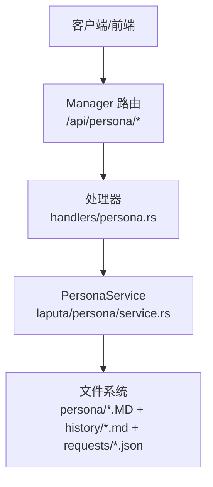
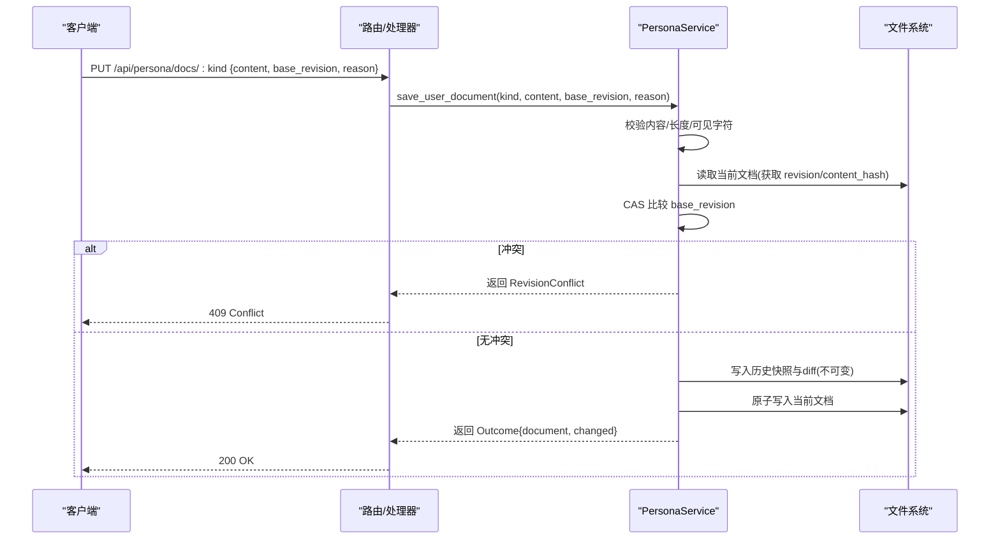
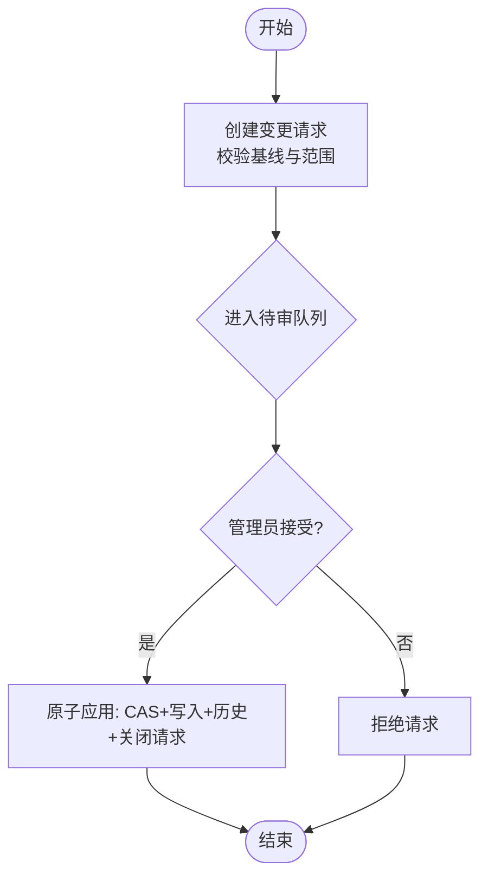
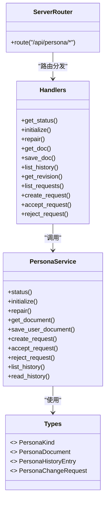

# 人格管理

<cite>
**本文引用的文件**
- [agent-diva-manager/src/server.rs](file://agent-diva-manager/src/server.rs)
- [agent-diva-manager/src/handlers/persona.rs](file://agent-diva-manager/src/handlers/persona.rs)
- [agent-diva-laputa/src/persona/mod.rs](file://agent-diva-laputa/src/persona/mod.rs)
- [agent-diva-laputa/src/persona/types.rs](file://agent-diva-laputa/src/persona/types.rs)
- [agent-diva-laputa/src/persona/service.rs](file://agent-diva-laputa/src/persona/service.rs)
- [agent-diva-tools/src/persona.rs](file://agent-diva-tools/src/persona.rs)
- [agent-diva-gui/src-tauri/src/commands.rs](file://agent-diva-gui/src-tauri/src/commands.rs)
- [agent-diva-gui/src/api/desktop.ts](file://agent-diva-gui/src/api/desktop.ts)
</cite>

## 目录
1. [简介](#简介)
2. [项目结构](#项目结构)
3. [核心组件](#核心组件)
4. [架构总览](#架构总览)
5. [详细组件分析](#详细组件分析)
6. [依赖关系分析](#依赖关系分析)
7. [性能与一致性](#性能与一致性)
8. [故障排查指南](#故障排查指南)
9. [结论](#结论)
10. [附录：API 参考与示例](#附录api-参考与示例)

## 简介
本文件面向“人格管理”能力，提供完整的 API 文档与实现说明。覆盖以下接口：
- 人格状态查询：GET /api/persona/status
- 人格初始化：POST /api/persona/initialize
- 人格修复：POST /api/persona/repair
- 文档管理：GET/PUT /api/persona/docs/:kind
- 历史版本管理：GET /api/persona/docs/:kind/history、GET /api/persona/docs/:kind/history/:revision
- 请求审批：GET/POST /api/persona/requests、POST /api/persona/requests/:id/accept、POST /api/persona/requests/:id/reject

该能力以 Markdown 为唯一权威格式，提供版本控制（CAS）、变更审批与工作流管理，支持用户直写与 Agent/AutoDream 提议的受控写入，并生成不可变的历史快照与差异记录，便于审计追踪与团队协作。

## 项目结构
人格管理由三层组成：
- HTTP 路由层：在 Manager 中注册 REST 路由，将请求分发到处理器。
- 处理器层：解析参数、调用 Laputa 的人格服务，统一错误响应。
- 领域服务层：Laputa 中的 PersonaService 负责持久化、校验、版本控制、审批与历史。

图表来源
- [agent-diva-manager/src/server.rs:173-202](file://agent-diva-manager/src/server.rs#L173-L202)
- [agent-diva-manager/src/handlers/persona.rs:52-208](file://agent-diva-manager/src/handlers/persona.rs#L52-L208)
- [agent-diva-laputa/src/persona/service.rs:24-36](file://agent-diva-laputa/src/persona/service.rs#L24-L36)

章节来源
- [agent-diva-manager/src/server.rs:173-202](file://agent-diva-manager/src/server.rs#L173-L202)
- [agent-diva-manager/src/handlers/persona.rs:1-239](file://agent-diva-manager/src/handlers/persona.rs#L1-L239)
- [agent-diva-laputa/src/persona/service.rs:1-120](file://agent-diva-laputa/src/persona/service.rs#L1-L120)

## 核心组件
- 路由与处理器：定义所有人格相关端点，统一封装成功/失败响应。
- 类型与模型：定义人格种类、状态、文档、历史、请求等数据结构。
- 领域服务：实现初始化、修复、读写文档、版本控制、审批工作流、历史与审计。
- 工具集成：Agent 通过工具调用人格读取、受限更新与创建变更请求。
- GUI 集成：Tauri 命令与前端 API 封装，驱动桌面端交互。

章节来源
- [agent-diva-manager/src/server.rs:173-202](file://agent-diva-manager/src/server.rs#L173-L202)
- [agent-diva-laputa/src/persona/types.rs:6-310](file://agent-diva-laputa/src/persona/types.rs#L6-L310)
- [agent-diva-laputa/src/persona/service.rs:123-726](file://agent-diva-laputa/src/persona/service.rs#L123-L726)
- [agent-diva-tools/src/persona.rs:31-354](file://agent-diva-tools/src/persona.rs#L31-L354)
- [agent-diva-gui/src-tauri/src/commands.rs:727-813](file://agent-diva-gui/src-tauri/src/commands.rs#L727-L813)
- [agent-diva-gui/src/api/desktop.ts:547-567](file://agent-diva-gui/src/api/desktop.ts#L547-L567)

## 架构总览
下图展示一次“保存文档”的端到端流程，包括 CAS 校验、历史追加与原子写入。

图表来源
- [agent-diva-manager/src/handlers/persona.rs:104-120](file://agent-diva-manager/src/handlers/persona.rs#L104-L120)
- [agent-diva-laputa/src/persona/service.rs:210-230](file://agent-diva-laputa/src/persona/service.rs#L210-L230)
- [agent-diva-laputa/src/persona/service.rs:492-580](file://agent-diva-laputa/src/persona/service.rs#L492-L580)

## 详细组件分析

### 人格状态查询 GET /api/persona/status
- 功能：返回人格整体状态（未初始化/就绪/不完整）与各文档存在性、有效性、修订号、更新时间与待审数量。
- 关键逻辑：遍历七种人格文档，计算 required_for_ready 集合是否满足；统计 pending 请求数。
- 典型响应：包含 status 与 files 映射。

章节来源
- [agent-diva-manager/src/server.rs:175](file://agent-diva-manager/src/server.rs#L175)
- [agent-diva-manager/src/handlers/persona.rs:52-60](file://agent-diva-manager/src/handlers/persona.rs#L52-L60)
- [agent-diva-laputa/src/persona/service.rs:42-121](file://agent-diva-laputa/src/persona/service.rs#L42-L121)
- [agent-diva-laputa/src/persona/types.rs:117-141](file://agent-diva-laputa/src/persona/types.rs#L117-L141)

### 人格初始化 POST /api/persona/initialize
- 功能：一次性创建五份必需文档（identity、relationship、redline、user、world），并写入首批历史。
- 约束：仅允许在未初始化状态下执行；User 文档会规范化为 Preferences 节；内容需通过校验。
- 典型响应：返回初始化后的状态视图。

章节来源
- [agent-diva-manager/src/server.rs:176](file://agent-diva-manager/src/server.rs#L176)
- [agent-diva-manager/src/handlers/persona.rs:62-77](file://agent-diva-manager/src/handlers/persona.rs#L62-L77)
- [agent-diva-laputa/src/persona/service.rs:123-167](file://agent-diva-laputa/src/persona/service.rs#L123-L167)
- [agent-diva-laputa/src/persona/types.rs:194-213](file://agent-diva-laputa/src/persona/types.rs#L194-L213)

### 人格修复 POST /api/persona/repair
- 功能：在 Incomplete 状态下补全缺失或无效的必需文档。
- 约束：仅允许对必需且无效文档进行修复；User 文档同样规范化为 Preferences 节。
- 典型响应：返回修复后的状态视图。

章节来源
- [agent-diva-manager/src/server.rs:177](file://agent-diva-manager/src/server.rs#L177)
- [agent-diva-manager/src/handlers/persona.rs:79-90](file://agent-diva-manager/src/handlers/persona.rs#L79-L90)
- [agent-diva-laputa/src/persona/service.rs:169-200](file://agent-diva-laputa/src/persona/service.rs#L169-L200)

### 文档管理 GET/PUT /api/persona/docs/:kind
- GET：读取指定 kind 的当前文档，包含内容、修订号、哈希、更新时间与待审数量。
- PUT：保存用户编辑，使用 base_revision 做 CAS 并发控制；成功后追加历史并原子写入。
- 限制：仅在 Ready 或 Incomplete（部分场景）下可访问；内容长度与可见字符数受 kind 限制。

章节来源
- [agent-diva-manager/src/server.rs:178-181](file://agent-diva-manager/src/server.rs#L178-L181)
- [agent-diva-manager/src/handlers/persona.rs:92-120](file://agent-diva-manager/src/handlers/persona.rs#L92-L120)
- [agent-diva-laputa/src/persona/service.rs:202-230](file://agent-diva-laputa/src/persona/service.rs#L202-L230)
- [agent-diva-laputa/src/persona/service.rs:445-490](file://agent-diva-laputa/src/persona/service.rs#L445-L490)
- [agent-diva-laputa/src/persona/types.rs:143-154](file://agent-diva-laputa/src/persona/types.rs#L143-L154)

### 历史版本管理 GET /api/persona/docs/:kind/history 与 GET /api/persona/docs/:kind/history/:revision
- 列表：返回按修订倒序排列的历史条目（快照名、差异名、作者、来源、原因、时间）。
- 详情：返回指定修订的完整内容与 unified diff。
- 存储：每个 kind 的 history 目录下维护 log.jsonl、快照 .md 与差异 .diff，均为不可变追加。

章节来源
- [agent-diva-manager/src/server.rs:182-189](file://agent-diva-manager/src/server.rs#L182-L189)
- [agent-diva-manager/src/handlers/persona.rs:122-155](file://agent-diva-manager/src/handlers/persona.rs#L122-L155)
- [agent-diva-laputa/src/persona/service.rs:399-443](file://agent-diva-laputa/src/persona/service.rs#L399-L443)
- [agent-diva-laputa/src/persona/service.rs:536-580](file://agent-diva-laputa/src/persona/service.rs#L536-L580)
- [agent-diva-laputa/src/persona/types.rs:167-186](file://agent-diva-laputa/src/persona/types.rs#L167-L186)

### 请求审批 GET/POST /api/persona/requests 与 POST /api/persona/requests/:id/accept、POST /api/persona/requests/:id/reject
- 列表：可按 kind 过滤，返回待审/已决请求。
- 创建：Agent 或 AutoDream 提交变更提案，携带 base_revision/base_hash 确保基于最新基线；系统校验作用域与内容。
- 接受：原子完成 CAS、写入、历史追加与请求终结；同时使同 kind 其他 pending 请求失效。
- 拒绝：标记请求为 rejected。

图表来源
- [agent-diva-manager/src/server.rs:190-201](file://agent-diva-manager/src/server.rs#L190-L201)
- [agent-diva-manager/src/handlers/persona.rs:157-208](file://agent-diva-manager/src/handlers/persona.rs#L157-L208)
- [agent-diva-laputa/src/persona/service.rs:258-397](file://agent-diva-laputa/src/persona/service.rs#L258-L397)

章节来源
- [agent-diva-manager/src/server.rs:190-201](file://agent-diva-manager/src/server.rs#L190-L201)
- [agent-diva-manager/src/handlers/persona.rs:157-208](file://agent-diva-manager/src/handlers/persona.rs#L157-L208)
- [agent-diva-laputa/src/persona/service.rs:258-397](file://agent-diva-laputa/src/persona/service.rs#L258-L397)
- [agent-diva-laputa/src/persona/types.rs:220-248](file://agent-diva-laputa/src/persona/types.rs#L220-L248)

### 人格文档结构与版本控制
- 文档种类：identity、relationship、redline、user、world、dream、dark。
- 内容限制：每种 kind 有最大可见字符数与冻结上限（如 dream/dark 更严格）。
- 版本控制：每次成功写入产生新 revision，保存不可变快照与 unified diff；当前文档通过原子写入保证一致性。
- 校验：空内容、超限、非法 UTF-8、WORLD 保护段、作用域限制等。

章节来源
- [agent-diva-laputa/src/persona/types.rs:6-98](file://agent-diva-laputa/src/persona/types.rs#L6-L98)
- [agent-diva-laputa/src/persona/service.rs:590-645](file://agent-diva-laputa/src/persona/service.rs#L590-L645)
- [agent-diva-laputa/src/persona/service.rs:738-761](file://agent-diva-laputa/src/persona/service.rs#L738-L761)

### 变更审批与工作流管理
- 角色与权限：
  - Agent：可对 identity、relationship、redline、user、world 提出变更请求；可直接更新 P16 作用域（dream、dark、user 的 Observations）。
  - AutoDream：可对 identity、relationship、user、world、dark 提出变更请求；不能修改 user 的 Preferences。
- 作用域校验：USER 的 Observations 与 Preferences 有独立保护规则；WORLD 必须保留用户保护段并通过入口门限。
- 并发控制：base_revision/base_hash 双重校验；接受时再次校验，否则标记 stale。

章节来源
- [agent-diva-laputa/src/persona/service.rs:258-321](file://agent-diva-laputa/src/persona/service.rs#L258-L321)
- [agent-diva-laputa/src/persona/service.rs:612-645](file://agent-diva-laputa/src/persona/service.rs#L612-L645)
- [agent-diva-tools/src/persona.rs:144-282](file://agent-diva-tools/src/persona.rs#L144-L282)

### 配置、团队协作与审计追踪
- 配置根：人格数据位于配置根下的 persona 目录，含 history 与 requests 子目录。
- 协作：多用户可通过 GUI 直接编辑（不阻塞），Agent/AutoDream 通过请求队列协同审阅。
- 审计：每次变更记录 actor、source、reason、base_revision、时间戳；历史日志与快照不可变，便于回溯。

章节来源
- [agent-diva-laputa/src/persona/service.rs:24-36](file://agent-diva-laputa/src/persona/service.rs#L24-L36)
- [agent-diva-laputa/src/persona/service.rs:698-713](file://agent-diva-laputa/src/persona/service.rs#L698-L713)
- [agent-diva-laputa/src/persona/types.rs:167-186](file://agent-diva-laputa/src/persona/types.rs#L167-L186)

## 依赖关系分析

图表来源
- [agent-diva-manager/src/server.rs:173-202](file://agent-diva-manager/src/server.rs#L173-L202)
- [agent-diva-manager/src/handlers/persona.rs:52-208](file://agent-diva-manager/src/handlers/persona.rs#L52-L208)
- [agent-diva-laputa/src/persona/service.rs:24-726](file://agent-diva-laputa/src/persona/service.rs#L24-L726)
- [agent-diva-laputa/src/persona/types.rs:6-310](file://agent-diva-laputa/src/persona/types.rs#L6-L310)

章节来源
- [agent-diva-manager/src/server.rs:173-202](file://agent-diva-manager/src/server.rs#L173-L202)
- [agent-diva-manager/src/handlers/persona.rs:1-239](file://agent-diva-manager/src/handlers/persona.rs#L1-L239)
- [agent-diva-laputa/src/persona/service.rs:1-726](file://agent-diva-laputa/src/persona/service.rs#L1-L726)
- [agent-diva-laputa/src/persona/types.rs:1-310](file://agent-diva-laputa/src/persona/types.rs#L1-L310)

## 性能与一致性
- 原子写入：使用原子写入避免部分写入导致的损坏。
- 不可变历史：快照与差异文件采用 create_new 模式，防止覆盖。
- 并发安全：基于 base_revision 的 CAS 检查，冲突时返回明确错误码。
- 批量操作：初始化阶段先写入 staging 目录，全部成功后再原子落盘，提升一致性。
- 历史追加：log.jsonl 顺序追加，减少锁竞争。

章节来源
- [agent-diva-laputa/src/persona/service.rs:138-167](file://agent-diva-laputa/src/persona/service.rs#L138-L167)
- [agent-diva-laputa/src/persona/service.rs:536-580](file://agent-diva-laputa/src/persona/service.rs#L536-L580)
- [agent-diva-laputa/src/persona/service.rs:698-713](file://agent-diva-laputa/src/persona/service.rs#L698-L713)

## 故障排查指南
常见错误与处理建议：
- 未初始化/不完整：先调用 initialize 或 repair 补齐必需文档。
- 修订冲突：重新获取最新文档的 revision 与 hash，重试保存。
- 请求已存在/过期：同一 kind 已有 pending 请求；或基线已变化导致 stale，需重新创建。
- 内容超限/非法：检查 kind 的内容上限与可见字符数，修正后重试。
- WORLD 保护段被覆盖：确保保留用户保护段并通过入口门限。
- I/O/JSON 错误：检查文件系统权限与磁盘空间。

章节来源
- [agent-diva-manager/src/handlers/persona.rs:214-239](file://agent-diva-manager/src/handlers/persona.rs#L214-L239)
- [agent-diva-laputa/src/persona/types.rs:250-301](file://agent-diva-laputa/src/persona/types.rs#L250-L301)
- [agent-diva-laputa/src/persona/service.rs:582-645](file://agent-diva-laputa/src/persona/service.rs#L582-L645)

## 结论
人格管理以 Markdown 为权威，结合 CAS 版本控制、不可变历史与受控审批工作流，实现了高一致性与可审计的团队协作。通过清晰的 API 分层与严格的校验策略，既支持用户直写的高效迭代，也保障 Agent/AutoDream 变更的可控与可追溯。

## 附录：API 参考与示例

### 端点清单
- GET /api/persona/status
- POST /api/persona/initialize
- POST /api/persona/repair
- GET /api/persona/docs/:kind
- PUT /api/persona/docs/:kind
- GET /api/persona/docs/:kind/history
- GET /api/persona/docs/:kind/history/:revision
- GET /api/persona/requests?kind=...
- POST /api/persona/requests
- POST /api/persona/requests/:id/accept
- POST /api/persona/requests/:id/reject

章节来源
- [agent-diva-manager/src/server.rs:173-202](file://agent-diva-manager/src/server.rs#L173-L202)

### 请求/响应要点
- 初始化 payload：包含 identity、relationship、redline、user、world。
- 修复 payload：documents 映射，仅允许必需且无效文档。
- 保存文档 payload：content、base_revision、reason。
- 创建请求 payload：kind、base_revision、base_hash、proposed_markdown、actor、reason。
- 响应体：统一包含 status 字段，业务数据嵌套于 persona/document/outcome/history/request 等键下。

章节来源
- [agent-diva-manager/src/handlers/persona.rs:16-50](file://agent-diva-manager/src/handlers/persona.rs#L16-L50)
- [agent-diva-manager/src/handlers/persona.rs:52-208](file://agent-diva-manager/src/handlers/persona.rs#L52-L208)

### 前端集成示例路径
- Tauri 命令：persona_initialize、persona_repair、persona_get_document、persona_save_document、persona_list_history、persona_get_history_revision、persona_list_requests。
- 前端 API：initializePersona、repairPersona、getPersonaDocument、savePersonaDocument、listPersonaHistory、getPersonaHistoryRevision、listPersonaRequests、acceptPersonaRequest、rejectPersonaRequest。

章节来源
- [agent-diva-gui/src-tauri/src/commands.rs:727-813](file://agent-diva-gui/src-tauri/src/commands.rs#L727-L813)
- [agent-diva-gui/src/api/desktop.ts:547-567](file://agent-diva-gui/src/api/desktop.ts#L547-L567)

### 团队工作流示例
- 用户直接编辑：通过 PUT /api/persona/docs/:kind 提交，带 base_revision 进行 CAS 校验。
- Agent 提议：通过 POST /api/persona/requests 创建变更请求，等待管理员接受/拒绝。
- 接受变更：POST /api/persona/requests/:id/accept，原子应用并归档。
- 拒绝变更：POST /api/persona/requests/:id/reject，标记为拒绝。

章节来源
- [agent-diva-manager/src/handlers/persona.rs:157-208](file://agent-diva-manager/src/handlers/persona.rs#L157-L208)
- [agent-diva-laputa/src/persona/service.rs:258-397](file://agent-diva-laputa/src/persona/service.rs#L258-L397)