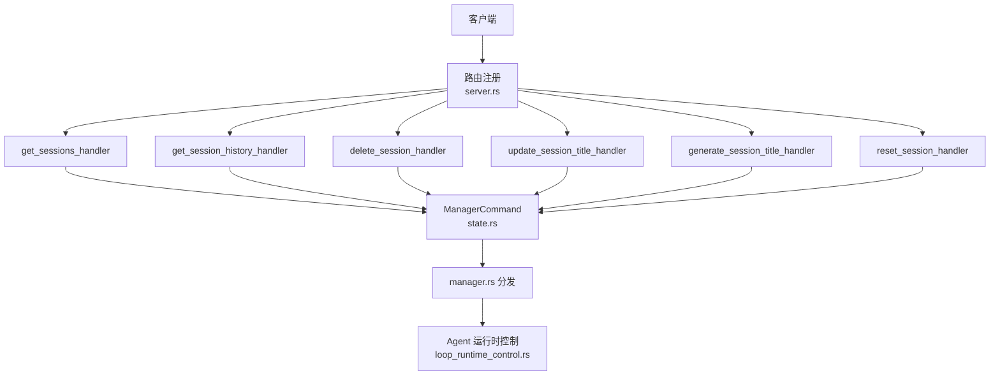
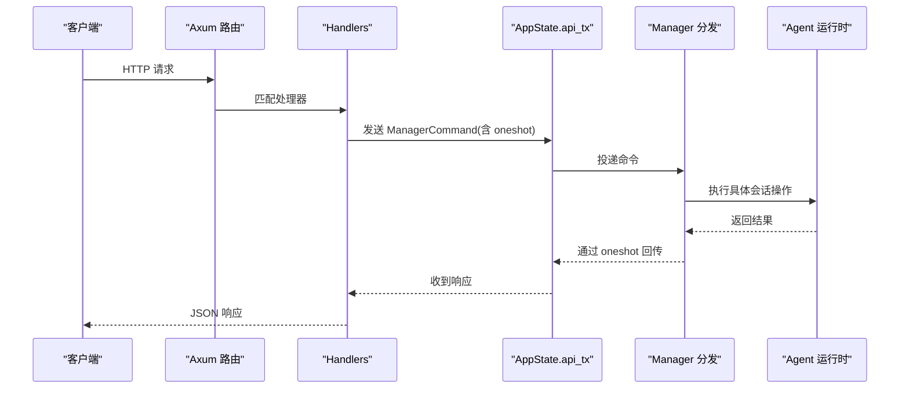
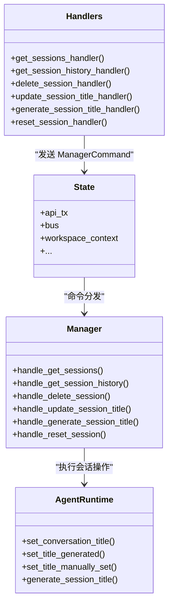

# 会话管理

<cite>
**本文引用的文件**
- [server.rs](file://agent-diva-manager/src/server.rs)
- [handlers.rs](file://agent-diva-manager/src/handlers.rs)
- [state.rs](file://agent-diva-manager/src/state.rs)
- [manager.rs](file://agent-diva-manager/src/manager.rs)
- [loop_runtime_control.rs](file://agent-diva-agent/src/agent_loop/loop_runtime_control.rs)
</cite>

## 目录
1. [简介](#简介)
2. [项目结构](#项目结构)
3. [核心组件](#核心组件)
4. [架构总览](#架构总览)
5. [详细端点说明](#详细端点说明)
6. [依赖关系分析](#依赖关系分析)
7. [性能与一致性考虑](#性能与一致性考虑)
8. [故障排查指南](#故障排查指南)
9. [结论](#结论)
10. [附录：请求与响应示例](#附录请求与响应示例)

## 简介
本文件面向会话管理 API，覆盖以下端点：
- GET /api/sessions：列出会话
- GET /api/sessions/:id：获取会话历史
- DELETE /api/sessions/:id：删除会话（同时支持 POST 同路径以兼容）
- PATCH /api/sessions/:id/title：更新会话标题
- POST /api/sessions/:id/generate-title：生成会话标题
- POST /api/sessions/reset：重置会话

文档将详细说明每个端点的请求参数、响应格式、业务逻辑、错误处理以及调用时序。

## 项目结构
会话管理相关的路由定义位于管理器 HTTP 服务中，处理器实现位于 handlers 模块，命令通过内部通道转发到 manager 层，最终由 agent 运行时执行具体操作。

图表来源
- [server.rs:204-224](file://agent-diva-manager/src/server.rs#L204-L224)
- [handlers.rs:385-581](file://agent-diva-manager/src/handlers.rs#L385-L581)
- [state.rs:310-360](file://agent-diva-manager/src/state.rs#L310-L360)
- [manager.rs:289-306](file://agent-diva-manager/src/manager.rs#L289-L306)
- [loop_runtime_control.rs:369-407](file://agent-diva-agent/src/agent_loop/loop_runtime_control.rs#L369-L407)

章节来源
- [server.rs:204-224](file://agent-diva-manager/src/server.rs#L204-L224)

## 核心组件
- 路由层：在 server.rs 中注册 /api/sessions 系列端点。
- 处理器层：handlers.rs 中实现各端点的具体处理逻辑，统一通过 oneshot 通道发送 ManagerCommand。
- 命令层：state.rs 定义 ManagerCommand 枚举，包含 GetSessions、GetSessionHistory、DeleteSession、UpdateSessionTitle、GenerateSessionTitle、ResetSession 等。
- 调度层：manager.rs 接收命令并分派到对应处理方法。
- 运行层：agent 侧 loop_runtime_control.rs 负责实际的会话状态变更（如标题更新、标题生成）。

章节来源
- [state.rs:310-360](file://agent-diva-manager/src/state.rs#L310-L360)
- [manager.rs:289-306](file://agent-diva-manager/src/manager.rs#L289-L306)
- [loop_runtime_control.rs:369-407](file://agent-diva-agent/src/agent_loop/loop_runtime_control.rs#L369-L407)

## 架构总览
所有会话管理 API 均遵循统一的“HTTP -> Handler -> ManagerCommand -> Manager -> Agent 运行时”的异步调用链。处理器使用 oneshot channel 等待后端结果，再封装为 JSON 响应返回。

图表来源
- [handlers.rs:385-581](file://agent-diva-manager/src/handlers.rs#L385-L581)
- [state.rs:310-360](file://agent-diva-manager/src/state.rs#L310-L360)
- [manager.rs:289-306](file://agent-diva-manager/src/manager.rs#L289-L306)

## 详细端点说明

### GET /api/sessions：会话列表查询
- 功能：获取当前工作区下的会话列表。
- 请求：无路径参数，无请求体。
- 响应：
  - status: "ok" | "error"
  - sessions: 会话信息数组（类型由后端 SessionInfo 决定）
- 业务逻辑：
  - 处理器创建 oneshot 通道，发送 ManagerCommand::GetSessions。
  - 等待 manager 层返回会话列表，封装为 JSON。
- 错误处理：
  - 发送失败或接收失败时返回 status="error"，message 为错误描述。

章节来源
- [server.rs:209](file://agent-diva-manager/src/server.rs#L209)
- [handlers.rs:409-424](file://agent-diva-manager/src/handlers.rs#L409-L424)
- [state.rs:345](file://agent-diva-manager/src/state.rs#L345)

### GET /api/sessions/:id：获取会话历史
- 功能：根据会话标识 id 获取该会话的历史记录。
- 路径参数：
  - id: 会话标识。若不含冒号，则自动补前缀 "gui:"，形成 session_key。
- 请求：无请求体。
- 响应：
  - status: "ok" | "error"
  - session: 会话对象（当存在时），否则返回 error 提示未找到。
- 业务逻辑：
  - 解析 id 为 session_key。
  - 发送 ManagerCommand::GetSessionHistory(session_key, tx)。
  - 若返回 None，视为未找到；否则返回会话数据。
- 错误处理：
  - 发送失败、接收失败或未找到会话时返回相应错误消息。

章节来源
- [server.rs:210-214](file://agent-diva-manager/src/server.rs#L210-L214)
- [handlers.rs:426-459](file://agent-diva-manager/src/handlers.rs#L426-L459)
- [state.rs:346-349](file://agent-diva-manager/src/state.rs#L346-L349)

### DELETE /api/sessions/:id：删除会话
- 功能：删除指定会话。
- 路径参数：
  - id: 会话标识。若不含冒号，自动补前缀 "gui:"。
- 请求：无请求体。
- 响应：
  - status: "ok" | "error"
  - deleted: 布尔值，表示是否成功删除。
- 业务逻辑：
  - 解析 session_key。
  - 发送 ManagerCommand::DeleteSession(session_key, tx)。
  - 返回删除结果。
- 错误处理：
  - 发送失败、接收失败时返回错误消息。

注意：路由中同时允许 POST /api/sessions/:id 走同一处理器，用于兼容前端调用。

章节来源
- [server.rs:210-214](file://agent-diva-manager/src/server.rs#L210-L214)
- [handlers.rs:461-500](file://agent-diva-manager/src/handlers.rs#L461-L500)
- [state.rs:350](file://agent-diva-manager/src/state.rs#L350)

### PATCH /api/sessions/:id/title：更新会话标题
- 功能：手动设置会话标题。
- 路径参数：
  - id: 会话标识。若不含冒号，自动补前缀 "gui:"。
- 请求体：
  - title: 字符串，可选。为空或不提供时，可清空标题。
- 响应：
  - status: "ok" | "error"
  - title: 更新后的标题（可能为 null）。
- 业务逻辑：
  - 解析 session_key 和 new_title。
  - 发送 ManagerCommand::UpdateSessionTitle(session_key, new_title, tx)。
  - 后端会持久化标题并标记是否手动设置。
- 错误处理：
  - 发送失败、接收失败时返回错误消息。

章节来源
- [server.rs:216-218](file://agent-diva-manager/src/server.rs#L216-L218)
- [handlers.rs:502-541](file://agent-diva-manager/src/handlers.rs#L502-L541)
- [state.rs:351-355](file://agent-diva-manager/src/state.rs#L351-L355)
- [loop_runtime_control.rs:369-386](file://agent-diva-agent/src/agent_loop/loop_runtime_control.rs#L369-L386)

### POST /api/sessions/:id/generate-title：生成会话标题
- 功能：基于首条用户消息与助手回复自动生成会话标题。
- 路径参数：
  - id: 会话标识。若不含冒号，自动补前缀 "gui:"。
- 请求体：
  - first_user_message: 字符串，首条用户消息内容。
  - first_assistant_message: 字符串，首条助手回复内容。
- 响应：
  - status: "ok" | "error"
  - title: 生成的标题或回退标题。
  - title_generated: 布尔值，指示是否为自动生成。
  - title_manually_set: 布尔值，指示是否已手动设置过标题。
- 业务逻辑：
  - 解析 session_key 与 payload。
  - 发送 ManagerCommand::GenerateSessionTitle(session_key, payload, tx)。
  - 后端检查是否已手动设置标题；若未设置，则尝试生成；否则直接返回现有标题及标志位。
- 错误处理：
  - 发送失败、接收失败时返回错误消息。

章节来源
- [server.rs:220-222](file://agent-diva-manager/src/server.rs#L220-L222)
- [handlers.rs:543-581](file://agent-diva-manager/src/handlers.rs#L543-L581)
- [state.rs:356-360](file://agent-diva-manager/src/state.rs#L356-L360)
- [loop_runtime_control.rs:388-407](file://agent-diva-agent/src/agent_loop/loop_runtime_control.rs#L388-L407)

### POST /api/sessions/reset：重置会话
- 功能：重置指定会话，归档旧历史并建立新会话起点。
- 请求体：
  - channel: 可选，频道名称。
  - chat_id: 可选，聊天标识。
  - 两者组合用于定位目标会话 key。
- 响应：
  - status: "ok" | "error"
  - reset: 布尔值，表示是否成功重置。
- 业务逻辑：
  - 发送 ManagerCommand::ResetSession(payload, tx)。
  - 后端执行清理、归档与重建流程，返回结果。
- 错误处理：
  - 发送失败、接收失败时返回错误消息。

章节来源
- [server.rs:224](file://agent-diva-manager/src/server.rs#L224)
- [handlers.rs:385-407](file://agent-diva-manager/src/handlers.rs#L385-L407)
- [state.rs:314-315](file://agent-diva-manager/src/state.rs#L314-L315)

## 依赖关系分析
- 路由依赖 handlers 中的处理器函数。
- 处理器依赖 AppState 中的 api_tx 发送 ManagerCommand。
- ManagerCommand 在 state.rs 中集中定义，确保接口契约一致。
- manager.rs 负责命令分发，调用 agent 运行时完成实际会话操作。
- 标题更新与生成涉及 agent 运行时对会话状态的持久化与标志位维护。

图表来源
- [handlers.rs:385-581](file://agent-diva-manager/src/handlers.rs#L385-L581)
- [state.rs:310-360](file://agent-diva-manager/src/state.rs#L310-L360)
- [manager.rs:289-306](file://agent-diva-manager/src/manager.rs#L289-L306)
- [loop_runtime_control.rs:369-407](file://agent-diva-agent/src/agent_loop/loop_runtime_control.rs#L369-L407)

章节来源
- [handlers.rs:385-581](file://agent-diva-manager/src/handlers.rs#L385-L581)
- [state.rs:310-360](file://agent-diva-manager/src/state.rs#L310-L360)
- [manager.rs:289-306](file://agent-diva-manager/src/manager.rs#L289-L306)
- [loop_runtime_control.rs:369-407](file://agent-diva-agent/src/agent_loop/loop_runtime_control.rs#L369-L407)

## 性能与一致性考虑
- 异步通信：所有处理器通过 oneshot 通道与 manager 交互，避免阻塞 HTTP 线程。
- 幂等性：删除与重置应保证幂等，重复调用不应产生副作用。
- 并发安全：会话状态变更由 agent 运行时串行化处理，避免竞态条件。
- 日志与追踪：关键步骤均有日志输出，便于问题定位。

[本节为通用指导，不直接分析具体文件]

## 故障排查指南
- 常见错误：
  - 发送 ManagerCommand 失败：检查 api_tx 是否可用，服务端是否正常运行。
  - 接收响应失败：检查 manager 是否崩溃或通道关闭。
  - 会话未找到：确认 id 是否正确，必要时检查是否需补前缀 "gui:"。
- 调试建议：
  - 查看 handler 中的 tracing 日志，定位失败阶段。
  - 检查 manager 分发逻辑是否正确映射到对应处理方法。
  - 对于标题相关操作，确认 agent 运行时是否成功持久化并更新标志位。

章节来源
- [handlers.rs:385-581](file://agent-diva-manager/src/handlers.rs#L385-L581)

## 结论
会话管理 API 采用清晰的分层架构，通过统一的命令通道与异步处理机制，实现了会话列表、历史、删除、标题更新与生成、重置等功能。各端点具备一致的响应格式与错误处理策略，便于前端集成与维护。

[本节为总结，不直接分析具体文件]

## 附录：请求与响应示例

- GET /api/sessions
  - 请求：GET /api/sessions
  - 响应：{"status":"ok","sessions":[...]}

- GET /api/sessions/:id
  - 请求：GET /api/sessions/abc123
  - 响应：{"status":"ok","session":{...}} 或 {"status":"error","message":"Session not found"}

- DELETE /api/sessions/:id
  - 请求：DELETE /api/sessions/abc123
  - 响应：{"status":"ok","deleted":true}

- PATCH /api/sessions/:id/title
  - 请求：PATCH /api/sessions/abc123/title
  - 请求体：{"title":"新的标题"}
  - 响应：{"status":"ok","title":"新的标题"}

- POST /api/sessions/:id/generate-title
  - 请求：POST /api/sessions/abc123/generate-title
  - 请求体：{"first_user_message":"你好","first_assistant_message":"您好，有什么可以帮助您的？"}
  - 响应：{"status":"ok","title":"生成的标题","title_generated":true,"title_manually_set":false}

- POST /api/sessions/reset
  - 请求：POST /api/sessions/reset
  - 请求体：{"channel":"gui","chat_id":"abc123"}
  - 响应：{"status":"ok","reset":true}

[本节为示例，不直接分析具体文件]