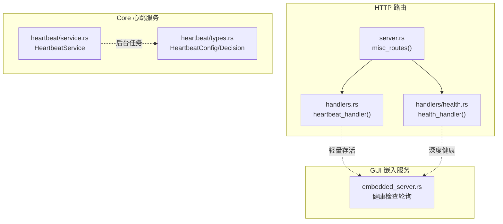
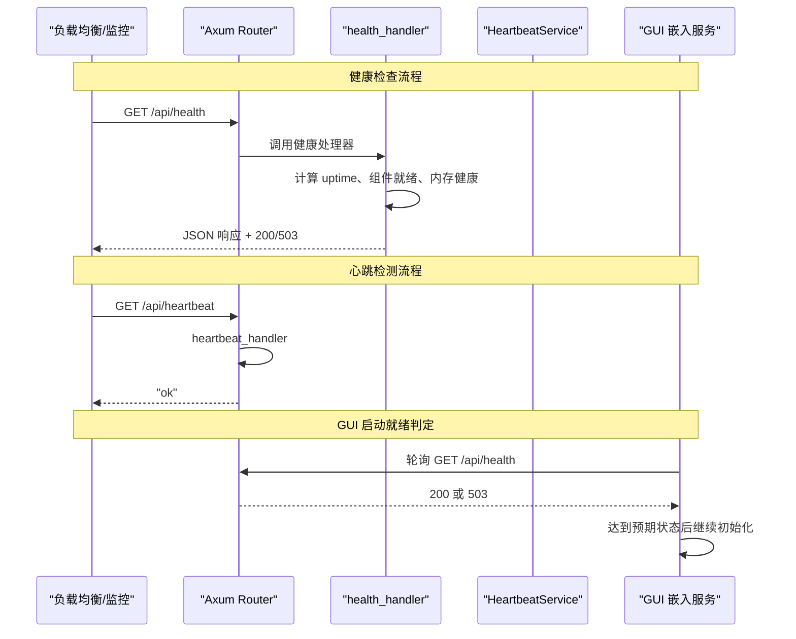
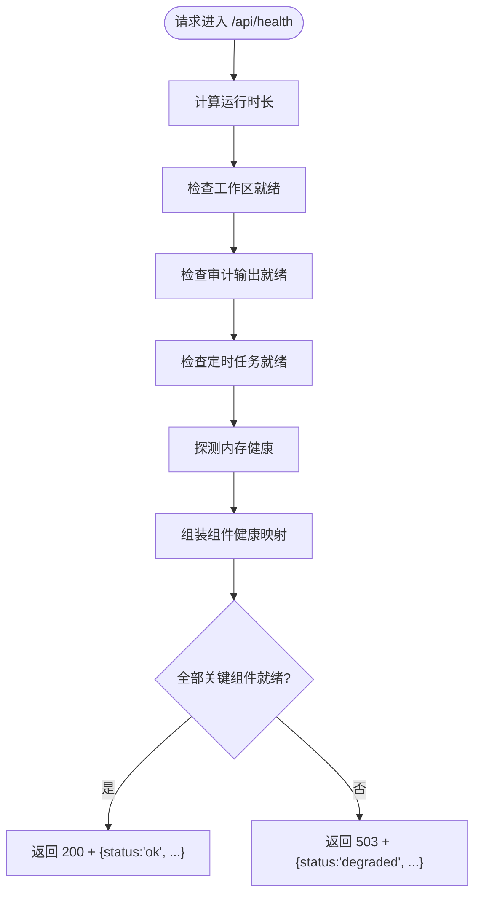
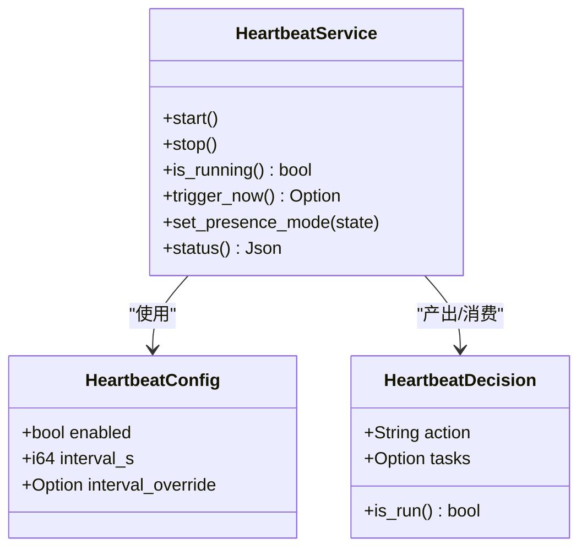
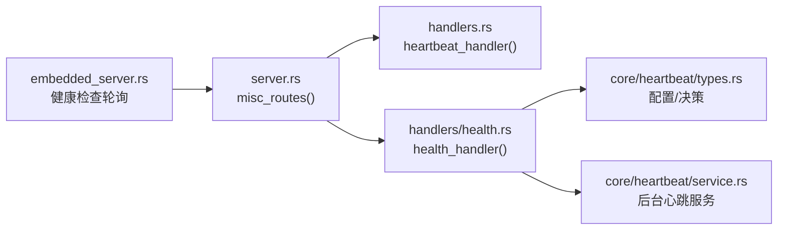

# 健康检查

<cite>
**本文引用的文件**
- [agent-diva-manager/src/handlers/health.rs](file://agent-diva-manager/src/handlers/health.rs)
- [agent-diva-manager/src/server.rs](file://agent-diva-manager/src/server.rs)
- [agent-diva-manager/src/handlers.rs](file://agent-diva-manager/src/handlers.rs)
- [agent-diva-core/src/heartbeat/service.rs](file://agent-diva-core/src/heartbeat/service.rs)
- [agent-diva-core/src/heartbeat/types.rs](file://agent-diva-core/src/heartbeat/types.rs)
- [agent-diva-gui/src-tauri/src/embedded_server.rs](file://agent-diva-gui/src-tauri/src/embedded_server.rs)
</cite>

## 目录
1. [简介](#简介)
2. [项目结构](#项目结构)
3. [核心组件](#核心组件)
4. [架构总览](#架构总览)
5. [详细组件分析](#详细组件分析)
6. [依赖关系分析](#依赖关系分析)
7. [性能考虑](#性能考虑)
8. [故障排查指南](#故障排查指南)
9. [结论](#结论)
10. [附录](#附录)

## 简介
本文件面向运维、平台与开发者，系统化说明 Agent-Diva 服务暴露的健康检查与心跳检测能力，包括：
- 健康检查端点 /api/health：聚合服务状态、关键组件就绪情况、内存子系统健康与版本/运行时长等指标。
- 心跳检测端点 /api/heartbeat：极简存活探针，用于负载均衡与健康网关快速探测。
- 后端心跳服务（Heartbeat Service）：周期性唤醒 Agent 进行任务决策与执行，支持基于用户“在场”状态的动态间隔调整。
- 集成示例：如何在负载均衡器、服务发现与健康监控系统中接入上述端点与服务。

## 项目结构
健康检查相关代码主要分布在以下模块：
- Manager HTTP 层：路由注册与处理器实现
- Core 心跳服务：后台周期任务、配置与决策类型
- GUI Tauri 嵌入服务器：对 /api/health 的轮询与启动就绪判定

图表来源
- [agent-diva-manager/src/server.rs:378-382](file://agent-diva-manager/src/server.rs#L378-L382)
- [agent-diva-manager/src/handlers.rs:1030-1032](file://agent-diva-manager/src/handlers.rs#L1030-L1032)
- [agent-diva-manager/src/handlers/health.rs:32-72](file://agent-diva-manager/src/handlers/health.rs#L32-L72)
- [agent-diva-core/src/heartbeat/service.rs:73-118](file://agent-diva-core/src/heartbeat/service.rs#L73-L118)
- [agent-diva-core/src/heartbeat/types.rs:70-92](file://agent-diva-core/src/heartbeat/types.rs#L70-L92)
- [agent-diva-gui/src-tauri/src/embedded_server.rs:254-279](file://agent-diva-gui/src-tauri/src/embedded_server.rs#L254-L279)

章节来源
- [agent-diva-manager/src/server.rs:93-113](file://agent-diva-manager/src/server.rs#L93-L113)
- [agent-diva-manager/src/server.rs:378-382](file://agent-diva-manager/src/server.rs#L378-L382)

## 核心组件
- /api/health 健康检查处理器：计算整体状态、收集组件就绪信息、内存健康、版本与运行时长，并返回合适的 HTTP 状态码。
- /api/heartbeat 心跳处理器：极简存活响应，便于快速探测。
- HeartbeatService：后台周期任务，读取 HEARTBEAT.md，调用决策回调决定是否执行任务；支持根据 PresenceState 动态调整心跳间隔。
- HeartbeatConfig/Decision：心跳开关、默认间隔、工具定义与决策结构。
- GUI 嵌入服务：启动时轮询 /api/health，等待服务进入就绪或不可用状态后再继续。

章节来源
- [agent-diva-manager/src/handlers/health.rs:10-72](file://agent-diva-manager/src/handlers/health.rs#L10-L72)
- [agent-diva-manager/src/handlers.rs:1030-1032](file://agent-diva-manager/src/handlers.rs#L1030-L1032)
- [agent-diva-core/src/heartbeat/service.rs:36-118](file://agent-diva-core/src/heartbeat/service.rs#L36-L118)
- [agent-diva-core/src/heartbeat/types.rs:14-21](file://agent-diva-core/src/heartbeat/types.rs#L14-L21)
- [agent-diva-core/src/heartbeat/types.rs:70-92](file://agent-diva-core/src/heartbeat/types.rs#L70-L92)
- [agent-diva-gui/src-tauri/src/embedded_server.rs:254-279](file://agent-diva-gui/src-tauri/src/embedded_server.rs#L254-L279)

## 架构总览
健康检查与心跳检测在系统中的交互如下：

图表来源
- [agent-diva-manager/src/server.rs:378-382](file://agent-diva-manager/src/server.rs#L378-L382)
- [agent-diva-manager/src/handlers/health.rs:32-72](file://agent-diva-manager/src/handlers/health.rs#L32-L72)
- [agent-diva-manager/src/handlers.rs:1030-1032](file://agent-diva-manager/src/handlers.rs#L1030-L1032)
- [agent-diva-gui/src-tauri/src/embedded_server.rs:254-279](file://agent-diva-gui/src-tauri/src/embedded_server.rs#L254-L279)

## 详细组件分析

### 健康检查 /api/health
- 功能要点
  - 返回服务版本、运行时长、组件健康集合与内存健康。
  - 组件包含：审计输出、定时任务、事件总线、工作区、内存。
  - 若所有“关键”组件均就绪，则返回 200 OK；否则返回 503 Service Unavailable。
  - 内存健康通过 MemoryHome 预热探测，失败时标记为降级并附带原因。
- 数据结构
  - HealthResponse：status/version/uptime_secs/components/memory
  - ComponentHealth：status/ready/critical
  - MemoryHealth：status/degraded_reason
- 行为细节
  - 工作区就绪：路径存在且可获取元数据。
  - 审计输出就绪：路径存在且内部健康检查通过。
  - 事件总线：当前固定为就绪。
  - 定时任务：通过运行时健康接口查询是否就绪。
  - 内存：调用 MemoryHome.warmup() 判断。

图表来源
- [agent-diva-manager/src/handlers/health.rs:32-72](file://agent-diva-manager/src/handlers/health.rs#L32-L72)
- [agent-diva-manager/src/handlers/health.rs:77-111](file://agent-diva-manager/src/handlers/health.rs#L77-L111)

章节来源
- [agent-diva-manager/src/handlers/health.rs:10-72](file://agent-diva-manager/src/handlers/health.rs#L10-L72)
- [agent-diva-manager/src/handlers/health.rs:77-111](file://agent-diva-manager/src/handlers/health.rs#L77-L111)

### 心跳检测 /api/heartbeat
- 功能要点
  - 极简存活探针，直接返回字符串 "ok"。
  - 适合负载均衡器、Kubernetes liveness/readiness 等场景的快速探测。
- 路由注册
  - 由 misc_routes 统一挂载到 /api/heartbeat。

章节来源
- [agent-diva-manager/src/handlers.rs:1030-1032](file://agent-diva-manager/src/handlers.rs#L1030-L1032)
- [agent-diva-manager/src/server.rs:378-382](file://agent-diva-manager/src/server.rs#L378-L382)

### 后台心跳服务（Heartbeat Service）
- 职责
  - 周期性读取工作区下的 HEARTBEAT.md，若无可执行内容则跳过。
  - 调用决策回调（LLM 或策略）决定 skip/run。
  - 若 run，则调用执行回调触发 Agent 循环执行任务摘要。
  - 支持根据 PresenceState 动态调整心跳间隔（活跃/分心/离开）。
- 配置
  - HeartbeatConfig：enabled、interval_s、interval_override。
  - 默认间隔为 30 分钟。
- 状态查询
  - status() 返回 enabled/running/interval_s/是否有回调/HEARTBEAT.md 是否存在。

图表来源
- [agent-diva-core/src/heartbeat/service.rs:41-192](file://agent-diva-core/src/heartbeat/service.rs#L41-L192)
- [agent-diva-core/src/heartbeat/types.rs:14-21](file://agent-diva-core/src/heartbeat/types.rs#L14-L21)
- [agent-diva-core/src/heartbeat/types.rs:70-92](file://agent-diva-core/src/heartbeat/types.rs#L70-L92)

章节来源
- [agent-diva-core/src/heartbeat/service.rs:73-192](file://agent-diva-core/src/heartbeat/service.rs#L73-L192)
- [agent-diva-core/src/heartbeat/types.rs:14-21](file://agent-diva-core/src/heartbeat/types.rs#L14-L21)
- [agent-diva-core/src/heartbeat/types.rs:70-92](file://agent-diva-core/src/heartbeat/types.rs#L70-L92)

### GUI 嵌入服务中的健康检查
- 启动阶段会轮询 /api/health，接受 200 或 503 作为“已就绪/不可用”的信号，超时或错误将中止启动流程。
- 这体现了健康检查在应用生命周期管理中的作用。

章节来源
- [agent-diva-gui/src-tauri/src/embedded_server.rs:254-279](file://agent-diva-gui/src-tauri/src/embedded_server.rs#L254-L279)

## 依赖关系分析
- HTTP 路由层
  - server.rs 中 misc_routes 将 /api/health 与 /api/heartbeat 挂载到 Axum Router。
- 处理器层
  - health.rs 提供健康检查逻辑；handlers.rs 提供心跳处理器。
- 核心服务层
  - core/heartbeat 提供后台心跳服务与配置/决策类型。
- 客户端侧
  - GUI 嵌入服务通过 /api/health 进行启动就绪判定。

图表来源
- [agent-diva-manager/src/server.rs:378-382](file://agent-diva-manager/src/server.rs#L378-L382)
- [agent-diva-manager/src/handlers.rs:1030-1032](file://agent-diva-manager/src/handlers.rs#L1030-L1032)
- [agent-diva-manager/src/handlers/health.rs:32-72](file://agent-diva-manager/src/handlers/health.rs#L32-L72)
- [agent-diva-core/src/heartbeat/types.rs:70-92](file://agent-diva-core/src/heartbeat/types.rs#L70-L92)
- [agent-diva-core/src/heartbeat/service.rs:73-118](file://agent-diva-core/src/heartbeat/service.rs#L73-L118)
- [agent-diva-gui/src-tauri/src/embedded_server.rs:254-279](file://agent-diva-gui/src-tauri/src/embedded_server.rs#L254-L279)

章节来源
- [agent-diva-manager/src/server.rs:93-113](file://agent-diva-manager/src/server.rs#L93-L113)
- [agent-diva-manager/src/server.rs:378-382](file://agent-diva-manager/src/server.rs#L378-L382)

## 性能考虑
- /api/health 的性能预算
  - 内置基准测试确保在高并发下保持低延迟（例如在 CI 中对大量请求进行耗时约束），避免健康检查成为瓶颈。
- 组件探测成本
  - 工作区与审计输出为本地文件系统检查，开销极低。
  - 内存健康通过 MemoryHome.warmup() 探测，应避免频繁调用或在高负载时退化为只读缓存。
- /api/heartbeat 零开销
  - 仅返回常量字符串，适合极高频率的存活探测。

章节来源
- [agent-diva-manager/src/handlers/health.rs:216-247](file://agent-diva-manager/src/handlers/health.rs#L216-L247)

## 故障排查指南
- 健康检查返回 503
  - 检查 components 中 critical 组件是否全部 ready。
  - 关注 memory.status 与 degraded_reason，定位内存子系统问题。
  - 确认 cron_ready 是否为 unknown 或 false，必要时标记为就绪以推进流程。
- 心跳检测无响应
  - 确认 /api/heartbeat 路由已正确注册。
  - 检查网络与端口监听是否正常。
- GUI 启动失败
  - 查看 embedded_server 对 /api/health 的轮询结果与超时日志，确认服务是否在预期时间内可达。

章节来源
- [agent-diva-manager/src/handlers/health.rs:32-72](file://agent-diva-manager/src/handlers/health.rs#L32-L72)
- [agent-diva-manager/src/handlers/health.rs:77-111](file://agent-diva-manager/src/handlers/health.rs#L77-L111)
- [agent-diva-manager/src/server.rs:378-382](file://agent-diva-manager/src/server.rs#L378-L382)
- [agent-diva-gui/src-tauri/src/embedded_server.rs:254-279](file://agent-diva-gui/src-tauri/src/embedded_server.rs#L254-L279)

## 结论
- /api/health 提供全面的服务健康视图，结合组件就绪与内存健康，配合 200/503 语义，便于上层系统做出调度与自愈决策。
- /api/heartbeat 提供极简存活探针，适用于高频探测与负载均衡。
- 后台 Heartbeat Service 负责周期性任务驱动，支持动态间隔与优雅启停，增强系统的自维护能力。
- 建议在负载均衡、服务发现与健康监控中同时接入两个端点：/api/heartbeat 用于快速存活探测，/api/health 用于深度健康评估。

## 附录

### API 定义与行为
- GET /api/health
  - 响应体字段：status、version、uptime_secs、components、memory
  - 状态码：200（全部关键组件就绪）、503（任一关键组件未就绪）
- GET /api/heartbeat
  - 响应体：字符串 "ok"
  - 状态码：200

章节来源
- [agent-diva-manager/src/handlers/health.rs:10-72](file://agent-diva-manager/src/handlers/health.rs#L10-L72)
- [agent-diva-manager/src/handlers.rs:1030-1032](file://agent-diva-manager/src/handlers.rs#L1030-L1032)

### 集成示例（概念性）
- 负载均衡
  - 使用 /api/heartbeat 进行存活探测（高频、低开销）。
  - 使用 /api/health 进行就绪判定（低频、深度检查）。
- 服务发现
  - 服务注册前需通过 /api/health 返回 200，确保关键组件就绪。
- 健康监控
  - 采集 /api/health 的 components 与 memory 字段，设置告警阈值（如 memory.degraded_reason 非空、任意 critical 组件 not ready）。

[本节为概念性说明，不直接引用具体代码文件]