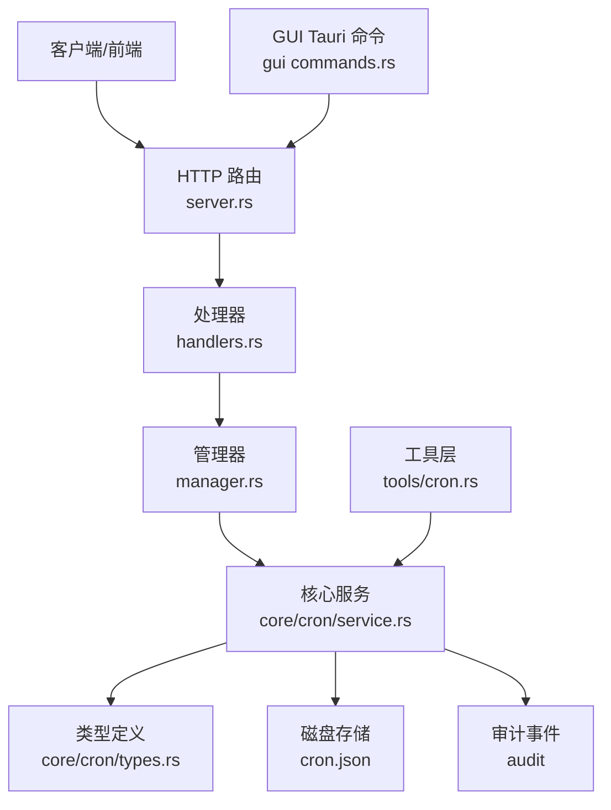
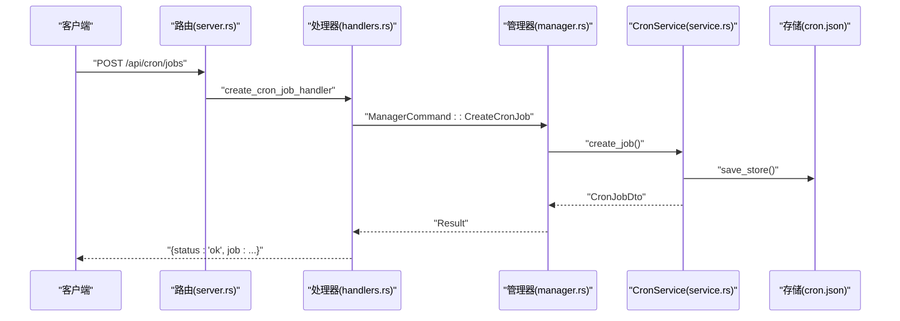
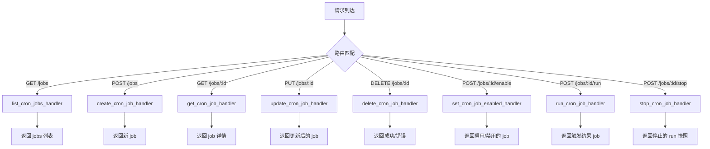
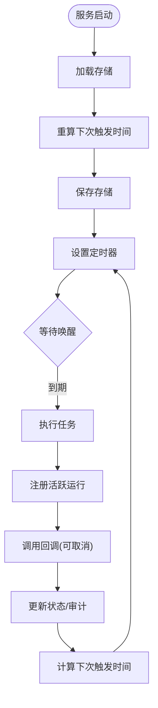
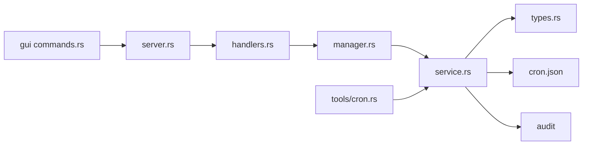

# 定时任务

<cite>
**本文引用的文件**
- [agent-diva-manager/src/server.rs](file://agent-diva-manager/src/server.rs)
- [agent-diva-manager/src/handlers.rs](file://agent-diva-manager/src/handlers.rs)
- [agent-diva-manager/src/manager.rs](file://agent-diva-manager/src/manager.rs)
- [agent-diva-core/src/cron/mod.rs](file://agent-diva-core/src/cron/mod.rs)
- [agent-diva-core/src/cron/types.rs](file://agent-diva-core/src/cron/types.rs)
- [agent-diva-core/src/cron/service.rs](file://agent-diva-core/src/cron/service.rs)
- [agent-diva-tools/src/cron.rs](file://agent-diva-tools/src/cron.rs)
- [agent-diva-gui/src-tauri/src/commands.rs](file://agent-diva-gui/src-tauri/src/commands.rs)
</cite>

## 目录
1. [简介](#简介)
2. [项目结构](#项目结构)
3. [核心组件](#核心组件)
4. [架构总览](#架构总览)
5. [详细组件分析](#详细组件分析)
6. [依赖关系分析](#依赖关系分析)
7. [性能考量](#性能考量)
8. [故障排除指南](#故障排除指南)
9. [结论](#结论)
10. [附录：API 参考与配置](#附录api-参考与配置)

## 简介
本文件面向“定时任务”能力，提供完整的 API 文档、调度策略说明、执行日志与错误处理机制，以及配置、监控与故障排除指南。系统通过 HTTP 接口暴露定时任务的增删改查、启用/禁用、手动执行与停止等能力；底层由 CronService 负责持久化存储、定时器调度、任务执行与审计记录。

## 项目结构
定时任务相关代码分布在以下模块：
- 路由与处理器：HTTP 路由定义与请求处理位于 manager 层
- 管理器：命令分发与业务编排
- 核心服务：CronService 实现调度、执行、持久化与状态管理
- 类型定义：CronSchedule、CronJob、CronPayload、CronRunSnapshot 等
- 工具集成：cron 工具用于在会话中创建/管理任务
- GUI 客户端：Tauri 命令封装调用后端 API

**图表来源**
- [agent-diva-manager/src/server.rs:298-312](file://agent-diva-manager/src/server.rs#L298-L312)
- [agent-diva-manager/src/handlers.rs:1034-1155](file://agent-diva-manager/src/handlers.rs#L1034-L1155)
- [agent-diva-manager/src/manager.rs:307-331](file://agent-diva-manager/src/manager.rs#L307-L331)
- [agent-diva-core/src/cron/service.rs:176-274](file://agent-diva-core/src/cron/service.rs#L176-L274)
- [agent-diva-core/src/cron/types.rs:6-28](file://agent-diva-core/src/cron/types.rs#L6-L28)

**章节来源**
- [agent-diva-manager/src/server.rs:298-312](file://agent-diva-manager/src/server.rs#L298-L312)
- [agent-diva-manager/src/handlers.rs:1034-1155](file://agent-diva-manager/src/handlers.rs#L1034-L1155)
- [agent-diva-manager/src/manager.rs:307-331](file://agent-diva-manager/src/manager.rs#L307-L331)
- [agent-diva-core/src/cron/mod.rs:1-10](file://agent-diva-core/src/cron/mod.rs#L1-L10)
- [agent-diva-core/src/cron/types.rs:6-28](file://agent-diva-core/src/cron/types.rs#L6-L28)
- [agent-diva-core/src/cron/service.rs:176-274](file://agent-diva-core/src/cron/service.rs#L176-L274)
- [agent-diva-tools/src/cron.rs:1-452](file://agent-diva-tools/src/cron.rs#L1-L452)
- [agent-diva-gui/src-tauri/src/commands.rs:2595-2811](file://agent-diva-gui/src-tauri/src/commands.rs#L2595-L2811)

## 核心组件
- HTTP 路由：将 /api/cron/jobs 系列路径映射到处理器函数
- 处理器：解析请求参数，通过 oneshot channel 向管理器发送命令并返回统一 JSON 响应
- 管理器：接收命令并调用 CronService 对应方法
- CronService：加载/保存任务存储、计算下次触发时间、注册活跃运行、执行任务、更新状态、审计记录
- 类型：定义调度策略（一次性、周期、Cron 表达式）、任务载荷、运行时快照、生命周期状态等
- 工具：在会话上下文中创建/列出/删除任务，限制在 cron 执行上下文内禁止嵌套调度
- GUI：封装对后端的 HTTP 调用，校验 status 字段并提取 job/run 数据

**章节来源**
- [agent-diva-manager/src/server.rs:298-312](file://agent-diva-manager/src/server.rs#L298-L312)
- [agent-diva-manager/src/handlers.rs:1034-1155](file://agent-diva-manager/src/handlers.rs#L1034-L1155)
- [agent-diva-manager/src/manager.rs:307-331](file://agent-diva-manager/src/manager.rs#L307-L331)
- [agent-diva-core/src/cron/service.rs:119-174](file://agent-diva-core/src/cron/service.rs#L119-L174)
- [agent-diva-core/src/cron/types.rs:6-28](file://agent-diva-core/src/cron/types.rs#L6-L28)
- [agent-diva-tools/src/cron.rs:34-96](file://agent-diva-tools/src/cron.rs#L34-L96)
- [agent-diva-gui/src-tauri/src/commands.rs:2611-2643](file://agent-diva-gui/src-tauri/src/commands.rs#L2611-L2643)

## 架构总览
定时任务从 HTTP 请求进入，经路由转发到处理器，处理器通过通道将命令发送给管理器，管理器调用 CronService 完成具体操作。CronService 维护内存中的任务集合与活跃运行表，并将状态持久化到磁盘文件。任务触发时，根据调度策略计算下次执行时间，执行回调并记录审计事件。

**图表来源**
- [agent-diva-manager/src/server.rs:298-312](file://agent-diva-manager/src/server.rs#L298-L312)
- [agent-diva-manager/src/handlers.rs:1062-1079](file://agent-diva-manager/src/handlers.rs#L1062-L1079)
- [agent-diva-manager/src/manager.rs:313-315](file://agent-diva-manager/src/manager.rs#L313-L315)
- [agent-diva-core/src/cron/service.rs:541-578](file://agent-diva-core/src/cron/service.rs#L541-L578)

## 详细组件分析

### 路由与处理器
- 路由定义：
  - GET /api/cron/jobs：列出任务
  - POST /api/cron/jobs：创建任务
  - GET /api/cron/jobs/:id：获取任务详情
  - PUT /api/cron/jobs/:id：更新任务
  - DELETE /api/cron/jobs/:id：删除任务
  - POST /api/cron/jobs/:id/enable：启用/禁用任务
  - POST /api/cron/jobs/:id/run：立即执行任务
  - POST /api/cron/jobs/:id/stop：停止正在运行的任务
- 处理器行为：
  - 使用 oneshot channel 与管理器通信
  - 统一返回 {status, message?, job?} 或 {status, message?, run?}
  - 错误时返回 {status:"error", message:"..."}

**图表来源**
- [agent-diva-manager/src/server.rs:298-312](file://agent-diva-manager/src/server.rs#L298-L312)
- [agent-diva-manager/src/handlers.rs:1034-1155](file://agent-diva-manager/src/handlers.rs#L1034-L1155)

**章节来源**
- [agent-diva-manager/src/server.rs:298-312](file://agent-diva-manager/src/server.rs#L298-L312)
- [agent-diva-manager/src/handlers.rs:1034-1155](file://agent-diva-manager/src/handlers.rs#L1034-L1155)

### 管理器命令分发
- 管理器接收 ManagerCommand，分派到对应的 handle_* 方法
- 定时任务相关命令包括：ListCronJobs、GetCronJob、CreateCronJob、UpdateCronJob、DeleteCronJob、SetCronJobEnabled、RunCronJobNow、StopCronJobRun

**章节来源**
- [agent-diva-manager/src/manager.rs:307-331](file://agent-diva-manager/src/manager.rs#L307-L331)

### CronService 调度与执行
- 启动流程：
  - 加载存储（cron.json），若存在则解析为 CronStore
  - 重新计算所有启用任务的 next_run_at_ms
  - 保存存储并设置定时器
- 定时器：
  - 计算最近唤醒时间，休眠至该时间点
  - 到期后执行 due job，注册活跃运行，记录审计事件
  - 执行完成后更新 last_run_at_ms、last_status、last_error，并重新计算下次触发时间
  - 对于一次性任务（At）且成功时可自动删除
- 执行回调：
  - 支持 CancellationToken，允许外部取消
  - 回调返回字符串，若以 "error" 开头视为失败
- 状态视图：
  - 计算 computed_status：Running/Scheduled/Paused/Completed/Failed
  - 返回 is_running 与 active_run 快照

**图表来源**
- [agent-diva-core/src/cron/service.rs:176-274](file://agent-diva-core/src/cron/service.rs#L176-L274)
- [agent-diva-core/src/cron/service.rs:342-458](file://agent-diva-core/src/cron/service.rs#L342-L458)
- [agent-diva-core/src/cron/service.rs:744-800](file://agent-diva-core/src/cron/service.rs#L744-L800)

**章节来源**
- [agent-diva-core/src/cron/service.rs:119-174](file://agent-diva-core/src/cron/service.rs#L119-L174)
- [agent-diva-core/src/cron/service.rs:176-274](file://agent-diva-core/src/cron/service.rs#L176-L274)
- [agent-diva-core/src/cron/service.rs:342-458](file://agent-diva-core/src/cron/service.rs#L342-L458)
- [agent-diva-core/src/cron/service.rs:744-800](file://agent-diva-core/src/cron/service.rs#L744-L800)

### 类型与数据结构
- 调度策略 CronSchedule：
  - at：一次性，指定毫秒时间戳
  - every：周期性，间隔毫秒
  - cron：标准 Cron 表达式，可选时区 tz
- 任务载荷 CronPayload：
  - kind：默认 "agent_turn"
  - message：任务消息
  - deliver：是否投递
  - channel/to：目标渠道与会话
- 任务 CronJob：
  - id/name/enabled/schedule/payload/state/created_at_ms/updated_at_ms/delete_after_run
- 运行时快照 CronRunSnapshot：
  - run_id/job_id/started_at_ms/last_heartbeat_at_ms/trigger/cancelable
- 生命周期状态 CronJobLifecycleStatus：
  - Running/Scheduled/Paused/Completed/Failed

**章节来源**
- [agent-diva-core/src/cron/types.rs:6-28](file://agent-diva-core/src/cron/types.rs#L6-L28)
- [agent-diva-core/src/cron/types.rs:47-76](file://agent-diva-core/src/cron/types.rs#L47-L76)
- [agent-diva-core/src/cron/types.rs:78-113](file://agent-diva-core/src/cron/types.rs#L78-L113)
- [agent-diva-core/src/cron/types.rs:124-163](file://agent-diva-core/src/cron/types.rs#L124-L163)

### 工具集成与约束
- CronTool 可在会话上下文中创建/列出/删除任务
- 在 cron 执行上下文内禁止再次调度新任务
- 删除任务时会校验当前会话上下文，防止跨会话误删

**章节来源**
- [agent-diva-tools/src/cron.rs:34-96](file://agent-diva-tools/src/cron.rs#L34-L96)
- [agent-diva-tools/src/cron.rs:120-151](file://agent-diva-tools/src/cron.rs#L120-L151)
- [agent-diva-tools/src/cron.rs:205-248](file://agent-diva-tools/src/cron.rs#L205-L248)

### GUI 客户端调用
- Tauri 命令封装对后端的 HTTP 调用
- 检查响应 status 是否为 "ok"，否则提取 message 作为错误信息
- 支持创建、启用/禁用、停止、删除等操作

**章节来源**
- [agent-diva-gui/src-tauri/src/commands.rs:2595-2643](file://agent-diva-gui/src-tauri/src/commands.rs#L2595-L2643)
- [agent-diva-gui/src-tauri/src/commands.rs:2684-2721](file://agent-diva-gui/src-tauri/src/commands.rs#L2684-L2721)
- [agent-diva-gui/src-tauri/src/commands.rs:2762-2797](file://agent-diva-gui/src-tauri/src/commands.rs#L2762-L2797)
- [agent-diva-gui/src-tauri/src/commands.rs:2799-2811](file://agent-diva-gui/src-tauri/src/commands.rs#L2799-L2811)

## 依赖关系分析
- 路由依赖处理器，处理器依赖管理器命令，管理器依赖 CronService
- CronService 依赖类型定义与磁盘存储，同时产生审计事件
- GUI 通过 HTTP 依赖路由与处理器
- 工具层直接依赖 CronService

**图表来源**
- [agent-diva-manager/src/server.rs:298-312](file://agent-diva-manager/src/server.rs#L298-L312)
- [agent-diva-manager/src/handlers.rs:1034-1155](file://agent-diva-manager/src/handlers.rs#L1034-L1155)
- [agent-diva-manager/src/manager.rs:307-331](file://agent-diva-manager/src/manager.rs#L307-L331)
- [agent-diva-core/src/cron/service.rs:119-174](file://agent-diva-core/src/cron/service.rs#L119-L174)
- [agent-diva-core/src/cron/types.rs:6-28](file://agent-diva-core/src/cron/types.rs#L6-L28)
- [agent-diva-gui/src-tauri/src/commands.rs:2595-2811](file://agent-diva-gui/src-tauri/src/commands.rs#L2595-L2811)
- [agent-diva-tools/src/cron.rs:1-452](file://agent-diva-tools/src/cron.rs#L1-L452)

**章节来源**
- [agent-diva-manager/src/server.rs:298-312](file://agent-diva-manager/src/server.rs#L298-L312)
- [agent-diva-manager/src/handlers.rs:1034-1155](file://agent-diva-manager/src/handlers.rs#L1034-L1155)
- [agent-diva-manager/src/manager.rs:307-331](file://agent-diva-manager/src/manager.rs#L307-L331)
- [agent-diva-core/src/cron/service.rs:119-174](file://agent-diva-core/src/cron/service.rs#L119-L174)
- [agent-diva-core/src/cron/types.rs:6-28](file://agent-diva-core/src/cron/types.rs#L6-L28)
- [agent-diva-gui/src-tauri/src/commands.rs:2595-2811](file://agent-diva-gui/src-tauri/src/commands.rs#L2595-L2811)
- [agent-diva-tools/src/cron.rs:1-452](file://agent-diva-tools/src/cron.rs#L1-L452)

## 性能考量
- 定时器粒度：按毫秒级休眠，避免频繁轮询
- 并发控制：同一 job_id 不允许重复运行，注册活跃运行前进行去重
- 存储读写：每次变更后保存存储，确保重启恢复
- 取消机制：使用 CancellationToken 支持优雅停止长任务
- 计算开销：Cron 表达式解析与下次触发时间计算仅在必要时进行

[本节为通用指导，不直接分析具体文件]

## 故障排除指南
- 常见错误
  - 任务不存在：GET/PUT/DELETE/ENABLE/RUN/STOP 均可能返回 "job not found"
  - 任务未启用：RUN 默认仅允许启用任务，除非传递 force=true
  - 无效 Cron 表达式：compute_next_run 会记录警告并返回 None
  - 回调失败：若回调返回以 "error" 开头的字符串，视为失败并记录 last_error
  - 会话上下文缺失：工具创建任务需要 channel/chat_id
- 诊断步骤
  - 查看任务状态 computed_status 与 active_run 快照
  - 检查 last_status/last_error 定位最近一次执行结果
  - 确认 next_run_at_ms 是否正确计算
  - 检查存储文件 cron.json 是否可读写
  - 查看审计事件（CronJobStarted/CronJobCompleted/CronJobFailed）

**章节来源**
- [agent-diva-core/src/cron/service.rs:34-81](file://agent-diva-core/src/cron/service.rs#L34-L81)
- [agent-diva-core/src/cron/service.rs:342-458](file://agent-diva-core/src/cron/service.rs#L342-L458)
- [agent-diva-core/src/cron/service.rs:618-644](file://agent-diva-core/src/cron/service.rs#L618-L644)
- [agent-diva-tools/src/cron.rs:47-56](file://agent-diva-tools/src/cron.rs#L47-L56)

## 结论
定时任务 API 提供了完整的任务管理能力，结合 CronService 的可靠调度与持久化，满足一次性、周期性与 Cron 表达式等多种调度需求。通过统一的响应格式与审计事件，便于监控与排障。建议在生产环境中关注存储权限、Cron 表达式合法性与回调健壮性，并结合 GUI 与工具层进行日常运维。

[本节为总结，不直接分析具体文件]

## 附录：API 参考与配置

### 接口清单
- GET /api/cron/jobs
  - 功能：列出任务（默认仅启用任务）
  - 响应：{status:"ok", jobs:[...]}
- POST /api/cron/jobs
  - 功能：创建任务
  - 请求体：CreateCronJobRequest（name、schedule、payload、deleteAfterRun、enabled）
  - 响应：{status:"ok", job:CronJobDto}
- GET /api/cron/jobs/:id
  - 功能：获取任务详情
  - 响应：{status:"ok", job:CronJobDto} 或 {status:"error", message:"Job not found"}
- PUT /api/cron/jobs/:id
  - 功能：更新任务
  - 请求体：UpdateCronJobRequest（name、schedule、payload、deleteAfterRun、enabled）
  - 响应：{status:"ok", job:CronJobDto}
- DELETE /api/cron/jobs/:id
  - 功能：删除任务
  - 响应：{status:"ok"} 或错误
- POST /api/cron/jobs/:id/enable
  - 功能：启用/禁用任务
  - 请求体：{enabled: bool}
  - 响应：{status:"ok", job:CronJobDto}
- POST /api/cron/jobs/:id/run
  - 功能：立即执行任务
  - 请求体：{force: bool}（忽略启用状态强制执行）
  - 响应：{status:"ok", job:CronJobDto}
- POST /api/cron/jobs/:id/stop
  - 功能：停止正在运行的任务
  - 响应：{status:"ok", run:CronRunSnapshot}

**章节来源**
- [agent-diva-manager/src/server.rs:298-312](file://agent-diva-manager/src/server.rs#L298-L312)
- [agent-diva-manager/src/handlers.rs:1034-1155](file://agent-diva-manager/src/handlers.rs#L1034-L1155)
- [agent-diva-core/src/cron/types.rs:165-187](file://agent-diva-core/src/cron/types.rs#L165-L187)
- [agent-diva-core/src/cron/types.rs:141-163](file://agent-diva-core/src/cron/types.rs#L141-L163)

### Cron 表达式语法与时区
- 支持标准 Cron 表达式，内部使用 cron crate 解析
- 字段归一化：若提供 5 字段表达式，自动补全秒位为 0
- 时区：可选 tz 字段，支持 chrono_tz 名称（如 UTC、America/New_York），非法时区回退到 UTC
- 示例（概念性）：
  - 每分钟："* * * * *"
  - 每天上午 9 点："0 9 * * *"
  - 每 5 分钟："*/5 * * * *"

**章节来源**
- [agent-diva-core/src/cron/service.rs:25-81](file://agent-diva-core/src/cron/service.rs#L25-L81)

### 调度策略
- at：一次性，指定毫秒时间戳
- every：周期性，间隔毫秒
- cron：标准 Cron 表达式，可选时区

**章节来源**
- [agent-diva-core/src/cron/types.rs:6-28](file://agent-diva-core/src/cron/types.rs#L6-L28)

### 执行日志与审计
- 开始执行：记录 job_id、job_name、scheduled_at
- 完成执行：记录 duration_ms、success
- 失败执行：记录 error
- 可通过审计事件追踪任务生命周期

**章节来源**
- [agent-diva-core/src/cron/service.rs:342-458](file://agent-diva-core/src/cron/service.rs#L342-L458)

### 配置与监控
- 存储路径：CronService 构造时传入 store_path，默认写入 cron.json
- 状态查询：CronService.status() 返回 enabled、jobs、runningJobs、nextWakeAtMs
- GUI 监控：通过 Tauri 命令调用后端 API 展示任务列表与状态

**章节来源**
- [agent-diva-core/src/cron/service.rs:176-274](file://agent-diva-core/src/cron/service.rs#L176-L274)
- [agent-diva-core/src/cron/service.rs:721-732](file://agent-diva-core/src/cron/service.rs#L721-L732)
- [agent-diva-gui/src-tauri/src/commands.rs:2595-2811](file://agent-diva-gui/src-tauri/src/commands.rs#L2595-L2811)