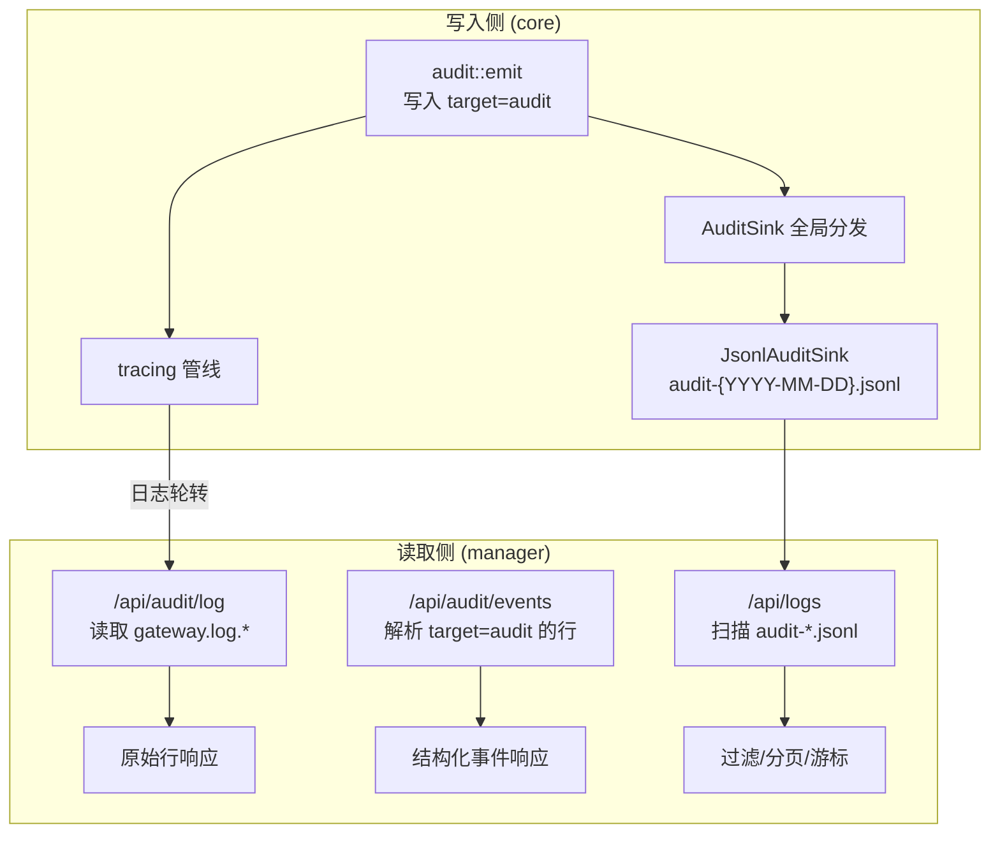
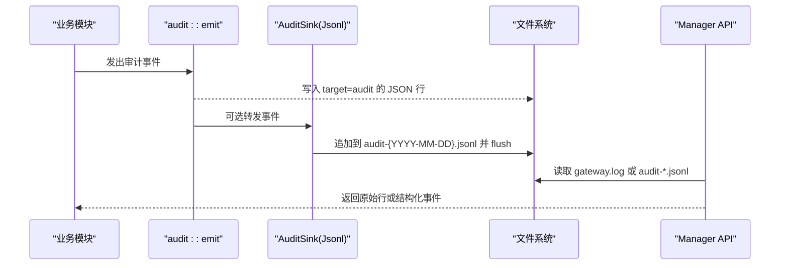
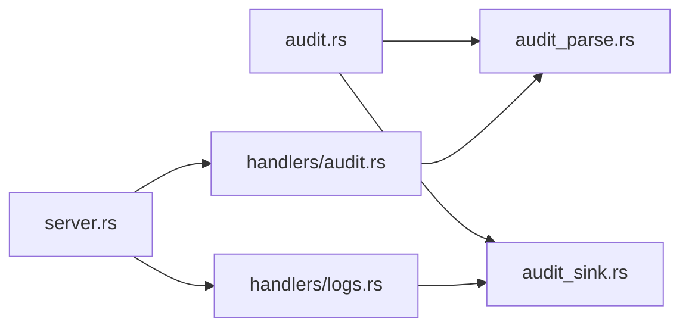

# 审计日志

<cite>
**本文引用的文件**
- [agent-diva-manager/src/handlers/audit.rs](file://agent-diva-manager/src/handlers/audit.rs)
- [agent-diva-manager/src/server.rs](file://agent-diva-manager/src/server.rs)
- [agent-diva-core/src/audit.rs](file://agent-diva-core/src/audit.rs)
- [agent-diva-core/src/audit_parse.rs](file://agent-diva-core/src/audit_parse.rs)
- [agent-diva-core/src/audit_sink.rs](file://agent-diva-core/src/audit_sink.rs)
- [agent-diva-manager/src/handlers/logs.rs](file://agent-diva-manager/src/handlers/logs.rs)
</cite>

## 目录
1. [简介](#简介)
2. [项目结构](#项目结构)
3. [核心组件](#核心组件)
4. [架构总览](#架构总览)
5. [详细组件分析](#详细组件分析)
6. [依赖关系分析](#依赖关系分析)
7. [性能考量](#性能考量)
8. [故障排查指南](#故障排查指南)
9. [结论](#结论)
10. [附录：API 参考与使用示例](#附录api-参考与使用示例)

## 简介
本文件面向“审计日志”能力，覆盖以下两个 API：
- GET /api/audit/log：按日期读取原始审计日志行（用于安全审计、合规性检查、问题定位）。
- GET /api/audit/events：按日期解析并返回结构化审计事件（便于分类统计、检索与告警）。

同时补充了另一个增强查询端点：
- GET /api/logs：对 audit-*.jsonl 进行类型过滤、时间范围筛选与游标分页。

文档将说明数据结构、查询过滤、时间范围、事件类型分类、持久化存储与归档策略，以及性能优化建议与排错方法。

## 项目结构
审计日志由“写入侧（core）+ 路由与读取侧（manager）”组成：
- core 层负责定义审计事件模型、统一输出到 tracing 目标 "audit"，并提供可插拔的 sink（默认 JSONL 每日滚动）。
- manager 层暴露 HTTP 接口，读取当日 gateway.log（/api/audit/*）或扫描 audit-*.jsonl（/api/logs），提供原始行与结构化事件两种视图。

图表来源
- [agent-diva-core/src/audit.rs:224-253](file://agent-diva-core/src/audit.rs#L224-L253)
- [agent-diva-core/src/audit_sink.rs:145-258](file://agent-diva-core/src/audit_sink.rs#L145-L258)
- [agent-diva-manager/src/handlers/audit.rs:86-185](file://agent-diva-manager/src/handlers/audit.rs#L86-L185)
- [agent-diva-manager/src/handlers/logs.rs:115-279](file://agent-diva-manager/src/handlers/logs.rs#L115-L279)

章节来源
- [agent-diva-manager/src/server.rs:371-376](file://agent-diva-manager/src/server.rs#L371-L376)

## 核心组件
- 审计事件模型：统一的事件枚举，包含工具调用、注入检测、PII 脱敏、令牌使用、会话结束、运行生命周期、技能加载/拒绝/隔离、渠道认证失败、定时任务执行、LLM 提供者调用等。
- 审计事件发射器：通过 tracing 以 target="audit" 输出结构化 JSON 行；可选转发到全局 sink。
- 审计事件解析器：兼容两种日志格式（tracing JSON 与直接 tagged enum），并处理未知事件的降级。
- 审计日志写入器：JSONL 每日滚动，自动按天切分文件，写入后 flush，保证同进程可读。
- 审计日志读取器：
  - /api/audit/log：读取 gateway.log 中 target="audit" 的原始行。
  - /api/audit/events：解析上述行成结构化事件。
  - /api/logs：扫描 audit-*.jsonl，支持 event_type 过滤、相对时间窗口、limit 限制与 cursor 分页。

章节来源
- [agent-diva-core/src/audit.rs:15-222](file://agent-diva-core/src/audit.rs#L15-L222)
- [agent-diva-core/src/audit_parse.rs:25-90](file://agent-diva-core/src/audit_parse.rs#L25-L90)
- [agent-diva-core/src/audit_sink.rs:145-258](file://agent-diva-core/src/audit_sink.rs#L145-L258)
- [agent-diva-manager/src/handlers/audit.rs:17-53](file://agent-diva-manager/src/handlers/audit.rs#L17-L53)
- [agent-diva-manager/src/handlers/logs.rs:19-47](file://agent-diva-manager/src/handlers/logs.rs#L19-L47)

## 架构总览
审计数据流从系统各模块经 emit 进入 tracing，再落地为日志文件；管理端通过 HTTP 暴露两类读取方式：
- 基于 gateway.log 的原始行与解析事件（适合快速查看当天审计上下文）。
- 基于 audit-*.jsonl 的结构化事件查询（适合跨日检索、过滤与分页）。

图表来源
- [agent-diva-core/src/audit.rs:224-253](file://agent-diva-core/src/audit.rs#L224-L253)
- [agent-diva-core/src/audit_sink.rs:196-258](file://agent-diva-core/src/audit_sink.rs#L196-L258)
- [agent-diva-manager/src/handlers/audit.rs:86-185](file://agent-diva-manager/src/handlers/audit.rs#L86-L185)
- [agent-diva-manager/src/handlers/logs.rs:115-279](file://agent-diva-manager/src/handlers/logs.rs#L115-L279)

## 详细组件分析

### 事件模型与分类
- 事件类型覆盖：心跳触发、工具调用/拒绝、决策点、注入检测、PII 脱敏、令牌使用、推理接收、会话结束、在线状态变更、运行生命周期（创建/认领/完成/失败/丢失/取消/重入队）、消息拦截、指令冲突、工具输出净化、技能生命周期（加载/拒绝/隔离/上传/删除/注入阻断）、渠道认证失败/消息拦截、安全策略决策、定时任务开始/完成/失败、提供者调用完成、工具执行完成、用量缺失回退等。
- 严重级别：安全类事件支持 Low/Medium/High/Critical；PII 检测支持 Warning/Error。

章节来源
- [agent-diva-core/src/audit.rs:15-222](file://agent-diva-core/src/audit.rs#L15-L222)

### 写入与持久化
- 写入路径：audit::emit 通过 tracing 以 target="audit" 输出 JSON 行；若注册了全局 sink，则额外转发给 sink。
- 默认 sink：JsonlAuditSink 将每个事件序列化为 JSONL 一行，追加到 {workspace}/.agent-diva/audit/audit-{YYYY-MM-DD}.jsonl，并在每次写入后 flush，确保同进程可读。
- 日志轮转：根据本地日期切换文件，跨天时先 flush 旧文件再打开新文件。

章节来源
- [agent-diva-core/src/audit_sink.rs:80-94](file://agent-diva-core/src/audit_sink.rs#L80-L94)
- [agent-diva-core/src/audit_sink.rs:145-258](file://agent-diva-core/src/audit_sink.rs#L145-L258)

### 读取与解析
- /api/audit/log：读取 gateway.log 或当日未轮转的 gateway.log，返回指定日期的原始行（默认最近 200 行）。
- /api/audit/events：在原始行的基础上过滤 target="audit"，并使用解析器转换为结构化事件 DTO。
- /api/logs：扫描 audit-*.jsonl，支持：
  - event_type：按 type 字段精确匹配过滤。
  - range：相对时间窗口（1h/6h/24h/7d），默认 24h。
  - limit：最大返回条数，默认 100，上限 1000。
  - cursor：基于 last_timestamp + skipped 的游标，实现稳定分页。

章节来源
- [agent-diva-manager/src/handlers/audit.rs:57-185](file://agent-diva-manager/src/handlers/audit.rs#L57-L185)
- [agent-diva-manager/src/handlers/logs.rs:68-96](file://agent-diva-manager/src/handlers/logs.rs#L68-L96)
- [agent-diva-manager/src/handlers/logs.rs:115-279](file://agent-diva-manager/src/handlers/logs.rs#L115-L279)

### 解析器兼容性
- 支持 tracing JSON 格式（fields.event/message）与直接 tagged enum 格式（type/data）。
- 未知事件降级为 event_type="unknown"，并将原始内容放入 data.raw，便于调试。
- 将 Rust 变体名（如 ToolInvoked）转换为 snake_case（tool_invoked），兼容 Debug 输出中的多余字段。

章节来源
- [agent-diva-core/src/audit_parse.rs:33-112](file://agent-diva-core/src/audit_parse.rs#L33-L112)

### 路由与端点
- /api/audit/log：GET，参数 date(YYYY-MM-DD)、max_lines（默认 200）。
- /api/audit/events：GET，参数 date(YYYY-MM-DD)、max_lines（默认 200）。
- /api/logs：GET，参数 event_type、range（1h/6h/24h/7d）、limit（1..1000）、cursor。

章节来源
- [agent-diva-manager/src/server.rs:371-376](file://agent-diva-manager/src/server.rs#L371-L376)
- [agent-diva-manager/src/handlers/audit.rs:131-185](file://agent-diva-manager/src/handlers/audit.rs#L131-L185)
- [agent-diva-manager/src/handlers/logs.rs:244-279](file://agent-diva-manager/src/handlers/logs.rs#L244-L279)

## 依赖关系分析
- 写入侧依赖 tracing 与 serde 序列化；sink 依赖文件系统与 chrono 时间。
- 读取侧依赖配置加载（日志目录）、文件系统 IO、serde_json 解析与 base64 游标编码。
- 路由层聚合多个 handler，并通过 AppState 传递审计根目录等上下文。

图表来源
- [agent-diva-core/src/audit.rs:224-253](file://agent-diva-core/src/audit.rs#L224-L253)
- [agent-diva-core/src/audit_parse.rs:33-112](file://agent-diva-core/src/audit_parse.rs#L33-L112)
- [agent-diva-core/src/audit_sink.rs:145-258](file://agent-diva-core/src/audit_sink.rs#L145-L258)
- [agent-diva-manager/src/handlers/audit.rs:86-185](file://agent-diva-manager/src/handlers/audit.rs#L86-L185)
- [agent-diva-manager/src/handlers/logs.rs:115-279](file://agent-diva-manager/src/handlers/logs.rs#L115-L279)
- [agent-diva-manager/src/server.rs:371-376](file://agent-diva-manager/src/server.rs#L371-L376)

## 性能考量
- 写入路径低开销：emit 设计目标 <1ms；sink 错误被吞掉，避免影响主流程。
- 文件写入缓冲与立即 flush：保证同进程可读，但高频写入时注意磁盘压力。
- 日志轮转：按天切分，避免单文件过大；跨天切换时先 flush 再打开新文件。
- 查询性能：
  - /api/audit/*：仅读取当日日志，限制行数，适合快速诊断。
  - /api/logs：扫描多文件并按文件名降序（最新优先），结合 cursor 分页，避免全量拉取；limit 上限 1000 防止过载。
- 建议：
  - 生产环境合理设置日志保留周期与归档策略（见附录）。
  - 对高吞吐场景，考虑异步落盘或批量写入（需评估一致性需求）。
  - 监控磁盘 I/O 与日志文件大小，必要时调整轮转策略。

[本节为通用指导，不直接分析具体文件]

## 故障排查指南
- 无法读取日志：
  - 确认日志目录与配置文件一致；/api/audit/log 会尝试 base 文件与带日期的文件。
  - 若日期无日志，返回错误信息提示找不到对应日期。
- 事件为空或解析失败：
  - 检查日志行是否包含 timestamp；解析器要求 timestamp 存在。
  - 非 JSON 或缺少必要字段会被忽略或降级为 unknown。
- 分页异常：
  - 使用 /api/logs 的 cursor 时，确保完整传递 next_cursor；非法 cursor 会返回错误。
  - 若事件时间戳缺失，提取逻辑会回退到当前时间，可能影响时间范围过滤。
- 写入失败：
  - sink 内部错误会被记录但不中断业务；检查磁盘空间与权限。
  - 跨天轮转失败时，仍会尝试继续写入后续事件。

章节来源
- [agent-diva-manager/src/handlers/audit.rs:86-114](file://agent-diva-manager/src/handlers/audit.rs#L86-L114)
- [agent-diva-core/src/audit_parse.rs:33-90](file://agent-diva-core/src/audit_parse.rs#L33-L90)
- [agent-diva-manager/src/handlers/logs.rs:89-96](file://agent-diva-manager/src/handlers/logs.rs#L89-L96)
- [agent-diva-core/src/audit_sink.rs:226-258](file://agent-diva-core/src/audit_sink.rs#L226-L258)

## 结论
该审计日志体系提供了统一的写入入口、稳定的持久化格式与灵活的读取接口。通过 /api/audit/* 可快速获取当日审计上下文，通过 /api/logs 可实现跨日检索、类型过滤与分页。结合事件类型分类与严重级别，可满足安全审计、合规检查与故障排查的需求。建议在生产环境中配合日志归档与监控策略，保障可观测性与性能。

[本节为总结，不直接分析具体文件]

## 附录：API 参考与使用示例

### 端点概览
- GET /api/audit/log
  - 作用：获取指定日期的原始审计日志行。
  - 参数：date(YYYY-MM-DD, 默认当天 UTC)、max_lines(默认 200)。
  - 响应：status、date、lines。
- GET /api/audit/events
  - 作用：获取指定日期的结构化审计事件。
  - 参数：date(YYYY-MM-DD, 默认当天 UTC)、max_lines(默认 200)。
  - 响应：status、date、events（event_type、data、timestamp）。
- GET /api/logs
  - 作用：扫描 audit-*.jsonl，支持类型过滤、时间范围、分页。
  - 参数：event_type（可选）、range（1h/6h/24h/7d，默认 24h）、limit（1..1000，默认 100）、cursor（可选）。
  - 响应：status、events、next_cursor（可选）。

章节来源
- [agent-diva-manager/src/handlers/audit.rs:131-185](file://agent-diva-manager/src/handlers/audit.rs#L131-L185)
- [agent-diva-manager/src/handlers/logs.rs:19-47](file://agent-diva-manager/src/handlers/logs.rs#L19-L47)
- [agent-diva-manager/src/handlers/logs.rs:244-279](file://agent-diva-manager/src/handlers/logs.rs#L244-L279)

### 数据结构
- 原始行：JSON 字符串，target="audit" 表示审计相关。
- 结构化事件 DTO：
  - event_type：snake_case 的事件类型。
  - data：事件载荷（未知事件时为 raw）。
  - timestamp：RFC3339 时间戳。

章节来源
- [agent-diva-manager/src/handlers/audit.rs:17-44](file://agent-diva-manager/src/handlers/audit.rs#L17-L44)
- [agent-diva-core/src/audit_parse.rs:25-31](file://agent-diva-core/src/audit_parse.rs#L25-L31)

### 查询过滤与时间范围
- /api/audit/*：按日期过滤，max_lines 控制返回行数。
- /api/logs：
  - event_type：精确匹配 type 字段。
  - range：相对时间窗口（1h/6h/24h/7d），计算 since = now - duration。
  - limit：限制返回数量，上限 1000。
  - cursor：基于 last_timestamp 与累计跳过数，实现稳定分页。

章节来源
- [agent-diva-manager/src/handlers/logs.rs:68-96](file://agent-diva-manager/src/handlers/logs.rs#L68-L96)
- [agent-diva-manager/src/handlers/logs.rs:115-279](file://agent-diva-manager/src/handlers/logs.rs#L115-L279)

### 事件类型分类
- 安全类：injection_detected、message_blocked、security_policy_decision、channel_auth_failed、channel_message_blocked。
- 工具与执行：tool_invoked、tool_denied、tool_executed、tool_output_sanitized。
- 资源与成本：token_used、provider_call_completed、usage_missing_fallback。
- 会话与交互：chat_over、presence_changed、reasoning_received。
- 运行编排：run_created/run_claimed/run_completed/run_failed/run_lost/run_cancelled/run_requeued。
- 技能生态：skill_loaded/skill_rejected/skill_quarantined/skill_uploaded/skill_deleted/skill_injection_blocked。
- 定时任务：cron_job_started/cron_job_completed/cron_job_failed。
- 其他：heartbeat_triggered、decision_point、instruction_conflict_detected。

章节来源
- [agent-diva-core/src/audit.rs:33-222](file://agent-diva-core/src/audit.rs#L33-L222)

### 使用示例（概念性）
- 安全审计：
  - 使用 /api/audit/events 获取当天事件，筛选 injection_detected、message_blocked、security_policy_decision，结合 severity 与 reason 进行风险评估。
- 合规性检查：
  - 使用 /api/logs 按 event_type 过滤 tool_invoked、tool_denied、tool_executed，结合 time range 与 limit 生成报表。
- 故障排查：
  - 使用 /api/audit/log 查看原始行，定位异常上下文；或使用 /api/audit/events 聚焦关键事件。
  - 使用 /api/logs 的 cursor 分页回溯历史事件，结合 range 缩小时间窗口。

[本节为概念性示例，不直接分析具体文件]

### 持久化存储与归档策略
- 存储位置：
  - gateway.log 与 gateway.log.{YYYY-MM-DD}：由 tracing_appender 每日轮转，供 /api/audit/* 读取。
  - audit-{YYYY-MM-DD}.jsonl：由 JsonlAuditSink 写入，供 /api/logs 扫描。
- 归档建议：
  - 按天压缩归档，保留策略依据合规要求设定（如 90 天/180 天）。
  - 对大流量场景，考虑冷热分层：近期日志热存于高性能磁盘，历史日志归档至对象存储。
  - 定期清理过期日志，释放磁盘空间。
- 监控与告警：
  - 监控日志文件大小与增长速率，磁盘使用率阈值告警。
  - 监控 /api/logs 的 malformed_lines 与 unknown_events 指标，及时发现格式漂移。

章节来源
- [agent-diva-manager/src/handlers/audit.rs:86-114](file://agent-diva-manager/src/handlers/audit.rs#L86-L114)
- [agent-diva-core/src/audit_sink.rs:145-258](file://agent-diva-core/src/audit_sink.rs#L145-L258)