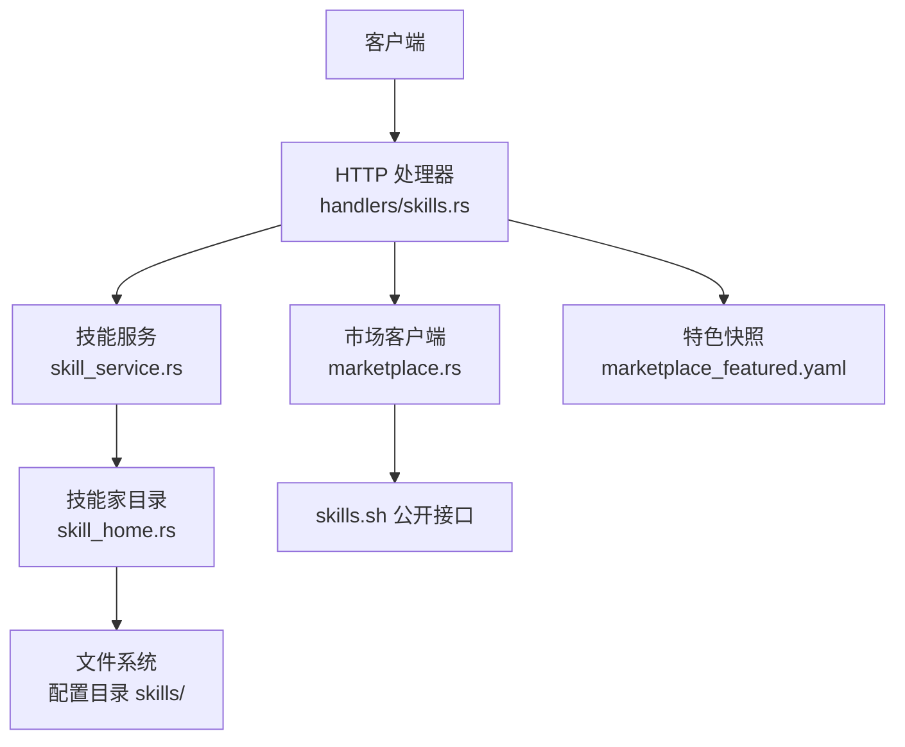
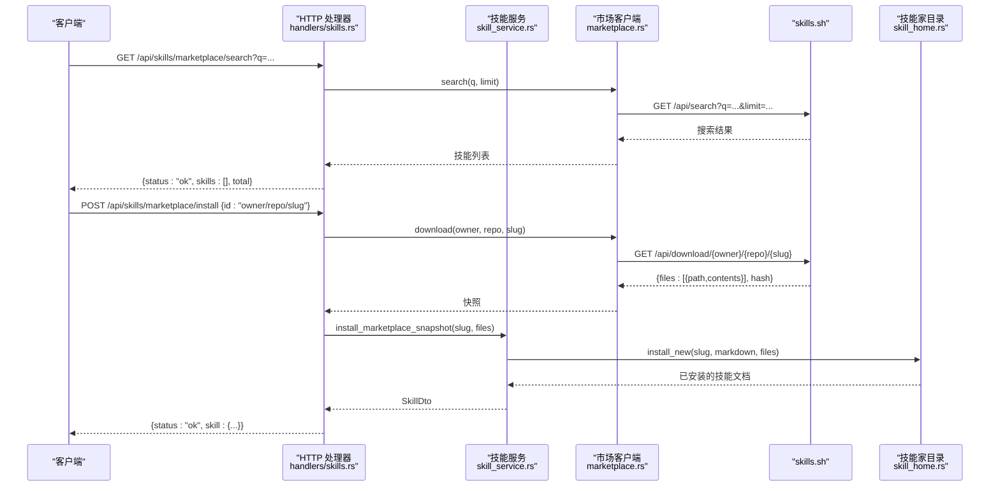
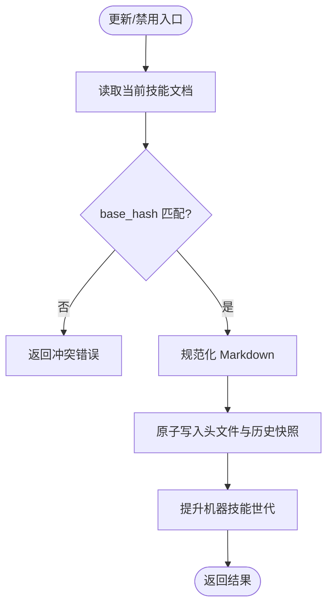
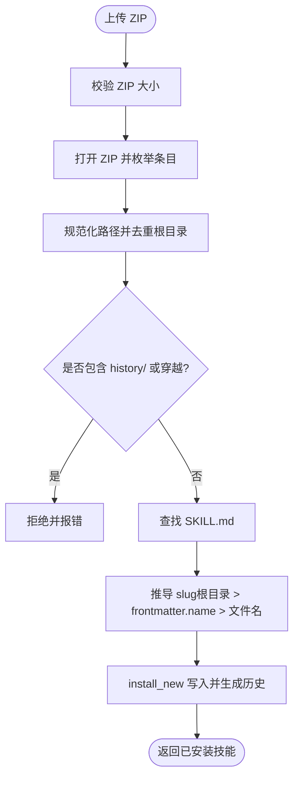
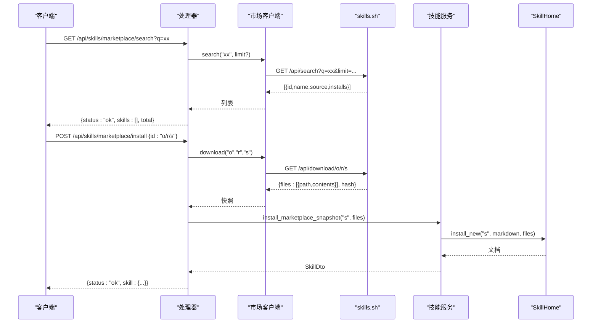
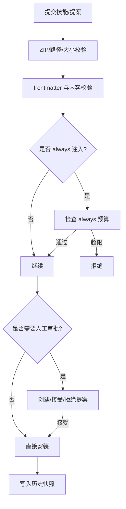
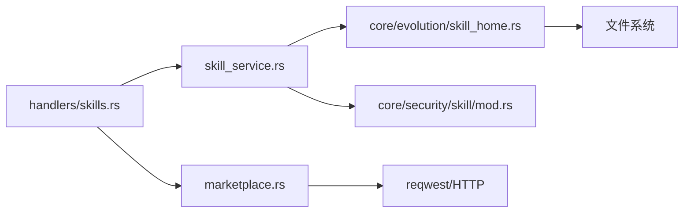

# 技能市场

<cite>
**本文引用的文件**
- [agent-diva-manager/src/handlers/skills.rs](file://agent-diva-manager/src/handlers/skills.rs)
- [agent-diva-manager/src/skill_service.rs](file://agent-diva-manager/src/skill_service.rs)
- [agent-diva-manager/src/marketplace.rs](file://agent-diva-manager/src/marketplace.rs)
- [agent-diva-core/src/evolution/skill_home.rs](file://agent-diva-core/src/evolution/skill_home.rs)
- [agent-diva-core/src/security/skill/mod.rs](file://agent-diva-core/src/security/skill/mod.rs)
- [agent-diva-manager/data/marketplace_featured.yaml](file://agent-diva-manager/data/marketplace_featured.yaml)
- [agent-diva-agent/src/skills.rs](file://agent-diva-agent/src/skills.rs)
- [agent-diva-tools/src/skill.rs](file://agent-diva-tools/src/skill.rs)
</cite>

## 目录
1. [简介](#简介)
2. [项目结构](#项目结构)
3. [核心组件](#核心组件)
4. [架构总览](#架构总览)
5. [详细组件分析](#详细组件分析)
6. [依赖关系分析](#依赖关系分析)
7. [性能考量](#性能考量)
8. [故障排查指南](#故障排查指南)
9. [结论](#结论)
10. [附录](#附录)

## 简介
本文件为 Agent-Diva 的“技能市场”API 提供完整、可操作的文档。内容覆盖：
- 技能管理（列表、详情、更新、删除、禁用）
- 技能上传（ZIP 包）
- 市场搜索与安装（对接 skills.sh）
- 特色技能展示（离线快照）
- 技能历史管理（版本与回滚）
- 技能包格式、版本控制、依赖管理与安全审查流程

该能力由 HTTP 处理器、服务层、技能家目录（SkillHome）、市场客户端与安全校验模块共同实现，确保在开放生态中安全地引入、治理和运行第三方技能。

## 项目结构
技能市场 API 位于 agent-diva-manager 模块，HTTP 路由与处理逻辑集中在 handlers/skills.rs；业务编排通过 skill_service.rs 调用 core 层的 skill_home.rs；市场访问通过 marketplace.rs 封装；安全约束与容量限制在 security/skill/mod.rs 中定义；特色榜单数据以 YAML 形式内嵌于 data/marketplace_featured.yaml。运行时读取与注入逻辑在 agent 与 tools 模块中体现。

图表来源
- [agent-diva-manager/src/handlers/skills.rs:44-193](file://agent-diva-manager/src/handlers/skills.rs#L44-L193)
- [agent-diva-manager/src/skill_service.rs:89-157](file://agent-diva-manager/src/skill_service.rs#L89-L157)
- [agent-diva-manager/src/marketplace.rs:101-186](file://agent-diva-manager/src/marketplace.rs#L101-L186)
- [agent-diva-core/src/evolution/skill_home.rs:245-438](file://agent-diva-core/src/evolution/skill_home.rs#L245-L438)
- [agent-diva-manager/data/marketplace_featured.yaml:1-10](file://agent-diva-manager/data/marketplace_featured.yaml#L1-L10)

章节来源
- [agent-diva-manager/src/handlers/skills.rs:44-193](file://agent-diva-manager/src/handlers/skills.rs#L44-L193)
- [agent-diva-manager/src/skill_service.rs:89-157](file://agent-diva-manager/src/skill_service.rs#L89-L157)
- [agent-diva-manager/src/marketplace.rs:101-186](file://agent-diva-manager/src/marketplace.rs#L101-L186)
- [agent-diva-core/src/evolution/skill_home.rs:245-438](file://agent-diva-core/src/evolution/skill_home.rs#L245-L438)
- [agent-diva-manager/data/marketplace_featured.yaml:1-10](file://agent-diva-manager/data/marketplace_featured.yaml#L1-L10)

## 核心组件
- HTTP 处理器（handlers/skills.rs）：暴露 /api/skills 系列端点，统一错误包装与状态码映射。
- 技能服务（skill_service.rs）：解析 ZIP 包、校验路径与大小、安装到 SkillHome、返回 DTO。
- 技能家目录（skill_home.rs）：技能的权威存储与生命周期管理（CRUD、历史、请求审批、原子写入）。
- 市场客户端（marketplace.rs）：封装 skills.sh 搜索与下载，支持环境变量覆盖基址。
- 安全校验（security/skill/mod.rs）：ZIP 大小上限、SKILL.md 最小长度、always 注入预算等。
- 特色榜单（marketplace_featured.yaml）：构建时嵌入的离线排行榜，避免运行时网络依赖。

章节来源
- [agent-diva-manager/src/handlers/skills.rs:44-193](file://agent-diva-manager/src/handlers/skills.rs#L44-L193)
- [agent-diva-manager/src/skill_service.rs:89-157](file://agent-diva-manager/src/skill_service.rs#L89-L157)
- [agent-diva-core/src/evolution/skill_home.rs:245-438](file://agent-diva-core/src/evolution/skill_home.rs#L245-L438)
- [agent-diva-manager/src/marketplace.rs:101-186](file://agent-diva-manager/src/marketplace.rs#L101-L186)
- [agent-diva-core/src/security/skill/mod.rs:25-35](file://agent-diva-core/src/security/skill/mod.rs#L25-L35)
- [agent-diva-manager/data/marketplace_featured.yaml:1-10](file://agent-diva-manager/data/marketplace_featured.yaml#L1-L10)

## 架构总览
下图展示了从客户端到存储的完整调用链，包括市场搜索、安装与本地持久化。

图表来源
- [agent-diva-manager/src/handlers/skills.rs:85-138](file://agent-diva-manager/src/handlers/skills.rs#L85-L138)
- [agent-diva-manager/src/marketplace.rs:130-186](file://agent-diva-manager/src/marketplace.rs#L130-L186)
- [agent-diva-manager/src/skill_service.rs:118-157](file://agent-diva-manager/src/skill_service.rs#L118-L157)
- [agent-diva-core/src/evolution/skill_home.rs:384-438](file://agent-diva-core/src/evolution/skill_home.rs#L384-L438)

## 详细组件分析

### API 端点总览
- 列表技能：GET /api/skills
- 上传技能：POST /api/skills/upload（multipart file=zip）
- 市场搜索：GET /api/skills/marketplace/search?q=...&limit=...
- 市场安装：POST /api/skills/marketplace/install {id:"owner/repo/slug"}
- 特色技能：GET /api/skills/marketplace/featured
- 技能详情：GET /api/skills/:slug
- 技能更新：PUT /api/skills/:slug {markdown, base_hash}
- 技能删除：DELETE /api/skills/:slug/delete {base_hash}
- 技能禁用：POST /api/skills/:slug/disable {base_hash}
- 技能历史：GET /api/skills/:slug/history
- 历史版本：GET /api/skills/:slug/history/:revision

说明：
- 所有写操作均要求传入 base_hash 进行 CAS 校验，防止并发覆盖。
- 市场搜索要求查询词至少 2 个字符。
- 上传 ZIP 必须包含根级 SKILL.md，且禁止 history/ 目录与路径穿越。

章节来源
- [agent-diva-manager/src/handlers/skills.rs:44-193](file://agent-diva-manager/src/handlers/skills.rs#L44-L193)

### 技能管理（CRUD）
- 列表：遍历内置与用户技能，返回摘要与元信息。
- 详情：按 slug 读取并解析 frontmatter，计算 content_hash。
- 更新：基于 base_hash 的 CAS 更新，失败则冲突。
- 删除：仅允许删除 Home 来源的技能，需 base_hash 校验。
- 禁用：将 enabled 置为 false，同样需要 base_hash 校验。
- 历史：列出每个版本的修订号、content_hash 与更新时间；可按 revision 获取具体文档。

图表来源
- [agent-diva-core/src/evolution/skill_home.rs:314-342](file://agent-diva-core/src/evolution/skill_home.rs#L314-L342)
- [agent-diva-core/src/evolution/skill_home.rs:344-382](file://agent-diva-core/src/evolution/skill_home.rs#L344-L382)
- [agent-diva-core/src/evolution/skill_home.rs:657-679](file://agent-diva-core/src/evolution/skill_home.rs#L657-L679)

章节来源
- [agent-diva-core/src/evolution/skill_home.rs:266-438](file://agent-diva-core/src/evolution/skill_home.rs#L266-L438)
- [agent-diva-core/src/evolution/skill_home.rs:440-494](file://agent-diva-core/src/evolution/skill_home.rs#L440-L494)
- [agent-diva-manager/src/handlers/skills.rs:140-193](file://agent-diva-manager/src/handlers/skills.rs#L140-L193)

### 技能上传（ZIP）
- 接收 multipart 表单中的 file 字段。
- 校验 ZIP 大小上限（默认 5MB）。
- 解压并校验路径：禁止 history/ 目录、禁止路径穿越。
- 必须存在根级 SKILL.md，否则拒绝。
- 自动推导 slug：优先使用归档根目录名，其次 frontmatter 的 name，最后文件名。
- 安装后生成历史快照，记录 content_hash。

图表来源
- [agent-diva-manager/src/skill_service.rs:98-116](file://agent-diva-manager/src/skill_service.rs#L98-L116)
- [agent-diva-manager/src/skill_service.rs:185-230](file://agent-diva-manager/src/skill_service.rs#L185-L230)
- [agent-diva-core/src/security/skill/mod.rs:25-29](file://agent-diva-core/src/security/skill/mod.rs#L25-L29)

章节来源
- [agent-diva-manager/src/handlers/skills.rs:51-70](file://agent-diva-manager/src/handlers/skills.rs#L51-L70)
- [agent-diva-manager/src/skill_service.rs:185-230](file://agent-diva-manager/src/skill_service.rs#L185-L230)
- [agent-diva-core/src/security/skill/mod.rs:25-29](file://agent-diva-core/src/security/skill/mod.rs#L25-L29)

### 市场搜索与安装
- 搜索：GET /api/skills/marketplace/search?q=...&limit=...
  - q 至少 2 字符，limit 默认 20，最大 50。
  - 调用 skills.sh /api/search，返回 id、name、source、installs。
- 安装：POST /api/skills/marketplace/install {id:"owner/repo/slug"}
  - 解析 id 为 owner/repo/slug。
  - 调用 skills.sh /api/download/{owner}/{repo}/{slug} 获取文件快照。
  - 校验并安装到本地 SkillHome，要求包含 SKILL.md，禁止 history/ 与穿越。

图表来源
- [agent-diva-manager/src/handlers/skills.rs:85-138](file://agent-diva-manager/src/handlers/skills.rs#L85-L138)
- [agent-diva-manager/src/marketplace.rs:130-186](file://agent-diva-manager/src/marketplace.rs#L130-L186)
- [agent-diva-manager/src/skill_service.rs:118-157](file://agent-diva-manager/src/skill_service.rs#L118-L157)

章节来源
- [agent-diva-manager/src/handlers/skills.rs:85-138](file://agent-diva-manager/src/handlers/skills.rs#L85-L138)
- [agent-diva-manager/src/marketplace.rs:130-186](file://agent-diva-manager/src/marketplace.rs#L130-L186)
- [agent-diva-manager/src/skill_service.rs:118-157](file://agent-diva-manager/src/skill_service.rs#L118-L157)

### 特色技能展示
- GET /api/skills/marketplace/featured
- 返回内嵌的 featured YAML 快照，包含 generated_at、source、metric 与 skills 列表。
- 无需运行时网络访问，适合离线环境或快速展示。

章节来源
- [agent-diva-manager/src/handlers/skills.rs:106-117](file://agent-diva-manager/src/handlers/skills.rs#L106-L117)
- [agent-diva-manager/src/marketplace.rs:35-60](file://agent-diva-manager/src/marketplace.rs#L35-L60)
- [agent-diva-manager/data/marketplace_featured.yaml:1-10](file://agent-diva-manager/data/marketplace_featured.yaml#L1-L10)

### 技能历史管理
- 列表历史：GET /api/skills/:slug/history
  - 返回按 revision 排序的历史条目（revision、content_hash、updated_at）。
- 查看版本：GET /api/skills/:slug/history/:revision
  - 返回指定修订的完整文档。

章节来源
- [agent-diva-core/src/evolution/skill_home.rs:440-494](file://agent-diva-core/src/evolution/skill_home.rs#L440-L494)
- [agent-diva-manager/src/handlers/skills.rs:184-204](file://agent-diva-manager/src/handlers/skills.rs#L184-L204)

### 技能包格式与依赖管理
- 包格式：ZIP 归档，必须包含根级 SKILL.md。
- SKILL.md 结构：YAML frontmatter + Markdown 正文。
  - 必需字段：description（非空字符串）。
  - 可选字段：enabled（默认 true）、always（默认 false）。
  - 其他元信息如 name、homepage 等可用于工具与 UI。
- 依赖管理：
  - 技能包可附带任意附加文件（除 history/ 外），安装时原样落盘。
  - 系统不解析外部依赖声明，依赖通过文件组织约定与管理员审核保障。
  - always 注入受上下文预算限制（最多 3 个技能、总计不超过 8000 字符）。

章节来源
- [agent-diva-core/src/evolution/skill_home.rs:801-825](file://agent-diva-core/src/evolution/skill_home.rs#L801-L825)
- [agent-diva-core/src/security/skill/mod.rs:31-35](file://agent-diva-core/src/security/skill/mod.rs#L31-L35)
- [agent-diva-agent/src/skills.rs:122-165](file://agent-diva-agent/src/skills.rs#L122-L165)
- [agent-diva-tools/src/skill.rs:52-89](file://agent-diva-tools/src/skill.rs#L52-L89)

### 版本控制与一致性
- 每次写入都会生成新的历史快照，revision 自增。
- 更新/禁用/删除均需传入 base_hash 进行 CAS 校验，避免竞态覆盖。
- 写入采用原子方式，失败会清理中间产物，保证一致性。
- 变更后会提升机器技能世代，使缓存失效并重新加载。

章节来源
- [agent-diva-core/src/evolution/skill_home.rs:314-342](file://agent-diva-core/src/evolution/skill_home.rs#L314-L342)
- [agent-diva-core/src/evolution/skill_home.rs:366-382](file://agent-diva-core/src/evolution/skill_home.rs#L366-L382)
- [agent-diva-core/src/evolution/skill_home.rs:657-679](file://agent-diva-core/src/evolution/skill_home.rs#L657-L679)

### 安全审查流程
- 输入校验：
  - ZIP 大小上限（默认 5MB）。
  - SKILL.md 最小长度（默认 100 字符）。
  - 路径安全：禁止 history/ 目录、禁止路径穿越。
  - slug 合法性：小写字母数字与连字符，保留字检查。
- 内容安全：
  - 拒绝包含疑似敏感内容的技能。
  - always 注入受上下文预算限制。
- 信任模型：
  - 可信来源（Trusted）可自动注入；Review/Untrusted 需人工批准。
- 审批流：
  - 支持创建/接受/拒绝技能提案，接受后写入并标记为已接受。

图表来源
- [agent-diva-core/src/security/skill/mod.rs:25-35](file://agent-diva-core/src/security/skill/mod.rs#L25-L35)
- [agent-diva-core/src/security/skill/mod.rs:84-146](file://agent-diva-core/src/security/skill/mod.rs#L84-L146)
- [agent-diva-core/src/evolution/skill_home.rs:496-588](file://agent-diva-core/src/evolution/skill_home.rs#L496-L588)

章节来源
- [agent-diva-core/src/security/skill/mod.rs:25-35](file://agent-diva-core/src/security/skill/mod.rs#L25-L35)
- [agent-diva-core/src/security/skill/mod.rs:84-146](file://agent-diva-core/src/security/skill/mod.rs#L84-L146)
- [agent-diva-core/src/evolution/skill_home.rs:496-588](file://agent-diva-core/src/evolution/skill_home.rs#L496-L588)

## 依赖关系分析
- HTTP 处理器依赖：
  - skill_service：ZIP 解析与安装。
  - marketplace：搜索与下载。
  - state：SkillHome 引用。
- skill_service 依赖：
  - core evolution SkillHome：权威存储与生命周期。
  - core security：ZIP 大小与内容校验。
- marketplace 依赖：
  - reqwest：HTTP 客户端。
  - 环境变量 AGENT_DIVA_SKILLS_MARKETPLACE_URL 可覆盖基址。
- skill_home 依赖：
  - 文件系统：原子写入、历史快照、请求存储。
  - 序列化：YAML/JSON。
  - 哈希：SHA256 用于 content_hash。

图表来源
- [agent-diva-manager/src/handlers/skills.rs:1-16](file://agent-diva-manager/src/handlers/skills.rs#L1-L16)
- [agent-diva-manager/src/skill_service.rs:1-17](file://agent-diva-manager/src/skill_service.rs#L1-L17)
- [agent-diva-manager/src/marketplace.rs:1-20](file://agent-diva-manager/src/marketplace.rs#L1-L20)
- [agent-diva-core/src/evolution/skill_home.rs:1-22](file://agent-diva-core/src/evolution/skill_home.rs#L1-L22)

章节来源
- [agent-diva-manager/src/handlers/skills.rs:1-16](file://agent-diva-manager/src/handlers/skills.rs#L1-L16)
- [agent-diva-manager/src/skill_service.rs:1-17](file://agent-diva-manager/src/skill_service.rs#L1-L17)
- [agent-diva-manager/src/marketplace.rs:1-20](file://agent-diva-manager/src/marketplace.rs#L1-L20)
- [agent-diva-core/src/evolution/skill_home.rs:1-22](file://agent-diva-core/src/evolution/skill_home.rs#L1-L22)

## 性能考量
- 市场搜索限流：limit 默认 20，最大 50，避免上游压力。
- 网络超时：连接与请求均有超时设置，避免阻塞。
- 离线特色榜单：无需网络即可返回，降低延迟。
- 原子写入与锁：并发写保护，减少竞争与损坏风险。
- 历史快照增量：仅当内容变化时才写入新版本，减少 I/O。

[本节为通用指导，不直接分析具体文件]

## 故障排查指南
常见错误与定位：
- 上传失败：
  - ZIP 过大：超过 5MB 将被拒绝。
  - 缺少 SKILL.md：必须包含根级 SKILL.md。
  - 路径非法：包含 history/ 或路径穿越会被拒绝。
- 更新/禁用/删除失败：
  - base_hash 不匹配：并发修改导致冲突，请重试并获取最新 base_hash。
- 市场搜索/安装失败：
  - 上游错误：返回 BAD_GATEWAY，检查网络与 upstream 状态。
  - 查询过短：q 至少 2 字符。
- 历史为空：
  - 首次安装无历史，后续更新才会产生。

建议步骤：
- 确认请求参数与 base_hash。
- 检查 ZIP 结构与大小。
- 查看市场客户端日志与上游响应。
- 验证 slug 是否符合规范。

章节来源
- [agent-diva-manager/src/handlers/skills.rs:269-331](file://agent-diva-manager/src/handlers/skills.rs#L269-L331)
- [agent-diva-manager/src/skill_service.rs:185-230](file://agent-diva-manager/src/skill_service.rs#L185-L230)
- [agent-diva-manager/src/marketplace.rs:212-230](file://agent-diva-manager/src/marketplace.rs#L212-L230)

## 结论
技能市场 API 提供了完整的技能发现、安装、治理与演进能力。通过严格的输入校验、CAS 一致性、历史快照与审批流程，系统在开放生态中实现了安全可控的技能引入与运行。特色榜单与离线数据进一步提升了可用性与稳定性。

[本节为总结性内容，不直接分析具体文件]

## 附录

### API 参考速查
- GET /api/skills
  - 返回：{status:"ok", skills:[...]}
- POST /api/skills/upload
  - 表单字段：file（.zip）
  - 返回：{status:"ok", skill:{...}}
- GET /api/skills/marketplace/search?q=...&limit=...
  - 返回：{status:"ok", skills:[...], total:...}
- POST /api/skills/marketplace/install
  - 请求体：{id:"owner/repo/slug"}
  - 返回：{status:"ok", skill:{...}}
- GET /api/skills/marketplace/featured
  - 返回：{status:"ok", skills:[...], total:... , generated_at, source, metric}
- GET /api/skills/:slug
  - 返回：{status:"ok", skill:{...}}
- PUT /api/skills/:slug
  - 请求体：{markdown, base_hash}
  - 返回：{status:"ok", outcome:{...}}
- DELETE /api/skills/:slug/delete
  - 请求体：{base_hash}
  - 返回：{status:"ok"}
- POST /api/skills/:slug/disable
  - 请求体：{base_hash}
  - 返回：{status:"ok", outcome:{...}}
- GET /api/skills/:slug/history
  - 返回：{status:"ok", history:[...]}
- GET /api/skills/:slug/history/:revision
  - 返回：{status:"ok", document:{...}}

章节来源
- [agent-diva-manager/src/handlers/skills.rs:44-193](file://agent-diva-manager/src/handlers/skills.rs#L44-L193)

### 关键常量与限制
- ZIP 大小上限：5 MB
- SKILL.md 最小长度：100 字符
- always 注入上限：最多 3 个技能，总计不超过 8000 字符
- 市场搜索 limit：默认 20，最大 50

章节来源
- [agent-diva-core/src/security/skill/mod.rs:25-35](file://agent-diva-core/src/security/skill/mod.rs#L25-L35)
- [agent-diva-manager/src/marketplace.rs:17-19](file://agent-diva-manager/src/marketplace.rs#L17-L19)