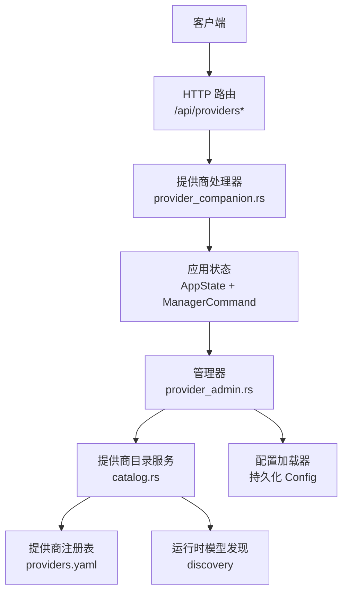
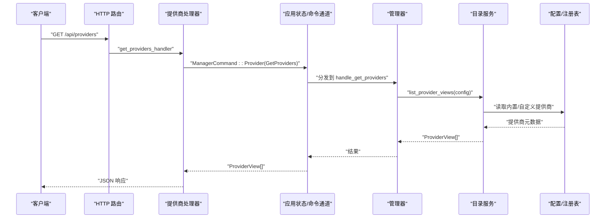
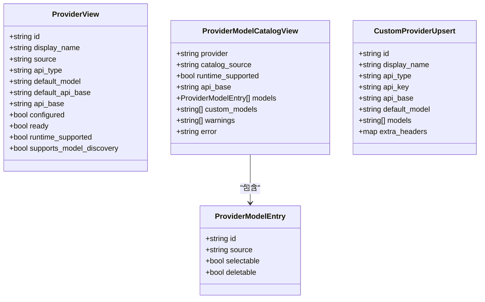
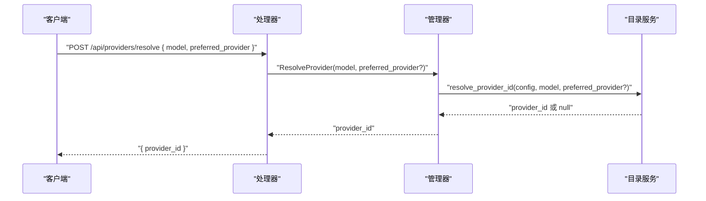
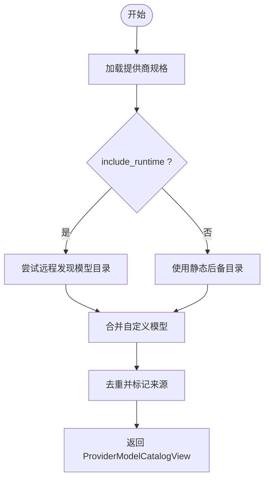
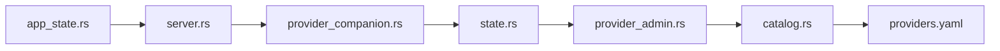

# 提供商管理

<cite>
**本文引用的文件**
- [server.rs](file://agent-diva-manager/src/server.rs)
- [provider_companion.rs](file://agent-diva-manager/src/handlers/provider_companion.rs)
- [state.rs](file://agent-diva-manager/src/state.rs)
- [provider_admin.rs](file://agent-diva-manager/src/manager/provider_admin.rs)
- [catalog.rs](file://agent-diva-providers/src/catalog.rs)
- [lib.rs](file://agent-diva-providers/src/lib.rs)
- [providers.yaml](file://agent-diva-providers/src/providers.yaml)
- [app_state.rs](file://agent-diva-gui/src-tauri/src/app_state.rs)
</cite>

## 目录
1. [简介](#简介)
2. [项目结构](#项目结构)
3. [核心组件](#核心组件)
4. [架构总览](#架构总览)
5. [详细组件分析](#详细组件分析)
6. [依赖关系分析](#依赖关系分析)
7. [性能与可靠性](#性能与可靠性)
8. [故障排查指南](#故障排查指南)
9. [结论](#结论)
10. [附录：API 参考与配置示例](#附录api-参考与配置示例)

## 简介
本文件面向“提供商管理”能力，覆盖以下 API 与机制：
- 提供商列表查询：GET /api/providers
- 创建自定义提供商：POST /api/providers
- 获取单个提供商详情：GET /api/providers/:name
- 更新自定义提供商：PUT /api/providers/:name
- 删除自定义提供商：DELETE /api/providers/:name
- 模型解析（按模型名或前缀推断提供商）：POST /api/providers/resolve
- 模型发现与管理：GET/POST /api/providers/:name/models，DELETE /api/providers/:name/models/:model_id

同时说明 LLM 提供商的配置格式、认证方式、模型发现与切换机制，并提供多提供商配置与故障转移的完整示例。

## 项目结构
提供商管理在 Manager 层以 HTTP 路由暴露，通过命令通道将请求转发到内部 Provider 管理逻辑；Provider Catalog Service 负责统一视图、模型目录合并、运行时发现与持久化保存。

图表来源
- [server.rs:315-336](file://agent-diva-manager/src/server.rs#L315-L336)
- [provider_companion.rs:10-253](file://agent-diva-manager/src/handlers/provider_companion.rs#L10-L253)
- [state.rs:288-417](file://agent-diva-manager/src/state.rs#L288-L417)
- [provider_admin.rs:9-190](file://agent-diva-manager/src/manager/provider_admin.rs#L9-L190)
- [catalog.rs:71-436](file://agent-diva-providers/src/catalog.rs#L71-L436)
- [providers.yaml:1-800](file://agent-diva-providers/src/providers.yaml#L1-L800)

章节来源
- [server.rs:315-336](file://agent-diva-manager/src/server.rs#L315-L336)
- [provider_companion.rs:10-253](file://agent-diva-manager/src/handlers/provider_companion.rs#L10-L253)
- [state.rs:288-417](file://agent-diva-manager/src/state.rs#L288-L417)
- [provider_admin.rs:9-190](file://agent-diva-manager/src/manager/provider_admin.rs#L9-L190)
- [catalog.rs:71-436](file://agent-diva-providers/src/catalog.rs#L71-L436)
- [providers.yaml:1-800](file://agent-diva-providers/src/providers.yaml#L1-L800)

## 核心组件
- HTTP 路由层：定义 /api/providers* 路由集合，挂载各处理器。
- 处理器层：接收请求，构造 ProviderCommand，通过 oneshot 通道等待结果并返回 JSON。
- 管理器层：读取/写入配置，调用 ProviderCatalogService 完成具体业务。
- 目录服务层：提供统一视图、模型目录合并、运行时发现、默认模型选择、提供商解析等。
- 配置与注册表：内置提供商元数据来自 providers.yaml；自定义提供商保存在配置中。

章节来源
- [server.rs:315-336](file://agent-diva-manager/src/server.rs#L315-L336)
- [provider_companion.rs:10-253](file://agent-diva-manager/src/handlers/provider_companion.rs#L10-L253)
- [provider_admin.rs:9-190](file://agent-diva-manager/src/manager/provider_admin.rs#L9-L190)
- [catalog.rs:71-436](file://agent-diva-providers/src/catalog.rs#L71-L436)
- [providers.yaml:1-800](file://agent-diva-providers/src/providers.yaml#L1-L800)

## 架构总览
提供商管理的端到端流程如下：

图表来源
- [server.rs:315-336](file://agent-diva-manager/src/server.rs#L315-L336)
- [provider_companion.rs:10-27](file://agent-diva-manager/src/handlers/provider_companion.rs#L10-L27)
- [state.rs:288-317](file://agent-diva-manager/src/state.rs#L288-L317)
- [provider_admin.rs:9-13](file://agent-diva-manager/src/manager/provider_admin.rs#L9-L13)
- [catalog.rs:82-99](file://agent-diva-providers/src/catalog.rs#L82-L99)

## 详细组件分析

### HTTP 路由与处理器
- 路由定义：/api/providers、/api/providers/resolve、/api/providers/:name、/api/providers/:name/models、/api/providers/:name/models/:model_id。
- 处理器职责：
  - 列表：发送 GetProviders 命令，返回 ProviderView[]。
  - 详情：发送 GetProvider(name)，返回 ProviderView 或错误。
  - 模型：发送 GetProviderModels(name, runtime?)，返回 ProviderModelCatalogView。
  - 模型增删：Add/DeleteProviderModel。
  - 创建/更新/删除：Create/Update/DeleteProvider。
  - 解析：ResolveProvider(model, preferred_provider?)。

章节来源
- [server.rs:315-336](file://agent-diva-manager/src/server.rs#L315-L336)
- [provider_companion.rs:10-253](file://agent-diva-manager/src/handlers/provider_companion.rs#L10-L253)

### 管理器与配置持久化
- 管理器处理函数：
  - 列表/详情：加载配置，调用目录服务生成视图。
  - 模型列表：支持 include_runtime 开关，失败时返回带 error 的降级视图。
  - 模型增删：修改配置中的 custom_models 或 models，必要时回退默认模型。
  - 提供商增删改：校验并保存 CustomProviderUpsert，成功后返回最新 ProviderView。
  - 删除提供商后，若被删除的是当前默认提供商，则自动切换到下一个可用提供商及其默认模型。

章节来源
- [provider_admin.rs:9-190](file://agent-diva-manager/src/manager/provider_admin.rs#L9-L190)
- [state.rs:288-417](file://agent-diva-manager/src/state.rs#L288-L417)

### 目录服务与模型发现
- 统一视图：
  - 内置提供商：从注册表构建，结合固定槽位与 shadow 配置计算 configured/ready/api_base。
  - 自定义提供商：仅当 api_type=openai 且提供 api_base 时才支持运行时模型发现。
- 模型目录：
  - include_runtime=true：尝试远程发现模型目录；否则使用静态 fallback。
  - 合并策略：去重、标记来源（runtime/static/custom）、可选项 selectable/deletable。
- 提供商解析：
  - 优先级：显式 preferred_provider > agents.defaults.provider > 模型名前缀匹配 > 注册表反查。
- 访问信息：
  - 从固定槽位或自定义提供商提取 api_key、api_base、extra_headers，用于运行时发现。

章节来源
- [catalog.rs:71-436](file://agent-diva-providers/src/catalog.rs#L71-L436)
- [catalog.rs:444-559](file://agent-diva-providers/src/catalog.rs#L444-L559)
- [lib.rs:21-41](file://agent-diva-providers/src/lib.rs#L21-L41)

### 类图：关键数据结构

图表来源
- [catalog.rs:24-69](file://agent-diva-providers/src/catalog.rs#L24-L69)
- [catalog.rs:39-57](file://agent-diva-providers/src/catalog.rs#L39-L57)

### 序列图：模型解析

图表来源
- [provider_companion.rs:231-253](file://agent-diva-manager/src/handlers/provider_companion.rs#L231-L253)
- [provider_admin.rs:49-62](file://agent-diva-manager/src/manager/provider_admin.rs#L49-L62)
- [catalog.rs:111-145](file://agent-diva-providers/src/catalog.rs#L111-L145)

### 流程图：模型目录合并

图表来源
- [catalog.rs:161-193](file://agent-diva-providers/src/catalog.rs#L161-L193)
- [catalog.rs:389-436](file://agent-diva-providers/src/catalog.rs#L389-L436)

## 依赖关系分析
- 路由依赖处理器，处理器依赖状态与命令通道，管理器依赖目录服务与配置加载器。
- 目录服务依赖注册表（providers.yaml）与运行时发现模块。
- GUI/Tauri 通过 HTTP 调用 Manager 提供的 /api/providers* 接口，封装为本地命令。

图表来源
- [server.rs:315-336](file://agent-diva-manager/src/server.rs#L315-L336)
- [provider_companion.rs:10-253](file://agent-diva-manager/src/handlers/provider_companion.rs#L10-L253)
- [state.rs:288-417](file://agent-diva-manager/src/state.rs#L288-L417)
- [provider_admin.rs:9-190](file://agent-diva-manager/src/manager/provider_admin.rs#L9-L190)
- [catalog.rs:71-436](file://agent-diva-providers/src/catalog.rs#L71-L436)
- [providers.yaml:1-800](file://agent-diva-providers/src/providers.yaml#L1-L800)
- [app_state.rs:159-200](file://agent-diva-gui/src-tauri/src/app_state.rs#L159-L200)

章节来源
- [server.rs:315-336](file://agent-diva-manager/src/server.rs#L315-L336)
- [provider_companion.rs:10-253](file://agent-diva-manager/src/handlers/provider_companion.rs#L10-L253)
- [state.rs:288-417](file://agent-diva-manager/src/state.rs#L288-L417)
- [provider_admin.rs:9-190](file://agent-diva-manager/src/manager/provider_admin.rs#L9-L190)
- [catalog.rs:71-436](file://agent-diva-providers/src/catalog.rs#L71-L436)
- [providers.yaml:1-800](file://agent-diva-providers/src/providers.yaml#L1-L800)
- [app_state.rs:159-200](file://agent-diva-gui/src-tauri/src/app_state.rs#L159-L200)

## 性能与可靠性
- 模型发现：
  - include_runtime=true 时会发起远程发现，可能受网络影响；GUI 侧可通过参数控制是否启用。
  - 失败时返回带有 error 字段的降级视图，保证前端可用性。
- 并发与阻塞：
  - 处理器通过 oneshot 通道等待异步结果，避免长时间阻塞请求线程。
- 配置变更：
  - 增删模型/提供商会立即写盘，后续请求生效；删除默认提供商时自动回退到下一个可用提供商及默认模型，降低中断风险。
- 缓存与去重：
  - 模型目录合并阶段进行去重，减少冗余与 UI 抖动。

[本节为通用指导，不直接分析具体文件]

## 故障排查指南
- 常见错误与定位：
  - 未知提供商：查看 get_provider_handler 的错误分支，确认 name 是否存在于内置或自定义提供商。
  - 模型发现失败：检查 ProviderModelCatalogView 的 error 字段与 catalog_source；确认 api_base 与 api_key 是否正确。
  - 自定义提供商类型限制：当前仅支持 api_type=openai；其他类型会被拒绝。
  - 默认模型回退：删除模型或提供商后，若当前默认失效，系统会自动选择下一个可用模型或提供商。
- 建议步骤：
  - 先调用 GET /api/providers 确认提供商存在与 ready 状态。
  - 再调用 GET /api/providers/:name/models?runtime=false 验证静态目录。
  - 如需动态发现，设置 runtime=true 并检查网络与凭据。
  - 使用 POST /api/providers/resolve 验证模型到提供商的解析是否符合预期。

章节来源
- [provider_companion.rs:50-75](file://agent-diva-manager/src/handlers/provider_companion.rs#L50-L75)
- [provider_companion.rs:77-115](file://agent-diva-manager/src/handlers/provider_companion.rs#L77-L115)
- [provider_admin.rs:90-128](file://agent-diva-manager/src/manager/provider_admin.rs#L90-L128)
- [catalog.rs:239-276](file://agent-diva-providers/src/catalog.rs#L239-L276)

## 结论
提供商管理通过清晰的 HTTP 路由、处理器、管理器与目录服务分层，提供了统一的提供商视图、灵活的模型发现与安全的配置持久化。模型解析遵循明确的优先级规则，支持多提供商与故障转移。对于 OpenAI 兼容的自定义提供商，可在运行时动态发现模型，提升扩展性与可维护性。

[本节为总结，不直接分析具体文件]

## 附录：API 参考与配置示例

### API 参考
- 列表提供商
  - 方法：GET
  - 路径：/api/providers
  - 响应：ProviderView[]
- 创建自定义提供商
  - 方法：POST
  - 路径：/api/providers
  - 请求体：CustomProviderUpsert
  - 响应：{ status, provider }
- 获取提供商详情
  - 方法：GET
  - 路径：/api/providers/:name
  - 响应：ProviderView 或错误对象
- 更新自定义提供商
  - 方法：PUT
  - 路径：/api/providers/:name
  - 请求体：CustomProviderUpsert
  - 响应：{ status, provider }
- 删除自定义提供商
  - 方法：DELETE
  - 路径：/api/providers/:name
  - 响应：{ status }
- 模型解析
  - 方法：POST
  - 路径：/api/providers/resolve
  - 请求体：{ model, preferred_provider? }
  - 响应：{ provider_id }
- 模型管理
  - 列出模型：GET /api/providers/:name/models?runtime={true|false}
  - 添加模型：POST /api/providers/:name/models { model }
  - 删除模型：DELETE /api/providers/:name/models/:model_id

章节来源
- [server.rs:315-336](file://agent-diva-manager/src/server.rs#L315-L336)
- [provider_companion.rs:10-253](file://agent-diva-manager/src/handlers/provider_companion.rs#L10-L253)

### LLM 提供商配置格式
- 内置提供商元数据来源于 providers.yaml，包含 name、api_type、env_key、display_name、default_model、default_api_base、models、model_overrides 等。
- 自定义提供商通过 CustomProviderUpsert 提交，要求：
  - id：唯一标识
  - display_name：显示名称
  - api_type：当前仅支持 openai
  - api_key：可选，用于认证
  - api_base：OpenAI 兼容地址，必需用于运行时发现
  - default_model：可选默认模型
  - models：可选模型列表
  - extra_headers：可选额外请求头

章节来源
- [providers.yaml:1-800](file://agent-diva-providers/src/providers.yaml#L1-L800)
- [catalog.rs:239-276](file://agent-diva-providers/src/catalog.rs#L239-L276)

### 认证方式
- 内置提供商：通过环境变量（如 OPENAI_API_KEY、ANTHROPIC_API_KEY 等）注入密钥。
- 自定义提供商：通过 api_key 与 api_base 组合进行认证；支持 extra_headers 扩展。

章节来源
- [providers.yaml:1-800](file://agent-diva-providers/src/providers.yaml#L1-L800)
- [catalog.rs:490-509](file://agent-diva-providers/src/catalog.rs#L490-L509)

### 模型发现与切换机制
- 模型发现：
  - 对 OpenAI 兼容提供商，当 include_runtime=true 且提供 api_base 时，尝试远程发现模型目录。
  - 失败时退回静态后备目录，并在响应中标注 catalog_source。
- 模型切换：
  - 解析优先级：preferred_provider > agents.defaults.provider > 模型名前缀 > 注册表反查。
  - 删除默认模型或提供商时，自动选择下一个可用项作为默认。

章节来源
- [catalog.rs:111-145](file://agent-diva-providers/src/catalog.rs#L111-L145)
- [catalog.rs:161-193](file://agent-diva-providers/src/catalog.rs#L161-L193)
- [provider_admin.rs:90-128](file://agent-diva-manager/src/manager/provider_admin.rs#L90-L128)

### 多提供商配置与故障转移示例
- 场景：主用 OpenAI 兼容网关，备用 Anthropic；当主用不可用时自动切换到备用。
- 步骤：
  - 配置主用提供商（openai 或自定义 openai 兼容），设置 api_base 与 api_key。
  - 配置备用提供商（anthropic），设置 api_key。
  - 在 agents.defaults 中设置 provider 为主用提供商。
  - 当主用提供商模型发现失败或调用失败时，上层逻辑可基于 resolve 结果或错误码切换到备用提供商。
  - 若删除主用提供商，系统将自动把默认提供商切换到下一个可用提供商及其默认模型。

章节来源
- [catalog.rs:111-145](file://agent-diva-providers/src/catalog.rs#L111-L145)
- [provider_admin.rs:148-176](file://agent-diva-manager/src/manager/provider_admin.rs#L148-L176)
- [providers.yaml:1-800](file://agent-diva-providers/src/providers.yaml#L1-L800)