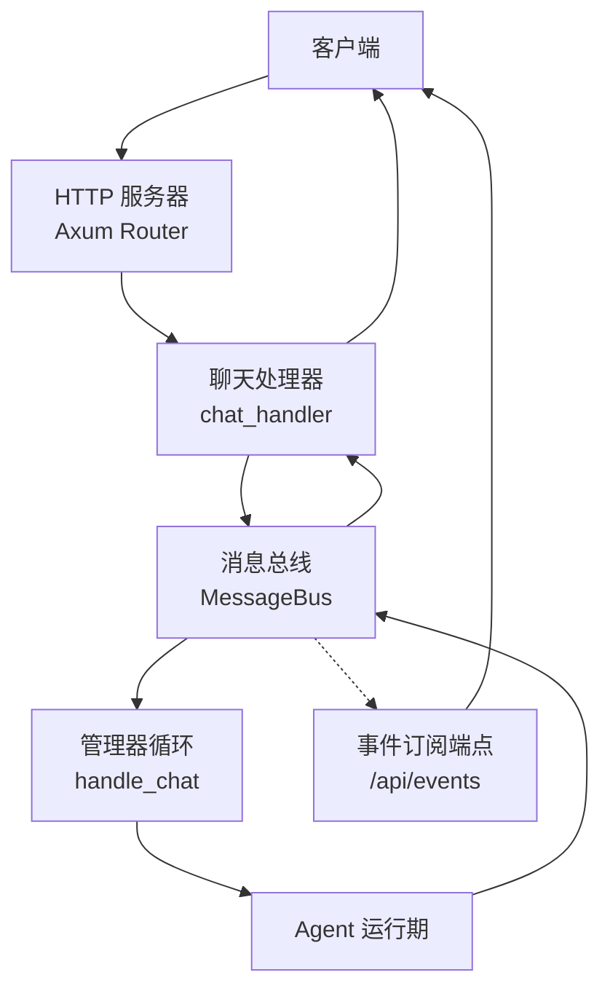
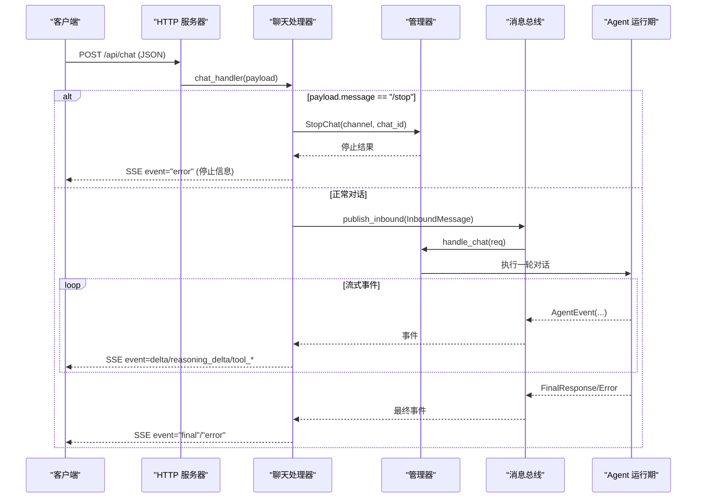
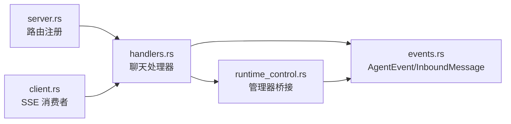

# 聊天接口

<cite>
**本文引用的文件**
- [server.rs](file://agent-diva-manager/src/server.rs)
- [handlers.rs](file://agent-diva-manager/src/handlers.rs)
- [events.rs](file://agent-diva-core/src/bus/events.rs)
- [runtime_control.rs](file://agent-diva-manager/src/manager/runtime_control.rs)
- [client.rs](file://agent-diva-cli/src/client.rs)
</cite>

## 目录
1. [简介](#简介)
2. [项目结构](#项目结构)
3. [核心组件](#核心组件)
4. [架构总览](#架构总览)
5. [详细组件分析](#详细组件分析)
6. [依赖关系分析](#依赖关系分析)
7. [性能与流式处理](#性能与流式处理)
8. [故障排查指南](#故障排查指南)
9. [结论](#结论)
10. [附录：请求与响应示例](#附录请求与响应示例)

## 简介
本章节面向调用方，提供聊天接口的完整 API 文档。重点覆盖 POST /api/chat 端点、SSE 流式响应、事件类型、错误处理、以及与全局事件总线（/api/events）的关联和实时通信模式。该接口用于向 Agent 发送消息并接收增量文本、思考过程、工具调用等实时事件。

## 项目结构
聊天能力由管理器 HTTP 层暴露路由，处理器将请求转换为内部消息并通过消息总线分发，Agent 运行期产生事件，再由处理器映射为 SSE 事件返回给客户端；同时提供通用事件订阅端点以支持跨会话或按通道过滤的事件消费。

图表来源
- [server.rs:204-208](file://agent-diva-manager/src/server.rs#L204-L208)
- [handlers.rs:137-351](file://agent-diva-manager/src/handlers.rs#L137-L351)
- [runtime_control.rs:20-34](file://agent-diva-manager/src/manager/runtime_control.rs#L20-L34)
- [handlers.rs:617-656](file://agent-diva-manager/src/handlers.rs#L617-L656)

章节来源
- [server.rs:204-208](file://agent-diva-manager/src/server.rs#L204-L208)

## 核心组件
- HTTP 路由注册：/api/chat、/api/chat/stop、/api/events
- 聊天处理器：解析请求、构造入站消息、建立 SSE 流
- 管理器桥接：将入站消息发布到总线，订阅事件并转发
- Agent 事件模型：定义所有流式事件类型
- 事件订阅器：按 channel/chat_id/chat_prefix 过滤后推送 SSE

章节来源
- [server.rs:204-208](file://agent-diva-manager/src/server.rs#L204-L208)
- [handlers.rs:83-96](file://agent-diva-manager/src/handlers.rs#L83-L96)
- [handlers.rs:137-351](file://agent-diva-manager/src/handlers.rs#L137-L351)
- [events.rs:59-145](file://agent-diva-core/src/bus/events.rs#L59-L145)
- [handlers.rs:617-656](file://agent-diva-manager/src/handlers.rs#L617-L656)

## 架构总览
下图展示了从 HTTP 请求到 SSE 响应的端到端流程，包括停止命令、错误快速返回、以及通过事件总线的全局事件订阅。

图表来源
- [handlers.rs:137-351](file://agent-diva-manager/src/handlers.rs#L137-L351)
- [runtime_control.rs:20-34](file://agent-diva-manager/src/manager/runtime_control.rs#L20-L34)
- [events.rs:59-145](file://agent-diva-core/src/bus/events.rs#L59-L145)

## 详细组件分析

### 端点：POST /api/chat
- 方法：POST
- 路径：/api/chat
- 内容类型：application/json
- 功能：发送消息并建立 SSE 流，持续推送增量文本、思考过程、工具调用、计划更新、错误等事件。

请求体字段（ChatRequest）
- message: string，必填。用户消息内容。特殊值 "/stop" 会触发停止当前生成。
- channel: string，可选。通道标识，默认 "api"。
- chat_id: string，可选。会话标识，默认 "default"。
- attachments: array<string>，可选。媒体 URL 列表。
- mode: string，可选。执行模式，规范化为 agent/plan/ask，未识别时回退为 ask。
- execution_start: boolean，可选。若为 true，则附带 plan_id、plan_revision、execution_id 等元数据。
- plan_id: string，可选。配合 execution_start 使用。
- plan_revision: integer，可选。配合 execution_start 使用。
- execution_id: string，可选。配合 execution_start 使用。
- approval_policy: string，可选。审批策略覆盖，支持 on-request/on-failure/unless-trusted/never 等。

响应
- HTTP 状态码：通常为 200（SSE 连接成功）。
- 响应体：SSE 流，包含多个事件。

SSE 事件类型
- delta：文本增量。data 为字符串片段。
- reasoning_delta：思考过程增量。data 为字符串片段。
- tool_start：工具调用开始。data 为 JSON，包含 name、args（预览）、id。
- tool_delta：工具参数增量。data 为 JSON，包含 name、delta。
- tool_finish：工具调用结束。data 为 JSON，包含 name、result、error、id。
- final：最终回复。data 为最终文本内容。
- error：错误事件。data 为错误信息或结构化错误对象。
- turn_plan_updated：回合计划更新。data 为 UpdatePlanArgs 序列化字符串。
- provider_retry：提供者重试提示。data 为 JSON，包含 model、attempt、max_retries、delay_ms、reason。
- provider_stalled：提供者卡顿提示。data 为 JSON，包含 model。
- context_compaction：上下文压缩进度。data 为 JSON，包含 session_id、trigger、phase、summary。
- todo_created/todo_step_updated/todo_completed/todo_cancelled：任务相关事件。data 为 JSON，包含 plan 与 todo。
- plan_ready_for_approval/plan_report_ready_for_approval：计划审批就绪事件。data 为 JSON。

错误处理
- 当 persona 未完成初始化或读取失败时，立即返回一个 error 事件。
- 当停止消息 "/stop" 被识别，返回 error 事件并携带停止结果信息。
- 其他运行时错误会通过 error 事件返回。

章节来源
- [handlers.rs:83-96](file://agent-diva-manager/src/handlers.rs#L83-L96)
- [handlers.rs:137-351](file://agent-diva-manager/src/handlers.rs#L137-L351)
- [events.rs:59-145](file://agent-diva-core/src/bus/events.rs#L59-L145)

### 端点：POST /api/chat/stop
- 方法：POST
- 路径：/api/chat/stop
- 请求体：StopChatRequest（channel、chat_id）
- 响应：JSON，status 为 ok 或 error，stopped 表示是否成功停止。

用途：主动终止正在进行的对话生成。

章节来源
- [handlers.rs:353-383](file://agent-diva-manager/src/handlers.rs#L353-L383)

### 端点：GET /api/events
- 方法：GET
- 路径：/api/events
- 查询参数：
  - channel: 可选，过滤通道
  - chat_id: 可选，精确匹配会话 ID
  - chat_prefix: 可选，前缀匹配会话 ID
- 响应：SSE 流，仅转发 bus 中的三类事件：final、error、turn_plan_updated，且带 channel/chat_id 上下文。

用途：订阅全局事件，适合需要跨会话监控或聚合的场景。

章节来源
- [handlers.rs:617-656](file://agent-diva-manager/src/handlers.rs#L617-L656)
- [handlers.rs:583-615](file://agent-diva-manager/src/handlers.rs#L583-L615)

### 管理器桥接与事件转发
- 聊天处理器将请求包装为 InboundMessage，设置 metadata（如 exec_mode、approval_policy、execution_*），并通过总线发布。
- 管理器接收请求后，发布到总线，并订阅事件流，将 AgentEvent 映射为 SSE 事件返回。
- Agent 运行期在迭代中发出文本、思考、工具调用等增量事件，最终输出 final 或 error。

章节来源
- [handlers.rs:203-237](file://agent-diva-manager/src/handlers.rs#L203-L237)
- [runtime_control.rs:20-34](file://agent-diva-manager/src/manager/runtime_control.rs#L20-L34)
- [events.rs:155-213](file://agent-diva-core/src/bus/events.rs#L155-L213)

## 依赖关系分析
- HTTP 路由依赖 Axum Router，注册 /api/chat、/api/chat/stop、/api/events。
- 聊天处理器依赖 AppState（包含 api_tx、bus）、InboundMessage、AgentEvent。
- 管理器依赖 MessageBus 进行事件发布与订阅。
- CLI 客户端演示了如何消费 SSE 事件（delta、final、tool_start 等）。

图表来源
- [server.rs:204-208](file://agent-diva-manager/src/server.rs#L204-L208)
- [handlers.rs:137-351](file://agent-diva-manager/src/handlers.rs#L137-L351)
- [events.rs:59-145](file://agent-diva-core/src/bus/events.rs#L59-L145)
- [client.rs:162-192](file://agent-diva-cli/src/client.rs#L162-L192)

章节来源
- [server.rs:204-208](file://agent-diva-manager/src/server.rs#L204-L208)
- [handlers.rs:137-351](file://agent-diva-manager/src/handlers.rs#L137-L351)
- [events.rs:59-145](file://agent-diva-core/src/bus/events.rs#L59-L145)
- [client.rs:162-192](file://agent-diva-cli/src/client.rs#L162-L192)

## 性能与流式处理
- SSE 使用 keep-alive 保持长连接，避免超时断开。
- 增量事件（delta、reasoning_delta、tool_delta）以小块形式推送，降低首屏延迟。
- 工具调用采用 start/delta/finish 三段式，便于前端逐步渲染。
- 事件总线支持广播与过滤，减少不必要的事件传输。
- 建议客户端实现重连与去重逻辑，确保事件顺序与完整性。

[本节为通用指导，不直接分析具体文件]

## 故障排查指南
常见问题与定位要点：
- 无法收到任何事件：检查 persona 状态是否为 ready；若未就绪，会立即返回 error 事件。
- 停止无效：确认 channel 与 chat_id 与发起对话时一致；/api/chat/stop 会尝试取消命令审批范围并发送停止指令。
- 工具调用异常：关注 tool_finish 事件的 error 字段；必要时结合 tool_start 的 id 进行追踪。
- 长时间无事件：可能遇到 provider_stalled；可观察 provider_retry 事件了解重试情况。
- 上下文压缩：context_compaction 事件可用于理解会话上下文变化。

章节来源
- [handlers.rs:172-200](file://agent-diva-manager/src/handlers.rs#L172-L200)
- [handlers.rs:353-383](file://agent-diva-manager/src/handlers.rs#L353-L383)
- [handlers.rs:304-343](file://agent-diva-manager/src/handlers.rs#L304-L343)

## 结论
POST /api/chat 提供了基于 SSE 的流式聊天能力，支持文本增量、思考过程、工具调用、计划更新与错误事件。配合 /api/events 可实现更灵活的全局事件订阅。调用方应正确处理各类事件，实现稳健的重连与错误恢复机制。

[本节为总结性内容，不直接分析具体文件]

## 附录：请求与响应示例

### 基本对话（成功）
- 请求
  - 方法：POST
  - 路径：/api/chat
  - 头部：Content-Type: application/json
  - 主体：
    - message: "你好，请介绍一下今天的工作安排。"
    - channel: "api"
    - chat_id: "user-123"
- 响应（SSE 事件序列）
  - event: "delta"，data: "好的，让我查看一下..."
  - event: "reasoning_delta"，data: "先列出待办，再筛选优先级..."
  - event: "tool_start"，data: {"name":"list_tasks","args":"{}","id":"call_1"}
  - event: "tool_delta"，data: {"name":"list_tasks","delta":"..."}
  - event: "tool_finish"，data: {"name":"list_tasks","result":"[任务列表]","error":false,"id":"call_1"}
  - event: "delta"，data: "以下是今天的任务..."
  - event: "final"，data: "已完成介绍。"

### 工具调用场景
- 请求同上。
- 响应中会出现 tool_start/tool_delta/tool_finish 事件，随后继续 delta 与 final。

### 错误处理场景
- 若 persona 未就绪：
  - event: "error"，data: {"code":"persona_uninitialized","message":"Persona setup must be completed before chat",...}
- 若停止消息：
  - 请求 message 为 "/stop"
  - event: "error"，data: "Generation stopped by user."

### 与 WebSocket 的关系说明
- 当前聊天接口使用 SSE（Server-Sent Events），并非 WebSocket。
- 如需订阅全局事件，可使用 GET /api/events，同样基于 SSE。
- 若需双向通信，可在上层封装 WebSocket，复用 /api/events 作为事件源。

章节来源
- [handlers.rs:137-351](file://agent-diva-manager/src/handlers.rs#L137-L351)
- [handlers.rs:617-656](file://agent-diva-manager/src/handlers.rs#L617-L656)
- [events.rs:59-145](file://agent-diva-core/src/bus/events.rs#L59-L145)