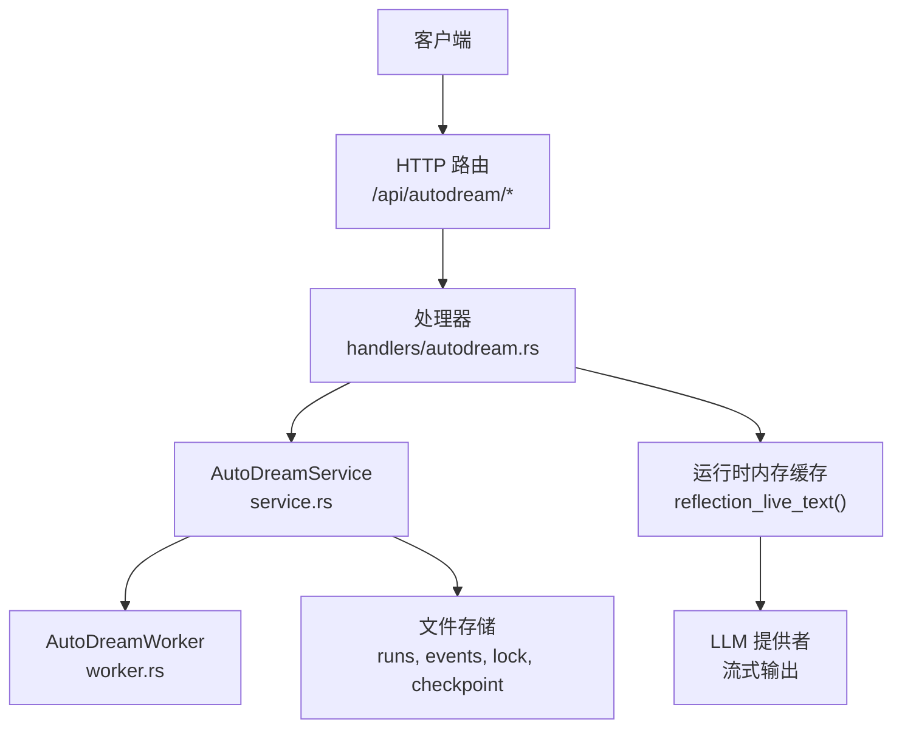
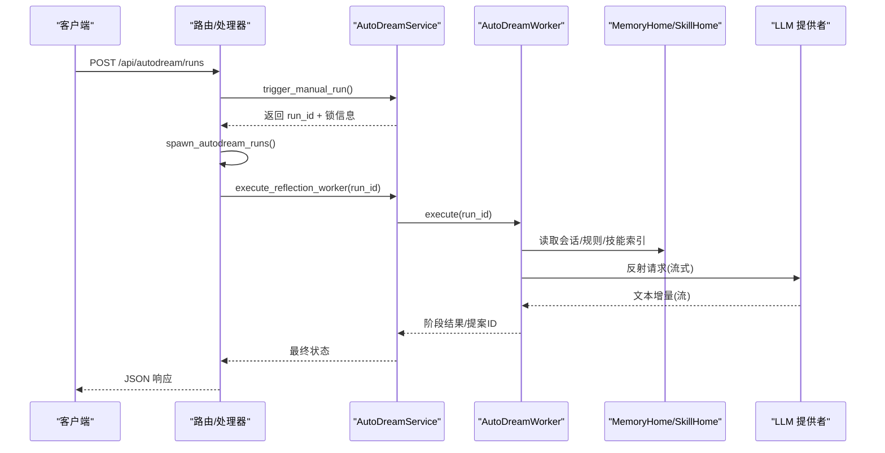
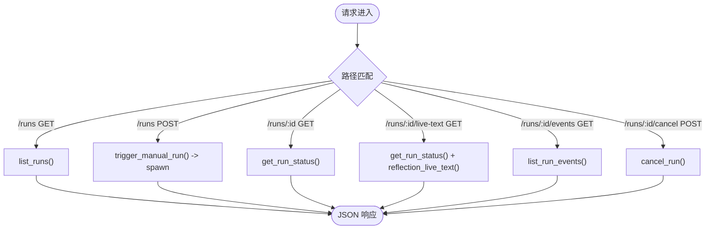
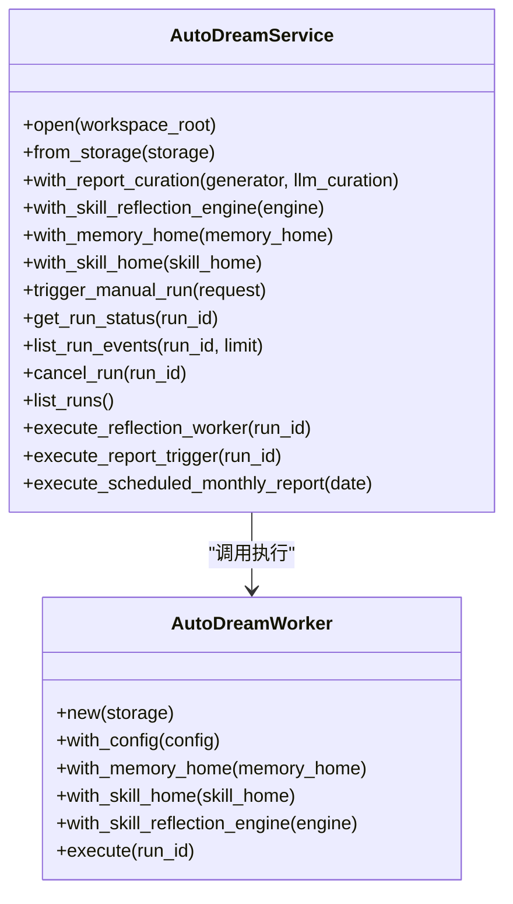
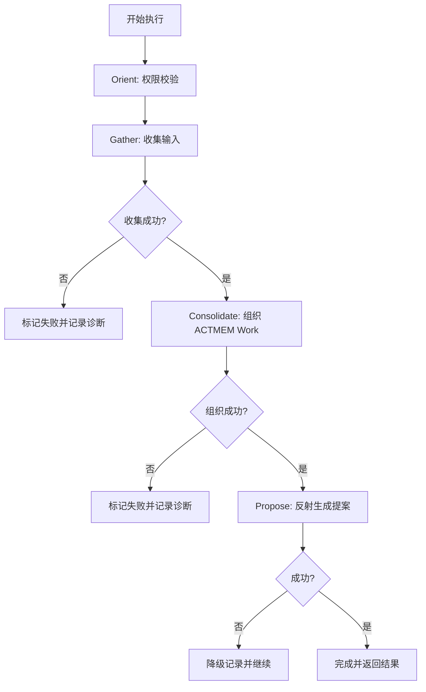
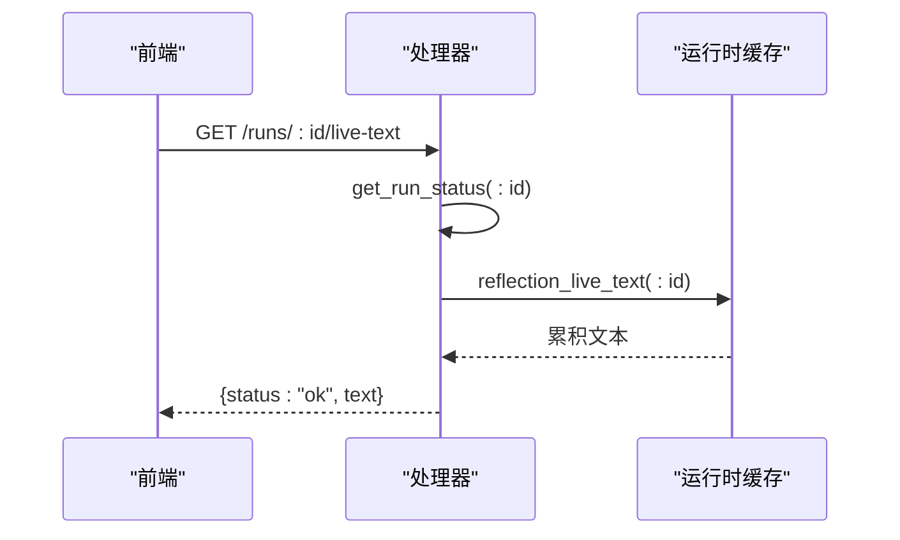
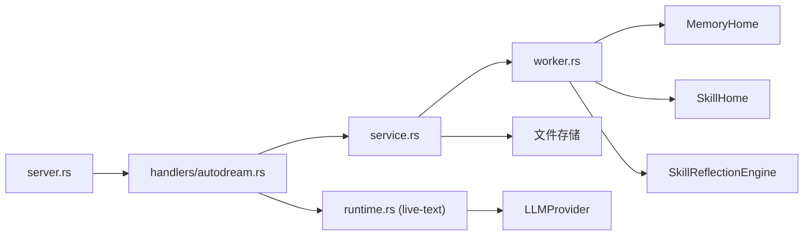

# 自动蒸馏

<cite>
**本文引用的文件**
- [agent-diva-manager/src/server.rs](file://agent-diva-manager/src/server.rs)
- [agent-diva-manager/src/handlers/autodream.rs](file://agent-diva-manager/src/handlers/autodream.rs)
- [agent-diva-autodream/src/lib.rs](file://agent-diva-autodream/src/lib.rs)
- [agent-diva-autodream/src/service.rs](file://agent-diva-autodream/src/service.rs)
- [agent-diva-autodream/src/worker.rs](file://agent-diva-autodream/src/worker.rs)
- [agent-diva-autodream/src/error.rs](file://agent-diva-autodream/src/error.rs)
- [agent-diva-manager/src/runtime.rs](file://agent-diva-manager/src/runtime.rs)
</cite>

## 目录
1. [简介](#简介)
2. [项目结构](#项目结构)
3. [核心组件](#核心组件)
4. [架构总览](#架构总览)
5. [详细组件分析](#详细组件分析)
6. [依赖关系分析](#依赖关系分析)
7. [性能与可靠性](#性能与可靠性)
8. [故障排查指南](#故障排查指南)
9. [结论](#结论)
10. [附录：API 参考与使用示例](#附录api-参考与使用示例)

## 简介
本文件面向“自动蒸馏（AutoDream）”能力，提供端到端 API 文档与实现说明。覆盖以下接口：
- 运行列表查询：GET /api/autodream/runs
- 运行触发：POST /api/autodream/runs
- 运行详情获取：GET /api/autodream/runs/:id
- 实时文本流：GET /api/autodream/runs/:id/live-text
- 运行事件查询：GET /api/autodream/runs/:id/events
- 运行取消：POST /api/autodream/runs/:id/cancel

同时说明自动蒸馏的工作流程、进度监控、结果处理与错误恢复机制，并给出自动化记忆优化的配置与监控示例。

## 项目结构
AutoDream 由 Manager 层暴露 HTTP 路由与处理器，调用 Autodream Service 完成持久化编排与执行；Worker 负责具体阶段工作（收集输入、组织 ACTMEM Work、生成 Skill 提案等）。运行时模块为反射过程提供 LLM 流式输出缓存，供 live-text 接口消费。

图表来源
- [agent-diva-manager/src/server.rs:115-134](file://agent-diva-manager/src/server.rs#L115-L134)
- [agent-diva-manager/src/handlers/autodream.rs:12-90](file://agent-diva-manager/src/handlers/autodream.rs#L12-L90)
- [agent-diva-autodream/src/service.rs:124-133](file://agent-diva-autodream/src/service.rs#L124-L133)
- [agent-diva-autodream/src/worker.rs:152-159](file://agent-diva-autodream/src/worker.rs#L152-L159)
- [agent-diva-manager/src/runtime.rs:47-70](file://agent-diva-manager/src/runtime.rs#L47-L70)

章节来源
- [agent-diva-manager/src/server.rs:115-134](file://agent-diva-manager/src/server.rs#L115-L134)
- [agent-diva-manager/src/handlers/autodream.rs:12-90](file://agent-diva-manager/src/handlers/autodream.rs#L12-L90)

## 核心组件
- AutoDreamService：负责运行生命周期管理、锁与检查点、事件追加、报告生成、月度报告调度、状态查询与恢复。
- AutoDreamWorker：按阶段执行（Orient/Gather/Consolidate/Propose），产出诊断信息与提案 ID。
- 运行时反射引擎：将 LLM 流式文本增量写入进程内缓存，供 live-text 读取。
- HTTP 路由与处理器：将请求映射到服务方法，统一错误码与响应格式。

章节来源
- [agent-diva-autodream/src/lib.rs:17-42](file://agent-diva-autodream/src/lib.rs#L17-L42)
- [agent-diva-autodream/src/service.rs:124-133](file://agent-diva-autodream/src/service.rs#L124-L133)
- [agent-diva-autodream/src/worker.rs:152-159](file://agent-diva-autodream/src/worker.rs#L152-L159)
- [agent-diva-manager/src/runtime.rs:85-183](file://agent-diva-manager/src/runtime.rs#L85-L183)

## 架构总览
AutoDream 的 HTTP 入口在 Manager 中定义，处理器调用 AutoDreamService 进行持久化编排。Worker 通过 MemoryHome/SkillHome 访问受控权限范围，结合可选的 SkillReflectionEngine 完成技能反思与提案生成。月度报告与节奏报告由 Service 根据 trigger 类型分发到不同生成器。

图表来源
- [agent-diva-manager/src/handlers/autodream.rs:12-27](file://agent-diva-manager/src/handlers/autodream.rs#L12-L27)
- [agent-diva-autodream/src/service.rs:202-255](file://agent-diva-autodream/src/service.rs#L202-L255)
- [agent-diva-autodream/src/worker.rs:214-375](file://agent-diva-autodream/src/worker.rs#L214-L375)
- [agent-diva-manager/src/runtime.rs:90-183](file://agent-diva-manager/src/runtime.rs#L90-L183)

## 详细组件分析

### HTTP 路由与处理器
- 路由注册：/api/autodream/runs 支持 GET 与 POST；/:id 支持 GET；/:id/live-text 支持 GET；/:id/events 支持 GET；/:id/cancel 支持 POST。
- 处理器职责：
  - 触发运行：创建运行记录与锁，异步启动执行。
  - 查询运行：返回运行状态、锁、模式开关。
  - 事件列表：读取事件日志并按 run_id 过滤，限制条数。
  - 实时文本：校验运行存在后，从运行时内存缓存读取当前累积文本。
  - 取消运行：仅允许 Pending/Running 状态取消，清理锁并写事件。

图表来源
- [agent-diva-manager/src/server.rs:115-134](file://agent-diva-manager/src/server.rs#L115-L134)
- [agent-diva-manager/src/handlers/autodream.rs:12-90](file://agent-diva-manager/src/handlers/autodream.rs#L12-L90)

章节来源
- [agent-diva-manager/src/server.rs:115-134](file://agent-diva-manager/src/server.rs#L115-L134)
- [agent-diva-manager/src/handlers/autodream.rs:12-90](file://agent-diva-manager/src/handlers/autodream.rs#L12-L90)

### AutoDreamService 关键逻辑
- 运行创建：生成 run_id，写入运行记录与锁，设置编排阶段为 Queued，追加事件。
- 状态查询：合并运行记录、锁与检查点信息。
- 事件列表：从事件日志文件中按 run_id 过滤并排序，限制最多 200 条。
- 取消运行：仅在 Pending/Running 可取消，更新状态、时间、失败码，删除锁，追加事件。
- 列表运行：读取所有运行记录，排序，附带 active_run_id 与模式开关。
- 恢复死锁：若锁文件陈旧或属其他进程，则重置运行状态并删除锁。
- 报告生成：根据 trigger 选择节奏报告或月度报告，支持重试与成功/失败收尾。

图表来源
- [agent-diva-autodream/src/service.rs:124-133](file://agent-diva-autodream/src/service.rs#L124-L133)
- [agent-diva-autodream/src/worker.rs:152-159](file://agent-diva-autodream/src/worker.rs#L152-L159)

章节来源
- [agent-diva-autodream/src/service.rs:202-706](file://agent-diva-autodream/src/service.rs#L202-L706)

### AutoDreamWorker 阶段与权限控制
- 阶段：Orient（准备）、Gather（收集输入）、Consolidate（组织 ACTMEM Work）、Propose（反射生成 Skill 提案）。
- 权限：RestrictedProfile 限定只读会话、只写 AutoDream 输出、创建 Laputa 提案等。
- 失败与诊断：每阶段记录开始/结束时间与诊断信息，失败时写出失败码与消息。

图表来源
- [agent-diva-autodream/src/worker.rs:214-375](file://agent-diva-autodream/src/worker.rs#L214-L375)
- [agent-diva-autodream/src/worker.rs:69-117](file://agent-diva-autodream/src/worker.rs#L69-L117)

章节来源
- [agent-diva-autodream/src/worker.rs:214-375](file://agent-diva-autodream/src/worker.rs#L214-L375)
- [agent-diva-autodream/src/worker.rs:69-117](file://agent-diva-autodream/src/worker.rs#L69-L117)

### 实时文本流（live-text）
- 机制：反射过程中，LLM 流式输出的文本增量被写入进程内 HashMap，键为 run_id。
- 接口：GET /api/autodream/runs/:id/live-text 先校验运行存在，再读取累积文本。
- 特点：不持久化、不包含推理/工具调用 delta、仅用于前端监控展示。

图表来源
- [agent-diva-manager/src/handlers/autodream.rs:53-63](file://agent-diva-manager/src/handlers/autodream.rs#L53-L63)
- [agent-diva-manager/src/runtime.rs:47-70](file://agent-diva-manager/src/runtime.rs#L47-L70)
- [agent-diva-manager/src/runtime.rs:90-183](file://agent-diva-manager/src/runtime.rs#L90-L183)

章节来源
- [agent-diva-manager/src/handlers/autodream.rs:53-63](file://agent-diva-manager/src/handlers/autodream.rs#L53-L63)
- [agent-diva-manager/src/runtime.rs:47-70](file://agent-diva-manager/src/runtime.rs#L47-L70)

### 错误与恢复
- 错误分类：I/O、JSON、运行不存在、活动运行冲突、不可取消、无效状态、输入收集失败、提案持久化失败。
- 统一响应：处理器将 AutoDreamError 映射为 HTTP 状态码与错误码。
- 恢复策略：
  - 死锁恢复：检测锁文件陈旧或属其他进程，重置运行状态并删除锁。
  - 重试机制：月度报告与节奏报告支持有限次数重试。
  - 遗留运行修复：无法安全恢复的旧运行直接标记失败。

章节来源
- [agent-diva-autodream/src/error.rs:9-51](file://agent-diva-autodream/src/error.rs#L9-L51)
- [agent-diva-manager/src/handlers/autodream.rs:92-113](file://agent-diva-manager/src/handlers/autodream.rs#L92-L113)
- [agent-diva-autodream/src/service.rs:656-706](file://agent-diva-autodream/src/service.rs#L656-L706)
- [agent-diva-autodream/src/service.rs:415-489](file://agent-diva-autodream/src/service.rs#L415-L489)

## 依赖关系分析
- Manager 层依赖 Axum 路由与 AppState，AppState 持有 AutoDreamService、MemoryHome、SkillHome 等。
- AutoDreamService 依赖文件存储、事件日志、检查点、可选 LLM 报告生成器与技能反射引擎。
- Worker 依赖 MemoryHome（ACTMEM 读写）、SkillHome（技能索引）、SkillReflectionEngine（可选）。
- 运行时反射引擎依赖 LLMProvider 流式接口，并将增量写入进程内存。

图表来源
- [agent-diva-manager/src/server.rs:115-134](file://agent-diva-manager/src/server.rs#L115-L134)
- [agent-diva-manager/src/state.rs:64-95](file://agent-diva-manager/src/state.rs#L64-L95)
- [agent-diva-autodream/src/service.rs:124-133](file://agent-diva-autodream/src/service.rs#L124-L133)
- [agent-diva-autodream/src/worker.rs:152-159](file://agent-diva-autodream/src/worker.rs#L152-L159)
- [agent-diva-manager/src/runtime.rs:85-183](file://agent-diva-manager/src/runtime.rs#L85-L183)

章节来源
- [agent-diva-manager/src/state.rs:64-95](file://agent-diva-manager/src/state.rs#L64-L95)
- [agent-diva-autodream/src/service.rs:124-133](file://agent-diva-autodream/src/service.rs#L124-L133)
- [agent-diva-autodream/src/worker.rs:152-159](file://agent-diva-autodream/src/worker.rs#L152-L159)
- [agent-diva-manager/src/runtime.rs:85-183](file://agent-diva-manager/src/runtime.rs#L85-L183)

## 性能与可靠性
- 并发与锁：通过锁文件避免重复运行；死锁恢复保证系统健壮性。
- 事件日志：追加式 JSONL 文件，读取时按 run_id 过滤并限制条数，降低 IO 压力。
- 报告生成：支持有限重试，失败时记录诊断与失败码，便于定位问题。
- 实时文本：进程内缓存，轻量且无持久化开销，适合前端轮询展示。
- 建议：
  - 合理设置 stale_lock_after 以平衡异常恢复与误删风险。
  - 对高频轮询 live-text 做节流，避免过多请求。
  - 监控事件文件大小与增长趋势，必要时归档或清理历史。

[本节未直接分析具体文件]

## 故障排查指南
- 常见错误码与含义：
  - run_not_found：运行不存在。
  - active_run_exists：已有活动运行，需等待或取消。
  - run_not_cancellable：运行不在可取消状态。
  - invalid_state：状态机非法转换。
  - autodream_storage_error：I/O、JSON、输入收集或提案持久化失败。
- 排查步骤：
  - 查看运行状态与事件列表，定位失败阶段。
  - 检查锁文件是否存在及是否陈旧。
  - 确认 MemoryHome/SkillHome 可用性与权限。
  - 若反射失败，检查 LLM 提供者配置与模型可用性。
  - 对于月度报告，检查是否已生成或处于计划窗口外。

章节来源
- [agent-diva-manager/src/handlers/autodream.rs:92-113](file://agent-diva-manager/src/handlers/autodream.rs#L92-L113)
- [agent-diva-autodream/src/error.rs:9-51](file://agent-diva-autodream/src/error.rs#L9-L51)
- [agent-diva-autodream/src/service.rs:656-706](file://agent-diva-autodream/src/service.rs#L656-L706)

## 结论
AutoDream 通过清晰的 HTTP 接口与稳健的服务层实现了自动蒸馏的全生命周期管理。其文件优先的存储设计、阶段化的 Worker 执行、受限权限与诊断记录，以及死锁恢复与重试机制，共同保障了系统的可靠性与可观测性。实时文本流为前端提供了低延迟的监控体验。生产部署时应关注锁恢复、事件日志规模与 LLM 提供者稳定性。

[本节未直接分析具体文件]

## 附录：API 参考与使用示例

### 接口定义
- 运行列表查询
  - 方法：GET
  - 路径：/api/autodream/runs
  - 响应字段：status、runs、active_run_id、auto_mode_enabled、session_threshold_enabled
- 运行触发
  - 方法：POST
  - 路径：/api/autodream/runs
  - 请求体：ManualRunTriggerRequest（可选 trigger）
  - 响应字段：status、run、lock、auto_mode_enabled、session_threshold_enabled
- 运行详情获取
  - 方法：GET
  - 路径：/api/autodream/runs/:id
  - 响应字段：status、run、lock、auto_mode_enabled、session_threshold_enabled
- 实时文本流
  - 方法：GET
  - 路径：/api/autodream/runs/:id/live-text
  - 响应字段：status、text
- 运行事件查询
  - 方法：GET
  - 路径：/api/autodream/runs/:id/events
  - 响应字段：status、events（最多 200 条）
- 运行取消
  - 方法：POST
  - 路径：/api/autodream/runs/:id/cancel
  - 响应字段：status、run、lock、auto_mode_enabled、session_threshold_enabled

章节来源
- [agent-diva-manager/src/server.rs:115-134](file://agent-diva-manager/src/server.rs#L115-L134)
- [agent-diva-manager/src/handlers/autodream.rs:12-90](file://agent-diva-manager/src/handlers/autodream.rs#L12-L90)

### 工作流程与监控示例
- 触发自动蒸馏
  - 调用 POST /api/autodream/runs，传入 trigger（如 notebook-daily/notebook-weekly/notebook-monthly 或 manual）。
  - 立即获得 run_id，随后轮询 GET /api/autodream/runs/:id 观察状态变化。
  - 如需实时监控，轮询 GET /api/autodream/runs/:id/live-text 获取累积文本。
  - 完成后查看 GET /api/autodream/runs/:id/events 了解阶段事件与诊断。
- 自动化记忆优化
  - 使用 cron 触发月度报告：内部通过 execute_scheduled_monthly_report 判断是否应生成，并在有活动运行时跳过。
  - 配置 LLM 报告润色：通过 open_autodream_with_report_curation 注入 ReportNarrativeGenerator 与 LlmCurationConfig。
  - 监控指标：通过 AutoDreamMetricsSnapshot 获取运行计数与失败计数快照。

章节来源
- [agent-diva-manager/src/runtime.rs:325-401](file://agent-diva-manager/src/runtime.rs#L325-L401)
- [agent-diva-autodream/src/service.rs:491-526](file://agent-diva-autodream/src/service.rs#L491-L526)
- [agent-diva-autodream/src/service.rs:135-148](file://agent-diva-autodream/src/service.rs#L135-L148)