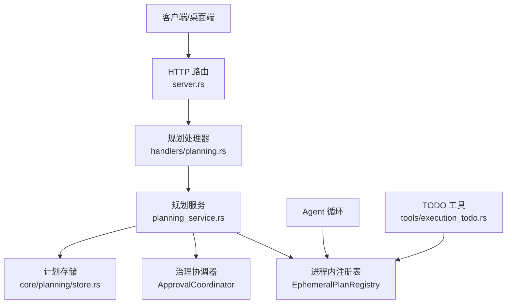
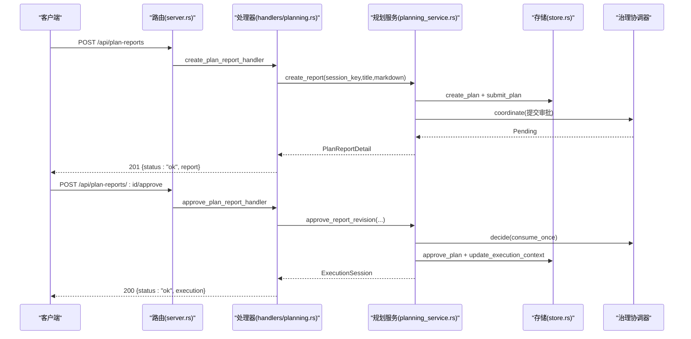
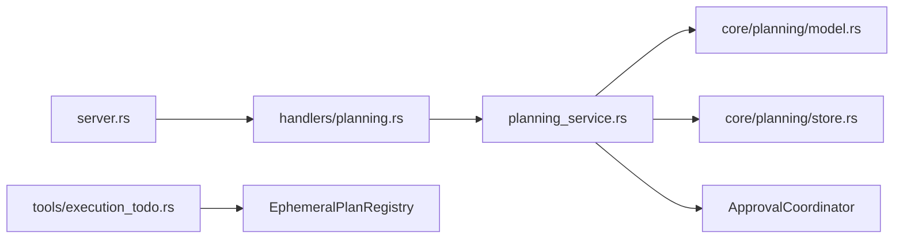

# 规划系统

<cite>
**本文引用的文件**
- [agent-diva-manager/src/handlers/planning.rs](file://agent-diva-manager/src/handlers/planning.rs)
- [agent-diva-manager/src/server.rs](file://agent-diva-manager/src/server.rs)
- [agent-diva-manager/src/planning_service.rs](file://agent-diva-manager/src/planning_service.rs)
- [agent-diva-core/src/planning/model.rs](file://agent-diva-core/src/planning/model.rs)
- [agent-diva-core/src/planning/store.rs](file://agent-diva-core/src/planning/store.rs)
- [agent-diva-core/src/planning/report.rs](file://agent-diva-core/src/planning/report.rs)
- [agent-diva-tools/src/execution_todo.rs](file://agent-diva-tools/src/execution_todo.rs)
- [agent-diva-agent/src/agent_loop/turn/admission.rs](file://agent-diva-agent/src/agent_loop/turn/admission.rs)
- [agent-diva-gui/src-tauri/src/commands.rs](file://agent-diva-gui/src-tauri/src/commands.rs)
</cite>

## 目录
1. [简介](#简介)
2. [项目结构](#项目结构)
3. [核心组件](#核心组件)
4. [架构总览](#架构总览)
5. [详细组件分析](#详细组件分析)
6. [依赖关系分析](#依赖关系分析)
7. [性能考虑](#性能考虑)
8. [故障排查指南](#故障排查指南)
9. [结论](#结论)
10. [附录：API 参考与示例](#附录api-参考与示例)

## 简介
本文件面向“规划系统”的 API 文档，覆盖以下端点：
- 计划报告管理：/api/plan-reports
- 计划修订管理：/api/plan-reports/:report_id/revisions
- 计划批准：/api/plan-reports/:report_id/approve
- 活跃执行查询：/api/plan-executions/active
- 执行待办管理：/api/plan-executions/:execution_id/todos（含更新）

文档将说明规划流程、审批工作流、执行状态跟踪与团队协作机制，并提供复杂任务分解、分配与监控的完整示例。

## 项目结构
规划系统由管理器（HTTP 路由与处理器）、规划服务（业务编排与持久化）、核心模型与存储、工具层（Agent 侧 TODO 读写）以及 GUI/Tauri 客户端组成。

图表来源
- [agent-diva-manager/src/server.rs:338-369](file://agent-diva-manager/src/server.rs#L338-L369)
- [agent-diva-manager/src/handlers/planning.rs:25-265](file://agent-diva-manager/src/handlers/planning.rs#L25-L265)
- [agent-diva-manager/src/planning_service.rs:1-1510](file://agent-diva-manager/src/planning_service.rs#L1-L1510)
- [agent-diva-core/src/planning/store.rs:1-276](file://agent-diva-core/src/planning/store.rs#L1-L276)
- [agent-diva-tools/src/execution_todo.rs:1-97](file://agent-diva-tools/src/execution_todo.rs#L1-L97)

章节来源
- [agent-diva-manager/src/server.rs:338-369](file://agent-diva-manager/src/server.rs#L338-L369)
- [agent-diva-manager/src/handlers/planning.rs:25-265](file://agent-diva-manager/src/handlers/planning.rs#L25-L265)

## 核心组件
- HTTP 路由与处理器：定义 REST 端点，解析请求并转发到 ManagerCommand，返回统一 JSON 响应。
- 规划服务：实现计划报告的创建、修订追加、批准、活跃执行查询、执行待办 CRUD；负责 Markdown 解析、步骤物化、治理协调、持久化与恢复。
- 核心模型与存储：定义计划阶段、状态、待办项等类型；SQLite 存储计划、步骤、事件、执行上下文等。
- 工具层：为 Agent 提供查看/写入执行 TODO 的工具能力。
- 客户端集成：GUI/Tauri 调用后端 API，完成批准后的 TODO 加载与展示。

章节来源
- [agent-diva-manager/src/handlers/planning.rs:25-265](file://agent-diva-manager/src/handlers/planning.rs#L25-L265)
- [agent-diva-manager/src/planning_service.rs:1-1510](file://agent-diva-manager/src/planning_service.rs#L1-L1510)
- [agent-diva-core/src/planning/model.rs:15-185](file://agent-diva-core/src/planning/model.rs#L15-L185)
- [agent-diva-core/src/planning/store.rs:1-276](file://agent-diva-core/src/planning/store.rs#L1-L276)
- [agent-diva-tools/src/execution_todo.rs:1-97](file://agent-diva-tools/src/execution_todo.rs#L1-L97)
- [agent-diva-gui/src-tauri/src/commands.rs:1889-1911](file://agent-diva-gui/src-tauri/src/commands.rs#L1889-L1911)

## 架构总览
规划系统采用“HTTP 处理器 -> 规划服务 -> 存储/治理”的分层架构。所有计划变更通过 Markdown 驱动，支持版本化修订与治理审批；批准后生成执行会话与可物化的执行步骤（TODO），供 Agent 或人工协作推进。

图表来源
- [agent-diva-manager/src/server.rs:338-369](file://agent-diva-manager/src/server.rs#L338-L369)
- [agent-diva-manager/src/handlers/planning.rs:47-154](file://agent-diva-manager/src/handlers/planning.rs#L47-L154)
- [agent-diva-manager/src/planning_service.rs:135-181](file://agent-diva-manager/src/planning_service.rs#L135-L181)
- [agent-diva-manager/src/planning_service.rs:174-402](file://agent-diva-manager/src/planning_service.rs#L174-L402)
- [agent-diva-core/src/planning/store.rs:868-899](file://agent-diva-core/src/planning/store.rs#L868-L899)

## 详细组件分析

### 计划报告管理 /api/plan-reports
- GET 列表：仅当存在处于“等待审批”阶段的活跃计划时返回当前报告详情。
- POST 创建：校验必填字段，解析并验证 Markdown，持久化为计划并提交审批。

关键行为
- 校验 session_key/title/markdown 非空。
- 解析 Markdown 目标/范围/风险与假设/验证方法，并提取“计划步骤”。
- 同步至持久化存储，设置活跃计划，进入“等待审批”。

错误处理
- 未满足必填字段：422 Unprocessable Entity。
- 内部错误：500 Internal Server Error。

章节来源
- [agent-diva-manager/src/handlers/planning.rs:25-88](file://agent-diva-manager/src/handlers/planning.rs#L25-L88)
- [agent-diva-manager/src/planning_service.rs:135-151](file://agent-diva-manager/src/planning_service.rs#L135-L151)
- [agent-diva-manager/src/planning_service.rs:893-958](file://agent-diva-manager/src/planning_service.rs#L893-L958)

### 计划修订管理 /api/plan-reports/:report_id/revisions
- POST 追加修订：基于 expected_revision 进行乐观锁控制，更新标题与 Markdown，重新计算哈希并触发新的治理审批。

关键行为
- 校验 Markdown 并解析。
- 在进程内注册表中追加修订，同步到持久化存储。
- 撤销旧版本的治理请求，绑定新内容的摘要。

错误处理
- 版本冲突：409 Conflict。
- 内部错误：500 Internal Server Error。

章节来源
- [agent-diva-manager/src/handlers/planning.rs:90-122](file://agent-diva-manager/src/handlers/planning.rs#L90-L122)
- [agent-diva-manager/src/planning_service.rs:152-173](file://agent-diva-manager/src/planning_service.rs#L152-L173)
- [agent-diva-manager/src/planning_service.rs:801-876](file://agent-diva-manager/src/planning_service.rs#L801-L876)

### 计划批准 /api/plan-reports/:report_id/approve
- POST 批准：校验 revision 与 revision_hash，建立或恢复执行上下文，调用治理协调器决策并消费一次性许可，标记计划进入执行阶段，可选物化 TODO。

关键行为
- 检查已存在的执行上下文是否就绪，避免重复初始化。
- 若治理状态为 Pending，则提交决策（Allow），随后消费 Once 许可。
- 持久化批准结果，更新执行上下文为 Ready。
- 若启用 todo_policy.materializes(materialize_todos)，从 Markdown 的“计划步骤”段物化 TODO 列表。

错误处理
- 版本冲突/内容不一致：409 Conflict。
- 内部错误：500 Internal Server Error。

章节来源
- [agent-diva-manager/src/handlers/planning.rs:124-154](file://agent-diva-manager/src/handlers/planning.rs#L124-L154)
- [agent-diva-manager/src/planning_service.rs:174-402](file://agent-diva-manager/src/planning_service.rs#L174-L402)
- [agent-diva-manager/src/planning_service.rs:981-1008](file://agent-diva-manager/src/planning_service.rs#L981-L1008)

### 活跃执行查询 /api/plan-executions/active
- GET 查询：根据 session_key 获取当前活跃的 ExecutionSession（若存在）。

关键行为
- 校验 session_key 非空。
- 通过进程内注册表检索活跃执行。

错误处理
- 缺少参数：422 Unprocessable Entity。
- 内部错误：500 Internal Server Error。

章节来源
- [agent-diva-manager/src/handlers/planning.rs:156-195](file://agent-diva-manager/src/handlers/planning.rs#L156-L195)
- [agent-diva-manager/src/planning_service.rs:438-442](file://agent-diva-manager/src/planning_service.rs#L438-L442)

### 执行待办管理 /api/plan-executions/:execution_id/todos
- GET 列出：返回指定执行的 TODO 列表。
- PATCH 更新：按 todo_id 更新状态、标题、详情、优先级、证据引用、阻塞原因等。

关键行为
- 列出：从进程内注册表读取执行 TODO。
- 更新：局部更新字段，校验 Blocked 状态必须提供 block_reason，记录更新时间。

错误处理
- 未找到 TODO：400 Bad Request。
- 内部错误：500 Internal Server Error。

章节来源
- [agent-diva-manager/src/handlers/planning.rs:197-265](file://agent-diva-manager/src/handlers/planning.rs#L197-L265)
- [agent-diva-manager/src/planning_service.rs:443-487](file://agent-diva-manager/src/planning_service.rs#L443-L487)

### 数据模型与状态机
- 计划阶段：Explore → Plan → AwaitingApproval → Execute → Verify → Completed/Failed/Partial。
- 计划状态：Pending/InProgress/Blocked/Completed/Failed/Partial/Canceled。
- 执行待办状态：Pending/InProgress/Blocked/Completed/Canceled；优先级：Low/Normal/High。
- 执行上下文：包含策略、边界、压缩上下文、初始化状态等。

章节来源
- [agent-diva-core/src/planning/model.rs:15-185](file://agent-diva-core/src/planning/model.rs#L15-L185)
- [agent-diva-core/src/planning/report.rs:87-138](file://agent-diva-core/src/planning/report.rs#L87-L138)

### 审批工作流与恢复
- 提交审批：协调治理系统，进入 Pending。
- 批准：决策 Allow 并消费 Once 许可，持久化批准，准备执行上下文。
- 恢复：启动时扫描未完成状态，撤销悬挂许可或补全执行上下文，确保一致性。

章节来源
- [agent-diva-manager/src/planning_service.rs:174-402](file://agent-diva-manager/src/planning_service.rs#L174-L402)
- [agent-diva-manager/src/planning_service.rs:546-635](file://agent-diva-manager/src/planning_service.rs#L546-L635)

### 团队协作机制
- 人类审批：通过桌面端或外部系统调用批准接口，治理协调器记录决策主体与时间。
- Agent 协作：Agent 在准入阶段可从存储恢复执行上下文，继续执行；工具层提供查看/写入 TODO 的能力，便于多角色协同。

章节来源
- [agent-diva-agent/src/agent_loop/turn/admission.rs:148-171](file://agent-diva-agent/src/agent_loop/turn/admission.rs#L148-L171)
- [agent-diva-tools/src/execution_todo.rs:1-97](file://agent-diva-tools/src/execution_todo.rs#L1-L97)
- [agent-diva-gui/src-tauri/src/commands.rs:1889-1911](file://agent-diva-gui/src-tauri/src/commands.rs#L1889-L1911)

## 依赖关系分析
- 处理器依赖 server.rs 的路由映射，将 HTTP 请求分发到具体 handler。
- 处理器依赖 planning_service 的业务逻辑，使用 oneshot channel 异步通信。
- 规划服务依赖 core 的模型与存储，以及治理协调器。
- 工具层通过 EphemeralPlanRegistry 访问执行 TODO，与 Agent 循环交互。

图表来源
- [agent-diva-manager/src/server.rs:338-369](file://agent-diva-manager/src/server.rs#L338-L369)
- [agent-diva-manager/src/handlers/planning.rs:25-265](file://agent-diva-manager/src/handlers/planning.rs#L25-L265)
- [agent-diva-manager/src/planning_service.rs:1-1510](file://agent-diva-manager/src/planning_service.rs#L1-L1510)
- [agent-diva-core/src/planning/model.rs:15-185](file://agent-diva-core/src/planning/model.rs#L15-L185)
- [agent-diva-core/src/planning/store.rs:1-276](file://agent-diva-core/src/planning/store.rs#L1-L276)
- [agent-diva-tools/src/execution_todo.rs:1-97](file://agent-diva-tools/src/execution_todo.rs#L1-L97)

章节来源
- [agent-diva-manager/src/server.rs:338-369](file://agent-diva-manager/src/server.rs#L338-L369)
- [agent-diva-manager/src/handlers/planning.rs:25-265](file://agent-diva-manager/src/handlers/planning.rs#L25-L265)
- [agent-diva-manager/src/planning_service.rs:1-1510](file://agent-diva-manager/src/planning_service.rs#L1-L1510)

## 性能考虑
- SQLite WAL 模式与外键约束提升并发与一致性。
- 进程内注册表用于快速访问执行上下文与 TODO，减少数据库压力。
- 批准流程中的治理协调器使用一次性许可，避免重复执行。
- 恢复流程批量扫描未完成状态，保证重启后的一致性。

章节来源
- [agent-diva-core/src/planning/store.rs:278-289](file://agent-diva-core/src/planning/store.rs#L278-L289)
- [agent-diva-manager/src/planning_service.rs:546-635](file://agent-diva-manager/src/planning_service.rs#L546-L635)

## 故障排查指南
- 422 Unprocessable Entity：常见于缺少必填字段（如 session_key、title、markdown）。
- 409 Conflict：修订版本冲突或批准内容不匹配。
- 400 Bad Request：更新 TODO 时缺少必要字段（如 Blocked 状态需 block_reason）。
- 500 Internal Server Error：内部异常或服务不可用。

建议排查步骤
- 检查请求体字段完整性与格式。
- 确认 plan 处于 AwaitingApproval 且 revision/hash 正确。
- 查看治理协调器状态与持久化记录，确认是否存在悬挂许可或未完成的执行上下文。
- 重启服务后观察恢复流程是否修正状态。

章节来源
- [agent-diva-manager/src/handlers/planning.rs:51-88](file://agent-diva-manager/src/handlers/planning.rs#L51-L88)
- [agent-diva-manager/src/handlers/planning.rs:124-154](file://agent-diva-manager/src/handlers/planning.rs#L124-L154)
- [agent-diva-manager/src/handlers/planning.rs:229-265](file://agent-diva-manager/src/handlers/planning.rs#L229-L265)
- [agent-diva-manager/src/planning_service.rs:546-635](file://agent-diva-manager/src/planning_service.rs#L546-L635)

## 结论
规划系统通过清晰的 API 分层、Markdown 驱动的规划内容、严格的版本与治理审批、以及灵活的执行 TODO 管理，实现了复杂任务的分解、分配与监控。结合 Agent 与桌面端的协作，形成端到端的闭环流程，保障高可靠与可追溯的执行过程。

## 附录：API 参考与示例

### 端点清单
- GET /api/plan-reports：列出当前等待审批的计划报告。
- POST /api/plan-reports：创建计划报告并提交审批。
- POST /api/plan-reports/:report_id/revisions：追加修订（带 expected_revision）。
- POST /api/plan-reports/:report_id/approve：批准计划并创建执行会话。
- GET /api/plan-executions/active?session_key=...：查询活跃执行。
- GET /api/plan-executions/:execution_id/todos：列出执行 TODO。
- PATCH /api/plan-executions/:execution_id/todos/:todo_id：更新执行 TODO。

章节来源
- [agent-diva-manager/src/server.rs:338-369](file://agent-diva-manager/src/server.rs#L338-L369)
- [agent-diva-manager/src/handlers/planning.rs:25-265](file://agent-diva-manager/src/handlers/planning.rs#L25-L265)

### 典型流程示例
- 创建计划：POST /api/plan-reports，提交包含目标、范围、风险与假设、验证方法与计划步骤的 Markdown。
- 追加修订：POST /api/plan-reports/:report_id/revisions，更新内容并触发新审批。
- 批准执行：POST /api/plan-reports/:report_id/approve，选择上下文策略与 TODO 物化策略。
- 查询执行：GET /api/plan-executions/active?session_key=...，获取执行会话。
- 管理 TODO：GET/PATCH /api/plan-executions/:execution_id/todos[/:todo_id]，推进任务。

章节来源
- [agent-diva-manager/src/planning_service.rs:135-181](file://agent-diva-manager/src/planning_service.rs#L135-L181)
- [agent-diva-manager/src/planning_service.rs:174-402](file://agent-diva-manager/src/planning_service.rs#L174-L402)
- [agent-diva-manager/src/planning_service.rs:438-487](file://agent-diva-manager/src/planning_service.rs#L438-L487)

### 复杂任务分解与监控示例
- 分解：在 Markdown 的“计划步骤”段中列出可执行子任务（支持有序/无序列表）。
- 分配：批准时启用 materialize_todos，系统将自动物化为 TODO 列表。
- 监控：通过执行 TODO 的状态流转（Pending→InProgress→Completed/Canceled）跟踪进度；Blocked 时需填写阻塞原因。

章节来源
- [agent-diva-manager/src/planning_service.rs:981-1008](file://agent-diva-manager/src/planning_service.rs#L981-L1008)
- [agent-diva-core/src/planning/report.rs:93-120](file://agent-diva-core/src/planning/report.rs#L93-L120)