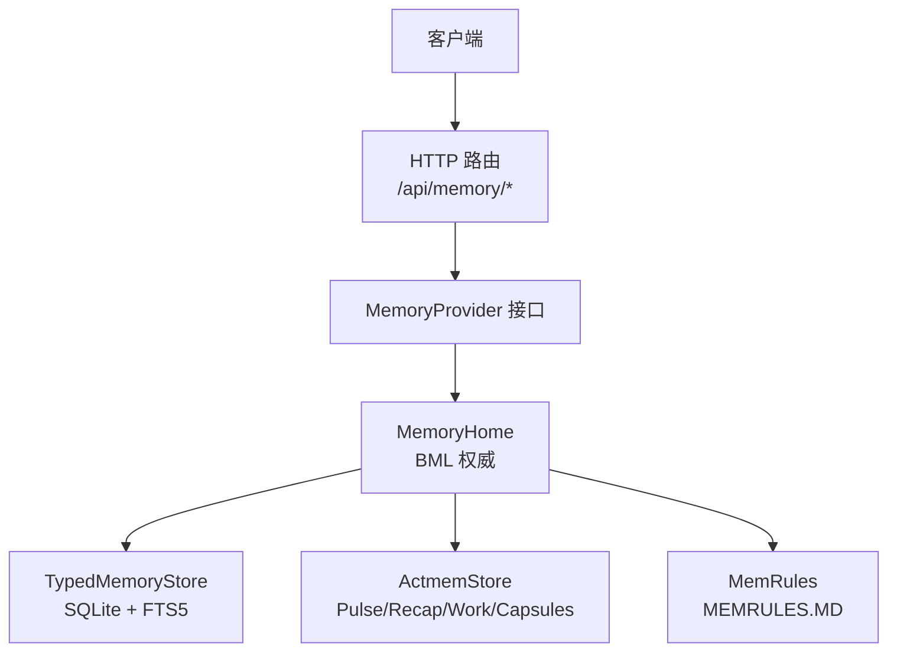
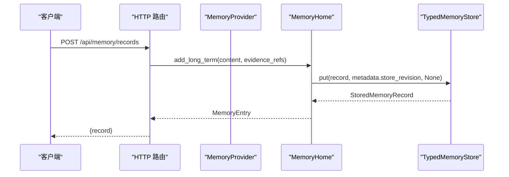
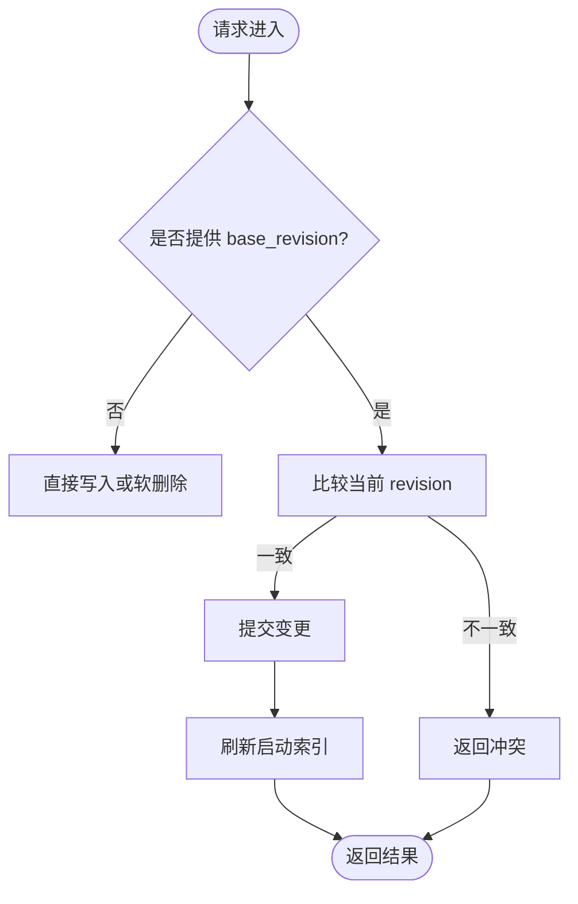
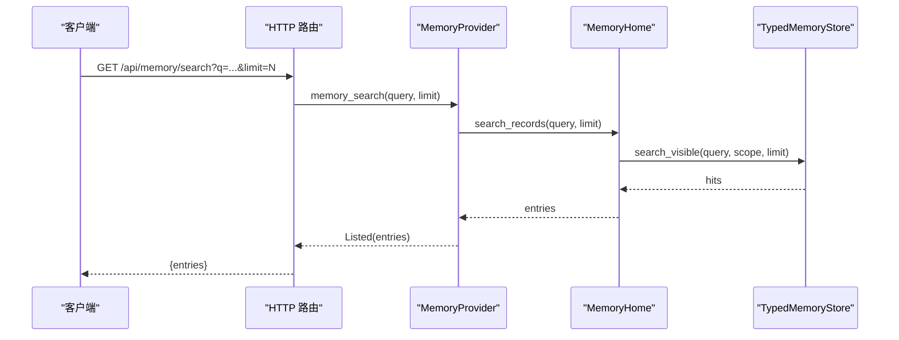
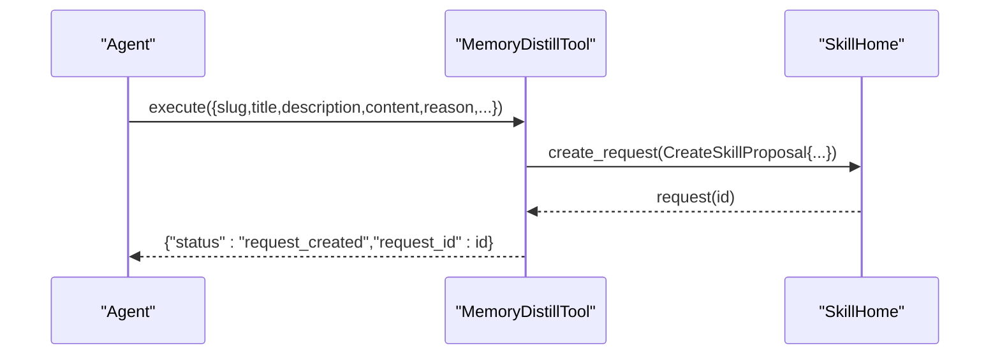
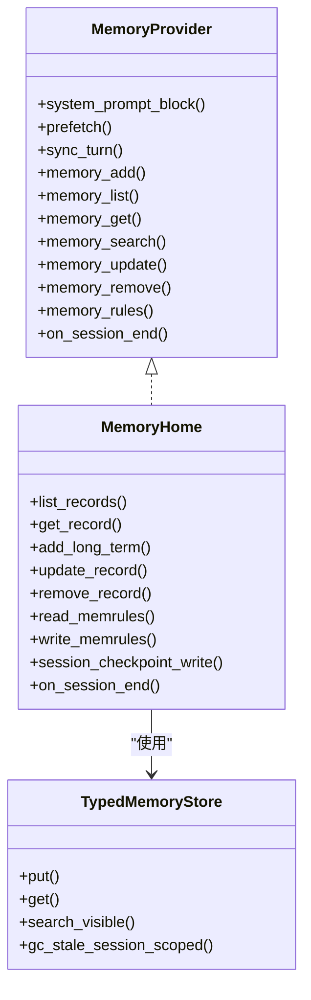
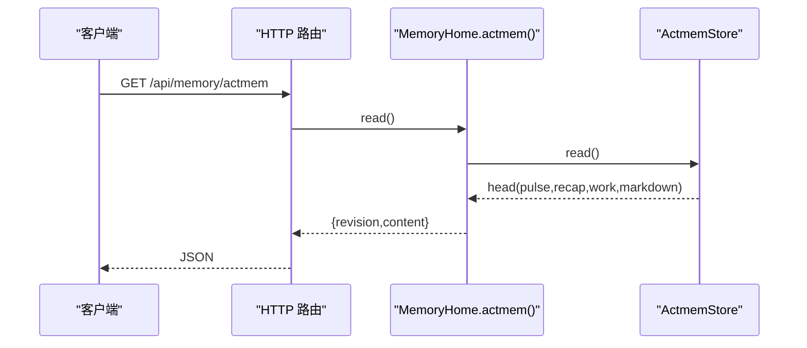
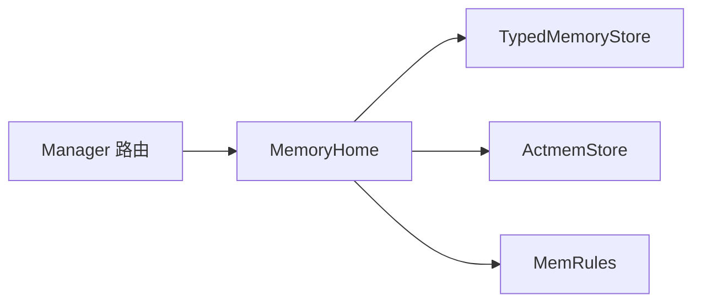

# 记忆系统

<cite>
**本文引用的文件**
- [agent-diva-manager/src/handlers/memory.rs](file://agent-diva-manager/src/handlers/memory.rs)
- [agent-diva-core/src/memory/mod.rs](file://agent-diva-core/src/memory/mod.rs)
- [agent-diva-core/src/memory/crud.rs](file://agent-diva-core/src/memory/crud.rs)
- [agent-diva-core/src/memory/actmem.rs](file://agent-diva-core/src/memory/actmem.rs)
- [agent-diva-core/src/memory/provider.rs](file://agent-diva-core/src/memory/provider.rs)
- [agent-diva-core/src/memory/recall.rs](file://agent-diva-core/src/memory/recall.rs)
- [agent-diva-laputa/src/bml/mod.rs](file://agent-diva-laputa/src/bml/mod.rs)
- [agent-diva-laputa/src/bml/memory_home.rs](file://agent-diva-laputa/src/bml/memory_home.rs)
- [agent-diva-laputa/src/cognitive/memrules.rs](file://agent-diva-laputa/src/cognitive/memrules.rs)
- [agent-diva-tools/src/memory_distill.rs](file://agent-diva-tools/src/memory_distill.rs)
</cite>

## 目录
1. [简介](#简介)
2. [项目结构](#项目结构)
3. [核心组件](#核心组件)
4. [架构总览](#架构总览)
5. [详细组件分析](#详细组件分析)
6. [依赖关系分析](#依赖关系分析)
7. [性能考虑](#性能考虑)
8. [故障排查指南](#故障排查指南)
9. [结论](#结论)
10. [附录](#附录)

## 简介
本文件面向“记忆系统 API”的使用与实现，覆盖以下能力：
- 记忆记录管理：/api/memory/records（增、删、改、查）
- 活动记忆操作：/api/memory/actmem（读取 Pulse/Recap/Work/Capsules/Capsule）
- 记忆胶囊管理：/api/memory/actmem/capsules（胶囊列表与读取）
- 记忆规则配置：/api/memory/memrules（读/写 MEMRULES.MD）

同时说明语义搜索、记忆蒸馏、Laputa 治理集成、结构化存储、检索优化与性能调优实践。

## 项目结构
记忆系统由三层构成：
- HTTP 路由层（Manager）：暴露 REST 端点，负责参数解析、错误映射与 JSON 封装
- 领域契约层（Core）：定义 MemoryProvider、CRUD 请求/响应、ACTMEM 与 Recall 等稳定接口
- 权威存储层（Laputa BML）：MemoryHome 作为机器级权威，基于 SQLite + FTS5 持久化，并维护启动索引与规则

图表来源
- [agent-diva-manager/src/handlers/memory.rs:55-204](file://agent-diva-manager/src/handlers/memory.rs#L55-L204)
- [agent-diva-core/src/memory/provider.rs:414-617](file://agent-diva-core/src/memory/provider.rs#L414-L617)
- [agent-diva-laputa/src/bml/memory_home.rs:85-145](file://agent-diva-laputa/src/bml/memory_home.rs#L85-L145)

章节来源
- [agent-diva-manager/src/handlers/memory.rs:55-204](file://agent-diva-manager/src/handlers/memory.rs#L55-L204)
- [agent-diva-core/src/memory/mod.rs:1-47](file://agent-diva-core/src/memory/mod.rs#L1-L47)
- [agent-diva-laputa/src/bml/mod.rs:1-37](file://agent-diva-laputa/src/bml/mod.rs#L1-L37)

## 核心组件
- MemoryProvider：Agent-Diva 与后端存储的解耦边界，提供系统提示注入、预取召回、会话同步、CRUD、ACTMEM 读写、规则读取等能力
- MemoryHome：生产权威实现，封装 SQLite + FTS5 存储、启动 L1 索引、CAS 更新/软删除、会话检查点、规则读写
- CRUD 契约：MemoryAdd/Get/List/Search/Update/Remove/Distill 请求与统一结果体
- ACTMEM 契约：Pulse/Recap/Work/Head/Capsules/Capsule 的读取与工作区编辑
- MemRules：默认内置规则与用户自定义文件的读取/写入

章节来源
- [agent-diva-core/src/memory/provider.rs:414-617](file://agent-diva-core/src/memory/provider.rs#L414-L617)
- [agent-diva-core/src/memory/crud.rs:11-143](file://agent-diva-core/src/memory/crud.rs#L11-L143)
- [agent-diva-core/src/memory/actmem.rs:1-51](file://agent-diva-core/src/memory/actmem.rs#L1-L51)
- [agent-diva-laputa/src/bml/memory_home.rs:85-145](file://agent-diva-laputa/src/bml/memory_home.rs#L85-L145)
- [agent-diva-laputa/src/cognitive/memrules.rs:1-80](file://agent-diva-laputa/src/cognitive/memrules.rs#L1-L80)

## 架构总览
记忆系统的权威路径为：HTTP 路由 → MemoryProvider → MemoryHome → TypedMemoryStore（SQLite+FTS5）。所有写操作通过 CAS 保证一致性；读操作返回可见投影（过滤 tombstone、superseded、会话范围）。

图表来源
- [agent-diva-manager/src/handlers/memory.rs:66-76](file://agent-diva-manager/src/handlers/memory.rs#L66-L76)
- [agent-diva-laputa/src/bml/memory_home.rs:205-236](file://agent-diva-laputa/src/bml/memory_home.rs#L205-L236)

章节来源
- [agent-diva-laputa/src/bml/memory_home.rs:179-236](file://agent-diva-laputa/src/bml/memory_home.rs#L179-L236)

## 详细组件分析

### 记忆记录管理 /api/memory/records
- 列出记录：GET /api/memory/records?limit=N
  - 行为：返回已应用且可见的长期记忆条目，过滤 tombstone/superseded/会话范围
  - 错误：服务不可用、未找到、无效请求、IO 错误
- 创建记录：POST /api/memory/records
  - 输入：content、evidence_refs（可选）
  - 行为：写入长期记忆，生成稳定 id，刷新启动索引
- 获取记录：GET /api/memory/records/{id}
  - 行为：按 id 获取可见记录
- 更新记录：PATCH /api/memory/records/{id}
  - 输入：content、base_revision、evidence_refs（可选）
  - 行为：CAS 更新，失败时返回冲突
- 删除记录：DELETE /api/memory/records/{id}
  - 输入：reason、base_revision
  - 行为：软删除（tombstone），过滤后不再可见

图表来源
- [agent-diva-manager/src/handlers/memory.rs:93-122](file://agent-diva-manager/src/handlers/memory.rs#L93-L122)
- [agent-diva-laputa/src/bml/memory_home.rs:238-346](file://agent-diva-laputa/src/bml/memory_home.rs#L238-L346)

章节来源
- [agent-diva-manager/src/handlers/memory.rs:55-122](file://agent-diva-manager/src/handlers/memory.rs#L55-L122)
- [agent-diva-laputa/src/bml/memory_home.rs:179-346](file://agent-diva-laputa/src/bml/memory_home.rs#L179-L346)

### 语义搜索
- 搜索入口：MemoryProvider::memory_search
- 底层实现：MemoryHome::search_records 调用 TypedMemoryStore.search_visible，结合 scope 与可见性过滤
- 返回：匹配到的记录集合（可限制数量）

图表来源
- [agent-diva-core/src/memory/provider.rs:501-508](file://agent-diva-core/src/memory/provider.rs#L501-L508)
- [agent-diva-laputa/src/bml/memory_home.rs:420-437](file://agent-diva-laputa/src/bml/memory_home.rs#L420-L437)

章节来源
- [agent-diva-core/src/memory/crud.rs:35-42](file://agent-diva-core/src/memory/crud.rs#L35-L42)
- [agent-diva-laputa/src/bml/memory_home.rs:420-437](file://agent-diva-laputa/src/bml/memory_home.rs#L420-L437)

### 记忆蒸馏
- 工具：memory_distill（Agent 工具）
- 行为：创建受控的 Skill 提案（pending request），不直接写入技能头；需要 session_key 证据
- 产出：request_created 或 failed（含错误码）

图表来源
- [agent-diva-tools/src/memory_distill.rs:91-132](file://agent-diva-tools/src/memory_distill.rs#L91-L132)

章节来源
- [agent-diva-core/src/memory/crud.rs:69-81](file://agent-diva-core/src/memory/crud.rs#L69-L81)
- [agent-diva-tools/src/memory_distill.rs:1-199](file://agent-diva-tools/src/memory_distill.rs#L1-L199)

### Laputa 治理集成
- 权威边界：BML 是机器级 typed SQLite + FTS5 权威；非 BML 模块不得直写 raw write APIs
- 规则手册：MEMRULES.MD 作为写记忆宪法，默认内置 R1–R7；支持用户文件覆盖
- 启动索引：MemoryHome 维护 L1 索引块，用于系统提示快速注入
- 会话检查点：SessionCheckpoint 写入/读取/清理，支持 GC

图表来源
- [agent-diva-core/src/memory/provider.rs:414-617](file://agent-diva-core/src/memory/provider.rs#L414-L617)
- [agent-diva-laputa/src/bml/memory_home.rs:85-145](file://agent-diva-laputa/src/bml/memory_home.rs#L85-L145)
- [agent-diva-laputa/src/bml/mod.rs:23-37](file://agent-diva-laputa/src/bml/mod.rs#L23-L37)

章节来源
- [agent-diva-laputa/src/bml/mod.rs:1-37](file://agent-diva-laputa/src/bml/mod.rs#L1-L37)
- [agent-diva-laputa/src/bml/memory_home.rs:348-372](file://agent-diva-laputa/src/bml/memory_home.rs#L348-L372)
- [agent-diva-laputa/src/cognitive/memrules.rs:1-80](file://agent-diva-laputa/src/cognitive/memrules.rs#L1-L80)

### 活动记忆操作 /api/memory/actmem
- 读取：GET /api/memory/actmem
  - 目标：Pulse/Recap/Work/Head/Capsules/Capsule
  - 返回：revision、content（Capsules 为 JSON 列表，Capsule 为 Markdown）
- 编辑工作项：PUT /api/memory/actmem
  - 字段：pulse/recap/work、base_revision
  - 行为：CAS 替换指定 section，返回新 revision 与更新时间

图表来源
- [agent-diva-manager/src/handlers/memory.rs:124-146](file://agent-diva-manager/src/handlers/memory.rs#L124-L146)
- [agent-diva-laputa/src/bml/memory_home.rs:712-745](file://agent-diva-laputa/src/bml/memory_home.rs#L712-L745)

章节来源
- [agent-diva-core/src/memory/actmem.rs:1-51](file://agent-diva-core/src/memory/actmem.rs#L1-L51)
- [agent-diva-manager/src/handlers/memory.rs:124-146](file://agent-diva-manager/src/handlers/memory.rs#L124-L146)

### 记忆胶囊管理 /api/memory/actmem/capsules
- 读取胶囊列表：ActmemReadTarget::Capsules
  - 返回：JSON 格式的胶囊清单
- 读取单个胶囊：ActmemReadTarget::Capsule
  - 需 capsule_name，返回 Markdown 内容

章节来源
- [agent-diva-core/src/memory/actmem.rs:3-18](file://agent-diva-core/src/memory/actmem.rs#L3-L18)
- [agent-diva-laputa/src/bml/memory_home.rs:720-745](file://agent-diva-laputa/src/bml/memory_home.rs#L720-L745)

### 记忆规则配置 /api/memory/memrules
- 读取规则：GET /api/memory/memrules
  - 返回：content、source（default/file）
- 写入规则：PUT /api/memory/memrules
  - 输入：content
  - 行为：原子写入 MEMRULES.MD；空内容拒绝；source 切换为 file

章节来源
- [agent-diva-manager/src/handlers/memory.rs:188-204](file://agent-diva-manager/src/handlers/memory.rs#L188-L204)
- [agent-diva-laputa/src/bml/memory_home.rs:348-372](file://agent-diva-laputa/src/bml/memory_home.rs#L348-L372)
- [agent-diva-laputa/src/cognitive/memrules.rs:1-80](file://agent-diva-laputa/src/cognitive/memrules.rs#L1-L80)

## 依赖关系分析
- Manager 路由依赖 MemoryHome 提供的业务方法，并通过错误映射函数将领域错误转换为 HTTP 状态码
- MemoryProvider 抽象使 Agent-Diva 不感知具体存储实现；MemoryHome 实现该接口
- TypedMemoryStore 提供持久化与检索；FTS5 用于全文检索
- ActmemStore 管理活动记忆文档与胶囊
- MemRules 提供规则加载与解析

图表来源
- [agent-diva-manager/src/handlers/memory.rs:55-204](file://agent-diva-manager/src/handlers/memory.rs#L55-L204)
- [agent-diva-laputa/src/bml/memory_home.rs:85-145](file://agent-diva-laputa/src/bml/memory_home.rs#L85-L145)

章节来源
- [agent-diva-manager/src/handlers/memory.rs:55-204](file://agent-diva-manager/src/handlers/memory.rs#L55-L204)
- [agent-diva-laputa/src/bml/memory_home.rs:85-145](file://agent-diva-laputa/src/bml/memory_home.rs#L85-L145)

## 性能考虑
- 启动索引缓存：MemoryHome 维护 L1 索引块并在写后刷新，减少系统提示组装开销
- 惰性打开数据库：仅当存在数据库文件时才打开 store，避免冷启动 I/O
- 检索优化：使用 FTS5 进行全文检索；search_visible 结合 scope 与可见性过滤，减少不必要数据
- 会话检查点 GC：启动时清理过期会话检查点，保持存储体积可控
- 批量限制：list/search 支持 limit，避免大结果集传输

章节来源
- [agent-diva-laputa/src/bml/memory_home.rs:147-177](file://agent-diva-laputa/src/bml/memory_home.rs#L147-L177)
- [agent-diva-laputa/src/bml/memory_home.rs:381-418](file://agent-diva-laputa/src/bml/memory_home.rs#L381-L418)
- [agent-diva-core/src/memory/recall.rs:18-24](file://agent-diva-core/src/memory/recall.rs#L18-L24)

## 故障排查指南
常见错误与定位：
- 服务不可用（bml_unavailable）：存储层打开失败或查询异常
- 版本冲突（memory_revision_conflict）：更新/删除时 base_revision 与当前不一致
- 未找到（memory_not_found）：记录不存在或被软删除
- 无效请求（memory_invalid_request）：内容为空、规则为空等
- IO 错误（memory_io_error）：文件系统写入失败

处理建议：
- 重试策略：对网络或临时 IO 错误可指数退避重试
- 冲突解决：先读取最新记录再提交更新
- 规则校验：确保 MEMRULES 非空且格式正确
- 日志追踪：利用 correlation/request_id 关联审计链路

章节来源
- [agent-diva-manager/src/handlers/memory.rs:210-226](file://agent-diva-manager/src/handlers/memory.rs#L210-L226)
- [agent-diva-laputa/src/bml/memory_home.rs:39-70](file://agent-diva-laputa/src/bml/memory_home.rs#L39-L70)

## 结论
记忆系统以 MemoryProvider 为稳定边界，MemoryHome 作为权威实现，结合 SQLite + FTS5 提供高效的结构化存储与检索。API 层清晰分离 CRUD、ACTMEM、规则配置与蒸馏流程，并通过 CAS 与软删除保障一致性与可追溯性。遵循 MEMRULES 与治理边界，可在保证安全的前提下扩展记忆能力。

## 附录
- 最佳实践
  - 写前读：更新/删除前先获取当前 revision
  - 证据优先：尽量附带 evidence_refs，提升可信度
  - 控制规模：合理设置 limit，避免大结果集
  - 规则治理：通过 MEMRULES 约束写入策略，避免污染上下文
  - 蒸馏沉淀：将重复经验蒸馏为 Skill 提案，经审批后复用