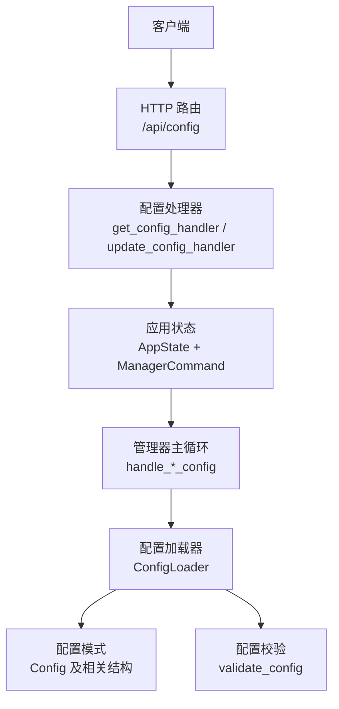
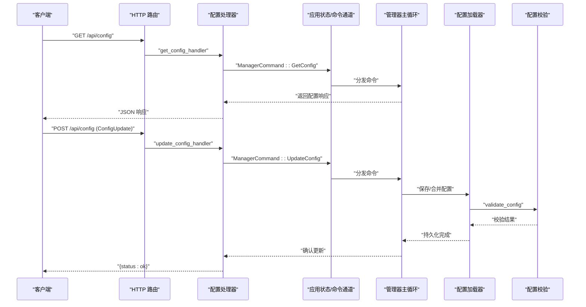
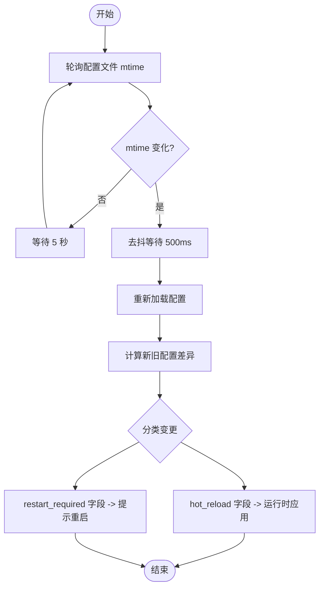
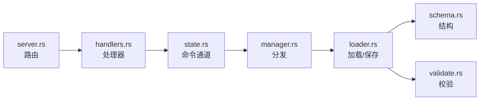

# 配置管理

<cite>
**本文引用的文件**
- [server.rs](file://agent-diva-manager/src/server.rs)
- [handlers.rs](file://agent-diva-manager/src/handlers.rs)
- [state.rs](file://agent-diva-manager/src/state.rs)
- [manager.rs](file://agent-diva-manager/src/manager.rs)
- [loader.rs](file://agent-diva-core/src/config/loader.rs)
- [schema.rs](file://agent-diva-core/src/config/schema.rs)
- [validate.rs](file://agent-diva-core/src/config/validate.rs)
</cite>

## 目录
1. [简介](#简介)
2. [项目结构](#项目结构)
3. [核心组件](#核心组件)
4. [架构总览](#架构总览)
5. [详细组件分析](#详细组件分析)
6. [依赖关系分析](#依赖关系分析)
7. [性能考虑](#性能考虑)
8. [故障排查指南](#故障排查指南)
9. [结论](#结论)
10. [附录](#附录)

## 简介
本文件面向配置管理 API，聚焦以下能力：
- 读取配置：GET /api/config
- 更新配置：POST /api/config
- 动态配置刷新机制（热重载与重启要求）
- 配置验证规则
- 权限控制建议
- 系统配置、运行时配置、安全配置等类型说明
- 配置备份、恢复与版本管理的最佳实践

该 API 由 HTTP 路由层暴露，经管理器命令通道分发到内部处理逻辑，底层通过配置加载器完成持久化与热重载。

## 项目结构
配置相关的路由定义在管理器 HTTP 服务中；请求进入后通过 oneshot 通道将命令发送给管理器主循环；管理器根据命令类型调用相应处理器；配置数据模型与校验位于 core 的配置模块。

图表来源
- [server.rs:226-233](file://agent-diva-manager/src/server.rs#L226-L233)
- [handlers.rs:658-699](file://agent-diva-manager/src/handlers.rs#L658-L699)
- [state.rs:315-324](file://agent-diva-manager/src/state.rs#L315-L324)
- [manager.rs:332-343](file://agent-diva-manager/src/manager.rs#L332-L343)
- [loader.rs:57-82](file://agent-diva-core/src/config/loader.rs#L57-L82)
- [schema.rs:278-309](file://agent-diva-core/src/config/schema.rs#L278-L309)
- [validate.rs:5-99](file://agent-diva-core/src/config/validate.rs#L5-L99)

章节来源
- [server.rs:226-233](file://agent-diva-manager/src/server.rs#L226-L233)
- [handlers.rs:658-699](file://agent-diva-manager/src/handlers.rs#L658-L699)
- [state.rs:315-324](file://agent-diva-manager/src/state.rs#L315-L324)
- [manager.rs:332-343](file://agent-diva-manager/src/manager.rs#L332-L343)
- [loader.rs:57-82](file://agent-diva-core/src/config/loader.rs#L57-L82)
- [schema.rs:278-309](file://agent-diva-core/src/config/schema.rs#L278-L309)
- [validate.rs:5-99](file://agent-diva-core/src/config/validate.rs#L5-L99)

## 核心组件
- HTTP 路由：/api/config 同时支持 GET 与 POST，分别用于读取与更新配置。
- 处理器：get_config_handler 与 update_config_handler 负责解析请求并发送对应 ManagerCommand。
- 管理器命令：ManagerCommand 中的 GetConfig、UpdateConfig 等枚举项承载跨进程/线程的命令传递。
- 配置加载器：ConfigLoader 提供 load/save、热重载监听、环境变量覆盖、别名归一化等功能。
- 配置模式：Config 及其子结构定义了系统、运行时、安全等配置项的完整结构。
- 配置校验：validate_config 对必填字段、取值范围、枚举值等进行约束。

章节来源
- [server.rs:226-233](file://agent-diva-manager/src/server.rs#L226-L233)
- [handlers.rs:658-699](file://agent-diva-manager/src/handlers.rs#L658-L699)
- [state.rs:315-324](file://agent-diva-manager/src/state.rs#L315-L324)
- [loader.rs:57-82](file://agent-diva-core/src/config/loader.rs#L57-L82)
- [schema.rs:278-309](file://agent-diva-core/src/config/schema.rs#L278-L309)
- [validate.rs:5-99](file://agent-diva-core/src/config/validate.rs#L5-L99)

## 架构总览
下图展示了从 HTTP 请求到配置持久化的端到端流程，包括热重载检测与差异分类。

图表来源
- [server.rs:226-233](file://agent-diva-manager/src/server.rs#L226-L233)
- [handlers.rs:658-699](file://agent-diva-manager/src/handlers.rs#L658-L699)
- [state.rs:315-324](file://agent-diva-manager/src/state.rs#L315-L324)
- [manager.rs:332-343](file://agent-diva-manager/src/manager.rs#L332-L343)
- [loader.rs:57-82](file://agent-diva-core/src/config/loader.rs#L57-L82)
- [validate.rs:5-99](file://agent-diva-core/src/config/validate.rs#L5-L99)

## 详细组件分析

### 配置读取 API：GET /api/config
- 路由绑定：/api/config 的 GET 方法映射到 get_config_handler。
- 行为：通过 oneshot 通道发送 GetConfig 命令，等待管理器返回配置视图。
- 失败回退：若通道发送或接收失败，返回默认的最小配置视图（包含 provider、model、has_api_key）。
- 响应结构：ConfigResponse 包含 provider、api_base、model、has_api_key。

章节来源
- [server.rs:226-233](file://agent-diva-manager/src/server.rs#L226-L233)
- [handlers.rs:658-682](file://agent-diva-manager/src/handlers.rs#L658-L682)
- [state.rs:317-324](file://agent-diva-manager/src/state.rs#L317-L324)

### 配置更新 API：POST /api/config
- 路由绑定：/api/config 的 POST 方法映射到 update_config_handler。
- 请求体：ConfigUpdate，包含可选的 api_base、api_key、provider、model 字段。
- 行为：发送 UpdateConfig 命令至管理器；成功后返回 { status: "ok" }。
- 错误处理：通道发送失败时返回 { status: "error", message: ... }。

章节来源
- [server.rs:226-233](file://agent-diva-manager/src/server.rs#L226-L233)
- [handlers.rs:684-699](file://agent-diva-manager/src/handlers.rs#L684-L699)
- [state.rs:315-324](file://agent-diva-manager/src/state.rs#L315-L324)

### 配置数据结构与类型
- 根配置 Config：包含 agents、channels、providers、gateway、tools、memory、self_evolution、reports、logging、sandbox、mate 等子段。
- 代理默认设置 AgentDefaults：workspace、provider、model、max_tokens、temperature、max_tool_iterations、reasoning_effort、thinking_mode。
- 渠道 ChannelsConfig：各渠道（如 telegram、discord、whatsapp 等）启用标志与凭据。
- 工具 ToolsConfig：web 搜索、预算、执行超时等。
- 日志 LoggingConfig：level、format、dir、overrides、retention_days。
- 沙箱 SandboxConfig：mode、windows_level、network_access、approval_policy、writable_roots、protected_paths、deny_patterns、timeout_seconds。
- 自进化 SelfEvolutionConfig：enabled、autodream_frequency、触发阈值、自动合并置信度、需确认操作列表。

章节来源
- [schema.rs:278-309](file://agent-diva-core/src/config/schema.rs#L278-L309)
- [schema.rs:559-603](file://agent-diva-core/src/config/schema.rs#L559-L603)
- [schema.rs:605-642](file://agent-diva-core/src/config/schema.rs#L605-L642)
- [schema.rs:511-557](file://agent-diva-core/src/config/schema.rs#L511-L557)
- [schema.rs:48-95](file://agent-diva-core/src/config/schema.rs#L48-L95)
- [schema.rs:465-509](file://agent-diva-core/src/config/schema.rs#L465-L509)

### 动态配置刷新机制
- 热重载监听：ConfigLoader.start_hot_reload 每 5 秒轮询配置文件 mtime，检测到变化后进行去抖（500ms），重新加载并计算差异。
- 差异分类：compute_diff 递归比较新旧配置，classify_field 将变更分为 hot_reload 与 restart_required。
- 可热重载字段示例：agents.defaults.model/temperature/max_tool_iterations/reasoning_effort、tools.budget/exec.timeout、tools.web.search.enabled/fetch.enabled、sandbox.mode/approval_policy、logging.level。
- 其他变更（如 providers、channels、MCP servers、端口、密钥等）需要重启生效。

图表来源
- [loader.rs:94-172](file://agent-diva-core/src/config/loader.rs#L94-L172)
- [loader.rs:183-239](file://agent-diva-core/src/config/loader.rs#L183-L239)
- [loader.rs:243-306](file://agent-diva-core/src/config/loader.rs#L243-L306)

章节来源
- [loader.rs:94-172](file://agent-diva-core/src/config/loader.rs#L94-L172)
- [loader.rs:183-239](file://agent-diva-core/src/config/loader.rs#L183-L239)
- [loader.rs:243-306](file://agent-diva-core/src/config/loader.rs#L243-L306)

### 配置验证规则
- agents.defaults.workspace 非空。
- agents.defaults.max_tokens > 0。
- agents.defaults.temperature ∈ [0.0, 2.0]。
- agents.defaults.max_tool_iterations > 0。
- agents.defaults.reasoning_effort ∈ {"low","medium","high"}。
- tools.mcp_servers 每个服务器必须提供 command 或 url 之一。
- tools.web.search.provider ∈ {"brave","bocha","zhipu"}，且 max_results 受 provider 限制。
- mate.asr_provider ∈ {"web_speech","siliconflow"}（可选）。
- mate.tts_provider ∈ {"browser","openai","siliconflow","minimax"}（可选）。
- mate.tts_speed > 0，tts_volume ∈ [0.0, 2.0]。
- reports.llm_curation 的子项校验（如 timeout_secs、max_input_tokens、max_output_tokens、fallback）。

章节来源
- [validate.rs:5-99](file://agent-diva-core/src/config/validate.rs#L5-L99)

### 权限控制
- 当前代码未实现基于角色的访问控制或鉴权中间件；所有 /api/* 路由均被注册。
- 建议：
  - 在网关层（反向代理/WAF）实施 IP 白名单与认证。
  - 为敏感端点增加 JWT/OAuth 校验与最小权限原则。
  - 对配置更新接口进行审计记录与二次确认。
  - 对外暴露的管理面应限制内网访问或使用加密隧道。

[本节为通用安全建议，不直接分析具体文件]

### 配置备份、恢复与版本管理最佳实践
- 备份：
  - 定期复制 ~/.agent-diva/config.json（或自定义 config_dir）。
  - 结合外部版本控制系统（Git）管理配置变更。
- 恢复：
  - 使用 ConfigLoader.save 写入目标路径，或通过 CLI/脚本替换配置文件后重启服务。
- 版本管理：
  - 每次重大变更前创建带时间戳的快照（如 config-vYYYYMMDD-HHmmss.json）。
  - 利用 ConfigDiff 输出变更摘要，便于回滚决策。
  - 对需要重启生效的配置变更，建立“灰度发布”流程：先热重载验证，再滚动重启。

[本节为通用运维建议，不直接分析具体文件]

## 依赖关系分析
- HTTP 路由依赖 handlers 中的配置处理器。
- 处理器依赖 AppState 与 ManagerCommand 通道。
- 管理器主循环分发命令到具体处理器。
- 配置加载器依赖 schema 与 validate 模块。
- 配置模式与校验共同保障配置的正确性与一致性。

图表来源
- [server.rs:226-233](file://agent-diva-manager/src/server.rs#L226-L233)
- [handlers.rs:658-699](file://agent-diva-manager/src/handlers.rs#L658-L699)
- [state.rs:315-324](file://agent-diva-manager/src/state.rs#L315-L324)
- [manager.rs:332-343](file://agent-diva-manager/src/manager.rs#L332-L343)
- [loader.rs:57-82](file://agent-diva-core/src/config/loader.rs#L57-L82)
- [schema.rs:278-309](file://agent-diva-core/src/config/schema.rs#L278-L309)
- [validate.rs:5-99](file://agent-diva-core/src/config/validate.rs#L5-L99)

章节来源
- [server.rs:226-233](file://agent-diva-manager/src/server.rs#L226-L233)
- [handlers.rs:658-699](file://agent-diva-manager/src/handlers.rs#L658-L699)
- [state.rs:315-324](file://agent-diva-manager/src/state.rs#L315-L324)
- [manager.rs:332-343](file://agent-diva-manager/src/manager.rs#L332-L343)
- [loader.rs:57-82](file://agent-diva-core/src/config/loader.rs#L57-L82)
- [schema.rs:278-309](file://agent-diva-core/src/config/schema.rs#L278-L309)
- [validate.rs:5-99](file://agent-diva-core/src/config/validate.rs#L5-L99)

## 性能考虑
- 热重载轮询间隔为 5 秒，去抖时间为 500ms，避免频繁重读与重复应用。
- 差异计算采用 JSON Value 树递归对比，复杂度与配置大小线性相关；建议在大型配置下关注 CPU 占用。
- 配置保存为顺序写盘，注意并发写入场景下的锁或原子性策略（当前实现为单实例写）。
- 对于需要重启的配置变更，建议批量提交以减少重启次数。

[本节为通用性能建议，不直接分析具体文件]

## 故障排查指南
- 获取配置失败：检查通道发送与接收是否成功；若失败，返回默认最小配置视图。
- 更新配置失败：检查通道发送错误；返回 { status: "error", message: ... }。
- 配置校验失败：查看 validate_config 的错误信息，修正 workspace、max_tokens、temperature、reasoning_effort、MCP 传输方式、web search provider 与 max_results、ASR/TTS 提供者与参数等。
- 热重载未生效：确认修改的是否属于 hot_reload 允许列表；否则需重启服务。
- 环境变量覆盖：AGENT_DIVA__* 路径变量会覆盖文件与别名键；确保命名正确。

章节来源
- [handlers.rs:658-699](file://agent-diva-manager/src/handlers.rs#L658-L699)
- [validate.rs:5-99](file://agent-diva-core/src/config/validate.rs#L5-L99)
- [loader.rs:371-416](file://agent-diva-core/src/config/loader.rs#L371-L416)
- [loader.rs:214-239](file://agent-diva-core/src/config/loader.rs#L214-L239)

## 结论
配置管理 API 提供了简洁的读取与更新入口，并通过配置加载器实现了健壮的热重载与差异分类机制。配合严格的校验规则与合理的权限控制建议，可在保证安全性的前提下实现灵活的运行时调优。建议在生产环境中结合备份、恢复与版本管理流程，形成闭环的配置治理体系。

[本节为总结性内容，不直接分析具体文件]

## 附录
- 配置项分类速览：
  - 系统配置：agents、channels、providers、gateway、memory、reports、logging、sandbox、mate。
  - 运行时配置：agents.defaults.*、tools.*、logging.level、sandbox.mode/approval_policy。
  - 安全配置：providers.*（API Key）、sandbox.*（网络访问、审批策略）、tools.mcp_servers（传输方式）。
- 环境变量覆盖：
  - 别名键：OPENAI_API_KEY → providers.openai.api_key 等。
  - 路径键：AGENT_DIVA__AGENTS__DEFAULTS__MODEL 等。

[本节为补充说明，不直接分析具体文件]