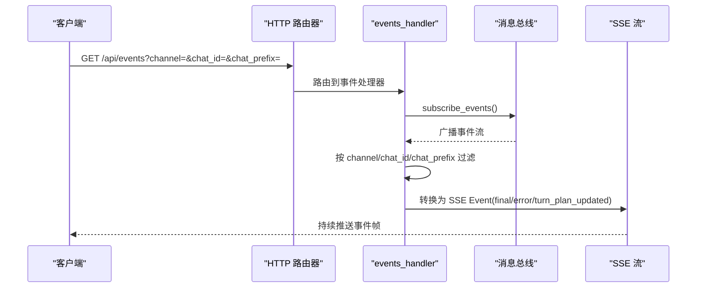
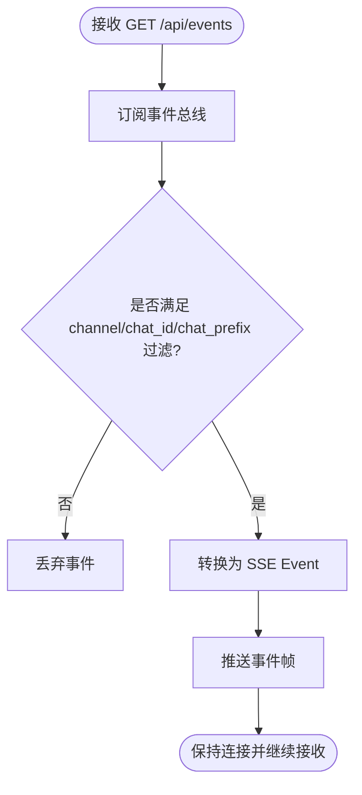
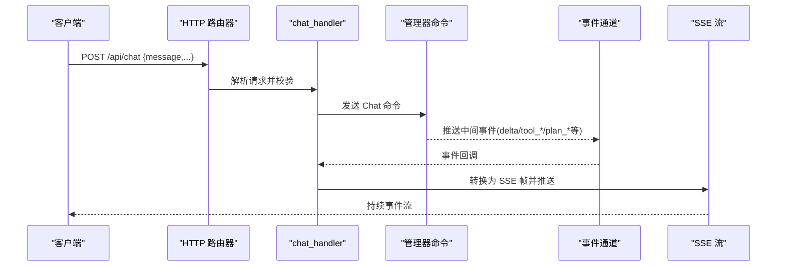
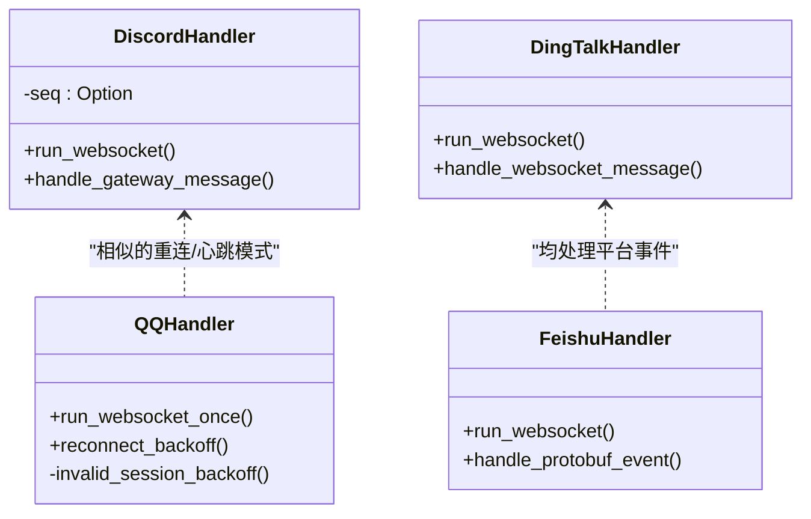
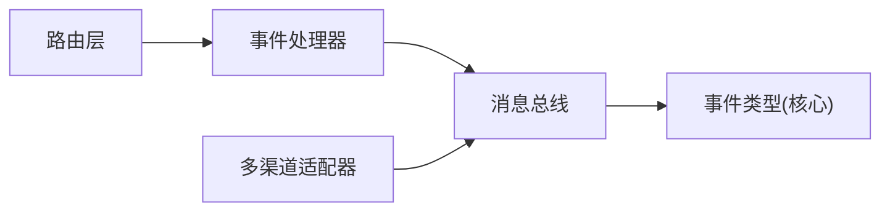

# WebSocket 实时通信

<cite>
**本文引用的文件**
- [server.rs](file://agent-diva-manager/src/server.rs)
- [handlers.rs](file://agent-diva-manager/src/handlers.rs)
- [events.rs](file://agent-diva-core/src/bus/events.rs)
- [approvals.rs](file://agent-diva-manager/src/handlers/approvals.rs)
- [command_approvals.rs](file://agent-diva-manager/src/handlers/command_approvals.rs)
- [discord.rs](file://agent-diva-channels/src/discord.rs)
- [dingtalk.rs](file://agent-diva-channels/src/dingtalk.rs)
- [feishu.rs](file://agent-diva-channels/src/feishu.rs)
- [qq.rs](file://agent-diva-channels/src/qq.rs)
</cite>

## 目录
1. [简介](#简介)
2. [项目结构](#项目结构)
3. [核心组件](#核心组件)
4. [架构总览](#架构总览)
5. [详细组件分析](#详细组件分析)
6. [依赖关系分析](#依赖关系分析)
7. [性能考虑](#性能考虑)
8. [故障排查指南](#故障排查指南)
9. [结论](#结论)
10. [附录](#附录)

## 简介
本文件面向需要接入 Agent-Diva 实时事件流的客户端开发者，聚焦 /api/events 端点的连接建立、消息格式与事件类型，并说明聊天事件、系统事件、审批事件等不同类型的处理机制。同时提供客户端连接示例思路、事件处理流程、连接生命周期管理、重连策略与错误处理建议，以及性能优化和调试工具使用指南。

注意：本项目对外暴露的实时事件通道为 Server-Sent Events（SSE），而非传统 WebSocket；但内部各渠道（如 Discord、钉钉、飞书、QQ）与外部平台之间通过各自的 WebSocket 协议进行长连接。本文对“WebSocket”一词在两种语境下分别说明：
- 服务端对外：/api/events 使用 SSE 推送事件流。
- 服务端对内：多渠道适配器使用各自平台的 WebSocket 协议。

## 项目结构
- 路由注册与端口监听位于管理器服务中，统一挂载 REST/SSE 接口。
- 事件总线定义于核心模块，包含 AgentEvent、AgentBusEvent、InboundMessage、OutboundMessage 等类型。
- 处理器负责将内部事件转换为 SSE 帧，并支持按 channel/chat_id/chat_prefix 过滤。
- 多渠道适配器实现与第三方平台的 WebSocket 连接、心跳、断线重连与消息转发。

```mermaid
graph TB
Client["客户端"] --> |GET /api/events (SSE)| Router["HTTP 路由器"]
Router --> Handler["事件处理器 events_handler"]
Handler --> Bus["消息总线 subscribe_events()"]
Bus --> |广播事件| Stream["SSE 流"]
Stream --> Client
```

图表来源
- [server.rs:94-113](file://agent-diva-manager/src/server.rs#L94-L113)
- [server.rs:204-233](file://agent-diva-manager/src/server.rs#L204-L233)
- [handlers.rs:617-656](file://agent-diva-manager/src/handlers.rs#L617-L656)

章节来源
- [server.rs:94-113](file://agent-diva-manager/src/server.rs#L94-L113)
- [server.rs:204-233](file://agent-diva-manager/src/server.rs#L204-L233)

## 核心组件
- 事件类型与数据模型：AgentEvent、AgentBusEvent、InboundMessage、OutboundMessage 等，定义了聊天、计划、工具调用、重试、上下文压缩等事件。
- 事件处理器：将 AgentBusEvent 映射为 SSE Event，支持 final、error、turn_plan_updated 等事件类型，并可按 channel/chat_id/chat_prefix 过滤。
- 路由层：/api/events GET 返回持续的事件流；/api/chat POST 触发一次对话并返回该次对话的 SSE 流。
- 多渠道 WebSocket 适配器：Discord、钉钉、飞书、QQ 等通过各自 WebSocket 协议与平台交互，负责心跳、分片、重连与消息桥接。

章节来源
- [events.rs:59-145](file://agent-diva-core/src/bus/events.rs#L59-L145)
- [events.rs:147-213](file://agent-diva-core/src/bus/events.rs#L147-L213)
- [handlers.rs:583-656](file://agent-diva-manager/src/handlers.rs#L583-L656)
- [server.rs:204-233](file://agent-diva-manager/src/server.rs#L204-L233)

## 架构总览
下图展示了从客户端到事件总线的端到端流程，包括过滤器与 SSE 保持存活。



图表来源
- [server.rs:204-233](file://agent-diva-manager/src/server.rs#L204-L233)
- [handlers.rs:617-656](file://agent-diva-manager/src/handlers.rs#L617-L656)

## 详细组件分析

### /api/events 端点（SSE 事件流）
- 请求方法：GET
- 路径：/api/events
- 查询参数：
  - channel：可选，过滤特定渠道的事件
  - chat_id：可选，精确匹配会话 ID
  - chat_prefix：可选，前缀匹配会话 ID
- 响应：text/event-stream，持续推送事件帧
- 事件类型（由 AgentBusEvent 转换而来）：
  - final：最终响应内容，data 中包含 channel、chat_id、content
  - error：错误信息，data 中包含 channel、chat_id、message
  - turn_plan_updated：聊天回合中的轻量计划更新，data 中包含 channel、chat_id、args
- 其他未映射的 AgentEvent 将被忽略（不输出 SSE 帧）



图表来源
- [handlers.rs:617-656](file://agent-diva-manager/src/handlers.rs#L617-L656)
- [handlers.rs:583-615](file://agent-diva-manager/src/handlers.rs#L583-L615)

章节来源
- [handlers.rs:617-656](file://agent-diva-manager/src/handlers.rs#L617-L656)
- [handlers.rs:583-615](file://agent-diva-manager/src/handlers.rs#L583-L615)

### /api/chat 端点（单次对话的 SSE 流）
- 请求方法：POST
- 路径：/api/chat
- 请求体字段（部分）：
  - message：必填，用户消息
  - channel：可选，默认 "api"
  - chat_id：可选，默认 "default"
  - mode：可选，执行模式（agent/plan/ask）
  - approval_policy：可选，审批策略覆盖
  - execution_start/plan_id/plan_revision/execution_id：可选，用于执行上下文
  - attachments：可选，附件列表
- 响应：text/event-stream，推送本次对话过程中的多种事件，包括但不限于：
  - delta：助手增量文本
  - reasoning_delta：推理增量文本
  - tool_start/tool_finish/tool_delta：工具调用开始/结束/增量
  - todo_created/todo_step_updated/todo_completed/todo_cancelled：待办项状态变化
  - plan_ready_for_approval/plan_report_ready_for_approval：计划或报告就绪待审批
  - turn_plan_updated：聊天回合计划更新
  - provider_retry/provider_stalled：提供商重试/停滞提示
  - context_compaction：上下文压缩进度
  - final：最终响应
  - error：错误信息



图表来源
- [handlers.rs:137-351](file://agent-diva-manager/src/handlers.rs#L137-L351)

章节来源
- [handlers.rs:137-351](file://agent-diva-manager/src/handlers.rs#L137-L351)

### 事件类型与数据模型
- AgentEvent：定义所有代理产生的事件，包括迭代、助手增量、推理增量、工具调用、待办项、计划相关、最终响应、错误、提供商重试/停滞、上下文压缩等。
- AgentBusEvent：携带 channel、chat_id 与具体事件的包装，便于跨模块广播。
- InboundMessage/OutboundMessage：入站/出站消息模型，包含 channel、chat_id、内容、媒体、元数据等。

章节来源
- [events.rs:59-145](file://agent-diva-core/src/bus/events.rs#L59-L145)
- [events.rs:147-213](file://agent-diva-core/src/bus/events.rs#L147-L213)

### 审批事件流（独立 SSE 端点）
- 审批事件通过独立的 SSE 端点提供，供前端轮询或订阅审批中心。
- 典型用法：获取待审批列表、拉取审批事件流、提交决策。
- 事件流内容包含审批详情、版本、状态、呈现信息等。

章节来源
- [approvals.rs:394-628](file://agent-diva-manager/src/handlers/approvals.rs#L394-L628)
- [command_approvals.rs:1-52](file://agent-diva-manager/src/handlers/command_approvals.rs#L1-L52)

### 多渠道 WebSocket 适配器（内部长连接）
- Discord：基于 Gateway WebSocket，维护序列号、心跳间隔、识别与重连逻辑。
- 钉钉：Stream 模式 WebSocket，建立连接后处理系统消息与事件，并发送确认响应。
- 飞书：使用 protobuf frames，支持分片消息重组，仅处理 event 类型消息。
- QQ：完整的握手、心跳、重连退避、无效会话风暴检测与冷却策略。



图表来源
- [discord.rs:542-569](file://agent-diva-channels/src/discord.rs#L542-L569)
- [dingtalk.rs:529-675](file://agent-diva-channels/src/dingtalk.rs#L529-L675)
- [feishu.rs:341-380](file://agent-diva-channels/src/feishu.rs#L341-L380)
- [feishu.rs:548-576](file://agent-diva-channels/src/feishu.rs#L548-L576)
- [qq.rs:413-835](file://agent-diva-channels/src/qq.rs#L413-L835)

章节来源
- [discord.rs:542-569](file://agent-diva-channels/src/discord.rs#L542-L569)
- [dingtalk.rs:529-675](file://agent-diva-channels/src/dingtalk.rs#L529-L675)
- [feishu.rs:341-380](file://agent-diva-channels/src/feishu.rs#L341-L380)
- [feishu.rs:548-576](file://agent-diva-channels/src/feishu.rs#L548-L576)
- [qq.rs:413-835](file://agent-diva-channels/src/qq.rs#L413-L835)

## 依赖关系分析
- 路由层依赖 handlers 提供的处理器函数。
- 事件处理器依赖消息总线进行事件订阅与过滤。
- 事件类型定义在核心模块，被管理器与服务端共享。
- 多渠道适配器与外部平台通过各自的 WebSocket 协议交互，并将事件桥接到内部消息总线。



图表来源
- [server.rs:94-113](file://agent-diva-manager/src/server.rs#L94-L113)
- [handlers.rs:617-656](file://agent-diva-manager/src/handlers.rs#L617-L656)
- [events.rs:59-145](file://agent-diva-core/src/bus/events.rs#L59-L145)

章节来源
- [server.rs:94-113](file://agent-diva-manager/src/server.rs#L94-L113)
- [handlers.rs:617-656](file://agent-diva-manager/src/handlers.rs#L617-L656)
- [events.rs:59-145](file://agent-diva-core/src/bus/events.rs#L59-L145)

## 性能考虑
- 使用查询参数过滤事件：通过 channel/chat_id/chat_prefix 减少不必要的事件传输与处理开销。
- 合理设置 SSE KeepAlive：避免频繁保活导致带宽浪费。
- 批量处理与节流：前端可对高频事件（如 delta、tool_delta）进行合并渲染，降低 UI 刷新压力。
- 重连退避：参考多渠道适配器的指数退避策略，避免雪崩式重连。
- 资源隔离：不同 channel/chat_id 的订阅可分离，避免单一大流影响整体性能。

[本节为通用指导，无需引用具体文件]

## 故障排查指南
- 连接失败：检查网络连通性与服务器地址，确认 /api/events 路由已正确挂载。
- 无事件推送：确认查询参数是否正确，确保 channel/chat_id/chat_prefix 与实际事件一致。
- 事件丢失：检查上游消息总线是否正常，必要时增加日志级别观察事件流转。
- 审批事件异常：确认审批端点可用，检查事件流内容与版本控制逻辑。
- 多渠道 WebSocket 问题：查看对应适配器日志，关注心跳、分片、重连与关闭信号。

章节来源
- [server.rs:204-233](file://agent-diva-manager/src/server.rs#L204-L233)
- [handlers.rs:617-656](file://agent-diva-manager/src/handlers.rs#L617-L656)
- [approvals.rs:394-628](file://agent-diva-manager/src/handlers/approvals.rs#L394-L628)
- [discord.rs:542-569](file://agent-diva-channels/src/discord.rs#L542-L569)
- [dingtalk.rs:529-675](file://agent-diva-channels/src/dingtalk.rs#L529-L675)
- [feishu.rs:341-380](file://agent-diva-channels/src/feishu.rs#L341-L380)
- [qq.rs:413-835](file://agent-diva-channels/src/qq.rs#L413-L835)

## 结论
本项目通过 /api/events 提供稳定的 SSE 事件流，支持按渠道与会话过滤，适用于构建实时界面与监控面板。内部多渠道适配器使用各自平台的 WebSocket 协议，具备完善的心跳、分片与重连机制。客户端应结合查询参数与事件类型，设计合理的连接生命周期、重连策略与错误处理，以获得稳定高效的实时体验。

[本节为总结性内容，无需引用具体文件]

## 附录

### 客户端连接示例（思路）
- 使用浏览器 EventSource 或 fetch + ReadableStream 连接 /api/events，附加查询参数以过滤事件。
- 监听事件帧，根据 event 字段区分 final、error、turn_plan_updated 等类型，并解析 data 字段。
- 对于 /api/chat，发起 POST 请求获取一次性对话的 SSE 流，处理 delta、tool_*、plan_*、final、error 等事件。

章节来源
- [server.rs:204-233](file://agent-diva-manager/src/server.rs#L204-L233)
- [handlers.rs:137-351](file://agent-diva-manager/src/handlers.rs#L137-L351)
- [handlers.rs:617-656](file://agent-diva-manager/src/handlers.rs#L617-L656)

### 连接生命周期管理与重连机制
- 连接建立：GET /api/events，保持长连接直至客户端断开或服务端关闭。
- 断线恢复：检测到连接中断时，采用指数退避策略重新连接，避免频繁重试。
- 心跳与保活：服务端启用 KeepAlive，客户端需正确处理超时与重连。
- 错误处理：捕获网络错误与解析错误，记录日志并提示用户。

章节来源
- [discord.rs:599-632](file://agent-diva-channels/src/discord.rs#L599-L632)
- [dingtalk.rs:529-675](file://agent-diva-channels/src/dingtalk.rs#L529-L675)
- [qq.rs:413-835](file://agent-diva-channels/src/qq.rs#L413-L835)

### 调试工具使用指南
- 使用浏览器开发者工具的 Network 面板查看 SSE 流与事件帧。
- 使用 curl 或 HTTP 客户端测试 /api/events，验证查询参数与事件过滤。
- 查看服务端日志，定位事件生成与分发环节的问题。
- 针对多渠道 WebSocket，使用平台提供的调试工具或抓包工具分析握手与心跳。

[本节为通用指导，无需引用具体文件]